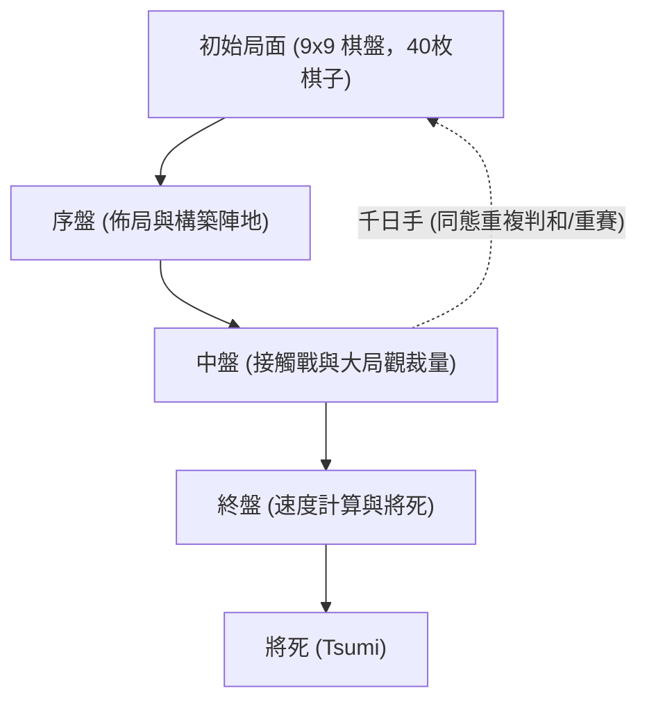

# 棋盤遊戲與人工智慧：日本將棋的規則、戰略模式與AI進化史

作為日本歷經數百年沉澱的傳統智力瑰寶， **將棋** （Shogi / 日本象棋）以其深邃的戰術縱深與動態變化，長期吸引著全球棋手與學者。在電腦科學與人工智慧（AI）領域，將棋更是長達數十年的標誌性研究基準。1997 年 IBM 的「深藍」（Deep Blue）攻克西洋棋之後，AI 領域下一座高聳的學術堡壘便是日本將棋——一種因獨特的「持駒」規則與天文級分支因子而極難被暴力計算攻破的博弈遊戲。

本文將從基礎規則出發，系統闡述將棋的核心複雜度、三大對局階段的經典戰略模式，梳理將棋 AI 從傳統啟發式搜尋到深度強化學習的技術躍遷，並深入探討人工智慧對當代職業棋壇與棋藝研究帶來的顛覆性範式轉變。

## 1. 將棋規則與特異性：為何將棋的計算空間如此浩瀚？

將棋是在 $9 \times 9$ 棋盤上進行的雙人零和有限確定完全資訊博弈。對局雙方執 20 枚棋子，終極目標與西洋棋相同：將死對方的「王將（玉將）」。

將棋區別於西洋棋、中國象棋等棋類的最具革命性的特異規則在於 **持駒** （Mochigoma / 捕獲子再次利用）。在對局中吃掉對方的任何棋子，都不會移出棋局，而是進入己方「持駒」儲備池。在後續對局中，棋手可隨時將儲備的棋子作為己方戰力「打入」棋盤任意未被佔領的合法格子。

這一規則在本質上改變了博弈樹的幾何演化。在西洋棋中，子力的兌換會直接縮減盤面棋子總數，使得終局計算迅速收斂；而在將棋中，吃子並不減少子力總數，反而極大拓展了盤面可用棋子儲備，導致對局越到後期，每一步的可選分支不但不縮水，甚至呈爆炸式劇增。

在組合賽局理論中，衡量博弈規模的核心指標包括 **狀態空間複雜度** （State-space complexity）與 **博弈樹複雜度** （Game-tree complexity）：

$$
\text{狀態空間複雜度} \approx 10^{71}
$$
$$
\text{博弈樹複雜度} \approx 10^{226}
$$

對比西洋棋（狀態空間約為 $10^{47}$，博弈樹複雜度約為 $10^{123}$），將棋的計算難度堪稱天文級別。將棋每回合平均有效走法高達 80 種左右（西洋棋僅約為 35 種）。如果缺乏高精度的局面剪枝與精準的大局觀評估函數，任何超級電腦都將在龐大的博弈樹中迷失。

## 2. 對局推進與核心戰略模式

一局標準的將棋對決通常劃分為三個緊密相連的階段：序盤（Opening）、中盤（Middle Game）與終盤（End Game）。各階段均具有鮮明的戰略訴求：

### 1. 序盤：佈陣、圍玉與戰型抉擇
序盤的核心在於調動初始子力，構建防守陣地（圍玉），同時為後續進攻蓄力。將棋戰法最核心的分類依據在於主力進攻子「飛車」的初始運用：

- **居飛車（Ibisha）** ：將飛車保留在初始右翼位置作戰。典型戰型包括矢倉（Yagura）、角交換（Kakugawari）、相掛（Aigakari）等，講求陣地嚴謹與正面硬碰硬的戰術推演。
- **振飛車（Furibisha）** ：將飛車橫向轉移至左翼或中路作戰。典型戰型包括四間飛車、三間飛車、中飛車等，更側重靈活多變的子力騰挪與防守反擊。

與此同時，保護主帥的「圍玉」（Castle）至關重要。例如以防禦堅韌著稱的 **美濃圍** （Mino Castle）與防禦力極度致密的 **穴熊** （Anaguma），為王將構築起抗擊突襲的安全堡壘。

### 2. 中盤：子力交鋒與大局觀裁量
中盤始於雙方戰線發生實質性接觸。該階段考驗棋手深入局部的「讀棋」（計算力）與總攬全盤的「大局觀」：

- **手筋（Tesuji）** ：局部極為高效的定式技巧。例如透過叩步（Tatakino-fu）打亂敵方防線，或利用飛車的「十字飛車」製造致命雙重打擊。
- **子力價值與子力活性（Sabaki）** ：將棋並非單純統計誰吃子更多（駒得），更重要的是盤面棋子的運轉效率與協同性（避免出現無法參戰的死子或呆子）。

在中盤發起總攻（仕掛）的時機選擇至關重要，過早進攻會導致破綻百出，拖延進攻則可能錯失勝機。

### 3. 終盤：速度計算與將死技巧
與西洋棋沉悶的技術性殘局截然不同，將棋終盤是一場生死時速的對攻競賽。由於雙方手握海量持駒可直接空降，絕對防禦幾乎不可能長久維持。

- **速度計算（Sokudo）** ：終盤並不追求絕對的安全，而是精確比較「自玉被將死的回合數」與「對方玉將死的回合數」。即便己方陣地支離破碎，只要比對手先一步將死敵王即可獲勝。
- **將死（Tsumi）與必至（Hisshi）** ：敵玉無論如何逃脫均被吃掉的狀態稱為「詰（將死）」；而無論對手下一步如何防守，下一回合必然被將死退路斷絕的狀態稱為「必至」（Brinkmate）。透過練習「詰將棋」，棋手能夠淬鍊出極高密度的終盤深度計算能力。

## 3. 將棋 AI 的技術躍遷史

將棋 AI 的進化史是現代電腦科學突破的絕佳縮影。它走過了一條從手工死記硬背到自主博弈進化的壯闊道路。

### 早期探索：手工規則與極小化極大演算法
20 世紀 80 至 90 年代，早期將棋軟體主要依賴極小化極大（Minimax）與阿爾法-貝塔剪枝演算法，配合開發者與棋手手工編織的評估函數。人們手動為子力價值、王將安全度以及控制格賦予靜態權重。

然而，面對將棋浩瀚的可能走法與持駒引發的複雜性，人工編寫的規則漏洞百出，當時的軟體實力甚至無法擊敗業餘高水準愛好者。

### Bonanza 的革命：機器學習評估函數的引入 (2005)
2005 年，保木邦仁開發的 **Bonanza** 徹底顛覆了傳統棋類 AI 的研發範式。Bonanza 摒棄了人工調參，開創性地提出了利用大量職業高數萬局真實棋譜，透過機器學習自動優化數萬個局部子力組合權重的方法（即著名的「Bonanza Method」或 KPP/KKP 評估法）。

這種讓電腦自主從真實大師棋譜中感悟全局協調性的架構，使得將棋 AI 的棋力發生了質的飛躍，成為後續所有頂尖將棋軟體的基石。

### 電王戰與 AI 超越人類 (2012–2017)
進入 2010 年代，AI 的實力已逼近人類巔峰。在多屆「將棋電王戰」中，包括 *GPS將棋*、*屋簷裡王（YaneuraOu）* 和 *Ponanza*（山本一成開發）在內的頂尖軟體接連擊敗一流職業棋士。

終局性時刻發生在 2017 年春天：在第二期電王戰中，當時的日本最高榮譽頭銜保持者 **佐藤天彥名人** 以 0 比 2 完敗給軟體 **Ponanza** 。這一戰標誌著人工智慧在將棋領域正式全面超越人類頂尖智力。

### AlphaZero 與深度神經網路時代
2017 年底，Google DeepMind 推出了震驚世界的 **AlphaZero** 。AlphaZero 不依賴任何人類棋譜，僅依靠基礎遊戲規則，透過自我對弈（強化學習）與蒙地卡羅樹搜尋（MCTS），僅僅耗時數小時便完勝了當時的電腦將棋世界冠軍軟體 *elmo*。

如今，採用深度卷積神經網路（DNN）架構的 **dlshogi** 與基於高效神經網路（NNUE）技術的 **水匠** （Suisho）等開源引擎百花齊放。如今在普通家用電腦或便攜設備上運行的將棋軟體，其計算精度與大局觀已遠超昔日歷史名宿。

## 4. 人工智慧引發的將棋界範式轉變

AI 擊敗人類並未讓將棋沒落，反而為這項古老藝術注入了前所未有的生機，重塑了現代將棋的生態體系：

### 1. 傳統定式的顛覆與重構
傳統棋理往往強調陣地嚴密，傾向於深壘堅城（如固若金湯的穴熊圍）。然而，AI 的精確勝率評估揭示出：過度加固陣地會白白浪費戰術先手權。AI 更青睞輕巧平衡、王將微動卻極具反擊彈性的嶄新佈局。許多塵封已久的古老下法被 AI 賦予新生，層出不窮的「AI流定式」成為今日職業賽場的主流標配。

### 2. AI 成為不可或缺的科研工具
從日本棋院「獎勵會」的青年學徒，到當代八冠王藤井聰太等頂尖棋士，日常高強度借助 AI 進行覆盤與戰術推演已成為行業準則。透過評估走法與「AI 第一候選手的一致率」，職業棋手不斷突破自身思維盲區。

### 3. 「人類特質」與競技精神的昇華
AI 絕對真理的存在，反而襯托出人類競技的無限魅力。緊迫用時下的極限抉擇、呼吸相聞的心理博弈、在絕境中的靈感閃現——這些充滿溫度的人性較量才是觀賽者心潮澎湃的源泉。正因為知道絕對無誤的最優解何其嚴苛，人類棋手在深淵邊緣展現的決斷力與意志品質才顯得尤為崇高。

## 5. 結語：人工智慧與棋盤博弈的廣闊未來

日本將棋與 AI 的交匯，不僅譜寫了一段電腦科學攻堅克難的傳奇，更為人機協同進化的未來提供了經典範式。AI 沒有殺死將棋，而是扮演了最嚴厲的導師與最強大的同行者，引領人類棋藝以超越過去數百年的速度迅猛進化。

不僅如此，在攻克將棋浩瀚博弈樹過程中淬煉出的 **高維狀態剪枝** 、 **神經評估網路架構** 與 **強化學習自主進化範式** ，正廣泛輻射至物流路徑運籌、生物分子折疊、量化金融決策以及自動駕駛控制等核心領域。

方寸棋盤之間的智慧交融證明：機器計算的巔峰並未消弭棋藝的浪漫，反而將其照耀得更加燦爛奪目。

---

*參考文獻*
- Hoki, K. (2006). "Bonanza: The Shogi Program Using Automatic Parameter Tuning". *IPSJ SIG Notes*.
- Silver, D., et al. (2018). "A general reinforcement learning algorithm that masters chess, shogi, and Go through self-play". *Science*, 362(6419), 1140-1144.
- 日本將棋聯盟與 Dwango 官方電王戰技術檔案與對局記錄。
