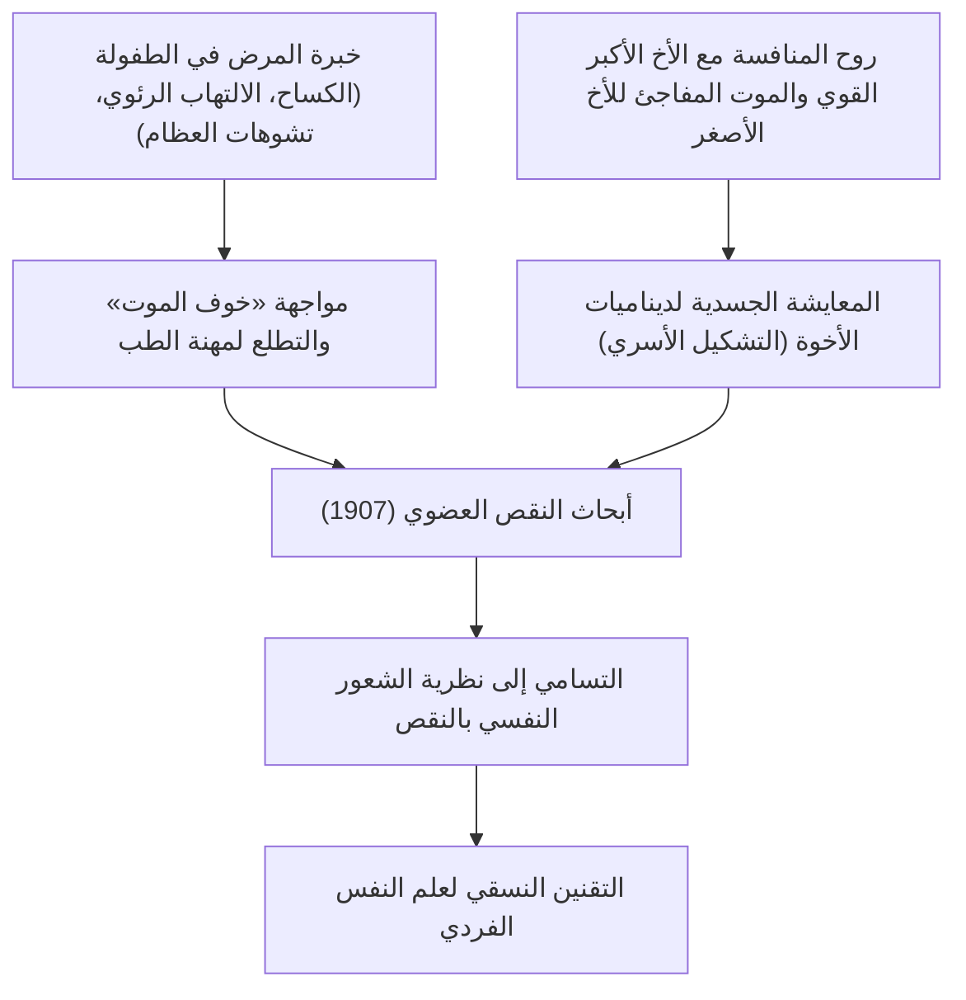
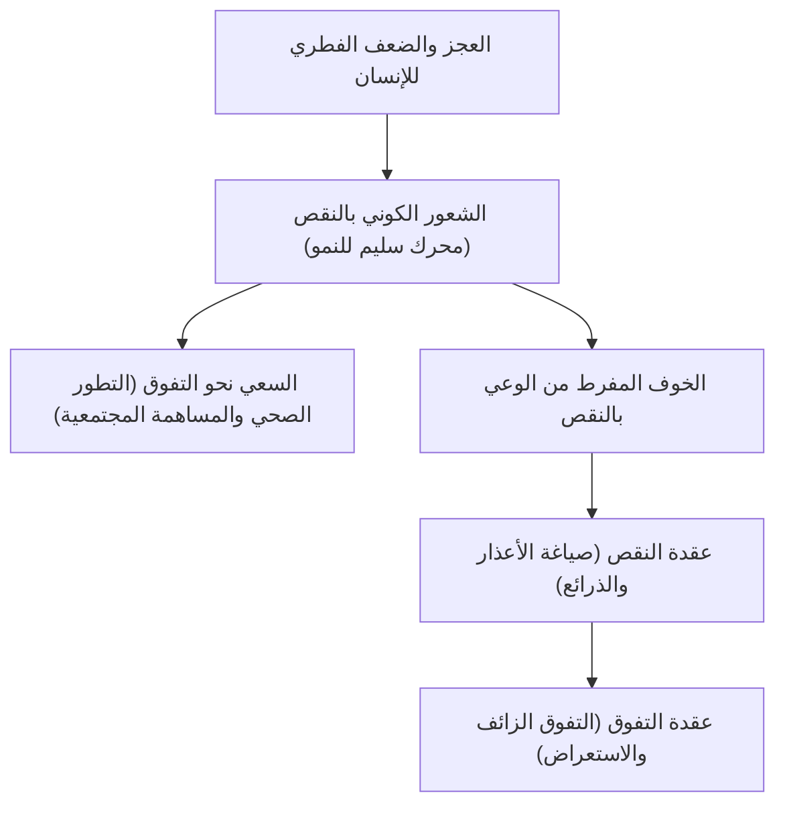
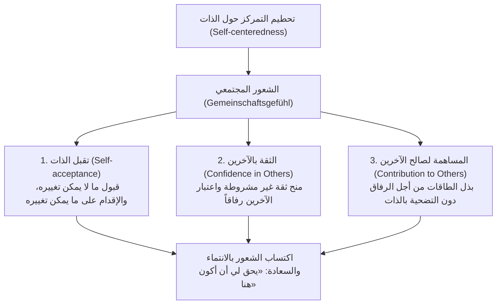
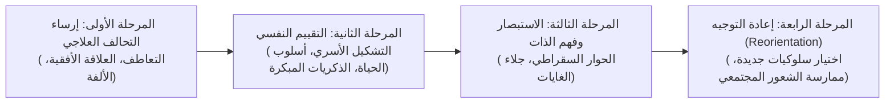

## مقدمة: لماذا ألفريد أدلر اليوم؟

في خضم تيارات علم النفس العميق التي انبثقت في فيينا مطلع القرن العشرين، لا يزال «علم النفس الفردي (Individual Psychology / بالألمانية: Individualpsychologie)» الذي أسسه ألفريد أدلر (Alfred Adler, 1870–1937) يشع براهنية عملية وفكرية فريدة لا نظير لها في العصر الحديث.

فبينما أرسى سيغموند فرويد (Sigmund Freud) دعائم «الحتمية النفسية (Psychic Determinism)» المستندة إلى الدوافع الغريزية اللاشعورية (الليبيدو) وصدمات الماضي، وغاص كارل غوستاف يونغ (Carl Gustav Jung) في اللجج الأسطورية للأنماط البدائية واللاشعور الجمعي، شقّ أدلر أفقاً شديد الوضوح والإشراق، متجهاً بحزم نحو «الواقع الاجتماعي الفعلي والمستقبل الذي يعيش فيه الإنسان».

يرتكز جوهر رؤية أدلر للإنسان على قناعة راسخة مفادها: «إن الإنسان ليس كائناً سلبياً تحركه أحداث الماضي ميكانيكياً، بل هو كائن متكامل ومبدع، يسعى بفاعلية نحو غايات صاغها بنفسه». واللفظة "Individual" التي أطلقها على مدرسته مشتقة من الكلمة اللاتينية *individuus* (أي الكيان غير القابل للتجزئة أو الانقسام). وبذلك، رفض أدلر رفضاً قاطعاً النزعة الاختزالية التي تقسم النفس البشرية إلى عناصر متنافرة مثل «الشعور واللاشعور»، أو «العقل والعاطفة»، أو «الهو والأنا والأنا الأعلى»، ناظراً إلى الإنسان بوصفه وحدة عضوية ونظاماً كلياً متكاملاً (الكلية الشاملة / Holism).

```
【مقارنة نماذج التيارات الثلاثة الكبرى في علم النفس العميق】

┌──────────────────┬───────────────────────────────┬───────────────────────────────┬───────────────────────────────┐
│ المدرسة / المؤسس │ سيغموند فرويد                 │ كارل غوستاف يونغ              │ ألفريد أدلر                   │
├──────────────────┼───────────────────────────────┼───────────────────────────────┼───────────────────────────────┤
│ اسم المدرسة      │ التحليل النفسي (Psychoanalysis) │ علم النفس التحليلي (Analytical)│ علم النفس الفردي (Individual)  │
│ الرؤية للإنسان   │ آلية وحتمية (الصدمة النفسية)  │ غائية ونمطية بدائية (أسطورية) │ ذاتية وكلية (الغائية والحرية) │
│ بنية النفس       │ شعور / ما قبل شعور / لاشعور   │ لاشعور شخصي / لاشعور جمعي     │ كل غير قابل للتجزئة (الكلية)  │
│ الدافع الجوهري   │ الليبيدو (الدافع الجنسي والعدوان)│ تكامل النفس (تحقيق الذات)     │ السعي نحو التفوق والشعور المجتمعي│
│ العلاج والمنهج   │ استرجاع المكبوت وتفريغ الانفعال│ تحليل الأحلام وتفريد الأنماط   │ إعادة توجيه أسلوب الحياة والتشجيع│
└──────────────────┴───────────────────────────────┴───────────────────────────────┴───────────────────────────────┘
```

لا يقتصر علم نفس أدلر على كونه مجرد فرع من فروع علم النفس الإكلينيكي؛ بل هو فلسفة وجودية عملية وفكر تربوي ديمقراطي يجيب عن السؤال الجوهري: «كيف يمكن للإنسان أن يتغلب على مشاعر النقص، ويتعاون مع الآخرين، ويكتسب الشعور بالانتماء والسعادة في هذه الحياة؟». تستعرض هذه الدراسة الموسعة نسق أدلر الفكري بصرامة أكاديمية شاملة، بدءاً من صراعه الفكري مع فرويد، مروراً بمبادئ الغائية، والشعور بالنقص وعقدة النقص، والسعي نحو التفوق، ومفهوم أسلوب الحياة، ومهام الحياة الثلاث، والشعور المجتمعي، وفصل المهام، وصولاً إلى امتداداته في العلاج المعرفي السلوكي (CBT) المعاصر وعلم النفس الإيجابي.

---

## 1. سيرة أدلر وتاريخ تشكل علم النفس الفردي

### 1.1 خبرة المرض في الطفولة والمشهد التأسيسي لـ «النقص العضوي»
ولد ألفريد أدلر في 7 فبراير 1870 في بينتسينغ، إحدى ضواحي فيينا عاصمة الإمبراطورية النمساوية المجرية، كابن ثانٍ لعائلة يهودية تعمل في تجارة الحبوب.

لفهم الأسس العميقة لعلم نفس أدلر، لا بد من العودة إلى تجاربه الجسدية القاسية خلال مرحلة الطفولة. فقد عانى أدلر صغيراً من مرض الكساح الحاد (الكساح العظمي)، مما أدى إلى تأخر نمو جهازه الحركي وعجزه عن المشي بشكل طبيعي حتى بلغ الرابعة من عمره. وفي سن الخامسة، أصيب بالتهاب رئوي حاد شارف به على الهلاك؛ حتى إنه سمع وهو ملقى على فراش المرض الطبيب المعالج يخبر والده بيأس: «لا أمل في نجاة هذا الصبي». وفي اللحظة التي تعافى فيها بأعجوبة من تلك الحالة الحرجة، ترسخت في وجدانه غاية واضحة (خيال موجه): «سأتغلب على المرض، وسأصبح طبيباً يقف في وجه رعب الموت».

تضافر مع ذلك شعور حاد بالتنافس والنقص إزاء شقيقه الأكبر "سيغموند"، الذي كان يتمتع بصحة بدنية ممتازة وبنية رياضية قوية، فضلاً عن تجربة وفاة شقيقه الأصغر المفاجئة وهو رضيع بجواره في الفراش. هذه الحقائق القاسية المتمثلة في الموت والمرض، والهشاشة البدنية، والمقارنة المؤلمة بين الإخوة، شكلت المنطلق التجريبي الراسخ لما طوره لاحقاً تحت مسميات: «النقص العضوي (Organ Inferiority)»، و«الشعور بالنقص (Inferiority Feeling)»، ونظرية «التشكيل الأسري (Family Constellation)».



### 1.2 جمعية الأربعاء النفسية في فيينا والقطيعة مع فرويد (1902–1911)
بعد تخرجه من كلية الطب بجامعة فيينا، بدأ أدلر مسيرته المهنية كطبيب عيون، ثم تحول إلى الطب الباطني العام، ومنه إلى الطب النفسي. ومن خلال فحصه لعدد كبير من الحرفيين وفناني السيرك في ملاهي "براتر" الشعبية والطبقات العمالية الكادحة، لفت انتباهه بقوة أن الأفراد الذين يعانون من نقاط ضعف خلقية أو مكتسبة في عضو معين (النقص العضوي)، يميلون إلى تطوير وظائف أعضاء أخرى أو قدرات نفسية مدهشة للتعويض عن ذلك النقص، وهي الظاهرة التي سماها «التعويض المفرط (Overcompensation)».

في عام 1902، وعلى إثر نشره مقالاً صحفياً يدافع فيه عن كتاب فرويد «تفسير الأحلام»، وجه إليه فرويد دعوة للانضمام إلى حلقة نقاشية مصغرة تعقد مساء كل أربعاء في منزل الأخير («جمعية الأربعاء النفسية»، التي أصبحت لاحقاً جمعية فيينا للتحليل النفسي). وبحلول عام 1910، أصبح أدلر رئيساً لجمعية فيينا للتحليل النفسي، وكان يُنظر إليه باعتباره الخليفة الأبرز والوريث العلمي لفرويد.

غير أن هذا التوافق لم يدم طويلاً. فقد أصر فرويد بعناد على مذهبه الجنسي الشامل (Pansexualism)، معتبراً أن أصل جميع الأمراض العصابية يعود إلى «الجنسية الطفولية (كبت الليبيدو وتثبيته)»، في حين رأى أدلر أن الدافع الجوهري للسلوك البشري ليس الجنس، بل هو «إرادة التغلب على الضعف والعجز الذاتي والوصول إلى التفوق»، و«النزعة العدوانية»، و«الرغبة في تأكيد الذات».

وفي عام 1911، وقع الصدع النهائي الحاسم. فخلال اجتماعات جمعية فيينا للتحليل النفسي، ألقى أدلر سلسلة من المحاضرات انتقد فيها نظرية فرويد الجنسية، وطرح نظريته الخاصة حول «الاحتجاج الذكوري (Masculine Protest)». اعتبر فرويد أطروحات أدلر «هرطقة تنكر صلب التحليل النفسي»، ورفض أي تسوية. استقال أدلر من رئاسة الجمعية ومن رئاسة تحرير مجلتها، وانسحب بصحبته تسعة أعضاء من زملائه. وفي العام التالي 1912، أطلق أدلر ومجموعته على تيارهم اسم «جمعية التحليل النفسي الحر»، وسرعان ما حولوها إلى «جمعية علم النفس الفردي (Society for Individual Psychology)». وبذلك، وُلد رسمياً «علم النفس الفردي» بوصفه مدرسة مستقلة تماماً ومغايرة جذرياً للتحليل النفسي الفرويدي.

---

## 2. الغائية في مواجهة السببية: تحول النموذج الإرشادي في علم النفس

### 2.1 حدود السببية الآلية (Causality) ونفي الصدمة النفسية
إن التحول الأكثر جذرية وثورية الذي يشكل العمود الفقري لعلم نفس أدلر هو نقده الصارم لـ «السببية (Causality)» وإحلال «الغائية (Teleology)» بدلاً منها.

فقد عمد الطب النفسي الكلاسيكي، وعلى رأسه فرويد والعلوم الحديثة، إلى تطبيق «مبدأ العلية» النيوتوني الميكانيكي على النفس البشرية؛ ومفاده أن «حدثاً ما في الماضي (أ) يسبب حتماً الحالة الراهنة (ب)». ومثال ذلك الزعم بأن: «فلاناً تعرض لسوء المعاملة والحرمان من المحبة في طفولته (أ)، ولذلك يعاني حالياً من الرهاب الاجتماعي والعجز عن التكيف مع المجتمع (ب)».

عارض أدلر هذه السببية الآلية بشدة؛ إذ رأى أن أحداث الماضي بحد ذاتها لا تحدد هوية الإنسان ومصيره. فلو كانت الصدمات النفسية في الماضي تملي سلوك الإنسان بصورة حتمية، لكان لزاماً على كل من نشأ في ظروف قاسية أن يصاب بالعصاب نفسه بلا استثناء، ولأُغلقت تماماً أبواب الإرادة الحرة والتعافي. وقد أكد أدلر ذلك بوضوح قاطع قائلاً:

> «لا توجد خبرة بحد ذاتها تكون سبباً لنجاحنا أو فشلنا. فنحن لا نعاني من صدمات خبراتنا ــ أي ما يُسمى بالتروما ــ بل نستخرج من بين ثنايا تجاربنا ما يتوافق مع غاياتنا الخاصة، ونضفي عليها المعنى الذي يناسبنا»
> (*What Life Could Mean to You*, 1931)

```
【المقارنة الإبستمولوجية بين السببية والغائية】

■ السببية (الحتمية والعلّية الفرويدية)
حقائق الماضي (سوء معاملة الوالدين، الفشل، الخذلان)
  -- "ارتباط سببي حتمي لا فكاك منه (حتمية خارجية)" -->
النتائج الحالية (الرهاب الاجتماعي، الانعزال، انعدام الدافعية)
※ الإنسان هنا دمية تحركها خيوط الماضي؛ وبما أن الماضي لا يتغير، يقع المرء في جبرية يائسة.

■ الغائية (نظرية الفعل والفاعلية الذاتية الأ Adlerية)
الغاية الخفية الحالية (تجنب الصدام مع الآخرين، تفادي التعرض للأذى النفسي)
  -- "اختيار الوسائل لتحقيق الغاية (إبداع داخلي)" -->
توليد الأعراض والمشاعر الحالية (اصطناع القلق، الغضب، أو الخوف)
※ أحداث الماضي ليست سوى أدوات ومواد خام يوظفها الإنسان لخدمة «غايته الراهنة».
```

### 2.2 بنية الغائية (Teleology) و«استخدام» المشاعر
وفقاً لمنظور الغائية عند أدلر، فإن سلوكيات الإنسان ومشاعره، بل وحتى أعراضه النفسية (مثل القلق، الاكتئاب، نوبات الهلع، الوساوس)، تُفهم جميعها على أنها «وسائل» واعية أو غير واعية يسعى الفرد من خلالها لتحقيق «غاية خفية (Hidden Goal)».

ولنأخذ على سبيل المثال مريضاً يعاني من اضطراب القلق الاجتماعي؛ حيث ترتعد أطرافه ويحمر وجهه ويعجز عن الكلام بمجرد وقوفه أمام الناس:
- **التفسير السببي**: «يعود ذلك إلى صدمة تعرض فيها للسخرية أمام زملائه في طفولته، مما أدى إلى تفعيل استجابة خوف شرطية لاشعورية».
- **التفسير الغائي**: «يحمل هذا الشخص غاية خفية مفادها: 'لا أريد أن أتعرض للإحراج أمام الناس' أو 'إذا فشلت وانكشفت قلة حيلتي فلن أتحمل ذلك'. ولتحقيق هذه الغاية، يخلق بنفسه أعراضاً جسدية كالارتجاف واحمرار الوجه، ليصنع عذراً مشروعاً (حجة غياب) يقول لنفسه وللآخرين من خلاله: 'أنا مريض، ولذلك لا أستطيع الظهور أمام الناس'».

والنقطة المحورية هنا هي أن المشاعر (كالغضب، والقلق، والحزن) ليست قوى بيولوجية غاشمة «تهاجم» الإنسان سلبياً من الخارج وتسيطر عليه، بل هي «أدوات يصطنعها الإنسان ويستخدمها» بفاعلية لخدمة غاياته.

وقد ضرب أدلر مثلاً شهيراً يُعرف بـ «نظرية الغضب كأداة»: تخيل أماً تصرخ في وجه طفلها بغضب عارم وانفعال شديد، وفي تلك اللحظة بالذات يرن الهاتف، ويكون المتصل هو معلم الفصل الخاص بالابن. في اللحظة التي ترفع فيها الأم سماعة الهاتف، ينقلب صوتها على الفور إلى نبرة غاية في التهذيب والهدوء والكياسة، وتجري حديثاً ودوداً مع المعلم، وبمجرد إغلاق السماعة، تعود فوراً إلى نوبة غضبها العارم لتصرخ في وجه ابنها مجدداً. فلو كان الغضب دافعاً فسيولوجياً قهرياً لا يمكن كبحه، لما أمكنها التحول في أجزاء من الثانية إلى حوار هادئ ورزين. لقد أثارت الأم انفعال الغضب واستخدمته عمداً كأداة لتحقيق غايتها المباشرة: «إخضاع الطفل بسرعة وإجباره على الانصياع لأوامرها».

في علم نفس أدلر، لا يُعد الإنسان عبداً لمشاعره وغرائزه، بل هو سيد ذو سيادة يختار مشاعره ويوظفها لخدمة غاياته الحياتية.

---

## 3. الشعور بالنقص، عقدة النقص، والسعي نحو التفوق

### 3.1 من النقص العضوي إلى الشعور الكوني بالنقص
في دراسته المبكرة الرائدة «أبحاث في النقص العضوي» (*Studie über Minderwertigkeit von Organen*, 1907)، حلل أدلر القصور الوظيفي للأعضاء الجسدية وكيفية تعامل الكائن الحي معها عبر آليات التعويض. فالكائن الذي يعاني من ضعف خلقي في القلب أو الكلى أو الحواس، يسعى عبر الجهود التعويضية للجهاز العصبي المركزي إلى التغلب على هذا الخلل.

وسرعان ما وسّع أدلر هذه البصيرة الفسيولوجية والباثولوجية لتشمل الفضاء النفسي بأكمله. فالكائن البشري، مقارنة بغيره من سائر الحيوانات، يولد في حالة شديدة الضعف والعجز؛ إذ لا يمتلك مخالب حادة، ولا أنياباً فتاكة، ولا فراءً يقيه الصقيع، ولا يمكنه البقاء على قيد الحياة ليوم واحد دون رعاية حانية من محيطه. ومن ثم، فإن كل طفل بشري يجد نفسه حتماً محاطاً ببالغين يملكون قوة هائلة، مما يجعله يعي بحدة ضعفه وصغره ونقصه الفطري.

أطلق أدلر على هذا التوتر النفسي الساعي إلى الانعتاق من حالة العجز اسم «الشعور بالنقص (Minderwertigkeitsgefühl / Inferiority Feeling)». والأمر الجوهري الحاسم عند أدلر هو أن **الشعور بالنقص بحد ذاته ليس مرضاً أو باثولوجيا، بل هو المحرك الطبيعي والصحي والكوني لتطور الإنسان ونموه (Engine of Growth)**.



### 3.2 التمييز المفاهيمي الدقيق بين الشعور بالنقص وعقدة النقص
في التداول اليومي، يُستخدم مصطلح "العقدة" غالباً كمرادف للشعور بالنقص، غير أن علم نفس أدلر يقيم فصلاً دقيقاً وحاسماً بين «الشعور بالنقص» و«عقدة النقص (Inferiority Complex)»:

1. **الشعور بالنقص (Inferiority Feeling)**:
   هو إحساس ذاتي بالنقص ينشأ من إدراك الفجوة بين واقع المرء الحالي والنموذج المثالي الذي يصبو إليه. وهو دافع صحي وبناء يدفع المرء للتغلب على التحديات والمهام عبر الجهد والتعلم، مثل القول: "تنقصني المعرفة الكافية في هذا المجال، لذا سأجتهد في الدراسة"، أو "مهارتي بحاجة إلى صقل، لذا سأضاعف التدريب".

2. **عقدة النقص (Inferiority Complex)**:
   هي حالة مرضية يتم فيها توظيف الشعور بالنقص كذريعة وعذر للهروب من مهام الحياة واستحقاقاتها. وتتمثل في بناء علّية وهمية مفادها: «بما أن (أ) كائن، فإنني عاجز عن فعل (ب)». مثل: "بما أنني لم أحصل على شهادة جامعية مرموقة، فلن أستطيع النجاح في حياتي"، أو "لأن شكلي ليس جذاباً، فلن أستطيع الزواج"، أو "لأن والديّ أساءا تربيتي، فلا يمكنني الانخراط في المجتمع".
   إن الشخص الذي يسقط في شباك عقدة النقص يتخلى عن السعي الجاد لحل مشكلاته بنفسه، ويتخذ من نقصه درعاً واقياً يحمي به غروره وكبرياءه من مواجهة الواقع.

### 3.3 عقدة التفوق وباثولوجيا إرادة القوة
حين يعجز الفرد الذي يعاني من عقدة النقص عن تحمل الألم النفسي الناجم عن مواجهة عجزه الحقيقي، فإنه يلجأ في كثير من الأحيان كحيلة دفاعية عكسية إلى ما يسميه أدلر بـ «عقدة التفوق (Superiority Complex)».

وتعني عقدة التفوق: الهروب إلى «تفوق زائف ومصطنع يوحي بأن المرء أرفع شأناً من الجميع»، بدلاً من بذل الجهد الحقيقي لتجاوز الصعوبات. وتتخذ هذه العقدة أشكالاً متعددة منها:

- **الاستناد إلى السلطة المستعارة**: التباهي بالعلاقات مع المشاهير وذوي النفوذ، أو التدرع بالماركات الفاخرة والمسميات الرنانة لإخفاء الهشاشة الداخلية.
- **التفاخر والتعلق بأمجاد الماضي**: الاستمرار في سرد البطولات الغابرة للتغطية على العجز الحاضر والتكاسل عن الفعل.
- **«التباهي بالبؤس» والسيطرة عبر دور الضحية**: الشكوى المتواصلة من قسوة الظروف والمعاناة الفائقة لجلب تعاطف الآخرين، وإشعارهم بالذنب والتلاعب بهم لابتزاز معاملة خاصة. وقد سمى أدلر هذا المسلك بـ «امتياز الضعف»، واعتبره من أشد أشكال عقدة التفوق استعصاءً على العلاج.

### 3.4 المسار السليم للسعي نحو التفوق (Striving for Superiority)
إن الدافع الأساسي الذي يدفع الإنسان للتغلب على مشاعر النقص أطلق عليه أدلر في بداياته مسميات مثل: «الدافع العدواني»، و«إرادة القوة»، و«الاحتجاج الذكوري»، غير أنه طور هذا المفهوم في أواخر حياته وصقله ليصبح المفهوم الأوسع والأكثر نضجاً: «السعي نحو التفوق (Striving for Superiority / أو السعي الدؤوب نحو الارتقاء)».

إن السعي السليم نحو التفوق لا يعني بأي حال من الأحوال «الانتصار في حلبة الصراع ضد الآخرين، وإلحاق الهزيمة بهم لإخضاعهم والسيطرة عليهم»؛ بل هو ببساطة: **«ألا يقارن المرء نفسه بالآخرين، بل يقارن نفسه بذاته المثالية، متجاوزاً حدوده الحالية خطوة إثر خطوة»**، في مسار ارتقاء أفقي ينظر فيه إلى الآخرين بوصفهم رفاقاً متساوين معه في الإنسانية. وحين يتجه السعي نحو التفوق في «مسار رأسي تراتبي (علاقات هيمنة وخضوع)»، فإنه يتحول إلى مستنقع للأمراض العصابية، أما حين يتجه نحو «مسار أفقي من التعاون (المساهمة في المجتمع)»، فإنه يغدو تحقيقاً إبداعياً وصحياً للذات.


---

## 4. الكلية وأسلوب الحياة: البنية المعرفية للفرد

### 4.1 الكلية (Holism): الإنسان ككل لا يتجزأ
تعد «الكلية (Holism)» البديهية الأولى والركيزة الأساسية لعلم نفس أدلر. فمنذ رينيه ديكارت، رائد العقلانية الحديثة، ظل الفكر الغربي خاضعاً لـ «ثنائية العقل والجسد» التي تفصل الروح عن البدن. وفي ميدان الطب النفسي، اقتفى فرويد الأثر ذاته عبر تجزيء النفس إلى مكونات متصارعة: «الشعور / اللاشعور» و«الأنا / الهو / الأنا الأعلى»، مصوراً الإنسان كحلبة للصراعات الداخلية (الصراع النفسي الداخلي).

رفض أدلر هذا المذهب الاختزالي التجزيئي رفضاً قاطعاً، مؤكداً أن الإنسان كل متكامل لا يقبل القسمة (Individual = in + dividual، أي غير القابل للتجزئة):
- «العقل» و«العاطفة» ليسا قطبين متضادين؛ فالعواطف تُخلق لتحقيق الغايات التي يسعى إليها العقل، وتعمل بتناغم وثيق معه.
- «الشعور» و«اللاشعور» ليسا خصمين متعاديين؛ بل هما وجهان لعملة واحدة يتحركان بتعاون تام نحو الغاية الواحدة ذاتها. وما اللاشعور في حقيقته إلا «مساحة الغايات التي لم يعبر عنها المرء لغوياً أو لم يعِها بعد».
- «النفس» و«الجسد» ليسا جوهرين مستقلين؛ فتسارع ضربات القلب والشعور بآلام المعدة عند مداهمة القلق الشديد ليسا إلا دليلاً حياً على استجابة النفس والجسد ككل متكامل لمواجهة الخطر.

لذا، لا يعترف علم نفس أدلر بالمبررات الثنائية التبريرية من قبيل: "كنت أعلم الصواب بعقلي، لكن مشاعري غلبتني"، أو "دفعني دافع لاشعوري للتصرف رغماً عن إرادتي". فالإنسان يُساءل بوصفه «كائناً كلياً متكاملاً (Whole Person)» يتحمل المسؤولية الكاملة عن أفعاله، فيقال: "أنا الذي استخدمت انفعال الغضب وصرخت في وجهه لأحقق تلك الغاية بعينها".

```
【الفارق البنيوي بين الاختزالية التجزيئية (فرويد) والكلية (أدلر)】

■ النموذج الاختزالي التجزيئي (الانقسام النفسي عند فرويد)
┌──────────────────────────────────────────────┐
│ الأنا الأعلى (الأخلاق والقيم والمعايير)      │
├──────────────────────────────────────────────┤  ← صراع داخلي وانقسام
│ الأنا (العقل المتكيف مع الواقع)              │
├──────────────────────────────────────────────┤  ← كبت ومقاومة
│ الهو (الغرائز والشهوات اللاشعورية)           │
└──────────────────────────────────────────────┘
※ يؤدي إلى خداع الذات: «غلبت غريزتي عقلي» أو «اللاشعور هو الذي يسيرني رغماً عني».

■ نموذج الكلية الشاملة (الوحدة غير القابلة للتجزئة عند أدلر)
┌──────────────────────────────────────────────────────────────┐
│               الإنسان ككل متكامل (الذات غير القابلة للتجزئة) │
│                                                              │
│  وحدة غائية متكاملة:                                         │
│  العقل، العاطفة، الشعور، اللاشعور، والجسد كلها               │
│  تعمل بتناغم وتنسيق تام لتحقيق «غاية خفية واحدة (أسلوب الحياة)»│
└──────────────────────────────────────────────────────────────┘
※ المسؤولية الأخلاقية والنهائية عن جميع الأفعال والمشاعر تقع على عاتق «الأنا» المتكاملة.
```

### 4.2 أسلوب الحياة (Lifestyle): تعريفه وعناصره الثلاثة
المفهوم المركزي الذي يشير في علم نفس أدلر إلى مجمل الشخصية، والطباع، والرؤية الكونية، والأنماط المعرفية هو «أسلوب الحياة (Lifestyle / بالألمانية: Lebensstil)». وهو المفهوم الرائد الذي انبثقت منه لاحقاً مفاهيم «المخطط المعرفي (Schema)» والأطر الإدراكية في العلاج المعرفي الحديث.

إن أسلوب الحياة هو «النمط الثابت لإضفاء المعنى على الذات والعالم»، والذي يختاره الإنسان ويبنيه بنفسه في مرحلة الطفولة المبكرة (حوالي سن الرابعة إلى السادسة) للنجاة والتكيف وسط ظروفه الجسدية، وبيئته الأسرية، وسياقه الثقافي. وبمجرد أن يتشكل أسلوب الحياة، فإنه يعمل في مرحلة الرشد كبوصلة ومرشح إدراكي غير واعٍ تصب عبره كافة المدركات، والأفكار، والمشاعر، والسلوكيات.

ويتألف أسلوب الحياة في المدرسة الأدلرية من ثلاثة عناصر متداخلة:

1. **مفهوم الذات (Self-concept)**:
   قناعة الفرد ويقينه الراسخ حول هويته: «أنا أكون كذا...» ("أنا عاجز"، "أنا ذكي"، "أنا شخص غير محبوب").
2. **الذات المثالية (Self-ideal)**:
   المعايير الذاتية الصارمة التي يعتقد الفرد بوجوب الاتصاف بها: «يجب أن أكون كذا...» أو «ينبغي لي أن أكون كذا...» ("يجب أن أكون الأول دائماً"، "يجب أن يعاملني الجميع بلطف ومودة"، "لا يجوز لي أن أفشل على الإطلاق").
3. **الرؤية للعالم (Weltbild / Picture of the World)**:
   قناعات الفرد الراسخة حول بيئته والآخرين والمجتمع: «الآخرون والمجتمع هم كذا...» ("العالم مليء بالمخاطر"، "الناس أعداء يتحينون الفرص لاستغلالي"، "الحياة عبثية ولا يمكن التنبؤ بها").

فإذا كان أسلوب حياة شخص ما مبنياً على مفهوم ذات مفاده: "أنا ضعيف"، وذات مثالية تقضي بـ: "يجب ألا أتعرض للأذى مطلقاً"، ورؤية للعالم ترى أن: "الناس قساة ومهاجمون"، فإن هذا الشخص سيتخذ حتماً موقف الحذر المفرط في كل علاقة إنسانية، مفسراً أبسط الكلمات على أنها عداء مباشر، ومفضلاً الانعزال والانسحاب السلوكي. وهذا ليس خللاً عضوياً غامضاً، بل هو سلوك متسق ومنطقي وعقلاني تماماً انطلاقاً من أسلوب الحياة الذي تبناه بنفسه.

### 4.3 الأهمية التشخيصية للذكريات المبكرة (Early Recollections)
للكشف الموضوعي عن أسلوب الحياة اللاشعوري الذي يحرك الفرد، ابتكر أدلر تقنية إكلينيكية بالغة القوة هي تحليل «الذكريات المبكرة (Early Recollections)».

تقتضي هذه التقنية مطالبة العميل باسترجاع «أبكر ذكرى يستطيع تذكرها في حياته (عادة حوادث محددة وقعت قبل سن السادسة إلى الثامنة)»، وسرد تفاصيل المشهد، والأشخاص الحاضرين، وسلوكه الخاص، والمشاعر الدقيقة التي اختبرها في تلك اللحظة.

عامل فرويد ذكريات الطفولة كـ «آثار لوقائع ماضية» أو «مستحاثات لصدمات مكبوتة». أما أدلر، من منطلق نظرته الغائية، فقد نظر إلى الذكرى بوصفها «عملاً إبداعياً وسرداً معاد بناؤه واختياره ذاتياً من بين آلاف الأحداث الماضية لتبرير أسلوب الحياة الراهن وتعزيزه». فالإنسان لا يتذكر الماضي بحيادية كما وقع، بل يحتفظ فقط بالذكريات التي تخدم غاياته الراهنة ويصبغها بالألوان التي تلائمه.

```
【نموذج تحليل الذكريات المبكرة】

・محتوى الذكرى: «حين كنت في الخامسة، سقطت عن شجرة في الحديقة وأصبت قدمي، فهرعت أمي واحتضنتني»
  ↓
・زوايا التحليل:
  1. هل الفعل فاعل أم مفعول به؟ (هل تحرك بنفسه، أم انتظر حدوث شيء ما؟)
  2. ما هو دور الآخرين؟ (هل هم أعداء أهملوا الخطر، أم حماة يقدمون النجدة؟)
  3. كيف يدرك الفرد ذاته؟ (كائن عاجز وهش وسريع التأثر)
  ↓
・المعتقد المستخلص لأسلوب الحياة:
  «العالم مليء بالمخاطر، وأنا كائن عاجز سيتأذى إن لم يحترس.
   ولكن، إذا أظهرت ضعفي وطلبت المساعدة، فسيهب الآخرون لحمايتي ورعايتي بلطف»
  ↓
・التطابق مع نمط السلوك الحالي:
  عند مواجهة صعوبة في الحياة، لا يبادر بحلها بنفسه، بل يبرز مرضه أو ضعفه لاستدرار دعم الآخرين وتدخلهم.
```

أكد أدلر بحزم قائلاً: "إن صحة الذكرى المبكرة من الناحية التاريخية ــ سواء أكانت واقعة حقيقية أم وهماً وخيالاً ــ لا تهم على الإطلاق". فالمسألة الجوهرية هي: **«لماذا يصر هذا الشخص تحديداً على استبقاء هذا المشهد بالذات وحفظه حياً في ذاكرته من بين آلاف المشاهد الطفولية؟»**. إن الذكريات المبكرة تختزل في طياتها المخطط الهندسي الدقيق الذي يرى الفرد العالم من خلاله والاستراتيجية التي يتبعها لمواجهة صروف الدهر.

---

## 5. مهام الحياة الثلاث والشعور المجتمعي

### 5.1 مهام الحياة الثلاث (Life Tasks)
صاغ أدلر التحديات الحتمية التي لا مفر لأي إنسان من مواجهتها في الفضاء الاجتماعي تحت مسمى «مهام الحياة (Life Tasks / بالألمانية: Lebensaufgaben)». وقسمها إلى ثلاثة مستويات متدرجة: «مهمة العمل»، و«مهمة الصداقة»، و«مهمة الحب».

```
【تراتبية مهام الحياة الثلاث ومستوى صعوبتها】

［مهمة الحب (Love Task)］
・الموضوع: العلاقة الحميمة جداً مع الشريك، الزوج/الزوجة، والأسرة
・المتطلبات: أعلى درجات التقارب النفسي والبوح بالذات، وتقاسم المصير، والحفاظ على التكافؤ التام
・ذرائع الهروب: الخوف من القيود، الخيانة، الإيذاء النفسي (التنمر الأخلاقي)، الكمالية المفرطة

［مهمة الصداقة (Friendship Task)］
・الموضوع: الأصدقاء، الجيران، المجتمع المحلي، علاقات الرفقة الأفقية المتكافئة الخالية من المصالح
・المتطلبات: ثقة أفقية مجردة من التنافس، وإيثار، واعتراف متبادل
・ذرائع الهروب: «أخشى أن أُطعن في الظهر»، «لا أحد يفهمني في هذا الوجود»

［مهمة العمل (Work Task)］
・الموضوع: النشاط المهني، الإنتاج الاقتصادي، شبكة تقسيم العمل الاجتماعي
・المتطلبات: الامتثال للقواعد، التعاون الأساسي، والالتزام بالإنجاز
・ذرائع الهروب: الخوف من الفشل، الرعب من تقييمات الآخرين، المماطلة والتسويف، والرهاب الاجتماعي
```

1. **مهمة العمل (Work Task)**:
   هي المهمة التي تفرض على الإنسان، حفاظاً على بقائه البيولوجي، الانخراط في شبكة تقسيم العمل الاجتماعي وإنتاج قيم ومنافع تخدم الآخرين. وتعد هذه المهمة الأسهل نسبياً من حيث الصعوبة النفسية في العلاقات الإنسانية؛ نظراً لوضوح المصالح المادية فيها وضبط السلوك عبر القوانين والعقود الصريحة. ومع ذلك، فإن الهروب منها يقود إلى الإفلاس المادي والعجز الاجتماعي.

2. **مهمة الصداقة (Friendship Task)**:
   هي مهمة نسج علاقات رفاقية وصداقات خالصة بعيداً عن المصالح الاقتصادية المباشرة التي تفرضها بيئة العمل. وتتطلب هذه المهمة ثقة متبادلة قائمة على الندية والتكافؤ دون تنافس، والقدرة على البوح بنقاط الضعف بكل أمان. وهنا يتعثر الكثير من الناس ويضيقون دوائر علاقاتهم بدافع الشك وخشية التعرض للغدر والخيانة.

3. **مهمة الحب (Love Task)**:
   هي إقامة علاقة ثنائية وثيقة ومستمرة لا نظير لعمقها في الحياة، كالعلاقات العاطفية، والزواج، وتربية الأبناء. وبما أن المسافة النفسية بين الطرفين تتقلص هنا إلى الصفر تقريباً، فإن أدق عيوب الفرد ونقاط ضعفه التي يحرص على إخفائها تطفو حتماً على السطح. وتتطلب هذه المهمة التخلي التام عن الرغبة في الهيمنة على الشريك أو الاستجداء المرضي لاستحسانه، والسعي المشترك كشريكين متكافئين تماماً لتحقيق «سعادة الطرفين معاً»، ولذا فهي المهمة الأكثر صعوبة وتعقيداً بين مهام الحياة كافة.

ويرى أدلر أن كافة المعضلات النفسية (كالعصاب، والانعزال، والجنوح، وحالات الاكتئاب) تنشأ حين يقف المرء عاجزاً أمام هذه المهام، فيلجأ إلى الفرار منها واصطناع ما يُعرف بـ «أكذوبة الحياة (Life Lie / Lebenslüge)» خوفاً من فشل محتمل يجرح كبرياءه وغروره.

### 5.2 الأفق الكامل للشعور المجتمعي (Gemeinschaftsgefühl / Social Interest)
يمثل «الشعور المجتمعي (Gemeinschaftsgefühl / Social Interest)» الذروة الفلسفية والأخلاقية لعلم نفس أدلر ومفهومه الأكثر عمقاً على الإطلاق. وتترجم اللفظة الألمانية حرفياً بـ «الشعور بالجماعة» أو «الوعي المجتمعي»، بينما شاع في الأدبيات الإنجليزية استخدام مصطلح "Social Interest" (الاهتمام الاجتماعي).

يعرف الشعور المجتمعي في جوهره بأنه: **«التحول الجذري من التمركز حول الذات (Self-centeredness) إلى الاهتمام الصادق بالآخرين (Social Interest)»**، بحيث ينظر المرء إلى الآخرين بوصفهم «رفاقاً وإخوة» لا «أعداء ومنافسين»، ويشعر بالانتماء والأمان العميق القائل: «إن لي مكاناً أصيلاً وراسخاً في هذا المجتمع وفي هذا الكون».

وقد جزم أدلر بأن المقياس الأوحد والمطلق للصحة النفسية هو مدى رسوخ الشعور المجتمعي لدى الفرد. فالإنسان الخالي من الشعور المجتمعي يرى العالم كغابة موحشة وصراع للبقاء، ولا يرى في الآخرين سوى أعداء يهددونه أو أدوات يُسخرها لخدمة مآربه، فيظل يعاني من الوحدة المزمنة والقلق الوجودي، متخبطاً في صراعات عصابية طلباً لتفوق زائف.



### 5.3 الركائز الثلاث المكونة للشعور المجتمعي
لتنزيل مفهوم الشعور المجتمعي إلى حيز الممارسة الواقعية والإكلينيكية، قامت المدرسة الأدلرية المعاصرة بصياغته عبر ثلاث دعائم مترابطة عضوياً:

1. **تقبل الذات (Self-acceptance)**:
   يختلف جوهرياً عن «توكيد الذات الزائف (التفكير الإيجابي الساذج)». فبينما يمثل التفكير الإيجابي خداعاً للنفس بإيهامها بالقدرة بينما هي عاجزة ("أنا قادر على كل شيء")، فإن تقبل الذات هو «الاعتراف الصادق بالعجز والنقص والقصور كما هو دون مواربة، والامتلاك الشجاع للعزم على بذل أقصى الجهد لتغيير ما يمكن تغييره». وهذا يتماهى تماماً مع صلاة السكينة الشهيرة: ("اللهم امنحني السكينة لأتقبل الأشياء التي لا أستطيع تغييرها، والشجاعة لأغير الأشياء التي أستطيع تغييرها، والحكمة لأميز بينهما").

2. **الثقة بالآخرين (Confidence in Others)**:
   تختلف جذرياً عن «الائتمان المشروط (Credit)». فالائتمان المالي يعتمد على الرهون والضمانات وسجل المعاملات السابقة (كما تفعل البنوك)، بينما الثقة بالآخرين تعني منح الثقة للإنسان دون أي قيد أو شرط أو ضمان مسبق. بطبيعة الحال، يبقى احتمال التعرض للغدر والخيانة وارداً؛ ولكن حين يدرك المرء أن خيانة الآخر هي «مهمة تخص الآخر وحده»، وأن قراره هو بالثقة هو «مهمته الخاصة»، يتحرر تماماً من أسر الشك والريبة المرضية.

3. **المساهمة لصالح الآخرين (Contribution to Others)**:
   تختلف كلياً عن «التضحية بالذات (Self-sacrifice)». فاستنزاف المرء لحياته وصحته لإرضاء الآخرين ليس سوى تفانٍ عصابي تحركه الرغبة العارمة في نيل الاستحسان والتقدير. أما المساهمة السليمة للآخرين، فهي «أن يوظف المرء طاقاته ومواهبه طواعية لخدمة رفاقه في المجتمع، ليشعر بالقيمة والأثر والجدوى من وجوده». وقد أطلق أدلر مقولته الخالدة: «السعادة هي الشعور بالمساهمة». فالشعور بأنني مفيد للآخرين هو النبع الصافي الذي يمنح الإنسان اليقين بقيمته الذاتية، ويولد فيه شجاعة الحياة.

---

## 6. فصل المهام وسيكولوجية الشجاعة

### 6.1 البنية المنطقية لفصل المهام (Separation of Tasks)
يقدم علم نفس أدلر مبدأ «فصل المهام (Separation of Tasks)» كأداة جراحية حاسمة وفائقة الدقة لاجتثاث جذور الخلافات والتوترات في العلاقات الإنسانية.

فكل صدام، وتوتر، وضغط نفسي في العلاقات ينشأ إما من «التطفل الفج والتدخل في مهام الآخرين»، أو من «السماح للآخرين بالتدخل السافر في مهامنا الخاصة».

وقد وضع أدلر معياراً في غاية البساطة والوضوح للتمييز بين المهام وفصلها:
**«من هو الشخص الذي سيتحمل في نهاية المطاف النتائج والعواقب المترتبة على هذا الاختيار؟»**

```
【مثال تطبيقي على فصل المهام: قضية دراسة الأبناء】

・تفكير الوالدين (خلط المهام والتشابك):
  «إذا لم يدرس الابن فسيعاني في مستقبله، لذا يجب إجباره على المذاكرة بالقوة»
  ← تدخل سلطوي وتسلطي في مهمة الطفل (هيمنة وتحكم).
  ← يقاوم الطفل بعناد، ويبدأ في استخدام رفض الدراسة كـ «سلاح لمضايقة الوالدين والانتقام منهما».

・إعادة الترتيب وفق مبدأ فصل المهام:
  1. «من الذي سيتحمل في نهاية المطاف عواقب الدراسة أو عدمها، وتدني الدرجات والعجز عن دخول الجامعة المنشودة؟»
     ← إن من يتحمل النتيجة النهائية هو 【الطفل نفسه】 (مهمة الطفل).
  2. ما الذي يستطيع الوالدان فعله إذاً؟
     ← ليس إصدار الأوامر الصارمة بـ «ادرس!»، بل تهيئة بيئة مساعدة ومحفزة في حال رغب الطفل في طلب العون،
        وإيصال رسالة واضحة: «نحن نثق بقدراتك، ومستعدون لدعمك كلما طلبت ذلك» (الجاهزية للدعم والمرافقة الواعية).
```

إن فصل المهام لا يعني البتة اللامبالاة الباردة أو الإهمال والترك (Neglect). فالإهمال هو ألا يدري الوالد ماذا يفعل ابنه ولا يعيره أي اهتمام. أما أسلوب الدعم الأدري فيتلخص في المثل القائل: «يمكنك أن تقود الحصان إلى النهر، لكنك لا تستطيع إجباره على أن يشرب». فقرار شرب الماء يرجع للحصان نفسه، ومحاولة فتح فمه بالقوة وصب الماء في حلقه ليست سوى ضرب من العنف ومحاولة فرض السيطرة.

### 6.2 نفي الحاجة إلى الاستحسان وتعريف «الحرية»
كنتيجة منطقية حتمية للمضي في فصل المهام إلى أقصى مداه، ينفي علم نفس أدلر بشكل قاطع «الحاجة إلى الاستحسان والتقدير (Desire for Approval)» التي تكبل الإنسان المعاصر.

فوفقاً لأدلر، إن الشخص الذي تدفعه الرغبة العارمة في نيل ثناء الآخرين ورضاهم وتقييمهم الإيجابي لا يعيش في واقع الأمر حياته الخاصة، بل يعيش «حياة الآخرين». والسبب في ذلك أن الاكتراث برأي الناس يعني محاولة مستحيلة للتحكم في «مهمة الآخرين»، ألا وهي تقييمهم لنا.

إن «الحرية» الحقيقية في منظور علم نفس أدلر تتلخص في: **«ألا يخشى المرء أن يكرهه الآخرون»**.
إن محاولة استرضاء الجميع والتصرف كشخص محبوب من الكافة ليست سوى سلوك غير مخلص، وعذاب مستمر ينطوي على تزييف دائم لأسلوب حياة المرء. إن السير في الدرب الذي يوقن المرء بصوابه، وتقبل حقيقة أن محبة الناس أو كرههم له هي «مهمة تخصهم وحدهم» ولا طاقة له بالتحكم فيها، هما الشرط الجوهري للحرية الروحية. فالتصرف باستقلالية نابعة من الضمير والشعور بالمساهمة المجتمعية، بمعزل عن تقييمات الآخرين وتصفيقهم، هو المعنى الأصيل للحرية النفسية المسؤولة.


---

## 7. التشجيع (Encouragement) ونظرية التربية الديمقراطية

### 7.1 النقد الجذري لتربية الثواب والعقاب: خطورة المدح
من أجرأ الأطروحات وأكثرها إثارة للجدل في المنظومة التربوية والإكلينيكية لعلم نفس أدلر هي «المطالبة بالامتناع التام عن أسلوب الثواب والعقاب (سواء بالمدح أو بالتوبيخ)».

ففي الممارسات التربوية الشائعة وأساليب إدارة الشركات، يُنظر عادة إلى منهج "المدح من أجل التحفيز" باعتباره فضيلة تربوية لا غنى عنها. غير أن أدلر نفذ ببصيرته إلى الجوهر النفسي لفعل "المدح"؛ فـالمدح ينطوي بالضرورة على **«علاقة رأسية تراتبية ينظر فيها شخص يرى نفسه ذا قدرة ومكانة أعلى، إلى شخص أدنى منه ليقيمه ويوجهه ويتلاعب به»**. وإذا تأملنا كيف يشعر شخص بالغ حين يخاطبه شخص بالغ آخر على قدم المساواة بعبارات مثل "أحسنت صنعاً، أنت ولد صالح!"، لوجدنا أنها تبدو في غاية الغرابة والإهانة؛ وذلك بالتحديد لوجود ميزان قوى فوقي كامن في نية المادح.

```
【مقارنة بين نموذج «المدح والتوبيخ» ونموذج «التشجيع»】

┌──────────────────┬───────────────────────────────┬───────────────────────────────┐
│ المحور           │ تربية الثواب والعقاب (المدح / التوبيخ)│ التشجيع (Encouragement)       │
├──────────────────┼───────────────────────────────┼───────────────────────────────┤
│ منطلق العلاقة    │ علاقة رأسية (هيمنة وتلاعب وتبعية)│ علاقة أفقية (تكافؤ واحترام وثقة)│
│ معيار التقييم    │ النتيجة والقدرة والمقارنة بالآخرين│ المسار والنية والمقارنة بالذات │
│ الأثر النفسي     │ رغبة في الاستحسان، خوف من الفشل│ ثقة بالنفس، استقلالية، ومساهمة│
│ طبيعة الدافع     │ دافع خارجي (لنيل مكافأة أو تفادي عقاب)│ دافع داخلي (مساهمة طوعية للجماعة)│
│ العبارات النموذجية│ «أنت عبقري!»، «ممتاز لنيلك العلامة الكاملة»│ «شكراً لمساعدتك لي»، «أنا ممتن لوجودك»│
└──────────────────┴───────────────────────────────┴───────────────────────────────┘
```

ويؤكد أدلر أن الخطر الأكبر الكامن في "المدح" هو أنه يغرس في نفوس الأطفال والمرؤوسين إدماناً خطيراً على طلب الاستحسان، فيصل بهم الحال إلى ألا يتحركوا إلا إذا وُعدوا بالثناء، وأن يشعروا بانعدام قيمتهم إن غاب تقييم الآخرين. بل وأكثر من ذلك: يصبح عدم تلقي المدح في نظرهم بمثابة "عقاب"، فينشأ لديهم رعب جارف من الفشل يمنعهم من خوض أي تجربة جديدة.

وعلى الجانب الآخر، يعد "التوبيخ" سلوكاً أكثر عنفاً وفظاظة؛ فالتوبيخ ليس سوى إفلاس في لغة الحوار العقلاني البناء، ولجوء سهل إلى سلطة الغضب لإخضاع الطرف المقابل بالقوة. والشخص الذي يتعرض للتوبيخ لا يراجع أخطاءه بصدق ومسؤولية، بل تتضخم في داخله مشاعر الدفاع عن النفس والبحث عن سبل التخفي، والتحين للفرص المناسبة للثأر والانتقام.

### 7.2 تقنيات التشجيع (Encouragement) والعلاقات الأفقية
البديل الإيجابي الفعال الذي قدمه أدلر لتربية الثواب والعقاب هو «التشجيع (Encouragement)».
والتشجيع يعني: **«استثارة الطاقة الحيوية والشجاعة الكامنة في أعماق الفرد لتمكينه من التغلب على صعوبات الحياة بنفسه»**، من خلال تأسيس علاقة إنسانية أفقية قوامها التكافؤ التام والاحترام المتبادل.

وتتمثل التقنيات الجوهرية للتشجيع فيما يلي:

1. **التعبير عن الشكر والامتنان والبهجة («شكراً لك»، «أنا ممتن لوجودك»)**:
   بدلاً من إطلاق أحكام تقييمية فوقية على الطرف الآخر، ينقل المرء مشاعره الذاتية الصادقة إزاء ما قدمه ذلك الشخص من نفع له وللجماعة: "شكراً لمساعدتك، لقد خففت عني كثيراً"، أو "وجودك معنا يبعث في نفوسنا البهجة والاطمئنان". وبذلك يتولد لدى الطرف المقابل يقين أصيل بجدواه الذاتية وقدرته على الإسهام المجتمعي (الكفاءة الذاتية).
2. **التركيز على مسار الجهد والنية الصادقة**:
   الابتعاد عن التركيز الحصري على "النتائج النهائية" مثل الدرجات المدرسية أو أرقام المبيعات، وتوجيه الانتباه بدلاً من ذلك إلى "مسار السعي والمحاولة": "لقد ثابرت ولم تستسلم حتى النهاية"، أو "لقد فكرت بذكاء وابتكرت هذه الفكرة الرائعة". وتعد لحظات الفشل والتعثر الفرصة الذهبية الكبرى لممارسة التشجيع، حيث يجلس الطرفان كرفيقين متكافئين للتباحث حول: "ما الذي يمكننا تعلمه من هذه التجربة؟".
3. **التركيز على مكامن القوة وإعادة التأطير الإيجابي (Reframing)**:
   تحويل السمات التي يراها المرء عيوباً ونقائص ومصدراً للشعور بالنقص إلى سياقات إيجابية بناءة؛ كإعادة تأطير "الملل السريع وتقلب المزاج" بوصفه "فضولاً استكشافياً وقدرة فائقة على سرعة التحول والتكيف"، أو إعادة تأطير "العناد" بوصفه "قوة إرادة وصلابة في التمسك بالرأي".

### 7.3 حركة عيادات إرشاد الأطفال وإصلاح التعليم العام في فيينا
لم تكن أفكار أدلر حبيسة الأبراج العاجية أو مجرد تنظيرات تجريدية، بل تُرجمت إلى ممارسة اجتماعية وميدانية هائلة. ففي أعقاب الحرب العالمية الأولى وقيام الجمهورية النمساوية وتولي الحزب الديمقراطي الاجتماعي إدارة العاصمة فيما عُرف بـ «فيينا الحمراء (Red Vienna)»، تحالف أدلر مع المجلس التعليمي لبلدية فيينا، وأسس أكثر من 30 «عيادة لإرشاد الأطفال (Child Guidance Clinics / Erziehungsberatungsstellen)» داخل المدارس الحكومية العامة.

وقد شكلت هذه العيادات نموذجاً ثورياً سابقاً لعهده؛ حيث كان الأطباء والمعلمون وأولياء الأمور والأطفال أنفسهم يجلسون معاً في حلقة دائرية على قدم المساواة لإجراء استشارات تربوية مفتوحة وعلنية. وكان أدلر مؤمناً إيماناً راسخاً بأن تفكيك النزعات الاستبدادية والسلطوية في الأسرة والمدرسة، وبناء مجتمعات تعاونية تسودها الديمقراطية والاحترام المتبادل، هما السبيل الوحيد لتحصين الأجيال القادمة ضد العصاب والانحراف، وتجنيب البشرية ويلات الحروب والدمار. وقد أصبحت تجربة فيينا هذه الحجر الأساس والرائد المباشر لعلم النفس المدرسي المعاصر والإرشاد النفسي التربوي.

---

## 8. تقنيات ومسار الإرشاد النفسي الأدري

### 8.1 إرساء العلاقة العلاجية: تحالف تعاوني متكافئ (Collaborative Alliance)
اتسمت العلاقة العلاجية في التحليل النفسي التقليدي بطابع هرمي سلطوي غير متكافئ؛ حيث يستلقي المريض مستسلماً على الأريكة، بينما يجلس المحلل النفسي في الخلف متخفياً بالصمت ليصدر تفسيراته الفوقية.

أما الإرشاد النفسي الأدري، فقد قلب هذه المعادلة رأساً على عقب. فالمعالج والعميل يجلسان متقابلين على كرسيين في مستوى واحد، كباحثين شريكين ومتكافئين يجمعهما «تحالف تعاوني وثيق (Collaborative Alliance)» لفك ألغاز حياة العميل وتحدياتها. فالمعالج ليس مرشداً كلي العلم يوزع التوجيهات، بل هو ميسر ورفيق درب يساند العميل لكي يحل الأخير مهام حياته بقوته الذاتية.



### 8.2 التقييم النفسي: التشكيل الأسري (Family Constellation)
في مرحلة التقييم النفسي، يولي الأسلوب الأدري عناية كبرى لتحليل «التشكيل الأسري (Family Constellation / بنية الأسرة ديناميكياً)».

وقد اكتشف أدلر أن أسلوب الحياة الذي يطوره الطفل يتأثر بعمق بـ «ترتيب ولادته (Birth Order)» بين إخوته، وبالتأويل الذاتي الذي يضفيه على موقعه داخل تلك الشبكة الأسرية:

- **الطفل الأول (البكر)**: حظي في البداية بعاطفة الوالدين واهتمامهما المطلق، ولكنه اختبر صدمة «الملك المخلوع عن عرشه» بمجرد ولادة الطفل الثاني. لذا يميل إلى الحنين لأمجاد الماضي، وتقديس النظام، والسلطة، والقوانين، مع حس عالٍ بالمسؤولية ونزعة محافظة واضحة.
- **الطفل الثاني (الأوسط)**: يولد وهو يرى أمامه منافساً يسبقه دائماً (الطفل الأول)، مما يجعله أشبه بسيارة سباق تدور محركاتها بأقصى طاقتها منذ اللحظة الأولى. فيسعى لإثبات تفوقه في مجالات تختلف عن مجالات أخيه الأكبر، ويميل إلى التمرد، والابتكار، أو الحرص على التعاون.
- **الطفل الأصغر (آخر العنقود)**: لا يختبر تجربة النزول عن العرش أبداً؛ فإما أن يتعرض للتدليل المفرط من جميع أفراد الأسرة، أو يتحول إلى شخص طموح يسعى لتجاوز الجميع. وهو عرضة لتطوير أسلوب حياة اتكالي يرى أنه يستحق محبة الآخرين دون أن يقدم شيئاً.
- **الطفل الوحيد**: يترعرع بلا منافسين من الأقران وسط عالم من البالغين. وقد يتسم بالتمركز حول الذات، غير أنه قد يكتسب نضجاً مبكراً وقدرات فكرية متقدمة للغاية.

والأمر الجوهري هنا هو أن ترتيب الولادة لا يحدد الشخصية بصورة آلية حتمية، بل الأهم هو: **«الاستراتيجية الحياتية وأسلوب البقاء الذي اختاره الطفل بنفسه انطلاقاً من ذلك الموقع لتأكيد حضوره وانتزاع القبول والمكانة بين والديه»**.

### 8.3 الحوار السقراطي (Socratic Dialogue) والاستبصار
لا يعتمد التدخل الإرشادي الأدري على المواعظ أو إلقاء التعليمات الجاهزة، بل يسلك درب «الحوار السقراطي (Socratic Dialogue)» مستلهماً فن التوليد عند الفيلسوف الإغريقي سقراط.

فالمعالج لا يسأل أبداً: "لماذا فعلت ذلك؟" (وهو سؤال تفتيشي سببي يفتش في الماضي)، بل يطرح بدلاً منه أسئلة غائية تفتح آفاق الوعي: "ما الذي تسعى إلى تحقيقه من وراء هذا السلوك؟"، أو "إذا زالت هذه الأعراض تماماً من حياتك غداً، فكيف ستتغير تفاصيل يومك؟".

ومن خلال هذا الحوار، يصل العميل إلى وعي ذاتي يكشف له «أكاذيب الحياة» والغايات الزائفة التي دأب على صيانتها في الخفاء. فالاستبصار الأدري ليس مجرد معرفة فكرية باردة، بل هو استرداد العميل لسيادته وموقعه كـ **«المؤلف الأصيل والوحيد لرواية حياته (Author of One's Life)»**.

### 8.4 إعادة التوجيه (Reorientation): اختبار سلوكيات جديدة
في المرحلة الختامية المتمثلة في «إعادة التوجيه (Reorientation / تحويل المسار)»، يتخلى العميل عن أسلوب حياته القديم غير المجدي، ويختار نمط حياة جديداً مفعماً بالشعور المجتمعي ويمارسه على أرض الواقع.

لا يكتفي علم نفس أدلر بالتحليلات النظرية داخل غرف الاستشارة المغلقة، بل يحث العميل على خوض «تجارب سلوكية محددة» في تفاصيل حياته اليومية:
- أن يبادر غداً بإلقاء التحية بابتسامة دافئة على جاره الذي اعتاد تجاهله.
- أن يوجه إلى شريك حياته كلمات الشكر والتقدير بدلاً من توجيه اللوم والانتقاد.
- أن يكسر قيد الكمالية، ويعرض عمله على زملائه حين يبلغ 80% من الإنجاز طلباً لملاحظاتهم ومشاركتهم.

لقد علمنا أدلر أن «تغيير الطبع (أسلوب الحياة) ممكن في أي لحظة من لحظات العمر». فالإنسان يملك دائماً القدرة على إعادة اختيار أسلوب حياته، ولا يحتاج لتحقيق ذلك إلى قدرات خارقة، بل يحتاج فقط إلى شيء واحد: **«شجاعة التغيير (Courage to Change)»**.

---

## 9. التأثير على الفكر المعاصر، العلاج المعرفي السلوكي (CBT)، وجودة الحياة (Well-being)

### 9.1 أدلر كرائد خفي للعلاج المعرفي السلوكي
يعد «العلاج المعرفي السلوكي (CBT)» المعيار الذهبي للطب النفسي والعلاج النفسي في النصف الثاني من القرن العشرين وحتى يومنا هذا. وقد صرح مؤسساه الرئيسيان: ألبرت إيليس (Albert Ellis / مؤسس العلاج العقلاني الانفعالي السلوكي: REBT) وآرون بيك (Aaron T. Beck / مؤسس العلاج المعرفي: CT)، بوضوح لا لبس فيه بأنهما استقيا أفكارهما التأسيسية مباشرة من معين علم نفس أدلر.

بل إن ألبرت إيليس أكد جازماً: "إن أدلر هو على الأرجح المؤسس الحقيقي الأول للعلاج المعرفي المعاصر". وإن نموذج إيليس الشهير «نظرية ABC» (الحدث المنشط = Activating Event، نظام المعتقدات = Belief، النتيجة الانفعالية والسلوكية = Consequence) ليس في واقعه إلا ترجمة عصرية مباشرة لنظرية أسلوب الحياة عند أدلر.

```
【الامتداد التاريخي والنسقي بين علم نفس أدلر والعلاج المعرفي】

［إبيكتيتوس (الفلسفة الرواقية)］
«ما يزعج الناس ليس الأشياء في ذاتها، بل الأحكام والآراء التي يكونونها عنها»
  ↓
［ألفريد أدلر (علم النفس الفردي، 1912)］
・الغائية: المعنى والتأويل هو الذي يحدد المشاعر والسلوك، وليس الحدث ذاته.
・أسلوب الحياة: «المخطط المعرفي (السكيمة)» المتشكل في الطفولة المبكرة.
・المسؤولية الذاتية للفرد وإعادة التوجيه.
  ↓
［ألبرت إيليس (العلاج العقلاني الانفعالي السلوكي، 1955)］
・نموذج ABC (تفنيد المعتقدات اللاعقلانية)
［آرون بيك (العلاج المعرفي، ستينيات القرن العشرين)］
・تعديل الأفكار التلقائية، والمعتقدات المركزية (Core Beliefs)، والتشوهات المعرفية (Cognitive Distortions)
```

إن التشوهات المعرفية التي حددها بيك (مثل: التفكير الثنائي المتطرف "إما كل شيء أو لا شيء"، والتهويل الكارثي، والتعميم المفرط، والتصفية الذهنية السلبية) تتطابق تماماً وبشكل مذهل مع العيوب البنيوية التي فصلها أدلر في مطلع القرن العشرين تحت مسمى «المنطق الخاص (Private Logic)». لقد مثل علم نفس أدلر المنبع الحقيقي للعلاج المعرفي الحديث، والجسر التاريخي الذي وصل بين علم النفس الدينامي العميق والمدارس المعرفية السلوكية المعاصرة.

### 9.2 التناغم مع الفلسفة الوجودية والبراغماتية
تتقاطع رؤية أدلر للإنسان فلسفياً وبعمق مع «الفلسفة البراغماتية (Pragmatism / الذرائعية)» الأمريكية، و«الفلسفة الوجودية (Existentialism)» الأوروبية.

فقد استلهم أدلر ركائز نظريته من كتاب الفيلسوف الألماني هانز فايشنجر (Hans Vaihinger) «فلسفة 'كأنما'» (*Die Philosophie des Als Ob*, 1911)؛ ومؤداها أن الإنسان يعجز عن بلوغ الحقائق المطلقة للوجود، وإنما يعيش ويتصرف وفق «افتراضات وتخيلات يصوغها بنفسه كما لو كانت حقائق (Fiction / الخيال الموجه)». ونقل أدلر هذه الفكرة إلى ميدان علم النفس، مؤكداً أن الغايات التي توجه سلوك الإنسان ليست وقائع موضوعية، بل هي «غايات خيالية نهائية صاغتها الذات بطريقة ذاتية».

كما تتلاقى أفكار أدلر مع فلسفة جان بول سارتر (Jean-Paul Sartre) الوجودية القائلة: "إن الإنسان محكوم عليه بالحرية" و"الوجود يسبق الماهية"؛ حيث يتفق كلاهما في رفض التعلل بالحتمية الماضية وتحميل الإنسان المسؤولية الكاملة عن تقرير مصيره. وكان أدلر عالماً نفسياً وجودياً بامتياز؛ إذ لم يقبل أي تبرير للأقدار والظروف، ودافع بقوة عن حرية الإنسان في اختيار موقفه في أحلك الظروف وأقساها (وهو المبدأ الذي شيد عليه فيكتور فرانكل لاحقاً مدرسة العلاج بالمعنى / Logotherapy).

### 9.3 استشراف علم النفس الإيجابي وأبحاث جودة الحياة
حين أطلق مارتن سيليغمان (Martin Seligman) تيار «علم النفس الإيجابي» في أواخر تسعينيات القرن العشرين، طرح نموذج الرفاه وجودة الحياة الشهير المعروف بـ «نموذج PERMA» (المشاعر الإيجابية، الاندماج، العلاقات الإيجابية، المعنى، والإنجاز)، والذي يمكن اعتباره في جوهره إعادة صياغة تجريبية معاصرة لمفهوم أدلر عن «الشعور المجتمعي» (الانتماء، والمساهمة للآخرين، والتغلب على مهام الحياة).

وتتوالى اليوم نتائج الدراسات العصبية والاجتماعية المعاصرة (كنظريات رأس المال الاجتماعي، والارتباط بين السلوك الإيثاري وإفراز هرمون الأوكسيتوسين، ومحددات الرضا الذاتي عن الحياة) لتؤكد حقيقة علمية واحدة: «إن المساهمة للآخرين وبناء علاقات إنسانية دافئة هما التنبؤ الأقوى بسعادة الإنسان وطول عمره وصحته». إن فرضية «الشعور المجتمعي» التي صاغها أدلر قبل أكثر من قرن بفضل حدسه الإكلينيكي الرائد ورؤيته الفلسفية الثاقبة، تجد اليوم براهينها الساطعة والموثقة في صلب أحدث المختبرات العلمية للقرن الحادي والعشرين.

---

## 10. خاتمة: فلسفة تطبيقية لتقرير المصير والشجاعة

إن الرسالة الأعمق والأشد إشراقاً التي يوجهها علم النفس الفردي لـ ألفريد أدلر إلى إنسان العصر الحديث تتجسد في تلك الفلسفة المفعمة بالأمل والمسؤولية: **«يمكن للإنسان دائماً أن يبدأ حياته من جديد، انطلاقاً من هنا والآن»**.

يموج عالمنا المعاصر بخطابات تدعو إلى الاستسلام لمختلف أشكال الحتميات: الحتمية الجينية، والاختزالية العصبية الحيوية، والحتمية البيئية والطبقية كالفوارق الاقتصادية ومقولات "يانصيب الوالدين". إن هذه السرديات السببية قد تمنح الذات المجروحة مسكناً مؤقتاً وعزاءً زائفاً لكرامتها المهدورة؛ لكنها في الوقت نفسه تسجن المرء داخل زنزانة نفسية أبدية، تجعل منه مجرد "ضحية بائسة وعاجزة للماضي وللظروف المحيطة".

ينتزع علم نفس أدلر بجرأة لا تعرف المهادنة هذا المخدر اللذيذ للنزعة الضحوية.
فما حدث في الماضي قد مضى ولا سبيل لتغييره، وما كان عليه الوالدان لا يحدد مصيرك. إن القضية الجوهرية والفيصل هي: «كيف تستخدم ما مُنح لك؟».

> «ليست المسألة ما تمنحه الوراثة والبيئة للإنسان، بل القضية الجوهرية هي كيف يستخدم الإنسان تلك المعطيات التي وُهبت له ليصنع بها ذاته»
> (*What Life Could Mean to You*)

قد تبدو تعاليم أدلر في بعض جوانبها صارمة، وصادمة لأولئك الذين يفضلون الهروب في التبريرات. ولكن خلف هذه الصرامة الظاهرة يكمن ينبوع فياض من الثقة اللامحدودة بالإنسان ونظرة تفيض بالاحترام لكرامته وإمكاناته الكامنة. فكل إنسان يمتلك في داخله «قوة إبداعية» تؤهله لإعادة كتابة فصول قصة حياته بيديه. أن يغادر المرء حلبة المقارنة والتنافس العقيم، وأن يتحرر من عبودية الرغبة في نيل رضا الجميع، وأن ينظر إلى رفاقه في الإنسانية بعين الثقة، وأن يسخر طاقاته طواعية لخدمة مجتمعه وأمته. إن القوة الروحية والنفسية اللازمة لاتخاذ تلك الخطوة الأولى الصادقة ــ هي التركة الخالدة والكنز الثمين الذي تركه لنا أدلر تحت اسم: **«الشجاعة (Courage)»**.
