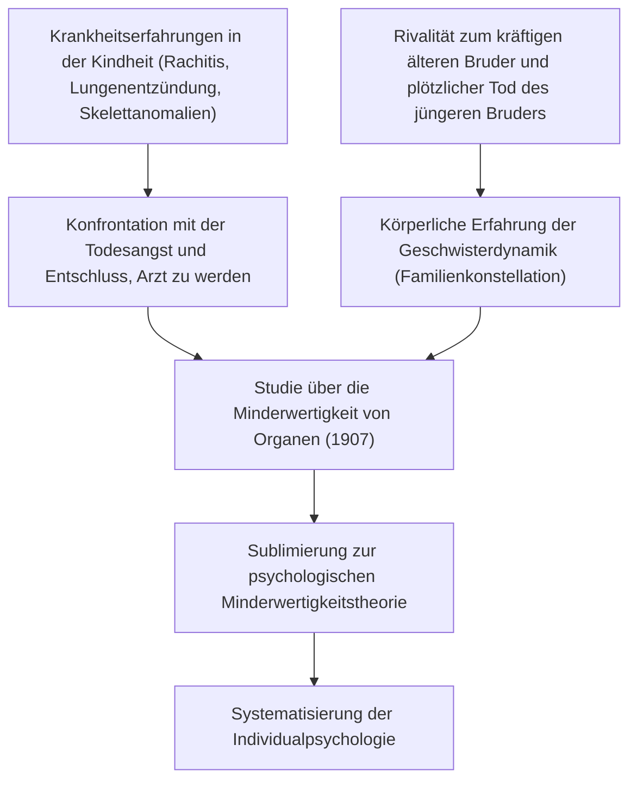
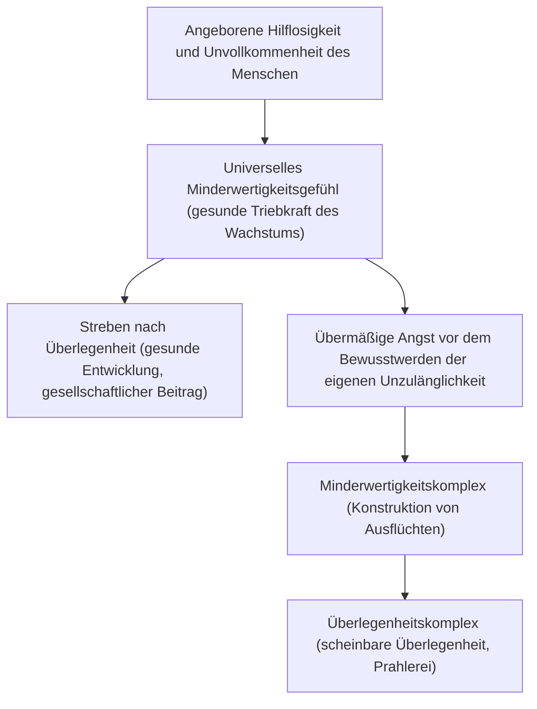
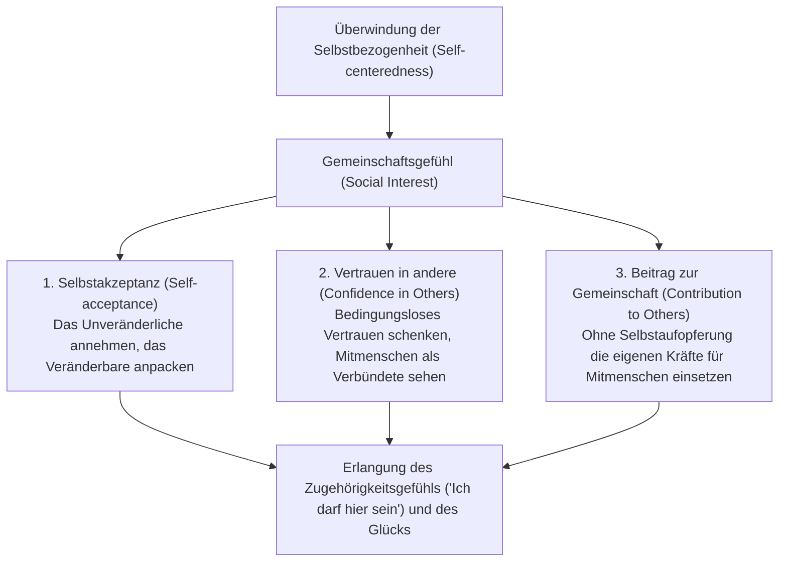
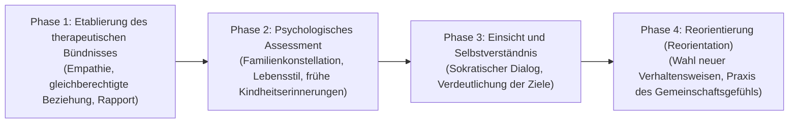

## Einleitung: Warum gerade heute Alfred Adler?

Inmitten der Strömungen der Tiefenpsychologie, die im Wien des frühen 20. Jahrhunderts aufkamen, strahlt die von Alfred Adler (1870–1937) begründete „Individualpsychologie“ (Individual Psychology / dt.: Individualpsychologie) bis heute eine unvergleichliche praktische Kraft und Modernität aus.

Während Sigmund Freud einen „psychischen Determinismus“ (Psychic Determinism) postulierte, der auf unbewussten Triebregungen (Libido) und vergangenen Traumata gründete, und Carl Gustav Jung in die mythischen Tiefen der Archetypen und des kollektiven Unbewussten hinabstieg, erschloss Adler einen Horizont von bemerkenswerter Klarheit, der radikal auf die reale Gesellschaft und die Zukunft ausgerichtet war, in der der Mensch tatsächlich lebt.

Das Fundament von Adlers Menschenbild bildet die unerschütterliche Überzeugung, dass der Mensch kein passives Wesen ist, das von vergangenen Ereignissen mechanistisch gesteuert wird, sondern eine integrierte Einheit, die selbstbestimmt und schöpferisch auf selbstgesetzte Ziele hinlebt. Die Bezeichnung „Individualpsychologie“, die er seiner Schule verlieh, leitet sich vom lateinischen *individuus* (das Unteilbare, der Unteilbare) ab. Sie war eine fundamentale Zurückweisung des Elementarreduktionismus, der die Psyche in widersprüchliche Instanzen wie „Bewusstsein und Unbewusstes“, „Vernunft und Gefühl“ oder „Es, Ich und Über-Ich“ zerlegt, und begriff den Menschen stattdessen als ein ganzheitlich integriertes Lebenssystem (Ganzheitlichkeit / Holismus).

```
[Vergleich der Paradigmen der drei großen Strömungen der Tiefenpsychologie]

┌───────────────────┬───────────────────────────────────┬───────────────────────────────────┬───────────────────────────────────┐
│ Schule / Gründer  │ Sigmund Freud                     │ Carl Gustav Jung                  │ Alfred Adler                      │
├───────────────────┼───────────────────────────────────┼───────────────────────────────────┼───────────────────────────────────┤
│ Schulbezeichnung  │ Psychoanalyse (Psychoanalysis)    │ Analytische Psychologie           │ Individualpsychologie             │
│ Menschenbild      │ Mechanistisch / deterministisch   │ Teleologisch / archetypisch       │ Subjektorientiert / holistisch    │
│                   │ (Trauma)                          │ (Mythos, Geist)                   │ (Teleologie)                      │
│ Seelische Struktur│ Bewusst / Vorbewusst / Unbewusst  │ Persönliches / kollektives        │ Unteilbare Ganzheit               │
│                   │ (Aufspaltung)                     │ Unbewusstes                       │ (Holismus)                        │
│ Grundmotivation   │ Libido (Sexual- / Destruktionstrieb) Selbsterkenntnis / Archetypen    │ Streben nach Überlegenheit /      │
│                   │                                   │ (Ganzheit der Seele)              │ Gemeinschaftsgefühl               │
│ Therapieansatz    │ Erinnerung verdrängter Inhalte /  │ Traumanalyse / Integration der    │ Neuausrichtung des Lebensstils /  │
│                   │ Abreagieren                       │ Archetypen / Individuation        │ Ermutigung                        │
└───────────────────┴───────────────────────────────────┴───────────────────────────────────┴───────────────────────────────────┘
```

Die Adlerianische Psychologie ist weit mehr als nur eine bloße Schule der klinischen Psychologie. Sie ist eine praktische Existenzphilosophie und ein demokratischer sozialpädagogischer Entwurf, der Antworten auf die fundamentale Frage liefert: „Wie kann der Mensch sein Minderwertigkeitsgefühl überwinden, mit seinen Mitmenschen kooperieren, Zugehörigkeit und echtes Glück erlangen?“ Ausgehend von der intellektuellen Auseinandersetzung mit Freud analysiert dieser Aufsatz mit akademischer Rigorosität das gesamte theoretische Lehrgebäude: von der Teleologie, dem Minderwertigkeitsgefühl und dem Streben nach Überlegenheit über den Lebensstil, die drei Lebensaufgaben, das Gemeinschaftsgefühl und die Aufgabentrennung bis hin zur modernen Kognitiven Verhaltenstherapie (CBT) und der Positiven Psychologie.

---

## 1. Adlers Leben und die Entstehungsgeschichte der Individualpsychologie

### 1.1 Krankheitserfahrungen in der Kindheit und das Urbild der „Organminderwertigkeit“
Alfred Adler wurde am 7. Februar 1870 in Penzing bei Wien, der Hauptstadt der österreichisch-ungarischen Monarchie, als zweiter Sohn eines jüdischen Getreidehändlers geboren.

Für das Verständnis von Adlers Psychologie sind seine eigenen drastischen körperlichen Erfahrungen in der frühen Kindheit von grundlegender Bedeutung. Adler litt als Kleinkind an schwerer Rachitis, die seine Skelettentwicklung verzögerte, sodass er erst im Alter von vier Jahren richtig gehen konnte. Im Alter von fünf Jahren erkrankte er zudem an einer lebensbedrohlichen akuten Lungenentzündung. Vom Krankenbett aus hörte er, wie der herbeigerufene Arzt seinem Vater eröffnete: „Geben Sie den Jungen auf, er ist verloren.“ Im Moment der wundersamen Genesung aus diesem Grenzzustand fasste Adler den unerschütterlichen Entschluss (die Fiktion): Er wollte Arzt werden, um Krankheiten zu überwinden und dem Schrecken des Todes die Stirn zu bieten.

Hinzu kamen eine ausgeprägte Rivalität und Minderwertigkeitsgefühle gegenüber seinem gesunden, sportlichen älteren Bruder Sigmund sowie der traumatische plötzliche Tod seines jüngeren Bruders, der als Säugling neben ihm im Bett starb. Diese harten Realitäten von Tod, Krankheit, physischer Fragilität und dem ständigen geschwisterlichen Vergleich wurden zu den unerschütterlichen Urerfahrungen für seine späteren bahnbrechenden Konzepte: die „Organminderwertigkeit“ (Organ Inferiority), das „Minderwertigkeitsgefühl“ (Inferiority Feeling) und die Theorie der „Familienkonstellation“ (Family Constellation).



### 1.2 Die Wiener Psychologische Mittwoch-Gesellschaft und der Bruch mit Freud (1902–1911)
Nach dem Medizinstudium an der Universität Wien begann Adler seine berufliche Laufbahn zunächst als Augenarzt, wandte sich dann der allgemeinen inneren Medizin und schließlich der Psychiatrie zu. Bei der Behandlung zahlreicher Patienten aus dem Wiener Vergnügungspark Prater – Schausteller, Artisten, Handwerker und Angehörige der Arbeiterklasse – beobachtete er ein faszinierendes Phänomen: Menschen, die unter angeborenen oder erworbenen Schwächen bestimmter Körperorgane litten (Organminderwertigkeit), entwickelten zum Ausgleich andere Organe oder geistig-seelische Fähigkeiten in oft erstaunlichem Maße (Überkompensation / Overcompensation).

Als Adler 1902 Freuds bahnbrechendes Werk *Die Traumdeutung* in einer wohlwollenden Zeitungsrezension gegen harsche Angriffe verteidigte, lud Freud ihn persönlich zu dem allwöchentlich am Mittwochabend in seiner Wohnung tagenden kleinen Diskussionskreis ein (der „Psychologischen Mittwoch-Gesellschaft“, aus der später die Wiener Psychoanalytische Vereinigung hervorging). Adler wurde zu einem ihrer Gründungsmitglieder. Im Jahr 1910 übernahm er sogar den Vorsitz der Wiener Psychoanalytischen Vereinigung und galt weithin als einer der profiliertesten Nachfolger Freuds.

Die Harmonie währte jedoch nicht lange. Während Freud darauf beharrte, die Ätiologie sämtlicher Neurosen auf die infantile Sexualität (Verdrängung und Fixierung der Libido) zurückzuführen (Pansexualismus), vertrat Adler die Auffassung, dass die tiefste Triebfeder menschlichen Verhaltens nicht in der Sexualität liege, sondern im Willen zur Überwindung der eigenen Schwäche und Hilflosigkeit, im Geltungsstreben, in der Aggression und im Bedürfnis nach Selbstbehauptung.

Im Jahr 1911 kam es zum endgültigen Bruch. In einer Reihe von Vorträgen vor der Vereinigung kritisierte Adler Freuds Sexuallehre schonungslos und stellte seine eigene Theorie des „männlichen Protests“ (Masculine Protest) vor. Freud brandmarkte Adlers Thesen als häretischen Angriff auf den Kern der Psychoanalyse und wies jeden Kompromiss brüsk zurück. Adler legte daraufhin den Vorsitz der Vereinigung und die Redaktionsleitung der Fachzeitschrift nieder und trat gemeinsam mit neun Gleichgesinnten aus der Psychoanalytischen Vereinigung aus. 1912 gründeten sie zunächst den „Verein für freie psychoanalytische Forschung“, der kurz darauf in „Verein für Individualpsychologie“ (Society for Individual Psychology) umbenannt wurde. Damit war die Individualpsychologie in vollständiger Unabhängigkeit von Freuds Psychoanalyse offiziell ins Leben gerufen worden.

---

## 2. Teleologie vs. Kausalität: Der Paradigmenwechsel der Psychologie

### 2.1 Grenzen des mechanistischen Kausalismus und die Zurückweisung des Traumas
Das theoretische Rückgrat der Individualpsychologie bildet eine radikale Wende: die schonungslose Kritik des mechanistischen „Ursachendenkens“ (Kausalität / Causality) und die Einführung der „Zwecklehre“ (Teleologie / Teleology).

Die klassische Psychiatrie und die Naturwissenschaften jener Epoche – maßgeblich vertreten durch Freud – übertrugen das newtonsche Ursache-Wirkungs-Prinzip unhinterfragt auf das menschliche Seelenleben. Das Grundschema lautete: „Ein vergangenes Ereignis (A) hat den gegenwärtigen Zustand (B) verursacht.“ Ein typisches Erklärungsbeispiel: „Weil eine Person in der Kindheit von den Eltern misshandelt wurde und ohne Liebe aufwuchs (A), leidet sie heute unter sozialer Phobie und kann sich nicht in die Gesellschaft integrieren (B).“

Adler unterzog diesen mechanistischen Kausalismus einer vernichtenden Kritik. Für ihn determiniert nicht das vergangene Ereignis an sich den Menschen. Würde ein vergangenes Trauma das menschliche Schicksal unabwendbar festlegen, so müsste ausnahmslos jeder Mensch, der unter widrigen Bedingungen aufgewachsen ist, exakt dieselbe Neurose entwickeln. Dem Menschen bliebe weder ein freier Wille noch eine reelle Chance auf seelische Genesung. Adler formulierte es unmissverständlich:

> „Keine Erfahrung ist an sich eine Ursache für Erfolg oder Misserfolg. Wir leiden nicht unter dem Schock unserer Erfahrungen – dem sogenannten Trauma –, sondern wir machen aus ihnen genau das, was unseren Zwecken dient, und verleihen ihnen unsere eigene Bedeutung.“
> (*What Life Could Mean to You*, 1931)

```
[Erkenntnistheoretischer Vergleich von Kausalität und Teleologie]

■ Kausalität (Freudsches Ursachendenken / Determinismus)
Fakten der Vergangenheit (elterliche Misshandlung, Liebeskummer, Scheitern)
  -- "Unvermeidbare kausale Verknüpfung (Fremdbestimmung)" -->
Gegenwärtiges Ergebnis (soziale Phobie, Rückzug, Lethargie)
* Der Mensch ist eine Marionette der Vergangenheit; da die Vergangenheit unabänderlich ist, mündet dies in fatalistischen Fatalismus.

■ Teleologie (Adlersche Handlungstheorie / Subjekttheorie)
Verborgenes gegenwärtiges Ziel (Konflikte vermeiden, nicht verletzt werden wollen)
  -- "Wahl der Mittel zur Zielerreichung (Schöpferischer Ursprung)" -->
Erzeugung gegenwärtiger Symptome/Emotionen (Angst, Wut, Furcht werden selbst hervorgebracht)
* Vergangene Fakten sind lediglich Material. Der Mensch nutzt Erinnerungen an die Vergangenheit für sein „gegenwärtiges Ziel“.
```

### 2.2 Die Struktur der Teleologie und der „Gebrauch“ von Emotionen
In Adlers teleologischem System werden menschliche Handlungen, emotionale Regungen und selbst psychiatrische Leitsymptome (Angst, Depression, Panik, Zwang) als funktionale „Mittel“ verstanden, die dazu dienen, ein unbewusst gehegtes „verborgenes Ziel“ (Hidden Goal) zu verwirklichen.

Betrachten wir beispielsweise einen Patienten mit einer sozialen Angststörung, dessen Hände zittern, der errötet und unfähig ist zu sprechen, sobald er vor Menschen treten soll:
- **Kausale Erklärung**: „Weil der Betroffene in der Vergangenheit vor einer Menschenmenge scheiterte und sich blamierte, wurde ein unbewusster Konditionierungsmechanismus der Angst in Gang gesetzt.“
- **Teleologische Erklärung**: „Der Patient verfolgt das unbewusste Ziel: ‚Ich will mich keinesfalls vor anderen blamieren‘ oder ‚Ich könnte es nicht ertragen, wenn mein mögliches Unvermögen ans Licht käme‘. Um dieses Ziel zu erreichen, bringt er die körperlichen Symptome des Errötens und Zitterns selbst hervor und verschafft sich so ein legitimes Alibi: ‚Weil ich krank bin, kann ich leider nicht vor Publikum auftreten‘.“

Entscheidend ist hierbei die fundamentale Einsicht, dass Gefühle wie Zorn, Angst oder Trauer den Menschen nicht passiv von außen „überfallen“, sondern dass der Mensch sie als „Werkzeuge erzeugt und gebraucht“, um seine eigenen Ziele durchzusetzen.

Adler illustrierte dies anhand seiner berühmten „Werkzeugtheorie des Zorns“: Eine Mutter schreit ihr Kind voller Wut und Zorn an. Mitten in dieser Szene klingelt das Telefon; es ist der Klassenlehrer des Kindes. Im selben Augenblick, in dem die Mutter den Hörer abnimmt, schlägt ihr Tonfall schlagartig in eine überaus freundliche, verbindliche und ruhige Stimme um. Sie führt ein sachliches Gespräch mit dem Lehrer, legt auf – und fährt im nächsten Sekundenbruchteil damit fort, ihr Kind mit erhobener Stimme anzuschreien. Wäre Wut ein unkontrollierbarer neurophysiologischer Impuls, der den Menschen willenlos überwältigt, so wäre ein solcher sekundenschneller Wechsel zu gelassener Höflichkeit schlichtweg unmöglich. Die Mutter hat das Gefühl des Zorns gezielt mobilisiert und instrumentalisiert, um ihr Ziel – die sofortige Unterwerfung des Kindes und das Erzwingen von Gehorsam – mühelos zu erreichen.

In der Individualpsychologie ist der Mensch kein Sklave seiner Emotionen. Er ist der Souverän, der seine Gefühle auswählt und sie in den Dienst seiner Absichten stellt.

---

## 3. Minderwertigkeitsgefühl, Minderwertigkeitskomplex und das Streben nach Überlegenheit

### 3.1 Von der Organminderwertigkeit zum universellen Minderwertigkeitsgefühl
In seiner frühen Schrift *Studie über Minderwertigkeit von Organen* (1907) analysierte Adler die funktionelle Unvollständigkeit körperlicher Organe und die darauf antwortenden kompensatorischen Mechanismen des Organismus. Ein Individuum mit einer angeborenen Schwäche des Herzens, der Nieren oder der Sinnesorgane versucht den Mangel durch kompensatorische Anstrengungen des zentralen Nervensystems wettzumachen.

Diesen physiologisch-pathologischen Befund erweiterte Adler kühn auf die seelische Dimension. Das menschliche Lebewesen kommt im Vergleich zu anderen Tieren in einem Zustand extremer Hilflosigkeit und Verwundbarkeit zur Welt. Ohne scharfe Zähne, ohne Krallen, ohne wärmenden Pelz und ohne die Fürsorge der Eltern wäre ein Neugeborenes nicht einen einzigen Tag überlebensfähig. Folglich muss jedes Kind im Angesicht übermächtiger Erwachsener seine eigene Ohnmacht, Kleinheit und Unvollkommenheit mit aller Deutlichkeit erfahren.

Die seelische Spannung, die aus dem Drang entsteht, diesen Zustand der Hilflosigkeit zu überwinden, nannte Adler das **„Minderwertigkeitsgefühl“ (Minderwertigkeitsgefühl / Inferiority Feeling)**. Von grundlegender Tragweite ist Adlers Erkenntnis: **Das Minderwertigkeitsgefühl ist an sich keineswegs pathologisch, sondern die vollkommen gesunde, universelle Triebfeder (Engine of Growth) für die menschliche Entwicklung und den Fortschritt.**



### 3.2 Die strikte begriffliche Unterscheidung zwischen Minderwertigkeitsgefühl und Minderwertigkeitskomplex
Während im alltäglichen Sprachgebrauch das Wort „Komplex“ oft fälschlicherweise als Synonym für ein einfaches Minderwertigkeitsgefühl verwendet wird, zieht die Individualpsychologie eine messerscharfe Grenze zwischen beiden Konzepten:

1. **Minderwertigkeitsgefühl (Inferiority Feeling)**:
   Das subjektive Gefühl der Unvollkommenheit, das aus der schmerzhaften Wahrnehmung der Diskrepanz zwischen dem aktuellen Ist-Zustand und einem erstrebten Idealzustand erwächst. Es dient als gesunder Antrieb zur Weiterentwicklung durch Anstrengung und Übung: „Mein Wissen reicht noch nicht aus, also muss ich mehr lernen“, „Meine Fertigkeiten sind noch unausgereift, also muss ich trainieren“.

2. **Minderwertigkeitskomplex (Inferiority Complex)**:
   Ein pathologischer Zustand, bei dem das Minderwertigkeitsgefühl als Alibi bzw. Ausrede benutzt wird, um vor den realen Lebensaufgaben zu kapitulieren. Hier wird eine Schein-Kausalität nach dem Muster „Weil A vorliegt, kann ich B nicht tun“ errichtet: „Weil ich keinen akademischen Abschluss habe, kann ich keinen Erfolg haben“, „Weil ich nicht attraktiv bin, finde ich keinen Partner“, „Weil meine Eltern mich falsch erzogen haben, kann ich mich nicht in die Gesellschaft einfügen“.
   Wer im Minderwertigkeitskomplex verharrt, verweigert die Lösung seiner Aufgaben durch eigene Anstrengung. Um das fragile Selbstwertgefühl vor der bitteren Realität des möglichen Scheiterns zu schützen, missbraucht er die eigene Minderwertigkeit als Schutzschild.

### 3.3 Der Überlegenheitskomplex und die Pathologie des Willens zur Macht
Wenn ein Mensch, der an einem Minderwertigkeitskomplex leidet, den quälenden Schmerz der Konfrontation mit der eigenen Unzulänglichkeit nicht mehr ertragen kann, flieht er häufig in das genaue Spiegelbild: den **„Überlegenheitskomplex“ (Superiority Complex)**.

Der Überlegenheitskomplex ist ein psychischer Abwehrmechanismus, bei dem der Betroffene nicht durch reale Anstrengungen Schwierigkeiten meistert, sondern sich in eine „scheinbare Überlegenheit“ rettet und so tut, als sei er anderen weit überlegen. Typische Erscheinungsformen sind:

- **Prunken mit fremder Autorität (geborgter Glanz)**: Das prahlerische Betonen von Beziehungen zu Prominenten oder Mächtigen, das demonstrative Zurschaustellen von Luxusgütern, Titeln oder Statussymbolen.
- **Prahlerei und Verharren in vergangenem Ruhm**: Das endlose Aufwärmen alter Heldentaten, um die gegenwärtige Tatenlosigkeit und Passivität zu verschleiern.
- **„Das Prahlen mit dem Unglück“ und die Tyrannei des Schwachen**: Das unaufhörliche Klagen über das eigene schwere Schicksal, das erlittene Unrecht und den tiefen Schmerz. Dadurch wird das Mitleid der Umwelt erpresst, Mitmenschen werden durch Schuldgefühle manipuliert und Sonderbehandlungen eingefordert. Adler bezeichnete dieses Phänomen als die „Privilegierung der Schwäche“ und sah darin eine der am schwersten therapierbaren Formen des Überlegenheitskomplexes.

### 3.4 Die gesunde Dimension des Strebens nach Überlegenheit
Die Urmotivation des Menschen zur Überwindung des Minderwertigkeitsgefühls bezeichnete Adler in frühen Schriften als „Aggressionstrieb“, „Wille zur Macht“ oder „männlichen Protest“. In seinem Spätwerk sublimierte er diesen Gedanken jedoch zum umfassenderen Begriff des **„Strebens nach Überlegenheit“ (Striving for Superiority / Streben nach Vollkommenheit)**.

Ein gesundes Streben nach Überlegenheit bedeutet unter keinen Umständen, andere in einem unerbittlichen Konkurrenzkampf niederzuringen, zu besiegen oder zu beherrschen. Es bedeutet vielmehr: **„Sich nicht mit anderen zu vergleichen, sondern das gegenwärtige Selbst am eigenen Ideal zu messen und über die bisherigen eigenen Grenzen hinauszuwachsen.“** Es ist ein Voranschreiten auf einer horizontalen Ebene, auf der man sich Seite an Seite mit gleichwertigen Mitmenschen weiterentwickelt. Wenn das Streben nach Überlegenheit auf eine „vertikale Rangordnung“ (Oben-Unten-Hierarchie, Dominanz und Unterwerfung) ausgerichtet ist, wird es zum Nährboden neurotischer Störungen. Richtet es sich hingegen auf die „horizontale Kooperation“ (Beitrag zur Gemeinschaft), wird es zum Motor schöpferischer und gesunder Selbstverwirklichung.

---

## 4. Holismus und Lebensstil: Die kognitive Architektur des Individuums

### 4.1 Holismus (Ganzheitlichkeit): Der Mensch als unteilbare Einheit
Das erste Grundaxiom der Adlerianischen Psychologie ist der **„Holismus“ (Ganzheitlichkeit)**. Seit René Descartes, dem Begründer des modernen Rationalismus, war das westliche Denken vom „Leib-Seele-Dualismus“ (psychophysischer Dualismus) geprägt, der Geist und Körper in zwei getrennte Substanzen spaltete. Auch in der Psychiatrie zerlegte Freud die Seele in antagonistische Instanzen: „Bewusstes / Unbewusstes“ sowie „Es / Ich / Über-Ich“, um intrapsychische Konflikte zu modellieren.

Adler verwarf diesen Elementarreduktionismus in Bausch und Bogen. Für Adler ist der Mensch eine unteilbare Ganzheit (*Individual* = lateinisch *in-dividuus*, das Unteilbare):
- **Vernunft und Gefühl stehen nicht im Konflikt miteinander.** Gefühle werden vielmehr erzeugt, um die von der Vernunft angestrebten Ziele zu erreichen, und wirken eng mit ihr zusammen.
- **Bewusstsein und Unbewusstes sind keine verfeindeten Mächte.** Beide Seiten ziehen am selben Strang auf dasselbe Ziel hin – sie sind lediglich zwei Seiten derselben Medaille. Das Unbewusste bezeichnet schlicht jenen Bereich von Zielen, den das Individuum bislang noch nicht sprachlich gefasst oder sich bewusst gemacht hat.
- **Seele und Körper sind keine isolierten Entitäten.** Wenn bei akuter Angst der Puls rast und sich der Magen verkrampft, so ist dies der Ausdruck des gesamten Organismus, der als einheitliches Ganzes auf eine Krise reagiert.

Die Individualpsychologie lässt dualistische Ausflüchte wie „Mein Verstand wusste es, aber meine Gefühle gingen mit mir durch“ oder „Ein unbewusster Trieb zwang mich gegen meine Vernunft zum Handeln“ nicht gelten. Sie weist die ungeteilte Verantwortung dem gesamten Menschen als handelndem Subjekt zu: „*Ich* habe für *mein* Ziel das Gefühl des Zorns erzeugt und geschrien.“

```
[Strukturelle Differenz zwischen Elementarreduktionismus (Freud) und Holismus (Adler)]

■ Elementarreduktionismus (Modell psychischer Spaltung)
┌───────────────────────────────────────┐
│ Über-Ich (Moral und Normen)           │
├───────────────────────────────────────┤  ← Innerer Konflikt und Spaltung
│ Ich (Realitätsanpassung / Vernunft)   │
├───────────────────────────────────────┤  ← Verdrängung und Widerstand
│ Es (unbewusste Triebwünsche)          │
└───────────────────────────────────────┘
* Erzeugt Selbsttäuschungen wie: „Die Triebe haben die Vernunft besiegt“ oder „Das Unbewusste steuert mich“.

■ Holismus (Modell unteilbarer Integration)
┌────────────────────────────────────────────────────────────────────────┐
│               Der ganze Mensch (das unteilbare Selbst)                 │
│                                                                        │
│  Teleologische Einheit:                                                │
│  Vernunft, Gefühl, Bewusstsein, Unbewusstes und Körper wirken          │
│  vollständig zusammen, um ein „einziges verborgenes Ziel (Lebensstil)“ │
│  zu erreichen.                                                         │
└────────────────────────────────────────────────────────────────────────┘
* Die letztendliche Verantwortung für alle Handlungen und Gefühle liegt beim integrierten „Ich“.
```

### 4.2 Definition und drei Dimensionen des Lebensstils (Lebensstil)
In der Individualpsychologie lautet der zentrale Begriff für die Gesamtheit von Charakter, Persönlichkeit, Weltanschauung und kognitiven Mustern **„Lebensstil“ (Lifestyle / dt.: Lebensstil)**. Er stellt den direkten historischen Vorläufer des modernen Konzepts des „Schemas“ bzw. der „kognitiven Landkarte“ in der kognitiven Verhaltenstherapie dar.

Der Lebensstil ist das feste Muster der Bedeutungsgebung gegenüber sich selbst und der Welt, das ein Mensch in der frühen Kindheit (etwa bis zum vierten bis sechsten Lebensjahr) schöpferisch konstruiert und gewählt hat, um unter seinen körperlichen Voraussetzungen, innerhalb seines familiären Milieus und seines kulturellen Kontextes zu überleben. Einmal etabliert, fungiert der Lebensstil unbewusst als lebenslanger innerer Kompass, der sämtliche Wahrnehmungen, Gedanken, Gefühle und Handlungen des Erwachsenen filtert.

In der Adlerianischen Psychologie setzt sich der Lebensstil aus drei konstitutiven Dimensionen zusammen:

1. **Das Selbstkonzept (Self-concept)**:
   Die feste Überzeugung über sich selbst: „Ich bin...“ („Ich bin schwach und hilflos“, „Ich bin klug“, „Ich bin ein Mensch, der nicht geliebt werden kann“).
2. **Das Selbstideal (Self-ideal)**:
   Der subjektive normative Maßstab: „Ich muss sein...“ oder „Ich sollte sein...“ („Ich muss immer die Nummer eins sein“, „Alle Menschen müssen freundlich zu mir sein“, „Ich darf unter keinen Umständen versagen“).
3. **Das Weltbild (Picture of the World / Weltbild)**:
   Die Überzeugung über die Umwelt, die Mitmenschen und das Leben: „Die Welt/die anderen sind...“ („Die Welt ist voller Gefahren“, „Die anderen sind Feinde, die mich nur ausnutzen wollen“, „Das Leben ist unberechenbar und ungerecht“).

Besteht der Lebensstil eines Menschen beispielsweise aus dem Selbstkonzept „Ich bin hilflos“, dem Selbstideal „Ich darf niemals verletzt werden“ und dem Weltbild „Die Menschen um mich herum sind feindselig und kalt“, so wird dieser Mensch in jeder zwischenmenschlichen Begegnung übertrieben misstrauisch reagieren, kleinste Regungen anderer als Feindseligkeit deuten und Flucht- oder Rückzugsstrategien wählen. Aus der Perspektive seines spezifischen Lebensstils handelt es sich dabei keineswegs um einen bizarren Defekt, sondern um ein vollkommen logisches, schlüssiges und zielgerichtetes Verhalten.

### 4.3 Die diagnostische Bedeutung früher Kindheitserinnerungen
Um den unbewussten Lebensstil eines Klienten transparent zu machen, entwickelte Adler eine seiner wirkungsvollsten klinischen Methoden: die Analyse der **„frühen Kindheitserinnerungen“ (Early Recollections)**.

Bei dieser Technik wird der Klient gebeten, die früheste Szene aus seinem Leben zu schildern, an die er sich erinnern kann (typischerweise vor dem sechsten bis achten Lebensjahr). Der Klient soll das konkrete Ereignis, die anwesenden Personen, seine eigene Handlung und das damals empfundene Gefühl detailgetreu vergegenwärtigen.

Freud betrachtete Kindheitserinnerungen als „Spuren historischer Fakten“ oder als verhüllte „Fossilien verdrängter Traumata“. Aus teleologischer Sicht begriff Adler Erinnerungen jedoch als **subjektive Schöpfungen und Erzählungen (Narrative), die aus unzähligen vergangenen Begebenheiten eigens ausgewählt und rekonstruiert wurden, um den gegenwärtigen Lebensstil zu rechtfertigen und zu stützen.** Der Mensch erinnert die Vergangenheit nicht objektiv als bloße Kameraaufzeichnung. Er behält exakt jene Erinnerungen im Gedächtnis und färbt sie ein, die seinem gegenwärtigen Lebensziel dienlich sind.

```
[Analyseparadigma früher Kindheitserinnerungen]

- Erinnerungsinhalt: „Mit 5 Jahren fiel ich von einem Baum im Garten und verletzte mein Bein. Meine Mutter eilte herbei und schloss mich in die Arme.“
  ↓
- Analytische Perspektiven:
  1. Aktiv oder passiv? (Handelte man selbst oder wartete man darauf, dass etwas geschah?)
  2. Welche Rolle spielen die anderen? (Feinde, die Gefahren unbeachtet ließen, oder rettende Beschützer?)
  3. Wie wird das Selbst wahrgenommen? (Als hilfloses und verwundbares Wesen)
  ↓
- Herausgefilterte Überzeugung des Lebensstils:
  „Die Welt ist voller Gefahren. Ich bin ein hilfloses Wesen, das Schaden nimmt, wenn es unvorsichtig ist.
   Wenn ich jedoch Schwäche zeige und um Hilfe bitte, werden andere mich liebevoll beschützen.“
  ↓
- Übereinstimmung mit gegenwärtigen Verhaltensmustern:
  Bei Schwierigkeiten löst die Person diese nicht selbstständig, sondern betont Krankheit oder Hilflosigkeit, um die Unterstützung anderer zu mobilisieren.
```

Adler betonte pointiert: Der objektive Wahrheitsgehalt einer frühen Erinnerung – ob sie ein historisches Faktum oder eine bloße kindliche Fantasie darstellt – ist völlig belanglos. Die entscheidende Frage lautet: **„Warum bewahrt dieser Mensch ausgerechnet diese eine Szene aus Tausenden von Kindheitsmomenten bis heute lebendig im Gedächtnis?“** In der frühen Erinnerung liegt der konzentrierte Bauplan verborgen, wie der Betreffende heute die Welt betrachtet und mit welchen Strategien er sich im Leben behaupten will.

---

## 5. Die drei Lebensaufgaben und das Gemeinschaftsgefühl

### 5.1 Die drei Lebensaufgaben (Life Tasks)
Adler formulierte die unvermeidlichen Herausforderungen des zwischenmenschlichen Zusammenlebens als die **„Lebensaufgaben“ (Life Tasks / dt.: Lebensaufgaben)**. Er unterteilte sie in drei Stufen: die „Aufgabe der Arbeit“, die „Aufgabe der Freundschaft“ und die „Aufgabe der Liebe“.

```
[Hierarchie und Schwierigkeitsgrad der drei Lebensaufgaben]

[Die Aufgabe der Liebe (Love Task)]
- Zielobjekt: Partner, Ehegatte, Familie in engster Verbundenheit
- Anforderungsniveau: Höchste psychische Nähe und Selbstoffenbarung, Teilen des Schicksals, Wahrung der Gleichberechtigung
- Vorwände zur Vermeidung: Angst vor Einengung, Untreue, emotionale Schikane, Perfektionismus

[Die Aufgabe der Freundschaft (Friendship Task)]
- Zielobjekt: Freunde, Nachbarn, Gemeinschaft, interessenunabhängige partnerschaftliche Beziehungen
- Anforderungsniveau: Konkurrenzfreie, horizontale Vertrauensbeziehungen, Altruismus, gegenseitige Anerkennung
- Vorwände zur Vermeidung: „Ich habe Angst vor Verrat“, „Niemand versteht mich“

[Die Aufgabe der Arbeit (Work Task)]
- Zielobjekt: Berufliche Tätigkeit, wirtschaftliche Produktion, Netzwerk gesellschaftlicher Arbeitsteilung
- Anforderungsniveau: Einhaltung von Regeln, grundlegende Kooperationsfähigkeit, Engagement für Ergebnisse
- Vorwände zur Vermeidung: Angst vor dem Scheitern, Furcht vor Bewertung, Prokrastination, soziale Ängste
```

1. **Die Aufgabe der Arbeit (Work Task)**:
   Um als biologisches Wesen zu überleben, muss der Mensch am gesellschaftlichen Netzwerk der Arbeitsteilung teilhaben und nützliche Werte für andere schaffen. Unter den drei Aufgaben sind hier die Interessen am klarsten geregelt und das Verhalten wird durch Verträge und Normen strukturiert. Daher gilt sie bezüglich der zwischenmenschlichen Nähe als die am wenigsten anspruchsvolle; ein Ausweichen führt jedoch unweigerlich zu wirtschaftlichem Ruin und sozialer Desintegration.

2. **Die Aufgabe der Freundschaft (Friendship Task)**:
   Der Aufbau reiner Freundschaften und partnerschaftlicher Verbindungen jenseits direkter ökonomischer Interessen. Hier wird verlangt, ohne Konkurrenzdenken einander als gleichwertige Menschen zu vertrauen und die eigene Verwundbarkeit offenbaren zu können. Viele scheitern hier aus der nagenden Furcht: „Was, wenn ich hintergangen oder enttäuscht werde?“ und ziehen sich in die Isolation zurück.

3. **Die Aufgabe der Liebe (Love Task)**:
   Die intimste, dauerhafteste Zweierbeziehung des Lebens in Partnerschaft, Ehe und Elternschaft. Da die seelische Distanz hier praktisch auf null schrumpft, treten die verletzlichsten Schwächen und Makel des eigenen Wesens unweigerlich zutage. Es gilt, ohne Herrschaftsansprüche und ohne den Drang nach ständiger Bestätigung als vollkommen gleichberechtigte Partner das gemeinsame Glück zu suchen. Sie ist die anspruchsvollste der drei Lebensaufgaben.

Adler postulierte: Sämtliche seelischen Probleme (Neurosen, Rückzug, Kriminalität, Depressionen) entstehen letztlich daraus, dass Menschen vor diesen Lebensaufgaben zurückweichen. Aus panischer Angst davor, dass ihr Selbstwertgefühl im Falle des Scheiterns Schaden nehmen könnte, flüchten sie in die sogenannte **„Lebenslüge“ (Life Lie)**.

### 5.2 Das Wesen des Gemeinschaftsgefühls (Social Interest)
Den philosophischen Höhepunkt und das tiefgründigste Konzept der Individualpsychologie bildet das **„Gemeinschaftsgefühl“ (Gemeinschaftsgefühl / Social Interest)**. Im englischen Sprachraum meist mit „Social Interest“ (soziales Interesse) übersetzt, meint es im deutschen Original viel mehr als bloßes Interesse: Es ist das tiefe seelische Verbundensein mit der menschlichen Gemeinschaft.

Gemeinschaftsgefühl bedeutet: **„Die Umwandlung der egozentrischen Selbstbezogenheit (Self-centeredness) in ein echtes Interesse an den Mitmenschen (Social Interest).“** Es ist die Haltung, andere nicht als Rivalen oder Feinde zu begreifen, sondern als Gefährten und Verbündete, verbunden mit dem unerschütterlichen Gefühl: „Ich habe meinen festen, geborgenen Platz in dieser Welt.“

Adler erklärte das Gemeinschaftsgefühl zum einzigen und absoluten Gradmesser für seelische Gesundheit. Ein Mensch, dem das Gemeinschaftsgefühl fehlt, erlebt die Welt als feindseligen Dschungel und sieht im Anderen entweder eine Bedrohung oder ein Werkzeug zur Befriedigung eigener Interessen. Er ist zu ständiger Einsamkeit und innerer Unruhe verdammt und verstrickt sich auf der Jagd nach Scheinerfolgen in neurotische Konflikte.



### 5.3 Die drei Pfeiler des Gemeinschaftsgefühls
Um das Gemeinschaftsgefühl in der klinischen und alltäglichen Praxis greifbar zu machen, gliedert die moderne Adlerianische Psychologie das Konzept in drei ineinandergreifende Säulen:

1. **Selbstakzeptanz (Self-acceptance)**:
   Nicht zu verwechseln mit naivem „positivem Denken“ oder Selbstbestätigung. Während Selbstbestätigung oft eine Selbsttäuschung darstellt („Ich rede mir ein, dass ich alles kann, obwohl ich es nicht kann“), bedeutet Selbstakzeptanz: Das eigene unvollkommene, fehlerhafte Selbst nüchtern so anzunehmen, wie es ist, und gleichzeitig den Mut aufzubringen, mit aller Kraft das zu verändern, was verändert werden kann. Dies entspricht exakt dem bekannten Gelassenheitsgebet Reinhold Niebuhrs („Gott, gib mir die Gelassenheit, Dinge hinzunehmen, die ich nicht ändern kann, den Mut, Dinge zu ändern, die ich ändern kann, und die Weisheit, das eine vom anderen zu unterscheiden“).

2. **Vertrauen in andere (Confidence in Others)**:
   Streng zu unterscheiden von bloßem geschäftlichem „Kreditieren“ (Credit). Kredit beruht auf Sicherheiten, Vorleistungen und Bedingungen (wie bei einem Bankkredit). Vertrauen hingegen bedeutet, dem Mitmenschen ohne Vorbedingungen, ohne Garantien und ohne Pfand rückhaltlos zu vertrauen. Gewiss birgt dies das Risiko, enttäuscht oder ausgenutzt zu werden. Doch die Individualpsychologie klärt: Ob der andere mein Vertrauen missbraucht, ist *seine* Aufgabe; ob *ich* den Mut habe zu vertrauen, ist *meine* Aufgabe. Erst durch diese Haltung sprengt man den Kerker des ewigen Misstrauens.

3. **Beitrag zur Gemeinschaft (Contribution to Others)**:
   Nicht zu verwechseln mit selbstzerstörerischer „Selbstaufopferung“ (Self-sacrifice). Wer die eigene Gesundheit und das eigene Leben opfert, um anderen zu dienen, handelt meist aus einem neurotischen Verlangen nach Bestätigung und Anerkennung. Ein echter Beitrag zur Gemeinschaft bedeutet: Die eigenen Fähigkeiten und Gaben freudig für das Wohl der Mitmenschen einzusetzen, um den eigenen Wert und die eigene Existenzberechtigung tief im Inneren zu spüren. Adler formulierte es unvergesslich: „Glück ist das Gefühl des Beitrags.“ Das spürbare Bewusstsein, für andere von Nutzen zu sein, verleiht dem Menschen den tiefen Glauben an den eigenen Wert und wird zum unerschöpflichen Quell des Lebensmutes.

---

## 6. Die Aufgabentrennung und die Psychologie des Mutes

### 6.1 Die logische Struktur der Aufgabentrennung (Separation of Tasks)
Als messerscharfes Skalpell zur radikalen Auflösung zwischenmenschlicher Konflikte entwickelte Adler das Prinzip der **„Aufgabentrennung“ (Separation of Tasks / dt.: Aufgabentrennung)**.

Sämtliche Spannungen, Reibungen und emotionalen Belastungen in menschlichen Beziehungen rühren letztlich daher, dass man sich ungebeten in die Aufgaben anderer einmischt – oder zulässt, dass andere sich rücksichtslos in die eigenen Angelegenheiten drängen.

Adler formulierte ein bestechend klares, universelles Kriterium zur Unterscheidung der Aufgaben:
**„Wer hat letztlich das finale Resultat und die Konsequenzen der getroffenen Wahl zu tragen?“**

```
[Konkretes Beispiel der Aufgabentrennung: Das Lernproblem des Kindes]

- Denken der Eltern (Vermischung der Aufgaben):
  „Wenn das Kind nicht lernt, droht ihm eine schlechte Zukunft, also muss ich es mit Zwang zum Lernen bringen.“
  → Die Eltern greifen mit autoritärer Machtkontrolle in die Aufgabe des Kindes ein.
  → Das Kind reagiert mit Trotz und instrumentalisiert das Lernen als Waffe, um die Eltern zu bestrafen.

- Klärung nach der Aufgabentrennung:
  1. „Wer trägt letztlich die Konsequenzen, wenn nicht gelernt wird und schlechte Noten den Wunschweg verbauen?“
     → Die finalen Konsequenzen trägt einzig und allein [das Kind selbst] (die Aufgabe des Kindes).
  2. Was steht in der Macht der Eltern?
     → Nicht das Befehlen („Lerne endlich!“), sondern die Bereitschaft zur Hilfe, wenn das Kind lernen will,
        sowie das unerschütterliche Signal: „Ich vertraue auf deine Fähigkeiten und begleite dich“ (Bereitstellung von Unterstützung und liebevolle Präsenz).
```

Aufgabentrennung bedeutet keineswegs gefühllose Gleichgültigkeit oder Verwahrlosung (Vernachlässigung). Verwahrlosung bedeutet, nicht zu wissen und sich nicht dafür zu interessieren, was das Kind tut. Adlers Haltung spiegelt sich in dem Sprichwort: „Man kann ein Pferd zum Wasser führen, aber man kann es nicht zwingen zu trinken.“ Ob das Pferd trinkt, entscheidet allein das Tier selbst; ihm mit Gewalt den Schlund aufzureißen und Wasser hineinzuschütten, ist ein Akt der Übergriffigkeit und Gewalt.

### 6.2 Die Zurückweisung des Geltungsdrangs und die Definition der „Freiheit“
Aus der konsequenten Anwendung der Aufgabentrennung folgt eine der radikalsten Thesen der Individualpsychologie: die kompromisslose Zurückweisung des **„Strebens nach Anerkennung“ (Desire for Approval / Geltungsdrang)**, der die moderne Gesellschaft prägt.

Wer sein Leben darauf ausrichtet, von anderen anerkannt, gelobt und geschätzt zu werden, lebt nach Adler letztlich das Leben anderer. Denn die Frage: „Wie beurteilt mich mein Gegenüber?“ ist die unantastbare **Aufgabe des anderen**, die man niemals kontrollieren kann. Wer versucht, das Urteil anderer zu steuern, begibt sich in eine unmögliche und quälende Knechtschaft.

Die Definition von „Freiheit“ lautet in der Individualpsychologie folglich:
**„Keine Angst davor zu haben, von anderen Menschen abgelehnt oder gehasst zu werden.“**

Es jedem recht machen zu wollen und nach allgemeiner Beliebtheit zu gieren, ist unaufrichtig und zwingt dazu, den eigenen Lebensstil permanent zu verleugnen. Den Weg zu gehen, den man selbst nach bestem Wissen und Gewissen für richtig hält – und es gelassen dem Anderen zu überlassen, ob er einen dafür schätzt oder ablehnt –, das ist die conditio sine qua non echter seelischer Freiheit. Frei ist nur, wer unabhängig von fremden Urteilen aus eigenem Gewissen und im Geiste des Beitrags zur Gemeinschaft selbstbestimmt handelt.

---

## 7. Ermutigung (Encouragement) und demokratische Pädagogik

### 7.1 Fundamentale Kritik der Erziehung durch Belohnung und Strafe: Die Gefahr des Lobens
Zu den revolutionärsten Postulaten der Individualpsychologie im Bereich der klinischen Praxis und Erziehungslehre gehört das **„radikale Verbot der Erziehung durch Lob und Tadel“ (Belohnung und Bestrafung)**.

In der traditionellen Erziehung sowie im modernen Unternehmensmanagement wird der Ansatz des „Förderns durch Lob“ allenthalben gepriesen. Adler durchschaute jedoch das wahre Wesen des Lobens: In jedem Akt des Lobens manifestiert sich unweigerlich eine **vertikale Hierarchie (Oben-Unten-Verhältnis), in der eine vorgeblich kompetentere Person auf eine inkompetentere herabblickt, um sie zu bewerten und zu manipulieren.** Wenn ein Erwachsener zu einem anderen Erwachsenen auf Augenhöhe sagen würde: „Das hast du aber fein gemacht!“ oder „Sehr brav!“, so würde dies sofort als herablassend und anmaßend empfunden – eben weil darin ein asymmetrisches Machtgefälle mitschwingt.

```
[Vergleich der Paradigmen: „Lob und Tadel“ vs. „Ermutigung“]

┌──────────────────────┬─────────────────────────────────┬─────────────────────────────────┐
│ Kriterium            │ Erziehung durch Belohnung/Tadel │ Ermutigung (Encouragement)      │
├──────────────────────┼─────────────────────────────────┼─────────────────────────────────┤
│ Beziehungsgrundlage  │ Vertikale Beziehung             │ Horizontale Beziehung           │
│                      │ (Hierarchie, Dominanz, Steuerung│ (Gleichwertigkeit, Respekt,     │
│                      │ )                               │ Vertrauen)                      │
│ Bewertungsmaßstab    │ Ergebnis, Leistung, Vergleich   │ Prozess, Absicht, Vergleich mit │
│                      │ mit anderen                     │ sich selbst                     │
│ Psychische Wirkung   │ Geltungsdrang, Angst vor dem    │ Selbstvertrauen, Autonomie,     │
│                      │ Scheitern, Abhängigkeit         │ Beitragsgefühl, Selbstwirksamkeit│
│ Art der Motivation   │ Extrinsisch (für Lob oder zur   │ Intrinsisch (freiwilliger       │
│                      │ Vermeidung von Strafe)          │ Beitrag zur Gemeinschaft)       │
│ Konkrete Sprache     │ „Gut gemacht!“, „Toll, 100      │ „Vielen Dank für deine Hilfe“,  │
│                      │ Punkte erreicht!“               │ „Ich freue mich darüber“        │
└──────────────────────┴─────────────────────────────────┴─────────────────────────────────┘
```

Die verheerendste Folge des Lobens besteht nach Adler darin, dass es Kinder und Mitarbeiter in eine massive Sucht nach Anerkennung treibt. Sie lernen: „Ich handle nur, wenn ich dafür gelobt werde“ und „Ohne die Bestätigung anderer bin ich wertlos“. Bleibt das Lob einmal aus, wird dieses Ausbleiben bereits als Strafe empfunden. Die Folge ist eine lähmende Angst vor dem Versagen, die jede Risikobereitschaft und Innovationsfreude erstickt.

Das Tadeln und Strafen wiederum ist noch destruktiver. Wer schilt und straft, kapituliert vor dem konstruktiven sprachlichen Dialog und greift zur primitiven Macht der Emotion (Zorn), um das Gegenüber gefügig zu machen. Der Bestrafte gelangt dadurch keineswegs zu echter Einsicht oder Reue; vielmehr aktiviert die Bestrafung Abwehrmechanismen: Er lernt, sein Fehlverhalten geschickter zu vertuschen, oder sinnt auf verdeckte Vergeltung und Rache.

### 7.2 Techniken der Ermutigung und die horizontale Beziehung
Als heilsame Alternative zu Belohnung und Bestrafung etablierte Adler das Konzept der **„Ermutigung“ (Encouragement)**.
Ermutigung bedeutet: **„Einem Menschen beizustehen, die innere Kraft und Zuversicht (den Mut) zu entfalten, um Schwierigkeiten aus eigener Kraft zu meistern.“** Sie basiert ausnahmslos auf einer gleichwertigen, partnerschaftlichen „horizontalen Beziehung“.

Die Kerntechniken der Ermutigung umfassen:

1. **Ausdruck von Dankbarkeit und Freude („Danke“, „Ich freue mich“)**:
   Statt das Gegenüber von oben herab zu bewerten („Du bist schlau“), teilt man das eigene subjektive Empfinden mit, wie sehr die Handlung des anderen einem selbst oder der Gemeinschaft geholfen hat: „Vielen Dank, das war eine große Erleichterung für mich“, „Ich bin wirklich froh, dass du da bist“. Dadurch erfährt der Mensch: „Ich habe die Kraft, einen Beitrag zu leisten; meine Existenz hat einen Wert“ (Erleben von Selbstwirksamkeit).
2. **Fokus auf den Prozess und die Absicht**:
   Der Blick richtet sich nicht primär auf das Endergebnis (Testnoten, Verkaufszahlen), sondern auf die aufgewendete Mühe, die Ausdauer und die ehrliche Absicht: „Du bist bis zum Schluss drangeblieben und hast nicht aufgegeben“, „Hier hast du dir wirklich etwas Kluges überlegt“. Gerade im Augenblick des Scheiterns bietet sich die kostbarste Gelegenheit zur Ermutigung: Man analysiert auf Augenhöhe gemeinsam, welche Lehren aus dem Fehlschlag gezogen werden können.
3. **Fokus auf Stärken statt Schwächen (Reframing / Umdeutung)**:
   Merkmale, unter denen der Betroffene leidet, werden in einen konstruktiven Kontext überführt: „Unbeständigkeit“ wird als „vielseitige Neugierde und geistige Flexibilität“ gedeutet, „Eigensinn“ als „die wertvolle Fähigkeit, für die eigene Überzeugung einzustehen“.

### 7.3 Die Wiener Erziehungsberatungsstellen und die Reform des öffentlichen Bildungswesens
Adlers Gedankengebäude erschöpfte sich keineswegs in akademischen Abstraktionen, sondern entlud sich in einer beispiellosen sozialpolitischen Praxis. Nach dem Ersten Weltkrieg, als im Zuge der österreichischen Revolution die Sozialdemokratische Arbeiterpartei im „Roten Wien“ die Stadtverwaltung übernahm, kooperierte Adler eng mit dem Wiener Stadtschulrat (unter Führung des Reformpädagogen Otto Glöckel) und gründete über dreißig **„Erziehungsberatungsstellen“ (Child Guidance Clinics)** an öffentlichen Schulen.

Diese Beratungsstellen arbeiteten nach einer bahnbrechenden Methode: Ärzte, Lehrer, Eltern und das Kind selbst saßen im Kreis gleichberechtigt zusammen und führten öffentliche, transparente Beratungsgespräche. Adler war zutiefst überzeugt, dass die Überwindung des autoritären, despotischen Geistes in Elternhaus und Schule und das Heranbilden einer demokratischen, kooperativen Gemeinschaft das einzige verlässliche Bollwerk gegen zukünftige seelische Fehlentwicklungen, Kriminalität und verheerende Kriege darstellten. Dieses Wiener Modell bildete das historische Fundament der modernen Schulpsychologie und Schulsozialarbeit.

---

## 8. Techniken und Prozess der Adlerianischen Klinischen Beratung

### 8.1 Etablierung der therapeutischen Beziehung: Das partnerschaftliche Bündnis (Collaborative Alliance)
In der klassischen Freudschen Psychoanalyse war das Setting strikt asymmetrisch und hierarchisch strukturiert: Der Patient lag passiv auf der Couch, während der Analytiker unsichtbar hinter ihm saß, schwieg und apodiktische Deutungen vornahm.

Die Adlerianische Beratung revolutionierte dieses Arrangement von Grund auf: Berater und Klient sitzen einander auf Stühlen gleicher Höhe von Angesicht zu Angesicht gegenüber. Sie begegnen sich als gleichberechtigte Erforscher („Co-Investigators“) und schmieden ein enges Arbeitsbündnis (Collaborative Alliance), um gemeinsam das Rätsel des klärenden Lebensstils zu entschlüsseln. Der Berater geriert sich nicht als allwissende Autorität, sondern agiert als empathischer Prozessbegleiter (Facilitator), der den Klienten darin unterstützt, seine Lebensaufgaben mutig in eigener Regie zu bewältigen.



### 8.2 Psychologisches Assessment: Die Familienkonstellation (Family Constellation)
Im Zentrum des psychologischen Assessments steht die Analyse der **„Familienkonstellation“ (Family Constellation / Familienstruktur)**.

Adler entdeckte, dass die Herausbildung des Lebensstils eines Kindes maßgeblich von seiner **Geschwisterkonstellation bzw. Geburtenfolge (Birth Order)** und der subjektiven Deutung dieser Position geprägt wird:

- **Das erstgeborene Kind (der Erstgeborene)**:
  Erlebte zunächst die ungeteilte Liebe und Fürsorge der Eltern, bis es durch die Geburt des zweiten Kindes das Trauma des „entthronten Monarchen“ erfuhr. Erstgeborene neigen dazu, der Vergangenheit und verlorener Größe nachzutrauern; sie schätzen Ordnung, Tradition, Regeln und Autorität und entwickeln oft ein stark ausgeprägtes Pflicht- und Verantwortungsbewusstsein.
- **Das zweitgeborene Kind (das mittlere Kind)**:
  Findet von Geburt an einen Schrittmacher vor, der ihm stets einen Schritt voraus ist. Es befindet sich psychisch in einem „Dauerrennen unter Vollgas“. Um sich einen eigenen Raum zu erobern, wählt es häufig ganz andere Interessensgebiete als der Erstgeborene; es neigt zu rebellionärem Geist, Innovationsfreude oder starkem Kooperationswillen.
- **Das letztgeborene Kind (das Nesthäkchen)**:
  Wird niemals entthront. Es läuft Gefahr, von allen Familienmitgliedern verwöhnt zu werden, oder entwickelt einen extremen Ehrgeiz, um alle älteren Geschwister zu überflügeln. Häufig bildet es einen abhängigen Lebensstil aus nach dem Muster: „Ich muss gar nichts tun, die anderen müssen mir dienen.“
- **Das Einzelkind**:
  Wächst ohne geschwisterliche Rivalen ausschließlich in der Welt der Erwachsenen auf. Es neigt zu Egozentrik und Unselbstständigkeit im Umgang mit Gleichaltrigen, entwickelt aber oft eine frühreife Intelligenz und herausragende sprachliche Fähigkeiten.

Adler stellte klar: Nicht die objektive Geburtenfolge determiniert den Charakter, sondern **die subjektive Überlebensstrategie (der Lebensstil), die das Kind schöpferisch wählte, um sich innerhalb dieses familiären Kräftefeldes Aufmerksamkeit, Wertschätzung und einen festen Platz zu sichern.**

### 8.3 Sokratischer Dialog (Socratic Dialogue) und Einsicht
Die therapeutische Intervention erfolgt in der Adlerianischen Psychologie niemals durch belehrende Vorträge oder autoritäre Anweisungen, sondern in Anlehnung an die Hebammenkunst des antiken Philosophen Sokrates im Wege des **„Sokratischen Dialogs“ (Socratic Dialogue)**.

Der Berater stellt niemals anklagende Fragen nach der Vergangenheit wie: „*Warum* haben Sie das getan?“ (die kausale Frage nach der Schuld). Stattdessen stellt er zielorientierte, teleologische Fragen: „*Wozu* dient Ihnen dieses Verhalten?“, „Welchen Vorteil sichern Sie sich damit?“, „Wenn Ihre Symptome morgen wie durch ein Wunder verschwunden wären: Was in Ihrem Leben würde sich dann ganz konkret verändern?“.

Durch diese behutsame, aber unerbittliche Befragung wird der Klient schrittweise mit seinen verborgenen Absichten und seiner unbewussten „Lebenslüge“ konfrontiert. Das Wesen der Adlerianischen Einsicht liegt nicht im rein intellektuellen Verstehen, sondern in der tiefen existenziellen Selbsterkenntnis: **„Ich selbst bin der alleinige Autor meines Lebensdrehbuchs – und niemand sonst.“**

### 8.4 Reorientierung (Reorientation): Das Experimentieren mit neuem Verhalten
In der finalen Phase der **„Reorientierung“ (Reorientation / Neuausrichtung)** verabschiedet sich der Klient von seinen alten, unproduktiven Mustern und wagt es, im Alltag neue, vom Gemeinschaftsgefühl getragene Verhaltensweisen zu erproben.

Adlers Schule verabscheute das Verharren im geschützten Elfenbeinturm des Therapiezimmers; sie verlangte konkrete „Verhaltensexperimente“ im echten Leben:
- Dem Nachbarn, den man bisher wortlos mied, ab morgen mit einem offenen Lächeln Guten Tag sagen.
- Dem Partner gegenüber auf Vorwürfe verzichten und stattdessen ein ehrliches Wort des Dankes aussprechen.
- Den zerstörerischen Perfektionismus ablegen und ein berufliches Projekt bereits bei achtzigprozentiger Reife präsentieren, um aktiv Feedback einzuholen.

Adler lehrte mit Nachdruck: **„Es ist jederzeit möglich, den eigenen Lebensstil zu verändern.“** Der Mensch ist nicht das willenlose Produkt seiner Vergangenheit, sondern kann sich in jedem Augenblick neu erfinden. Was dazu nötig ist, ist kein überragendes Talent und keine angeborene Gabe, sondern einzig und allein: **der Mut zur Veränderung (Courage to Change).**

---

## 9. Einfluss auf modernes Denken, Kognitive Verhaltenstherapie (CBT) und Wohlbefinden

### 9.1 Adler als verborgener Pionier der Kognitiven Verhaltenstherapie
In der zweiten Hälfte des 20. Jahrhunderts stieg die **Kognitive Verhaltenstherapie (CBT)** zum unangefochtenen Goldstandard der modernen Psychotherapie auf. Ihre Gründungsväter – Albert Ellis (Begründer der Rational-Emotiven Verhaltenstherapie: REBT) und Aaron T. Beck (Begründer der Kognitiven Therapie: CT) – haben beide freimütig bekannt, dass ihre theoretischen Grundlagen in überwältigendem Maße direkt auf Alfred Adler zurückgehen.

Albert Ellis formulierte es ohne Umschweife: „Alfred Adler ist wahrscheinlich der eigentliche Begründer der modernen Kognitiven Psychotherapie.“ Ellis’ berühmtes **ABC-Modell** (A = *Activating Event* / auslösendes Ereignis, B = *Belief System* / Bewertungsmuster und Überzeugungen, C = *Consequence* / emotionale und behaviorale Konsequenz) ist nichts anderes als eine moderne Reformulierung von Adlers Lebensstil- und Teleologie-Theorie.

```
[Genealogische Verbindung zwischen Adlerianischer Psychologie und Kognitiver Therapie]

[Epiktet (Stoische Philosophie)]
„Nicht die Dinge selbst beunruhigen die Menschen, sondern die Urteile und Meinungen über die Dinge.“
  ↓
[Alfred Adler (Individualpsychologie, ab 1912)]
- Teleologie: Nicht die Ereignisse, sondern die ihnen beigemessene „Bedeutung (Urteil)“ bestimmt Gefühle und Handlungen.
- Lebensstil: In der Kindheit herausgebildetes „kognitives Schema“.
- Subjektive Verantwortung des Individuums und Reorientierung.
  ↓
[Albert Ellis (Rational-Emotive Verhaltenstherapie, ab 1955)]
- ABC-Theorie (Widerlegung irrationaler Überzeugungen / Irrational Beliefs)
[Aaron T. Beck (Kognitive Therapie, ab 1960er Jahre)]
- Korrektur automatischer Gedanken, Grundüberzeugungen (Core Beliefs) und kognitiver Verzerrungen (Cognitive Distortions)
```

Die von Aaron T. Beck katalogisierten „kognitiven Verzerrungen“ (Schwarz-Weiß-Denken, Katastrophisieren, Übergeneralisierung, mentale Filter) entsprechen exakt den strukturellen Fehlschlüssen, die Adler bereits in den 1910er und 1920er Jahren unter dem Begriff der **„privaten Logik“ (Private Logic)** diagnostiziert hatte. Die Individualpsychologie war somit das entscheidende Scharnier, das die tiefenpsychologische Einsicht in die ganzheitliche Dynamik des Menschen mit den pragmatischen Interventionen der modernen kognitiven Therapien verband.

### 9.2 Resonanz mit Existenzialismus und Pragmatismus
Geistesgeschichtlich steht Adlers Menschenbild in engster Resonanz mit dem amerikanischen **Pragmatismus** und dem europäischen **Existenzialismus**.

Eine herausragende theoretische Inspirationsquelle für Adler war das Werk von Hans Vaihinger: *Die Philosophie des Als Ob* (1911). Vaihinger legte dar, dass der menschliche Verstand niemals Zugriff auf eine absolute, objektive Realität besitzt, sondern sich an nützlichen Konstruktionen und Arbeitshypothesen orientiert – den „Fiktionen“, als ob sie wahr wären. Adler übertrug dieses Prinzip genial in die Seelenkunde: Die Ziele, die das menschliche Handeln leiten, sind keine physikalischen Tatsachen, sondern **„subjektiv geschaffene Leitfiktionen“ (Fictional Finalism)**.

Gleichzeitig korrespondiert Adlers Denken verblüffend präzise mit Jean-Paul Sartres Diktum: „Die Existenz geht der Essenz voraus“ und „Der Mensch ist dazu verurteilt, frei zu sein“. Adler ließ keine Entschuldigungen durch historische Determinanten gelten; er bestand unnachgiebig auf der persönlichen Verantwortung für die eigene Existenz. Damit nahm er auch das Kernaxiom von Viktor Frankls Logotherapie vorweg: die unantastbare Freiheit des Menschen, unter allen – selbst den unmenschlichsten – Bedingungen seine innere Haltung frei zu wählen.

### 9.3 Vorläufer der Positiven Psychologie und der Wohlbefindensforschung
Als Martin E. P. Seligman Ende der 1990er Jahre die **„Positive Psychologie“** begründete und sein renommiertes **PERMA-Modell des Wohlbefindens** formulierte (*Positive Emotion, Engagement, Relationships, Meaning, Accomplishment*), schuf er im Grunde eine empirische Bestätigung für Adlers Konzept des Gemeinschaftsgefühls.

Modernste empirische Forschungen der Neurowissenschaften, Verhaltensökonomie und Sozialpsychologie (Studien zu Sozialkapital, die Ausschüttung von Oxytocin bei prosozialem Verhalten sowie Langzeitstudien zur menschlichen Entwicklung) belegen unumstößlich: **Altruistisches Engagement für andere und gelingende soziale Beziehungen sind die stärksten Prädiktoren für dauerhafte Lebenszufriedenheit, physische Gesundheit und Langlebigkeit.** Adlers These, dass das Gemeinschaftsgefühl der Dreh- und Angelpunkt des seelischen Heils ist – eine Erkenntnis, die er vor über einem Jahrhundert aus klinischem Scharfsinn und philosophischer Konsequenz postulierte –, wird heute von der naturwissenschaftlichen Spitzenforschung glänzend rehabilitiert.

---

## 10. Fazit: Die praktische Philosophie der Selbstbestimmung und des Mutes

Die kraftvollste Botschaft, die Alfred Adlers Individualpsychologie dem modernen Menschen zu schenken vermag, ist eine kompromisslose Philosophie der Hoffnung und der Selbstbestimmung: **„Das Leben kann in jedem beliebigen Moment, genau von diesem Augenblick an, neu begonnen werden.“**

Die gegenwärtige Kultur ist durchdrungen von deterministischen Narrativen: genetischer Determinismus, neurobiologischer Reduktionismus oder sozioökonomischer Fatalismus („Elternlotterie“, Herkunftsmilieu). Die kausale Klage: „Weil ich diese Gene trage“, „Weil meine Eltern mich so geprägt haben“ oder „Weil das System ungerecht ist“ mag dem verletzten Selbstwertgefühl vorübergehend Trost spenden. In Wahrheit jedoch zementiert sie ein verhängnisvolles Selbstbild: Sie sperrt den Menschen in das seelische Gefängnis ein, eine hilflose, passive Marionette von Herkunft und Umständen zu sein.

Die Adlerianische Psychologie entzieht diesem bequemen Opfernarrativ unbarmherzig den Boden.
Es spielt keine Rolle, was in der Vergangenheit geschehen ist. Es spielt keine Rolle, welche Fehler die Eltern begingen. Entscheidend ist einzig und allein: **Wie nutzt man das, was einem mitgegeben wurde?**

> „Es kommt nicht darauf an, was Vererbung und Umwelt dem Menschen mitgegeben haben, sondern darauf, wie der Mensch aus dem ihm gegebenen Material sich selbst gestaltet.“
> (*What Life Could Mean to You*)

Adlers Lehre mag fordernd, streng und zuweilen unbequem klingen. Doch hinter dieser kompromisslosen Klarheit verbirgt sich ein grenzenloses Vertrauen in den Menschen und ein unendlicher Respekt vor seiner Würde. Jeder Mensch besitzt die schöpferische Kraft (Creative Power), sein Lebensdrehbuch mit eigener Hand neu zu schreiben. Aus dem sinnlosen Wettkampf mit anderen auszusteigen, die Sklaverei der Anerkennungssucht abzustreifen, den Nächsten als Weggefährten zu vertrauen und die eigenen Kräfte mutig in den Dienst der Gemeinschaft zu stellen – die seelische Muskelkraft, die nötig ist, um diesen ersten entscheidenden Schritt zu tun: Das ist das ewige, unvergängliche Vermächtnis Alfred Adlers – der **Mut (Courage)**.
