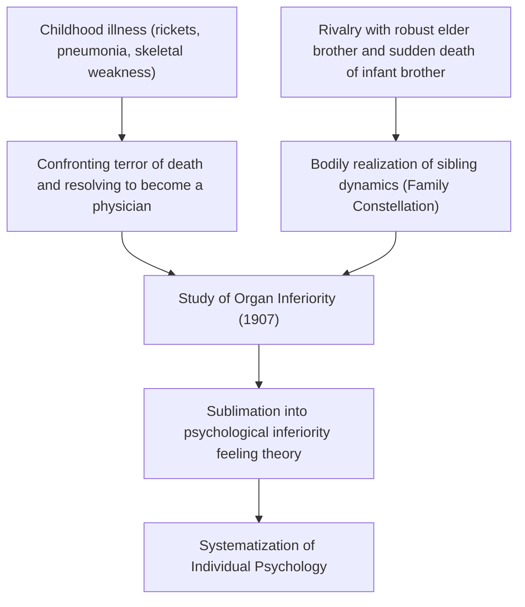
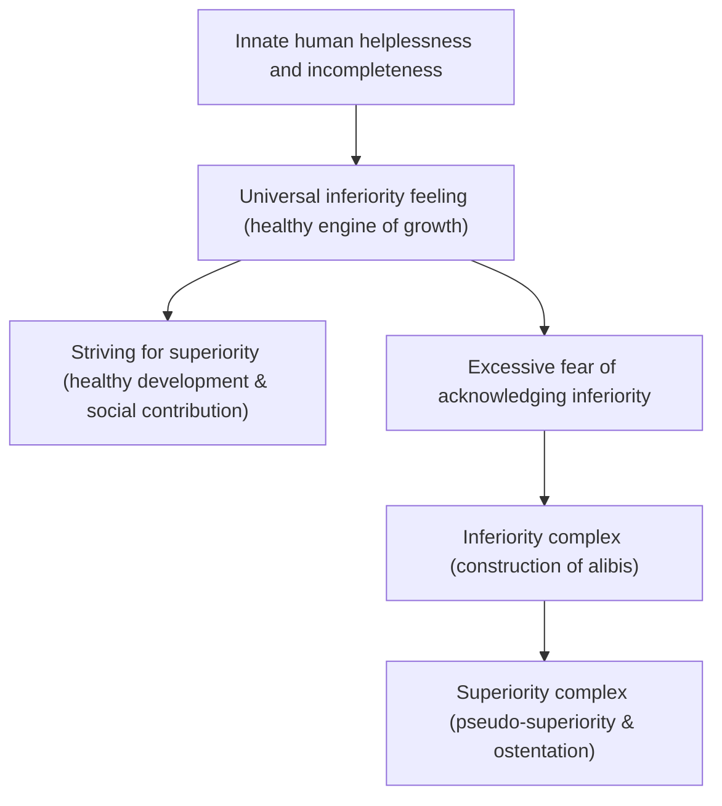
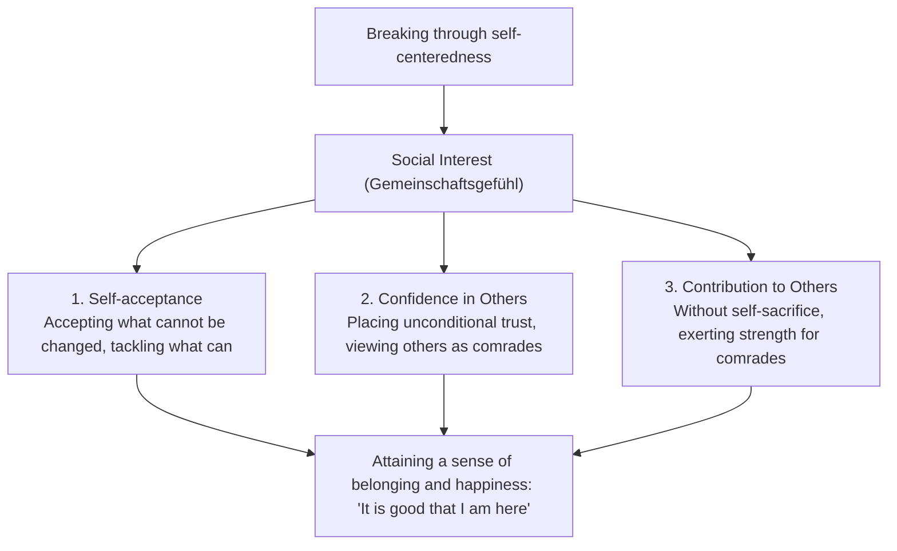
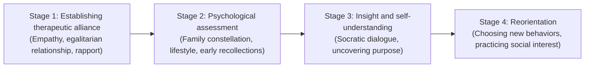

## Introduction: Why Alfred Adler Now?

In the current of depth psychology that arose in early 20th-century Vienna, "Individual Psychology" (German: *Individualpsychologie*), founded by Alfred Adler (1870–1937), continues to radiate an unparalleled practical vitality and forward-looking relevance even today.

While Sigmund Freud established "Psychic Determinism" rooted in unconscious instinctual drives (libido) and past trauma, and Carl Gustav Jung plunged into the mythological abyss of archetypes and the collective unconscious, the horizon opened up by Adler was exceptionally lucid, directed unswervingly toward "the concrete society and future in which human beings live."

At the core of Adler’s view of humanity lies the conviction that "human beings are not passive entities mechanically manipulated by past events, but integrated wholes living proactively and creatively toward goals they set for themselves." The term "Individual" in the name "Individual Psychology" derives from the Latin *individuus* (indivisible, that which cannot be divided). In other words, it is a philosophy that squarely rejects element-reductionism—which slices the mind into opposing components such as "conscious and unconscious," "reason and emotion," or "id, ego, and superego"—and instead grasps the human being as a unified, holistic living system (holism).

```
[Comparison of Paradigms Among the Three Great Depth Psychology Schools]

┌───────────────────┬───────────────────────────────┬───────────────────────────────┬───────────────────────────────┐
│ School / Founder  │ Sigmund Freud                 │ Carl Gustav Jung              │ Alfred Adler                  │
├───────────────────┼───────────────────────────────┼───────────────────────────────┼───────────────────────────────┤
│ School Name       │ Psychoanalysis                │ Analytical Psychology         │ Individual Psychology         │
│ View of Human     │ Mechanistic / Deterministic   │ Teleological / Archetypal     │ Agentic / Holistic            │
│                   │ (Past trauma & instincts)     │ (Mythology & numinous psyche) │ (Teleology & self-creation)   │
│ Psychic Structure │ Conscious / Preconscious /    │ Personal Unconscious /        │ Indivisible Integrated Whole  │
│                   │ Unconscious (Divided)         │ Collective Unconscious        │ (Holism)                      │
│ Primary Drive     │ Libido (Sexual & Destructive) │ Psychic Wholeness / Self-     │ Striving for Superiority /    │
│                   │                               │ Realization (Archetypes)      │ Social Interest               │
│ Therapy / Approach│ Recall of past repression &   │ Dream analysis, integration of│ Lifestyle reorientation &     │
│                   │ abreaction (catharsis)        │ archetypes, individuation     │ encouragement                 │
└───────────────────┴───────────────────────────────┴───────────────────────────────┴───────────────────────────────┘
```

Adlerian psychology is far more than merely a clinical psychology school. It is a practical existential philosophy and a democratic theory of social education that addresses the fundamental human question: "How can one overcome feelings of inferiority, cooperate with others, and achieve a genuine sense of belonging and happiness?" Starting from his intellectual struggle with Freud, this treatise systematically elucidates in full academic rigor the entire architecture of his theoretical system: teleology, feelings of inferiority and the striving for superiority, lifestyle, the three life tasks, social interest (Gemeinschaftsgefühl), the separation of tasks, and its profound lineage connecting to contemporary cognitive behavioral therapy (CBT) and positive psychology.

---

## 1. Adler's Life and the Historical Genesis of Individual Psychology

### 1.1 Childhood Illness and the Primordial Landscape of "Organ Inferiority"
Alfred Adler was born on February 7, 1870, in Penzing, near Vienna, the capital of the Austro-Hungarian Empire, as the second son of a Jewish grain merchant family.

To understand Adler’s psychology, his intense bodily experiences in early childhood are indispensable. Adler suffered from severe rickets in his early years, which delayed his skeletal development and left him unable to walk properly until the age of four. Furthermore, at age five, he contracted near-fatal acute pneumonia and overheard his physician tell his father from his bedside that "the boy’s life cannot be saved." The moment he miraculously recovered from this existential crisis, Adler etched a firm goal (a guiding fiction) in his heart: "I will overcome illness and become a physician who fights the terror of death."

In addition, his fierce sense of rivalry and inferiority toward his physically robust and athletically gifted older brother, Sigmund, as well as the tragic sudden death of his younger brother in the bed next to him in infancy—these harsh realities of death, illness, physical fragility, and sibling comparison formed the unshakable primordial foundation for what he would later formulate as "Organ Inferiority" (*Organminderwertigkeit*), the "Inferiority Feeling" (*Minderwertigkeitsgefühl*), and the "Family Constellation" theory.



### 1.2 The Wednesday Psychological Society and the Break with Freud (1902–1911)
After graduating from the Faculty of Medicine at the University of Vienna, Adler began his career as an ophthalmologist, later transitioning to general medicine and then psychiatry. While examining numerous circus performers, artisans, and working-class patients at the Prater amusement park, he developed a profound fascination with the phenomenon of "overcompensation" (*Überkompensation*), whereby an individual with congenital or acquired weaknesses in a specific organ (organ inferiority) develops other organs or mental functions to an extraordinary degree to compensate for it.

In 1902, following a newspaper book review in which Adler defended Freud's *The Interpretation of Dreams*, Freud invited him to become a founding member of a small study group that met on Wednesday evenings at Freud's residence (the "Wednesday Psychological Society," later the Vienna Psychoanalytic Society). By 1910, Adler was appointed president of the Vienna Psychoanalytic Society and was widely regarded as one of Freud’s foremost successors.

However, their intellectual honeymoon did not last long. While Freud insisted on pansexualism—reducing the etiology of all neuroses to "infantile sexuality (repression and fixation of libido)"—Adler contended that the fundamental driver of human behavior is not sexual instinct, but the "will to superiority aiming to overcome one's weakness and helplessness," "aggression," and the "drive for self-assertion."

In 1911, the definitive rupture occurred. During meetings of the Vienna Psychoanalytic Society, Adler delivered a series of lectures critiquing Freud’s sexual theory and presenting his own doctrine of the "Masculine Protest" (*Männlicher Protest*). Freud fiercely denounced Adler’s theory as a heresy that denied the very core of psychoanalysis and refused any compromise. Adler resigned from the presidency of the society and the editorship of its journal, departing the psychoanalytic society along with nine aligned colleagues. The following year, in 1912, Adler and his circle adopted the name "Society for Free Psychoanalysis," soon renaming it the "Society for Individual Psychology." Thus, "Individual Psychology," fully emancipated from Freudian psychoanalysis, was officially born.

---

## 2. Teleology vs. Causality: A Paradigm Shift in Psychology

### 2.1 The Limits of Mechanistic Causality and the Rejection of Trauma
The most radical shift forming the theoretical backbone of Adlerian psychology is the relentless critique of "Causality" (*Kausalität*) and the introduction of "Teleology" (*Teleologie*).

Classical psychiatry represented by Freud and modern science applied an Isaac Newton-style "law of cause and effect" to the domain of the human psyche. This is the formula stating that "a past event (A) caused the present state (B)." For example, it explains: "Because someone was abused by parents in childhood and grew up without love (A), they developed anthropophobia (social phobia) in the present and cannot adapt to society (B)."

Adler sharply critiqued such mechanistic causality. According to Adler, past events themselves do not determine a person. If past trauma inevitably dictated a human being, everyone who grew up in severe adversity would without exception develop identical neuroses, leaving no room for human free will or recovery. Adler asserted emphatically:

> "No experience is a cause of success or failure. We do not suffer from the shock of our experiences—the so-called trauma—but we make out of them whatever suits our purposes."
> (*What Life Could Mean to You*, 1931)

```
[Epistemological Contrast between Causality and Teleology]

■ Causality (Freudian Causal Determinism)
Past Facts (parental abuse, heartbreak, failure)
  -- "Inevitable causal bond (external determination)" -->
Present Outcome (social phobia, withdrawal, lethargy)
* Human beings are puppets of the past; unable to alter the past, they fall into despairing fatalism.

■ Teleology (Adlerian Action Theory & Agency)
Present Hidden Goal (desire to avoid conflict with others, fear of being hurt)
  -- "Choice of means to achieve the goal (internal creative act)" -->
Generation of Present Symptoms & Emotions (actively creating anxiety, anger, fear)
* Past facts are merely raw materials. Humans utilize memories of the past to serve "present goals."
```

### 2.2 The Architecture of Teleology and the "Use" of Emotion
In Adler’s teleology, human behaviors, emotions, and even psychiatric symptoms (anxiety, depression, panic, obsessions) are understood as "means" employed to accomplish a "hidden goal" unconsciously harbored by the individual.

Consider, for example, a patient with social anxiety disorder who experiences trembling limbs, blushing, and mutism in front of an audience:
- **Causal explanation**: "Due to the trauma of having made an embarrassing mistake in front of a crowd in the past, an unconscious fear conditioning is operating."
- **Teleological explanation**: "The patient harbors the goal of 'not wanting to be humiliated in public' or 'inability to tolerate having their incompetence exposed if they fail.' To accomplish that goal, they generate somatic symptoms such as 'blushing' and 'trembling,' thereby securing a valid excuse (alibi): 'I cannot appear before people because I am ill.'"

Crucial here is the perspective that emotions (anger, anxiety, sadness) do not passively "assail" a person from without; rather, they are "tools fabricated and used" by the person to fulfill their own purposes.

Adler presented his famous "instrumental theory of anger." Suppose a mother is screaming at her child in explosive rage. In that very instant, the child’s homeroom teacher calls on the telephone. The moment the mother picks up the receiver, her voice shifts to an impeccably polite, gentle tone to converse with the teacher. As soon as she hangs up, she instantly resumes her hysterical fury, screaming at the child. If anger were an irresistible physiological impulse overtaking human agency, such an instantaneous transition to calm, rational dialogue within seconds would be impossible. The mother deliberately invoked and utilized the emotion of anger for the specific purpose of "subjugating the child immediately and making them obey."

In Adlerian psychology, humans are not slaves to their emotions. They are sovereign agents who select and deploy emotions in service of their goals.

---

## 3. Inferiority Feeling, Inferiority Complex, and Striving for Superiority

### 3.1 From Organ Inferiority to Universal Inferiority Feeling
In his early career treatise *Study of Organ Inferiority* (*Studie über Minderwertigkeit von Organen*, 1907), Adler analyzed the functional imperfections of physical organs and the organism’s compensatory reactions to them. An individual harboring innate vulnerabilities in the heart, kidneys, or sensory organs strives to overcome these deficits through compensatory efforts mediated by the central nervous system.

Adler dramatically extended this physiological and pathological insight into the psychological domain. Human beings are born into this world in an exceptionally helpless, fragile condition compared to other animals. Lacking sharp fangs, claws, or thick fur, an infant cannot survive even a single day without parental protection. Consequently, during childhood, every human being is surrounded by adults possessing overwhelming power and is inevitably forced into a vivid awareness of their own helplessness, smallness, and incompleteness.

Adler designated the psychological tension arising from the desire to break out of this state of helplessness as the "Inferiority Feeling" (*Minderwertigkeitsgefühl*). Most critically, for Adler, **the inferiority feeling itself is not pathological; rather, it is a healthy, universal engine of growth through which humanity evolves and flourishes**.



### 3.2 Rigorous Conceptual Distinction: Inferiority Feeling vs. Inferiority Complex
In everyday speech, the term "complex" is often used synonymously with simple feelings of inferiority. In Adlerian psychology, however, "Inferiority Feeling" and "Inferiority Complex" are categorically distinguished.

1. **Inferiority Feeling (Minderwertigkeitsgefühl)**:
   A subjective sense of imperfection arising from the recognition of the gap between one's current reality and one's ideal state. Statements like "I lack sufficient knowledge, so I will study harder" or "My technical skills are immature, so I will practice" serve as healthy motivations to overcome tasks through effort and diligence.

2. **Inferiority Complex (Minderwertigkeitskomplex)**:
   A pathological state wherein an individual exploits the inferiority feeling as an excuse (alibi) to flee from life tasks. It constructs an apparent causal link (pseudo-causality): "Because A exists, B is impossible." Examples include: "Because I lack an elite academic background, I cannot succeed," "Because I am not physically attractive, I cannot marry," or "Because my parents raised me poorly, I cannot participate in society."
   A person trapped in an inferiority complex abandons the resolution of tasks through genuine effort, standing paralyzed while shielding their fragile self-esteem behind their perceived inferiority to escape inconvenient realities.

### 3.3 The Superiority Complex and the Pathology of the Will to Power
When an individual suffering from an inferiority complex can no longer bear the agony of looking their perceived inferiority in the face, it frequently surfaces in reverse as a "Superiority Complex" (*Überlegenheitskomplex*).

A superiority complex is a defense mechanism wherein, rather than making real efforts to surmount difficulties, an individual flees into a "fictitious superiority, behaving as if they were superior." Concretely, it manifests in the following forms:

- **Ostentation of Authority (Basking in Reflected Glory)**: Boasting of personal connections with celebrities or powerful figures, or armoring oneself in luxury brands, titles, and pedigree.
- **Bragging and Fixation on Past Glory**: Continually recounting past heroic deeds to mask present inertia and lack of initiative.
- **"Ostentatious Suffering" and Domination through Weakness**: Endlessly lamenting how harsh one's circumstances are, how wounded and afflicted one is, thereby eliciting sympathy from others, manipulating them through guilt, and demanding special treatment. Adler termed this the "privileging of weakness" and regarded it as one of the most treatment-resistant forms of the superiority complex.

### 3.4 The Healthy Trajectory of Striving for Superiority
Adler initially called the primordial drive to overcome feelings of inferiority the "aggressive drive," the "will to power," or the "masculine protest." In his later years, however, he sublimated this into the far more comprehensive concept of the "Striving for Superiority" (*Streben nach Überlegenheit* / striving toward upward development).

A healthy striving for superiority is emphatically not about winning competitions against others, defeating them, or ruling over them. Rather, it means **"not comparing oneself with others, but comparing oneself with one's own ideal, stepping beyond one's current boundaries."** It is a process of self-elevation on a horizontal plane where one meets others as equals. When the striving for superiority turns toward a "vertical hierarchy (dominance and submission)," it becomes a breeding ground for neurosis; when it turns toward "horizontal cooperation (contribution to the community)," it transforms into creative, healthy self-realization.
---

## 4. Holism and Lifestyle: The Cognitive Architecture of the Individual

### 4.1 Holism: The Indivisible Human Being
Adlerian psychology's first axiom is "Holism." Ever since René Descartes, the father of modern rationalism, Western thought has been dominated by "mind-body dualism," dividing the psyche and the physical organism into two distinct entities. In psychiatry as well, Freud divided the mind into conflicting constituents—"conscious / unconscious" and "ego / id / superego"—modeling intrapsychic conflict.

Adler completely rejected this element-reductionism. In Adler's view, a human being is an indivisible unity (*individual* = *in-* [not] + *dividual* [divisible]).
- "Reason" and "emotion" are not in conflict. Emotions are produced in service of the goals pursued by reason, functioning in close concert with reason.
- "Conscious" and "unconscious" are not antagonistic. Both coordinate toward the very same goal, representing two sides of the same coin. The unconscious simply refers to "the sphere of goals that the individual has not yet articulated or brought to conscious awareness."
- "Mind" and "body" are not independent entities. When an individual feels intense anxiety, the heart rate quickens and stomach cramps occur because mind and body are responding to crisis as a single, coordinated whole.

Adlerian psychology admits no dualistic excuses such as "I knew it in my head, but my emotions got the better of me" or "My unconscious desires forced me to act against my rational judgment." It attributes full responsibility to the whole person as the sovereign author of action: "I, for that specific purpose, utilized the emotion of anger to shout."

```
[Structural Discrepancy between Element-Reductionism (Freud) and Holism (Adler)]

■ Element-Reductionism (Psychic Fragmentation Model)
┌─────────────────────────────────────────┐
│ Superego (Morals & Norms)               │
├─────────────────────────────────────────┤  <-- Intrapsychic conflict & division
│ Ego (Rationality adapted to reality)    │
├─────────────────────────────────────────┤  <-- Repression & resistance
│ Id (Unconscious instinctual desires)    │
└─────────────────────────────────────────┘
* Breeds self-deception: "My instincts overpowered my reason" or "My unconscious controls me."

■ Holism (Indivisible Integration Model)
┌─────────────────────────────────────────────────────────────────────────────┐
│                          The Whole Person (Indivisible Self)                │
│                                                                             │
│  Teleological Unified System:                                               │
│  Reason, emotion, conscious, unconscious, and body all coordinate to        │
│  accomplish a single, hidden overarching goal (Lifestyle).                  │
└─────────────────────────────────────────────────────────────────────────────┘
* Ultimate responsibility for all behaviors and emotions resides in the integrated "I."
```

### 4.2 Definition and Three Components of Lifestyle
In Adlerian psychology, the central concept designating the totality of an individual's character, personality, worldview, and cognitive patterns is "Lifestyle" (*Lebensstil*). It is the direct precursor to the concept of "schema" and "cognitive structure" in contemporary cognitive therapy.

Lifestyle is the "characteristic pattern of meaning-giving toward the self and the world" that a human being actively chooses and constructs in early childhood (roughly by age four to six) in order to survive within their bodily conditions, familial atmosphere, and cultural context. Once formed, the lifestyle operates unconsciously as a lifelong navigational compass filtering all adult perception, thinking, feeling, and action.

In Adlerian psychology, lifestyle consists of the following three components:

1. **Self-concept**:
   The conviction and core beliefs one holds about oneself ("I am..."). E.g., "I am helpless," "I am brilliant," or "I am unlovable."
2. **Self-ideal**:
   The subjective standards one sets for how one ought to be ("I must be..." / "I should be..."). E.g., "I must always be number one," "I must be treated kindly by everyone," or "I must never make a mistake."
3. **Picture of the World (Weltbild / View of the World)**:
   The core convictions one holds regarding others and the environment ("Others and society are..."). E.g., "The world is full of peril," "Others are enemies seeking to exploit me," or "Life is unpredictable and absurd."

If an individual's lifestyle is constructed such that the self-concept is "I am helpless," the self-ideal is "I must never be hurt," and the picture of the world is "People around me are aggressive and cold-hearted," then in every interpersonal situation that individual will be excessively on guard, interpret others' trivial remarks as hostility, and resort to withdrawal and avoidance. From the standpoint of that person’s lifestyle, this is neither a pathological defect nor an irrational flaw, but a completely logical and consistent course of action.

### 4.3 Diagnostic Significance of Early Recollections
As a powerful clinical technique for bringing an individual's unconscious lifestyle into objective relief, Adler formulated the analysis of "Early Recollections."

Early recollections require the client to recall their earliest memories (typically specific single incidents from before age six to eight) and recount in vivid detail the scene, the figures involved, their own actions, and the exact feelings experienced at that moment.

Freud treated early childhood memories as "traces of historical facts" or "fossils of repressed trauma." Adler, from his teleological vantage point, understood memory as "a creative story actively selected, reconstructed, and preserved from myriad past occurrences in order to justify and reinforce one's present lifestyle." Human beings do not remember the past objectively as it happened; they retain and color only those memories that suit their present goals.

```
[Analytical Paradigm of Early Recollections]

- Memory Content: "When I was five, I fell out of a tree in the garden and hurt my leg. My mother came running and hugged me tightly."
  ↓
- Analytical Perspectives:
  1. Active or passive? (Did I act on my own initiative, or wait for something to happen?)
  2. What was the role of others? (Enemies who left me in danger, or protectors who rescued me?)
  3. What was the self-perception? (A vulnerable, helpless entity)
  ↓
- Extracted Lifestyle Conviction:
  "The world is full of dangers. I am a helpless person who gets hurt if I let my guard down.
   However, if I display weakness and plead for help, others will protect me tenderly."
  ↓
- Consistency with Current Behavioral Patterns:
  When encountering difficulties, the individual avoids solving them independently and instead highlights illness or weakness to elicit external support.
```

Adler asserted that "the objective truth of an early recollection—whether it is historical fact or personal fantasy and distortion—is irrelevant." What matters is: **"Why, out of thousands of childhood experiences, does this person stubbornly preserve this specific scene in their memory today?"** Within the early recollection is condensed the master blueprint of how the individual currently perceives the world and the strategic compass by which they navigate life.

---

## 5. The Three Life Tasks and Social Interest

### 5.1 The Three Life Tasks
Adler formulated the interpersonal challenges that no human being living in society can escape as the "Life Tasks" (*Lebensaufgaben*). He categorized them into three successive tiers: the "Work Task," the "Friendship Task," and the "Love Task."

```
[Hierarchy and Degree of Difficulty of the Three Life Tasks]

[Love Task]
- Target: Extremely close relationships with partners, spouses, and family
- Demand Level: Utmost psychological proximity, self-disclosure, shared destiny, maintenance of equality
- Excuses for Avoidance: Fear of restriction, infidelity, moral harassment, perfectionism

[Friendship Task]
- Target: Friends, neighbors, local community; egalitarian comradeship beyond self-interest
- Demand Level: Horizontal trust free of competition, altruism, mutual affirmation
- Excuses for Avoidance: "Fear of being betrayed," "Nobody understands me"

[Work Task]
- Target: Occupational activities, economic production, network of social division of labor
- Demand Level: Adherence to rules, fundamental cooperativeness, commitment to outcomes
- Excuses for Avoidance: Fear of failure, anxiety over evaluation, procrastination, social phobia
```

1. **Work Task**:
   The task of participating in the network of social division of labor and producing value beneficial to others so that human beings can survive biologically. Among the three, self-interests are clearest and behaviors are governed by contracts and rules; thus, its interpersonal difficulty is considered the lowest. Yet escaping from it results in economic collapse and social maladjustment.

2. **Friendship Task**:
   The task of building genuine friendships and comrade relationships free from direct economic interests. It demands relationships where people do not compete, but trust one another as equal human beings and feel safe revealing vulnerabilities. Many people constrict their human relationships here out of suspicious fear: "What if I am betrayed?"

3. **Love Task**:
   The task of forming the most intimate, enduring one-to-one relationships in life—romantic partnerships, marriages, and parent-child bonds. Because psychological distance shrinks to near zero, one's most hidden weaknesses and flaws are laid bare. It demands pursuing "the happiness of the two" as equal partners, without seeking to dominate or obsessively craving the other's approval. Hence, it is the most difficult of the three tasks.

According to Adler, all psychological issues (neuroses, social withdrawal, delinquency, depressive states) arise when individuals, confronted with these life tasks, flee from them out of terror that failure will wound their self-esteem (the so-called "Life Lie" / *Lebenslüge*).

### 5.2 The Full Spectrum of Social Interest (Gemeinschaftsgefühl)
The philosophical summit and most profound concept of Adlerian psychology is "Social Interest" (*Gemeinschaftsgefühl*). Literally translated as "community feeling" or "feeling of community," it is commonly rendered in English scholarship as "Social Interest."

Social interest is defined as **"switching from self-centeredness (attachment to self) to social interest (concern for others)."** It is the state of viewing others not as "enemies" but as "comrades," experiencing a secure sense of belonging: "I have a place in the community."

Adler asserted that the single, absolute barometer of mental health is the level of social interest. An individual lacking social interest views the world as a predatory battlefield of dog-eat-dog competition, seeing others merely as threatening adversaries or exploitable instruments. Consequently, they are perpetually tormented by loneliness and dread, tumbling into neurotic conflicts in search of pseudo-superiority.



### 5.3 The Three Pillars Constituting Social Interest
To operationalize social interest into practical and clinical dimensions, contemporary Adlerian psychology formulates it through three interconnected pillars:

1. **Self-acceptance**:
   Distinct from mere "self-affirmation (positive thinking)." While self-affirmation is a form of self-deception ("telling oneself 'I can do it' even when one cannot"), self-acceptance is the courage to accept one's unable, imperfect self just as one is, while exerting maximum effort toward what can be changed. It resonates fully with the Serenity Prayer: "God, grant me the serenity to accept the things I cannot change, the courage to change the things I can, and the wisdom to know the difference."

2. **Confidence in Others**:
   Distinct from "credit." Credit means trusting someone with collateral, guarantees, or conditions (like a bank loan). In contrast, confidence in others means trusting others unconditionally, without any collateral or guarantees. Naturally, the risk of betrayal exists. However, by recognizing that whether another betrays you is "their task," whereas whether you extend trust is "your task," one emancipates oneself from the cage of suspicion.

3. **Contribution to Others**:
   Distinct from "self-sacrifice." Wearing oneself out and sacrificing one's life or well-being for others is merely neurotic devotion driven by the desire for approval. Genuine contribution to others means "proactively exerting one's abilities for fellow community members in order to experience one's own existential meaning and worth." Adler famously stated: "Happiness is the feeling of contribution." The lived realization of contributing to others imparts the conviction that "I have worth," becoming the fountainhead of the courage to live.

---

## 6. Separation of Tasks and the Psychology of Courage

### 6.1 The Logical Structure of the Separation of Tasks
As a razor-sharp scalpel for resolving human relationship conflicts at their roots, Adlerian psychology introduces the "Separation of Tasks."

All interpersonal friction, conflict, and stress arise either from "barging into other people's tasks" or "permitting others to barge into one's own tasks."

Adler presented an extraordinarily simple and lucid criterion for distinguishing whose task it is:
**"Who ultimately receives the consequences brought about by the chosen course of action?"**

```
[Concrete Example of Separation of Tasks: The Child's Studying Problem]

- Parental Thinking (Confusion of Tasks):
  "If the child doesn't study, they will suffer in the future, so I must force them to study."
  → The parent intrudes authoritarianly into the child's task (domination and control).
  → The child rebels, turning studying into a "weapon to torment the parents."

- Resolution Based on Separation of Tasks:
  1. "Who ultimately bears the consequences of studying or not studying—such as failing to enter a chosen school?"
     → The one who bears the ultimate outcome is [the child themselves] (the child's task).
  2. What can the parent do?
     → Not commanding them to "study!", but preparing an environment ready to assist whenever the child wishes to learn,
        and conveying the stance: "I believe in your capabilities and am watching over you" (readiness to support & supportive vigilance).
```

The separation of tasks by no means signifies cold indifference or neglect. Neglect means not knowing what the child is doing and taking no interest. Adler's style of support is crystallized in the proverb: "You can lead a horse to water, but you cannot make him drink." Deciding whether to drink is the horse's (the individual's) task; forcing its jaws open to pour water down its throat is nothing less than violence and domination.

### 6.2 The Rejection of the Desire for Approval and the Definition of "Freedom"
As the inexorable conclusion of thoroughly pursuing the separation of tasks, Adlerian psychology resolutely rejects the "Desire for Approval" that saturates contemporary society.

According to Adler, those who live driven by the desire for approval—craving recognition, praise, and evaluation from others—are essentially living "other people's lives." To obsess over others' evaluations is an impossible attempt to manipulate what is strictly [the other person's task]: namely, how they judge you.

In Adlerian psychology, "Freedom" is defined as: **"Not fearing being disliked by others."**
Trying to please everyone and being all things to all people is unprincipled, a grueling penance of constantly falsifying one's lifestyle. Walking the path one believes to be right, while leaving whether others like or dislike you as "their task," belongs to a realm beyond your jurisdiction. Acting autonomously based on one's conscience and the sense of contribution to the community, free from dependence on external validation, is the indispensable condition for true spiritual freedom.
---

## 7. Encouragement and Democratic Educational Theory

### 7.1 Comprehensive Critique of Reward-and-Punishment: The Perils of Praise
One of the most provocative propositions in Adlerian clinical and educational theory is the "total ban on reward-and-punishment education (praising and scolding)."

In conventional child-rearing and corporate management, the approach of "raising through praise" is widely lauded. However, Adler pierced through to the core nature of praising. The act of "praising" inherently embodies **a vertical relationship (hierarchy) wherein a capable person looks down upon an incapable person to evaluate and manipulate them**. When an adult says to another adult on equal footing, "Good job, you are very clever," it feels unnatural and insulting precisely because a vertical power dynamic is implied.

```
[Paradigm Contrast between "Praise/Reprimand" and "Encouragement"]

┌────────────────────┬───────────────────────────────┬───────────────────────────────┐
│ Dimension          │ Reward & Punishment (Praise / │ Encouragement                 │
│                    │ Reprimand)                    │                               │
├────────────────────┼───────────────────────────────┼───────────────────────────────┤
│ Relational Premise │ Vertical (Hierarchy,          │ Horizontal (Egalitarian,      │
│                    │ Domination, Manipulation)     │ Respect, Trust)               │
│ Standard of Value  │ Outcome, Ability, Comparison  │ Process, Intention, Self-     │
│                    │ with Others                   │ Comparison                    │
│ Resulting Psyche   │ Desire for Approval, Fear of  │ Confidence, Autonomy, Feeling │
│                    │ Failure, Dependency           │ of Contribution, Self-Efficacy│
│ Motivation Nature  │ Extrinsic (For reward,        │ Intrinsic (Spontaneous        │
│                    │ avoidance of punishment)      │ contribution to community)    │
│ Concrete Phrases   │ "Great job!", "Amazing you got│ "Thank you for helping,"      │
│                    │ 100 points!"                  │ "I am so glad you did this"   │
└────────────────────┴───────────────────────────────┴───────────────────────────────┘
```

According to Adler, the greatest detriment of "praise" is that it instills in children or subordinates a severe addiction to approval: "I won't act unless I am praised," or "I cannot feel worthy without external evaluation." Furthermore, they begin to perceive the absence of praise as a "punishment," developing an extreme dread of failure and avoiding new challenges.

Conversely, "reprimanding" is even more destructive. Scolding is merely an immature means of communication that abandons constructive verbal dialogue, resorting to the cheap power of emotion (anger) to subjugate the other person. The reprimanded party does not genuinely reflect upon their faults, but instead nurtures defensive and vengeful impulses: "How can I hide this next time so I don't get caught?" and "How can I get back at them?"

### 7.2 Techniques of Encouragement and Horizontal Relationships
As the alternative to reward and punishment, Adler introduced "Encouragement."
Encouragement is defined as **"assistance that elicits from within the individual the vitality (courage) to overcome difficulties,"** conducted strictly on the basis of an egalitarian "horizontal relationship."

The core techniques of encouragement are as follows:

1. **Expressing Gratitude and Joy ("Thank you," "I am glad")**:
   Instead of judging the person from above, one conveys one's subjective feelings regarding how their action helped oneself or the community. "Thank you for helping, that was a huge relief," or "I am truly glad you are here." Through this, the recipient gains the conviction (self-efficacy): "I have the power to contribute to others," and "I have worth."
2. **Focusing on Process and Intention**:
   Rather than fixating on "outcomes" such as test scores or sales figures, one attends to the "process of effort" and the "attempts" leading up to them. "You persevered and didn't give up until the very end," or "You were really creative in this part." Failure is precisely the greatest opportunity for encouragement, opening an egalitarian dialogue on "What can we learn from this experience?"
3. **Focusing on Strengths Rather than Defects (Reframing)**:
   Reframing characteristics that the individual perceives as inferior into a positive context: viewing "easily bored / fickle" as "full of curiosity and quick to adapt," or "stubborn" as "possessing strong conviction and perseverance."

### 7.3 Child Guidance Clinics and Public Education Reform in Vienna
Adler’s theories did not remain abstract ivory-tower speculations; they unfolded as massive social practices. Following World War I, in "Red Vienna"—where the Social Democratic Workers' Party took municipal leadership after the Austrian Revolution—Adler collaborated with the Vienna Municipal School Board to establish more than 30 "Child Guidance Clinics" (*Erziehungsberatungsstellen*) within public schools.

Adler’s child guidance clinics were groundbreaking systems where physicians, teachers, parents, and children sat together as equals in an open forum for educational counseling. Adler believed that dismantling autocratic, authoritarian domination in families and schools and fostering democratic, cooperative communities was the only path to preventing neurosis, delinquency, and future wars in the next generation. This pioneering work in Vienna served as the direct antecedent of modern school psychology and school counseling.

---

## 8. Techniques and Process of Adlerian Clinical Counseling

### 8.1 Establishing the Therapeutic Relationship: A Collaborative Alliance
The therapeutic relationship in classical psychoanalysis possessed an asymmetric, authoritarian structure: the patient lay on the couch while the analyst sat behind in silence, issuing authoritative interpretations.

Adlerian counseling revolutionized this setting. Counselor and client sit facing each other in chairs of identical height. The two are "equal co-researchers," forging an egalitarian partnership (collaborative alliance) to untangle the knot of the client's life. The counselor is not an omniscient authority, but a facilitator who walks alongside the client as they resolve their life tasks through their own agency.



### 8.2 Psychological Assessment: Family Constellation
In the assessment phase, the Adlerian approach places paramount emphasis on analyzing the "Family Constellation" (family structure).

Adler discovered that the lifestyle an individual develops is profoundly influenced by their birth order among siblings and their subjective interpretation of that position.

- **Firstborn Child (Oldest)**: Having once enjoyed exclusive parental affection, they experience the "dethroned monarch" crisis upon the birth of the second child. They tend to look back nostalgically on past glory, placing high value on order, authority, and rules. They are prone to high conscientiousness, conservatism, and responsibility.
- **Second Child (Middle Child)**: From birth, a front-runner and rival (the firstborn) is already in place; thus, they operate in a "full-throttle race." They strive to excel in domains different from the eldest, often becoming rebellious, innovative, or highly diplomatic and cooperative.
- **Youngest Child**: Never dethroned, they are either pampered by the entire family or develop fierce ambition to outstrip all siblings. They easily form a dependent lifestyle: "I ought to be loved even if I do nothing."
- **Only Child**: Having no sibling competitors, they grow up entirely surrounded by adults. While prone to self-centeredness, they often exhibit precocious intelligence and advanced competence.

Crucially, birth order itself does not mechanistically determine the individual; rather, what matters is **"what survival strategy (lifestyle) the child actively chose to secure parental attention and belonging within that relational configuration."**

### 8.3 Socratic Dialogue and Insight
Adlerian intervention proceeds not through lecturing or unilateral instruction, but through "Socratic Dialogue," modeled after the maieutic (midwifery) method of ancient Greek philosopher Socrates.

The counselor never poses backward-looking causal questions such as "Why did you do that?" Instead, they ask teleological questions: "What are you seeking to achieve through that behavior?" or "If that symptom were to disappear completely, how would your daily life change?"

Through this process, the client independently awakens to and confronts the "life lies" and "fictitious goals" they have unconsciously maintained. Adlerian insight is not mere intellectual comprehension, but the proactive realization that "I myself, and no one else, am the author of my own life script" (author of one's life).

### 8.4 Reorientation: Experimenting with New Behaviors
In the final phase of "Reorientation" (redirection), the client discards old, non-constructive lifestyles and chooses and puts into practice a new way of living grounded in social interest.

Adlerians avoid staying trapped in the verbal abstraction of the consulting room; they assign "concrete behavioral experiments" in real, everyday life:
- Starting tomorrow, greet the neighbor with a smile instead of walking past silently.
- Express words of appreciation to one's partner instead of voicing criticism.
- Abandon perfectionism and share work with others at the 80% completion stage to seek collaborative feedback.

Adler taught that "it is always possible to change one's character (lifestyle)." Human beings can re-choose their lifestyle at any moment. What is required is not innate talent or ability, but solely the **"Courage to Change."**

---

## 9. Influence on Modern Thought, Cognitive Behavioral Therapy (CBT), and Well-Being

### 9.1 Adler as the Hidden Pioneer of Cognitive Behavioral Therapy
From the late 20th century to the present, Cognitive Behavioral Therapy (CBT) has become the gold standard of global psychiatric care and psychotherapy. Its founding figures, Albert Ellis (Rational Emotive Behavior Therapy: REBT) and Aaron T. Beck (Cognitive Therapy: CT), both openly acknowledged that they were profoundly influenced by Adler.

Albert Ellis stated unequivocally that "Adler is probably the true founder of modern cognitive therapy." Ellis's famous ABC Model (Activating Event, Belief, Consequence) is a modern adaptation of Adler's lifestyle theory.

```
[Genealogical Lineage between Adlerian Psychology and Cognitive Therapy]

[Epictetus (Stoic Philosophy)]
"Men are disturbed not by things, but by the view which they take of them."
  ↓
[Alfred Adler (Individual Psychology, 1912–)]
- Teleology: Meaning-giving (the view taken), not the event itself, determines emotion and behavior.
- Lifestyle: The "cognitive schema" formed in childhood.
- Proactive personal responsibility and reorientation.
  ↓
[Albert Ellis (Rational Emotive Behavior Therapy, 1955–)]
- ABC Model (Disputation of irrational beliefs)
[Aaron T. Beck (Cognitive Therapy, 1960s–)]
- Automatic thoughts, Core Beliefs, correction of Cognitive Distortions
```

Beck's formulation of "cognitive distortions" (all-or-nothing thinking, catastrophizing, overgeneralization, mental filtering) corresponds perfectly to the structural defects of "Private Logic" (*privatlogik*) described by Adler back in the 1910s and 1920s. Adlerian psychology stands as the fountainhead of modern cognitive therapies, bridging the historic divide between psychodynamic depth psychology and cognitive-behavioral science.

### 9.2 Resonance with Existentialism and Pragmatist Philosophy
Adler’s view of humanity resonates deeply in the history of philosophy with American "Pragmatism" and European "Existentialism."

Adler drew decisive theoretical inspiration from Hans Vaihinger’s masterpiece *The Philosophy of 'As If'* (*Die Philosophie des Als Ob*, 1911). Humans cannot directly access absolute objective reality; instead, they operate according to self-constructed "fictions" (hypotheses as if something were true). Adler imported this into psychology, postulating that the goals directing human behavior are not objective entities, but "subjectively fabricated final goals (fictions)."

Furthermore, Jean-Paul Sartre’s existentialist declaration that "man is condemned to be free" and "existence precedes essence" aligns astonishingly with Adler’s liberation from past causality and insistence on personal responsibility. Adler was an existential psychologist who refused to allow individuals to hide behind excuses about their fate, continuously defending the freedom to choose one's attitude even in the most brutal circumstances—a conviction that became the central premise of Viktor Frankl’s logotherapy.

### 9.3 Forerunner of Positive Psychology and Well-Being Research
In the late 1990s, Martin Seligman and colleagues established "Positive Psychology." Its core framework, the PERMA model of sustainable flourishing (Positive Emotion, Engagement, Relationships, Meaning, Accomplishment), can be seen as a contemporary empirical verification of Adler’s social interest (belonging, contribution to others, overcoming tasks).

Recent empirical findings in neuroscience and social psychology—the theory of social capital, the neurochemical link between altruistic behavior and oxytocin release, and determinants of subjective well-being—repeatedly confirm that "contribution to others and high-quality human relationships are the single greatest predictors of human happiness and longevity." The proposition of "social interest," derived by Adler a century ago from clinical intuition and philosophical coherence, is being powerfully validated by cutting-edge 21st-century science.

---

## 10. Conclusion: A Practical Philosophy of Self-Determination and Courage

The most potent message that Alfred Adler’s Individual Psychology offers to contemporary humanity is a philosophy of uncompromising hope and resolve: **"Life can always be started anew from this very moment."**

Modern society is saturated with narratives of environmental and biological determinism: genetic reductionism, neurochemical determinism, economic disparity, and the "parent lottery." Causal narratives declaring "I am this way because of my genes," "I am broken because my parents raised me poorly," or "It is the fault of social structures" may offer temporary solace to a wounded ego. Yet simultaneously, they constitute a spiritual prison that perpetually binds the individual as a helpless, pathetic object of past circumstances.

Adlerian psychology ruthlessly strips away the narcotic of facile victimhood.
What occurred in the past does not matter. How one's parents acted does not matter. What matters is: "How do you use what you have been given?"

> "It is not what one has inherited that is important, but what one does with the inheritance."
> (*What Life Could Mean to You*)

Adler’s teachings are at times stern, containing blunt truths from which one might wish to look away. Yet behind that sternness lies a gaze of infinite faith and tender respect for human potential. Every human being possesses the "creative power" to weave anew the story of their life with their own hands. Stepping off the sterile treadmill of comparison and competition, breaking free from slavery to the desire for approval, trusting one's neighbors as comrades, and offering one's talents for the community: the spiritual fortitude required to take that first bold step—that is the eternal legacy Alfred Adler left to the world, known simply as "Courage."
