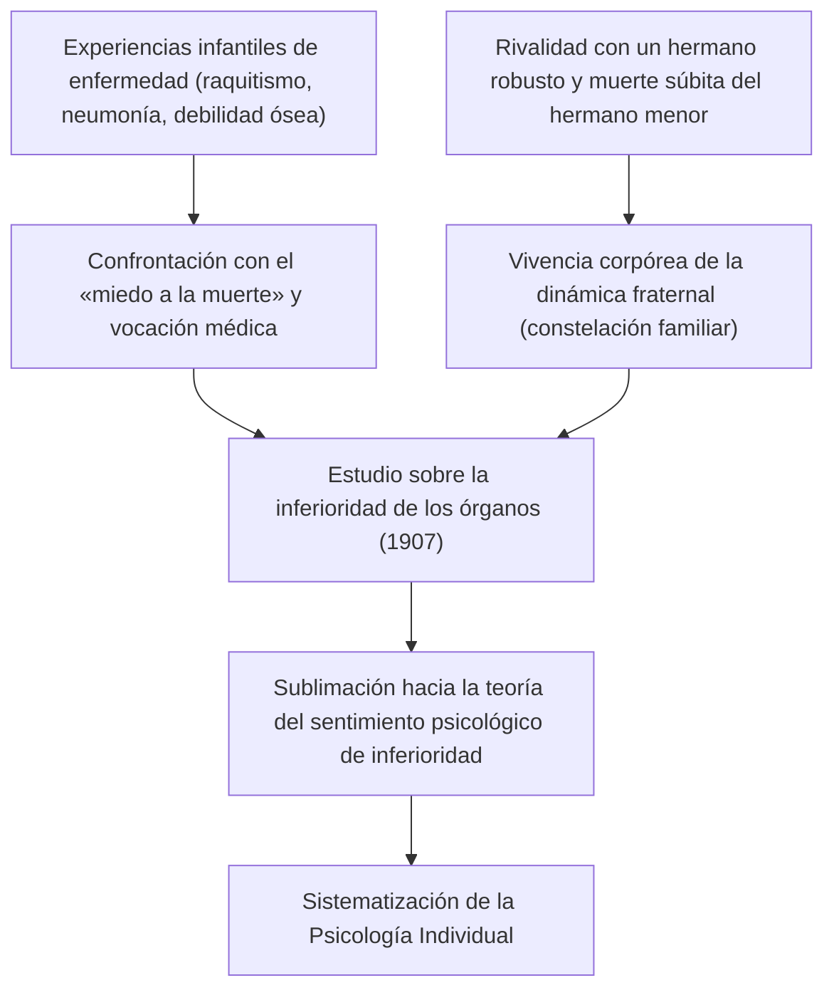
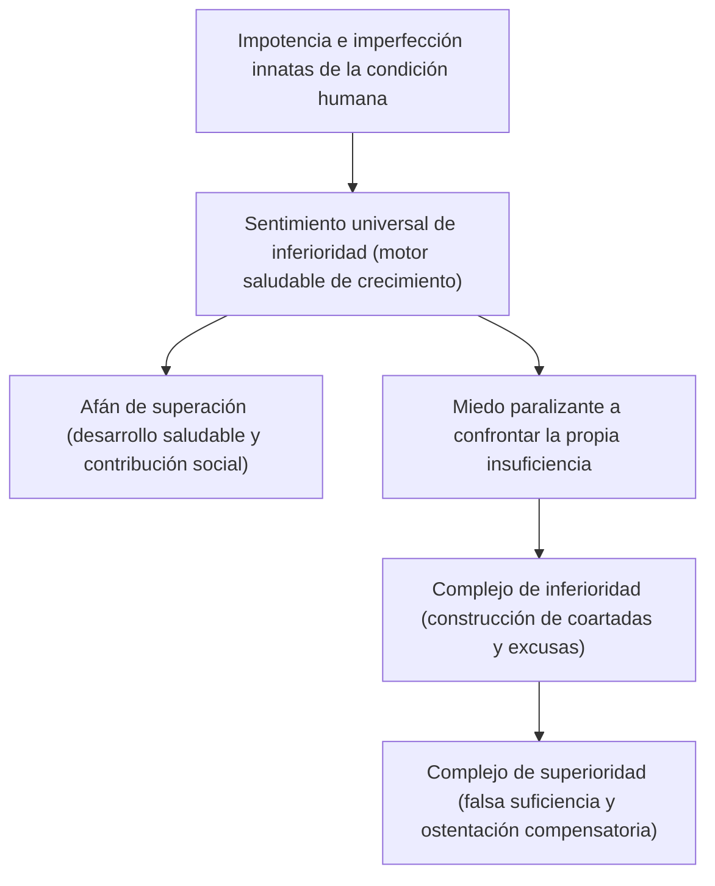
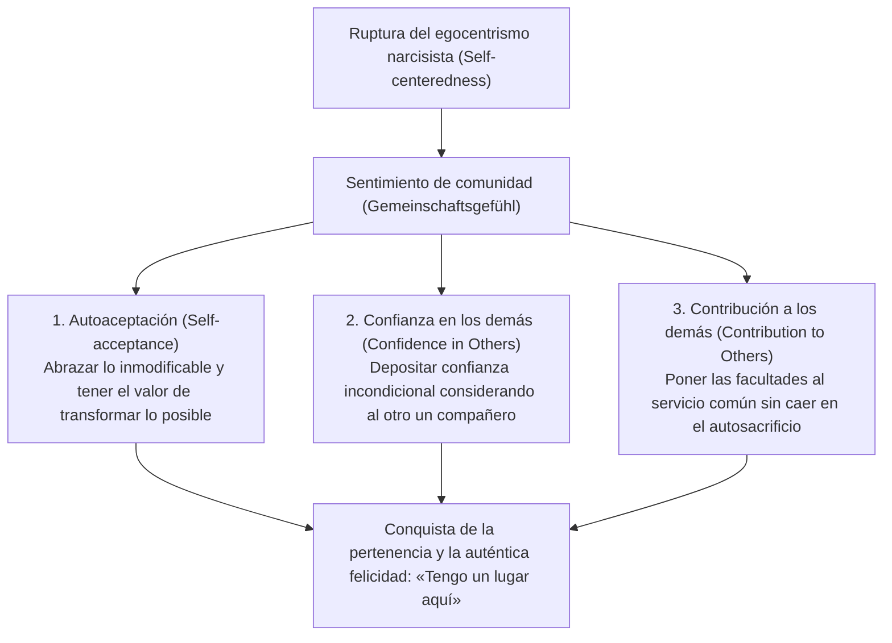
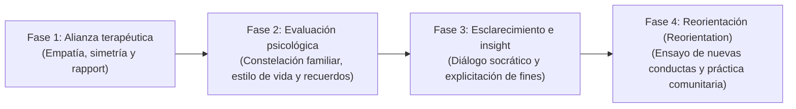

## Introducción: Por qué Alfred Adler hoy

En el seno de las corrientes de la psicología profunda que emergieron en la Viena de principios del siglo XX, la «Psicología Individual» (*Individual Psychology* / en alemán: *Individualpsychologie*), fundada por Alfred Adler (1870–1937), continúa irradiando en la actualidad una vigencia práctica y un carácter vanguardista sin parangón.

Mientras Sigmund Freud erigía un «determinismo psíquico» (*Psychic Determinism*) anclado en los impulsos instintivos inconscientes (la libido) y en los traumas del pasado, y Carl Gustav Jung se sumergía en los abismos mitológicos de los arquetipos y del inconsciente colectivo, el horizonte trazado por Adler destacaba por una lucidez extraordinaria, orientado de manera decidida hacia «la sociedad real y el futuro en el que viven los seres humanos».

En la base de la concepción humana de Adler subyace una convicción fundamental: el ser humano no es un ente pasivo gobernado mecánicamente por los sucesos de su pasado, sino una existencia integrada que vive de forma subjetiva y creadora orientada hacia los fines que él mismo se propone. El término «Individual» con el que bautizó a su escuela procede del latín *individuus* (lo indivisible, lo que no puede ser escindido). Es decir, constituye un rechazo frontal al reduccionismo elemental que despedaza la mente en compartimentos opuestos como «consciente e inconsciente», «razón y emoción» o «ello, yo y superyó», concibiendo en su lugar al ser humano como un sistema vital unitario y holístico (holismo y totalidad organismal).

```
【Comparación paradigmática de las tres grandes corrientes de la psicología profunda】

┌──────────────────┬───────────────────────────────┬───────────────────────────────┬───────────────────────────────┐
│ Escuela / Creador│ Sigmund Freud                 │ Carl Gustav Jung              │ Alfred Adler                  │
├──────────────────┼───────────────────────────────┼───────────────────────────────┼───────────────────────────────┤
│ Denominación     │ Psicoanálisis (Psychoanalysis) │ Psicología analítica          │ Psicología individual         │
│ Concepción humana│ Mecanicista y determinista    │ Teleológica y arquetípica     │ Subjetivista y holística      │
│                  │ (fijación en el trauma)       │ (mitología y espíritu)        │ (orientada a fines/teleología)│
│ Estructura psique│ Consciente / Preconsciente /  │ Inconsciente personal /       │ Totalidad integrada e         │
│                  │ Inconsciente (fragmentada)    │ Inconsciente colectivo        │ indivisible (holismo)         │
│ Motivación básica│ Libido (pulsión sexual /      │ Totalidad psíquica            │ Afán de superación y          │
│                  │ pulsión de muerte)            │ (autorrealización/arquetipos) │ sentimiento de comunidad      │
│ Abordaje clínico │ Rememoración de represiones y │ Análisis de sueños /          │ Reorientación del estilo de   │
│                  │ abreacción de traumas pasados │ individuación de arquetipos   │ vida y aliento (animar)       │
└──────────────────┴───────────────────────────────┴───────────────────────────────┴───────────────────────────────┘
```

La psicología adleriana trasciende las fronteras de una mera corriente de la psicología clínica. Representa una filosofía existencial práctica y un pensamiento de pedagogía social democrática que responde a la pregunta de cómo el ser humano debe sobreponerse a sus sentimientos de inferioridad, cooperar armónicamente con sus semejantes y conquistar el sentido de pertenencia y la auténtica felicidad. En el presente ensayo, partiendo de su confrontación teórica con Freud, desentrañaremos con rigor académico la totalidad de su armazón doctrinal: la teleología, el sentimiento de inferioridad y el afán de superación, el estilo de vida, las tres tareas de la vida, el sentimiento de comunidad, la separación de tareas, y sus profundas ramificaciones en la terapia cognitivo-conductual (TCC) moderna y en la psicología positiva.

---

## 1. La vida de Adler y la historia formativa de la Psicología Individual

### 1.1 Las vivencias infantiles de enfermedad y el panorama originario de la «inferioridad de órgano»
Alfred Adler nació el 7 de febrero de 1870 en Penzing, una localidad en las inmediaciones de Viena, capital del Imperio austrohúngaro, como segundo hijo de una familia de comerciantes de cereales de ascendencia judía.

Para comprender cabalmente la psicología adleriana resulta imprescindible remitirse a las traumáticas vivencias corporales de su propia niñez. Durante su infancia, Adler padeció un severo cuadro de raquitismo que retrasó el desarrollo de su sistema esquelético, impidiéndole caminar de manera autónoma hasta los cuatro años de edad. A los cinco años contrajo una neumonía aguda de extrema gravedad; mientras yacía en cama, escuchó al médico dictaminar a su padre que el niño no tenía salvación posible. Al recuperarse milagrosamente de aquel estado límite, Adler grabó en su corazón una meta irrevocable (una ficción rectora): sobreponerse a la fragilidad corporal y convertirse en un médico capaz de vencer el pavor a la muerte.

A estas experiencias se sumaron una enconada rivalidad y un lacerante sentimiento de inferioridad respecto a su hermano mayor, Sigmund —un niño atlético y vigoroso—, así como la trágica muerte súbita de su hermano menor, fallecido a su lado en la cuna cuando Alfred aún era muy pequeño. La cruda realidad de la muerte, la enfermedad, la vulnerabilidad somática y la inevitable comparación entre hermanos constituyeron el suelo nutricio indiscutible del que brotaron más adelante sus conceptos de «inferioridad de órgano» (*Organ Inferiority*), «sentimiento de inferioridad» (*Inferiority Feeling*) y la teoría de la «constelación familiar» (*Family Constellation*).



### 1.2 La Sociedad Psicológica de los Miércoles de Viena y la ruptura con Freud (1902–1911)
Tras graduarse en la Facultad de Medicina de la Universidad de Viena, Adler inició su ejercicio profesional como oftalmólogo, pasando posteriormente a la medicina interna general y, finalmente, a la psiquiatría. Al atender clínicamente a numerosos acróbatas del parque de atracciones del Prater, artesanos y pacientes de la clase trabajadora, concibió un vivo interés por un fenómeno recurrente: las personas aquejadas de debilidades congénitas o adquiridas en órganos concretos (inferioridad de órgano) tendían a compensar dicha tara desarrollando de forma hipertrófica otras funciones corporales o psíquicas, proceso al que denominó sobrecompensación (*Überkompensation* / *Overcompensation*).

En 1902, tras publicar una reseña en la prensa defendiendo *La interpretación de los sueños* de Freud frente a las críticas imperantes, fue invitado personalmente por este a integrarse en el selecto círculo de debate que se reunía los miércoles por la noche en el domicilio freudiano (la «Sociedad Psicológica de los Miércoles», germen de la posterior Asociación Psicoanalítica de Viena). Adler se convirtió en uno de sus miembros fundadores y, hacia 1910, asumió la presidencia de la Asociación Psicoanalítica de Viena, siendo considerado unánimemente el discípulo y sucesor más aventajado de Freud.

Sin embargo, la sintonía entre ambos no tardó en quebrantarse. Mientras Freud se atrincheraba en un pansexualismo intransigente que reducía la etiología de todas las neurosis a la sexualidad infantil (represión y fijación de la libido), Adler sostenía con firmeza que el motor primordial de la conducta humana no residía en las pulsiones sexuales, sino en la voluntad de superar la propia debilidad e impotencia (el afán de superioridad), en la agresividad y en el anhelo de autoafirmación.

En 1911 se produjo la ruptura irreconciliable. Durante las sesiones ordinarias de la Asociación Psicoanalítica de Viena, Adler pronunció una serie de conferencias en las que refutó abiertamente la doctrina de la libido freudiana y formuló su tesis de la «protesta masculina» (*Masculine Protest* / *männlicher Protest*). Freud condenó las tesis adlerianas tachándolas de herejía intolerable que amenazaba el núcleo dogmático del psicoanálisis, rehusando cualquier compromiso doctrinal. En respuesta, Adler dimitió de la presidencia de la asociación y de la dirección de su revista oficial, abandonando la organización junto a nueve correligionarios. En 1912, el grupo escindido adoptó inicialmente el nombre de «Sociedad para el Psicoanálisis Libre», para pasar a denominarse poco después «Sociedad de Psicología Individual» (*Society for Individual Psychology*). Nacía así formalmente la Psicología Individual, emancipada de forma definitiva del psicoanálisis freudiano.

---

## 2. Teleología vs. Causalismo: El cambio de paradigma en la psicología

### 2.1 Los límites de la causalidad mecanicista (Causality) y la negación del trauma
El giro conceptual más radical y subversivo que vertebra la arquitectura teórica de Adler es su crítica implacable a la causalidad determinista (*Causality*) y la entronización metódica de la «teleología» (*Teleology*).

Tanto la psiquiatría clásica encarnada por Freud como la ciencia natural decimonónica trasladaron de forma acrítica el principio de causalidad newtoniano al territorio de la psique humana. Según este esquema mecanicista, «un acontecimiento del pasado (A) determina inexorablemente el estado actual (B)». Por ejemplo: «Haber sufrido maltrato y carencia afectiva en la infancia (A) es la causa de que en el presente se desarrolle fobia social y una incapacidad para adaptarse al entorno (B)».

Adler arremetió con virulencia contra esta visión determinista. Desde su óptica, los sucesos pretéritos jamás determinan mecánicamente al ser humano. Si los traumas del pasado ejercieran una tiranía causal absoluta sobre la personalidad, todos los individuos criados en circunstancias adversas deberían desarrollar idénticas neurosis sin excepción alguna, clausurando cualquier margen para el libre albedrío, la responsabilidad ética o la curación. Adler lo enunció con meridiana contundencia:

> «Ninguna experiencia es en sí misma causa de éxito o fracaso. No sufrimos por el impacto de nuestras experiencias —el llamado trauma—, sino que extraemos de ellas aquello que conviene a nuestros propósitos y le otorgamos un significado propio».
> (*What Life Could Mean to You*, 1931)

```
【Contraste epistemológico entre causalidad y teleología】

■ Causalismo (Causalidad freudiana / Determinismo mecanicista)
Hecho pretérito (maltrato infantil, rechazo amoroso, fracaso escolar)
  -- "Conexión causal ineludible (determinación heterónoma externa)" -->
Efecto presente (fobia social, confinamiento voluntario, apatía)
* El ser humano queda reducido a una marioneta del pasado; al no poder cambiar el pasado, desemboca en un fatalismo desolador.

■ Teleología (Teoría adleriana de la acción / Subjetivismo fenomenológico)
Propósito oculto en el presente (eludir el conflicto social, protegerse de ser herido)
  -- "Elección de medios para consumar el fin (creación deliberada interna)" -->
Generación de síntomas y afectos actuales (producción activa de angustia, ira o terror)
* Los hechos del pasado son meros materiales. El individuo instrumentaliza sus recuerdos para legitimar su «objetivo actual».
```

### 2.2 La estructura de la teleología (Teleology) y el «uso» de las emociones
Bajo el prisma teleológico adleriano, la conducta humana, las emociones e incluso los cuadros psicopatológicos floridos (angustia, depresión clínica, crisis de pánico, obsesiones) se conciben como «instrumentos» orquestados para alcanzar una «meta oculta» (*Hidden Goal*) que el sujeto persigue de modo inconsciente.

Tomemos como ilustración el caso de un paciente diagnosticado con trastorno de ansiedad social, que experimenta temblores incontrolables, rubor facial y mudez al hablar en público:
- **Explicación causalista**: «Un trauma pretérito en el que hizo el ridículo ante una audiencia desencadena un condicionamiento fóbico involuntario».
- **Explicación teleológica**: «El sujeto alberga el propósito primordial de "no exponerse a la vergüenza pública" y "evitar a toda costa que los demás descubran su supuesta incompetencia". Para consumar dicho fin, genera de manera activa los síntomas fisiológicos del rubor y el temblor, proveyéndose así de una coartada incontestable: "Es mi enfermedad la que me impide presentarme ante el público"».

La piedra angular de este enfoque radica en entender que las emociones (la ira, la tristeza, el pánico) no irrumpen pasivamente desde el exterior «asaltando» al sujeto, sino que son «herramientas fabricadas y puestas en juego» por el propio individuo para materializar sus designios.

Adler ilustró este principio mediante su célebre anécdota del «uso instrumental de la ira». Imaginemos a una madre increpando a su hijo a voz en cuello, dominada por una aparente furia incontenible. En el paroxismo de sus gritos suena el teléfono: es el tutor escolar del niño. En una fracción de segundo, la madre modula su timbre vocal hacia una cadencia exquisitamente dulce, sosegada y cortés. Concluida la llamada, cuelga el auricular y de inmediato retoma los alaridos con idéntica virulencia contra su hijo. Si la cólera fuese un arrebato fisiológico incontrolable que secuestra la conciencia, semejante basculación hacia el sosiego racional en cuestión de segundos resultaría biológicamente imposible. La madre invocó y manipuló voluntariamente la emoción de la ira con un fin inequívoco: doblegar al instante la resistencia del hijo y someterlo a su arbitrio.

Para la Psicología Individual, el ser humano no es esclavo de sus pasiones, sino el soberano que selecciona y administra sus emociones en función de sus metas vitales.

---

## 3. Sentimiento de inferioridad, complejo de inferioridad y afán de superación

### 3.1 De la inferioridad de órgano al sentimiento universal de inferioridad
En su temprana monografía médica *Estudio sobre la inferioridad de los órganos* (*Studie über Minderwertigkeit von Organen*, 1907), Adler examinó la imperfección morfológica o funcional de los órganos y los mecanismos de compensación fisiológica que el organismo despliega ante ellos. Un corazón, un riñón o unos órganos sensoriales con taras congénitas estimulan en el sistema nervioso central un esfuerzo de compensación orientado a neutralizar el déficit.

Adler extrapoló con genialidad estas observaciones biomédicas a la dimensión psicológica. En comparación con cualquier otra especie del reino animal, el ser humano viene al mundo en un estado de extrema indefensión y fragilidad biológica. Desprovisto de garras afiladas, de colmillos letales y de un pelaje aislante, un bebé humano no sobreviviría un solo día sin los cuidados asiduos de sus progenitores. Todo ser humano atraviesa así una infancia prolongada en la que se halla ineluctablemente rodeado de adultos omnipotentes, viéndose forzado a constatar su pequeñez, su torpeza y su vulnerabilidad originaria.

A la tensión psicológica originada por el anhelo de sustraerse a esa condición de desvalimiento, Adler la bautizó como «sentimiento de inferioridad» (*Minderwertigkeitsgefühl* / *Inferiority Feeling*). El postulado cardinal adleriano reside en que **el sentimiento de inferioridad no constituye en modo alguno una tara patológica, sino el motor universal, saludable e indispensable del progreso, el crecimiento y la evolución humana** (*Engine of Growth*).



### 3.2 Distinción conceptual rigurosa: sentimiento de inferioridad vs. complejo de inferioridad
En el lenguaje cotidiano suele emplearse de forma laxa el vocablo «complejo» como sinónimo indiferenciado de sentirse inferior. En la Psicología Individual, no obstante, media un abismo conceptual insalvable entre el «sentimiento de inferioridad» y el «complejo de inferioridad» (*Inferiority Complex*).

1. **Sentimiento de inferioridad (*Inferiority Feeling* / *Minderwertigkeitsgefühl*)**:
   Percepción subjetiva de insuficiencia nacida del contraste entre el estado actual y un estado ideal al que se aspira. Se manifiesta en formulaciones saludables como: «Carezco de los conocimientos precisos, luego debo estudiar más» o «Mi pericia técnica aún es deficiente, luego debo redoblar la práctica». Opera como un estímulo vigoroso para afrontar las exigencias reales de la existencia a través de la disciplina y el trabajo constructivo.

2. **Complejo de inferioridad (*Inferiority Complex*)**:
   Cuadro patológico en el cual el sujeto instrumentaliza su sentimiento de inferioridad como excusa sistemática para eludir las tareas de la vida. Se articula bajo la falacia de una causalidad aparente: «No puedo hacer B porque padezco A». «No puedo triunfar profesionalmente porque carezco de títulos universitarios», «No puedo aspirar a una pareja porque no soy agraciado físicamente», «No puedo integrarme en la sociedad porque mis padres me educaron pésimamente».
   Quien se refugia en un complejo de inferioridad claudica en la resolución activa de sus desafíos vitales, erigiendo su debilidad como una trinchera defensiva para salvaguardar un amor propio amenazado por el miedo al fracaso.

### 3.3 El complejo de superioridad y la patología de la voluntad de poder
Cuando un individuo atrapado en el complejo de inferioridad se siente incapaz de tolerar la humillación de reconocer su supuesta incompetencia, engendra a menudo como mecanismo reactivo y compensatorio un «complejo de superioridad» (*Superiority Complex*).

El complejo de superioridad es un ardid neurótico que consiste en huir hacia una «ilusión de magnificencia y grandiosidad», simulando ser superior a los demás en lugar de realizar el esfuerzo genuino que demanda transformar la realidad. Adopta típicamente las siguientes manifestaciones:

- **Ostentación de autoridad y brillo prestado**: Alardear constantemente de vínculos con personalidades influyentes, exhibir posesiones de lujo desmedidas o parapetarse tras títulos nobiliarios o corporativos para intimidar al prójimo.
- **Autoelogio jactancioso y fijación en laureles pretéritos**: Narrar hasta el hartazgo hazañas caducas con el objeto de camuflar la esterilidad y la inacción del presente.
- **«Ostentación del infortunio» y dominio mediante la debilidad**: Exponer con dramatismo la propia desdicha, las tragedias padecidas y el sufrimiento personal a fin de suscitar conmiseración, manipular a los demás mediante la culpa y reclamar fueros especiales. Adler calificó esta conducta como «la tiranía de la debilidad» o «la debilidad convertida en privilegio», considerándola una de las variantes del complejo de superioridad más refractarias a la psicoterapia.

### 3.4 La orientación saludable del afán de superación (Striving for Superiority)
El impulso basal que empuja al ser humano a rebasar sus carencias originarias fue conceptualizado por Adler en sus inicios bajo las etiquetas de «pulsión de agresión», «voluntad de poder» o «protesta masculina». En su madurez teórica, sin embargo, depuró y universalizó dicha noción bajo el concepto omnicomprensivo de «afán de superación» (*Striving for Superiority* / en alemán: *Streben nach Überlegenheit* o impulso hacia el autoperfeccionamiento).

Un afán de superación saludable no guarda el menor parentesco con «aplastar, someter o vencer a los semejantes en una contienda despiadada». Por el contrario, consiste en **«no compararse jamás con los demás, sino medirse con el propio ideal, trascendiendo las limitaciones personales paso a paso»**. Se trata de un autoperfeccionamiento desplegado en un plano estrictamente horizontal, donde todos los seres humanos conviven como iguales. Cuando el afán de superación se distorsiona en una «jerarquía vertical» (relaciones de dominación, sumisión y pugna por el estatus), se erige en caldo de cultivo de la neurosis; cuando florece en el horizonte de la «cooperación horizontal» (contribución activa al bienestar común), engendra una autorrealización creadora, robusta y mentalmente sana.

---
## 4. Holismo y estilo de vida: La arquitectura cognitiva del individuo

### 4.1 Holismo (Holism): El ser humano como totalidad indivisible
El primer axioma fundacional de la psicología adleriana es el «holismo» (*Holism*). Desde los albores del racionalismo moderno fundado por René Descartes, el pensamiento occidental ha permanecido subyugado por el «dualismo psicofísico», que escinde tajantemente el espíritu del cuerpo. En el terreno de la psiquiatría, Freud perpetuó este modelo reduccionista al desmembrar la vida anímica en componentes antagónicos: «consciente / inconsciente» y «yo / ello / superyó», concibiendo al individuo como un teatro de desgarramientos y conflictos intrasíquicos perpetuos.

Adler impugnó de raíz semejante reduccionismo elemental. Para la Psicología Individual, el ser humano constituye una unidad orgánica indisociable (*Individual* = *in-individuus*, lo no divisible):
- La «razón» y la «emoción» no libran una batalla fratricida. Las emociones son convocadas intencionalmente para satisfacer los objetivos que la razón persigue, funcionando en perfecta sincronía funcional con ella.
- Lo «consciente» y lo «inconsciente» no son instancias beligerantes. Constituyen las dos caras inseparables de una misma moneda, orientadas hacia una única e idéntica finalidad. Lo inconsciente designa simplemente «aquel territorio de nuestros propósitos que el individuo todavía no ha verbalizado o no desea admitir conscientemente».
- La «mente» y el «cuerpo» no son sustancias autónomas e incomunicadas. La taquicardia o la opresión epigástrica que sobrevienen ante una amenaza no son más que la respuesta coordinada con la que el organismo entero, como una totalidad viva, afronta una situación de crisis.

Por consiguiente, la psicología adleriana no concede validez a pretextos dualistas como «mi cabeza comprende lo que debe hacer, pero mis emociones me desbordan» o «un impulso inconsciente me obligó a actuar contra mi voluntad». En su lugar, imputa la responsabilidad ética y ejecutiva a la totalidad de la persona (*Whole Person*): «Fui yo mismo quien, para imponer mi voluntad, recurrió a la emoción de la cólera para increpar al otro».

```
【Diferencia estructural entre el reduccionismo elemental (Freud) y el holismo (Adler)】

■ Reduccionismo elemental (Modelo de escisión psíquica freudiano)
┌─────────────────────────┐
│ Superyó (moral/normas)  │
├─────────────────────────┤  ← Conflicto interno y desgarramiento
│ Yo (razón adaptativa)   │
├─────────────────────────┤  ← Represión y resistencia
│ Ello (pulsiones/deseos) │
└─────────────────────────┘
* Engendra el autoengaño: «Mi instinto venció a mi razón» o «El inconsciente me domina».

■ Holismo (Modelo de integración indivisible adleriano)
┌─────────────────────────────────────────────────────────────────────────────┐
│                 El ser humano total (El sí mismo indivisible)               │
│                                                                             │
│  Unidad teleológica integrada:                                              │
│  Razón, emoción, consciencia, inconsciente y organismo corporal cooperan     │
│  estrechamente para alcanzar «una única meta oculta (el estilo de vida)».   │
└─────────────────────────────────────────────────────────────────────────────┘
* La responsabilidad última de cada acción y emoción radica en el «yo» unificado.
```

### 4.2 Definición y tres componentes del estilo de vida (Lifestyle)
En el léxico adleriano, la categoría nuclear que designa la totalidad del carácter, la personalidad, la cosmovisión y los patrones de procesamiento cognitivo es el «estilo de vida» (*Lifestyle* / en alemán: *Lebensstil*). Se trata del predecesor conceptual indiscutible de los «esquemas cognitivos» (*schemas*) y los mapas de significado de la terapia cognitiva contemporánea.

El estilo de vida es el patrón rector y estable de significación sobre el mundo y sobre uno mismo, que el individuo forja de forma creadora durante su primera infancia (aproximadamente entre los cuatro y los seis años de vida) como estrategia adaptativa para sobrevivir en función de su dotación corporal, su atmósfera familiar y su marco sociocultural. Una vez cristalizado, opera a espaldas de la conciencia como una brújula axiomática que filtra y modula todas las percepciones, pensamientos, afectos y conductas de la vida adulta.

Dentro de la doctrina adleriana, el estilo de vida se desglosa analíticamente en tres pilares constitutivos:

1. **El autoconcepto (*Self-concept*)**:
   La convicción apodíctica que el individuo alberga acerca de su propia naturaleza («Yo soy...»): «Soy una persona frágil e indefensa», «Soy brillante y superior», «Soy un ser defectuoso e indigno de afecto».
2. **El autoideal (*Self-ideal*)**:
   El canon ético o de perfección subjetivo al que cree que debe ceñirse («Yo debo ser...» / «Tengo que ser...»): «Debo ser siempre el número uno», «Debo ser tratado con benevolencia por todo el mundo», «Jamás debo permitirme el menor desliz o equivocación».
3. **La visión del mundo (*Weltbild* / *Picture of the World*)**:
   La creencia nuclear relativa a las exigencias y peligros del entorno social («Los demás y la vida son...»): «El mundo es un paraje hostil y amenazante», «Los demás son rivales que intentan explotarme», «La existencia humana es un juego impredecible e injusto».

Si una persona ha articulado un estilo de vida sustentado en un autoconcepto de «soy débil», un autoideal de «no puedo exponerme a ser herido» y una visión del mundo según la cual «los seres humanos son crueles y agresivos», es enteramente lógico que reaccione con recelo patológico en sus vínculos interpersonales, descifre cualquier gesto neutro como una afrenta y recurra a la inhibición y al aislamiento. No estamos en presencia de una anomalía biológica incomprensible, sino de una conducta plenamente coherente y racional a la luz de las premisas de su peculiar estilo de vida.

### 4.3 El significado diagnóstico de los primeros recuerdos (Early Recollections)
Para desentrañar de manera objetiva el estilo de vida inconsciente que rige a un sujeto, Adler desarrolló una de las herramientas de diagnóstico clínico más agudas y originales: el análisis de los «primeros recuerdos» o «recuerdos tempranos» (*Early Recollections*).

Esta técnica consiste en solicitar al consultante que evoque el recuerdo visual y episódico más remoto que conserve en su memoria (por lo general, una escena concreta situada antes de los seis u ocho años de edad), describiendo con la mayor exactitud los personajes intervinientes, la secuencia de los acontecimientos y la tonalidad emocional experimentada en aquel instante.

Mientras Freud interpretaba las memorias infantiles como vestigios arqueológicos de hechos traumáticos sepultados, Adler, fiel a su enfoque teleológico, postuló que la memoria es un acto de recreación selectiva: una narración fabricada conscientemente o inconscientemente que extrae retazos del pasado para apuntalar, justificar y ratificar el estilo de vida presente. La mente humana no opera como una cámara fotográfica pasiva; solo preserva y matiza aquellos recuerdos que le resultan de utilidad práctica para legitimar sus objetivos actuales.

```
【Paradigma de análisis de los primeros recuerdos】

• Contenido del recuerdo: «A los 5 años, caí de un árbol del jardín y me lastimé una pierna. Mi madre vino corriendo desesperada y me estrechó en sus brazos».
  ↓
• Ejes analíticos de indagación:
  1. ¿Carácter activo o pasivo? (¿Tomó la iniciativa o aguardó pasivamente los hechos?)
  2. ¿Qué función desempeñan los demás? (¿El entorno es un peligro omiso o un refugio protector?)
  3. ¿Cómo se percibe a sí mismo? (Un ser indefenso, quebradizo y vulnerable).
  ↓
• Creencia del estilo de vida destilada:
  «El mundo exterior está plagado de amenazas mortales. Yo soy una criatura endeble que zozobra en cuanto se descuida.
   Sin embargo, si exhibo mi fragilidad y clamo por auxilio, los demás acudirán solícitos a protegerme y colmarme de atenciones».
  ↓
• Correspondencia con la conducta adulta actual:
  Ante cualquier encrucijada profesional o personal, en lugar de desplegar recursos propios, exagera sus dolencias somáticas y su desamparo para delegar la carga en terceros.
```

Adler sentenció con perspicacia que la veracidad factual del recuerdo —si el episodio aconteció puntualmente tal como se rememora o si se trata de una confabulación retrospectiva— carece por completo de relevancia clínica. Lo verdaderamente crucial es preguntarse: **«¿Por qué, entre los millones de acontecimientos acaecidos en su infancia, esta persona retiene empecinadamente esta escena específica en el día de hoy?»**. En esa estampa rememorada se halla condensado el plano arquitectónico fundamental que revela cómo el individuo descifra el cosmos y qué estratagema de supervivencia ha resuelto poner en práctica.

---

## 5. Las tres tareas de la vida y el sentimiento de comunidad

### 5.1 Las tres tareas de la vida (Life Tasks)
Adler sistematizó los desafíos vinculares ineludibles a los que todo ser humano debe enfrentarse en el tejido social bajo el concepto de las «tareas de la vida» (*Life Tasks* / en alemán: *Lebensaufgaben*), clasificándolas en una escala progresiva de compromiso y profundidad emocional: la «tarea del trabajo», la «tarea de la amistad» y la «tarea del amor».

```
【Jerarquía y nivel de dificultad de las tres tareas de la vida】

［La tarea del amor (Love Task)］
• Ámbito: Vínculos íntimos de pareja, conyugales y filiales de máxima cercanía.
• Exigencia: Cero distancia psicológica, máxima revelación del yo, destino compartido y reciprocidad simétrica.
• Coartadas de huida: Pánico al compromiso, celopatía, infidelidades sistemáticas, acoso moral y perfeccionismo.

［La tarea de la amistad (Friendship Task)］
• Ámbito: Amistades, vecinos, comunidad cívica y camaradería desinteresada al margen del lucro.
• Exigencia: Confianza horizontal exenta de pugnas competitivas, empatía y aceptación incondicional del otro.
• Coartadas de huida: «Temo que me traicionen», misantropía, convicción de que «nadie es capaz de comprenderme».

［La tarea del trabajo (Work Task)］
• Ámbito: Actividad laboral, cooperación en la división social del trabajo y producción económica.
• Exigencia: Acatamiento de normas, cooperación funcional mínima y compromiso con resultados tangibles.
• Coartadas de huida: Terror al error o a la crítica ajena, postergación crónica (procrastinación) y fobia social.
```

1. **La tarea del trabajo (*Work Task*)**:
   La exigencia biológica y colectiva de insertarse en la red de división del trabajo para generar bienes o servicios útiles a la colectividad. De las tres tareas, es la que cuenta con reglas institucionales más explícitas y contractuales; por ende, representa el nivel de intimidad interpersonal menos exigente. No obstante, claudicar ante ella acarrea la ruina material y la marginación productiva.

2. **La tarea de la amistad (*Friendship Task*)**:
   El desafío de trabar relaciones fraternas y de camaradería sin ningún tipo de interés crematístico ni dependencia funcional. Exige la capacidad de despojarse de la rivalidad y el cálculo utilitario, confiando de manera simétrica en los iguales y abriendo la propia vulnerabilidad. Incontables personas se atrincheran aquí en un aislamiento suspicaz bajo el pretexto de que la entrega amistosa entraña el riesgo inaceptable de la traición.

3. **La tarea del amor (*Love Task*)**:
   La construcción de una relación afectiva íntima, monógama y duradera con la pareja, así como los vínculos paternofiliales. Al colapsar la distancia psicológica a cero, el individuo queda enteramente expuesto: sus sombras, sus taras y sus debilidades más inconfesables salen inevitablemente a la luz. Exige renunciar a la tentación de dominar al cónyuge o de mendigar su aprobación compulsiva, fundando la búsqueda mancomunada del «bienestar de los dos» en condiciones de absoluta paridad e igualdad. Por estas razones, constituye la tarea más exigente y compleja de la vida humana.

A juicio de Adler, el conjunto de las psicopatologías —desde las neurosis de angustia y las depresiones hasta las conductas delictivas o el repliegue ermitaño— obedecen a un común denominador: el individuo, presa del pavor a que su autoestima se desmorone al fracasar en alguna de estas tres tareas, recurre a una deserción calculada que Adler denominó la «mentira vital» (*Life Lie* / *Lebenslüge*).

### 5.2 El panorama completo del sentimiento de comunidad (Gemeinschaftsgefühl / Social Interest)
La cima filosófica y el concepto más trascendental de la Psicología Individual es el «sentimiento de comunidad» (*Gemeinschaftsgefühl*), frecuentemente traducido en la literatura anglosajona como «interés social» (*Social Interest*).

El sentimiento de comunidad se define como **«el viraje radical desde el egocentrismo narcisista (*Self-centeredness*) hacia el genuino interés por el bienestar de los semejantes (*Social Interest*)»**, experimentando al prójimo no como un adversario amenazante, sino como un compañero de ruta (*fellow human*), y alcanzando la íntima certeza existencial de que uno posee un hogar y un arraigo indiscutible dentro del cosmos humano («pertenezco a este mundo»).

Adler sentenció que el grado de sentimiento de comunidad encarna el único criterio absoluto y objetivo para evaluar la salud mental de un individuo. Aquel que carece de él contempla la vida como una selva hobbesiana de fieras en pugna, donde los otros son competidores a derribar o instrumentos para la propia gratificación. Víctima permanente del desarraigo y la zozobra, queda encadenado a una lucha estéril por una superioridad ficticia que alimenta sin cesar el conflicto neurótico.



### 5.3 Los tres pilares constitutivos del sentimiento de comunidad
A fin de operacionalizar este principio en la práctica psicoterapéutica, la tradición adleriana contemporánea ha articulado el sentimiento de comunidad en tres actitudes operativas interconectadas:

1. **Autoaceptación (*Self-acceptance*)**:
   Conviene no confundirla con la vana «autoafirmación» del pensamiento positivo ilusorio. Mientras la autoafirmación recurre a consignas autoindulgentes como repetirse «yo todo lo puedo» para camuflar la impotencia, la autoaceptación consiste en reconocer con sobriedad y serenidad las propias limitaciones e imperfecciones presentes («esto es lo que hoy por hoy soy capaz de hacer y esto no»), asumiendo el coraje irreductible de acometer con denuedo todo aquello que sí es susceptible de mejora. Entronca directamente con la clásica plegaria de la serenidad: concédeme serenidad para aceptar lo inmutable, valor para cambiar lo mutable y sabiduría para discernir la diferencia.

2. **Confianza en los demás (*Confidence in Others*)**:
   Debe deslindarse nítidamente del «crédito» o «confianza condicional» (*Credit*). El crédito se funda en avales, garantías, solvencia demostrada o reciprocidad pactada (idéntico a la lógica crediticia de un banco). La confianza adleriana, por el contrario, es una entrega incondicional hacia el otro que prescinde de garantías previas. Naturalmente, conlleva el riesgo intrínseco de ser defraudado. Sin embargo, si el otro nos defrauda, ello constituye un hecho atribuible a la incumbencia del otro («la tarea del otro»); el adoptar una actitud confiada o suspicaz es, en cambio, nuestra exclusiva incumbencia («mi tarea»). Solo rompiendo este chantaje preventivo puede el sujeto liberarse de la mazmorra del recelo.

3. **Contribución a los demás (*Contribution to Others*)**:
   Difiere radicalmente del «autosacrificio» neurótico (*Self-sacrifice*). Dilapidar la propia vida o anular las necesidades individuales para complacer al prójimo suele ser una táctica desesperada nacida de una sed insaciable de validación externa. La contribución genuina es el despliegue gozoso y espontáneo de los propios talentos en favor de los miembros de la comunidad con el fin de palpar la propia valía y utilidad en el mundo. Adler lo resumió de forma magistral: «La felicidad consiste en la vivencia interna de la contribución». Sentirse útil a los semejantes otorga al individuo la certeza inquebrantable de que su existencia importa, siendo este el manantial inagotable del valor cívico y personal.

---

## 6. La separación de tareas y la psicología del valor

### 6.1 La estructura lógica de la separación de tareas (Separation of Tasks)
El bisturí más contundente y afilado que la psicología adleriana brinda para extirpar de raíz los conflictos y la ponzoña en los vínculos humanos es la «separación de tareas» (*Separation of Tasks* / en alemán: *Entflechtung der Aufgaben*).

La práctica totalidad de las colisiones, resentimientos y desgastes interpersonales tienen un único origen: **irrumpir de manera abusiva en las tareas ajenas, o permitir servilmente que los demás invadan el territorio de nuestras propias responsabilidades**.

Para dirimir con pulcritud matemática a quién corresponde una tarea, Adler legó un criterio tan simple como incontestable:
**«¿Quién es la persona que, en última instancia, habrá de recibir y asumir sobre sus espaldas las consecuencias directas de la decisión tomada?»**.

```
【Ejemplo paradigmático de la separación de tareas: El estudio de los hijos】

• Planteamiento parental erróneo (Confusión e invasión de tareas):
  «Si mi hijo no estudia fracasará en la vida; por lo tanto, debo obligarlo a hincar los codos por la fuerza».
  → Intrusión coercitiva de los padres en la tarea privativa del menor (dominio y control vertical).
  → El menor reacciona con rebelión enconada y convierte el abandono escolar en un arma arrojadiza para vengarse de sus padres.

• Rearticulación fundada en la separación de tareas:
  1. «¿Quién cargará directamente con las consecuencias de estudiar o no, de que sus notas desciendan o de no acceder a la carrera deseada?»
     → Quien soportará el desenlace en su propia biografía es única y exclusivamente 【el propio hijo】 (tarea del hijo).
  2. ¿Cuál es el papel legítimo que corresponde a los padres?
     → No estriba en emitir órdenes autoritarias, sino en habilitar los medios y la atmósfera propicia para cuando el menor desee estudiar, transmitiéndole con afecto: «Confiamos en tu capacidad y estaremos a tu lado para apoyarte en cuanto lo solicites» (acompañamiento vigilante y disposición de ayuda sin coacción).
```

La separación de tareas jamás debe confundirse con una indiferencia gélida o un abandono negligente (*neglect*). El abandono implica ignorar los pasos del menor y desentenderse de su destino. El proceder adleriano se compendia en el milenario adagio: «Puedes llevar el caballo hasta el abrevadero, pero no puedes obligarlo a beber». Decidir si bebe o no es prerrogativa exclusiva del caballo (del sujeto); pretender abrirle las fauces a la fuerza para embutirle el agua es un acto de pura violencia e invasión despótica.

### 6.2 La negación del deseo de aprobación y la definición de «libertad»
Llevada hasta sus últimas consecuencias lógicas, la separación de tareas conduce a una de las tesis más disruptivas de Adler: la impugnación frontal del «deseo de aprobación» (*Desire for Approval*) que tiraniza a la sociedad de masas.

Quien subordina su conducta al apremio de ser aplaudido, elogiado o aceptado por su entorno renuncia de facto a su soberanía y vive encadenado a «la vida de los otros». La razón es incuestionable: el juicio que los demás elaboren sobre nuestra conducta pertenece con exclusividad a la 【tarea de los otros】, constituyendo un dominio que escapa absolutamente a nuestro control personal.

Desde el prisma de la Psicología Individual, la genuina «libertad» se resume en una fórmula sobrecogedora: **«Tener el coraje de no temer ser desaprobado o rechazado por los demás»**.
Pretender agradar a todo el mundo y comportarse como un adulador complaciente no solo es una impostura hipócrita, sino un suplicio agotador que exige falsificar permanentemente el propio estilo de vida. Caminar con rectitud por el sendero que la propia conciencia juzga constructivo es nuestra tarea; si a resultas de ello terceros deciden profesarnos afecto o enemistad, esa es una vicisitud que atañe a su propia tarea y sobre la cual no tenemos jurisdicción alguna. Obrar con autodeterminación, inspirados por el sentimiento de comunidad y la contribución común, sin mendigar la venia de nadie: tal es la condición sine qua non de la libertad del espíritu.

---
## 7. El aliento (Encouragement) y la teoría pedagógica democrática

### 7.1 Crítica radical a la educación de premios y castigos: El peligro del elogio
Uno de los postulados más desconcertantes y revolucionarios de la psicología adleriana en el campo clínico y pedagógico es la **impugnación categórica de la educación basada en el sistema de premios y castigos (la interdicción tanto de elogiar como de reprender)**.

En la crianza tradicional y en el *management* corporativo se acostumbra a glorificar el enfoque de «estimular mediante el halago». Adler, no obstante, desnudó sin contemplaciones la naturaleza perversa del elogio. El acto de «elogiar» entraña indefectiblemente **una relación vertical (asimétrica y jerárquica) en la cual una persona que se arroga mayor capacidad mira de arriba abajo a otra a la que juzga inferior para evaluarla, manipularla y condicionarla**. El hecho de que entre adultos de igual rango resulte sumamente ofensivo o grotesco que uno le diga al otro «¡qué bien lo has hecho!» o «¡qué buen chico eres!» constata con nitidez que el halago presupone una relación de poder y tutela.

```
【Comparación paradigmática entre «elogiar / reprender» y «alentar (Encouragement)»】

┌──────────────────┬───────────────────────────────┬───────────────────────────────┐
│ Criterio         │ Premios y castigos (Halagar)  │ Aliento (Encouragement)       │
├──────────────────┼───────────────────────────────┼───────────────────────────────┤
│ Vínculo basal    │ Relación vertical (mando,     │ Relación horizontal           │
│                  │ subordinación y manipulación) │ (paridad, respeto y confianza)│
│ Criterio juicio  │ Resultados, capacidad y       │ Proceso, esfuerzo e intención;│
│                  │ comparación con otros         │ autorreferencial              │
│ Repercusión en   │ Dependencia de aprobación,    │ Confianza intrínseca,         │
│ el destinatario  │ pánico al error e indefensión │ autonomía y autoeficacia      │
│ Motivación       │ Extrínseca (codicia de premio │ Intrínseca (cooperación       │
│                  │ o evitación del castigo)      │ espontánea con la comunidad)  │
│ Expresión típica │ «¡Qué inteligente eres!»,     │ «Muchas gracias por tu ayuda, │
│                  │ «¡Sacaste un diez, qué orgullo!»│ me alegra enormemente»     │
└──────────────────┴───────────────────────────────┴───────────────────────────────┘
```

A juicio de Adler, el efecto más pernicioso del elogio radica en inocular en niños y subordinados una adicción crónica a la validación externa: terminan asumiendo la consigna de que «si no recibo halagos, no moveré un dedo» o «mi persona carece de valor intrínseco si no cosecha el reconocimiento de terceros». Es más: la mera ausencia de elogio pasa a ser vivenciada como un «castigo encubierto», desarrollando un miedo cerval al fracaso que los induce a rehuir cualquier desafío creativo.

Por su parte, «reprender» reviste una violencia aún más primaria. La amonestación airada no es sino la bancarrota del diálogo reflexivo; constituye un recurso facilista que apela al garrote emocional de la cólera para aplastar la voluntad del otro mediante el amedrentamiento. Quien es blanco de reprimendas sistemáticas no experimenta una rectificación madura de su falta, sino que enquista un resentimiento sordo orientado a la ocultación astuta («aprenderé a disimular para que no me descubran») y al desquite soterrado.

### 7.2 Las técnicas de aliento (Encouragement) y las relaciones horizontales
Frente al callejón sin salida de los premios y castigos, Adler propuso la metodología del **«aliento» (*Encouragement* / en alemán: *Ermutigung*)**.
Alentar significa **«brindar el auxilio indispensable para que el individuo descubra y movilice desde sus entrañas el coraje necesario para encarar y vencer las dificultades de la vida»**, operando siempre desde un plano de rigurosa simetría horizontal.

Las directrices capitales del aliento se estructuran del siguiente modo:

1. **Manifestación de gratitud y alegría («Gracias», «Me alegra mucho»)**:
   En lugar de erigirse en juez supremo que califica la actuación del otro, se le comunica la emoción subjetiva que su acción despierta y la ayuda real que ha brindado a la convivencia: «Me has aliviado mucho la labor, gracias», «Tenerte a mi lado es un motivo de alegría». Mediante este testimonio sincero, la persona interioriza que posee capacidad efectiva para contribuir a la comunidad, afianzando su convicción de valía personal (autoeficacia).
2. **Focalización en el proceso, la intención y el empeño**:
   Se desvía la mirada de las marcas cuantitativas (notas académicas, cuotas de venta) para valorar el esfuerzo invertido y las tentativas ensayadas: «Has perseverado con tenacidad hasta el final», «Has ideado una solución muy ingeniosa en este tramo». El tropiezo o el error deviene el momento cumbre para desplegar el aliento, abriendo un diálogo fraterno orientado a discernir qué lecciones constructivas pueden extraerse de la experiencia.
3. **Reencuadre de debilidades en fortalezas (Reframing)**:
   Consiste en resignificar en un contexto constructivo aquellos rasgos que el sujeto padece con complejo: trocar «disperso e inconstante» en «versátil, vivaz y con curiosidad polifacética», o «terco y obstinado» en «dueño de una determinación inquebrantable para defender sus convicciones».

### 7.3 El movimiento de clínicas de orientación infantil en Viena y la reforma de la educación pública
Lejos de consumirse en las sutilezas de la especulación académica, las premisas adlerianas se tradujeron en una audaz transformación sociopolítica. Tras la Primera Guerra Mundial, en el marco de la «Viena Roja» (*Red Vienna* / *Rotes Wien*) gobernada por la socialdemocracia austriaca, Adler cooperó activamente con el Consejo Escolar de Viena para fundar más de treinta «clínicas de orientación infantil» (*Child Guidance Clinics* / *Erziehungsberatungsstellen*) alojadas directamente en las escuelas públicas.

Dichas clínicas introdujeron un dispositivo pedagógico sin precedentes: médicos, maestros, progenitores y los propios alumnos se congregaban en asambleas circulares simétricas para debatir abiertamente los dilemas educativos y de convivencia. Adler estaba convencido de que demoler las estructuras despóticas y autoritarias imperantes en los hogares y las aulas, sustituyéndolas por una comunidad cooperativa y democrática, constituía la única profilaxis eficaz para erradicar las neurosis, la delincuencia y las fiebres belicistas en las generaciones venideras. Esta gesta vienesa representa la raíz fundacional directa de la psicología escolar y de la orientación psicopedagógica moderna.

---

## 8. Técnicas y proceso del asesoramiento clínico adleriano

### 8.1 Establecimiento de la relación terapéutica: Una alianza colaborativa entre iguales (Collaborative Alliance)
En el encuadre psicoanalítico tradicional, la cura se estructuraba sobre una asimetría jerárquica incuestionable: el paciente permanecía tendido en el diván mientras el analista, parapetado a sus espaldas en un silencio hermético, administraba diagnósticos e interpretaciones oraculares.

La psicoterapia adleriana subvirtió de cuajo dicha escena. Terapeuta y consultante toman asiento frente a frente, en butacas dispuestas a la misma altura. Se configuran como «dos investigadores asociados en régimen de estricta igualdad», sellando una «alianza de cooperación» (*Collaborative Alliance*) con el propósito común de descifrar el jeroglífico de la biografía del paciente. El terapeuta renuncia a cualquier pretensión de omnisciencia; es un facilitador empático que camina al lado del individuo mientras este se atreve a conquistar la autonomía para desatar sus propios nudos vitales.



### 8.2 Evaluación psicológica: La constelación familiar (Family Constellation)
En la fase diagnóstica, la herramienta de indagación preferencial de la escuela adleriana es el examen minucioso de la «constelación familiar» (*Family Constellation*).

Adler descubrió que el estilo de vida que adopta un niño durante su crianza se halla poderosamente condicionado por su «orden de nacimiento» (*Birth Order*) dentro de la fratría y, muy especialmente, por la interpretación subjetiva que elabora de dicha posición relativa:

- **El primogénito (primer hijo)**: Habiendo gozado originariamente del monopolio absoluto del amor parental, experimenta con la llegada del segundo vástago la amarga desposesión de un «monarca destronado». Tiende a añorar los privilegios pretéritos, manifestando un apego reverencial por el orden, la autoridad constituida y las normas vigentes. Suele desarrollar un acentuado sentido de la responsabilidad teñido de conservadurismo.
- **El segundogénito (hijo mediano)**: Desde el día en que nace encuentra ante sí a un competidor aventajado que marca el paso (el hermano mayor); vive, por tanto, en un estado de «carrera con el motor encendido al límite». Procura abrirse paso descollando en parcelas desatendidas por el primogénito, inclinándose a menudo hacia un perfil rebelde, innovador o acusadamente cooperativo.
- **El benjamín (hijo menor)**: Libre de la amenaza de ser despojado jamás de su trono, corre el riesgo de ser consentido por el clan o, en su defecto, de erigirse en un émulo colosalmente ambicioso que intenta rebasar a todos sus hermanos mayores. Es vulnerable a cristalizar un estilo de vida dependiente: «El mundo tiene el deber de cuidarme sin que yo deba esforzarme».
- **El hijo único**: Huérfano de rivales fraternales, se socializa inmerso de forma prematura en el universo de los adultos. Puede desarrollar tendencias egocéntricas o, por el contrario, descollar con una madurez intelectual y una competencia precoz fuera de lo común.

Adler remarcó que el orden cronológico de nacimiento no ejerce una fatalidad biológica inflexible; lo cardinal es dilucidar **«qué estrategia existencial (estilo de vida) resolvió forjar el infante para conquistar un lugar indiscutible y reclamar atención dentro de la constelación familiar específica que le tocó en suerte»**.

### 8.3 El diálogo socrático (Socratic Dialogue) y el insight
La intervención adleriana rehúye el sermón moralizante y la instrucción directiva autoritaria, vertebrándose a través del método de la mayéutica griega: el **«diálogo socrático» (*Socratic Dialogue*)**.

El terapeuta se abstiene de formular inquisiciones recriminatorias dirigidas al pasado del tipo «¿por qué hizo usted semejante cosa?» (interrogación causalista). En su lugar, lanza preguntas teleológicas prospectivas: «Al desplegar ese comportamiento, ¿qué beneficio secundario o qué objetivo intenta usted salvaguardar?», «Si sus síntomas remitieran por ensalmo el día de mañana, ¿en qué se vería forzado a cambiar su estilo de vida actual?».

Merced a esta mayéutica, el consultante descubre por sus propios medios las «mentiras vitales» y las metas ilusorias a las que servía de manera inconsciente. El *insight* (toma de conciencia) adleriano no es una estéril catalogación intelectual de categorías psicoanalíticas, sino la revelación conmocionante y emancipadora de que uno mismo es el artífice y dramaturgo incontestable de su propio guion de vida (*Author of One's Life*).

### 8.4 Reorientación (Reorientation): La experimentación con nuevas conductas
En el estadio culminante de la terapia, denominado «reorientación» (*Reorientation* / viraje vital), el paciente se despoja de las premisas caducas de su viejo estilo de vida y resuelve adoptar patrones de acción inspirados en el sentimiento de comunidad.

Fiel a su idiosincrasia pragmática, la clínica adleriana rehúye el encierro discursivo del gabinete y prescribe **«experimentos conductuales concretos» en el escenario del vivir cotidiano**:
- Dirigir un saludo cálido y una sonrisa al vecino con quien no se cruzaba palabra.
- Sustituir los reproches hacia la pareja por un testimonio diario de gratitud sincera.
- Doblegar el perfeccionismo neurótico entregando una tarea profesional al 80% de su acabado para solicitar el juicio colaborativo de los compañeros.

Adler sentó como principio rector que «transformar el carácter (el estilo de vida) es una posibilidad abierta en cualquier momento». El ser humano goza de la potestad inalienable de reelegir sus coordenadas vitales. La mudanza existencial no demanda talentos sobrehumanos: solo requiere **«el coraje para cambiar» (*Courage to Change*)**.

---

## 9. Influencia en el pensamiento contemporáneo, la terapia cognitivo-conductual (TCC) y el bienestar

### 9.1 Adler como precursor oculto de la terapia cognitivo-conductual
La terapia cognitivo-conductual (TCC), consolidada desde finales del siglo XX como el estándar de oro (*gold standard*) de la psicoterapia y la salud mental global, hunde sus raíces más hondas en el pensamiento adleriano. Tanto Albert Ellis (creador de la Terapia Racional Emotiva Conductual - TREC / REBT) como Aaron T. Beck (fundador de la Terapia Cognitiva - TC) admitieron con devoción la deuda insoslayable que contrajeron con la obra de Alfred Adler.

Albert Ellis no vaciló en proclamar que «Alfred Adler es, muy probablemente, el auténtico pionero y padre originario de la psicoterapia cognitiva moderna». El célebre esquema del «modelo ABC» de Ellis (A = Acontecimiento activador / *Activating Event*; B = Sistema de creencias / *Belief*; C = Consecuencia emocional y conductual / *Consequence*) es, a todos los efectos, una transcripción contemporánea de la teoría adleriana del estilo de vida.

```
【Vínculos genealógicos entre la psicología adleriana y la terapia cognitiva】

［Epicteto (Filosofía estoica)］
«No son las cosas las que atormentan a los hombres, sino los juicios que estos forman sobre las cosas».
  ↓
［Alfred Adler (Psicología Individual, 1912 en adelante)］
• Teleología: No es el hecho objetivo, sino la «atribución de sentido (interpretación)» lo que determina emociones y actos.
• Estilo de vida: Los «esquemas cognitivos» fijados en la infancia temprana.
• Responsabilidad creadora del sujeto y proceso de reorientación activa.
  ↓
［Albert Ellis (Terapia Racional Emotiva Conductual, 1955 en adelante)］
• Modelo ABC (Refutación y reestructuración de creencias irracionales).
［Aaron T. Beck (Terapia Cognitiva, década de 1960 en adelante)］
• Identificación de pensamientos automáticos, creencias nucleares (*Core Beliefs*) y corrección de distorsiones cognitivas (*Cognitive Distortions*).
```

El catálogo de «distorsiones cognitivas» clasificado por Beck (pensamiento polarizado o dicotómico, catastrofismo, sobregeneralización, filtro mental) se superpone con asombrosa fidelidad a los vicios de razonamiento que Adler bautizó en las décadas de 1910 y 1920 bajo la etiqueta de «lógica privada» (*Private Logic*). La Psicología Individual fungió así como el puente epistémico fundamental que enlazó las profundidades de la psicología psicodinámica con la eficacia operativa de la terapia cognitivo-conductual contemporánea.

### 9.2 Resonancia con el existencialismo y el pragmatismo
En el plano de la historia de las ideas, la visión humana de Adler sintoniza íntimamente con el «pragmatismo» norteamericano (*Pragmatism*) y con el «existencialismo» europeo (*Existentialism*).

Adler halló un sólido andamiaje epistemológico en el opúsculo filosófico de Hans Vaihinger, *La filosofía del «como si»* (*Die Philosophie des Als Ob*, 1911). Conforme a las premisas vaihingerianas, el intelecto humano carece de acceso directo e incontaminado a la verdad nouménica o a la realidad en sí; por tanto, se conduce en el mundo apoyándose en «ficciones operativas» (*Fictions* / hipótesis reguladoras según las cuales actuamos *como si* fueran verdades irrefutables). Adler incorporó magistralmente este postulado a la psicología al sostener que el norte rector que moviliza al individuo no es una realidad empírica preexistente, sino un «fin final ficticio» (*Fictional Finalism*) forjado subjetivamente en su imaginario creador.

Asimismo, la célebre proclama de Jean-Paul Sartre —«el hombre está condenado a ser libre» y «la existencia precede a la esencia»— vibra al unísono con el repudio adleriano del determinismo causal y su reivindicación radical de la responsabilidad individual. Adler rehusó admitir que el destino o los reveses biográficos operaran como disculpas absolutas, defendiendo a ultranza la libertad irreductible de escoger la propia postura anímica ante cualquier vicisitud adversa (idea que cristalizaría como corazón conceptual de la logoterapia de Viktor Frankl). Adler fue, en el sentido más cabal del término, un psicólogo existencialista consumado.

### 9.3 Precursor de la psicología positiva y la investigación del bienestar
En el umbral del siglo XXI, Martin Seligman y sus colaboradores instituyeron la «psicología positiva», cuyo paradigma nuclear para medir la prosperidad humana —el modelo PERMA (*Positive Emotion*, *Engagement*, *Relationships*, *Meaning*, *Accomplishment*)— constituye en sustancia la revalidación experimental de las tesis adlerianas del sentimiento de comunidad (arraigo vincular, servicio al semejante y superación activa de tareas).

Las fronteras más avanzadas de la neurociencia contemporánea y de la sociología empírica (la teoría del capital social, la liberación de oxitocina en los comportamientos altruistas y los estudios longitudinales sobre la longevidad) convergen inexorablemente en un mismo dictamen: la calidad de las redes vinculares y la entrega solidaria a los semejantes representan el más formidable factor predictivo de la salud, la felicidad y la supervivencia humana. La audaz formulación del «sentimiento de comunidad» legada por Adler hace más de una centuria, cimentada en la agudeza clínica y en una impecable coherencia humanista, contempla hoy su confirmación irrebatible en los laboratorios científicos del siglo XXI.

---

## 10. Conclusión: Una filosofía práctica de autodeterminación y valor

El legado más formidable y electrizante que la Psicología Individual de Alfred Adler ofrece a los hombres y mujeres del presente reside en su inquebrantable pedagogía de la esperanza y la lucidez moral: **«La vida puede reiniciarse en cualquier instante, a partir de este preciso momento»**.

Nuestra época zozobra bajo una proliferación asfixiante de discursos fatalistas: el determinismo genético, el reduccionismo neurobiológico o las consignas ambientales que imputan todo malestar a la precariedad socioeconómica o al infortunio familiar (la llamada «lotería de los progenitores»). Refugiarse en semejante narrativa causalista puede reportar un bálsamo momentáneo que anestesie la vanidad maltrecha. No obstante, el tributo exigido por esa tregua ficticia es aterrador: encadena perpetuamente al individuo al calabozo espiritual de verse a sí mismo como una «víctima trágica e inerme de su pasado y de su entorno».

La psicología adleriana arrebata sin titubeos ese narcótico victimista.
Lo acaecido en el ayer carece de poder vinculante sobre el presente. Las faltas o carencias de los progenitores han dejado de importar. Lo único que reviste una gravedad trascendental es responder a la interrogante: **«¿Qué haré a partir de hoy con lo que me ha sido otorgado?»**.

> «No estriba lo decisivo en aquello que la herencia biológica o el entorno social han dispensado al ser humano. Lo verdaderamente crucial radica en cómo el ser humano, haciendo uso de los materiales recibidos, es capaz de forjarse y recrearse a sí mismo».
> (*What Life Could Mean to You*)

El magisterio de Adler resulta a menudo austero, implacable y exento de paños calientes. Pero tras esa severidad diamantina palpita una fe reverente en el potencial humano y una mirada colmada de una ternura insondable. Todo individuo, con independencia de su condición, alberga en sus manos la «fuerza creadora» requerida para reescribir desde sus cimientos la trama de su propia historia. Descender de la palestra de la emulación estéril, romper las cadenas de la sed de aprobación, contemplar en el semejante a un hermano digno de confianza y ofrendar los dones personales en beneficio de la casa común: reunir la musculatura espiritual indispensable para dar ese primer paso soberano es el imperecedero tesoro que Alfred Adler legó al género humano bajo el sagrado nombre del **«Valor» (*Courage*)**.
