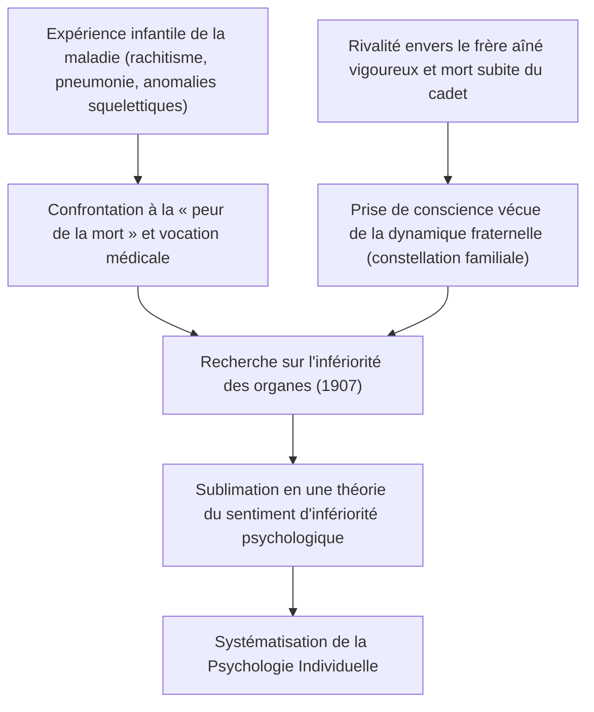
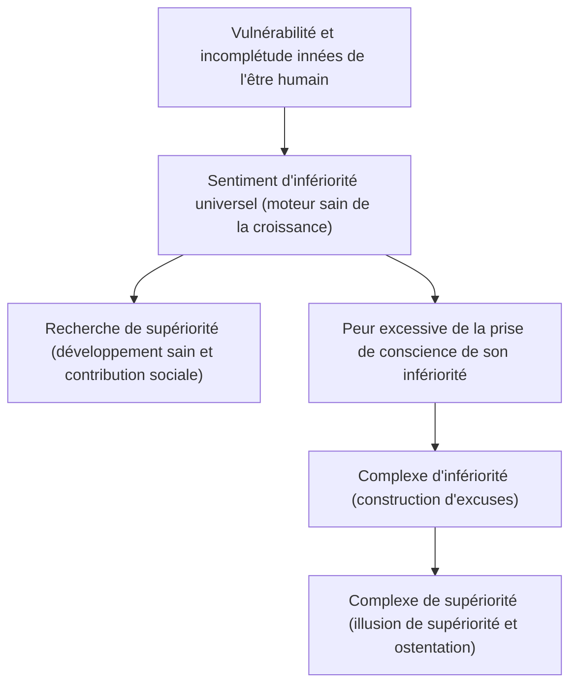
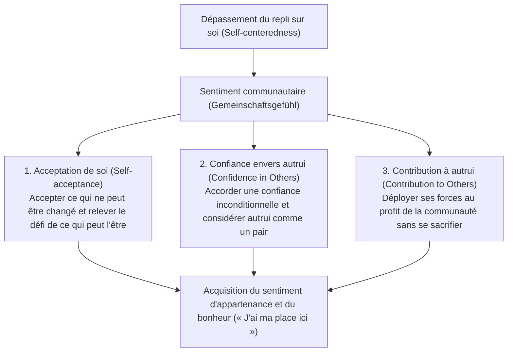
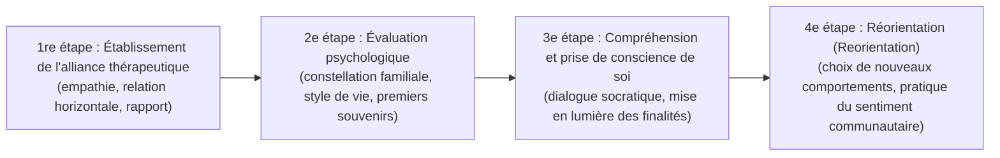

## Introduction : Pourquoi Alfred Adler aujourd'hui ?

Au cœur des courants de la psychologie des profondeurs qui ont émergé à Vienne au début du XXe siècle, la « Psychologie Individuelle » (*Individual Psychology* / en allemand : *Individualpsychologie*), fondée par Alfred Adler (1870–1937), continue de déployer une puissance pratique et une modernité visionnaire sans équivalent dans la pensée contemporaine.

Alors que Sigmund Freud érigeait le « déterminisme psychique » (*Psychic Determinism*), fondé sur les pulsions instinctives inconscientes (la libido) et les traumatismes passés, et que Carl Gustav Jung s'enfonçait dans les abîmes mythologiques des archétypes et de l'inconscient collectif, l'horizon ouvert par Adler se distinguait par une clarté remarquable, résolument orientée vers « la société concrète et l'avenir dans lesquels évolue l'être humain ».

Au fondement de l'anthropologie adlérienne réside une conviction inébranlable : « L'être humain n'est point un réceptacle passif manipulé mécaniquement par les événements du passé, mais un être unifié, agissant de manière souveraine et créatrice en vue de fins qu'il s'est lui-même assignées ». Le terme *Individual* dans l'appellation qu'il donna à son école, *Individual Psychology*, tire son étymologie du latin *individuus* (ce qui ne peut être divisé, l'indivisible). Il s'agissait donc d'un rejet catégorique du réductionnisme élémentaire qui découpe la psyché en composantes antagonistes telles que « conscient et inconscient », « raison et émotion », ou « Ça, Moi et Surmoi », pour appréhender au contraire l'être humain comme un système vivant global et unifié (principe de globalité, holisme).

```
[Comparaison paradigmatique des trois grands courants de la psychologie des profondeurs]

┌─────────────────┬───────────────────────────────┬───────────────────────────────┬───────────────────────────────┐
│ École /         │ Sigmund Freud                 │ Carl Gustav Jung              │ Alfred Adler                  │
│ Fondateur       │                               │                               │                               │
├─────────────────┼───────────────────────────────┼───────────────────────────────┼───────────────────────────────┤
│ Nom de l'école  │ Psychanalyse (Psychoanalysis) │ Psychologie analytique        │ Psychologie Individuelle      │
│                 │                               │ (Analytical Psychology)       │ (Individual Psychology)       │
│ Vision de       │ Mécaniste et déterministe     │ Téléologique et archétypale   │ Sujet autonome et holistique  │
│ l'homme         │ (traumatisme)                 │ (mythe, dimension spirituelle)│ (téléologie)                  │
│ Structure de    │ Conscient / Préconscient /    │ Inconscient personnel /       │ Totalité indivisible          │
│ l'esprit        │ Inconscient (fragmenté)       │ Inconscient collectif         │ (holisme)                     │
│ Motivation      │ Libido (pulsions sexuelles    │ Totalité psychique (réalisa-  │ Recherche de supériorité /    │
│ fondamentale    │ et destructrices)             │ tion de soi, archétypes)      │ Sentiment communautaire       │
│ Approche        │ Remémoration des refoulements │ Analyse des rêves, intégra-   │ Réorientation du style de     │
│ thérapeutique   │ passés, abréaction            │ tion des archétypes, indivi-  │ vie, encouragement            │
│                 │                               │ duation                       │                               │
└─────────────────┴───────────────────────────────┴───────────────────────────────┴───────────────────────────────┘
```

La psychologie adlérienne ne se réduit pas à une simple école de psychologie clinique. Elle constitue une philosophie existentielle éminemment pratique et une pensée socio-éducative démocratique, répondant à la question fondamentale : « Comment l'être humain doit-il surmonter son sentiment d'infériorité, coopérer avec autrui, conquérir un sentiment d'appartenance et parvenir au bonheur ? » Cet article se propose d'élucider avec une rigueur académique exemplaire l'architecture complète de ce système théorique : depuis le conflit intellectuel fondateur avec Freud jusqu'à la téléologie, la dialectique du sentiment d'infériorité et de la recherche de supériorité, la formation du style de vie, les trois tâches de la vie, le sentiment communautaire, la séparation des tâches, et ses résonances contemporaines avec la thérapie cognitivo-comportementale (TCC) et la psychologie positive.

---

## 1. La vie d'Adler et l'histoire de la formation de la psychologie individuelle

### 1.1 L'expérience infantile de la maladie et le paysage matriciel de l'« infériorité organique »
Alfred Adler est né le 7 février 1870 à Penzing, près de Vienne, capitale de l'Empire austro-hongrois, en tant que second fils d'une famille de commerçants en grains d'origine juive.

Pour appréhender la psychologie d'Adler, la compréhension de ses propres épreuves corporelles précoces s'avère indispensable. Dans sa prime enfance, Adler souffrit d'un rachitisme sévère qui retarda son développement squelettique, l'empêchant de marcher correctement avant l'âge de quatre ans. De surcroît, à l'âge de cinq ans, il contracta une pneumonie aiguë potentiellement mortelle, et surprit depuis son lit la sentence du médecin déclarant à son père : « Il n'y a plus aucun espoir de sauver cet enfant ». Au moment où il survécut miraculeusement à cette situation extrême, Adler grava au plus profond de son être un dessein inébranlable (une fiction directrice) : « Je surmonterai la maladie et deviendrai médecin pour vaincre la peur de la mort ».

Par ailleurs, une rivalité ardente doublée d'un vif sentiment d'infériorité à l'égard de son frère aîné Sigmund — doté d'une santé florissante et d'aptitudes physiques remarquables —, ainsi que le choc brutal de la mort subite de son jeune frère dans le lit familial peu après sa naissance, forgèrent son horizon d'expérience. La mort, la maladie, la vulnérabilité somatique et la comparaison fraternelle constituèrent les fondations expérientielles indéracinables de ce qui deviendrait plus tard sa théorie de l'« infériorité organique » (*Organ Inferiority*), du « sentiment d'infériorité » (*Inferiority Feeling*) et de la « constellation familiale » (*Family Constellation*).



### 1.2 La Société psychologique du mercredi de Vienne et la rupture avec Freud (1902–1911)
Diplômé de la faculté de médecine de l'Université de Vienne, Adler commença sa pratique médicale en tant qu'ophtalmologiste, avant de s'orienter vers la médecine générale puis la psychiatrie. En examinant de nombreux artistes de cirque du parc d'attractions du Prater, ainsi que des artisans et des patients issus de la classe ouvrière, il s'intéressa vivement au phénomène par lequel les individus porteurs de faiblesses congénitales ou acquises d'un organe particulier (infériorité organique) développent de manière extraordinaire d'autres organes ou fonctions psychiques pour y suppléer (surcompensation / *Overcompensation*).

En 1902, après avoir pris la défense de l'ouvrage fondateur de Freud, *L'Interprétation du rêve*, dans une critique parue dans la presse, Adler fut invité par ce dernier à rejoindre le cercle restreint de recherche réuni chaque mercredi soir au domicile de Freud (la « Société psychologique du mercredi », qui devint plus tard la Société psychanalytique de Vienne), dont il devint un membre fondateur. En 1910, Adler fut élu président de la Société psychanalytique de Vienne et était alors universellement considéré comme l'un des successeurs les plus éminents de Freud.

Toutefois, cette alliance intellectuelle fut de courte durée. Tandis que Freud s'obstinait dans un pansexualisme (*Pansexualism*) réduisant l'étiologie de toutes les névroses à la « sexualité infantile (refoulement et fixation de la libido) », Adler soutenait pour sa part que le ressort fondamental de la conduite humaine n'est pas la sexualité, mais la « volonté de supériorité visant à surmonter sa propre faiblesse et son impuissance », l'« agressivité » et la « soif d'affirmation de soi ».

En 1911, la rupture devint irréversible. Lors des séances régulières de la Société psychanalytique de Vienne, Adler prononça une série de conférences critiquant la doctrine sexuelle de Freud et exposant sa propre théorie de la « protestation masculine » (*Masculine Protest*). Freud condamna avec véhémence les thèses adlériennes, y voyant une hérésie niant le cœur même de la psychanalyse, et refusa tout compromis. Adler démissionna de la présidence de la société et de la rédaction en chef de sa revue, puis quitta l'association psychanalytique avec neuf confrères ralliés à sa cause. Dès l'année suivante, en 1912, ce groupe se constitua sous le nom d'« Association pour la libre psychanalyse », avant d'adopter peu après l'appellation définitive de « Société pour la Psychologie Individuelle » (*Society for Individual Psychology*). C'est ainsi que naquit officiellement la « Psychologie Individuelle », émancipée de tout assujettissement à la psychanalyse freudienne.

---

## 2. Téléologie vs causalisme : le changement de paradigme en psychologie

### 2.1 Les limites du causalisme mécaniste (causalité) et le rejet du traumatisme
La rupture la plus radicale constituant l'armature théorique de la psychologie adlérienne réside dans sa critique sans concession du « causalisme » (*Causality*) et dans l'introduction de la « téléologie » (*Teleology*).

La psychiatrie classique, illustrée par Freud, ainsi que la science moderne ont appliqué le principe de causalité newtonien au domaine de la psyché humaine. Ce modèle pose le schéma universel selon lequel « l'événement passé (A) a causé l'état présent (B) ». Par exemple, on affirmera : « Parce qu'il a subi des maltraitances parentales durant son enfance et a grandi sans affection (A), il souffre aujourd'hui de phobie sociale et s'avère incapable de s'insérer dans la société (B) ».

Face à cela, Adler a formulé une critique incisive de ce causalisme mécaniste. Pour Adler, les événements passés ne déterminent jamais l'être humain par eux-mêmes. Si les traumatismes passés devaient inéluctablement sceller le destin de l'individu, chaque personne ayant grandi dans des conditions hostiles développerait immanquablement la même névrose, ce qui anéantirait tout libre arbitre et toute possibilité de guérison. Adler affirme sans détour :

> « Aucune expérience n'est en elle-même une cause de succès ou d'échec. Nous ne souffrons pas du choc de nos expériences — le soi-disant traumatisme —, mais nous extrayons de nos expériences ce qui sert nos desseins et nous leur conférons nous-mêmes une signification. »
> (*What Life Could Mean to You*, 1931)

```
[Contraste épistémologique entre causalisme et téléologie]

■ Causalisme (causalité déterministe freudienne)
Fait passé (maltraitance parentale, déception amoureuse, échec)
  -- "Enchaînement causal inéluctable (détermination externe)" -->
Résultat présent (phobie sociale, réclusion / retrait, apathie)
*  L'homme n'est qu'une marionnette du passé ; le passé étant immuable, il sombre dans un fatalisme désespéré.

■ Téléologie (théorie de l'action et du sujet autonome adlérienne)
Dessein secret actuel (vouloir éviter les conflits avec autrui, ne pas être blessé)
  -- "Sélection des moyens pour atteindre ce dessein (création interne)" -->
Production des symptômes et émotions actuels (génération délibérée d'angoisse, de colère, de peur)
*  Les faits passés ne sont que des matériaux. L'individu instrumentalise les souvenirs du passé pour servir sa « finalité actuelle ».
```

### 2.2 La structure de la téléologie (Teleology) et l'« usage » des émotions
Dans la téléologie adlérienne, les conduites, les affects, et même les symptômes psychiatriques (anxiété, dépression, attaques de panique, obsessions) sont compris comme des « moyens » déployés pour atteindre un « dessein caché » (*Hidden Goal*) poursuivi inconsciemment par l'individu.

Considérons, par exemple, le cas d'un patient souffrant de phobie sociale : « Dès que je me trouve devant un public, mes membres se mettent à trembler, je rougis et je deviens incapable d'articuler un mot ».
- **Explication causaliste** : « En raison du traumatisme causé par une humiliation passée en public, un conditionnement inconscient de la peur s'est enclenché ».
- **Explication téléologique** : « Le patient poursuit le dessein secret de "ne pas s'exposer au risque d'être humilié en public" et "d'éviter à tout prix que son incompétence supposée ne soit dévoilée en cas d'échec". Pour réaliser ce dessein, il produit lui-même les symptômes corporels du "rougissement" et du "tremblement", s'octroyant ainsi un alibi légitime : "Étant malade, il m'est impossible d'affronter le public" ».

Ce qu'il importe de saisir ici, c'est que les émotions (colère, anxiété, tristesse) ne sont point des états subis de l'extérieur qui nous « envahissent », mais bien des « instruments fabriqués et utilisés » par l'être humain pour accomplir ses propres desseins.

Adler illustre cette réalité par la célèbre théorie de la colère comme instrument. Imaginons une mère réprimandant violemment son enfant avec un visage déformé par la fureur. Tout à coup, le téléphone sonne : c'est l'enseignant de son enfant. Dès qu'elle décroche le combiné, la mère adopte instantanément une voix affable, polie et sereine pour s'entretenir avec le professeur, avant de raccrocher et de reprendre immédiatement ses hurlements courroucés contre l'enfant. Si la colère était une pulsion physiologique irrépressible submergeant l'individu, une telle transition instantanée vers un dialogue courtois et maîtrisé serait rigoureusement impossible. La mère a tout simplement suscité et instrumentalisé l'émotion de colère afin d'atteindre son dessein immédiat : « soumettre instantanément l'enfant et lui imposer son obéissance ».

Dans la psychologie adlérienne, l'être humain n'est nullement l'esclave de ses émotions. Il est le souverain qui choisit et orchestre ses émotions pour servir ses propres desseins.

---

## 3. Sentiment d'infériorité, complexe d'infériorité et recherche de supériorité

### 3.1 De l'infériorité organique au sentiment universel d'infériorité
Dans son étude de jeunesse, *Étude sur l'infériorité des organes* (*Studie über Minderwertigkeit von Organen*, 1907), Adler analysa l'incomplétude fonctionnelle de certains organes physiques et les processus de compensation mis en œuvre par l'organisme biologique. Un individu souffrant d'une vulnérabilité innée du cœur, des reins ou des organes sensoriels s'efforce de surmonter ce déficit grâce aux efforts compensatoires orchestrés par le système nerveux central.

Adler élargit de manière spectaculaire cette intuition anatomo-pathologique au domaine de la vie psychique. L'être humain, en tant qu'espèce animale, vient au monde dans un état d'impuissance et de vulnérabilité extrêmes comparé aux autres espèces. Privé de crocs acérés, de griffes redoutables et d'épaisse toison, il ne saurait survivre ne fût-ce qu'une seule journée sans la protection de ses parents. Dès lors, tout être humain fait l'expérience inéluctable, durant sa prime enfance, d'être entouré d'adultes détenteurs d'une puissance colossale, ce qui lui impose la conscience aiguë de sa petitesse, de son impuissance et de son incomplétude.

Adler nomma « sentiment d'infériorité » (*Minderwertigkeitsgefühl* / *Inferiority Feeling*) la tension psychique incitant l'individu à s'arracher à cet état d'impuissance. Ce qui est tout à fait fondamental, c'est que pour Adler, **le sentiment d'infériorité n'a rien de pathologique en soi : il constitue au contraire le moteur universel et sain de l'évolution et de la croissance humaine** (*Engine of Growth*).



### 3.2 Distinction conceptuelle rigoureuse : sentiment d'infériorité vs complexe d'infériorité
Dans le langage courant, le mot « complexe » est souvent employé comme un simple synonyme de sentiment d'infériorité. Or, dans la psychologie adlérienne, le « sentiment d'infériorité » et le « complexe d'infériorité » (*Inferiority Complex*) font l'objet d'une distinction conceptuelle rigoureuse.

1. **Le sentiment d'infériorité (Inferiority Feeling)** :
   Une perception subjective d'incomplétude résultant de la prise de conscience de l'écart existant entre son état présent et un état idéal. C'est le ressort d'une saine motivation qui incite l'individu à surmonter ses défis par l'effort et le perfectionnement : « Manquant encore de savoir, je vais étudier davantage », « Mes compétences étant encore imparfaites, je vais m'entraîner avec constance ».

2. **Le complexe d'infériorité (Inferiority Complex)** :
   Un état pathologique consistant à instrumentaliser le sentiment d'infériorité comme un prétexte (une excuse) pour fuir les tâches de la vie. Il se caractérise par l'édification d'une causalité apparente (« Parce que A, je ne peux pas faire B »). Par exemple : « Faute de diplômes prestigieux, je ne peux pas réussir », « N'étant pas beau, je ne peux pas me marier », « Mes parents m'ayant mal élevé, je ne peux pas m'insérer dans la société ».
   L'individu enfermé dans un complexe d'infériorité renonce à résoudre ses difficultés par ses propres efforts et brandit son infériorité comme un bouclier protecteur pour préserver son amour-propre d'un douloureux constat d'échec.

### 3.3 Le complexe de supériorité et la pathologie de la volonté de puissance
Lorsqu'un individu en proie au complexe d'infériorité ne peut plus tolérer l'angoisse de regarder son sentiment de défaillance en face, surgit fréquemment son revers compensatoire : le « complexe de supériorité » (*Superiority Complex*).

Le complexe de supériorité est un mécanisme de défense consistant à se réfugier dans une « supériorité factice donnant l'illusion d'être exceptionnel », au lieu d'affronter le réel par l'effort véritable. Il s'incarne notamment sous les formes suivantes :

- **L'ostentation de l'autorité (briller par procuration)** : Se vanter de ses relations personnelles avec des célébrités ou des personnages influents, ou s'armer de titres honorifiques et de marques de grand luxe pour impressionner la galerie.
- **L'étalage de ses exploits passés** : Raconter inlassablement ses gloires et hauts faits d'antan afin de masquer son impuissance et son inaction présentes.
- **La surenchère dans le malheur et la domination par la faiblesse** : Se complaire dans le récit interminable de ses souffrances, de ses blessures et de l'injustice de son sort pour s'attirer la commisération d'autrui, manipuler l'entourage par le sentiment de culpabilité et exiger un traitement de faveur. Adler qualifiait cette attitude de « privilège de la faiblesse » et la tenait pour l'une des formes les plus coriaces et difficiles à traiter du complexe de supériorité.

### 3.4 L'orientation saine de la recherche de supériorité (Striving for Superiority)
La force motrice primordiale par laquelle l'être humain cherche à surmonter son infériorité fut successivement qualifiée par Adler d'« impulsion agressive », de « volonté de puissance » puis de « protestation masculine », avant d'être sublimée dans sa maturité en un concept plus vaste et lumineux : la « recherche de supériorité » (*Striving for Superiority* / l'élan vers le dépassement de soi).

Une saine recherche de supériorité ne consiste en aucun cas à « vaincre autrui dans la compétition féroce, le subjuguer ou le dominer ». Elle consiste bien plutôt à **« ne point se comparer à autrui, mais se mesurer à son propre idéal pour dépasser pas à pas ses propres limites »** : un processus continu d'élévation de soi sur un plan horizontal, dans l'égalité fraternelle avec ses semblables. Dès lors que la recherche de supériorité s'oriente vers une « hiérarchie verticale (rapports de domination et de soumission) », elle devient le terreau des névroses ; lorsqu'elle s'ancre dans la « coopération horizontale (contribution à la communauté) », elle s'épanouit en une réalisation de soi féconde et pleinement saine.


---

## 4. Holisme et style de vie : l'architecture cognitive de l'individu

### 4.1 Le holisme (Holism) : l'être humain comme totalité indivisible
Le premier axiome de la psychologie adlérienne est le « holisme » (*Holism*). Depuis René Descartes, père du rationalisme moderne, la pensée occidentale a été dominée par le « dualisme cartésien » qui scinde l'esprit et le corps. En psychiatrie, Freud a pareillement découpé la psyché en composantes conflictuelles — « conscient / inconscient », « Moi / Ça / Surmoi » —, modélisant ainsi le conflit intrapsychique de l'individu.

Adler a récusé avec la plus grande énergie ce réductionnisme élémentaire. Chez Adler, l'être humain est une unité indivisible (*Individual* = *in-* + *dividual*, ce qui ne peut être scindé).
- « Raison » et « émotion » ne sont nullement antagonistes. L'émotion est suscitée pour servir le dessein poursuivi par la raison et opère en parfaite synergie avec elle.
- « Conscient » et « inconscient » ne se livrent pas une guerre intestine. Ils constituent les deux faces d'une même médaille, agissant de concert vers une unique finalité. L'inconscient désigne simplement le « domaine des desseins que le sujet n'a pas encore verbalisés ni conscientisés ».
- « Psyché » et « corps » ne sont pas deux substances séparées. Lorsque le rythme cardiaque s'emballe et que l'estomac se noue sous l'effet d'une vive angoisse, c'est la manifestation que l'esprit et le corps affrontent la crise comme une seule et même totalité organique.

La psychologie adlérienne refuse sans appel les alibis dualistes du type : « Ma raison le comprenait bien, mais mes émotions ont été plus fortes » ou « Mes désirs inconscients ont agi contre ma volonté ». Elle impute l'entière responsabilité à la personne totale (*Whole Person*) agissant comme sujet souverain : « C'est moi qui, pour atteindre cette fin précise, ai recouru à l'émotion de colère pour vociférer ».

```
[Différence structurelle entre réductionnisme élémentaire (Freud) et holisme (Adler)]

■ Réductionnisme élémentaire (modèle de scission psychique)
┌──────────────────────────────────────┐
│ Surmoi (morale, impératifs sociaux)  │
├──────────────────────────────────────┤  <- Conflit intrapsychique et clivage
│ Moi (raison d'adaptation au réel)    │
├──────────────────────────────────────┤  <- Refoulement et résistance
│ Ça (pulsions instinctives inconsc.)  │
└──────────────────────────────────────┘
*  Engendre la mauvaise foi : « Mes pulsions ont vaincu ma raison », « L'inconscient m'a manipulé ».

■ Holisme (modèle d'intégration indivisible)
┌────────────────────────────────────────────────────────────────────────┐
│                      L'être humain total (le soi indivisible)          │
│                                                                        │
│  Unité téléologique :                                                  │
│  Raison, émotions, conscient, inconscient et corps agissent de concert │
│  pour accomplir un « unique dessein directeur (style de vie) ».        │
└────────────────────────────────────────────────────────────────────────┘
*  La responsabilité ultime de chaque acte et de chaque émotion incombe au « Moi » unifié.
```

### 4.2 Définition du style de vie (Lifestyle) et ses trois composantes
Dans la psychologie adlérienne, le concept central désignant la synthèse intégrée du caractère, de la personnalité, de la vision du monde et des schèmes cognitifs est le « style de vie » (*Lifestyle* / en allemand : *Lebensstil*). Il constitue le précurseur direct du concept de « schéma » (*Schema*) ou de grille cognitive dans les thérapies cognitives modernes.

Le style de vie est une matrice constante de significations attribuées à soi et au monde, choisie et bâtie par l'enfant dans sa prime enfance (autour de l'âge de 4 à 6 ans) afin de naviguer au sein de ses contraintes somatiques, de son milieu familial et de son contexte culturel. Une fois forgé, le style de vie opère comme une boussole implicite, filtrant à l'insu de l'adulte l'ensemble de ses perceptions, pensées, émotions et conduites.

Au sein de la psychologie adlérienne, le style de vie s'articule autour de trois composantes fondamentales :

1. **Le concept de soi (Self-concept)** :
   La conviction ou croyance fondamentale sur « qui je suis » : « Je suis faible », « Je suis intelligent », « Je suis quelqu'un qui ne mérite pas d'être aimé ».
2. **L'idéal du soi (Self-ideal)** :
   L'exigence subjective sur « ce que je devrais être » : « Je dois toujours être le premier », « Je dois être traité avec égards par tout le monde », « Je ne dois en aucun cas échouer ».
3. **L'image du monde (Weltbild / Picture of the World)** :
   La conviction entretenue à l'égard de l'environnement, des autres et de la vie : « Le monde est un lieu hostile », « Les autres sont des rivaux prêts à m'exploiter », « La vie est imprévisible et absurde ».

Si un individu possède un style de vie fondé sur un concept de soi disant « Je suis sans défense », un idéal du soi exigeant « Je ne dois jamais souffrir », et une image du monde proclamant « Mon entourage est agressif et impitoyable », il adoptera une posture d'extrême méfiance dans toutes ses interactions, interprétera les propos anodins d'autrui comme des marques d'hostilité, et se réfugiera dans l'évitement ou le repli sur soi. Une telle conduite ne constitue pas un dysfonctionnement absurde, mais au contraire un choix parfaitement logique et cohérent au regard de son propre style de vie.

### 4.3 Signification diagnostique des premiers souvenirs (Early Recollections)
Pour mettre en lumière de façon objective le style de vie inconscient d'un sujet, Adler a conçu un outil clinique d'une exceptionnelle puissance : l'analyse des « premiers souvenirs » (*Early Recollections*).

Cette technique consiste à demander au patient de remémorer ses souvenirs les plus lointains (généralement un épisode concret et précis antérieur à l'âge de 6 à 8 ans), en décrivant minutieusement le décor, les protagonistes présents, ses propres actions et les émotions ressenties à cet instant précis.

Freud considérait les souvenirs d'enfance comme les « traces objectives du passé » ou les « fossiles de traumatismes refoulés ». À l'opposé, Adler, fidèle à sa posture téléologique, percevait les souvenirs comme une « fiction rétrospective (un récit) sélectionnée et reconstruite parmi une infinité d'événements passés pour légitimer et étayer le style de vie actuel ». L'être humain n'enregistre pas fidèlement son passé : il ne conserve et ne colore que les souvenirs qui servent sa finalité présente.

```
[Paradigme d'analyse des premiers souvenirs]

- Récit du souvenir : « À l'âge de 5 ans, je suis tombé d'un arbre dans le jardin et me suis blessé à la jambe. Ma mère a accouru pour me serrer dans ses bras. »
  ↓
- Angles d'analyse :
  1. Posture active ou passive ? (A-t-il pris une initiative ou a-t-il attendu qu'un événement survienne ?)
  2. Rôle dévolu à autrui ? (Ennemis indifférents au danger ou protecteurs bienveillants ?)
  3. Conscience de soi ? (Un être fragile et vulnérable)
  ↓
- Croyances directrices extraites du style de vie :
  « Le monde est plein de dangers. Je suis un être vulnérable voué à la souffrance si je baisse ma garde.
   Toutefois, si je manifeste ma faiblesse et appelle à l'aide, autrui me protégera avec tendresse. »
  ↓
- Cohérence avec les conduites actuelles :
  Face à une difficulté, la personne ne cherche pas à la résoudre par elle-même, mais exhibe sa fragilité ou sa maladie pour susciter l'assistance d'autrui.
```

Adler déclarait avec audace que « la véracité historique du premier souvenir (qu'il s'agisse d'un fait avéré, d'une illusion ou d'une déformation) importe peu ». La question décisive est de savoir : **« Pourquoi, parmi des milliers d'expériences enfantines possibles, l'individu conserve-t-il précisément cette scène particulière dans sa mémoire active ? »** Le premier souvenir condense l'épure, le « plan architectural » selon lequel l'individu perçoit aujourd'hui le monde et conçoit sa stratégie pour y survivre.

---

## 5. Les trois tâches de la vie et le sentiment communautaire

### 5.1 Les trois tâches de la vie (Life Tasks)
Adler a formalisé les exigences inéluctables de la condition relationnelle humaine sous le concept de « tâches de la vie » (*Life Tasks* / en allemand : *Lebensaufgaben*). Il les a réparties en trois paliers fondamentaux : « la tâche du travail », « la tâche de l'amitié » et « la tâche de l'amour ».

```
[Hiérarchie et degrés de difficulté des trois tâches de la vie]

[Tâche de l'amour (Love Task)]
- Objet : Relations intimes et profondes avec le partenaire, le conjoint, la famille
- Exigences : Proximité psychologique maximale, dévoilement de soi, communauté de destin, égalité absolue
- Prétextes d'évitement : Peur de l'engagement, infidélité, harcèlement moral, perfectionnisme défensif

[Tâche de l'amitié (Friendship Task)]
- Objet : Amis, voisins, communauté sociale, camaraderie désintéressée entre pairs
- Exigences : Confiance horizontale exempte de compétition, altruisme, reconnaissance mutuelle
- Prétextes d'évitement : « Peur d'être trahi », « Personne ne peut me comprendre »

[Tâche du travail (Work Task)]
- Objet : Activité professionnelle, production économique, réseau de la division sociale du travail
- Exigences : Respect des règles, coopération fondamentale, engagement envers les résultats
- Prétextes d'évitement : Peur de l'échec, angoisse du jugement d'autrui, procrastination, phobie sociale
```

1. **La tâche du travail (Work Task)** :
   La participation active au réseau de la division sociale du travail pour assurer la subsistance biologique de l'humanité et créer une valeur utile à autrui. Parce que ses intérêts réciproques sont clairement formalisés et que les conduites y sont encadrées par des contrats et des règlements, elle présente le degré de complexité relationnelle le plus bas des trois. Toutefois, sa fuite précipite l'individu dans la ruine matérielle et l'inadaptation sociale.

2. **La tâche de l'amitié (Friendship Task)** :
   L'édification de relations de camaraderie et d'amitié authentiques, affranchies de toute considération d'intérêt économique direct. Cette tâche exige une confiance réciproque entre êtres égaux, exempte de toute rivalité, permettant le dévoilement serein de ses vulnérabilités. C'est ici que nombre d'individus restreignent leur cercle relationnel, paralysés par la méfiance et la hantise d'être trahis.

3. **La tâche de l'amour (Love Task)** :
   Le tissage des liens les plus intimes et continus de l'existence : relations amoureuses, conjugales et filiales. La distance psychologique y devenant quasi nulle, les aspects les plus inavouables de notre vulnérabilité et de nos faiblesses s'y trouvent mis à nu. Elle requiert de renoncer à dominer l'autre ou à quémander son approbation, pour œuvrer à la « félicité commune » en tant que partenaires rigoureusement égaux ; c'est pourquoi elle constitue la tâche la plus ardue de l'existence humaine.

Selon Adler, toutes les formes de désordres psychologiques (névroses, réclusion, délinquance, états dépressifs) trouvent leur source dans le refus d'affronter ces tâches fondamentales : par crainte de l'échec et de la blessure narcissique, l'individu préfère s'enfuir par le biais de ce qu'Adler nomme le « mensonge de la vie » (*Life Lie*).

### 5.2 Vue d'ensemble du sentiment communautaire (Gemeinschaftsgefühl / Social Interest)
Le sommet philosophique et le concept le plus profond de la psychologie adlérienne est le « sentiment communautaire » (*Gemeinschaftsgefühl* / en anglais : *Social Interest*). Bien que traduisible littéralement par « sentiment de communauté » ou « conscience communautaire », le monde anglo-saxon a consacré l'expression *Social Interest* (« intérêt social »).

Le sentiment communautaire se définit comme **« la conversion du repli égocentrique sur soi (Self-centeredness) en un intérêt sincère pour autrui (Social Interest) »** : percevoir ses semblables non comme des « ennemis », mais comme des « compagnons de route », et éprouver la certitude réconfortante d'avoir sa place légitime au sein de la communauté.

Adler a affirmé avec force que le degré de sentiment communautaire constitue le seul et unique étalon de la santé mentale. L'individu dépourvu de sentiment communautaire conçoit le monde comme une arène darwinienne impitoyable et ne perçoit autrui que comme une menace potentielle ou un instrument à exploiter. Rongé par la solitude et l'angoisse, il s'abîme dans des névroses compensatoires à la poursuite d'une supériorité illusoire.



### 5.3 Les trois piliers composant le sentiment communautaire
Afin de rendre opératoire le sentiment communautaire au niveau clinique et pratique, la psychologie adlérienne contemporaine le décline en trois piliers interactifs :

1. **L'acceptation de soi (Self-acceptance)** :
   À distinguer radicalement de la simple « affirmation de soi » (la pensée positive artificielle). Tandis que l'affirmation naïve relève souvent de l'auto-illusion (« se répéter "je peux le faire" alors qu'on en est incapable »), l'acceptation de soi consiste à accueillir avec lucidité ses limites et ses imperfections telles qu'elles sont, tout en trouvant le courage d'agir de toutes ses forces sur ce qui peut être transformé. Elle fait un écho direct à la célèbre prière de Reinhold Niebuhr : « Mon Dieu, donnez-moi la sérénité d'accepter les choses que je ne puis changer, le courage de changer les choses que je peux, et la sagesse d'en connaître la différence ».

2. **La confiance envers autrui (Confidence in Others)** :
   À distinguer de la simple « foi contractuelle ou solvabilité » (*Credit*). Faire crédit suppose des garanties matérielles, des preuves passées ou des conditions préalables (à l'instar d'un prêt bancaire). La confiance adlérienne, au contraire, s'accorde inconditionnellement, sans exiger de gages. Bien entendu, le risque d'être trompé subsiste. Cependant, savoir que la trahison relève de « la tâche d'autrui » et que décider d'accorder sa confiance relève de « sa propre tâche » permet de s'affranchir définitivement de la prison paranoïaque du soupçon.

3. **La contribution à autrui (Contribution to Others)** :
   À distinguer du « sacrifice de soi » (*Self-sacrifice*). S'épuiser ou ruiner son existence pour servir autrui ne constitue qu'un dévouement névrotique dicté par une soif effrénée de reconnaissance. Une saine contribution à autrui consiste à « mettre généreusement ses aptitudes au service de ses pairs au sein de la communauté afin d'éprouver le sentiment intime de sa propre valeur ». Adler a proclamé avec éclat : « Le bonheur est le sentiment de contribution ». C'est l'expérience vécue de servir la communauté qui confère à l'individu la conviction d'avoir du prix et constitue la source inépuisable du courage de vivre.

---

## 6. La séparation des tâches et la psychologie du courage

### 6.1 Structure logique de la séparation des tâches (Separation of Tasks)
L'instrument analytique le plus affûté proposé par la psychologie adlérienne pour trancher à la racine les tourments relationnels est la « séparation des tâches » (*Separation of Tasks*).

Tous les conflits, frictions et souffrances interpersonnels naissent de l'intrusion intempestive dans la tâche d'autrui ou du fait de laisser autrui empiéter sans vergogne sur notre propre tâche.

Adler a énoncé un critère d'une limpidité souveraine pour délimiter rigoureusement les tâches :
**« Qui assumera en dernier ressort les conséquences ultimes du choix posé ? »**

```
[Exemple concret de séparation des tâches : le problème des devoirs de l'enfant]

- Pensée parentale classique (confusion des tâches) :
  « Si mon enfant n'étudie pas, son avenir sera compromis ; je dois donc le contraindre par tous les moyens à travailler. »
  -> Le parent s'immisce autoritairement dans la tâche de l'enfant (domination et contrôle).
  -> L'enfant se cabre et instrumentalise le refus d'étudier comme « une arme pour tourmenter ses parents ».

- Clarification fondée sur la séparation des tâches :
  1. « Qui assumera l'impact ultime du fait d'étudier ou non — à savoir la baisse des notes ou l'impossibilité d'intégrer l'école souhaitée ? »
     -> Celui qui en récolte les conséquences finales est [l'enfant lui-même] (c'est donc la tâche de l'enfant).
  2. Que peuvent faire les parents ?
     -> Non point ordonner « Étudie ! », mais aménager un cadre bienveillant où une aide sera apportée dès que l'enfant manifestera le désir d'apprendre,
        tout en lui signifiant : « J'ai confiance en tes capacités et je veille sur toi avec bienveillance » (disponibilité du soutien et présence vigilante).
```

La séparation des tâches ne signifie nullement l'indifférence glaciale ou l'abandon négligent (*neglect*). L'abandon consiste à ignorer ce que fait l'enfant et à s'en désintéresser. La posture adlérienne s'incarne parfaitement dans l'adage : « On peut mener le cheval à l'abreuvoir, mais on ne peut pas le forcer à boire ». Décider de boire ou non appartient au cheval seul (l'individu) ; forcer sa gorge pour y déverser l'eau par contrainte relève de la pure violence et de la domination.

### 6.2 Le refus du désir de reconnaissance et la définition de la « liberté »
Poussée jusqu'à ses ultimes conséquences, la séparation des tâches conduit la psychologie adlérienne à rejeter catégoriquement le « désir de reconnaissance » (*Desire for Approval*) qui sature notre société moderne.

Pour Adler, l'individu obsédé par le besoin d'être validé, loué et estimé par autrui vit en vérité « la vie d'autrui ». Guetter anxieusement le regard d'autrui revient à vouloir désespérément régir « la manière dont autrui nous juge » — ce qui constitue, par excellence, [la tâche d'autrui] sur laquelle nous n'avons aucun pouvoir légitime.

Dans la psychologie adlérienne, la « liberté » se définit comme **« le courage de ne pas craindre d'être détesté par autrui »**.
Vouloir plaire à tout le monde et chercher l'assentiment général est une imposture insoutenable qui contraint à falsifier en permanence son propre style de vie. Tracer la voie que l'on sait juste, tout en acceptant que le fait d'être aimé ou haï relève exclusivement de la « tâche d'autrui », constitue le seuil de l'émancipation. C'est en s'affranchissant du jugement d'autrui pour agir avec autonomie, au nom de sa conscience et de sa contribution à la communauté, que l'être humain conquiert sa liberté intérieure authentique.


---

## 7. L'encouragement (Encouragement) et la pédagogie démocratique

### 7.1 Critique globale de l'éducation par la carotte et le bâton : les dangers des éloges
L'une des propositions les plus déconcertantes de la pratique clinique et pédagogique adlérienne réside dans la « proscription absolue de l'éducation par la récompense et la punition (les éloges et les réprimandes) ».

Dans l'éducation familiale comme dans le management d'entreprise, la méthode consistant à « faire grandir par les compliments » est communément portée aux nues. Pourtant, Adler a percé à jour la nature profonde de l'éloge : l'acte de féliciter implique intrinsèquement **une relation verticale (rapport hiérarchique) dans laquelle une personne supposée supérieure évalue, toise et manipule une personne jugée inférieure**. Si un adulte félicitait un autre adulte d'égal à égal en lui disant avec condescendance : « C'est très bien, tu as été sage », cela paraîtrait incongru et outrageant, précisément parce que cette formule trahit un rapport de domination hiérarchique.

```
[Contraste paradigmatique entre « féliciter / réprimander » et « encourager »]

┌──────────────────┬───────────────────────────────┬───────────────────────────────┐
│ Critère          │ Pédagogie de la carotte et    │ Encouragement (Encouragement) │
│                  │ du bâton (louer / réprimander)│                               │
├──────────────────┼───────────────────────────────┼───────────────────────────────┤
│ Posture          │ Relation verticale            │ Relation horizontale          │
│ relationnelle    │ (hiérarchie, pouvoir, contrôle│ (égalité, respect, confiance) │
│ Étalon           │ Résultats, compétences,       │ Processus, intention,         │
│ d'évaluation     │ comparaison avec autrui       │ dépassement de soi            │
│ Psychologie      │ Besoin de reconnaissance, peur│ Confiance en soi, autonomie,  │
│ induite          │ de l'échec, dépendance servile│ sentiment d'utilité collective│
│ Nature de la     │ Extrinsèque (convoitise de la │ Intrinsèque (contribution     │
│ motivation       │ récompense, fuite du châtiment│ spontanée à la communauté)    │
│ Formulations     │ « Tu es un bon garçon ! »,    │ « Merci pour ton aide »,      │
│ concrètes        │ « Bravo pour ton 20/20 »      │ « Cela me réjouit beaucoup »  │
└──────────────────┴───────────────────────────────┴───────────────────────────────┘
```

Selon Adler, le préjudice majeur des compliments réside dans le fait d'inculquer aux enfants comme aux subordonnés une addiction pernicieuse à la reconnaissance : « s'abstenir d'agir si l'on n'est pas flatté » et « ne pouvoir ressentir sa propre valeur qu'à travers le regard d'autrui ». Pire encore, l'absence de compliments finit par être vécue comme une punition déguisée, incitant l'individu à fuir toute prise de risque et tout défi par terreur de l'échec.

D'autre part, « réprimander » s'avère encore plus destructeur. La réprimande n'est qu'un aveu d'impuissance communicationnelle : le renoncement au dialogue constructif par le langage au profit de la facilité brutale de l'émotion (la colère) pour contraindre l'autre à capituler. Au lieu d'inciter à un examen de conscience authentique, l'invective suscite chez celui qui la subit des réflexes de dissimulation (« faire en sorte de ne pas se faire attraper la prochaine fois ») et nourrit des désirs souterrains de revanche.

### 7.2 Les techniques d'encouragement (Encouragement) et la relation horizontale
Pour substituer une dynamique féconde au système de la carotte et du bâton, Adler a formulé l'« encouragement » (*Encouragement*).
L'encouragement est **« l'art d'éveiller et de stimuler chez autrui l'énergie intérieure (le courage) nécessaire pour surmonter les difficultés »**, en s'ancrant dans une « relation strictement horizontale ».

Les techniques cardinales de l'encouragement se résument ainsi :

1. **L'expression de la gratitude et de la joie (« Merci », « Cela me rend heureux »)** :
   Au lieu de juger autrui d'en haut, on lui communique son ressenti subjectif quant à l'utilité réelle de son geste pour soi ou pour le groupe : « Ton aide m'a infiniment soulagé », « Ta présence parmi nous est un bonheur ». Dès lors, la personne prend conscience de sa capacité d'agir : « J'ai le pouvoir d'apporter quelque chose aux autres », « J'ai une valeur propre ».
2. **L'attention portée au processus et à l'intention** :
   Plutôt que d'encenser le « résultat brut » (une note à un examen, des chiffres de vente), on valorise l'« effort déployé » et les initiatives prises au fil du chemin : « Tu as fait preuve d'une admirable persévérance jusqu'au bout », « Tu as conçu cette étape avec beaucoup d'ingéniosité ». L'échec devient alors le moment privilégié de l'encouragement : on explore ensemble, en partenaires égaux, les leçons fécondes à en tirer.
3. **La focalisation sur les forces plutôt que sur les faiblesses (recadrage / reframing)** :
   Redéfinir dans un cadre constructif les traits qu'un individu perçoit douloureusement comme des tares : transformer la « versatilité » en « vive curiosité intellectuelle et agilité adaptative », ou l'« entêtement » en « fermeté de conviction et constance de la volonté ».

### 7.3 Le mouvement des centres d'orientation de l'enfance à Vienne et la réforme de l'instruction publique
La pensée adlérienne ne s'est pas confinée aux spéculations abstraites des amphithéâtres : elle s'est déployée dans une formidable pratique sociopolitique. Au lendemain de la Première Guerre mondiale, au sein de la « Vienne rouge » (*Red Vienna*) où le Parti social-démocrate avait pris les rênes de la municipalité, Adler s'associa au conseil scolaire de la ville pour ouvrir plus de trente « centres d'orientation pour enfants » (*Child Guidance Clinics*) au cœur même des établissements scolaires publics.

Ces centres d'orientation d'Adler reposaient sur un dispositif révolutionnaire : médecins, enseignants, parents et l'enfant lui-même s'asseyaient en cercle, sur un pied de parfaite égalité, pour mener des consultations éducatives ouvertes en public. Adler était intimement persuadé que le démantèlement de l'autoritarisme patriarcal dans les familles et à l'école, et l'émergence d'une communauté démocratique et coopérative constituaient l'unique rempart capable de préserver les générations futures de la névrose, de la délinquance et du fléau des guerres. Cette expérience viennoise novatrice fut le berceau direct de la psychologie scolaire et du counseling éducatif contemporains.

---

## 8. Techniques et processus du counseling clinique adlérien

### 8.1 Établissement de la relation thérapeutique : une alliance collaborative horizontale (Collaborative Alliance)
La cure psychanalytique traditionnelle s'enracinait dans un rapport asymétrique et hiérarchique : le patient allongé sur le divan se livrait sans défense, tandis que l'analyste, assis hors de son champ de vision dans un silence olympien, délivrait ses sentences interprétatives.

Le counseling adlérien a renversé cette mise en scène de fond en comble. Le thérapeute et le client s'assoient face à face, sur des fauteuils de même hauteur. Ils agissent en « co-chercheurs égaux » scellant une « alliance collaborative » (*Collaborative Alliance*) pour déchiffrer ensemble le rébus que constitue l'existence du client. Le praticien ne prétend pas être un maître omniscient ; il se veut un facilitateur cheminant aux côtés du client pour que ce dernier surmonte par ses propres forces les tâches de sa vie.



### 8.2 Évaluation psychologique : la constellation familiale (Family Constellation)
Dans la phase d'évaluation, les praticiens adlériens accordent une place cardinale à l'exploration de la « constellation familiale » (*Family Constellation* / structure dynamique du foyer).

Adler découvrit que le style de vie cristallisé par l'enfant est profondément influencé par son rang de naissance au sein de la fratrie (*Birth Order*) et par la signification subjective qu'il attribue à cette position.

- **L'aîné (premier-né)** : Ayant d'abord joui du monopole de l'amour parental, il subit lors de l'arrivée du puîné le traumatisme du « monarque déchu de son trône ». Il conserve la nostalgie du passé et montre un attachement marqué à l'ordre, à l'autorité et aux règles établies. Il développe souvent un sens aigu des responsabilités doublé d'une posture conservatrice.
- **Le cadet (enfant du milieu)** : Dès sa venue au monde, il trouve devant lui un rival qui a pris de l'avance (l'aîné) ; il vit ainsi avec « le moteur lancé à plein régime dans une course permanente ». Cherchant à conquérir sa supériorité dans des domaines inexplorés par son aîné, il affiche volontiers une personnalité rebelle, novatrice ou éminemment diplomate.
- **Le benjamin (dernier-né)** : Ne risquant jamais d'être détrôné, il est soit choyé par l'ensemble de la famille, soit animé par l'ambition démesurée de surpasser tous ses aînés. Il est particulièrement enclin à développer un style de vie dépendant : « Je dois être aimé et servi sans avoir à faire d'efforts ».
- **L'enfant unique** : Évoluant sans rivaux directs dans la fratrie, il grandit constamment immergé dans le monde des adultes. Bien qu'il puisse développer un certain égocentrisme, il manifeste fréquemment une maturité précoce et d'admirables capacités intellectuelles.

Il importe de souligner que le rang de naissance ne détermine jamais l'individu de manière fataliste : l'élément décisif est **« la stratégie de survie (le style de vie) que l'enfant a lui-même inventée pour conquérir une place reconnue et l'attention parentale au sein de cette configuration »**.

### 8.3 Le dialogue socratique (Socratic Dialogue) et la prise de conscience
L'intervention adlérienne ne procède jamais par sermons moralisateurs ou injonctions autoritaires, mais privilégie le « dialogue socratique » (*Socratic Dialogue*), hérité de la maïeutique du philosophe grec Socrate.

Le praticien s'interdit de poser des questions accusatrices tournées vers le passé telles que : « Pourquoi avez-vous fait cela ? » (interrogation causaliste). Il privilégie des questionnements téléologiques : « Que cherchez-vous à obtenir à travers cette conduite ? », « Si ce symptôme disparaissait totalement du jour au lendemain, comment votre existence en serait-elle bouleversée ? ».

Grâce à ce cheminement, le client prend conscience par lui-même des « mensonges de la vie » et des « fins inavouées » qu'il entretenait implicitement. L'insight dans la tradition adlérienne dépasse la simple intellection théorique : il consiste en l'accession vertigineuse à la conscience de sa propre souveraineté existentielle : « Je suis moi-même, et nul autre, l'auteur de ma propre existence » (*Author of One's Life*).

### 8.4 La réorientation (Reorientation) : expérimentation de nouveaux comportements
Dans la phase conclusive de « réorientation » (*Reorientation* / réalignement existentiel), le client se déleste de son ancien style de vie inopérant pour choisir et expérimenter dans l'action une nouvelle manière d'être ancrée dans le sentiment communautaire.

Les adlériens répugnent à cantonner la thérapie aux joutes verbales du cabinet de consultation ; ils encouragent de « véritables expérimentations comportementales » dans le quotidien le plus concret :
- Saluer dès demain avec un sourire ce voisin qu'on évitait soigneusement jusque-là.
- Exprimer des mots de gratitude à son partenaire de vie au lieu de céder au réflexe de la critique.
- Renoncer au perfectionnisme paralysant en présentant son travail achevé à 80 % pour solliciter les retours constructifs d'autrui.

Adler professait qu'« il est possible à chaque instant de changer son caractère (son style de vie) ». L'être humain a le pouvoir de réélire sa trajectoire de vie à tout moment. Ce qui fait défaut n'est jamais la compétence, mais simplement le **« courage de changer »** (*Courage to Change*).

---

## 9. Répercussions sur la pensée contemporaine, la thérapie cognitivo-comportementale (TCC) et le bien-être

### 9.1 Adler comme pionnier méconnu de la thérapie cognitivo-comportementale
Devenue la référence incontournable de la psychiatrie et de la psychothérapie contemporaines depuis la seconde moitié du XXe siècle, la « thérapie cognitivo-comportementale » (TCC / *CBT*) plonge ses racines directes chez Adler. Ses pères fondateurs, Albert Ellis (créateur de la thérapie rationnelle-émotive comportementale / REBT) et Aaron T. Beck (fondateur de la thérapie cognitive / CT), ont tous deux ouvertement revendiqué l'influence magistrale d'Adler.

Albert Ellis déclara sans ambages qu'« Alfred Adler est probablement le véritable fondateur de la thérapie cognitive moderne ». Le célèbre modèle ABC formulé par Ellis (*Activating Event* = événement déclencheur, *Belief* = système de croyance/cognition, *Consequence* = conséquences affectives et comportementales) n'est autre que la réinterprétation contemporaine de la théorie adlérienne du style de vie.

```
[Filiation généalogique entre la psychologie adlérienne et la thérapie cognitive]

[Épictète (philosophie stoïcienne)]
«  Ce qui trouble les hommes, ce ne sont pas les choses, mais les jugements qu'ils portent sur les choses.  »
  ↓
[Alfred Adler (Psychologie Individuelle, 1912~)]
- Téléologie : Ce n'est point l'événement, mais « la signification attribuée (le jugement) » qui détermine émotions et actes.
- Style de vie : La « structure cognitive (schéma) » forgée dès l'enfance.
- Responsabilité du sujet souverain et réorientation.
  ↓
[Albert Ellis (Thérapie rationnelle-émotive comportementale, 1955~)]
- Modèle ABC (réfutation des croyances irrationnelles)
[Aaron T. Beck (Thérapie cognitive, années 1960~)]
- Restructuration des pensées automatiques, des croyances fondamentales (Core Beliefs) et des distorsions cognitives
```

Les « distorsions cognitives » théorisées par Beck (pensée dichotomique en tout ou rien, dramatisation / catastrophisme, surgénéralisation, abstraction sélective) correspondent trait pour trait aux failles structurelles de ce qu'Adler désignait dès les années 1910 et 1920 sous le nom de « logique privée » (*Private Logic*). La psychologie adlérienne a constitué le pont matriciel entre la psychodynamique des profondeurs et la thérapie cognitivo-comportementale moderne.

### 9.2 Résonances avec l'existentialisme et le pragmatisme philosophique
Au regard de l'histoire de la philosophie, l'anthropologie adlérienne vibre en profonde résonance avec le « pragmatisme » américain (*Pragmatism*) et l'« existentialisme » européen (*Existentialism*).

Adler puisa une inspiration décisive dans l'œuvre du philosophe Hans Vaihinger, *La Philosophie du « comme si »* (*Die Philosophie des Als Ob*, 1911). Pour Vaihinger, l'être humain ne peut accéder directement à une vérité objective absolue : il navigue dans le monde en s'orientant d'après des « fictions heuristiques » (*Fiction* / des hypothèses forgées « comme si » elles étaient réelles). Adler appliqua cette intuition géniale à la psychologie : les objectifs guidant les conduites humaines ne sont point des réalités physiques objectives, mais des « buts ultimes forgés subjectivement (fictions directrices) ».

Par ailleurs, l'affirmation sartrienne selon laquelle « l'homme est condamné à être libre » et « l'existence précède l'essence » concorde de manière saisissante avec la délivrance adlérienne du carcan causaliste et son exigence de responsabilité décisionnelle. Adler refusait d'accorder à l'homme le moindre alibi fataliste : il demeura l'ardent défenseur de cette liberté inaliénable de choisir son attitude face aux pires épreuves de l'existence — prémisse qui deviendra la clé de voûte de la logothérapie de Viktor Frankl.

### 9.3 Préfiguration de la psychologie positive et des recherches contemporaines sur le bien-être
Lancée à la fin des années 1990 par Martin Seligman, la « psychologie positive » articule son modèle fondamental de l'épanouissement humain autour du modèle PERMA (*Positive Emotions*, *Engagement*, *Relationships*, *Meaning*, *Accomplishment*). On peut affirmer sans exagération que ce paradigme constitue la vérification empirique contemporaine du sentiment communautaire adlérien (sentiment d'appartenance, contribution à autrui et dépassement des tâches de la vie).

Les recherches contemporaines en neurosciences et en psychologie sociale — qu'il s'agisse de la théorie du capital social, de la corrélation entre conduites altruistes et sécrétion d'ocytocine, ou des déterminants du bien-être subjectif — convergent toutes vers une même conclusion : « la contribution à autrui et la qualité des relations interpersonnelles constituent les plus puissants prédicteurs du bonheur et de la longévité humaine ». L'intuition du « sentiment communautaire » formulée par Adler il y a plus d'un siècle avec une rigueur philosophique indéfectible se trouve aujourd'hui magistralement corroborée par les découvertes scientifiques de pointe du XXIe siècle.

---

## 10. Conclusion : philosophie pratique de l'autodétermination et du courage

Le message le plus retentissant que la Psychologie Individuelle d'Alfred Adler adresse à l'homme contemporain s'exprime dans cette devise empreinte d'une espérance inébranlable et d'une souveraine lucidité : **« La vie peut être réinventée à tout instant, ici et maintenant »**.

Notre société contemporaine est saturée de discours déterministes : déterminisme génétique, réductionnisme neurobiologique, fatalisme économique ou sociologique du type « loterie parentale ». Réciter la litanie causaliste — « C'est à cause de mes gènes », « C'est la faute de mes parents », « C'est à cause des injustices structurelles de la société » — offre peut-être un baume éphémère à l'amour-propre meurtri. Néanmoins, c'est aussi s'enfermer à perpétuité dans la geôle mentale d'un statut d'« éternelle et impuissante victime de son passé et de son milieu ».

La psychologie adlérienne nous arrache sans complaisance aux narcotiques faciles du dolorisme et de la victimisation passive.
Peu importe ce qui s'est produit dans le passé. Peu importe ce qu'ont été nos parents. Ce qui importe uniquement, c'est : « Comment employons-nous ce qui nous a été donné ? ».

> « Il ne s'agit pas de ce que l'hérédité ou le milieu ont accordé à l'homme ; la question fondamentale est de savoir comment l'homme s'édifie lui-même à partir des matériaux qui lui ont été confiés. »
> (*What Life Could Mean to You*)

L'enseignement d'Alfred Adler peut paraître rude, heurtant parfois nos complaisances intimes par la franchise de ses sentences. Pourtant, sous cette rigueur sans fard bat le cœur d'une confiance inconditionnelle et d'un profond respect pour l'humanité. Tout individu possède en lui la « puissance créatrice » nécessaire pour réécrire de ses propres mains le récit de son existence. Quitter l'arène stérile des rivalités comparatives, briser les fers de l'esclavage de la reconnaissance, faire confiance à son semblable comme à un pair, et offrir le meilleur de ses forces au bien commun. L'énergie spirituelle requise pour accomplir ce premier pas libérateur : voilà l'héritage impérissable qu'Adler a légué au monde sous le nom de **« courage »** (*Courage*).
