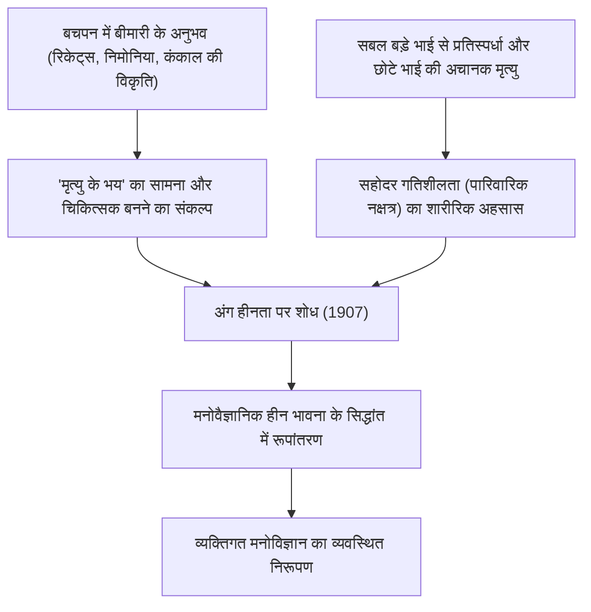
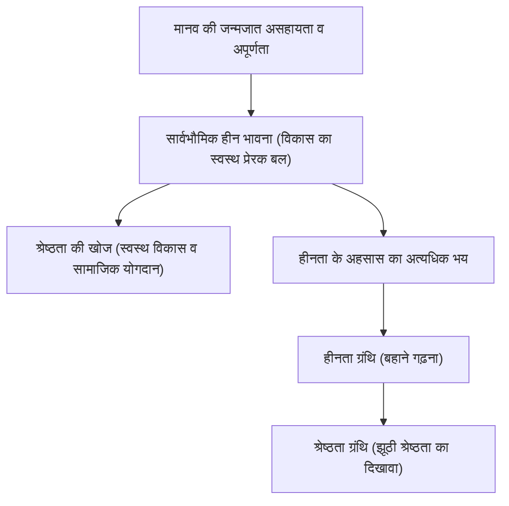
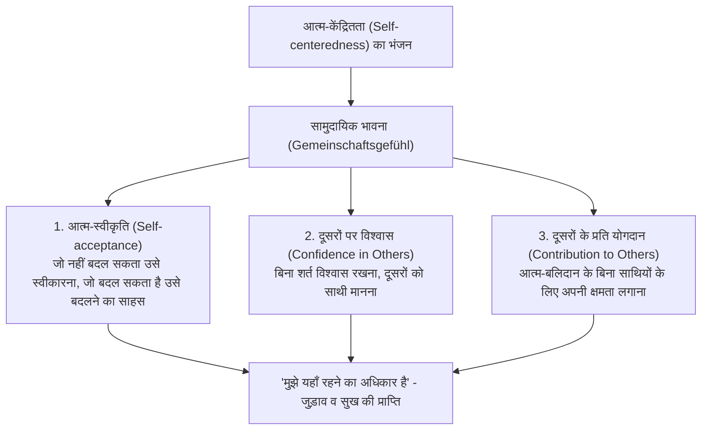
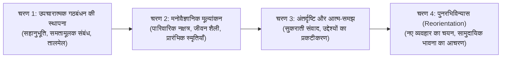

## प्रस्तावना: आज अल्फ्रेड एडलर क्यों प्रासंगिक हैं?

20वीं सदी के आरंभिक दौर में विएना में उभरी गहन मनोविज्ञान (Depth Psychology) की लहरों के बीच, अल्फ्रेड एडलर (Alfred Adler, 1870–1937) द्वारा स्थापित "व्यक्तिगत मनोविज्ञान (Individual Psychology / जर्मन: Individualpsychologie)" आज भी अद्वितीय व्यावहारिक प्रासंगिकता और युगांतरकारी दूरदर्शिता प्रस्तुत करता है।

जहाँ सिगमंड फ्रायड (Sigmund Freud) ने अचेतन की सहज मूलप्रवृत्तियों (कामोर्जा - Libido) और अतीत के मानसिक आघातों पर आधारित "मानसिक नियतिवाद (Psychic Determinism)" की स्थापना की, तथा कार्ल गुस्ताव जुंग (Carl Gustav Jung) आद्यप्ररूपों (Archetypes) और सामूहिक अचेतन के पौराणिक अगाध रहस्यों में गहरे उतरे, वहीं एडलर द्वारा प्रशस्त किया गया क्षितिज अत्यंत स्पष्ट था और पूर्णतः "उस यथार्थ समाज तथा भविष्य" के प्रति समर्पित था जिसमें मनुष्य जीता है।

एडलर के मानव-दृष्टिकोण के मूल में यह दृढ़ विश्वास निहित है कि "मनुष्य अतीत की घटनाओं द्वारा यांत्रिक रूप से संचालित होने वाला कोई निष्क्रिय प्राणी नहीं है, अपितु स्वयं द्वारा निर्धारित लक्ष्यों की ओर स्वायत्त और सृजनात्मक रूप से अग्रसर होने वाला एक एकीकृत अस्तित्व है।" उन्होंने अपने संप्रदाय को जो "व्यक्तिगत मनोविज्ञान (Individual Psychology)" नाम दिया, उसमें 'Individual' शब्द लैटिन भाषा के *individuus* (अविभाज्य, जिसे खंडित न किया जा सके) से व्युत्पन्न है। अर्थात, यह मन को "चेतन और अचेतन", "तर्क और भावना", अथवा "इड, ईगो और सुपर-ईगो" जैसे परस्पर विरोधी घटकों में विभाजित करने वाले तत्ववादी अपचयनवाद (Reductionism) को सिरे से खारिज करता है, और मनुष्य को समग्र रूप से एकीकृत एक एकल सजीव प्रणाली (समग्रतावाद / Holism) के रूप में ग्रहण करने वाला विचार था।

```
【गहन मनोविज्ञान की तीन प्रमुख धाराओं की प्रतिमान तुलना】

┌─────────────────┬───────────────────────────────┬───────────────────────────────┬───────────────────────────────┐
│ संप्रदाय / संस्थापक │ सिगमंड फ्रायड                 │ कार्ल गुस्ताव जुंग            │ अल्फ्रेड एडलर                 │
├─────────────────┼───────────────────────────────┼───────────────────────────────┼───────────────────────────────┤
│ संप्रदाय का नाम │ मनोविश्लेषण (Psychoanalysis)  │ विश्लेषणात्मक मनोविज्ञान      │ व्यक्तिगत मनोविज्ञान          │
│                 │                               │ (Analytical Psychology)       │ (Individual Psychology)       │
│ मानव-दृष्टिकोण  │ यांत्रिक/नियतिवादी (आघात-आधारित)│ प्रयोजनवादी/आद्यप्ररूपी (पौराणिक)│ कर्ता-केंद्रित/समग्रतावादी (उद्देश्यवादी)│
│ मन की संरचना    │ चेतन / अवचेतन / अचेतन (विभाजित)│ व्यक्तिगत अचेतन/सामूहिक अचेतन │ अविभाज्य एकीकृत सत्ता (समग्रतावाद)│
│ मूल प्रेरणा     │ कामोर्जा (कामुक/विनाशकारी आवेग) │ मन की समग्रता (आत्म-साक्षात्कार)│ श्रेष्ठता की खोज/सामुदायिक भावना│
│ उपचार/दृष्टिकोण │ अतीत के दमन का स्मरण/विरेचन   │ स्वप्न विश्लेषण/आद्यप्ररूप एकीकरण│ जीवन शैली का पुनरभिविन्यास/प्रोत्साहन│
└─────────────────┴───────────────────────────────┴───────────────────────────────┴───────────────────────────────┘
```

एडलरियन मनोविज्ञान मात्र नैदानिक मनोविज्ञान की कोई एक शाखा भर नहीं है। यह इस शाश्वत प्रश्न का उत्तर देने वाला एक व्यावहारिक अस्तित्वपरक दर्शन तथा लोकतांत्रिक सामाजिक शिक्षा विचार भी है कि मनुष्य "किस प्रकार हीन भावना पर विजय प्राप्त करे, दूसरों के साथ समन्वय स्थापित करे, और समाज में जुड़ाव व प्रसन्नता हासिल करते हुए जीवन जिए।" प्रस्तुत शोधपरक लेख में, फ्रायड के साथ वैचारिक संघर्ष से आरंभ करते हुए, उद्देश्यवाद, हीन भावना और श्रेष्ठता की खोज, जीवन शैली, जीवन के तीन कार्य, सामुदायिक भावना, कार्यों का पृथक्करण, और आधुनिक संज्ञानात्मक व्यवहार थेरेपी (CBT) तथा सकारात्मक मनोविज्ञान से जुड़ने वाले इस संपूर्ण सैद्धांतिक ढांचे का अकादमिक प्रामाणिकता के साथ विशद विश्लेषण किया गया है।

---

## 1. एडलर का जीवन और व्यक्तिगत मनोविज्ञान का निर्माण इतिहास

### 1.1 शैशवावस्था के बीमारी के अनुभव और 'अंग हीनता' की मूल पृष्ठभूमि
अल्फ्रेड एडलर का जन्म 7 फरवरी 1870 को ऑस्ट्रो-हंगेरियन साम्राज्य की राजधानी विएना के उपनगरीय क्षेत्र पेंजिंग (Penzing) में एक यहूदी अनाज व्यापारी के परिवार में दूसरे पुत्र के रूप में हुआ था।

एडलर के मनोविज्ञान को समझने के लिए उनके बचपन के कठिन शारीरिक अनुभवों को जानना अपरिहार्य है। एडलर बचपन में गंभीर "रिकेट्स (सूखा रोग)" से पीड़ित थे, जिसके कारण उनकी हड्डियों का विकास अवरुद्ध हो गया था और वे चार वर्ष की आयु तक ठीक से चलने में असमर्थ रहे। इसके अतिरिक्त, पाँच वर्ष की आयु में वे एक जानलेवा तीव्र निमोनिया (Acute Pneumonia) की चपेट में आ गए; बिस्तर पर पड़े-पड़े उन्होंने पारिवारिक चिकित्सक को अपने पिता से यह कहते सुना कि "इस बच्चे के बचने की कोई उम्मीद नहीं है।" इस चरम संकट से चमत्कारिक रूप से उबरने के क्षण ही एडलर के हृदय में यह दृढ़ संकल्प (लक्ष्य / फिक्शन) अंकित हो गया कि "मैं बीमारी पर विजय पाऊँगा और मृत्यु के भय का सामना करने वाला चिकित्सक बनूँगा।"

इसके साथ ही, अपने स्वस्थ और एथलेटिक बड़े भाई सिगमंड के प्रति तीव्र प्रतिस्पर्धा और हीन भावना, तथा अपने से छोटे भाई की शैशवावस्था में ही बिस्तर पर अचानक हुई मृत्यु का अनुभव — मृत्यु, रोग, शारीरिक दुर्बलता और सहोदरों (भाई-बहनों) के बीच तुलना की इस कठोर वास्तविकता ने उस मूल अनुभव की आधारशिला रखी, जिसे बाद में उन्होंने "अंग हीनता (Organ Inferiority)", "हीन भावना (Inferiority Feeling)", और "पारिवारिक नक्षत्र / संरचना (Family Constellation)" के सिद्धांतों के रूप में प्रतिपादित किया।



### 1.2 विएना बुधवार मनोवैज्ञानिक समाज और फ्रायड से अलगाव (1902–1911)
विएना विश्वविद्यालय के चिकित्सा संकाय से स्नातक होने के बाद, एडलर ने अपने करियर की शुरुआत एक नेत्र रोग विशेषज्ञ के रूप में की, जिसके बाद वे सामान्य आंतरिक चिकित्सा और फिर मनोचिकित्सा की ओर मुड़े। प्राटर (Prater) मनोरंजन पार्क के सर्कस कलाकारों, दस्तकारों और मजदूर वर्ग के अनेक रोगियों का उपचार करते हुए, उन्होंने इस बात में गहरी रुचि ली कि जिन व्यक्तियों के शरीर के किसी विशिष्ट अंग में जन्मजात या उपार्जित दुर्बलता (अंग हीनता) होती है, वे उसकी भरपाई के लिए अन्य अंगों या मानसिक क्षमताओं का असाधारण विकास कर लेते हैं (अति-क्षतिपूर्ति / Overcompensation)।

1902 में, एक समाचार पत्र की समीक्षा में फ्रायड की पुस्तक 'द इंटरप्रिटेशन ऑफ ड्रीम्स' (स्वप्न विश्लेषण) का समर्थन करने के फलस्वरूप, फ्रायड ने उन्हें प्रति बुधवार शाम को अपने आवास पर आयोजित होने वाली एक लघु अध्ययन गोष्ठी ("बुधवार मनोवैज्ञानिक समाज", जो बाद में विएना मनोविश्लेषणात्मक समाज बना) में आमंत्रित किया, जहाँ एडलर इसके संस्थापक सदस्यों में से एक बने। 1910 में एडलर विएना मनोविश्लेषणात्मक समाज के अध्यक्ष चुने गए और उन्हें फ्रायड के सबसे सक्षम उत्तराधिकारियों में से एक माना जाने लगा।

किंतु दोनों के बीच यह सौहार्द अधिक समय तक नहीं टिक सका। फ्रायड जहाँ सभी मनस्तापों (Neuroses) के मूल कारण को "बचपन की कामुकता (कामोर्जा का दमन और अटकाव)" पर आधारित सर्वकामुकतावाद (Pansexualism) में तलाशने पर अड़े रहे, वहीं एडलर का तर्क था कि मानव व्यवहार की बुनियाद में कामेच्छा नहीं, बल्कि "अपनी कमजोरी और लाचारी से उबरने की श्रेष्ठता की इच्छा", "आक्रामकता" और "आत्म-पुष्टि की आकांक्षा" विद्यमान है।

1911 में, एक निर्णायक विभाजन हुआ। विएना मनोविश्लेषणात्मक समाज की नियमित बैठकों में एडलर ने सिलसिलेवार व्याख्यान दिए, जिनमें फ्रायड के कामेच्छा सिद्धांत की आलोचना करते हुए उन्होंने अपने "पुरुषवादी विरोध (Masculine Protest)" का सिद्धांत प्रस्तुत किया। फ्रायड ने एडलर के सिद्धांत को "मनोविश्लेषण के मर्म को नकारने वाला पाखंड" बताते हुए उसकी तीखी भर्त्सना की और किसी भी समझौते से इनकार कर दिया। एडलर ने समाज के अध्यक्ष पद और पत्रिका के मुख्य संपादक पद से त्यागपत्र दे दिया और अपने 9 समर्थक सहयोगियों के साथ मनोविश्लेषणात्मक समाज से अलग हो गए। अगले वर्ष 1912 में, एडलर और उनके साथियों ने अपने संप्रदाय को "मुक्त मनोविश्लेषण समाज" नाम दिया, जिसे शीघ्र ही बदलकर "व्यक्तिगत मनोविज्ञान समाज (Society for Individual Psychology)" कर दिया गया। इस प्रकार, फ्रायड के मनोविश्लेषण से पूर्णतः पृथक होकर "व्यक्तिगत मनोविज्ञान" का औपचारिक जन्म हुआ।

---

## 2. उद्देश्यवाद बनाम कारणवाद: मनोविज्ञान का प्रतिमान परिवर्तन

### 2.1 यांत्रिक कारणवाद (Causality) की सीमाएं और ट्रॉमा का खंडन
एडलरियन मनोविज्ञान के सैद्धांतिक ढांचे का सबसे क्रांतिकारी परिवर्तन "कारणवाद (Causality)" की तीखी आलोचना और "उद्देश्यवाद / प्रयोजनवाद (Teleology)" का प्रतिपादन है।

फ्रायड द्वारा प्रतिनिधित्व किए जाने वाले शास्त्रीय मनोचिकित्सा और आधुनिक विज्ञान ने आइजैक न्यूटन के "कार्य-कारण नियम" को मानव मन के क्षेत्र में लागू किया था। अर्थात, यह ऐसा ढांचा था कि "अतीत की घटना (A) ने वर्तमान अवस्था (B) को जन्म दिया।" उदाहरणार्थ, उनका स्पष्टीकरण था: "बचपन में माता-पिता द्वारा दुर्व्यवहार किए जाने और प्रेम न मिलने (A) के कारण, वर्तमान में व्यक्ति सामाजिक भय (सोशल फोबिया) से ग्रस्त है और समाज में समायोजित नहीं हो पा रहा है (B)।"

इसके विपरीत, एडलर ने इस प्रकार के यांत्रिक कारणवाद की कड़ी आलोचना की। एडलर के अनुसार, अतीत की घटना स्वयं मनुष्य को निर्धारित नहीं करती। यदि अतीत का मानसिक आघात (ट्रॉमा) मनुष्य को अनिवार्य रूप से निर्धारित करता, तो विषम परिस्थितियों में पले-बढ़े प्रत्येक व्यक्ति को बिना किसी अपवाद के समान मनस्ताप का शिकार होना चाहिए था, और ऐसी स्थिति में मानवीय स्वतंत्र इच्छाशक्ति या सुधार की कोई गुंजाइश ही न बचती। एडलर ने दृढ़तापूर्वक कहा है:

> "कोई भी अनुभव अपने आप में सफलता या असफलता का कारण नहीं होता। हम अपने अनुभवों के आघात — तथाकथित ट्रॉमा — से पीड़ित नहीं होते, बल्कि अनुभवों में से वही चुनते हैं जो हमारे वर्तमान उद्देश्य की पूर्ति करता हो, और हम स्वयं उसे अर्थ प्रदान करते हैं।"
> (*What Life Could Mean to You*, 1931)

```
【कारणवाद और उद्देश्यवाद का ज्ञानमीमांसीय अंतर】

■ कारणवाद (फ्रायड का कार्य-कारण नियम / नियतिवाद)
अतीत का यथार्थ (माता-पिता का दुर्व्यवहार, असफलता, प्रेम में टूटना)
  -- "अनिवार्य कार्य-कारण संबंध (बाह्य कारकों द्वारा निर्धारण)" -->
वर्तमान परिणाम (सामाजिक भय, अलगाव, अकर्मण्यता)
※ मनुष्य अतीत की कठपुतली बन जाता है; और चूँकि अतीत बदला नहीं जा सकता, इसलिए व्यक्ति निराशाजनक भाग्यवादी जाल में फँस जाता है।

■ उद्देश्यवाद (एडलर का कर्म सिद्धांत / कर्ता-केंद्रित दृष्टिकोण)
वर्तमान का छिपा हुआ उद्देश्य (दूसरों के साथ टकराव से बचना, आहत होने से खुद को बचाना)
  -- "उद्देश्य की पूर्ति हेतु साधन का चयन (आंतरिक सृजन)" -->
वर्तमान लक्षणों व भावनाओं का निर्माण (चिंता, क्रोध, भय की स्वयं रचना करना)
※ अतीत के तथ्य केवल कच्ची सामग्री हैं। मनुष्य "वर्तमान उद्देश्य" की पूर्ति के लिए अतीत की स्मृतियों का उपयोग करता है।
```

### 2.2 उद्देश्यवाद (Teleology) की संरचना और भावनाओं का «उपयोग»
एडलर के उद्देश्यवाद में, मानवीय व्यवहार, भावनाएँ, यहाँ तक कि मानसिक लक्षण (चिंता, अवसाद, पैनिक, बाध्यता) भी व्यक्ति द्वारा अचेतन रूप से पोषित "छिपे हुए उद्देश्य (Hidden Goal)" को प्राप्त करने के "साधन" के रूप में समझे जाते हैं।

उदाहरण के लिए, सामाजिक चिंता विकार (Social Anxiety Disorder) से ग्रस्त किसी व्यक्ति पर विचार करें, जो कहता है: "लोगों के सामने जाते ही मेरे हाथ-पैर कांपने लगते हैं, चेहरा लाल हो जाता है और मैं बोल नहीं पाता।"
- **कारणवादी व्याख्या**: "अतीत में सबके सामने असफल होकर लज्जित होने के मानसिक आघात (ट्रॉमा) के कारण, अचेतन भय की अनुकूलन प्रक्रिया (कंडीशनिंग) सक्रिय हो रही है।"
- **उद्देश्यवादी व्याख्या**: "उस व्यक्ति का उद्देश्य है 'लोगों के सामने लज्जित होने से बचना' या 'यदि मैं असफल हुआ और मेरी अयोग्यता उजागर हो गई तो मैं उसे बर्दाश्त नहीं कर पाऊँगा'। इस उद्देश्य की पूर्ति के लिए वह स्वयं 'चेहरे का लाल होना' या 'कंपकंपी' जैसे शारीरिक लक्षण उत्पन्न करता है, ताकि उसे यह वैध बहाना (एलिबाई) मिल सके कि 'बीमार होने के कारण मैं लोगों के सामने नहीं जा सकता'।"

यहाँ महत्वपूर्ण दृष्टिकोण यह है कि भावनाएँ (क्रोध, चिंता, उदासी) बाहर से निष्क्रिय रूप से मनुष्य पर "हमला" नहीं करतीं, बल्कि वे ऐसे "उपकरण हैं जिन्हें मनुष्य अपने उद्देश्यों को पूरा करने के लिए स्वयं गढ़ता और इस्तेमाल करता है।"

एडलर ने प्रसिद्ध "क्रोध के औजार होने का सिद्धांत" प्रस्तुत किया। मान लीजिए एक माँ अपने बच्चे पर भयंकर क्रोध में चीख-चिल्ला रही है, तभी कक्षा-अध्यापक का फोन आता है। फोन का रिसीवर उठाते ही माँ की आवाज तुरंत अत्यंत विनम्र, शिष्ट और शांत हो जाती है। बातचीत समाप्त होते ही वह फोन रखती है और अगले ही पल फिर से बच्चे पर उसी उग्रता से चीखने लगती है। यदि क्रोध एक शारीरिक आवेग के रूप में मनुष्य पर हावी होने वाली कोई अनियंत्रित शक्ति होता, तो चंद सेकंड के भीतर इतने शांत संवाद में बदल जाना असंभव था। माँ ने "बच्चे को तुरंत झुकाने और अपनी बात मनवाने" के उद्देश्य से क्रोध नामक भावना को जानबूझकर उभारा और एक औजार के रूप में उसका इस्तेमाल किया।

एडलरियन मनोविज्ञान में मनुष्य भावनाओं का दास नहीं है। वह तो भावनाओं को अपने लक्ष्यों की प्राप्ति हेतु चुनने और उपयोग करने वाला संप्रभु कर्ता है।

---

## 3. हीन भावना, हीनता ग्रंथि और श्रेष्ठता की खोज

### 3.1 अंग हीनता से सार्वभौमिक हीन भावना तक
एडलर ने अपने करियर के प्रारंभिक शोध 'अंग हीनता का अध्ययन' (*Studie über Minderwertigkeit von Organen*, 1907) में शारीरिक अंगों की कार्यात्मक अपूर्णता और उसके प्रति जैविक क्षतिपूर्ति तंत्र का विश्लेषण किया। जिन जीवों के हृदय, गुर्दे या संवेदी अंगों में जन्मजात दुर्बलता होती है, वे केंद्रीय तंत्रिका तंत्र के क्षतिपूरक प्रयासों के माध्यम से उस कमी को दूर करने का प्रयास करते हैं।

एडलर ने इस शरीरक्रियात्मक और विकृति-विज्ञानी अंतर्दृष्टि का मन के क्षेत्र में क्रांतिकारी विस्तार किया। अन्य प्राणियों की तुलना में मानव शिशु अत्यंत असहाय और दुर्बल अवस्था में जन्म लेता है। न उसके पास नुकीले दांत या पंजे होते हैं, न ही मोटा फर, और माता-पिता के संरक्षण के बिना वह एक दिन भी जीवित नहीं रह सकता। अतः प्रत्येक मनुष्य बचपन में अपने चारों ओर अपार शक्तिशाली वयस्कों से घिरा होने के कारण अपनी लाचारी, लघुता और अपूर्णता का तीखा अहसास करने के लिए विवश होता है।

इस असहायता की स्थिति से बाहर निकलने के मनोवैज्ञानिक तनाव को एडलर ने "हीन भावना (Minderwertigkeitsgefühl / Inferiority Feeling)" का नाम दिया। यहाँ सबसे निर्णायक बात यह है कि एडलर के अनुसार **हीन भावना स्वयं कोई विकृति नहीं है, बल्कि यह मनुष्य के विकास और प्रगति के लिए एक अत्यंत स्वस्थ और सार्वभौमिक प्रेरक शक्ति (विकास का इंजन / Engine of Growth) है।**



### 3.2 हीन भावना बनाम हीनता ग्रंथि का सटीक सैद्धांतिक भेद
दैनिक बोलचाल में "कॉम्प्लेक्स" शब्द का प्रयोग प्रायः हीन भावना के पर्याय के रूप में ही कर दिया जाता है, किंतु एडलरियन मनोविज्ञान में "हीन भावना (Inferiority Feeling)" और "हीनता ग्रंथि (Inferiority Complex)" के मध्य एक सुस्पष्ट विभाजन रेखा खींची गई है।

1. **हीन भावना (Inferiority Feeling)**:
   अपनी वर्तमान स्थिति और आदर्श स्थिति के बीच के अंतर को पहचानने से उत्पन्न होने वाली अपूर्णता की व्यक्तिपरक अनुभूति। जैसे: "मुझमें अभी ज्ञान की कमी है, इसलिए मुझे और पढ़ना चाहिए" या "मेरा कौशल अभी अधूरा है, इसलिए मुझे अभ्यास करना चाहिए" — इस प्रकार यह परिश्रम और साधना के माध्यम से चुनौतियों पर विजय प्राप्त करने की एक स्वस्थ प्रेरणा बनती है।

2. **हीनता ग्रंथि (Inferiority Complex)**:
   हीन भावना को एक बहाने (तर्क) के रूप में इस्तेमाल करके जीवन के कार्यों से पलायन करने की एक विकृत/व्याधियुक्त अवस्था। यह "चूँकि A है, इसलिए मैं B नहीं कर सकता" जैसा एक दिखावटी कार्य-कारण संबंध (आभासी कारणता) गढ़ना है। जैसे: "मेरी शैक्षणिक योग्यता कम है, इसलिए मैं सफल नहीं हो सकता", "मेरा रूप-रंग आकर्षक नहीं है, इसलिए मेरा विवाह नहीं हो सकता", या "मेरे माता-पिता ने मेरी परवरिश ठीक से नहीं की, इसलिए मैं समाज में स्थापित नहीं हो पा रहा हूँ।"
   हीनता ग्रंथि में फंसा व्यक्ति अपने प्रयासों से समस्याओं को सुलझाने का परित्याग कर देता है, और अप्रिय यथार्थ से अपने आत्मसम्मान की रक्षा करने के लिए अपनी हीनता को ढाल बनाकर वहीं ठहर जाता है।

### 3.3 श्रेष्ठता ग्रंथि और सत्ता की लालसा की विकृति
जब हीनता ग्रंथि से ग्रस्त व्यक्ति अपनी हीनता का सीधा सामना करने की पीड़ा सहन नहीं कर पाता, तब प्रायः उसके दूसरे पहलू के रूप में "श्रेष्ठता ग्रंथि (Superiority Complex)" प्रकट होती है।

श्रेष्ठता ग्रंथि वास्तव में वास्तविक प्रयास करके कठिनाइयों पर विजय पाने के बजाय, "मानो वह स्वयं श्रेष्ठ हो, ऐसा झूठा दिखावा करने" की एक रक्षात्मक युक्ति (डिफेंस मैकेनिज्म) है। ठोस रूप से यह निम्नलिखित रूपों में सामने आती है:

- **अधिकार व रसूख का दिखावा (उधार का तेज)**: प्रसिद्ध व्यक्तियों या सत्ताधारियों से अपने व्यक्तिगत संबंधों की डींगें हांकना, महंगे ब्रांडेड सामानों या पदवियों से स्वयं को सुसज्जित करना।
- **आत्मप्रशंसा और अतीत के गौरव का बखान**: अपनी पुरानी उपलब्धियों और वीरता की गाथाएँ दोहराते रहना, ताकि अपनी वर्तमान निष्क्रियता व अकर्मण्यता को छुपाया जा सके।
- **"विपत्ति का रोना" और दुर्बलता द्वारा दूसरों पर नियंत्रण**: यह लगातार विलाप करना कि उसकी परिस्थितियाँ कितनी विषम हैं, वह कितना आहत और पीड़ित है — इसके माध्यम से दूसरों की सहानुभूति बटोरना, अपराधबोध कराकर उन्हें अपने इशारों पर नचाना, और विशेष व्यवहार की मांग करना। एडलर ने इसे "दुर्बलता का विशेषाधिकार" कहा और इसे श्रेष्ठता ग्रंथि का सबसे जटिल व असाध्य रूप माना।

### 3.4 श्रेष्ठता की खोज (Striving for Superiority) की स्वस्थ दिशा
हीन भावना से उबरने की मनुष्य की मौलिक प्रेरणा को एडलर ने प्रारंभिक काल में "आक्रामक प्रवृत्ति", "सत्ता की इच्छा (Will to Power)" और "पुरुषवादी विरोध" कहा था, किंतु जीवन के उत्तरार्ध में उन्होंने इसे अधिक व्यापक अवधारणा — "श्रेष्ठता की खोज (Striving for Superiority / उत्कृष्टता का प्रयास)" — के रूप में परिष्कृत किया।

श्रेष्ठता की स्वस्थ खोज का अर्थ कदापि "दूसरों से प्रतिस्पर्धा में जीतना, उन्हें पराजित करना या उन पर शासन करना" नहीं है। इसका वास्तविक अर्थ है: **"दूसरों से तुलना करने के बजाय, अपने स्वयं के आदर्श रूप से तुलना करना और अपनी सीमाओं को एक कदम आगे बढ़ाना"**। यह क्षैतिज धरातल पर दूसरों के साथ समान सत्ता के रूप में स्वयं को उन्नत करने की सतत प्रक्रिया है। जब श्रेष्ठता की खोज "लंबवत पदानुक्रम (ऊंच-नीच, प्रभुत्व और अधीनता)" की ओर मुड़ती है, तो वह मनस्ताप (Neurosis) की उपजाऊ भूमि बन जाती है; और जब वह "क्षैतिज समन्वय (समुदाय के प्रति योगदान)" की ओर अग्रसर होती है, तो वह सृजनात्मक और स्वस्थ आत्म-साक्षात्कार का रूप धारण कर लेती है।

---
## 4. समग्रतावाद और जीवन शैली: व्यक्ति की संज्ञानात्मक संरचना

### 4.1 समग्रतावाद (Holism): अविभाज्य इकाई के रूप में मनुष्य
एडलरियन मनोविज्ञान का पहला स्वयंसिद्ध सिद्धांत "समग्रतावाद (Holism)" है। आधुनिक बुद्धिवाद के जनक रेने देकार्त (René Descartes) के समय से ही पश्चिमी चिंतन मन और शरीर को दो भागों में बांटने वाले "मन-शरीर द्वैतवाद (Mind-Body Dualism)" से प्रभावित रहा है। मनोचिकित्सा में भी फ्रायड ने मन को "चेतन / अचेतन" और "ईगो / इड / सुपर-ईगो" जैसे परस्पर विरोधी घटकों में विभाजित किया तथा मनुष्य के आंतरिक संघर्ष (अंतर्मानसिक द्वंद्व) का मॉडल प्रस्तुत किया।

एडलर ने इस तत्ववादी अपचयनवाद (तत्व-विभाजन) को सिरे से खारिज कर दिया। एडलर के अनुसार, मनुष्य एक अविभाज्य एकीकृत सत्ता (Individual = in + dividual, जिसे बांटा न जा सके) है।
- "तर्क" और "भावना" परस्पर विरोधी नहीं हैं। भावनाएं उस उद्देश्य के लिए पैदा की जाती हैं जिसे तर्क पाना चाहता है, और वे तर्क के साथ मिलकर काम करती हैं।
- "चेतन" और "अचेतन" एक-दूसरे के शत्रु नहीं हैं। दोनों एक ही उद्देश्य की पूर्ति के लिए सहयोगपूर्वक कार्य करने वाले एक ही सिक्के के दो पहलू मात्र हैं। अचेतन का अर्थ केवल इतना है: "उद्देश्य का वह क्षेत्र जिसे व्यक्ति ने अभी शब्दों में व्यक्त या चेतन रूप से स्वीकार नहीं किया है।"
- "मन" और "शरीर" स्वतंत्र इकाइयाँ नहीं हैं। तीव्र चिंता का अनुभव होने पर हृदय गति का बढ़ जाना और पेट में दर्द होना इस बात का प्रमाण है कि मन और शरीर एक संपूर्ण समग्र के रूप में संकट का सामना करने के लिए सक्रिय हो रहे हैं।

एडलरियन मनोविज्ञान ऐसे द्वैतवादी बहानों को स्वीकार नहीं करता कि "दिमाग से तो मैं समझता हूँ, पर भावनाओं पर काबू नहीं रहता" अथवा "अचेतन इच्छा ने तर्क के विरुद्ध जाकर मुझसे ऐसा करा दिया।" इसके विपरीत, यह पूरी ज़िम्मेदारी एक संपूर्ण मनुष्य (Whole Person) पर डालता है जो क्रिया का कर्ता है: "मैंने, उस विशिष्ट उद्देश्य की पूर्ति के लिए, क्रोध नामक भावना का उपयोग करके चीखने का काम किया।"

```
【तत्ववादी अपचयनवाद (फ्रायड) और समग्रतावाद (एडलर) में संरचनात्मक अंतर】

■ तत्ववादी अपचयनवाद (मानसिक विखंडन मॉडल)
┌─────────────────────────┐
│ परा-अहम् / सुपर-ईगो (नैतिकता/मानक) │
├─────────────────────────┤  ← आंतरिक द्वंद्व व विभाजन
│ अहम् / ईगो (यथार्थ अनुकूलक तर्क)   │
├─────────────────────────┤  ← दमन और प्रतिरोध
│ इड (अचेतन की मूल प्रवृत्तियाँ)     │
└─────────────────────────┘
※ "मूल प्रवृत्ति के कारण तर्क हार गया", "अचेतन मुझे कठपुतली की तरह चला रहा है" जैसे आत्म-प्रवंचनापूर्ण बहाने जन्म लेते हैं।

■ समग्रतावाद (अविभाज्य एकीकृत मॉडल)
┌──────────────────────────────────────────────────────────────┐
│                    समग्र मनुष्य (अविभाज्य स्व)               │
│                                                              │
│  उद्देश्यवादी एकीकृत सत्ता:                                   │
│  तर्क, भावना, चेतन, अचेतन, और शरीर — सभी                    │
│  "एकल छिपे हुए लक्ष्य (जीवन शैली)" को प्राप्त करने के लिए    │
│  सहयोगपूर्वक कार्य करते हैं।                                  │
└──────────────────────────────────────────────────────────────┘
※ सभी आचरणों और भावनाओं का अंतिम उत्तरदायित्व एकीकृत "मैं" में निहित है।
```

### 4.2 जीवन शैली (Lifestyle) की परिभाषा और उसके तीन घटक
एडलरियन मनोविज्ञान में स्वभाव, व्यक्तित्व, विश्व-दृष्टिकोण और संज्ञानात्मक प्रतिमानों की समग्रता को व्यक्त करने वाली केंद्रीय अवधारणा "जीवन शैली (Lifestyle / जर्मन: Lebensstil)" है। यह आधुनिक संज्ञानात्मक थेरेपी के "स्कीमा (Schema)" और "संज्ञानात्मक संरचना" की पूर्ववर्ती अवधारणा है।

जीवन शैली वह "संसार और स्वयं को अर्थ प्रदान करने का एक निश्चित स्वरूप" है, जिसे मनुष्य बाल्यावस्था में (लगभग 4 से 6 वर्ष की आयु तक) अपनी शारीरिक दशा, पारिवारिक परिवेश और सांस्कृतिक संदर्भ में जीवित रहने व अपनी जगह बनाने के लिए स्वयं चुनता और निर्मित करता है। एक बार निर्मित हो जाने के बाद, यह जीवन शैली अचेतन रूप से वयस्क होने पर भी व्यक्ति के संपूर्ण प्रत्यक्षीकरण (अवगम), विचार, भावना और व्यवहार को छांटने वाले दिशा-सूचक (कुतुबनुमा) के रूप में कार्य करती रहती है।

एडलरियन मनोविज्ञान में जीवन शैली निम्नलिखित तीन प्रमुख घटकों से मिलकर बनती है:

1. **आत्म-अवधारणा (Self-concept)**:
   "मैं ऐसा हूँ" — स्वयं के संबंध में व्यक्ति का दृढ़ विश्वास। उदाहरणार्थ: "मैं असहाय हूँ", "मैं बुद्धिमान हूँ", "मुझसे कोई प्रेम नहीं कर सकता"।
2. **आत्म-आदर्श (Self-ideal)**:
   "मुझे ऐसा होना चाहिए" — स्वयं के लिए निर्धारित व्यक्तिपरक मानक। उदाहरणार्थ: "मुझे हमेशा अव्वल रहना चाहिए", "सबको मेरे प्रति दयालु होना ही चाहिए", "मुझे कभी असफल नहीं होना चाहिए"।
3. **विश्व-दृष्टिकोण (Weltbild / Picture of the World)**:
   "दूसरे लोग और समाज ऐसे हैं" — परिवेश और दुनिया के प्रति विश्वास। उदाहरणार्थ: "संसार खतरों से भरा है", "दूसरे लोग मेरा शोषण करने वाले शत्रु हैं", "जीवन अप्रत्याशित और तर्कहीन है"।

यदि किसी व्यक्ति की आत्म-अवधारणा "मैं लाचार हूँ", आत्म-आदर्श "मुझे आहत नहीं होना चाहिए", और विश्व-दृष्टिकोण "आसपास के लोग आक्रामक और क्रूर हैं" पर आधारित जीवन शैली है, तो वह व्यक्ति हर पारस्परिक संबंध में अत्यधिक सतर्क व सशंकित रहेगा, दूसरों की छोटी-छोटी बातों को शत्रुता मान लेगा, और सामाजिक अलगाव या पलायनवादी आचरण का चयन करेगा। यह कोई पैथोलॉजिकल (रोग-संबंधी) दोष नहीं है, बल्कि उस व्यक्ति की जीवन शैली के आंतरिक तर्क के दृष्टिकोण से देखा जाए तो यह पूरी तरह से सुसंगत और तर्कसंगत व्यवहार है।

### 4.3 प्रारंभिक स्मृतियों (Early Recollections) का नैदानिक महत्व
किसी व्यक्ति की अचेतन जीवन शैली को वस्तुनिष्ठ रूप से उजागर करने की एक अत्यंत शक्तिशाली नैदानिक प्रविधि के रूप में एडलर ने "प्रारंभिक स्मृतियों (Early Recollections)" के विश्लेषण का आविष्कार किया।

प्रारंभिक स्मृतियों की तकनीक में मुवक्किल (क्लाइंट) से यह कहा जाता है कि वह "अपनी याददाश्त की सबसे प्रारंभिक बचपन की स्मृति (सामान्यतः 6 से 8 वर्ष से पूर्व की कोई ठोस घटना)" को याद करे, और उस दृश्य, उपस्थित व्यक्तियों, अपने स्वयं के कार्यों तथा उस समय महसूस की गई भावनाओं का विस्तार से वर्णन करे।

फ्रायड ने बचपन की स्मृतियों को "अतीत के यथार्थ के अवशेष" अथवा "दमित आघातों (ट्रॉमा) के जीवाश्म" के रूप में देखा। किंतु उद्देश्यवाद के धरातल पर खड़े एडलर ने स्मृतियों को "वर्तमान जीवन शैली को उचित ठहराने और सुदृढ़ करने के उद्देश्य से, अतीत की अनगिनत घटनाओं में से स्वयं चुनी गई और पुनर्गठित की गई एक सृजनात्मक रचना (कहानी)" माना। मनुष्य अतीत को हूबहू वैसा ही याद नहीं रखता जैसा वह था; वह तो केवल उन्हीं यादों को संजोकर रखता है और उन्हें अपने मनचाहे रंगों में रंगता है जो उसके वर्तमान उद्देश्य की पूर्ति करती हों।

```
【प्रारंभिक स्मृतियों का विश्लेषण प्रतिमान】

• स्मृति की सामग्री: "5 वर्ष की उम्र में, मैं बगीचे के पेड़ से गिर गया और मेरे पैर में चोट लग गई। माँ दौड़ती हुई आईं और उन्होंने मुझे गले से लगा लिया।"
  ↓
• विश्लेषण के दृष्टिकोण:
  1. क्या कर्ता सक्रिय था या निष्क्रिय? (क्या उसने खुद कदम उठाया, या कुछ घटित होने की प्रतीक्षा की?)
  2. दूसरों की क्या भूमिका थी? (क्या वे खतरे को नजरअंदाज करने वाले शत्रु थे, या रक्षा करने वाले संरक्षक?)
  3. स्वयं की क्या पहचान थी? (असहाय और आसानी से आहत होने वाला प्राणी)
  ↓
• निष्कर्षित जीवन शैली विश्वास:
  "दुनिया खतरों से भरी है। असावधान रहने पर मुझे चोट लग सकती है और मैं लाचार हूँ।
   लेकिन अगर मैं अपनी कमजोरी दिखाकर मदद मांगूँ, तो दूसरे लोग प्यार से मेरी रक्षा करेंगे।"
  ↓
• वर्तमान व्यवहार प्रतिमान से संगति:
  कठिनाइयों का सामना होने पर स्वयं समाधान निकालने के बजाय, बीमारी या कमजोरी का रोना रोकर दूसरों की सहायता प्राप्त करने का प्रयास करना।
```

एडलर ने स्पष्ट शब्दों में कहा कि "प्रारंभिक स्मृति की सत्यता (कि क्या वह कोई वस्तुनिष्ठ ऐतिहासिक तथ्य है, अथवा व्यक्ति का भ्रम या कल्पना) से कोई फर्क नहीं पड़ता।" सबसे महत्वपूर्ण बात यह है कि वह व्यक्ति **"बचपन की हजारों घटनाओं में से आज भी विशेष रूप से उसी दृश्य को क्यों याद रखे हुए है?"** प्रारंभिक स्मृति में इस बात का 'ब्लूप्रिंट' (नक्शा) संचित होता है कि वह व्यक्ति वर्तमान में दुनिया को किस नजरिए से देखता है और किन रणनीतियों के सहारे अपनी जिंदगी बसर कर रहा है।

---

## 5. जीवन के तीन कार्य और सामुदायिक भावना

### 5.1 जीवन के तीन कार्य (Life Tasks)
एडलर ने उन अपरिहार्य अंतर्वैयक्तिक चुनौतियों को, जिनका सामना समाज में रहने वाले प्रत्येक मनुष्य को करना ही पड़ता है, "जीवन के कार्य (Life Tasks / जर्मन: Lebensaufgaben)" के रूप में सूत्रबद्ध किया। एडलर ने इन्हें तीन श्रेणियों में वर्गीकृत किया: "कार्य का दायित्व", "मित्रता का दायित्व", और "प्रेम का दायित्व"।

```
【जीवन के तीन कार्यों का पदानुक्रम और कठिनाई स्तर】

［प्रेम का दायित्व (Love Task)］
• दायरा: जीवनसाथी, प्रेमी/प्रेमिका, परिवार के साथ अत्यंत घनिष्ठ संबंध
• अपेक्षित स्तर: उच्चतम मनोवैज्ञानिक निकटता, पूर्ण आत्म-प्रकटीकरण, साझा भाग्य, पूर्ण समानता
• पलायन के बहाने: बंधन का भय, विश्वासघात, मानसिक प्रताड़ना, परफेक्शनिज्म (पूर्णतावाद)

［मित्रता का दायित्व (Friendship Task)］
• दायरा: मित्र, पड़ोसी, स्थानीय समुदाय, स्वार्थ से परे समतामूलक साथी संबंध
• अपेक्षित स्तर: प्रतिस्पर्धा-रहित क्षैतिज विश्वास, परोपकार, परस्पर सम्मान व स्वीकृति
• पलायन के बहाने: "धोखा मिलने का डर है", "कोई मुझे समझता ही नहीं"

［कार्य का दायित्व (Work Task)］
• दायरा: व्यावसायिक गतिविधियाँ, आर्थिक उत्पादन, सामाजिक श्रम-विभाजन का नेटवर्क
• अपेक्षित स्तर: नियमों का पालन, बुनियादी सहयोग, परिणामों के प्रति प्रतिबद्धता
• पलायन के बहाने: असफलता का भय, मूल्यांकन का डर, टालमटोल, सामाजिक घबराहट
```

1. **कार्य का दायित्व (Work Task)**:
   एक जैविक प्राणी के रूप में जीवित रहने के लिए सामाजिक श्रम-विभाजन के नेटवर्क में सम्मिलित होना और दूसरों के लिए उपयोगी मूल्यों का उत्पादन करना। इन तीनों में इसके हित-संबंध सबसे स्पष्ट होते हैं और अनुबंधों व औपचारिक नियमों द्वारा व्यवहार संचालित होता है, इसलिए पारस्परिक संबंधों की दृष्टि से इसे सबसे सरल माना जाता है; किंतु इससे भागने पर व्यक्ति आर्थिक कंगाली और सामाजिक असमंजन की ओर धकेल दिया जाता है।

2. **मित्रता का दायित्व (Friendship Task)**:
   कामकाज के प्रत्यक्ष आर्थिक हितों से परे विशुद्ध मित्रता और सौहार्दपूर्ण संबंध स्थापित करने का कार्य। इसमें एक-दूसरे से होड़ किए बिना, समान मनुष्य के रूप में परस्पर विश्वास करना और अपनी कमजोरियों को साझा करने की क्षमता अपेक्षित होती है। अनेक लोग "कहीं मुझे धोखा न मिल जाए" के संदेह और अविश्वास के कारण अपने सामाजिक संबंधों को संकुचित कर लेते हैं।

3. **प्रेम का दायित्व (Love Task)**:
   प्रेम-संबंध, वैवाहिक संबंध, माता-पिता और संतान के संबंध — जीवन के सर्वाधिक अंतरंग और दीर्घकालिक आमने-सामने के रिश्ते जोड़ने का दायित्व। इसमें मनोवैज्ञानिक दूरी शून्य के करीब पहुँच जाती है, जिससे व्यक्ति की वे कमजोरियाँ और दोष भी उजागर हो जाते हैं जिन्हें वह सबसे अधिक छिपाना चाहता है। दूसरे पर प्रभुत्व जताए बिना या उसकी अत्यधिक स्वीकृति की लालसा किए बिना, पूरी तरह समान साझीदार के रूप में "दोनों के सुख" की साधना करनी होती है, इसलिए यह तीनों कार्यों में सबसे कठिन कार्य है।

एडलर के अनुसार, समस्त मनोवैज्ञानिक समस्याएं (मनस्ताप, सामाजिक अलगाव, अपचारिता, अवसाद) इन्हीं जीवन-कार्यों के सम्मुख उपस्थित होने पर असफलता और आत्मसम्मान के आहत होने के भय से उन दायित्वों से पलायन (तथाकथित "जीवन का झूठ / Life Lie") करने के प्रयास से उत्पन्न होती हैं।

### 5.2 सामुदायिक भावना (Gemeinschaftsgefühl / Social Interest) का संपूर्ण स्वरूप
एडलरियन मनोविज्ञान का वैचारिक शिखर और सबसे गहन प्रत्यय "सामुदायिक भावना (Gemeinschaftsgefühl / Social Interest)" है। इसका शाब्दिक अनुवाद "सामुदायिक संवेदना" अथवा "सामुदायिक चेतना" है, किंतु अंग्रेजी जगत में इसे सामान्यतः "Social Interest (सामाजिक रुचि)" के रूप में अनुवादित किया जाता है।

सामुदायिक भावना का अर्थ है: **"स्वयं के प्रति आसक्ति (आत्म-केंद्रितता / Self-centeredness) को दूसरों के प्रति रुचि (Social Interest) में रूपांतरित करना"**। दूसरों को "शत्रु" न मानकर "मित्र/सहचर" समझना, और यह अनुभव करना कि "इस समुदाय में मेरा अपना एक स्थान है" — यही जुड़ाव (Belongingness) और सुरक्षा की परम अवस्था है।

एडलर ने स्पष्ट उद्घोषणा की कि मानसिक स्वास्थ्य का एकमात्र और निरपेक्ष मापदंड सामुदायिक भावना का उच्च स्तर है। जिस व्यक्ति में सामुदायिक भावना का अभाव होता है, वह दुनिया को एक हिंसक युद्धक्षेत्र समझता है जहाँ बलवान ही बच सकता है, और दूसरों को या तो खुद को धमकाने वाला शत्रु मानता है या इस्तेमाल करने का साधन। परिणामस्वरूप, वह हमेशा अकेलेपन और चिंता से ग्रसित रहता है, और झूठी श्रेष्ठता की तलाश में मनस्तापी अंतर्द्वंद्व में उलझ जाता है।



### 5.3 सामुदायिक भावना के तीन आधार स्तंभ
सामुदायिक भावना को व्यावहारिक और नैदानिक स्तर पर उतारने के लिए, आधुनिक एडलरियन मनोविज्ञान ने इसे निम्नलिखित तीन परस्पर जुड़े स्तंभों के रूप में परिभाषित किया है:

1. **आत्म-स्वीकृति (Self-acceptance)**:
   यह केवल "सकारात्मक सोच (Positive Thinking)" या कोरा "आत्म-विश्वास" नहीं है। जहाँ कोरा आत्म-विश्वास "असमर्थ होने पर भी स्वयं से 'मैं कर सकता हूँ' कहने का एक आत्म-छल" हो सकता है, वहीं आत्म-स्वीकृति का अर्थ है "अपनी अक्षमताओं और अपूर्णताओं को जस का तस स्वीकार करना, और जो चीजें बदली जा सकती हैं उन्हें बदलने के लिए पूरा प्रयास करने का साहस जुटाना।" यह राइनहोल्ड नीबर (Reinhold Niebuhr) की प्रसिद्ध प्रार्थना से पूर्णतः मेल खाती है: ("हे ईश्वर, मुझे उन चीजों को स्वीकार करने की शांति प्रदान करें जिन्हें मैं बदल नहीं सकता, उन चीजों को बदलने का साहस दें जिन्हें मैं बदल सकता हूँ, और दोनों में भेद करने की प्रज्ञा दें।")

2. **दूसरों पर विश्वास (Confidence in Others)**:
   यह केवल "क्रेडिट (Credit / साख)" नहीं है। साख का अर्थ किसी ज़मानत, अतीत के रिकॉर्ड या शर्तों के आधार पर भरोसा करना होता है (जैसे बैंक ऋण देता है)। इसके विपरीत, दूसरों पर वास्तविक विश्वास का अर्थ है बिना किसी ज़मानत या शर्त के किसी पर बिना शर्त आस्था रखना। निस्संदेह, इसमें विश्वासघात का जोखिम रहता है। किंतु यदि कोई धोखा देता भी है, तो वह "उसका कार्य/दायित्व" है, और मैं विश्वास करता हूँ या नहीं, यह "मेरा कार्य/दायित्व" है — इस स्पष्ट समझ के माध्यम से व्यक्ति अविश्वास के पिंजरे से मुक्त हो जाता है।

3. **दूसरों के प्रति योगदान (Contribution to Others)**:
   यह "आत्म-बलिदान (Self-sacrifice)" नहीं है। अपने जीवन और स्वास्थ्य को नष्ट करके दूसरों की सेवा करना केवल स्वीकृति की लालसा से प्रेरित एक मनस्तापी समर्पण भर है। स्वस्थ योगदान का अर्थ है: "अपने अस्तित्व के अर्थ और मूल्य की अनुभूति करने के लिए समुदाय के साथियों के कल्याण हेतु अपनी क्षमताओं का स्वेच्छा से उपयोग करना।" एडलर ने उद्घोष किया था: "सुख का अर्थ ही योगदान की अनुभूति है।" दूसरों के लिए उपयोगी होने का यह अहसास मनुष्य को यह विश्वास दिलाता है कि "मेरा अपना मूल्य है", और यही जीने के साहस का सच्चा स्रोत बनता है।

---

## 6. कार्यों का पृथक्करण और साहस का मनोविज्ञान

### 6.1 कार्यों के पृथक्करण (Separation of Tasks) की तार्किक संरचना
मानवीय संबंधों की जटिल समस्याओं को जड़ से समाप्त करने के लिए एडलरियन मनोविज्ञान एक तीखे शस्त्र के रूप में जो सिद्धांत प्रस्तुत करता है, वह है "कार्यों का पृथक्करण (Separation of Tasks)"।

पारस्परिक संबंधों में पैदा होने वाले सभी मतभेद, टकराव और मानसिक तनाव या तो "दूसरों के कार्य में जबरन टांग अड़ाने" से पैदा होते हैं, या फिर "अपने कार्य में दूसरों को मनमाना हस्तक्षेप करने देने" से उत्पन्न होते हैं।

एडलर ने कार्यों को अलग-अलग पहचानने के लिए एक अत्यंत सरल और स्पष्ट कसौटी प्रस्तुत की:
**"उस विकल्प के अंतिम परिणाम को आखिरकार कौन भुगतेगा?"**

```
【कार्यों के पृथक्करण का ठोस उदाहरण: बच्चे की पढ़ाई का प्रश्न】

• माता-पिता की सोच (कार्यों का घालमेल/मिश्रण):
  "यदि बच्चा पढ़ाई नहीं करेगा तो उसका भविष्य बर्बाद हो जाएगा, इसलिए मुझे उसे जबरन पढ़ाना ही होगा।"
  → बच्चे के कार्य में माता-पिता का सत्तावादी हस्तक्षेप (नियंत्रण व प्रभुत्व)।
  → बच्चा विद्रोह करता है, और पढ़ाई को "माता-पिता को परेशान करने का हथियार" बना लेता है।

• कार्यों के पृथक्करण पर आधारित व्यवस्था:
  1. "पढ़ाई करे या न करे, और इसके परिणामस्वरूप अंक कम आने या अच्छे स्कूल में प्रवेश न मिलने का अंतिम परिणाम कौन भुगतेगा?"
     → इसका अंतिम परिणाम स्वयं 【बच्चे】 को ही भुगतना होगा (बच्चे का कार्य)।
  2. माता-पिता क्या कर सकते हैं?
     → "पढ़ाई करो" का हुक्म देने के बजाय ऐसा परिवेश तैयार करना कि जब भी बच्चा सीखना चाहे, उसे तुरंत सहायता मिल सके,
        और यह दृष्टिकोण बनाए रखना कि "मुझे तुम्हारी क्षमता पर भरोसा है और मैं तुम्हारे साथ हूँ" (सहयोग की तैयारी और निगरानी)।
```

कार्यों के पृथक्करण का अर्थ कदापि दूसरों के प्रति ठंडी उदासीनता या उपेक्षा (Neglect) नहीं है। उपेक्षा का अर्थ होता है यह न जानना कि बच्चा क्या कर रहा है और उसमें कोई रुचि न लेना। एडलर की सहायता शैली इस प्रसिद्ध कहावत में समाहित है: "आप घोड़े को पानी के घाट तक तो ले जा सकते हैं, लेकिन उसे पानी पीने के लिए विवश नहीं कर सकते।" पानी पीना है या नहीं, इसका निर्णय स्वयं घोड़ा (व्यक्ति) ही करेगा; किसी अन्य द्वारा जबरन जबड़ा खोलकर पानी उड़ेलना हिंसा और दमन के सिवा कुछ नहीं है।

### 6.2 अनुमोदन की इच्छा का निषेध और 'स्वतंत्रता' की परिभाषा
कार्यों के पृथक्करण को उसके तार्किक निष्कर्ष तक ले जाने पर एडलरियन मनोविज्ञान आधुनिक समाज को जकड़े हुए "अनुमोदन की इच्छा / स्वीकृति की लालसा (Desire for Approval)" को दृढ़तापूर्वक नकार देता है।

एडलर के अनुसार, "दूसरों से स्वीकृति पाना", "प्रशंसा पाना" या "सराहना पाना" जैसी अनुमोदन की लालसा से संचालित होकर जीने वाला व्यक्ति वास्तव में "दूसरों की जिंदगी" जी रहा होता है। ऐसा इसलिए है क्योंकि दूसरों के मूल्यांकन की चिंता करने का अर्थ है — "दूसरे मेरे बारे में क्या राय रखते हैं" जैसे 【दूसरों के कार्य】 को अपने नियंत्रण में लेने का एक असंभव प्रयास करना।

एडलरियन मनोविज्ञान में "स्वतंत्रता" की परिभाषा है: **"दूसरों द्वारा नापसंद किए जाने से न डरना"**।
हर किसी को खुश करने की कोशिश करना और सबसे प्रिय बनने का ढोंग करना एक पाखंड है, और अपनी वास्तविक जीवन शैली को निरंतर झुठलाते रहने की एक असहनीय यातना है। जिस मार्ग को आप उचित समझते हैं उस पर चलना आपका कार्य है; उसके परिणामस्वरूप दूसरे आपको पसंद करते हैं या नापसंद, यह "उनका कार्य" है और यह आपके अधिकार क्षेत्र से बाहर की बात है। दूसरों की प्रशंसा या आलोचना पर निर्भर हुए बिना, अपनी अंतरात्मा और समुदाय के प्रति योगदान की भावना के आधार पर स्वायत्त रूप से कार्य करना ही वास्तविक आध्यात्मिक व मानसिक स्वतंत्रता की अनिवार्य शर्त है।

---
## 7. प्रोत्साहन (Encouragement) और लोकतांत्रिक शिक्षा सिद्धांत

### 7.1 पुरस्कार व दंड आधारित शिक्षा की पूर्ण आलोचना: प्रशंसा करने के खतरे
एडलरियन मनोविज्ञान के नैदानिक व शैक्षणिक सिद्धांतों में सबसे चौंकाने वाले प्रस्तावों में से एक है: "पुरस्कार और दंड आधारित शिक्षा (प्रशंसा करना और डांटना-फटकारना) का पूर्ण निषेध।"

सामान्य बाल-पालन और कॉर्पोरेट प्रबंधन में प्रायः "प्रशंसा करके आगे बढ़ाना" जैसे दृष्टिकोण की बहुत सराहना की जाती है। किंतु एडलर ने "प्रशंसा करने" के कृत्य के वास्तविक मर्म को गहराई से पहचाना। प्रशंसा करने के कार्य में अनिवार्य रूप से **"सक्षम व्यक्ति द्वारा अक्षम व्यक्ति को नीची दृष्टि से देखना, उसका मूल्यांकन करना और उसे नियंत्रित करना" जैसा एक लंबवत संबंध (ऊँच-नीच / पदानुक्रम)** अंतर्निहित होता है। जब कोई वयस्क किसी अन्य वयस्क से समान धरातल पर "शाबाश, तुमने बहुत अच्छा किया" या "तुम बहुत योग्य हो" कहकर प्रशंसा करता है, तो वह अत्यंत अस्वाभाविक और अपमानजनक प्रतीत होता है; ऐसा इसलिए है क्योंकि वहाँ ऊँच-नीच का शक्ति-संबंध काम कर रहा होता है।

```
【"प्रशंसा/डांट" और "प्रोत्साहन" का प्रतिमान अंतर】

┌─────────────────┬───────────────────────────────┬───────────────────────────────┐
│ मद / पहलू       │ पुरस्कार-दंड शिक्षा (प्रशंसा / डांट)│ प्रोत्साहन (Encouragement)     │
├─────────────────┼───────────────────────────────┼───────────────────────────────┤
│ संबंधों की पूर्वधारणा│ लंबवत संबंध (ऊँच-नीच, प्रभुत्व, हेरफेर)│ क्षैतिज संबंध (समानता, सम्मान, विश्वास)│
│ मूल्यांकन की कसौटी │ परिणाम, क्षमता, दूसरों से तुलना│ प्रक्रिया, इरादा, स्वयं से तुलना│
│ व्यक्ति में उत्पन्न भाव│ अनुमोदन की लालसा, असफलता का भय, निर्भरता│ आत्मविश्वास, स्वायत्तता, योगदान-भाव│
│ प्रेरणा की प्रकृति   │ बाह्य (इनाम पाने, दंड से बचने हेतु)│ आंतरिक (समुदाय हेतु स्वैच्छिक योगदान)│
│ संवाद के ठोस शब्द  │ "शाबाश!", "100 अंक लाए, कमाल कर दिया"│ "मदद के लिए धन्यवाद", "मुझे बहुत खुशी हुई"│
└─────────────────┴───────────────────────────────┴───────────────────────────────┘
```

एडलर के अनुसार, "प्रशंसा" की सबसे बड़ी बुराई यह है कि यह बच्चों या subordinates (अधीनस्थों) में यह गहरा अनुमोदन-व्यसन (स्वीकृति का नशा) भर देती है कि "यदि मेरी प्रशंसा नहीं की जाएगी, तो मैं कोई काम नहीं करूँगा" और "दूसरों के मूल्यांकन के बिना मैं अपने मूल्य का अनुभव नहीं कर सकता।" इसके अतिरिक्त, वे प्रशंसा न मिलने को ही एक प्रकार का "दंड" मानने लगते हैं, जिससे वे असफलता से अत्यधिक भयभीत होकर नई चुनौतियों से बचने लगते हैं।

दूसरी ओर, "डांटना-फटकारना" और भी अधिक हिंसक है। डांटना वास्तव में रचनात्मक शाब्दिक संवाद का परित्याग करके, क्रोध नामक भावना की सुलभ शक्ति का उपयोग करते हुए दूसरे को झुकाने का एक अपरिपक्व संचार माध्यम मात्र है। डांट खाने वाला व्यक्ति अपनी भूल का हृदय से पश्चाताप करने के बजाय, "अगली बार ऐसा करूँगा कि पकड़ा न जाऊँ" या "बदला कैसे लूँ" जैसी रक्षात्मकता और प्रतिशोध की भावना को बढ़ावा देने लगता है।

### 7.2 प्रोत्साहन (Encouragement) की प्रविधियां और क्षैतिज संबंध
पुरस्कार और दंड के विकल्प के रूप में एडलर ने जो दृष्टिकोण प्रस्तुत किया, वह है "प्रोत्साहन (Encouragement)"।
प्रोत्साहन का अर्थ है: **"कठिनाइयों पर विजय पाने की जीवंत ऊर्जा (साहस) को सामने वाले के भीतर से जागृत करने वाली सहायता"**, और यह पूरी तरह से समान "क्षैतिज संबंध" पर आधारित होती है।

प्रोत्साहन की केंद्रीय प्रविधियाँ इस प्रकार हैं:

1. **कृतज्ञता और प्रसन्नता की अभिव्यक्ति ("धन्यवाद", "मुझे बहुत खुशी हुई")**:
   सामने वाले को ऊपर से आंकने (मूल्यांकन करने) के बजाय, उसके कृत्य से आपको या समुदाय को कितनी मदद मिली, इस व्यक्तिपरक भावना को संप्रेषित करना। जैसे: "मदद करने के लिए बहुत धन्यवाद, इससे काम बहुत आसान हो गया", "तुम्हारे साथ होने से मुझे सचमुच बहुत खुशी हुई।" इससे सामने वाले में यह दृढ़ विश्वास (आत्म-प्रभावकारिता) पैदा होता है कि "मुझमें दूसरों के काम आने की क्षमता है" और "मेरा अपना मूल्य है।"
2. **प्रक्रिया और इरादे पर ध्यान देना**:
   परीक्षा के अंक या बिक्री के आँकड़ों जैसे "परिणामों" पर नहीं, बल्कि वहाँ तक पहुँचने के "प्रयास की प्रक्रिया" और "इरादे" पर ध्यान केंद्रित करना। जैसे: "तुमने अंत तक हार नहीं मानी और दृढ़ता से लगे रहे", "तुमने इस हिस्से में वाकई बहुत नई सोच लगाई है।" असफलता का क्षण ही प्रोत्साहन का सबसे उपयुक्त अवसर होता है, जहाँ "इस असफलता से हम क्या नया सीख सकते हैं" पर समान धरातल पर चर्चा की जाती है।
3. **कमजोरियों के बजाय शक्तियों पर ध्यान देना (पुनर्संदर्भीकरण / Reframing)**:
   "जल्दी ऊब जाने वाले" स्वभाव को "जिज्ञासु और तेजी से नई दिशा अपनाने वाला", तथा "जिद्दी" स्वभाव को "अपने संकल्प पर अडिग रहने की क्षमता" के रूप में पुनर्परिभाषित करना — अर्थात जिन विशेषताओं को लेकर व्यक्ति हीन भावना से ग्रस्त है, उन्हें सकारात्मक संदर्भ में ढालना।

### 7.3 विएना में बाल मार्गदर्शन केंद्र आंदोलन और सार्वजनिक शिक्षा सुधार
एडलर का सिद्धांत किसी हाथीदांत की मीनार में बंद अमूर्त विचार नहीं था, बल्कि यह एक विशाल सामाजिक आंदोलन के रूप में चरितार्थ हुआ। प्रथम विश्व युद्ध के बाद, जब ऑस्ट्रियाई क्रांति के फलस्वरूप सोशल डेमोक्रेटिक पार्टी ने नगरपालिका प्रशासन की बागडोर संभाली ("लाल विएना / Red Vienna"), तब एडलर ने विएना नगर शिक्षा बोर्ड के साथ मिलकर सरकारी स्कूलों के भीतर 30 से अधिक "बाल मार्गदर्शन केंद्रों (Child Guidance Clinics)" की स्थापना की।

एडलर के बाल मार्गदर्शन केंद्र एक क्रांतिकारी प्रणाली थे, जहाँ चिकित्सक, शिक्षक, माता-पिता और स्वयं बच्चे समान धरातल पर गोल घेरे में बैठकर खुले मंच पर शैक्षणिक व मनोवैज्ञानिक परामर्श करते थे। एडलर का दृढ़ विश्वास था कि परिवारों और विद्यालयों में तानाशाही व सत्तावादी प्रभुत्व को समाप्त करके एक लोकतांत्रिक व सहयोगात्मक समुदाय का निर्माण करना ही आने वाली पीढ़ी में मनस्ताप, बाल अपराध और युद्धों को रोकने का एकमात्र मार्ग है। विएना में किए गए इस ऐतिहासिक प्रयोग ने आधुनिक विद्यालयी मनोविज्ञान (School Psychology) और स्कूल काउंसलिंग की सीधी आधारशिला रखी।

---

## 8. एडलरियन नैदानिक परामर्श की तकनीकें और प्रक्रिया

### 8.1 उपचारात्मक संबंध की स्थापना: सहयोगी गठबंधन (Collaborative Alliance)
पारंपरिक मनोविश्लेषण में उपचारात्मक संबंध अत्यंत असंतुलित और सत्तावादी संरचना पर आधारित था, जहाँ सोफे (काउच) पर लेटा हुआ असहाय रोगी होता था और उसके पीछे बैठकर खामोशी से व्याख्याएं देने वाला सर्वज्ञाता विश्लेषक।

एडलरियन परामर्श ने इस ढांचे को जड़ से बदल दिया। परामर्शदाता (काउंसलर) और मुवक्किल (क्लाइंट) समान ऊंचाई की कुर्सियों पर आमने-सामने बैठते हैं। दोनों "समान सह-अन्वेषक" होते हैं, जो क्लाइंट के जीवन की पहेली को सुलझाने के लिए एक "साझेदारी (सहयोगी गठबंधन)" स्थापित करते हैं। काउंसलर कोई सर्वज्ञानी मार्गदर्शक नहीं, बल्कि एक ऐसा सुगमकर्ता (फैसिलिटेटर) है जो क्लाइंट के अपनी आंतरिक शक्ति से जीवन की चुनौतियों को हल करने की यात्रा में एक साथी की तरह साथ चलता है।



### 8.2 मनोवैज्ञानिक मूल्यांकन: पारिवारिक नक्षत्र (Family Constellation)
मूल्यांकन (असेसमेंट) के चरण में एडलरियन परामर्श जिस पहलू को सबसे अधिक महत्व देता है, वह है "पारिवारिक नक्षत्र (Family Constellation / पारिवारिक संरचना)" का विश्लेषण।

एडलर ने पाया कि बच्चा किस प्रकार की जीवन शैली अपनाता है, इस पर भाई-बहनों के बीच उसके जन्म-क्रम (Birth Order) और उस स्थिति के प्रति उसकी व्यक्तिपरक व्याख्या का गहरा प्रभाव पड़ता है:

- **पहली संतान (ज्येष्ठ)**: प्रारंभ में माता-पिता के संपूर्ण स्नेह का एकमात्र स्वामी होता है, किंतु दूसरे बच्चे के जन्म के साथ वह "सिंहासन से उतारे गए राजा" जैसा अनुभव करता है। अतीत के गौरव को याद करने और व्यवस्था, अधिकार व नियमों को बहुत अधिक महत्व देने की प्रवृत्ति होती है। इनमें उत्तरदायित्व की भावना तीव्र होती है, किंतु वे प्रायः रूढ़िवादी हो जाते हैं।
- **दूसरी संतान (मध्यम)**: जन्म से ही उसके आगे दौड़ने वाला एक प्रतिद्वंद्वी (बड़ा भाई या बहन) मौजूद होता है, इसलिए वह हमेशा "पूरे इंजन के साथ दौड़ की स्थिति" में रहता है। वह ज्येष्ठ संतान से भिन्न क्षेत्रों में अपनी श्रेष्ठता सिद्ध करने का प्रयास करता है, और उसमें विद्रोही, नवप्रवर्तनकारी अथवा अत्यधिक सहयोगात्मक बनने की प्रवृत्ति होती है।
- **सबसे छोटी संतान (कनिष्ठ)**: उसे कभी सिंहासन से उतरने का भय नहीं होता; या तो पूरे परिवार द्वारा उसे लाड़-प्यार से बिगाड़ दिया जाता है, या फिर वह सबको पछाड़ देने वाला एक अत्यधिक महत्वाकांक्षी व्यक्ति बन जाता है। उसमें "बिना कुछ किए भी मुझे प्यार मिलना चाहिए" जैसी परनिर्भर जीवन शैली विकसित होने का जोखिम रहता है।
- **एकल संतान (इकलौता बच्चा)**: घर में कोई प्रतिस्पर्धी सहोदर नहीं होता और वह हमेशा वयस्कों की दुनिया के बीच पलता-बढ़ता है। उसमें आत्म-केंद्रित होने की संभावना तो रहती है, किंतु साथ ही वह बड़ों जैसी परिपक्व बुद्धि और असाधारण क्षमताओं का प्रदर्शन भी कर सकता है।

यहाँ सबसे महत्वपूर्ण बात यह है कि जन्म-क्रम अपने आप में किसी मनुष्य को निर्धारित नहीं करता, बल्कि **"उस स्थिति में माता-पिता का ध्यान और अपनी जगह सुरक्षित करने के लिए बच्चे ने अपने जीवन की कौन-सी रणनीति (जीवन शैली) स्वयं चुनी"** — यह निर्णायक होता है।

### 8.3 सुकराती संवाद (Socratic Dialogue) और अंतर्दृष्टि
एडलरियन हस्तक्षेप उपदेशों या एकतरफा निर्देशों के रूप में नहीं, बल्कि प्राचीन यूनानी दार्शनिक सुकरात की दाई-कला (प्रसव-पद्धति) पर आधारित "सुकराती संवाद (Socratic Dialogue)" के माध्यम से आगे बढ़ता है।

परामर्शदाता कभी भी अतीत की छानबीन करने वाले ऐसे कारणवादी प्रश्न नहीं पूछता कि "आपने ऐसा क्यों किया?" इसके बजाय, वह उद्देश्यवादी प्रश्न सामने रखता है: "इस प्रकार का आचरण करके आप वास्तव में क्या हासिल करना चाहते हैं?" अथवा "यदि यह लक्षण पूरी तरह गायब हो जाए, तो आपकी जिंदगी में क्या बदलाव आएगा?"

इसके माध्यम से क्लाइंट उन "जीवन के झूठों" और "छिपे हुए झूठे मकसदों" को स्वयं पहचानने और उनका सामना करने में सक्षम होता है जिन्हें वह अब तक अचेतन रूप से पाले हुए था। एडलरियन अंतर्दृष्टि कोई कोरी बौद्धिक समझ नहीं है, बल्कि इस बात की आत्म-जागरूकता प्राप्त करना है कि "मेरे जीवन की पटकथा का लेखक कोई और नहीं, बल्कि मैं स्वयं हूँ" (Author of One's Life)।

### 8.4 पुनरभिविन्यास (Reorientation): नए आचरण के प्रयोग
अंतिम चरण यानी "पुनरभिविन्यास (Reorientation / दिशा-परिवर्तन)" में क्लाइंट अपनी पुरानी, गैर-रचनात्मक जीवन शैली का त्याग करके सामुदायिक भावना पर आधारित एक नए जीवन मार्ग का चयन और अभ्यास करता है।

एडलरियन दृष्टिकोण केवल परामर्श कक्ष के भीतर की सैद्धांतिक बातों तक सीमित रहने को नापसंद करता है; यह वास्तविक दैनिक जीवन में "ठोस व्यावहारिक प्रयोगों" पर बल देता है:
- जिस पड़ोसी को अब तक नमस्ते नहीं करते थे, कल सुबह मुस्कुराकर उसे नमस्ते करना।
- जीवनसाथी की आलोचना करने के बजाय उसके प्रति "कृतज्ञता के शब्द" व्यक्त करना।
- पूर्णतावाद (परफेक्शनिज्म) को छोड़कर, काम के 80% पूरा होते ही उसे दूसरों को दिखाना और उनकी प्रतिक्रिया मांगना।

एडलर ने सिखाया कि "स्वभाव (जीवन शैली) को बदलना किसी भी समय संभव है।" मनुष्य किसी भी क्षण अपनी जीवन शैली का पुनर्चयन कर सकता है। इसके लिए किसी असाधारण योग्यता की आवश्यकता नहीं है, आवश्यकता है तो केवल **"बदलने के साहस (Courage to Change)"** की।

---

## 9. आधुनिक विचार, संज्ञानात्मक व्यवहार थेरेपी (CBT) और कल्याण (Well-being) पर प्रभाव

### 9.1 संज्ञानात्मक व्यवहार थेरेपी के गुप्त अग्रदूत के रूप में एडलर
20वीं सदी के उत्तरार्ध से लेकर वर्तमान तक वैश्विक मनोचिकित्सा और मनोरोग-विज्ञान का 'गोल्ड स्टैंडर्ड' बनी "संज्ञानात्मक व्यवहार थेरेपी (CBT)"। इसके जनक अल्बर्ट एलिस (Albert Ellis / तर्कसंगत संवेग व्यवहार थेरेपी: REBT) और आरोन बेक (Aaron T. Beck / संज्ञानात्मक थेरेपी: CT) दोनों ने ही सार्वजनिक रूप से स्वीकार किया है कि वे एडलर के विचारों से अत्यधिक और सीधे तौर पर प्रभावित थे।

अल्बर्ट एलिस ने स्पष्ट शब्दों में कहा था कि "संभवतः एडलर ही आधुनिक संज्ञानात्मक थेरेपी के सच्चे संस्थापक हैं।" एलिस का प्रसिद्ध "ABC सिद्धांत (Activating Event = घटना, Belief = विश्वास/संज्ञान, Consequence = परिणाम/संवेगात्मक व्यवहार)" वस्तुतः एडलर के जीवन शैली सिद्धांत का ही आधुनिक रूपांतरण है।

```
【एडलरियन मनोविज्ञान और संज्ञानात्मक थेरेपी का वंशावलीय संबंध】

［एपिक्टीटस (स्टोइक दर्शन)］
"मनुष्य को घटनाएं विचलित नहीं करतीं, बल्कि घटनाओं के प्रति उसका दृष्टिकोण (निर्णय) विचलित करता है।"
  ↓
［अल्फ्रेड एडलर (व्यक्तिगत मनोविज्ञान, 1912~)］
• उद्देश्यवाद: घटनाएं नहीं, बल्कि उन्हें दिया गया "अर्थ (दृष्टिकोण)" भावनाओं और आचरण को तय करता है।
• जीवन शैली: बाल्यावस्था में निर्मित "संज्ञानात्मक रूपरेखा (स्कीमा)"।
• व्यक्ति का आत्म-उत्तरदायित्व और पुनरभिविन्यास।
  ↓
［अल्बर्ट एलिस (तर्कसंगत संवेग व्यवहार थेरेपी - REBT, 1955~)］
• ABC सिद्धांत (अतार्किक विश्वासों का खंडन)
［आरोन बेक (संज्ञानात्मक थेरेपी - CT, 1960 के दशक से)］
• स्वचालित विचार (Automatic Thoughts), मूल विश्वास (Core Beliefs), संज्ञानात्मक विकृतियों का संशोधन
```

बेक द्वारा सूत्रबद्ध की गई "संज्ञानात्मक विकृतियां (जैसे आर-पार की सोच, अति-सामान्यीकरण, विपत्तिकरण, मानसिक छलनी)" ठीक वही संरचनात्मक दोष हैं जिनका वर्णन एडलर ने 1910 और 1920 के दशकों में ही अपने "निजी तर्क (Private Logic)" की अवधारणा के तहत कर दिया था। एडलरियन मनोविज्ञान आधुनिक संज्ञानात्मक थेरेपी का मूल स्रोत है, जिसने मनोगतिक गहन मनोविज्ञान और संज्ञानात्मक व्यवहार थेरेपी के बीच एक ऐतिहासिक सेतु का निर्माण किया।

### 9.2 अस्तित्ववाद और उपयोगितावादी दर्शन के साथ प्रतिध्वनि
एडलर का मानव-दृष्टिकोण दार्शनिक इतिहास की दृष्टि से अमेरिकी "उपयोगितावाद / फलक्यवाद (Pragmatism)" और यूरोपीय "अस्तित्ववाद (Existentialism)" के साथ गहरा सामंजस्य रखता है।

एडलर ने हैंस वाइहिंगर (Hans Vaihinger) की प्रसिद्ध पुस्तक 'मानो ऐसा हो' का दर्शन (*Die Philosophie des Als Ob*, 1911) से निर्णायक सैद्धांतिक प्रेरणा प्राप्त की थी। मनुष्य किसी वस्तुनिष्ठ सत्य या अंतिम यथार्थ तक सीधे नहीं पहुँच सकता; वह अपने द्वारा गढ़ी गई "काल्पनिक मान्यताओं (Fiction / मानो ऐसा ही हो जैसी परिकल्पना)" के आधार पर कार्य करता है। एडलर ने इस प्रत्यय को मनोविज्ञान में लागू करते हुए प्रतिपादित किया कि मानवीय व्यवहार को दिशा देने वाले लक्ष्य कोई वस्तुनिष्ठ यथार्थ नहीं, बल्कि "व्यक्तिपरक रूप से निर्मित अंतिम काल्पनिक लक्ष्य (Fictions)" होते हैं।

इसके अलावा, ज्यां-पॉल सार्त्र (Jean-Paul Sartre) का यह अस्तित्ववादी उद्घोष कि "मनुष्य स्वतंत्र होने के लिए अभिशप्त है" और "अस्तित्व सार से पहले आता है", एडलर के "अतीत के कार्य-कारण बंधनों से मुक्ति और आत्म-निर्णय के उत्तरदायित्व" से आश्चर्यजनक रूप से मेल खाता है। एडलर एक ऐसे अस्तित्ववादी मनोवैज्ञानिक थे जिन्होंने मनुष्य को अपने भाग्य के नाम पर कोई भी बहाना बनाने की तनिक भी छूट नहीं दी, और विक्टर फ्रैंकल (Viktor Frankl) के लोगोथेरेपी के केंद्रीय सिद्धांत की भांति किसी भी विषम परिस्थिति में अपने दृष्टिकोण को चुनने की मानवीय स्वतंत्रता का आजीवन समर्थन किया।

### 9.3 सकारात्मक मनोविज्ञान और कल्याण शोध के अग्रदूत
मार्टिन सेलिगमैन (Martin Seligman) आदि द्वारा 1990 के दशक के उत्तरार्ध में प्रस्तुत "सकारात्मक मनोविज्ञान (Positive Psychology)" का केंद्रीय मॉडल — "दीर्घकालिक कल्याण का PERMA मॉडल (Positive Emotion, Engagement, Relationships, Meaning, Accomplishment)" — वास्तव में एडलर की सामुदायिक भावना (जुड़ाव, दूसरों के प्रति योगदान, जीवन-कार्यों पर विजय) का ही आधुनिक अनुभवजन्य पुनर्सत्यापन है।

हाल के वर्षों के तंत्रिका विज्ञान (Neuroscience) और सामाजिक मनोविज्ञान के अनुभवजन्य अनुसंधान (सामाजिक पूंजी सिद्धांत, परोपकारी व्यवहार और ऑक्सीटोसिन स्राव का संबंध, व्यक्तिपरक कल्याण के निर्धारक तत्व) लगातार इसी निष्कर्ष की पुष्टि कर रहे हैं कि "दूसरों के प्रति योगदान और सुदृढ़ मानवीय संबंध ही मनुष्य के सुख और दीर्घायु होने के सबसे बड़े भविष्यवक्ता हैं।" सौ वर्ष पूर्व एडलर ने अपनी नैदानिक अंतर्दृष्टि और दार्शनिक दृढ़ता से "सामुदायिक भावना" का जो सिद्धांत प्रतिपादित किया था, 21वीं सदी का अत्याधुनिक विज्ञान आज उसकी प्रामाणिकता पर अपनी सशक्त मुहर लगा रहा है।

---

## 10. निष्कर्ष: आत्म-निर्णय और साहस का व्यावहारिक दर्शन

अल्फ्रेड एडलर का व्यक्तिगत मनोविज्ञान आधुनिक मनुष्य को जो सबसे सशक्त संदेश देता है, वह है आशा और संकल्प से ओतप्रोत यह दर्शन कि: **"जीवन की नई शुरुआत किसी भी क्षण, ठीक यहीं से की जा सकती है।"**

आधुनिक समाज आनुवंशिक नियतिवाद, तंत्रिका-वैज्ञानिक अपचयनवाद, अथवा आर्थिक असमानता और 'माता-पिता का लॉटरी सिद्धांत' जैसे "पर्यावरणीय नियतिवाद" के आख्यानों से अटा पड़ा है। "मेरी आनुवंशिकी ही ऐसी है", "मेरे माता-पिता ने मुझे ऐसे पाला", "इस समाज का ढांचा ही खराब है" — ऐसे कारणवादी आख्यान क्षणिक रूप से हमारे आहत आत्मसम्मान को सांत्वना भले ही दे दें, किंतु साथ ही वे हमें "अतीत और परिस्थितियों के लाचार शिकार" के रूप में एक मानसिक कारागार में सदा के लिए कैद कर देते हैं।

एडलरियन मनोविज्ञान पीड़ित मानसिकता के इस आसान और अफीम जैसे नशे को निर्ममता से छीन लेता है।
अतीत में क्या हुआ, इससे कोई फर्क नहीं पड़ता। माता-पिता कैसे थे, इससे भी कोई फर्क नहीं पड़ता। सबसे महत्वपूर्ण यह है कि "जो आपको मिला है, उसका आप किस प्रकार उपयोग करते हैं।"

> "बात यह नहीं है कि आनुवंशिकता या पर्यावरण ने मनुष्य को क्या दिया है। मूल प्रश्न यह है कि मनुष्य उसे दी गई सामग्री का उपयोग करके स्वयं का निर्माण कैसे करता है।"
> (*What Life Could Mean to You*)

एडलर की शिक्षाएं कभी-कभी अत्यंत कठोर और असहज करने वाली लग सकती हैं। किंतु उस कठोरता के पीछे मानव जाति के प्रति असीम आस्था, अटूट विश्वास और सम्मान की एक अत्यंत स्नेहमयी दृष्टि विद्यमान है। प्रत्येक मनुष्य में अपने हाथों से अपनी जीवन-गाथा को नए सिरे से लिखने की "सृजन शक्ति" विद्यमान है। दूसरों से व्यर्थ तुलना और प्रतिस्पर्धा से बाहर निकलना, अनुमोदन की गुलामी को तिलांजलि देना, अपने पड़ोसियों को साथी के रूप में देखना, और अपनी क्षमता को समुदाय के कल्याण के लिए समर्पित करना। इस दिशा में पहला कदम उठाने के लिए जिस आंतरिक आत्मिक शक्ति की आवश्यकता होती है — वही वह अमर धरोहर है जिसे एडलर ने **"साहस (Courage)"** का नाम दिया था।
