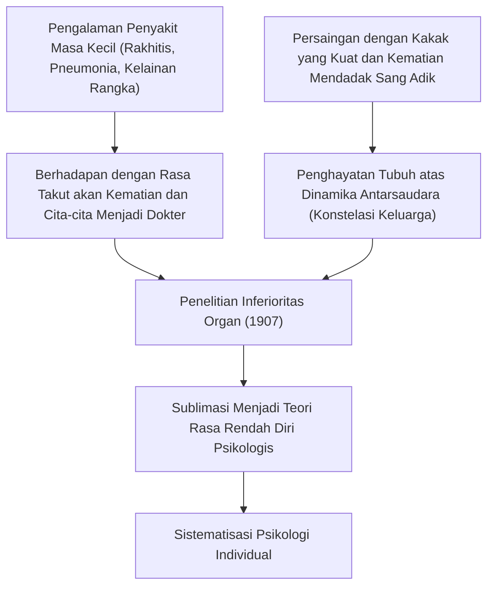
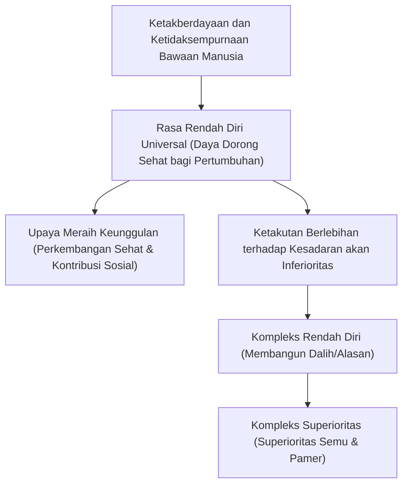
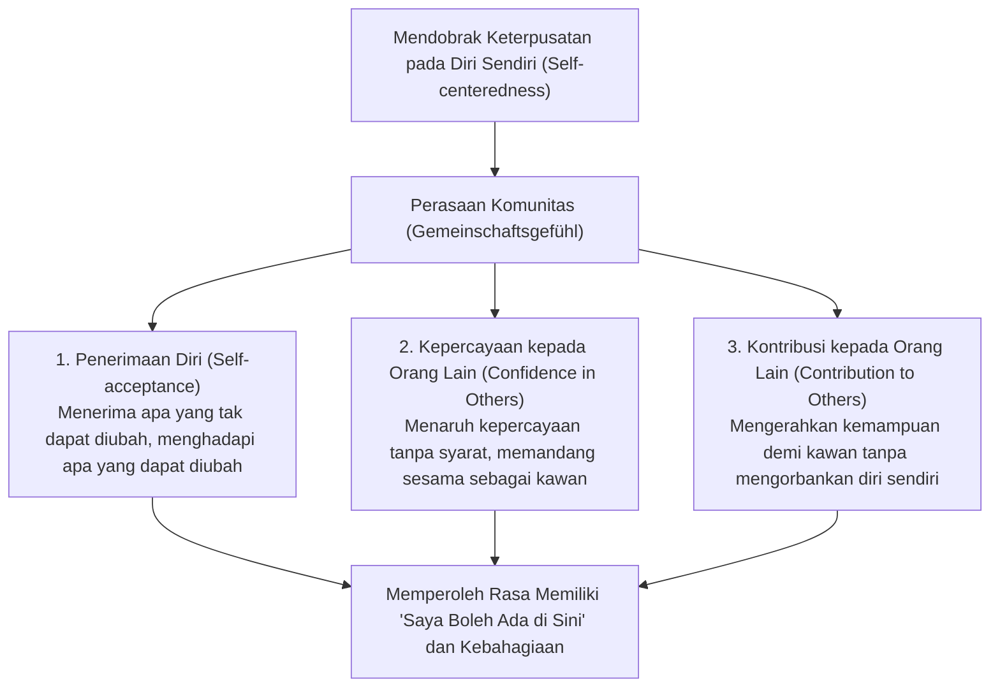
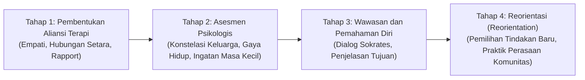

## Pendahuluan: Mengapa Alfred Adler Relevan Hari Ini?

Di tengah arus kebangkitan psikologi kedalaman (depth psychology) di Wina pada awal abad ke-20, "Psikologi Individual (Individual Psychology / Jerman: *Individualpsychologie*)" yang didirikan oleh Alfred Adler (1870–1937) hingga hari ini terus memancarkan kepraktisan yang tangguh dan kebaruan pemikiran yang tiada tara.

Ketika Sigmund Freud membangun doktrin "Determinisme Psikis (Psychic Determinism)" yang bertumpu pada dorongan naluriah bawah sadar (libido) serta trauma masa lalu, dan Carl Gustav Jung menyelami relung-relung mitologis arketipe dan ketaksadaran kolektif, cakrawala yang dirintis Adler justru sangat jernih dan secara konsisten diarahkan ke "realitas sosial konkret dan masa depan tempat manusia menjalani kehidupannya".

Landasan pandangan Adler tentang manusia bertumpu pada satu keyakinan mendalam: "Manusia bukanlah makhluk pasif yang dikendalikan secara mekanistis oleh peristiwa masa lalu, melainkan entitas terintegrasi yang hidup secara otonom, proaktif, dan kreatif menuju tujuan-tujuan yang ia tetapkan sendiri." Kata *Individual* dalam nama mazhab yang disematkannya, *Individual Psychology*, berakar dari bahasa Latin *individuus* (sesuatu yang tidak dapat dibagi, entitas yang tak terpisahkan). Dengan kata lain, ini adalah pemikiran yang secara tegas menolak reduksionisme elemen yang mencacah jiwa ke dalam kutub-kutub yang saling bertentangan—seperti "sadar dan bawah sadar", "rasio dan emosi", atau "id, ego, dan superego"—dan sebaliknya memandang manusia sebagai satu kesatuan sistem kehidupan utuh yang terorganisasi secara menyeluruh (holisme / totalitas organis).

```
【Perbandingan Paradigma Tiga Aliran Utama Psikologi Kedalaman】

┌─────────────────┬───────────────────────────────┬───────────────────────────────┬───────────────────────────────┐
│ Aliran / Pendiri│ Sigmund Freud                 │ Carl Gustav Jung              │ Alfred Adler                  │
├─────────────────┼───────────────────────────────┼───────────────────────────────┼───────────────────────────────┤
│ Nama Aliran     │ Psikoanalisis (Psychoanalysis)│ Psikologi Analitis            │ Psikologi Individual          │
│                 │                               │ (Analytical Psychology)       │ (Individual Psychology)       │
│ Pandangan ttg   │ Mekanistis & Deterministis    │ Teleologis & Berorientasi     │ Subjektif & Holistis          │
│ Manusia         │ (Trauma masa lalu)            │ Arketipe (Mitos & Spiritual)  │ (Teleologis / Bertujuan)      │
│ Struktur Jiwa   │ Sadar / Pra-sadar / Bawah     │ Ketaksadaran Personal /       │ Kesatuan utuh yang tak dapat  │
│                 │ sadar (Terbagi-bagi)          │ Ketaksadaran Kolektif         │ dibagi (Holisme)              │
│ Motivasi Dasar  │ Libido (Dorongan seksual &    │ Totalitas Kejiwaan (Aktuali-  │ Upaya meraih keunggulan &     │
│                 │ agresi/kehancuran)            │ sasi diri & Arketipe)         │ Perasaan komunitas            │
│ Terapi &        │ Mengingat kembali represi masa│ Analisis mimpi, integrasi     │ Reorientasi gaya hidup &      │
│ Pendekatan      │ lalu & abreaksi (katarsis)    │ arketipe, individuasi         │ Pemberian semangat            │
└─────────────────┴───────────────────────────────┴───────────────────────────────┴───────────────────────────────┘
```

Psikologi Adler bukan sekadar salah satu aliran psikologi klinis semata. Lebih dari itu, mazhab ini merupakan sebuah filsafat eksistensial praktis sekaligus gagasan pendidikan sosial yang demokratis, yang berupaya menjawab pertanyaan mendasar: "Bagaimana manusia seharusnya mengatasi rasa rendah diri, bekerja sama secara harmonis dengan sesama, serta meraih rasa memiliki (belonging) dan kebahagiaan dalam hidup?"

Berangkat dari pergulatan pemikiran melawan psikoanalisis Freud, risalah ini akan menguraikan secara tuntas dan akademis seluruh struktur teori Adlerian: mulai dari teleologi, rasa rendah diri dan upaya meraih keunggulan, pembentukan gaya hidup, tiga tugas hidup, perasaan komunitas (minat sosial), pemisahan tugas, hingga hubungannya dengan terapi perilaku kognitif (CBT) dan psikologi positif modern.

---

## 1. Riwayat Hidup Adler dan Sejarah Pembentukan Psikologi Individual

### 1.1 Pengalaman Sakit pada Masa Kanak-kanak dan Lanskap Asal "Inferioritas Organ"
Alfred Adler lahir pada 7 Februari 1870 di Penzing, pinggiran kota Wina, ibu kota Kekaisaran Austria-Hungaria, sebagai putra kedua dari sebuah keluarga pedagang biji-bijian keturunan Yahudi.

Untuk memahami psikologi Adler, pengalaman fisik masa kanak-kanaknya yang penuh kepedihan merupakan kunci yang tak terpisahkan. Semasa kecil, Adler menderita penyakit rakhitis yang parah, yang menyebabkan keterlambatan perkembangan tulang sehingga ia belum mampu berjalan dengan baik hingga usia empat tahun. Lebih dari itu, pada usia lima tahun, ia terjangkit pneumonia akut yang nyaris merenggut nyawanya. Dari atas tempat tidurnya, ia mendengar sendiri dokter yang merawatnya berkata lirih kepada sang ayah: "Nyawa anak ini sudah tidak tertolong lagi." Pada saat ia pulih secara ajaib dari kondisi kritis tersebut, Adler menanamkan tekad dan tujuan yang teguh (sebuah fiksi penuntun) di dalam lubuk hatinya: "Aku akan menaklukkan penyakit ini dan menjadi seorang dokter yang berani melawan teror kematian."

Selain itu, persaingan sengit dan rasa rendah dirinya terhadap sang kakak tertua, Sigmund, yang memiliki tubuh bugar dan ketangkasan fisik yang prima, serta trauma menyaksikan kematian mendadak adik bungsunya di ranjang sebelah saat masih bayi, menghadapkannya pada kenyataan pahit tentang kematian, penyakit, kerentanan fisik, dan perbandingan antarsaudara kandung. Semua pengalaman penderitaan nyata ini kelak menjadi cetak biru bagi konsep-konsep sentral yang ia rumuskan, seperti "Inferioritas Organ (Organ Inferiority)", "Rasa Rendah Diri (Inferiority Feeling)", serta teori "Konstelasi Keluarga (Family Constellation)".



### 1.2 Perkumpulan Psikologi Hari Rabu Wina dan Perpisahan dengan Freud (1902–1911)
Setelah menamatkan studi kedokteran di Universitas Wina, Adler mengawali kariernya sebagai dokter spesialis mata (oftalmologis), sebelum akhirnya beralih ke praktik kedokteran umum dan kemudian menjadi psikiater. Ketika merawat banyak pasien dari kalangan seniman sirkus di Prater Amusement Park, perajin, serta kaum buruh kelas pekerja, perhatiannya terpikat secara mendalam oleh suatu fenomena: manusia yang memiliki kelemahan bawaan ataupun yang didapat pada organ tubuh tertentu (inferioritas organ), justru mengembangkan fungsi organ lain atau kapasitas mentalnya hingga tingkat luar biasa demi mengompensasi kekurangan tersebut (Kompensasi Berlebih / Overcompensation).

Pada tahun 1902, setelah menulis resensi surat kabar yang membela buku Freud, *The Interpretation of Dreams*, Adler diundang oleh Freud untuk bergabung dalam kelompok diskusi mingguan kecil yang diadakan setiap Rabu malam di kediaman Freud ("Perkumpulan Psikologi Hari Rabu", yang kelak menjelma menjadi Perhimpunan Psikoanalisis Wina), di mana Adler menjadi salah satu anggota pendirinya. Pada tahun 1910, Adler bahkan diangkat menjadi ketua Perhimpunan Psikoanalisis Wina dan dipandang luas sebagai salah satu penerus paling menjanjikan dari takhta intelektual Freud.

Akan tetapi, masa-masa keemasan relasi keduanya tidak berlangsung lama. Freud bersikeras mempertahankan panseksualisme (doktrin serba-seksual), yang mereduksi semua etiologi neurosis pada "dorongan seksual masa kanak-kanak (represi dan fiksasi libido)". Sebaliknya, Adler berargumen secara tegas bahwa dasar penggerak perilaku manusia bukanlah insting seksual, melainkan "kehendak menuju keunggulan demi mengatasi kelemahan dan ketakberdayaan diri", "agresivitas", serta "hasrat penegasan diri".

Keretakan yang tak terelakkan meledak pada tahun 1911. Dalam serangkaian ceramah di hadapan pertemuan rutin Perhimpunan Psikoanalisis Wina, Adler melancarkan kritik tajam terhadap teori seksualitas Freud dan memaparkan teorinya sendiri mengenai "Protes Maskulin (Masculine Protest)". Freud bereaksi keras dan mengecam ajaran Adler sebagai "bidah berbahaya yang menyangkal jantung psikoanalisis", serta menolak kompromi apa pun. Menghadapi jalan buntu ini, Adler mengundurkan diri dari jabatan ketua perhimpunan dan redaktur jurnal perhimpunan, lalu keluar bersama sembilan anggota koleganya yang sejalan. Pada tahun 1912, kelompok Adler awalnya menamai mazhab mereka "Perhimpunan untuk Psikoanalisis Bebas", yang tidak lama kemudian diubah menjadi "Perhimpunan Psikologi Individual (Society for Individual Psychology)". Di titik inilah, "Psikologi Individual", yang sepenuhnya memisahkan diri dari psikoanalisis Freudian, resmi lahir ke panggung dunia intelektual.

---

## 2. Teleologi vs Kausalitas: Pergeseran Paradigma Psikologi

### 2.1 Keterbatasan Kausalitas Mekanistis dan Penolakan terhadap Trauma
Pembalikan paling radikal yang membentuk tulang punggung teoretis psikologi Adlerian adalah kritik total terhadap "Kausalitas (Causality / Teori Sebab-Akibat)" dan pengenalan "Teleologi (Teleology / Teori Tujuan)".

Psikiatri klasik dan sains modern yang dipelopori oleh pemikiran Newtonian menerapkan hukum kausalitas sebab-akibat secara kaku pada ranah kejiwaan manusia. Skemanya berbunyi: "Peristiwa masa lalu (A) menyebabkan kondisi saat ini (B)." Sebagai contoh: "Karena disiksa dan tidak mendapatkan kasih sayang orang tua di masa kecil (A), maka saat ini ia menderita fobia sosial dan tidak mampu beradaptasi dalam masyarakat (B)."

Sebaliknya, Adler menolak mentah-mentah pandangan kausalitas mekanistis semacam ini. Menurut Adler, peristiwa masa lalu itu sendiri tidak pernah menentukan diri manusia secara niscaya. Jika trauma masa lalu secara mutlak mendikte manusia, maka setiap anak yang dibesarkan di bawah kondisi lingkungan yang keras niscaya harus mengalami neurosis yang persis sama tanpa kecuali, sehingga tidak akan ada ruang tersisa bagi kehendak bebas manusia ataupun pemulihan. Adler menegaskan hal ini dengan lugas:

> "Tidak ada pengalaman apa pun yang dengan sendirinya menjadi penyebab keberhasilan atau kegagalan kita. Kita tidak menderita akibat kejutan dari pengalaman kita—apa yang disebut trauma—melainkan kita mengambil apa pun dari pengalaman tersebut yang sesuai dengan tujuan-tujuan kita, dan memberikan makna kepadanya."
> (*What Life Could Mean to You*, 1931)

```
【Perbandingan Epistemologis Kausalitas dan Teleologi】

■ Kausalitas (Kausalitas Freudian / Determinisme)
Fakta Masa Lalu (Kekerasan orang tua, patah hati, kegagalan)
  -- "Hubungan kausal tak terelakkan (Determinasi faktor luar)" -->
Hasil Saat Ini (Kecemasan sosial, penarikan diri / hikikomori, kelesuan)
※ Manusia dipandang sebagai boneka masa lalu; karena masa lalu tidak dapat diubah, pandangan ini berujung pada fatalisme tanpa harapan.

■ Teleologi (Teori Tindakan Adlerian / Teori Subjek)
Tujuan Tersembunyi Saat Ini (Ingin menghindari konflik dengan orang lain, tak ingin terluka)
  -- "Pemilihan sarana untuk mencapai tujuan (Kreasi faktor dalam)" -->
Penciptaan Gejala & Emosi Saat Ini (Menciptakan sendiri kecemasan, amarah, dan ketakutan)
※ Fakta masa lalu hanyalah materi belaka. Manusia memanfaatkan ingatan masa lalu demi "tujuan saat ini".
```

### 2.2 Struktur Teleologi (Teleology) dan "Penggunaan" Emosi
Dalam teleologi Adler, seluruh perilaku manusia, emosi, dan bahkan gejala-gejala kejiwaan (seperti kecemasan, depresi, kepanikan, dan obsesif-kompulsif) dipahami sebagai "sarana atau instrumen" untuk mencapai "Tujuan Tersembunyi (Hidden Goal)" yang dianut individu tersebut, sering kali tanpa disadarinya secara penuh.

Sebagai contoh, bayangkan seorang pasien gangguan kecemasan sosial (social anxiety disorder) yang mengeluh: "Tiap kali harus tampil di hadapan orang banyak, tangan dan kaki saya gemetar, wajah saya memerah, dan saya tidak bisa berkata-kata."
- **Penjelasan Kausalitas**: "Trauma masa lalu karena pernah dipermalukan di depan umum telah mengaktifkan pengondisian rasa takut bawah sadar secara otomatis."
- **Penjelasan Teleologis**: "Pasien tersebut memegang tujuan batin: 'Saya tidak mau dipermalukan di depan orang banyak' atau 'Saya tidak sanggup menanggung kenyataan jika ketidakmampuan saya terbongkar akibat melakukan kesalahan'. Demi mewujudkan tujuan tersebut, ia secara mandiri memproduksi gejala somatik berupa 'muka memerah' dan 'tubuh gemetar', sehingga ia memperoleh dalih atau alibi yang sah bahwa: 'Saya tidak bisa tampil di depan umum semata-mata karena saya sedang sakit'."

Poin penting di sini adalah sudut pandang bahwa emosi (amarah, kecemasan, kesedihan) bukanlah sesuatu yang datang secara pasif dan "menyerang" diri kita dari luar, melainkan "perangkat yang dibuat dan digunakan secara sengaja oleh manusia demi memenuhi tujuan-tujuannya".

Adler mengemukakan analogi terkenal yang disebut "Teori Instrumen Kemarahan". Bayangkan seorang ibu sedang memarahi dan membentak anaknya dengan wajah merah padam penuh amarah. Tepat pada detik itu, telepon berdering, dan ternyata panggilan tersebut berasal dari wali kelas sang anak. Begitu mengangkat gagang telepon, nada suara sang ibu seketika berubah menjadi sangat ramah, santun, dan tenang. Namun, begitu percakapan selesai dan telepon ditutup, dalam sekejap ia kembali berteriak murka kepada anaknya. Jika kemarahan adalah dorongan fisiologis tak terkendali yang membajak manusia di luar kehendaknya, mustahil seseorang mampu beralih ke percakapan yang tenang hanya dalam hitungan detik. Sang ibu sengaja membangkitkan dan memanfaatkan emosi marah sebagai alat demi mencapai tujuannya: "menundukkan anak secara instan agar mematuhi kehendaknya".

Dalam psikologi Adler, manusia bukanlah budak dari emosinya. Manusia adalah subjek berdaulat yang memilih dan memanfaatkan emosi demi tujuan-tujuan yang hendak dicapainya.

---

## 3. Rasa Rendah Diri, Kompleks Rendah Diri, dan Upaya Meraih Keunggulan

### 3.1 Dari Inferioritas Organ Menuju Rasa Rendah Diri yang Universal
Dalam karya awalnya, *Kajian tentang Inferioritas Organ* (*Studie über Minderwertigkeit von Organen*, 1907), Adler menganalisis ketidaksempurnaan fungsional organ fisik dan mekanisme kompensasi biologis yang dilakukan organisme tubuh. Organisme yang memiliki kelemahan bawaan pada jantung, ginjal, atau indra penglihatan/pendengaran berupaya mengatasi cacat tersebut melalui upaya kompensasi sistem saraf pusat.

Adler kemudian memperluas wawasan fisiologis dan patologis ini secara revolusioner ke ranah psikologis. Sebagai makhluk hidup, manusia terlahir ke dunia dalam kondisi yang jauh lebih lemah dan rapuh dibandingkan hewan lainnya. Manusia tidak memiliki taring tajam, cakar mematikan, ataupun bulu tebal untuk bertahan dari dingin, dan tidak akan sanggup bertahan hidup barang sehari pun tanpa perlindungan orang dewasa. Oleh karena itu, pada masa kanak-kanak, setiap manusia niscaya dikelilingi oleh orang-orang dewasa yang memiliki kekuatan luar biasa, sehingga tak terelakkan ia menyadari kelemahan, ketakberdayaan, dan ketidaksempurnaan dirinya sendiri.

Ketegangan psikologis yang timbul dari dorongan untuk melepaskan diri dari ketakberdayaan ini dinamai oleh Adler sebagai "Rasa Rendah Diri (Minderwertigkeitsgefühl / Inferiority Feeling)". Poin yang sangat menentukan adalah bahwa bagi Adler, **rasa rendah diri itu sendiri bukanlah sebuah patologi, melainkan mesin pendorong yang sepenuhnya sehat dan universal bagi evolusi serta pertumbuhan manusia (Engine of Growth)**.



### 3.2 Pembedaan Konseptual yang Ketat antara Rasa Rendah Diri vs Kompleks Rendah Diri
Dalam percakapan sehari-hari, kata "kompleks" sering kali disamakan secara keliru dengan rasa rendah diri biasa. Namun, dalam psikologi Adler, "Rasa Rendah Diri" dan "Kompleks Rendah Diri (Inferiority Complex)" dibedakan secara tegas dan fundamental:

1. **Rasa Rendah Diri (Inferiority Feeling)**:
   Sensasi ketidaksempurnaan subjektif yang lahir dari kesadaran akan adanya jarak (kesenjangan) antara kondisi diri saat ini dan kondisi ideal yang dicita-citakan. Perasaan ini berfungsi sebagai motivasi sehat untuk mengatasi tantangan hidup melalui usaha nyata dan ketekunan, seperti berujar: "Pengetahuanku masih kurang, maka aku harus belajar lebih giat," atau "Keterampilanku belum matang, maka aku perlu berlatih lebih keras."

2. **Kompleks Rendah Diri (Inferiority Complex)**:
   Kondisi psikologis patologis di mana seseorang menggunakan rasa rendah dirinya sebagai alasan atau dalih untuk melarikan diri dari tugas-tugas kehidupan. Hal ini diwujudkan dengan membangun kausalitas semu: "Karena kondisi A, maka saya tidak bisa melakukan B." Contohnya: "Karena saya tidak punya latar belakang pendidikan tinggi, saya tidak bisa sukses," "Karena penampilan fisik saya tidak menarik, saya tidak bisa menikah," atau "Karena orang tua saya salah mendidik saya, saya tidak bisa berbaur di masyarakat."
   Orang yang terperosok ke dalam kompleks rendah diri telah melepaskan tanggung jawab untuk menyelesaikan masalah lewat usahanya sendiri; ia menjadikan rasa rendah dirinya sebagai perisai untuk melindungi harga diri dari realitas yang tidak menyenangkan, lalu memilih berhenti melangkah.

### 3.3 Kompleks Superioritas dan Patologi Kehendak untuk Berkuasa
Ketika seseorang yang menderita kompleks rendah diri tidak lagi sanggup menanggung penderitaan batin akibat menatap inferioritas dirinya secara jujur, kerap kali muncul reaksi pembalikan yang disebut "Kompleks Superioritas (Superiority Complex)".

Kompleks superioritas adalah mekanisme pertahanan diri di mana seseorang, alih-alih berusaha secara nyata mengatasi kesulitan, justru melarikan diri ke dalam "superioritas palsu dengan berpura-pura seolah-olah dirinya lebih hebat dari orang lain". Secara konkret, ini termanifestasi dalam bentuk:

- **Memamerkan Otoritas / Menempel Nama Besar (Basking in Reflected Glory)**: Membual tentang kedekatan pribadi dengan tokoh terkenal atau penguasa, serta mempersenjatai diri dengan barang-barang bermerek mahal, gelar, atau atribut sosial demi menutupi kekosongan batin.
- **Kecanduan Membual dan Terpaku pada Kejayaan Masa Lalu**: Terus-menerus menceritakan kisah kepahlawanan masa lampau demi menyembunyikan kenyataan bahwa dirinya saat ini pasif dan tidak menghasilkan apa-apa.
- **"Pamer Kemalangan" dan Manipulasi Menggunakan Status Korban**: Berkeluh kesah tanpa henti mengenai betapa malangnya nasib yang dialaminya, betapa terluka dan menderitanya dirinya, demi memancing simpati, memanipulasi rasa bersalah orang lain, dan menuntut perlakuan istimewa. Adler menyebut ini sebagai "privilese kelemahan" (hak istimewa orang lemah), dan memandangnya sebagai salah satu bentuk kompleks superioritas yang paling sulit diobati.

### 3.4 Arah Sehat dari Upaya Meraih Keunggulan (Striving for Superiority)
Motivasi mendasar manusia untuk mengatasi rasa rendah diri pada awalnya disebut Adler sebagai "dorongan agresi", "kehendak untuk berkuasa", atau "protes maskulin". Namun pada fase akhir pemikirannya, konsep ini disublimasikan menjadi konsep yang jauh lebih komprehensif, yaitu "Upaya Meraih Keunggulan (Striving for Superiority / Perjuangan Menuju Perbaikan Diri)".

Upaya meraih keunggulan yang sehat sama sekali **bukan** berarti "memenangkan persaingan dengan orang lain, mengalahkan, ataupun mendominasi sesama". Hal tersebut pada hakikatnya adalah **"tidak membandingkan diri dengan orang lain, melainkan membandingkan diri dengan kondisi ideal diri sendiri, seraya melangkah selangkah demi selangkah melampaui keterbatasan diri saat ini"**. Ini adalah proses pengembangan diri di atas bidang horizontal di mana semua manusia berdiri setara. Manakala upaya meraih keunggulan diarahkan pada "hierarki vertikal (hubungan atas-bawah, dominasi dan ketundukan)", ia akan menjadi sarang lahirnya neurosis; namun jika diarahkan pada "kerja sama horizontal (kontribusi terhadap komunitas)", ia akan menjelma menjadi aktualisasi diri yang sehat dan kreatif.

---

## 4. Holisme dan Gaya Hidup: Arsitektur Kognitif Individu

### 4.1 Holisme (Holism): Manusia sebagai Kesatuan yang Tak Terpisahkan
Aksioma pertama dari psikologi Adlerian adalah "Holisme (Holism / Totalitas Organis)". Sejak René Descartes, bapak rasionalisme modern, mencetuskan pemikirannya, filsafat Barat telah dicengkeram oleh "dualisme jiwa-raga (mind-body dualism)" yang membelah pikiran dan jasmani menjadi dua substansi terpisah. Dalam psikiatri pun, Freud memecah jiwa ke dalam elemen-elemen yang saling berkonfrontasi: "sadar / bawah sadar" serta "ego / id / superego", dan memodelkan konflik batin manusia (konflik intrapsikis) berdasarkan pertarungan antarkomponen tersebut.

Adler menolak sepenuhnya reduksionisme elemen semacam itu. Bagi Adler, manusia adalah satu kesatuan utuh yang tidak dapat dibagi (*Individual* = *in-* [tidak] + *dividual* [dapat dibagi]).
- "Rasio" dan "emosi" bukanlah dua hal yang saling bertentangan. Emosi sengaja diciptakan untuk mencapai tujuan yang diarahkan oleh rasio, dan berfungsi secara terpadu bersama rasio.
- "Sadar" dan "bawah sadar" bukanlah musuh yang saling bertarung. Keduanya adalah dua sisi dari keping mata uang yang sama, yang bergerak secara terkoordinasi menuju satu tujuan tunggal yang sama. Alam bawah sadar hanyalah ranah tujuan yang "belum diverbalisasikan atau belum disadari sepenuhnya oleh individu yang bersangkutan".
- "Jiwa" dan "tubuh jasmani" bukanlah entitas yang berdiri sendiri-sendiri. Detak jantung yang berdegup kencang dan lambung yang terasa nyeri saat mengalami kecemasan hebat adalah bukti nyata bahwa jiwa dan raga merespons krisis sebagai satu kesatuan utuh.

Psikologi Adlerian tidak pernah menerima pembenaran dualistis seperti: "Sebenarnya kepalaku mengerti, tetapi emosiku tak terkendali," atau "Keinginan bawah sadarku memaksaku bertindak berlawanan dengan akal sehatku." Psikologi ini mengembalikan seluruh tanggung jawab kepada manusia yang utuh (Whole Person) sebagai subjek pelaku: "Akulah yang, demi tujuan tersebut, menggunakan emosi amarah untuk membentak."

```
【Perbedaan Struktural antara Reduksionisme Elemen (Freud) dan Holisme (Adler)】

■ Reduksionisme Elemen (Model Fragmentasi Psikis)
┌─────────────────────────────────────────┐
│ Superego (Moral & Norma)                │
├─────────────────────────────────────────┤  ← Konflik batin / Perpecahan internal
│ Ego (Rasionalitas adaptasi realitas)    │
├─────────────────────────────────────────┤  ← Represi dan resistensi
│ Id (Hasrat naluriah bawah sadar)        │
└─────────────────────────────────────────┘
※ Memunculkan penipuan diri seperti: "Akal budi kalah oleh naluri" atau "Alam bawah sadar yang mengendalikanku".

■ Holisme (Model Integrasi yang Tak Terbagi)
┌──────────────────────────────────────────────────────────────────────────────┐
│                    Manusia Utuh (Diri yang Tak Terbagi)                      │
│                                                                              │
│  Kesatuan Teleologis:                                                        │
│  Rasio, emosi, kesadaran, ketaksadaran, dan tubuh jasmani semuanya bekerja   │
│  secara terkoordinasi untuk mencapai                                         │
│  "Satu Tujuan Tersembunyi Tunggal (Gaya Hidup)"                              │
└──────────────────────────────────────────────────────────────────────────────┘
※ Tanggung jawab akhir atas semua tindakan dan emosi berada pada "Saya" yang terintegrasi.
```

### 4.2 Definisi Gaya Hidup (Lifestyle) dan Tiga Elemennya
Dalam psikologi Adlerian, konsep sentral yang mencakup keseluruhan karakter, kepribadian, pandangan dunia, dan pola kognitif seseorang disebut sebagai "Gaya Hidup (Lifestyle / Jerman: *Lebensstil*)". Konsep ini merupakan pelopor langsung bagi konsep "Skema (Schema)" atau kerangka kognitif dalam terapi kognitif modern.

Gaya hidup adalah "pola pemberian makna yang baku terhadap diri sendiri dan dunia" yang dipilih dan dibangun sendiri oleh individu pada masa kanak-kanak (kira-kira hingga usia 4–6 tahun) demi bertahan hidup di tengah kondisi fisik, lingkungan keluarga, dan konteks budayanya. Sekali gaya hidup terbentuk, ia akan berfungsi di luar kesadaran sebagai kompas penuntun yang menyaring seluruh persepsi, pemikiran, emosi, dan tindakan individu di masa dewasa.

Dalam psikologi Adlerian, gaya hidup dibangun dari tiga elemen konstitutif berikut:

1. **Konsep Diri (Self-concept)**:
   Keyakinan atau asumsi mendasar tentang diri sendiri: "Saya adalah..." ("Saya lemah", "Saya cerdas", "Saya orang yang tidak layak dicintai").
2. **Ideal Diri (Self-ideal)**:
   Standar subjektif mengenai bagaimana diri seharusnya bersikap: "Saya harus...", "Saya wajib..." ("Saya harus selalu menjadi nomor satu", "Saya harus diperlakukan dengan ramah oleh semua orang", "Saya sama sekali tidak boleh gagal").
3. **Pandangan Dunia (Weltbild / Picture of the World)**:
   Keyakinan mendasar tentang lingkungan, masyarakat, dan sesama: "Orang lain dan dunia adalah..." ("Dunia ini penuh bahaya", "Orang lain adalah musuh yang selalu ingin memanfaatkanku", "Hidup itu tidak terduga dan tidak adil").

Jika konsep diri seseorang berbunyi "Saya tidak berdaya", ideal dirinya berbunyi "Saya tidak boleh terluka", dan pandangan dunianya berbunyi "Orang-orang di sekitar saya agresif dan kejam", maka dalam setiap hubungan antarpribadi ia akan bersikap defensif secara berlebihan, menafsirkan ucapan sepele orang lain sebagai permusuhan, serta memilih penarikan diri dan perilaku menghindar. Tindakan ini bukanlah kerusakan mental patologis, melainkan perilaku yang sepenuhnya logis, konsisten, dan masuk akal jika ditinjau dari kacamata gaya hidup yang dimilikinya.

### 4.3 Signifikansi Diagnostik Ingatan Masa Kecil (Early Recollections)
Sebagai teknik klinis yang ampuh untuk menyingkap gaya hidup tak sadar seseorang secara objektif, Adler merumuskan analisis "Ingatan Masa Kecil (Early Recollections)".

Ingatan masa kecil adalah metode di mana klien diminta mengingat peristiwa paling awal yang masih terekam dalam ingatannya (biasanya episode konkret sebelum usia 6 hingga 8 tahun), lalu menceritakan secara mendetail pemandangan peristiwa tersebut, siapa saja yang hadir, tindakan yang dilakukannya, serta emosi spesifik yang ia rasakan pada saat kejadian berlangsung.

Freud memperlakukan ingatan masa kecil sebagai "jejak fakta masa lalu" atau "fosil dari trauma yang direpresi". Sebaliknya, Adler yang berpijak pada teleologi memandang ingatan sebagai "karya narasi ciptaan (cerita) yang sengaja dipilih dan direkonstruksi sendiri dari sekian banyak peristiwa masa lalu demi melegitimasi dan memperkuat gaya hidup saat ini". Manusia tidak mengingat masa lalu sebagaimana adanya secara objektif. Manusia hanya menyimpan dan mewarnai ingatan-ingatan yang sesuai dengan tujuannya saat ini.

```
【Paradigma Analisis Ingatan Masa Kecil】

- Isi Ingatan: "Saat berusia 5 tahun, saya jatuh dari pohon di halaman dan melukai kaki saya. Ibu segera berlari dan memeluk saya erat."
  ↓
- Sudut Pandang Analisis:
  1. Apakah aktif atau pasif? (Apakah bergerak atas inisiatif sendiri, atau menunggu sesuatu terjadi?)
  2. Apa peran orang lain? (Apakah musuh yang membiarkan bahaya, atau pelindung yang datang menyelamatkan?)
  3. Bagaimana persepsi tentang diri? (Sosok yang rapuh dan mudah terluka)
  ↓
- Keyakinan Gaya Hidup yang Diekstraksi:
  "Dunia ini penuh dengan bahaya. Saya adalah makhluk rapuh yang akan terluka jika lengah.
   Namun, jika saya menunjukkan kelemahan dan meminta tolong, orang lain akan melindungi saya dengan penuh kasih sayang."
  ↓
- Kesesuaian dengan Pola Perilaku Saat Ini:
  Ketika menghadapi kesulitan, alih-alih menyelesaikannya sendiri, ia memamerkan penyakit atau kelemahannya untuk menarik bantuan dan perhatian orang lain.
```

Adler menegaskan dengan tajam: "Apakah ingatan masa kecil itu benar-benar fakta historis yang objektif, ataukah sekadar ilusi dan salah tafsir subjektif dari yang bersangkutan, sama sekali tidak menjadi soal." Yang terpenting adalah: **"Mengapa di antara ribuan peristiwa masa kecil yang pernah dialaminya, individu tersebut secara khusus terus mengingat peristiwa itu hingga hari ini?"** Di dalam ingatan masa kecil tersebut, terkandung "cetak biru" yang memadatkan bagaimana orang itu memandang dunianya saat ini dan strategi apa yang ia gunakan untuk bertahan hidup.

---

## 5. Tiga Tugas Hidup dan Perasaan Komunitas

### 5.1 Tiga Tugas Hidup (Life Tasks)
Adler memformulasikan tantangan hubungan antarpribadi yang tidak dapat dihindari oleh manusia dalam kehidupan bermasyarakat sebagai "Tugas Hidup (Life Tasks / Jerman: *Lebensaufgaben*)". Adler membaginya ke dalam tiga hierarki: "Tugas Pekerjaan", "Tugas Pertemanan", dan "Tugas Cinta".

```
【Hierarki dan Tingkat Kesulitan Tiga Tugas Hidup】

［Tugas Cinta (Love Task)］
- Sasaran: Hubungan yang sangat intim dengan pasangan hidup, suami/istri, dan keluarga inti
- Tuntutan: Jarak psikologis paling dekat, keterbukaan diri mendalam, berbagi nasib, menjaga kesetaraan
- Dalih Penghindaran: Takut terkekang, perselingkuhan, pelecehan moral/psikologis, perfeksionisme

［Tugas Pertemanan (Friendship Task)］
- Sasaran: Sahabat, tetangga, komunitas lokal, hubungan rekan setara yang melampaui kepentingan materi
- Tuntutan: Hubungan saling percaya secara horizontal tanpa kompetisi, altruisme, pengakuan timbal balik
- Dalih Penghindaran: "Takut dikhianati", "Tidak ada seorang pun yang memahamiku"

［Tugas Pekerjaan (Work Task)］
- Sasaran: Kegiatan profesi, produksi ekonomi, jaringan pembagian kerja sosial
- Tuntutan: Kepatuhan pada aturan, kerja sama dasar, komitmen terhadap hasil
- Dalih Penghindaran: Takut gagal, cemas akan penilaian orang, menunda-nunda pekerjaan, fobia sosial
```

1. **Tugas Pekerjaan (Work Task)**:
   Tugas untuk berpartisipasi dalam jaringan pembagian kerja sosial dan menghasilkan nilai yang bermanfaat bagi orang lain agar manusia dapat bertahan hidup secara biologis. Dari ketiga tugas yang ada, tugas ini memiliki hubungan kepentingan yang paling jelas dan perilakunya diatur oleh kontrak serta aturan sosial, sehingga dianggap memiliki tingkat kesulitan relasional paling rendah. Namun demikian, melarikan diri dari tugas ini akan mengakibatkan kebangkrutan ekonomi dan disfungsi sosial.

2. **Tugas Pertemanan (Friendship Task)**:
   Tugas untuk membangun hubungan pertemanan dan persahabatan murni di luar kepentingan ekonomi langsung seperti dalam pekerjaan. Tugas ini menuntut relasi saling percaya sebagai sesama manusia yang setara tanpa adanya kompetisi, serta kerelaan untuk saling membuka kelemahan diri. Banyak orang gagal di sini karena menutup pergaulannya akibat rasa curiga: "Jangan-jangan orang lain akan mengkhianatiku."

3. **Tugas Cinta (Love Task)**:
   Tugas untuk menjalin relasi satu lawan satu yang paling intim dan berkelanjutan dalam kehidupan, seperti hubungan percintaan, ikatan pernikahan, dan relasi orang tua-anak. Karena jarak psikologisnya mendekati titik nol, kelemahan dan cacat diri yang paling ingin disembunyikan niscaya akan terpapar secara telanjang. Tugas ini menuntut kedua belah pihak untuk memperjuangkan "kebahagiaan berdua" sebagai mitra yang sepenuhnya setara, tanpa saling mendominasi atau menuntut pengakuan berlebihan. Oleh karena itu, tugas ini merupakan yang paling menantang dan berbobot paling berat di antara ketiga tugas kehidupan.

Menurut Adler, seluruh permasalahan psikologis (neurosis, penarikan diri sosial, delikuensi, depresi) berakar dari ketakutan akan kegagalan dan kekhawatiran harga diri terluka saat berhadapan dengan tugas-tugas hidup ini, yang mendorong individu untuk melarikan diri melalui apa yang disebut "Kebohongan Hidup (Life Lie)".

### 5.2 Gambaran Utuh Perasaan Komunitas (Gemeinschaftsgefühl / Social Interest)
Puncak filosofis dan konsep paling luhur dalam psikologi Adler adalah "Perasaan Komunitas (Gemeinschaftsgefühl / Social Interest)". Secara harfiah diterjemahkan sebagai perasaan atau kesadaran kebersamaan komunitas, dan di dunia berbahasa Inggris kerap diistilahkan sebagai "Social Interest (Minat Sosial)".

Perasaan komunitas adalah **"peralihan dari keterpusatan pada diri sendiri (Self-centeredness) menuju kepedulian yang tulus kepada orang lain (Social Interest)"**, sebuah kondisi batin di mana seseorang memandang sesamanya bukan sebagai "musuh", melainkan sebagai "kawan", serta merasakan rasa memiliki (sense of belonging) dan ketenteraman batin: "Saya memiliki tempat bernaung di dalam komunitas ini."

Adler menegaskan tanpa ragu bahwa satu-satunya tolok ukur mutlak bagi kesehatan mental adalah tingginya perasaan komunitas. Manusia yang miskin perasaan komunitas akan memandang dunia sebagai medan perang hukum rimba di mana yang kuat memangsa yang lemah, dan hanya mampu memandang sesama sebagai musuh yang mengancam atau alat yang layak dimanfaatkan. Akibatnya, ia terus-menerus didera rasa kesepian dan kecemasan, lalu terjerumus ke dalam konflik neurotis demi mengejar superioritas palsu.



### 5.3 Tiga Pilar Pembentuk Perasaan Komunitas
Untuk membumikan perasaan komunitas ke dalam tataran praktis dan klinis, psikologi Adlerian modern merumuskannya ke dalam tiga pilar operasional yang saling berkaitan erat:

1. **Penerimaan Diri (Self-acceptance)**:
   Berbeda secara mendasar dari "penegasan diri (pikiran positif / afirmasi diri palsu)". Penegasan diri adalah penipuan diri yang berkata "Aku pasti bisa" pada hal-hal yang sebenarnya tidak mampu dilakukan. Sebaliknya, penerimaan diri adalah "keberanian untuk menerima diri yang belum mampu dan tidak sempurna apa adanya, seraya mengerahkan segenap daya demi mengubah apa yang masih dapat diubah". Ini berpadu secara utuh dengan Doa Ketenangan (Serenity Prayer) dari Reinhold Niebuhr: *"Tuhan, berikanlah aku ketenangan untuk menerima hal-hal yang tidak dapat kuubah, keberanian untuk mengubah hal-hal yang dapat kuubah, dan kebijaksanaan untuk membedakan keduanya."*

2. **Kepercayaan kepada Orang Lain (Confidence in Others)**:
   Berbeda secara mendasar dari "kredit / keyakinan bersyarat (Credit)". Kredit adalah mempercayai pihak lain dengan menyertakan agunan, bukti pencapaian, atau syarat tertentu (seperti pinjaman perbankan). Sebaliknya, kepercayaan kepada orang lain adalah menaruh kepercayaan kepada sesama secara tanpa syarat, tanpa jaminan atau agunan apa pun. Tentu saja terdapat risiko pengkhianatan. Namun, apakah orang lain mengkhianati atau tidak adalah "tugas pihak lain", sedangkan apakah diri kita menaruh kepercayaan atau tidak adalah "tugas kita sendiri". Melalui pembagian tugas yang jernih ini, seseorang dapat membebaskan diri dari belenggu sangkar kecurigaan.

3. **Kontribusi kepada Orang Lain (Contribution to Others)**:
   Berbeda secara mendasar dari "pengorbanan diri (Self-sacrifice)". Memeras jiwa raga dan mengorbankan kehidupan pribadi demi melayani orang lain hanyalah bentuk pengabdian neurotis yang didorong oleh dahaga akan pengakuan. Kontribusi kepada sesama yang sejati adalah "secara sukarela mendayagunakan kemampuan diri demi rekan-rekan di dalam komunitas untuk merasakan kebermaknaan dan nilai eksistensi diri sendiri". Adler menegaskan: "Kebahagiaan adalah rasa berkontribusi." Rasa nyata bahwa diri bermanfaat bagi orang lain memberikan keyakinan mendalam bahwa "aku berharga", yang menjadi mata air dari keberanian untuk menjalani hidup.

---

## 6. Pemisahan Tugas dan Psikologi Keberanian

### 6.1 Struktur Logis Pemisahan Tugas (Separation of Tasks)
Pisau bedah paling tajam yang ditawarkan psikologi Adlerian untuk mengurai benang kusut konflik hubungan antarpribadi dari akarnya adalah "Pemisahan Tugas (Separation of Tasks)".

Seluruh gesekan, pertengkaran, dan stres dalam relasi antarpribadi bermula dari satu kesalahan mendasar: "mencampuri tugas orang lain dengan kasar", atau "membiarkan orang lain mencampuri tugas diri sendiri dengan leluasa".

Adler memberikan kriteria yang sangat sederhana namun jernih untuk membedakan milik siapa suatu tugas:
**"Siapakah yang pada akhirnya akan menanggung konsekuensi langsung dari pilihan yang diambil tersebut?"**

```
【Contoh Konkret Pemisahan Tugas: Masalah Belajar Anak】

- Pola Pikir Orang Tua (Pencampuran Tugas):
  "Jika anak tidak belajar, masa depannya akan rusak, jadi saya harus memaksanya belajar bagaimanapun caranya."
  → Orang tua melakukan intervensi otoriter terhadap tugas anak (dominasi & kontrol).
  → Anak memberontak dan mulai menggunakan "mogok belajar" sebagai senjata untuk menyusahkan orang tua.

- Penataan Berdasarkan Pemisahan Tugas:
  1. "Siapa yang pada akhirnya akan menanggung konsekuensi (hasil) dari belajar atau tidak belajar, seperti nilai merosot dan tidak lolos ke sekolah impian?"
     → Yang menanggung akibat akhirnya adalah 【Anak itu sendiri】 (Tugas sang anak).
  2. Apa yang dapat dilakukan orang tua?
     → Bukan memerintahkan "Belajarlah!", melainkan menyiapkan lingkungan yang siap memberikan bantuan kapan pun anak ingin belajar,
        serta menyampaikan sikap tulus: "Ayah/Ibu percaya pada kemampuanmu dan selalu mendampingimu" (Kesiapan bantuan dan pengawasan suportif).
```

Pemisahan tugas sama sekali bukan berarti bersikap dingin, acuh tak acuh, atau menelantarkan orang lain (neglect). Penelantaran adalah kondisi di mana orang tua sama sekali tidak tahu dan tidak peduli terhadap apa yang dilakukan anak. Pendekatan bantuan Adlerian terangkum secara indah dalam peribahasa kuno: "Kita bisa menuntun seekor kuda ke tepi mata air, tetapi kita tidak bisa memaksanya untuk minum." Memutuskan apakah akan meminum air atau tidak adalah hak prerogatif sang kuda (individu itu sendiri); memaksa membuka mulutnya dan menuangkan air ke tenggorokannya adalah bentuk agresi dan dominasi belaka.

### 6.2 Penolakan terhadap Hasrat Pengakuan dan Definisi "Kebebasan"
Sebagai konsekuensi logis dari penerapan pemisahan tugas secara radikal, psikologi Adlerian secara tegas menolak "Hasrat Pengakuan (Desire for Approval)" yang meracuni masyarakat modern.

Menurut Adler, manusia yang hidup demi memburu pengakuan, pujian, atau evaluasi positif dari orang lain pada hakikatnya hanya menjalani "kehidupan orang lain". Hal ini terjadi karena mencemaskan bagaimana orang lain menilai diri kita adalah upaya mustahil untuk mengontrol 【Tugas Orang Lain】—yaitu bagaimana orang lain memandang dan mengevaluasi diri kita.

Dalam psikologi Adlerian, "Kebebasan" didefinisikan secara tegas sebagai: **"Tidak takut dibenci oleh orang lain."**

Berperilaku menyenangkan semua orang demi disukai oleh siapa pun adalah kemunafikan dan siksaan batin yang terus-menerus memalsukan gaya hidup sendiri. Melangkah tegak di jalan yang kita yakini benar adalah tugas kita; adapun apakah orang lain menyukai atau membenci langkah kita adalah "tugas orang lain" yang berada di luar kendali kita. Bertindak secara otonom berdasarkan suara hati dan rasa kontribusi kepada komunitas, tanpa bergantung pada validasi eksternal sesama manusia—itulah prasyarat mutlak bagi kebebasan batin yang sejati.

---

## 7. Pemberian Semangat (Encouragement) dan Teori Pendidikan Demokratis

### 7.1 Kritik Menyeluruh terhadap Pendidikan Berbasis Hadiah dan Hukuman: Bahaya Pujian
Salah satu tesis paling mengguncang dalam ranah pendidikan dan klinis psikologi Adlerian adalah "larangan total terhadap pendidikan berbasis imbalan dan hukuman (memuji dan memarahi)".

Dalam pola asuh konvensional maupun manajemen perusahaan modern, pendekatan "mengembangkan potensi lewat pujian" sangat diagung-agungkan. Namun, Adler melihat hakikat manipulatif di balik tindakan "memuji". Dalam tindakan memuji, niscaya terkandung **hubungan vertikal (hubungan atas-bawah) di mana "individu yang merasa lebih mampu memandang rendah individu yang dianggap kurang mampu demi mengevaluasi dan mengendalikannya"**. Alasan mengapa terasa sangat janggal dan tidak sopan jika seorang dewasa berkata kepada rekannya yang setara: "Wah, kamu pintar sekali ya, hebat!", adalah karena ucapan tersebut secara implisit memancarkan relasi hierarkis kekuasaan.

```
【Perbandingan Paradigma "Memuji/Memarahi" dan "Pemberian Semangat"】

┌─────────────────┬───────────────────────────────┬───────────────────────────────┐
│ Unsur           │ Pendidikan Imbalan & Hukuman  │ Pemberian Semangat            │
│                 │ (Memuji / Memarahi)           │ (Encouragement)               │
├─────────────────┼───────────────────────────────┼───────────────────────────────┤
│ Premis Relasi   │ Hubungan vertikal             │ Hubungan horizontal           │
│ Antarpribadi    │ (Hierarki, dominasi, kontrol) │ (Kesetaraan, hormat, percaya) │
│ Standar         │ Hasil, kemampuan, komparasi   │ Proses, niat baik, komparasi  │
│ Penilaian       │ dengan orang lain             │ dengan diri sendiri           │
│ Psikologi yang  │ Candu pengakuan, takut gagal, │ Kepercayaan diri, otonomi,    │
│ Timbul          │ ketergantungan mental         │ rasa berkontribusi, efikasi   │
│ Sifat Motivasi  │ Ekstrinsik (Demi hadiah atau  │ Intrinsik (Kontribusi spontan │
│                 │ demi menghindari hukuman)     │ demi komunitas)               │
│ Contoh Ucapan   │ "Hebat sekali!", "Luar biasa  │ "Terima kasih sudah membantu",│
│ Nyata           │ bisa dapat nilai 100!"        │ "Aku sungguh bersyukur/senang"│
└─────────────────┴───────────────────────────────┴───────────────────────────────┘
```

Menurut Adler, bahaya terbesar dari "pujian" adalah menanamkan kecanduan akut akan pengakuan pada anak atau bawahan: mereka menjadi tidak mau bertindak jika tidak dipuji, dan tidak dapat merasakan nilai dirinya tanpa penilaian orang lain. Lebih jauh lagi, ketiadaan pujian akan ditafsirkan sebagai bentuk "hukuman", sehingga mereka menjadi sangat takut gagal dan enggan mengambil tantangan baru.

Di sisi lain, "memarahi" jauh lebih destruktif. Memarahi pada hakikatnya adalah sarana komunikasi yang sangat mentah, di mana seseorang melepaskan dialog konstruktif berbasis kata-kata, lalu menggunakan otoritas emosional yang murah (kemarahan) untuk menundukkan lawan bicaranya secara paksa. Pihak yang dimarahi tidak akan merenungkan kesalahannya secara tulus; sebaliknya, yang berkembang justru mekanisme pertahanan diri dan pembalasan dendam: "Bagaimana caranya agar perbuatanku tidak ketahuan?" atau "Bagaimana caraku membalasnya kelak?"

### 7.2 Teknik Pemberian Semangat (Encouragement) dan Hubungan Horizontal
Sebagai alternatif revolusioner atas pendekatan imbalan dan hukuman, Adler mengajukan konsep "Pemberian Semangat (Encouragement / Jerman: *Ermutigung*)".
Pemberian semangat adalah **"bantuan untuk membangkitkan daya hidup (keberanian) dari dalam diri individu guna mengatasi berbagai kesulitan"**, yang berlandaskan pada "hubungan horizontal" yang setara.

Teknik inti dalam pemberian semangat meliputi:

1. **Menyatakan Rasa Syukur dan Sukacita ("Terima kasih", "Aku sangat senang")**:
   Bukan menghakimi atau mengevaluasi pihak lain dari posisi superior, melainkan mengungkapkan perasaan subjektif kita tentang bagaimana tindakannya telah bermanfaat bagi diri kita atau komunitas: "Terima kasih, bantuanmu sangat meringankan tugasku," "Kehadiranmu sungguh membahagiakan kami." Melalui ungkapan ini, individu memperoleh keyakinan (efikasi diri) bahwa: "Aku memiliki kekuatan untuk berkontribusi bagi sesama," dan "Diriku berharga."
2. **Berfokus pada Proses dan Niat Baik**:
   Bukan terpaku pada "hasil akhir" seperti skor ujian atau target penjualan, melainkan mengarahkan perhatian pada "proses perjuangan" dan "upaya yang telah dikerahkan": "Kamu telah berjuang gigih sampai akhir tanpa menyerah," "Kamu sungguh kreatif mencari cara di bagian ini." Kegagalan justru merupakan peluang emas bagi pemberian semangat, di mana kedua pihak berdiskusi secara setara mengenai: "Pelajaran berharga apa yang dapat kita petik dari kegagalan kali ini?"
3. **Menyoroti Kekuatan, Bukan Kelemahan (Reframing / Pembingkaian Ulang)**:
   Mendefinisikan ulang karakteristik yang dianggap sebagai kekurangan oleh individu ke dalam konteks positif: sifat "mudah bosan" dibingkai ulang menjadi "memiliki rasa ingin tahu tinggi dan tanggap beralih fokus", sifat "keras kepala" diubah maknanya menjadi "memiliki keteguhan tekad yang kuat dalam mempertahankan prinsip".

### 7.3 Gerakan Klinik Bimbingan Anak di Wina dan Reformasi Pendidikan Publik
Teori Adler tidak berhenti sebagai diskursus abstrak di menara gading akademis, melainkan menjelma menjadi sebuah gerakan praksis sosial berskala masif. Pasca-Perang Dunia I, ketika kaum Sosial Demokrat memegang tampuk pemerintahan kota dalam era yang dikenal sebagai "Wina Merah (Red Vienna)", Adler berkolaborasi erat dengan dewan pendidikan kota Wina untuk mendirikan lebih dari 30 "Klinik Bimbingan Anak (Child Guidance Clinics)" di sekolah-sekolah negeri.

Klinik bimbingan anak Adler merupakan sistem perintis yang revolusioner: dokter, guru, orang tua, dan anak duduk bersama dalam lingkaran terbuka untuk mendiskusikan bimbingan pendidikan secara setara dan transparan. Adler memiliki keyakinan kokoh bahwa membongkar dominasi otoriter dalam keluarga dan institusi sekolah, serta menumbuhkan komunitas yang demokratis dan kooperatif, adalah satu-satunya jalan untuk mencegah neurosis, delikuensi, dan terulangnya malapetaka perang pada generasi mendatang. Praksis di Wina ini menjadi fondasi langsung bagi lahirnya psikologi sekolah dan konseling pendidikan modern di seluruh dunia.

---

## 8. Teknik dan Proses Konseling Klinis Adlerian

### 8.1 Pembentukan Hubungan Terapi: Aliansi Kolaboratif yang Setara (Collaborative Alliance)
Dalam psikoanalisis klasik, relasi terapeutik memiliki struktur yang asimetris dan otoriter: pasien berbaring pasrah di atas dipan (couch), sementara analis duduk tersembunyi di belakangnya seraya menjaga kebisuan dingin sebelum menjatuhkan interpretasi.

Konseling Adlerian merombak total struktur tersebut dari dasarnya. Konselor dan klien duduk berhadapan di kursi dengan ketinggian yang persis sama. Keduanya berdiri sebagai "rekan peneliti yang setara", yang mengikat sebuah "kemitraan (aliansi kolaboratif)" demi memecahkan teka-teki kehidupan klien. Konselor bukanlah instruktur yang serbatahu, melainkan fasilitator yang berjalan berdampingan menemani klien agar klien mampu menyelesaikan tugas-tugas kehidupannya dengan kekuatannya sendiri.



### 8.2 Asesmen Psikologis: Konstelasi Keluarga (Family Constellation)
Pada fase asesmen psikologis, fokus utama psikologi Adlerian terletak pada analisis "Konstelasi Keluarga (Family Constellation / Struktur Dinamika Keluarga)".

Adler menemukan bahwa gaya hidup yang diadopsi seorang anak dipengaruhi secara luar biasa kuat oleh urutan kelahirannya di antara saudara-saudaranya (Birth Order) beserta penafsiran subjektif anak tersebut terhadap posisinya dalam keluarga:

- **Anak Sulung (Pertama)**: Sempat menikmati cinta dan perhatian mutlak orang tua sendirian, namun kemudian mengalami guncangan batin sebagai "raja yang digulingkan dari takhta" ketika adik lahir. Cenderung merindukan masa kejayaan masa lalu, sangat menjunjung tinggi ketertiban, otoritas, dan aturan. Bertanggung jawab tinggi namun rentan bersikap konservatif.
- **Anak Kedua (Tengah)**: Sejak lahir sudah mendapati adanya rival tangguh di depannya (si sulung), sehingga hidupnya berada dalam "mode balapan dengan gas penuh". Ia berusaha mencari keunggulan di bidang yang berbeda dari si sulung, serta cenderung bersikap memberontak, inovatif, atau sangat adaptif dalam kerja sama.
- **Anak Bungsu (Terakhir)**: Tidak pernah mengalami penggulingan takhta oleh adik baru; sering kali dimanjakan oleh seluruh anggota keluarga, atau sebaliknya memiliki ambisi membara untuk melompati semua kakaknya. Rentan mengembangkan gaya hidup dependen dengan keyakinan: "Aku layak dicintai tanpa harus berbuat apa-apa."
- **Anak Tunggal**: Tumbuh tanpa rival sebaya dan selalu dikelilingi oleh dunia orang dewasa. Kendati rentan bersikap egosentris, ia kerap kali memperlihatkan kematangan intelektual yang dini dan kapabilitas tinggi.

Hal mendasar yang perlu digarisbawahi adalah bahwa urutan kelahiran itu sendiri tidak menentukan watak manusia secara mekanis, melainkan **"strategi bertahan hidup (gaya hidup) seperti apa yang dipilih sendiri oleh anak tersebut demi mengamankan tempat bernaung dan perhatian orang tua di tengah konstelasi relasi tersebut"**.

### 8.3 Dialog Sokrates (Socratic Dialogue) dan Pemahaman Mendalam (Insight)
Intervensi Adlerian tidak dilakukan melalui khotbah menggurui atau instruksi sepihak, melainkan digerakkan melalui "Dialog Sokrates (Socratic Dialogue)", yang meneladani seni kebidanan berpikir filsuf Yunani kuno, Sokrates.

Konselor tidak akan pernah melontarkan pertanyaan masa lalu yang bernada interogatif (pertanyaan kausalitas) seperti: "Mengapa Anda melakukan hal itu?" Sebaliknya, konselor mengajukan pertanyaan-pertanyaan teleologis yang berorientasi tujuan: "Apa yang sebenarnya ingin Anda capai melalui perilaku tersebut?" atau "Seandainya gejala penyakit Anda lenyap seketika besok pagi, bagaimana kehidupan Anda akan berubah?"

Melalui proses dialog ini, klien dituntun untuk menyadari dan berhadapan langsung dengan "kebohongan hidup" serta "tujuan-tujuan tersembunyi" yang selama ini dipertahankannya di luar kesadaran. Pemahaman mendalam (insight) dalam tradisi Adlerian bukanlah sekadar pemahaman intelektual di kepala, melainkan sebuah fajar kesadaran eksistensial bahwa: "Akulah sendiri pengarang naskah kehidupanku (Author of One's Life)."

### 8.4 Reorientasi (Reorientation): Eksperimen Perilaku Baru
Pada tahap pamungkas, yaitu "Reorientasi (Reorientation / Pengalihan Arah)", klien meninggalkan gaya hidup lama yang destruktif dan memilih serta mempraktikkan cara hidup baru yang berakar pada perasaan komunitas.

Psikologi Adlerian menolak keras konseling yang hanya mandek pada wacana teoritis di dalam ruang terapi. Klien didorong untuk melakukan "eksperimen tindakan konkret" di kancah kehidupan nyata sehari-hari:
- Mulai besok pagi, tersenyum dan menyapa tetangga yang sebelumnya diabaikan.
- Menyampaikan "ungkapan terima kasih" kepada pasangan alih-alih melontarkan kritik pedas.
- Melepaskan perfeksionisme dan berani memperlihatkan draf pekerjaan pada tingkat penyelesaian 80% untuk meminta masukan dari rekan kerja.

Adler mengajarkan bahwa "mengubah kepribadian (gaya hidup) selalu mungkin dilakukan kapan saja". Manusia memiliki kebebasan penuh untuk memilih kembali gaya hidupnya di setiap detik kehidupan. Yang dibutuhkan bukanlah bakat atau kemampuan luar biasa, melainkan semata-mata: **"Keberanian untuk Berubah (Courage to Change)"**.

---

## 9. Pengaruh terhadap Pemikiran Modern, Terapi Perilaku Kognitif (CBT), dan Kesejahteraan (Well-being)

### 9.1 Adler sebagai Pelopor Tersembunyi Terapi Perilaku Kognitif
Sejak paruh kedua abad ke-20 hingga era kontemporer, Terapi Perilaku Kognitif (Cognitive Behavioral Therapy / CBT) telah menjelma menjadi standar emas (gold standard) dalam psikiatri dan psikoterapi dunia. Kedua tokoh perintis utamanya, yaitu Albert Ellis (pencetus *Rational Emotive Behavior Therapy* / REBT) dan Aaron T. Beck (pencetus *Cognitive Therapy* / CT), secara terbuka mengakui utang intelektual mereka yang sangat besar kepada Alfred Adler.

Albert Ellis secara gamblang menyatakan: "Adler, lebih dari siapa pun, mungkin adalah bapak sejati dari terapi kognitif modern." Teori ABC Ellis yang sangat masyhur (*Activating Event* = Peristiwa Pemicu, *Belief* = Keyakinan/Kognisi, *Consequence* = Konsekuensi Emosi dan Perilaku) pada dasarnya adalah perumusan ulang modern dari teori gaya hidup Adlerian.

```
【Hubungan Genealogis antara Psikologi Adler dan Terapi Kognitif】

［Epiktetos (Filsafat Stoa)］
"Manusia tidak terganggu oleh peristiwa-peristiwa itu sendiri, melainkan oleh pandangan (penilaian) yang mereka miliki tentang peristiwa-peristiwa tersebut."
  ↓
［Alfred Adler (Psikologi Individual, 1912~)］
- Teleologi: Bukan peristiwa, melainkan "pemberian makna (pandangan)" yang menentukan emosi dan perilaku.
- Gaya Hidup: "Skema / kerangka kognitif" yang dibentuk pada masa kanak-kanak.
- Tanggung jawab otonom individu dan reorientasi.
  ↓
［Albert Ellis (Terapi Perilaku Emotif Rasional / REBT, 1955~)］
- Teori ABC (Membantah keyakinan irasional / irrational beliefs)
［Aaron T. Beck (Terapi Kognitif / CT, era 1960-an~)］
- Pikiran otomatis, keyakinan inti (Core Beliefs), distorsi kognitif (Cognitive Distortions) dan modifikasinya
```

Kategori distorsi kognitif yang dirumuskan Beck—seperti pemikiran hitam-putih (dikotomis), katastrofisasi, generalisasi berlebihan, dan filter mental—sepenuhnya kongruen dengan cacat struktural dalam "Logika Privat (Private Logic)" yang telah didokumentasikan oleh Adler sejak dekade 1910-an dan 1920-an. Psikologi Adlerian adalah mata air orisinal dari terapi kognitif modern, yang menjembatani jurang pemisah antara psikologi kedalaman psikodinamik dan terapi perilaku kognitif berbasis bukti.

### 9.2 Resonansi dengan Eksistensialisme dan Filsafat Pragmatisme
Secara genealogis filosofis, visi Adler tentang manusia beresonansi sangat erat dengan arus "Pragmatisme (Pragmatism)" di Amerika Serikat serta "Eksistensialisme (Existentialism)" di Eropa.

Adler menimba inspirasi teoretis yang sangat mendalam dari karya Hans Vaihinger, *Filsafat 'Seolah-olah'* (*Die Philosophie des Als Ob*, 1911). Manusia tidak pernah memiliki akses langsung terhadap kebenaran objektif mutlak atau realitas absolut; manusia senantiasa bertindak berdasarkan "Fiksi (Fictions)" yang ia ciptakan sendiri—yakni hipotesis seolah-olah dunia ini begini atau begitu. Adler mengadaptasi konsep ini ke dalam psikologi: sasaran yang mengarahkan perilaku manusia bukanlah entitas riil yang objektif, melainkan "tujuan akhir yang diciptakan secara subjektif (fiksi penuntun)".

Di sisi lain, deklarasi eksistensialisme Jean-Paul Sartre bahwa "manusia dikutuk untuk bebas" dan "eksistensi mendahului esensi", selaras secara menakjubkan dengan seruan Adler mengenai "pembebasan dari kausalitas masa lalu dan tanggung jawab atas penentuan diri sendiri". Adler adalah seorang psikolog eksistensial sejati yang menolak segala bentuk permohonan maaf atau alasan atas takdir, serta konsisten membela kebebasan manusia untuk memilih sikap batinnya di tengah kondisi yang paling ekstrem sekalipun—prinsip yang kelak menjadi inti dari logoterapi Viktor Frankl.

### 9.3 Pelopor Psikologi Positif dan Riset Kesejahteraan (Well-being)
Ketika Martin Seligman dan koleganya mencetuskan "Psikologi Positif" pada akhir era 1990-an, pilar sentral yang mereka ajukan dalam model kesejahteraan berkelanjutan (Model PERMA: *Positive Emotion*, *Engagement*, *Relationships*, *Meaning*, *Accomplishment*) sejatinya adalah replikasi empiris kontemporer dari konsep Perasaan Komunitas Adler (rasa memiliki, kontribusi sosial, dan penaklukan tugas hidup).

Penelitian empiris mutakhir dalam ilmu saraf (neuroscience) dan psikologi sosial—seperti teori modal sosial (*social capital*), korelasi antara perilaku altruistik dan sekresi hormon oksitosin, serta determinan kesejahteraan subjektif (*subjective well-being*)—berulang kali menegaskan satu kesimpulan ilmiah: "Kontribusi kepada sesama dan kualitas relasi interpersonal yang harmonis adalah prediktor tunggal terbesar bagi kebahagiaan sejati dan panjangnya usia manusia." Tesis "Perasaan Komunitas" yang ditarik oleh Adler satu abad silam melalui intuisi klinis yang tajam dan konsistensi filosofis yang kokoh, kini terbukti kebenarannya secara ilmiah di abad ke-21.

---

## 10. Kesimpulan: Filsafat Praktis Penentuan Diri dan Keberanian

Pesan paling bertenaga yang diwariskan oleh Psikologi Individual Alfred Adler bagi manusia modern adalah sebuah filsafat tentang harapan tanpa batas dan kebulatan tekad yang radikal: **"Kehidupan selalu dapat dimulai kembali dari titik ini, saat ini juga."**

Masyarakat modern saat ini dibanjiri oleh narasi determinisme genetik, reduksionisme neurosains, ataupun determinisme lingkungan hidup seperti jurang kesenjangan ekonomi dan fatalisme nasib kelahiran ("lotre orang tua"). Narasi kausalitas yang berdalih "karena genetikaku begini", "karena orang tuaku mendidikku begitu", atau "karena struktur masyarakat yang korup" mungkin dapat memberikan penghiburan sesaat bagi harga diri yang terluka. Namun pada saat yang sama, narasi tersebut adalah penjara mental yang mengutuk diri kita selamanya menjadi objek pasif yang malang: "korban tak berdaya dari masa lalu dan lingkungan".

Psikologi Adlerian merampas candu mentalitas korban yang melenakan tersebut tanpa ampun.
Apa yang telah terjadi di masa lalu tidak lagi relevan. Bagaimana orang tua mendidik kita di masa kecil tidak lagi menentukan. Yang terpenting adalah: "Bagaimana kita mempergunakan apa yang telah diberikan kepada kita."

> "Bukanlah apa yang telah diberikan oleh faktor keturunan atau lingkungan kepada manusia yang menjadi persoalan. Masalahnya adalah bagaimana manusia menggunakan bahan-bahan yang telah diberikan tersebut untuk membentuk dirinya sendiri."
> (*What Life Could Mean to You*)

Ajaran Adler kerap kali terasa keras, tanpa tedeng al-aling, dan menuntut ketegasan moral yang membuat telinga memerah. Namun di balik ketegasan tersebut, terpancar tatapan cinta kasih, penghormatan mendalam, dan kepercayaan tanpa batas terhadap potensi manusia. Setiap manusia memiliki "daya cipta kreatif" di dalam tangannya sendiri untuk menulis ulang narasi kehidupannya. Berani turun dari arena perlombaan komparatif yang sia-sia, melepaskan diri dari perbudakan hasrat pengakuan, mempercayai sesama manusia sebagai kawan seperjuangan, serta mempersembahkan daya terbaik diri bagi kemaslahatan komunitas. Otot rohani yang dibutuhkan untuk mengambil langkah awal tersebut—tidak lain dan tidak bukan adalah warisan abadi yang ditinggalkan oleh Adler: **"Keberanian (Courage)"**.
