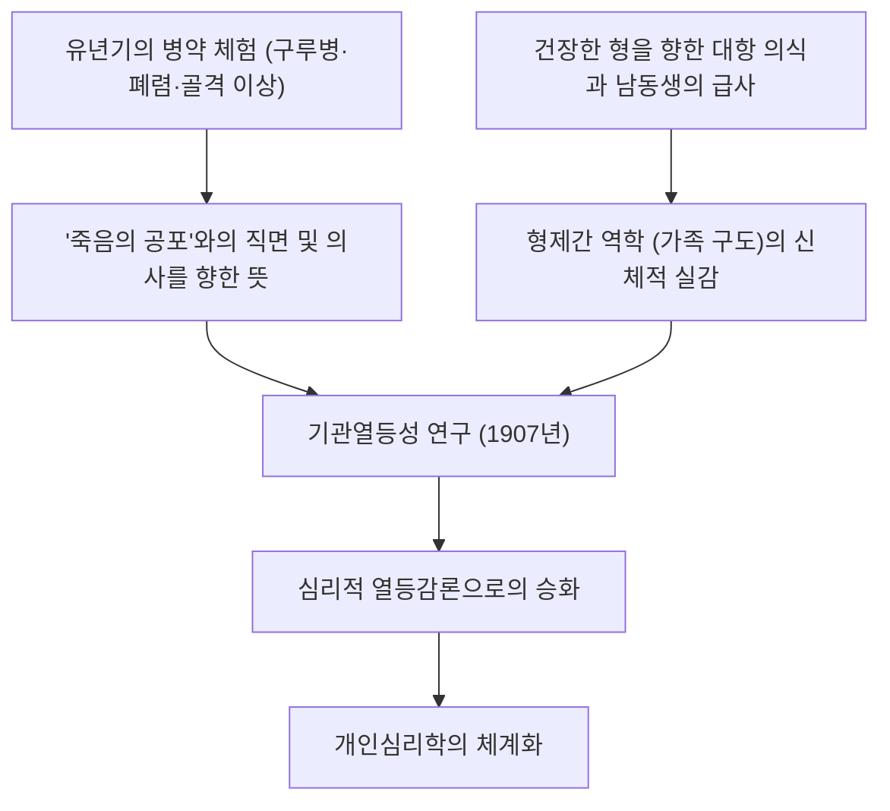
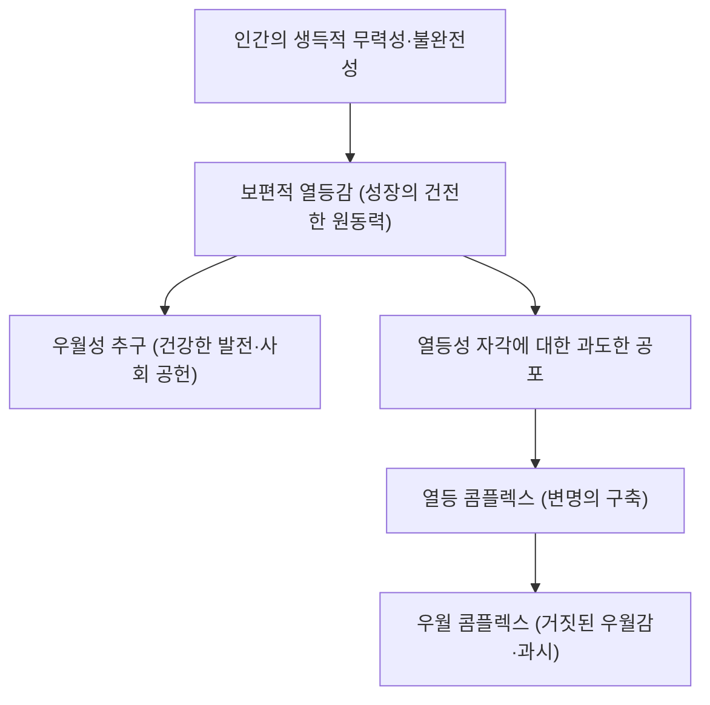
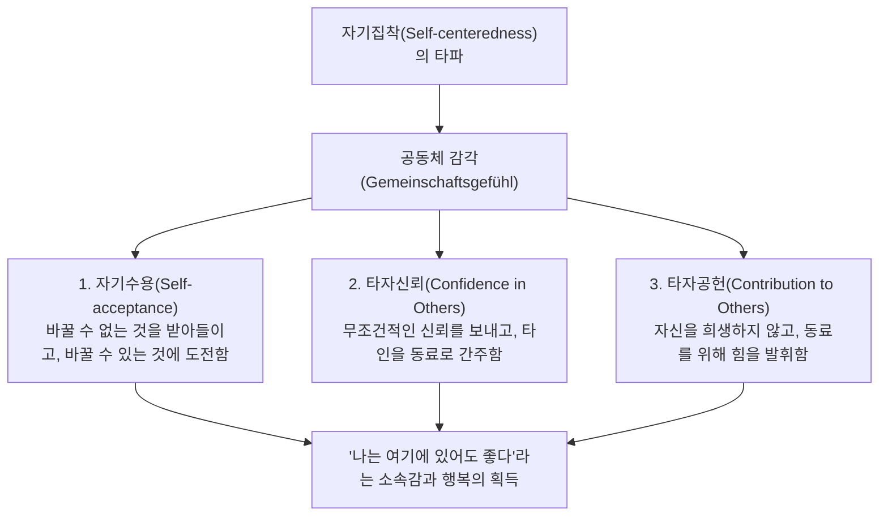
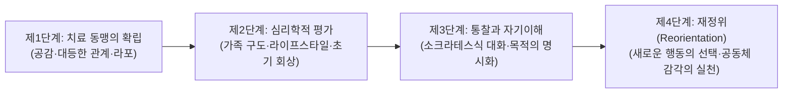

## 서론: 왜 지금, 알프레드 아들러인가

20세기 초 빈에서 발흥한 심층심리학의 조류 속에서, 알프레드 아들러(Alfred Adler, 1870–1937)가 확립한 '개인심리학(Individual Psychology / 독: Individualpsychologie)'은 현대에 이르러서도 유례를 찾기 힘든 강인한 실천성과 선진성을 발휘하고 있다.

지그문트 프로이트(Sigmund Freud)가 무의식의 본능적 충동(리비도)이나 과거의 트라우마에 기반한 '정신결정론(Psychic Determinism)'을 주창하고, 카를 구스타프 융(Carl Gustav Jung)이 원형과 보편적 무의식의 신화적 심연으로 침잠했던 반면, 아들러가 개척한 지평은 지극히 명쾌했으며, 철저히 '인간이 살아가는 현실의 사회와 미래'를 향하고 있었다.

아들러의 인간관 밑바탕에 깔려 있는 것은 "인간은 과거의 사건에 의해 기계론적으로 조종당하는 수동적 존재가 아니라, 스스로 설정한 목적을 향해 주체적이고도 창조적으로 살아가는 통합된 존재이다"라는 확신이다. 그가 자신의 학파에 붙인 'Individual Psychology(개인심리학)'라는 명칭의 'Individual'은 라틴어 *individuus*(더 이상 나눌 수 없는 것, 불가분자)에서 유래한다. 즉, 마음을 '의식과 무의식', '이성과 감정', '이드·자아·초자아'와 같은 대립하는 요소들로 잘게 쪼개는 요소환원주의를 정면으로 거부하고, 인간을 전체로서 통일된 하나의 생명 시스템(전체성·전체론)으로 파악하고자 한 사상이었다.

```
【심층심리학 3대 조류의 패러다임 비교】

┌─────────────────┬───────────────────────────────┬───────────────────────────────┬───────────────────────────────┐
│ 학파 / 창시자   │ 지그문트 프로이트             │ 카를 구스타프 융              │ 알프레드 아들러               │
├─────────────────┼───────────────────────────────┼───────────────────────────────┼───────────────────────────────┤
│ 학파명          │ 정신분석학(Psychoanalysis)    │ 분석심리학(Analytical Psych)  │ 개인심리학(Individual Psych)  │
│ 인간관          │ 기계론적·결정론적 (트라우마)  │ 목적론적·원형론적 (신화·영혼) │ 주체론적·전체론적 (목적론)    │
│ 마음의 구조     │ 의식 / 전의식 / 무의식 (분할) │ 개인적 무의식 / 집단적 무의식 │ 분할 불가능한 통합체 (전체론) │
│ 근원적 동기     │ 리비도 (성·파괴 충동)         │ 마음의 전체성 (자기실현·원형) │ 우월성 추구·공동체 감각       │
│ 치료·접근법     │ 과거 억압의 상기·제반응       │ 꿈 분석·원형의 통합·개성화    │ 라이프스타일의 재정위·용기부여│
└─────────────────┴───────────────────────────────┴───────────────────────────────┴───────────────────────────────┘
```

아들러 심리학은 단순한 임상심리학의 일파에 머무르지 않는다. 그것은 인간이 '어떻게 열등감을 극복하고, 타인과 협조하며, 소속감과 행복을 획득하여 살아갈 것인가'라는 물음에 응답하는 실천적인 실존철학이자 민주주의적 사회교육 사상이었다. 본고에서는 프로이트와의 사상적 투쟁에서 출발하여, 목적론, 열등감과 우월성의 추구, 라이프스타일, 인생의 세 가지 과제, 공동체 감각, 과제의 분리, 그리고 현대의 인지행동치료(CBT) 및 긍정심리학으로 이어지는 그 이론 체계의 전모를 학술적 엄밀성을 갖추어 철저히 밝혀내고자 한다.

---

## 1. 아들러의 생애와 개인심리학의 형성사

### 1.1 유년기의 질병 체험과 '기관열등성'의 원풍경
알프레드 아들러는 1870년 2월 7일, 오스트리아-헝가리 제국의 수도 빈 근교 펜칭에서 유대계 곡물상의 가정에서 차남으로 태어났다.

아들러 심리학을 이해하는 데 있어 필수적인 것은 그 자신의 가혹했던 유년기 신체적 체험이다. 아들러는 어린 시절 극심한 '구루병(佝僂病)'을 앓아 골격 발달이 늦어졌고, 네 살이 될 때까지 제대로 걸을 수 없었다. 나아가 다섯 살 때에는 치명적인 급성 폐렴에 걸렸는데, 주치의가 아버지에게 "이 아이의 목숨은 이제 가망이 없습니다"라고 말하는 것을 침대 안에서 직접 듣게 되었다. 이 극한의 위기에서 기적적으로 회복한 순간, 아들러는 "나는 병을 극복하고, 죽음의 공포에 맞서는 의사가 되겠다"라는 확고한 목적(가공적 최종목표)을 가슴 깊이 새겼다.

여기에 더해, 건강하고 운동 능력이 뛰어났던 형 지그문트에 대한 강렬한 대항 의식과 열등감, 남동생이 태어난 지 얼마 되지 않아 침대 속에서 급사했던 비극적 체험 등, 죽음과 질병, 신체적 취약성과 형제간의 비교라는 가혹한 현실은 훗날 그가 제창하게 될 '기관열등성(Organ Inferiority)'과 '열등감(Inferiority Feeling)', 그리고 '가족 구도(Family Constellation)' 이론의 확고부동한 원체험이 되었다.



### 1.2 빈 수요심리학회와 프로이트와의 결별 (1902–1911)
빈 대학교 의학부를 졸업한 아들러는 안과의사로서 경력을 시작했고, 이후 일반 내과의사, 그리고 정신과의사로 전향했다. 프라터 유원지의 서커스 곡예사나 장인, 노동자 계급의 환자들을 수없이 진료하는 과정에서, 신체의 특정 기관에 선천적·후천적 약점(기관열등성)을 지닌 인간이 이를 보상하기 위해 다른 기관이나 정신의 기능을 비정상적일 정도로 발달시키는 현상(과보상 / Overcompensation)에 강한 관심을 갖게 되었다.

1902년, 프로이트의 저서 『꿈의 해석』을 신문 서평을 통해 옹호한 것을 계기로, 프로이트의 초대를 받아 매주 수요일 밤 프로이트의 자택에서 열리는 소규모 연구 모임('수요심리학회', 훗날의 빈 정신분석학회)의 창설 멤버가 되었다. 아들러는 1910년 빈 정신분석학회의 회장으로 취임하며 프로이트의 가장 유력한 후계자 중 한 사람으로 간주되었다.

그러나 두 사람의 밀월은 오래가지 못했다. 프로이트가 모든 신경증의 병인을 '유아기 성욕(리비도의 억압과 고착)'으로 환원하려는 범성욕론(Pansexualism)에 집착했던 반면, 아들러는 인간 행동의 밑바탕에 있는 것은 성욕이 아니라 '자신의 나약함과 무력함을 극복하고자 하는 우월에의 의지', '공격성', '자기주장의 욕구'라고 주장했다.

1911년, 결정적인 균열이 발생한다. 빈 정신분석학회 정례회에서 아들러는 연속 강연을 펼치며 프로이트의 성욕설을 비판하고 자신의 '남성 항쟁(Masculine Protest)'론을 전개했다. 프로이트는 아들러의 학설을 "정신분석의 핵심을 부정하는 이단"으로 규정하여 맹렬히 규탄했고, 어떠한 타협도 거부했다. 아들러는 학회 회장 및 기관지 편집장 직을 사임하고, 그를 지지하는 9명의 동료와 함께 정신분석학회를 탈퇴했다. 이듬해인 1912년, 아들러 등은 자신들의 학파를 '자유정신분석협회'라 칭했다가 곧이어 '개인심리학회(Society for Individual Psychology)'로 개칭했다. 이로써 프로이트의 정신분석학과 완전히 결별한 '개인심리학'이 공식적으로 첫울음을 터뜨린 것이다.

---

## 2. 목적론 vs 원인론: 심리학의 패러다임 전환

### 2.1 기계론적 원인론(Causality)의 한계와 트라우마의 부정
아들러 심리학의 이론적 골격을 이루는 가장 급진적인 전환은 바로 '원인론(Causality)'에 대한 철저한 비판과 '목적론(Teleology)'의 도입이다.

프로이트로 대표되는 고전 정신의학이나 근대 과학은 아이작 뉴턴식의 '인과율'을 인간의 정신 영역에 기계적으로 적용했다. 즉, "과거의 사건(A)이 현재의 상태(B)를 야기했다"라는 도식이다. 예컨대 "유년기에 부모로부터 학대를 받고 사랑받지 못한 채 자랐기 때문에(A), 현재 대인공포증에 걸려 사회에 적응하지 못한다(B)"라고 설명하는 식이다.

이에 대해 아들러는 이러한 기계론적 원인론을 예리하게 비판했다. 아들러에 따르면 과거의 사건 그 자체가 인간을 결정짓는 것이 아니다. 만약 과거의 트라우마가 인간을 불가피하게 규정한다면, 가혹한 환경에서 자란 인간은 예외 없이 모두 동일한 신경증을 앓아야만 할 것이며, 거기에는 인간의 자유의지나 회복의 여지가 도무지 존재할 수 없게 된다. 아들러는 다음과 같이 단언했다.

> "어떠한 경험도 그 자체로서 성공이나 실패의 원인이 되지는 않는다. 우리는 자신이 겪은 경험의 충격——이른바 트라우마——으로 인해 고통받는 것이 아니라, 경험 속에서 자신의 목적에 부합하는 것을 스스로 찾아내어 거기에 의미를 부여하는 것이다."
> (*What Life Could Mean to You*, 1931)

```
【원인론과 목적론의 인식론적 대비】

■ 원인론 (프로이트적 인과율·결정론)
과거의 사실 (부모의 학대·실연·실패)
  -- "불가피한 인과적 결합 (외인 결정)" -->
현재의 결과 (대인공포·은둔형 외톨이·무기력)
※ 인간은 과거의 꼭두각시이며, 과거를 바꿀 수 없는 이상 절망적인 숙명론에 빠진다.

■ 목적론 (아들러적 행위론·주체론)
현재의 숨겨진 목적 (타인과의 충돌을 피하고 싶다, 상처받고 싶지 않다)
  -- "목적을 달성하기 위한 수단의 선택 (내인 창조)" -->
현재의 증상·감정의 생성 (불안·분노·공포를 스스로 창출한다)
※ 과거의 사실은 재료에 불과하다. 인간은 '지금의 목적'을 위해 과거의 기억을 이용한다.
```

### 2.2 목적론(Teleology)의 구조와 감정의 '사용'
아들러의 목적론에서 인간의 행동과 감정, 나아가 정신적 증상(불안, 우울, 공황, 강박)조차도 본인이 무의식중에 품고 있는 '숨겨진 목적(Hidden Goal)'을 달성하기 위한 '수단'으로 이해된다.

예컨대 "사람들 앞에 서면 손발이 떨리고 얼굴이 붉어지며 말을 할 수 없게 된다"라는 사회불안장애 환자를 생각해 보자.
- **원인론적 설명**: "과거에 많은 사람 앞에서 실수하여 망신을 당했던 트라우마가 원인이 되어, 무의식적 공포 조건화가 작동하고 있다."
- **목적론적 설명**: "환자는 '남들 앞에서 망신당하고 싶지 않다', '만약 실패하여 나의 무능함이 탄로 나면 견딜 수 없다'라는 목적을 품고 있다. 그 목적을 달성하기 위해 스스로 '홍조'나 '떨림'이라는 신체 증상을 만들어내어, '병이 있기 때문에 남들 앞에 나설 수 없다'라는 정당한 구실(알리바이)을 획득하고 있는 것이다."

여기서 중요한 것은, 감정(분노, 불안, 슬픔)은 외부에서 수동적으로 '덮쳐오는' 것이 아니라, 인간이 자신의 목적을 이루기 위해 '조작해 내고, 사용하는 도구'라는 관점이다.

아들러는 유명한 '분노의 도구설'을 제시했다. 어머니가 아이를 향해 무서운 기세로 고함을 지르며 화를 내고 있는 도중에 담임교사로부터 전화가 걸려왔다고 가정해 보자. 어머니는 수화기를 드는 순간 지극히 정중하고 온화한 목소리로 바꾸어 교사와 통화하고, 전화를 끊자마자 다시 격앙되어 아이를 향해 소리를 질렀다. 만약 분노가 생리적 충동으로서 인간을 집어삼키는 불가항력적인 힘이라면, 불과 수 초 사이에 냉정한 대화로 전환하는 것은 불가능하다. 어머니는 "아이를 즉각 굴복시켜 말을 듣게 만들고 싶다"라는 목적을 위해, 분노라는 감정을 의도적으로 불러일으켜 이용한 것이다.

아들러 심리학에서 인간은 결코 감정의 노예가 아니다. 감정을 자신의 목적을 위해 선택하고 활용하는 주권자인 것이다.

---

## 3. 열등감·열등 콤플렉스·우월성 추구

### 3.1 기관열등성에서 보편적 열등감으로
아들러의 초기 연구인 『기관열등성 연구』(*Studie über Minderwertigkeit von Organen*, 1907)에서, 그는 신체 기관의 기능적 불완전성과 그에 대한 생체의 보상 작용을 분석했다. 심장이나 신장, 감각기관에 선천적인 취약성을 지닌 개체는 중추신경계의 보상적 노력을 통해 그 결함을 극복하려 한다.

아들러는 이러한 생리학적·병리학적 통찰을 정신의 영역으로 극적으로 확장했다. 인간이라는 생물은 다른 동물들과 비교할 때 극히 무력하고 취약한 상태로 태어난다. 날카로운 이빨도 발톱도, 두터운 가죽도 지니지 못했으며, 부모의 보살핌 없이는 단 하루도 생존할 수 없다. 따라서 모든 인간은 유년기에 압도적인 힘을 지닌 어른들에게 둘러싸여 자신의 무력함, 왜소함, 불완전함을 강렬하게 자각할 수밖에 없다.

아들러는 이 무력감에서 벗어나고자 하는 심리적 긴장을 '열등감(Minderwertigkeitsgefühl / Inferiority Feeling)'이라 명명했다. 매우 결정적인 것은, 아들러에게 있어 **열등감 그 자체는 병리가 아니라, 인간이 진화하고 성장하기 위한 지극히 건전하고 보편적인 원동력(Engine of Growth)**이라는 점이다.



### 3.2 열등감 vs 열등 콤플렉스의 엄밀한 개념 구분
일상용어에서 '콤플렉스'라는 말은 단순한 열등감의 동의어로 혼용되곤 하지만, 아들러 심리학에서 '열등감'과 '열등 콤플렉스(Inferiority Complex)'는 명확하게 구분된다.

1. **열등감(Inferiority Feeling)**:
   자신의 현재 상태와 이상적인 상태 사이의 간극을 인식함으로써 발생하는 주관적인 불완전함의 감각. "나는 아직 지식이 부족하니 공부를 더 해야겠다", "기술이 미숙하니 연습해야겠다"와 같이, 노력과 연마를 통해 과제를 극복해 나가는 건강한 동기부여가 된다.

2. **열등 콤플렉스(Inferiority Complex)**:
   열등감을 변명(구실)으로 삼아 인생의 과제로부터 도피하는 병리적 상태. "A이기 때문에 B를 할 수 없다"라는 겉보기 인과율(가짜 인과성)을 구축하는 것이다. "나는 학벌이 없어서 성공할 수 없다", "외모가 뛰어나지 않아서 결혼할 수 없다", "부모가 잘못 키웠기 때문에 사회에 나갈 수 없다".
   열등 콤플렉스에 빠진 인간은 자신의 노력으로 과제를 해결하기를 포기하고, 불편한 현실로부터 자존심을 지키기 위해 자신의 열등성을 방패막이 삼아 그 자리에 멈춰 서고 만다.

### 3.3 우월 콤플렉스와 권력의지의 병리
열등 콤플렉스로 고통받는 인간이 자신의 열등성을 정면으로 응시하는 고통을 견디지 못할 때, 흔히 그 뒤집힌 형태로 나타나는 것이 바로 '우월 콤플렉스(Superiority Complex)'이다.

우월 콤플렉스란 현실에서 치열하게 노력하여 곤란을 극복하는 것이 아니라, "마치 자신이 뛰어난 것처럼 꾸며내는 거짓된 우월성"으로 도피하는 방어기제이다. 구체적으로는 다음과 같은 형태를 띤다.

- **권위의 과시 (호가호위 / 배경 과시)**: 유명인이나 권력자와의 개인적 친분을 과시하거나, 명품 브랜드나 화려한 직함으로 자신을 무장한다.
- **자랑과 과거의 영광에 대한 집착**: 과거의 무용담을 끊임없이 늘어놓음으로써 현재의 무위도식을 은폐한다.
- **'불행 자랑'과 약자를 통한 지배**: 자신이 얼마나 가혹한 처지에 놓여 있는지, 얼마나 깊은 상처를 받고 괴로워하고 있는지를 끝없이 호소함으로써 주위의 동정을 사고, 타인을 죄책감으로 조종하며 특별대우를 요구한다. 아들러는 이를 '약함의 특권화'라 불렀으며, 치료하기가 가장 까다로운 우월 콤플렉스의 한 형태로 보았다.

### 3.4 우월성 추구(Striving for Superiority)의 건전한 방향성
인간이 열등감을 극복하고자 하는 근원적 동기를 아들러는 초기에는 '공격 충동', '권력에의 의지', '남성 항쟁' 등으로 불렀으나, 만년에는 이를 보다 포괄적인 '우월성 추구(Striving for Superiority / 향상을 향한 노력)'라는 개념으로 승화시켰다.

건전한 우월성 추구란 "타인과의 경쟁에서 이겨 타인을 짓밟고 지배하는 것"이 결코 아니다. 그것은 **"타인과 비교하는 것이 아니라 자신의 이상형과 비교하며, 자신의 한계를 한 걸음 넘어서는 것"**이며, 수평적인 지평에서 타인과 대등한 존재로서 자신을 고양시켜 나가는 과정이다. 우월성 추구가 '수직적 서열(상하 관계·지배와 피지배)'을 향할 때 그것은 신경증의 온상이 되지만, '수평적 협조(공동체에의 공헌)'를 향할 때 그것은 창조적이고 건강한 자기실현이 된다.

---

## 4. 전체론과 라이프스타일: 개인의 인지 아키텍처

### 4.1 전체론(Holism): 불가분 일체로서의 인간
아들러 심리학의 제1공리는 '전체론(Holism)'이다. 근대 합리주의의 아버지 르네 데카르트 이래, 서구 사상은 정신과 신체를 이분하는 '심신이원론'에 지배당해 왔다. 정신의학에 있어서도 프로이트는 마음을 '의식 / 무의식', '자아 / 이드 / 초자아'라는 대립하는 구성 요소로 분할하여 인간 내부의 갈등(내적 갈등)을 모델화했다.

아들러는 이러한 요소환원론을 전면적으로 거부했다. 아들러에게 있어 인간은 분할할 수 없는 일체(Individual = in + dividual)이다.
- '이성'과 '감정'은 대립하는 것이 아니다. 감정은 이성이 지향하는 목적을 위해 만들어지며, 이성과 연동하여 기능한다.
- '의식'과 '무의식'은 적대적인 것이 아니다. 양자는 동일한 하나의 목적을 향해 협조하여 움직이는, 하나의 동전의 앞면과 뒷면에 불과하다. 무의식이란 단지 '본인이 아직 언어화하거나 자각하지 못한 목적의 영역'을 의미할 뿐이다.
- '마음'과 '신체'는 독립된 실체가 아니다. 강한 불안을 느낄 때 심박수가 상승하고 위통이 일어나는 것은, 마음과 신체가 하나의 전체로서 위기에 대응하려는 발현이다.

아들러 심리학에서는 "머리로는 알고 있지만 감정을 억누를 수 없다", "무의식의 욕망이 이성을 거슬러 행동하게 만들었다"라는 이원론적 변명을 인정하지 않는다. "내가 그 목적을 위해 분노라는 감정을 써서 소리를 질렀다"라는 식으로, 행위의 주체로서의 전체적 인간(Whole Person)에게 모든 책임을 귀속시킨다.

```
【요소환원론(프로이트)과 전체론(아들러)의 구조적 차이】

■ 요소환원론 (심리적 분단 모델)
┌─────────────────────────┐
│ 초자아 (도덕·규범)      │
├─────────────────────────┤  ← 내적 갈등·분열
│ 자아 (현실 적응의 이성)  │
├─────────────────────────┤  ← 억압과 저항
│ 이드 (무의식의 본능 욕망)│
└─────────────────────────┘
※ "본능 때문에 이성이 졌다", "무의식이 나를 조종한다"는 자기기만이 발생한다.

■ 전체론 (불가분 통합 모델)
┌──────────────────────────────────────────────┐
│                  전체적 인간 (불가분의 자기)                 │
│                                                              │
│  목적론적 통합체:                                            │
│  이성·감정·의식·무의식·육체는 모두                         │
│  '단일한 숨겨진 목표(라이프스타일)'를 달성하기 위해 협조 동작│
└──────────────────────────────────────────────┘
※ 모든 행동과 감정의 최종 책임은 통합된 '나'에게 존재한다.
```

### 4.2 라이프스타일(Lifestyle)의 정의와 세 가지 요소
아들러 심리학에서 성격, 인격, 세계관, 인지 패턴의 총체를 가리키는 중심 개념이 바로 '라이프스타일(Lifestyle / 독: Lebensstil)'이다. 현대 인지치료에서 말하는 '도식(Schema)'이나 '인지적 도식'의 선구적 개념이다.

라이프스타일이란 인간이 유년기(대략 4~6세경까지)에 자신의 신체적 조건, 가족 환경, 문화적 맥락 속에서 살아남기 위해 스스로 선택하고 구축한 '세계와 자기에 대한 의미부여의 고정 패턴'이다. 라이프스타일은 한 번 형성되면 무자각인 채로 성인이 된 이후의 모든 지각, 사고, 감정, 행동을 여과하는 나침반으로 기능한다.

아들러파 심리학에서 라이프스타일은 다음의 세 가지 구성 요소로 이루어져 있다.

1. **자기개념(Self-concept)**:
   "나는 ~이다"라는 자기 자신에 대한 확신과 신념. "나는 무력하다", "나는 똑똑하다", "나는 사랑받지 못하는 사람이다".
2. **자기이상(Self-ideal)**:
   "나는 ~이어야만 한다", "나는 ~해야 한다"라는 주관적 기준. "나는 언제나 1등이어야 한다", "나는 모든 사람에게 친절한 대우를 받아야 한다", "나는 절대로 실패해서는 안 된다".
3. **세계관(Weltbild / Picture of the World)**:
   "타인과 사회는 ~이다"라는 환경에 대한 확신. "세상은 위험으로 가득 차 있다", "타인은 나를 이용하려는 적이다", "인생은 예측 불가능하고 부조리하다".

만약 어떤 사람의 자기개념이 "나는 무력하다", 자기이상이 "나는 상처받아서는 안 된다", 세계관이 "주변 사람들은 공격적이고 냉혹하다"라는 라이프스타일로 구축되어 있다면, 그 사람은 모든 대인관계에서 과도하게 경계하고 타인의 사소한 언행을 적의로 해석하며, 은둔이나 회피 행동을 선택하게 된다. 이는 병리적인 결함이 아니라, 그 사람의 라이프스타일에 비추어 보면 지극히 합리적이고 일관된 행동인 것이다.

### 4.3 초기 회상(Early Recollections)의 진단적 의의
개인의 무자각적인 라이프스타일을 객관적으로 부각하기 위한 강력한 임상적 기법으로 아들러가 고안한 것이 바로 '초기 회상(Early Recollections)'의 분석이다.

초기 회상이란 내담자에게 "기억할 수 있는 가장 어린 시절의 기억(통상 6~8세 이전의 구체적인 일화)"을 떠올리게 하여, 그 정경, 등장인물, 자신의 행동, 그리고 그 당시에 느꼈던 감정을 상세하게 이야기하도록 하는 기법이다.

프로이트는 유년기의 기억을 '과거의 사실의 흔적' 혹은 '억압된 트라우마의 화석'으로 다루었다. 그러나 목적론에 서 있는 아들러는 기억을 '현재의 라이프스타일을 정당화하고 보강하기 위해 무수한 과거 사건 중에서 스스로 선별하고 재구성한 창작물(스토리)'로 파악했다. 인간은 과거를 있는 그대로 기억하는 것이 아니다. 현재 자신의 목적에 부합하는 기억만을 유지하며, 유리하게 채색하고 있는 것이다.

```
【초기 회상의 분석 패러다임】

·기억의 내용: "5살 때 마당의 나무에서 떨어져 다리를 다쳤다. 어머니가 달려와 나를 안아주었다."
  ↓
·분석의 관점:
  1. 능동적인가 수동적인가? (스스로 움직였는가, 무슨 일이 일어나기를 기다렸는가)
  2. 타인의 역할은 무엇인가? (위험을 방치한 적인가, 구해주는 비호자인가)
  3. 자기의 인식은 무엇인가? (무력하고 상처받기 쉬운 존재)
  ↓
·도출되는 라이프스타일 신념:
  "세상은 위험으로 가득 차 있다. 나는 방심하면 상처받는 무력한 존재다.
   그러나 약함을 보이며 도움을 요청하면, 타인은 나를 다정하게 보호해 준다."
  ↓
·현재의 행동 패턴과의 정합성:
  어려움에 직면했을 때 스스로 해결하지 않고, 질병이나 유약함을 내세워 타인의 지원을 이끌어내려 한다.
```

아들러는 "초기 회상의 진위(그것이 객관적 사실인가, 본인의 환상이나 착각인가)는 어찌 되어도 상관없다"라고 갈파했다. 중요한 것은 그 사람이 **"왜 수천 가지에 이르는 유년기의 기억 중에서 하필 그 특정한 장면을 지금도 여전히 기억하고 있는가"**라는 점이다. 초기 회상에는 그 사람이 현재 세상을 어떻게 바라보고 있으며, 어떠한 전략으로 살아남으려 하는가에 대한 '설계도'가 응축되어 있는 것이다.

---

## 5. 인생의 세 가지 과제와 공동체 감각

### 5.1 인생의 세 가지 과제(Life Tasks)
아들러는 인간이 사회 속에서 살아가는 데 있어 결코 피해 갈 수 없는 대인관계의 도전들을 '인생의 과제(Life Tasks / 독: Lebensaufgaben)'로 정식화했다. 아들러는 이를 '일의 과제', '교우의 과제', '사랑의 과제'라는 세 단계로 분류했다.

```
【인생의 세 가지 과제의 위계와 난이도】

［사랑의 과제(Love Task)］
·대상: 파트너, 배우자, 가족과의 지극히 긴밀한 관계
·요구 수준: 가장 높은 심리적 밀착도와 자기개방, 운명의 공유, 평등의 유지
·회피의 구실: 속박에 대한 공포, 외도, 정서적 학대(가스라이팅), 완벽주의

［교우의 과제(Friendship Task)］
·대상: 친구, 이웃, 지역 사회, 이해관계를 초월한 대등한 동료 관계
·요구 수준: 경쟁 없는 수평적 신뢰 관계, 이타성, 상호 승인
·회피의 구실: "배신당할까 봐 두렵다", "아무도 나를 이해해 주지 않는다"

［일의 과제(Work Task)］
·대상: 직업 활동, 경제적 생산, 사회적 분업 네트워크
·요구 수준: 규칙 준수, 기본적인 협조성, 성과에 대한 헌신
·회피의 구실: 실패에 대한 공포, 평가에 대한 두려움, 미루기, 대인공포
```

1. **일의 과제(Work Task)**:
   인간이 생물로서 생존하기 위해 사회적 분업 네트워크에 참여하여 타인에게 유용한 가치를 생산해 내는 과제. 세 가지 과제 중에서는 이해관계가 가장 명확하고 계약이나 규칙에 의해 행동이 규정되므로, 대인관계로서의 난이도는 가장 낮다고 평가되지만, 여기서 도피하면 경제적 파탄이나 사회적 부적응을 초래한다.

2. **교우의 과제(Friendship Task)**:
   직업과 같은 직접적인 경제적 이해관계를 벗어나 순수한 친구 관계, 동료 관계를 구축하는 과제. 서로 경쟁하지 않고 대등한 인간으로서 신뢰하며, 자신의 유약함까지 털어놓을 수 있는 관계성이 요구된다. 많은 이들이 여기서 "타인에게 배신당하지 않을까"라는 의구심 때문에 인간관계의 폭을 좁혀버리고 만다.

3. **사랑의 과제(Love Task)**:
   연애 관계, 부부 관계, 부모 자식 관계 등 인생에서 가장 친밀하고 지속적인 일대일 관계를 맺는 과제. 심리적 거리가 극한까지 0으로 좁혀지기 때문에 자신이 가장 감추고 싶어 하는 약점과 결함이 여실히 드러난다. 상대를 지배하려 들거나 상대의 인정을 과도하게 갈구하지 않고, 완전히 대등한 파트너로서 '두 사람의 행복'을 추구해야 하므로 세 가지 과제 중 난이도가 가장 높다.

아들러에 따르면 모든 심리적 문제(신경증, 은둔형 외톨이, 비행, 우울 상태)는 이러한 인생의 과제에 직면했을 때, 실패하여 자존심에 상처를 입을 것을 지나치게 두려워한 나머지 그 과제들로부터 도주(이른바 '인생의 거짓말 / Life Lie')하려는 데서 비롯된다.

### 5.2 공동체 감각(Gemeinschaftsgefühl / Social Interest)의 전모
아들러 심리학의 사상적 정점이자 가장 심오한 개념이 바로 '공동체 감각(Gemeinschaftsgefühl / Social Interest)'이다. 직역하면 '공동체 감정' 혹은 '공동체 의식'이지만, 영어권에서는 흔히 'Social Interest(사회적 관심)'로 번역된다.

공동체 감각이란 **"자신에 대한 집착(Self-centeredness)을 타인에 대한 관심(Social Interest)으로 전환하는 것"**이며, 타인을 '적'이 아닌 '동료'로 여기고 "나에게는 공동체 안에 머물 자리가 있다"라고 느낄 수 있는 소속감과 안도감의 경지이다.

아들러는 정신적 건강의 유일무이한 척도는 공동체 감각의 높낮이라고 단언했다. 공동체 감각이 결여된 인간은 세상을 약육강식의 전쟁터로 인식하며, 타인을 자신을 위협하는 적이거나 이용해야 할 도구로밖에 보지 못한다. 따라서 늘 고독과 불안에 시달리며, 거짓된 우월성을 갈구하다 신경증적 갈등의 늪에 빠져든다.



### 5.3 공동체 감각을 구성하는 세 기둥
공동체 감각을 실천적이고 임상적인 차원으로 구현하기 위해 현대 아들러파 심리학에서는 이를 상호 연동되는 다음 세 가지 요소로 정식화하고 있다.

1. **자기수용(Self-acceptance)**:
   '자기긍정(포지티브 싱킹)'과는 다르다. 자기긍정이 "할 수 없는 자신에게도 '나는 할 수 있다'라고 스스로를 속이는 자기기만"인 반면, 자기수용이란 "할 수 없는 자신, 불완전한 자신을 있는 그대로 받아들인 뒤, 바꿀 수 있는 것에 온 힘을 쏟는 용기"이다. 이는 니부어의 기도문("신이여, 바꿀 수 없는 것을 받아들이는 평온함과, 바꿀 수 있는 것을 바꾸는 용기와, 그 둘을 분별하는 지혜를 주옵소서")과 온전히 맥을 같이한다.

2. **타자신뢰(Confidence in Others)**:
   '타자신용(Credit)'과는 다르다. 신용이란 담보나 실적, 조건을 달고 상대를 믿는 것이다(은행의 대출과 같다). 이에 반해 타자신뢰란 어떠한 담보나 조건 없이 타인을 무조건적으로 믿는 것이다. 물론 배신당할 위험은 상존한다. 그러나 배신당한다 하더라도 그것은 '상대의 과제'이며, 내가 신뢰를 보낼 것인가는 '나의 과제'라고 정리함으로써 의구심이라는 감옥에서 벗어난다.

3. **타자공헌(Contribution to Others)**:
   '자기희생(Self-sacrifice)'과는 다르다. 자신의 생명이나 일상을 깎아내며 타인에게 헌신하는 것은 인정 욕구에 의해 동기부여된 신경증적 헌신에 불과하다. 건전한 타자공헌이란 "자기 자신의 존재 의의와 가치를 실감하기 위해, 자신의 능력을 기꺼이 공동체의 동료들을 위해 발휘하는 것"이다. 아들러는 "행복이란 공헌감이다"라고 갈파했다. 타인에게 공헌하고 있다는 실감이 인간에게 "나에게는 가치가 있다"라는 확신을 부여하며, 살아갈 용기의 원천이 된다.

---

## 6. 과제의 분리와 용기의 심리학

### 6.1 과제의 분리(Separation of Tasks)의 논리 구조
아들러 심리학이 인간관계의 갈등을 근본적으로 해소하기 위해 제시하는 날카로운 칼날과도 같은 개념이 바로 '과제의 분리(Separation of Tasks)'이다.

모든 대인관계의 불화, 충돌, 스트레스는 "타인의 과제에 흙발로 발을 들이미는 것", 혹은 "나의 과제에 타인이 흙발로 발을 들이밀게 허용하는 것"에서 비롯된다.

아들러는 과제를 준별하기 위한 지극히 단순명쾌한 기준을 제시했다.
**"그 선택이 가져올 결말(결과)을 최종적으로 짊어지는 것은 누구인가?"**

```
【과제의 분리의 구체적 사례: 자녀의 공부 문제】

·부모의 사고방식 (과제의 혼동):
  "아이가 공부하지 않으면 장래에 곤란해지므로, 억지로라도 공부시켜야 한다."
  → 자녀의 과제에 부모가 강권적으로 개입 (지배·통제).
  → 아이는 반발하며, 공부를 "부모를 곤란하게 만들기 위한 무기"로 이용하기 시작한다.

·과제의 분리에 입각한 정리:
  1. "공부를 하느냐 마느냐, 그 결과 성적이 떨어져 지망 학교에 가지 못하게 되는 결말을 최종적으로 짊어지는 것은 누구인가?"
     → 최종적인 결과를 짊어지는 것은 【자녀 자신】이다 (자녀의 과제).
  2. 부모가 할 수 있는 일은 무엇인가?
     → "공부하라"고 명령하는 것이 아니라, 아이가 배우고 싶어졌을 때 언제든 도울 수 있는 환경을 정비하고,
        "너의 힘을 믿고 지켜보고 있다"는 태도를 전달하는 것 (지원의 준비와 지켜봄).
```

과제의 분리는 결코 타인을 향한 냉담한 무관심이나 방임(방치)을 의미하지 않는다. 방임이란 아이가 무엇을 하고 있는지 알지도 못하고 관심조차 두지 않는 것이다. 아들러의 조력 스타일은 "말을 물가로 데려갈 수는 있지만, 물을 마시게 할 수는 없다"라는 속담에 집약되어 있다. 물을 마실지 여부를 결정하는 것은 말(본인)이며, 타인이 목구멍을 억지로 벌리고 물을 들이붓는 것은 폭력이자 지배에 다름 아니다.

### 6.2 인정 욕구의 부정과 '자유'의 정의
과제의 분리를 철저하게 밀고 나간 귀결로서, 아들러 심리학은 현대 사회를 뒤덮고 있는 '인정 욕구(Desire for Approval)'를 단호히 부정한다.

아들러에 따르면 "타인에게 인정받고 싶다", "칭찬받고 싶다", "좋은 평가를 받고 싶다"라는 인정 욕구에 이끌려 살아가는 인간은 실질적으로 '타인의 인생'을 살아가고 있는 것에 불과하다. 타인의 평가를 신경 쓴다는 것은 "타인이 나를 어떻게 평가할 것인가"라는 【타인의 과제】를 자신이 통제하려 드는 불가능한 시도이기 때문이다.

아들러 심리학에서 '자유'란 **"타인에게 미움받는 것을 두려워하지 않는 것"**이다.
모두에게 좋은 사람이 되려 애쓰고 모든 이에게 사랑받으려 하는 것은 불성실한 태도이며, 자신의 라이프스타일을 끊임없이 속여야 하는 고행이다. 자신이 옳다고 믿는 길을 걸어가는 것, 그리고 그 결과 타인이 나를 좋아할지 싫어할지는 '타인의 과제'일 뿐 내가 관여할 수 없는 영역이다. 타인의 평가에 얽매이지 않고 자신의 양심과 공동체를 향한 공헌감에 기초하여 자율적으로 행동하는 것이야말로 진정한 정신적 자유의 조건이다.

---

## 7. 용기부여(Encouragement)와 민주적 교육론

### 7.1 상벌 교육의 전면 비판: 칭찬의 위험성
아들러 심리학의 임상 및 교육론에서 가장 충격적인 제언 중 하나가 바로 '상벌 교육(칭찬하기와 꾸짖기)의 전면적 금지'이다.

일반적인 자녀 양육이나 기업 경영에서 "칭찬을 통해 사람을 성장시킨다"라는 접근법이 자주 찬사를 받곤 한다. 그러나 아들러는 '칭찬한다'라는 행위의 본질을 날카롭게 꿰뚫어 보았다. 칭찬이라는 행위에는 반드시 **"능력 있는 인간이 능력 없는 인간을 아래로 내려다보며 평가하고 조종한다"라는 수직 관계(상하 관계)**가 내재되어 있다. 어른이 다른 어른에게 대등한 입장에서 "참 잘했어요", "기특하네요"라고 칭찬하는 것이 지극히 부자연스럽고 무례하게 느껴지는 이유는, 그 이면에 상하의 권력 관계가 깔려 있기 때문이다.

```
【'칭찬과 꾸중' vs '용기부여'의 패러다임 대비】

┌─────────────────┬───────────────────────────────┬───────────────────────────────┐
│ 항목            │ 상벌 교육 (칭찬하기 / 꾸짖기) │ 용기부여 (Encouragement)      │
├─────────────────┼───────────────────────────────┼───────────────────────────────┤
│ 인간관계의 전제 │ 수직 관계 (상하·지배·조종)    │ 수평 관계 (대등·존경·신뢰)    │
│ 평가의 기준     │ 결과·능력·타인과의 비교       │ 과정·의도·자신과의 비교       │
│ 상대에게 생기는 │ 인정 욕구·실패 공포·의존성    │ 자신감·자율성·공헌감·자기효능│
│ 심리            │                               │                               │
│ 동기부여의 성질 │ 외발적 (보상 획득, 처벌 회피) │ 내발적 (공동체를 향한 자발적) │
│ 구체적인 말 건넴│ "장하다!", "100점 받다니 대단"│ "도와줘서 고마워", "정말 기뻐"│
└─────────────────┴───────────────────────────────┴───────────────────────────────┘
```

아들러에 따르면 '칭찬하기'의 가장 큰 폐해는 아이나 부하 직원에게 "칭찬받지 못하면 행동하지 않는다", "타인의 평가가 없으면 자신의 가치를 느끼지 못한다"라는 심각한 인정 욕구 중독을 심어준다는 점에 있다. 나아가 칭찬받지 못하는 상태 자체를 '처벌'로 인식하게 되어, 실패를 극도로 두려워하며 새로운 도전을 회피하게 된다.

반면 '꾸짖기'는 더욱 폭력적이다. 질책이란 건설적인 언어적 대화를 포기하고 분노라는 손쉬운 권력 감정을 사용하여 상대를 굴복시키려는 미숙한 소통 수단에 불과하다. 질책을 당한 쪽은 자신의 잘못을 진심으로 반성하기는커녕 "들키지 않도록 숨겨야지", "어떻게 되갚아줄까"라는 방어와 복수의 심리만을 비대하게 키우게 된다.

### 7.2 용기부여(Encouragement)의 기법과 수평적 관계
상벌을 대체할 접근법으로 아들러가 제시한 것이 바로 '용기부여(Encouragement)'이다.
용기부여란 **"곤란을 극복할 활력(용기)을 상대의 내면에서 이끌어내는 원조"**이며, 대등한 '수평 관계'에 기초하여 이루어진다.

용기부여의 핵심 기법은 다음과 같다.

1. **감사와 기쁨의 표명 ("고마워", "기뻐")**:
   상대를 위에서 아래로 평가(판단)하는 것이 아니라, 상대의 행위가 자신이나 공동체에 얼마나 큰 도움이 되었는지에 대한 주관적인 감정을 전한다. "도와줘서 큰 힘이 되었어", "네가 곁에 있어 주어 정말 기쁘단다". 이를 통해 상대는 "나에게는 타인에게 공헌할 수 있는 힘이 있다", "나는 가치 있는 존재다"라는 확신(자기효능감)을 갖게 된다.
2. **과정과 의도에의 주목**:
   시험 점수나 영업 실적 같은 '결과'가 아니라, 거기에 도달하기까지의 '노력의 과정'이나 '시도'에 주목한다. "끝까지 포기하지 않고 끈기 있게 매달렸구나", "이 부분을 고민해서 독창적으로 풀어냈네". 실패했을 때야말로 용기부여를 위한 최대의 기회이며, "이번 실패를 통해 무엇을 배울 수 있을까"를 대등하게 의논한다.
3. **단점이 아닌 강점에의 주목 (리프레이밍)**:
   "싫증을 잘 낸다"를 "호기심이 왕성하고 전환이 빠르다", "완고하다"를 "자신의 의지를 굳세게 관철하는 힘이 있다"와 같이, 본인이 열등감을 품고 있는 특징을 긍정적인 맥락으로 재정의한다.

### 7.3 빈에서의 아동상담소 운동과 공교육 개혁
아들러의 이론은 상아탑 속 추상적 담론에 머무르지 않고 거대한 사회적 실천으로 전개되었다. 제1차 세계대전 이후 오스트리아 혁명으로 사회민주당이 시정을 장악한 '붉은 빈(Red Vienna)' 시절, 아들러는 빈시 교육위원회와 연계하여 공립학교 내에 30곳이 넘는 '아동상담소(Child Guidance Clinics)'를 개설했다.

아들러의 아동상담소는 의사, 교사, 부모, 그리고 아이 자신이 대등한 입장에서 둥글게 둘러앉아 공개된 장소에서 교육 상담을 진행하는 획기적인 시스템이었다. 아들러는 가정과 학교에서의 독재적·권위주의적 지배를 해체하고 민주적이고 협력적인 공동체를 길러내는 것이야말로 다음 세대의 신경증, 비행, 그리고 전쟁을 막는 유일한 길이라고 믿었다. 빈에서 펼쳐진 이 실천은 현대 학교심리학과 스쿨 카운슬링의 직접적인 선구가 되었다.

---

## 8. 아들러파 임상 상담의 기법과 프로세스

### 8.1 치료 관계의 확립: 대등한 동맹 관계(Collaborative Alliance)
정신분석에서의 치료 관계는 카우치(침선의)에 길게 누운 환자와, 그 등 뒤에 앉아 침묵을 지키며 해석을 내리는 분석의라는 비대칭적이고 권위주의적인 구조를 띠고 있었다.

아들러파 카운슬링은 이러한 구도를 근본적으로 뒤엎었다. 상담자와 내담자는 같은 높이의 의자에 마주 보고 앉는다. 양자는 '대등한 공동 연구자'이며, 내담자의 인생이라는 난제를 함께 풀어가기 위한 '파트너십(동맹 관계)'을 맺는다. 상담자는 전지전능한 지도자가 아니며, 내담자가 스스로의 힘으로 인생의 과제를 해결해 나가는 과정을 곁에서 함께 걷는 촉진자(패실리테이터)이다.



### 8.2 심리학적 평가: 가족 구도(Family Constellation)
평가 단계에서 아들러파가 가장 중시하는 것은 '가족 구도(Family Constellation / 가족구조)'의 분석이다.

아들러는 아이가 어떤 라이프스타일을 획득하는가는 형제자매 간의 출생 순위(Birth Order)와 그에 대한 주관적 해석에 지극히 강한 영향을 받는다는 사실을 발견했다.

- **첫째(장자)**: 한때 부모의 사랑을 독차지했으나 둘째의 탄생으로 인해 '왕좌에서 굴러떨어진 군주'의 체험을 겪는다. 과거의 영광을 그리워하며 질서, 권위, 규칙을 중시하는 경향이 강하다. 책임감이 강하고 보수적인 성향을 띠기 쉽다.
- **둘째(중간 아이)**: 태어날 때부터 앞서 달리는 라이벌(첫째)이 존재하므로 언제나 '엔진을 풀가동하는 경주 상태'에 놓여 있다. 첫째와는 다른 영역에서 우위를 점하려 하며, 반항적이거나 혁신적, 혹은 뛰어난 협조성을 띠기 쉽다.
- **막내(최연소자)**: 결코 왕좌에서 굴러떨어질 일이 없으며 온 가족의 응석받이로 자라거나, 반대로 모두를 추월하려는 야심가가 된다. "나는 가만히 있어도 사랑받아야 마땅하다"라는 의존적인 라이프스타일을 형성하기 쉽다.
- **외동(독자)**: 경쟁 상대가 없이 언제나 어른들의 세계에 둘러싸여 자란다. 자기중심적으로 흐르기 쉬운 반면, 어른스러운 지성과 뛰어난 역량을 조기에 발휘하기도 한다.

여기서 중요한 점은 출생 순위 그 자체가 인간을 결정짓는 것이 아니라, **"그러한 위치 관계 속에서 아이가 부모의 관심과 자신의 자리를 확보하기 위해 어떠한 생존 전략(라이프스타일)을 스스로 선택했는가"**라는 점이다.

### 8.3 소크라테스식 대화(Socratic Dialogue)와 통찰
아들러파의 개입은 훈계나 일방적인 지시가 아니라, 고대 그리스 철학자 소크라테스의 산파술을 본뜬 '소크라테스식 대화(Socratic Dialogue)'를 통해 전개된다.

상담자는 "왜 당신은 그렇게 행동했습니까?"라며 과거를 힐난하듯 캐묻는 질문(원인론의 질문)을 결코 던지지 않는다. 대신 "그 행동을 함으로써 당신은 무엇을 얻고자 합니까?", "만약 그 증상이 완전히 사라진다면 당신의 일상은 어떻게 달라질까요?"라는 목적론적 질문을 던진다.

이를 통해 내담자는 자신이 무의식중에 유지해 온 '인생의 거짓말'이나 '거짓된 목적'을 스스로 깨닫고 정면으로 직면하게 된다. 아들러파에서 말하는 통찰이란 단순한 지적 이해가 아니라, "자신의 인생 각본을 집필하고 있는 작가는 다름 아닌 나 자신이다"라는 주체적 자각(Author of One's Life)의 획득을 뜻한다.

### 8.4 재정위(Reorientation): 새로운 행동의 실험
최종 단계인 '재정위(Reorientation / 방향전환)'에서 내담자는 낡고 비건설적인 라이프스타일을 버리고, 공동체 감각에 입각한 새로운 삶의 방식을 선택하고 실천에 옮긴다.

아들러파에서는 말뿐인 상담실 안에 갇혀 있는 것을 경계하며, 현실의 일상생활 속에서 이루어지는 '구체적인 행동 실험'을 과제로 부여한다.
- 인사를 건네지 않던 이웃에게 내일부터 미소 지으며 먼저 인사해 보기.
- 파트너를 비판하는 대신 "감사의 말"을 건네보기.
- 완벽주의를 내려놓고 업무의 완성도가 80%에 도달했을 때 타인에게 공유하여 피드백을 구해보기.

아들러는 "성격(라이프스타일)을 바꾸는 것은 언제든 가능하다"라고 역설했다. 인간은 자신의 라이프스타일을 언제라도 다시 선택할 수 있다. 필요한 것은 능력이 아니라, 오직 **'변화에의 용기(Courage to Change)'**뿐인 것이다.

---

## 9. 현대 사상·인지행동치료(CBT)·웰빙 연구로의 영향

### 9.1 인지행동치료의 숨은 선구자로서의 아들러
20세기 후반부터 현대에 이르기까지 전 세계 정신의학과 심리치료의 표준(골드 스탠더드)으로 자리 잡은 '인지행동치료(CBT)'. 그 창시자인 앨버트 엘리스(Albert Ellis / 합리정서행동치료: REBT)와 아론 벡(Aaron T. Beck / 인지치료: CT)은 모두 자신들이 아들러로부터 지대한 직접적 영향을 받았음을 공언했다.

앨버트 엘리스는 "아들러야말로 아마도 현대 인지치료의 진정한 창시자일 것이다"라고 명언했으며, 엘리스의 저명한 'ABC 이론(Activating Event = 사건, Belief = 신념·인지, Consequence = 결과·감정 및 행동)'은 아들러의 라이프스타일 이론 자체를 현대적으로 번안한 것에 다름 아니다.

```
【아들러 심리학과 인지치료의 계보학적 연관】

［에픽테토스 (스토아학파 철학)］
"인간을 불안하게 만드는 것은 사물 자체가 아니라, 사물에 대해 인간이 갖는 견해(판단)이다."
  ↓
［알프레드 아들러 (개인심리학, 1912~)］
·목적론: 사건이 아니라 '의미부여(견해)'가 감정과 행동을 결정한다.
·라이프스타일: 유년기에 형성된 '인지적 도식(스키마)'.
·개인의 주체적 책임과 재정위.
  ↓
［앨버트 엘리스 (합리정서행동치료, 1955~)］
·ABC 이론 (비합리적 신념·Irrational Belief의 반박)
［아론 벡 (인지치료, 1960년대~)］
·자동적 사고, 핵심 신념(Core Beliefs), 인지적 왜곡(Cognitive Distortions)의 수정
```

벡이 공식화한 '인지적 왜곡(이분법적 사고, 파국화, 과도한 일반화, 정신적 여과)'은 아들러가 이미 1910~20년대에 기술했던 '사적 논리(Private Logic)'의 구조적 결함과 완벽하게 일치한다. 아들러 심리학은 현대 인지치료의 원류이자 정신역동적 심층심리학과 인지행동치료 사이를 이어주는 가교 역할을 완수한 것이다.

### 9.2 실존주의·실용주의 철학과의 공명
아들러의 인간관은 철학사적으로 미국의 '실용주의(Pragmatism / 프래그머티즘)' 및 유럽의 '실존주의(Existentialism)'와 깊은 공명을 이룬다.

아들러는 한스 바이힝거(Hans Vaihinger)의 저서 『'마치 ~인 것처럼'의 철학』(*Die Philosophie des Als Ob*, 1911)에서 결정적인 이론적 영감을 얻었다. 인간은 객관적 진리나 궁극적 실재에 직접 도달할 수 없으며, 자신이 구축한 '가공(Fiction / 마치 ~인 것 같은 가설)'에 따라 행동한다는 사상이다. 아들러는 이 개념을 심리학에 응용하여 인간의 행동을 이끄는 목표는 객관적 실재가 아니라 '주관적으로 조작된 최종 목표(가공적 최종목표)'라고 보았다.

또한 장폴 사르트르(Jean-Paul Sartre)가 "인간은 자유라는 형벌에 처해 있다", "실존은 본질에 앞선다"라고 선언했던 실존주의 철학과, 아들러의 "과거의 인과율로부터의 해방과 자기결정의 책임"은 놀라울 정도로 일치한다. 아들러는 인간이 자신의 운명을 핑계 삼는 것을 결코 용납하지 않았으며, 어떠한 가혹한 상황에서도 자신의 태도를 선택할 자유(빅터 프랭클의 로고테라피의 핵심 개념)를 옹호했던 실존적 심리학자였다.

### 9.3 긍정심리학과 웰빙 연구로의 선구
마틴 셀리그만(Martin Seligman) 등이 1990년대 말에 제창한 '긍정심리학'에서 핵심 개념으로 꼽히는 '지속적 행복 모델(PERMA 모델: Positive Emotion, Engagement, Relationships, Meaning, Accomplishment)'은 아들러의 공동체 감각(소속감, 타자공헌, 과제의 극복)에 대한 현대적 실증 연구라 해도 과언이 아니다.

최근 신경과학과 사회심리학의 실증 연구들(사회적 자본 이론, 이타적 행동과 옥시토신 분비의 연관성, 주관적 웰빙의 결정요인 등)은 "타인을 향한 공헌과 원만한 인간관계야말로 인간의 행복과 수명을 예측하는 가장 결정적인 요인"이라는 결론을 속속 도출하고 있다. 아들러가 100년 전 임상적 직관과 철학적 일관성으로부터 이끌어낸 '공동체 감각'이라는 명제는, 21세기의 최첨단 과학을 통해 그 타당성이 강력하게 입증되고 있는 것이다.

---

## 10. 결론: 자기결정과 용기의 실천철학

알프레드 아들러의 개인심리학이 현대인에게 던지는 가장 강렬한 메시지는 **"인생은 언제라도, 바로 지금 여기서부터 다시 시작할 수 있다"**라는 철저한 희망과 각오의 철학이다.

현대 사회는 유전자 결정론, 신경과학적 환원주의, 혹은 경제적 격차나 '부모 뽑기(수저 계급론)'와 같은 온갖 '환경 결정론'적 담론들로 넘쳐나고 있다. "나는 이런 유전자를 타고났으니까", "이런 부모 밑에서 자랐으니까", "이 사회구조가 잘못되었으니까"라는 원인론적 서사는 일시적으로 상처받은 자존심을 위로해 줄지는 모른다. 그러나 그것은 동시에 스스로를 '과거와 환경의 가련한 희생자'라는 무력한 객체로 영구히 결박해 버리는 정신의 감옥이기도 하다.

아들러 심리학은 그러한 안이한 피해자 의식의 마약을 가차 없이 걷어낸다.
과거에 무슨 일이 있었는지는 상관없다. 부모가 어떠했는지도 상관없다. 중요한 것은 "주어진 것을 어떻게 사용하는가"이다.

> "유전이나 환경이 인간에게 무엇을 주었는가가 중요한 것이 아니다. 인간이 자신에게 주어진 소재를 사용하여 자기 자신을 어떻게 만들어 나가는가가 문제인 것이다."
> (*What Life Could Mean to You*)

아들러의 가르침은 때로 엄격하며, 귀를 막고 싶어질 만큼 직설적인 진언을 담고 있다. 그러나 그 엄격함의 이면에는 인간을 향한 무한한 신뢰와 따스한 존경의 시선이 깃들어 있다. 인간은 누구나 자신의 손으로 인생의 이야기를 다시 써 내려갈 수 있는 '창조의 힘'을 지니고 있다. 타인과의 소모적인 비교 경쟁에서 내려와 인정 욕구의 노예에서 벗어나고, 이웃을 동료로서 신뢰하며, 자신의 힘을 공동체를 위해 내어놓는 것. 그 첫걸음을 내딛기 위한 정신의 근력——그것이야말로 아들러가 남긴 '용기(Courage)'라는 이름의 영원한 유산이다.
