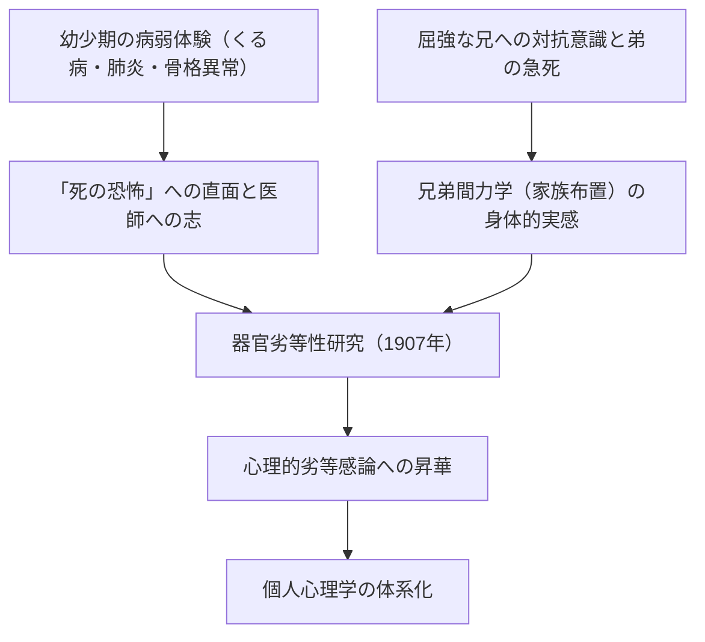
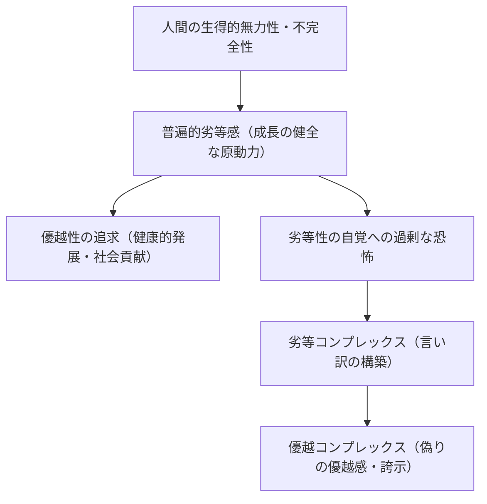
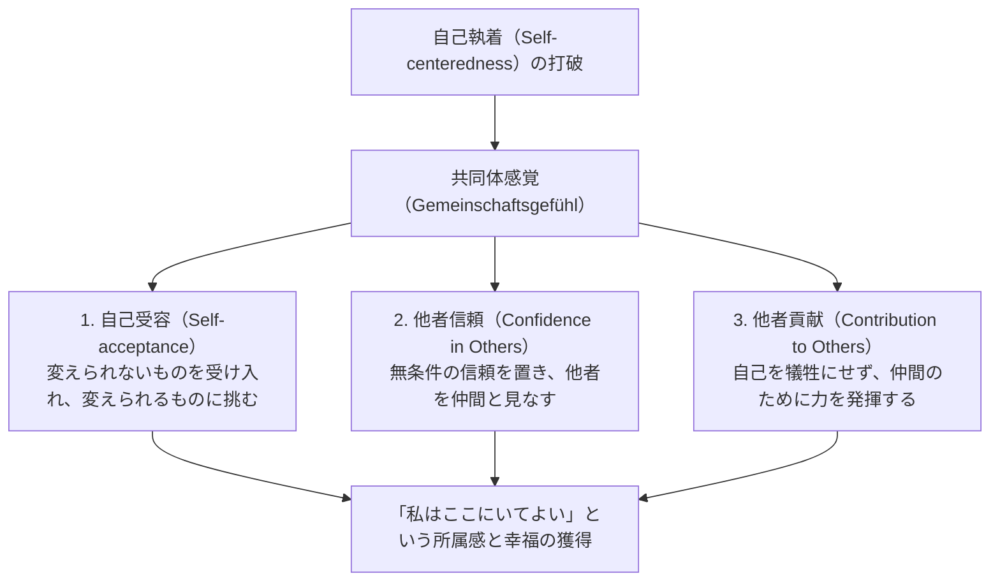
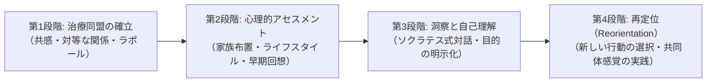

## 序論：なぜ今、アルフレッド・アドラーなのか

20世紀初頭のウィーンにおいて勃興した深層心理学の潮流の中で、アルフレッド・アドラー（Alfred Adler, 1870–1937）が確立した「個人心理学（Individual Psychology / 独: Individualpsychologie）」は、現代においてなお類を見ない強靭な実践性と先進性を放ち続けている。

ジークムント・フロイト（Sigmund Freud）が無意識の本能的衝動（リビドー）や過去のトラウマに基づく「精神決定論（Psychic Determinism）」を打ち立て、カール・グスタフ・ユング（Carl Gustav Jung）が元型と普遍的無意識の神話的深淵へと沈潜したのに対し、アドラーが切り拓いた地平は極めて明晰であり、徹底して「人間が生きる現実の社会と未来」に向けられていた。

アドラーの人間観の根底にあるのは、「人間は過去の出来事によって機械論的に操られる受動的な存在ではなく、自らが設定した目的に向かって主体的かつ創造的に生きる統合された存在である」という確信である。彼が自身の学派に冠した「Individual Psychology」という名称の「Individual」は、ラテン語の *individuus*（分割できないもの、不可分者）に由来する。すなわち、心を「意識と無意識」「理性と感情」「イド・エゴ・スーパーエゴ」といった対立する要素に切り刻む要素還元主義を真っ向から拒絶し、人間を全体として統一されたひとつの生命システム（全機性・全体論）として捉える思想であった。

```
【深層心理学三大潮流のパラダイム比較】

┌─────────────────┬───────────────────────────────┬───────────────────────────────┬───────────────────────────────┐
│ 学派 / 創始者   │ ジークムント・フロイト        │ カール・グスタフ・ユング      │ アルフレッド・アドラー        │
├─────────────────┼───────────────────────────────┼───────────────────────────────┼───────────────────────────────┤
│ 学派名          │ 精神分析（Psychoanalysis）    │ 分析心理学（Analytical Psych）│ 個人心理学（Individual Psych）│
│ 人間観          │ 機械論的・決定論的（トラウマ）│ 目的論的・元型論的（神話・霊）│ 主体論的・全体論的（目的論）  │
│ 心の構造        │ 意識 / 前意識 / 無意識（分割）│ 個人的無意識 / 普遍的無意識   │ 分割不能な統合体（全体論）    │
│ 根源的動機      │ リビドー（性・破壊衝動）      │ 心の全体性（自己実現・元型）  │ 優越性の追求・共同体感覚      │
│ 治療・アプローチ│ 過去の抑圧の想起・除反応      │ 夢分析・元型の統合・個性化    │ ライフスタイルの再定位・勇気づけ│
└─────────────────┴───────────────────────────────┴───────────────────────────────┴───────────────────────────────┘
```

アドラー心理学は、単なる臨床心理学の一流派にとどまらない。それは、人間が「いかにして劣等感を克服し、他者と協調し、所属感と幸福を獲得して生きていくべきか」という問いに答える、実践的な実存哲学であり、民主主義的な社会教育思想でもあった。本稿では、フロイトとの思想的闘争から出発し、目的論、劣等感と優越性の追求、ライフスタイル、人生の三つのタスク、共同体感覚、課題の分離、そして現代の認知行動療法（CBT）やポジティブ心理学へと連なるその理論体系の全貌を学術的厳密さをもって徹底的に解き明かす。

---

## 1. アドラーの生涯と個人心理学の形成史

### 1.1 幼少期の疾病体験と「器官劣等性」の原風景
アルフレッド・アドラーは1870年2月7日、オーストリア＝ハンガリー帝国の首都ウィーン近郊のペンツィングにおいて、ユダヤ系の穀物商の家庭に次男として生まれた。

アドラーの心理学を理解する上で不可欠なのは、彼自身の苛烈な幼少期の身体的体験である。アドラーは幼少期に激しい「くる病（佝僂病）」を患い、骨格の発達が遅れ、四歳になるまで満足に歩行することができなかった。さらに五歳の時には致死的な急性肺炎に罹患し、主治医が父親に対して「この子の命はもう助からない」と告げるのをベッドの中で耳にしたという。この極限状態から奇跡的に回復した瞬間、アドラーは「自分は病気を克服し、死の恐怖に立ち向かう医者になる」という確固たる目的（フィクション）を胸に刻んだ。

さらに、健康で運動能力に恵まれた兄ジークムントに対する強烈な対抗意識と劣等感、弟が生後まもなくベッドの中で急死した体験など、死と病、身体的脆弱性と兄弟間の比較という過酷な現実が、後に彼が提唱する「器官劣等性（Organ Inferiority）」や「劣等感（Inferiority Feeling）」、そして「家族布置（Family Constellation）」理論の揺るぎない原体験となった。



### 1.2 ウィーン水曜心理学会とフロイトとの決別（1902–1911）
ウィーン大学医学部を卒業したアドラーは、眼科医としてキャリアを開始し、後に一般内科医、そして精神科医へと転じた。プラター遊園地のサーカス芸人や職人、労働者階級の患者を数多く診察する中で、身体の特定の器官に先天的・後天的な弱点（器官劣等性）を抱える人間が、それを補うために他の器官や精神の働きを異常なまでに発達させる現象（過補償 / Overcompensation）に強い関心を抱くようになった。

1902年、フロイトの著書『夢判断』を新聞の書評で擁護したことを契機に、フロイトから招かれて毎週水曜日の夜にフロイト邸で開かれる小人数の研究会（「水曜心理学会」、後のウィーン精神分析協会）の創設メンバーとなった。アドラーは1910年にはウィーン精神分析協会の会長に就任し、フロイトの最も有力な後継者の一人と見なされていた。

しかし、両者の蜜月は長くは続かなかった。フロイトはすべての神経症の病因を「幼児期の性欲（リビドーの抑圧と固着）」に帰着させる汎性欲論（Pansexualism）に固執したのに対し、アドラーは人間行動の根底にあるのは性欲ではなく、「自己の弱さ・無力さを克服しようとする優越への意志」「攻撃性」「自己主張の欲求」であると主張した。

1911年、決定的な亀裂が生じる。ウィーン精神分析協会の例会において、アドラーは連続講演を行い、フロイトの性欲説を批判して自らの「男性抗争（Masculine Protest）」論を展開した。フロイトはアドラーの学説を「精神分析の核心を否定する異端」として激しく糾弾し、妥協を拒絶した。アドラーは協会の会長および機関誌の編集長を辞任し、彼に同調する9名の仲間とともに精神分析協会を脱退した。翌1912年、アドラーらは自らの学派を「自由精神分析協会」と名乗り、間もなく「個人心理学会（Society for Individual Psychology）」へと改称した。ここに、フロイトの精神分析と完全に訣別した「個人心理学」が正式に産声を上げたのである。

---

## 2. 目的論 vs 原因論：心理学のパラダイム転換

### 2.1 機械論的原因論（Causality）の限界とトラウマの否定
アドラー心理学の理論的骨格をなす最もラディカルな転換が、「原因論（Causality）」の徹底的批判と「目的論（Teleology）」の導入である。

フロイトに代表される古典的精神医学や近代科学は、アイザック・ニュートン的な「因果律」を人間の精神領域に適用した。すなわち、「過去の事象（A）が現在の状態（B）を引き起こした」という図式である。例えば、「幼少期に親から虐待を受け、愛情を受けずに育った（A）から、現在対人恐怖症になり、社会に適応できない（B）」と説明する。

これに対しアドラーは、このような機械論的原因論を鋭く批判した。アドラーによれば、過去の出来事それ自体が人間を決定するのではない。もし過去のトラウマが人間を不可避的に規定するならば、過酷な境遇で育った人間は例外なく同じ神経症を発症しなければならず、そこには人間の自由意志や回復の余地は存在し得ない。アドラーは次のように断言している。

> 「いかなる経験も、それ自体が成功や失敗の原因ではない。われわれは、自分の経験によるショック――いわゆるトラウマ――に苦しむのではなく、経験の中から自らの目的にかなうものを自ら見出し、それに意味を与えるのである」
> （*What Life Could Mean to You*, 1931）

```
【原因論と目的論の認識論的対比】

■ 原因論（フロイト的因果律・決定論）
過去の事実（親の虐待・失恋・失敗）
  -- "不可避的な因果的結合（外因決定）" -->
現在の結果（対人恐怖・引きこもり・無気力）
※人間は過去の操り人形であり、過去を変えられない以上、絶望的宿命論に陥る。

■ 目的論（アドラー的行為論・主体論）
現在の隠された目的（他者との衝突を避けたい、傷つきたくない）
  -- "目的を達成するための手段の選択（内因創造）" -->
現在の症状・感情の生成（不安・怒り・恐怖を自ら創出する）
※過去の事実は材料にすぎない。人間は「今の目的」のために過去の記憶を利用している。
```

### 2.2 目的論（Teleology）の構造と感情の「使用」
アドラーの目的論において、人間の行動や感情、さらには精神症状（不安、抑うつ、パニック、強迫）までもが、本人が無意識のうちに抱いている「隠された目的（Hidden Goal）」を達成するための「手段」として理解される。

例えば、「人前に出ると手足が震え、赤面し、話せなくなる」という社交不安障害の患者を考える。
- **原因論的説明**: 「過去に大勢の前で失敗して恥をかいたトラウマが原因で、無意識の恐怖条件付けが作動している」。
- **目的論的説明**: 「患者は『人前で恥をかきたくない』『もし失敗して自分の無能さが露呈したら耐えられない』という目的を抱いている。その目的を達成するために、自ら『赤面』や『震え』という身体症状を作り出し、『病気だから人前に出られない』という正当な口実（アリバイ）を獲得している」。

ここで重要なのは、感情（怒り、不安、悲しみ）は外から受動的に「襲ってくる」ものではなく、人間が自らの目的を果たすために「捏造し、使用している道具」であるという視点である。

アドラーは有名な「怒りの道具説」を提示している。母親が子どもに対して激しい怒りの形相で怒鳴りつけている最中、担任の教師から電話がかかってきたとする。母親は受話器を取った瞬間、極めて丁寧で穏やかな声色に切り替えて教師と会話し、電話を切った直後に再び激昂して子どもを怒鳴り散らした。もし怒りが生理的衝動として人間を乗っ取る不可抗力であるならば、数秒の間に冷静な対話へと移行することは不可能である。母親は「子どもを即座に屈服させ、言うことを聞かせたい」という目的のために、怒りという感情を意図的に立ち上げ、利用したのである。

アドラー心理学において、人間は感情の奴隷ではない。感情を自らの目的のために選択し、活用している主権者なのである。

---

## 3. 劣等感・劣等コンプレックス・優越性の追求

### 3.1 器官劣等性から普遍的劣等感へ
アドラーのキャリア初期の研究『器官劣等性の研究』（*Studie über Minderwertigkeit von Organen*, 1907）において、彼は身体的器官の機能的不完全性と、それに対する生体の補償作用を分析した。心臓や腎臓、感覚器に生得的な脆弱性を抱える個体は、中枢神経系の補償的努力を通じて、その欠陥を克服しようとする。

アドラーはこの生理学的・病理学的洞察を、精神の領域へと劇的に拡張した。人間という生物は、他の動物と比較して極めて無力で脆弱な状態で生まれてくる。鋭い牙も爪も、厚い毛皮も持たず、親の庇護なしには一日たりとも生き延びることができない。したがって、すべての人間は幼少期において、圧倒的な力を持つ大人たちに囲まれ、自らの無力さ、小ささ、不完全さを強烈に自覚せざるを得ない。

アドラーは、この無力感から脱却しようとする心理的緊張を「劣等感（Minderwertigkeitsgefühl / Inferiority Feeling）」と名付けた。極めて決定的なのは、アドラーにとって**劣等感そのものは病理ではなく、人間が進化し、成長するための極めて健全で普遍的な推進力（Engine of Growth）である**という点である。



### 3.2 劣等感 vs 劣等コンプレックスの厳密な概念区分
日常用語において「コンプレックス」という言葉は単なる劣等感と同義で使われがちであるが、アドラー心理学において「劣等感」と「劣等コンプレックス（Inferiority Complex）」は明確に区別される。

1. **劣等感（Inferiority Feeling）**:
   自らの現状と理想の状態とのギャップを認識することによって生じる主観的な不完全さの感覚。「自分はまだ知識が足りないからもっと勉強しよう」「技術が未熟だから練習しよう」というように、努力と研鑽を通じて課題を克服する健康的動機づけとなる。

2. **劣等コンプレックス（Inferiority Complex）**:
   劣等感を言い訳（口実）として利用し、人生の課題から逃避する病理的状態。「Aであるから、Bができない」という見かけの因果律（見せかけの因果性）を構築することである。「自分は学歴がないから成功できない」「容姿が優れていないから結婚できない」「親の育て方が悪かったから社会に出られない」。
   劣等コンプレックスに陥った人間は、自らの努力によって課題を解決することを放棄し、不都合な現実から自尊心を守るために自らの劣等性を盾にして立ち止まる。

### 3.3 優越コンプレックスと権力への意志の病理
劣等コンプレックスに苦しむ人間が、自らの劣等性を直視する苦痛に耐えかねたとき、しばしばその裏返しとして現れるのが「優越コンプレックス（Superiority Complex）」である。

優越コンプレックスとは、現実に努力して困難を克服するのではなく、「あたかも自分が優れているかのように見せかける偽りの優越性」に逃避する防衛機制である。具体的には以下のような形態をとる。

- **権威の誇示（借光）**: 有名人や権力者との個人的な繋がりを吹聴する、高級ブランド品や肩書で自己を武装する。
- **自慢話と過去の栄光への執着**: かつての武勇伝を語り続けることで、現在の無為無策を隠蔽する。
- **「不幸自慢」と弱者による支配**: 自らがいかに過酷な境遇にあり、傷つき、苦しんでいるかを延々と訴えることによって、周囲の同情を買い、他者を罪悪感で操作し、特別扱いを要求する。アドラーはこれを「弱さの特権化」と呼び、最も治療が困難な優越コンプレックスの一形態と見なした。

### 3.4 優越性の追求（Striving for Superiority）の健全な方向性
人間が劣等感を克服しようとする根源的動機を、アドラーは初期には「攻撃衝動」「権力への意志」「男性抗争」と呼んでいたが、晩年にはより包括的な「優越性の追求（Striving for Superiority / 向上への努力）」という概念へと昇華させた。

健全な優越性の追求とは、「他者との競争に勝ち、他者を打ち負かして支配すること」では断じてない。それは、**「他者と比較するのではなく、自己の理想像と比較し、自己の限界を一歩超えていくこと」**であり、水平な地平において他者と対等な存在として自己を高めていくプロセスである。優越性の追求が「垂直の序列（上下関係・支配被支配）」に向かうとき、それは神経症の温床となり、「水平の協調（共同体への貢献）」に向かうとき、それは創造的で健康的な自己実現となる。

---

## 4. 全体論とライフスタイル：個人の認知アーキテクチャ

### 4.1 全体論（Holism）：不可分の一体としての人間
アドラー心理学の第一の公理は「全体論（Holism）」である。近代合理主義の父ルネ・デカルト以来、西洋思想は精神と身体を二分する「心身二元論」に支配されてきた。精神医学においても、フロイトは心を「意識 / 無意識」「エゴ / イド / スーパーエゴ」という対立する構成要素に分割し、人間内部の葛藤（内的葛藤）をモデル化した。

アドラーはこの要素還元論を全面的に否定した。アドラーにおいて、人間は分割できない統一体（Individual = in + dividual）である。
- 「理性」と「感情」は対立しているのではない。感情は理性が目指す目的のために生み出され、理性と連動して機能している。
- 「意識」と「無意識」は敵対しているのではない。両者は同じひとつの目的に向かって協調して動く、同一のコインの表と裏にすぎない。無意識とは、単に「本人がまだ言語化・自覚していない目的の領域」を意味するにすぎない。
- 「心」と「身体」は独立した実体ではない。強い不安を感じたときに心拍数が上がり胃が痛むのは、心と身体がひとつの全体として危機に対応しようとしている現れである。

アドラー心理学では、「頭では分かっているが、感情が抑えられない」「無意識の欲求が理性に逆らって行動させた」という二元論的言い訳を認めない。「私が、その目的のために、怒りという感情を使って怒鳴った」というように、行為の主体としての全体的人間（Whole Person）に全責任を帰属させる。

```
【要素還元論（フロイト）と全体論（アドラー）の構造的差異】

■ 要素還元論（心的分断モデル）
┌─────────────────────────┐
│ 超自我（道徳・規範）   │
├─────────────────────────┤  ← 内的葛藤・分裂
│ 自我（現実適応の理性） │
├─────────────────────────┤  ← 抑圧と抵抗
│ イド（無意識の本能欲望）│
└─────────────────────────┘
※「本能のせいで理性が負けた」「無意識が私を操っている」という自己欺瞞が生じる。

■ 全体論（不可分統合モデル）
┌──────────────────────────────────────────────┐
│                  全体的人間（不可分の自己）                  │
│                                                              │
│  目的論的統一体：                                            │
│  理性・感情・意識・無意識・肉体はすべて                      │
│  「単一の隠された目標（ライフスタイル）」を達成するために協調動作する │
└──────────────────────────────────────────────┘
※すべての行動・感情の最終的責任は、統合された「私」に存在する。
```

### 4.2 ライフスタイル（Lifestyle）の定義と三要素
アドラー心理学において、性格、人格、世界観、認知パターンの総体を指す中心概念が「ライフスタイル（Lifestyle / 独: Lebensstil）」である。現代の認知療法における「スキーマ（Schema）」や「認知的構図」の先駆的概念である。

ライフスタイルとは、人間が幼少期（およそ4〜6歳頃まで）に、自らの身体的条件、家族環境、文化的文脈の中で生き抜くために自ら選択・構築した「世界と自己に対する意味づけの定型パターン」である。ライフスタイルは一度形成されると、無自覚のまま成人後のすべての知覚、思考、感情、行動をフィルタリングする羅針盤として機能する。

アドラー派心理学において、ライフスタイルは以下の三つの構成要素から成り立っている。

1. **自己概念（Self-concept）**:
   「私は〜である」という自分に対する確信・信念。「私は無力である」「私は賢い」「私は愛されない人間である」。
2. **自己理想（Self-ideal）**:
   「私は〜でなければならない」「私は〜であるべきだ」という主観的基準。「私は常に一番でなければならない」「私はすべての人に優しくされなければならない」「私は絶対に失敗してはならない」。
3. **世界観（Weltbild / Picture of the World）**:
   「他者や社会は〜である」という環境に対する確信。「世界は危険に満ちている」「他者は私を利用しようとする敵である」「人生は予測不能で不条理である」。

もしある人物の自己概念が「私は無力だ」、自己理想が「私は傷ついてはならない」、世界観が「周囲の人間は攻撃的で冷酷だ」というライフスタイルで構築されているならば、その人物はあらゆる対人関係において過剰に身構え、他者の些細な言動を敵意と解釈し、引きこもりや回避行動を選択することになる。これは病理的欠陥ではなく、その人物のライフスタイルからすれば完全に合理的で一貫した行動なのである。

### 4.3 早期回想（Early Recollections）の診断的意義
個人の無自覚なライフスタイルを客観的に浮き彫りにするための強力な臨床的技法として、アドラーが考案したのが「早期回想（Early Recollections）」の分析である。

早期回想とは、クライエントに対して「覚えている限りの最も幼い頃の記憶（通常6〜8歳以前の具体的なエピソード）」を想起させ、その情景、登場人物、自らの行動、そしてその時に感じた感情を詳細に語らせる技法である。

フロイトは幼少期の記憶を「過去の事実の痕跡」あるいは「抑圧されたトラウマの化石」として扱った。しかし、目的論に立つアドラーは、記憶を「現在のライフスタイルを正当化し、補強するために、無数の過去の出来事の中から自ら選別・再構成された創作物（ストーリー）」と捉えた。人間は過去をありのままに記憶しているのではない。現在の自らの目的にかなう記憶だけを保持し、都合よく色付けしているのである。

```
【早期回想の分析パラダイム】

・記憶の内容: 「5歳の時、庭の木から落ちて足を怪我した。母親が飛んできて抱きしめてくれた」
  ↓
・分析の視角:
  1. 能動的か受動的か？（自分から動いたか、何かが起きたのを待っていたか）
  2. 他者の役割は何か？（危険を放置した敵か、救助してくれる庇護者か）
  3. 自己の認識は何か？（無力で傷つきやすい存在）
  ↓
・抽出されるライフスタイル信念:
  「世界は危険に満ちている。私は油断すると傷つく無力な存在だ。
   しかし、弱さを示して助けを求めれば、他者は私を優しく保護してくれる」
  ↓
・現在の行動パターンとの整合性:
  困難に直面したとき、自力で解決せず、病気や弱さをアピールして他者の支援を引き出そうとする。
```

アドラーは「早期回想の真偽（それが客観的事実か、本人の幻想・勘違いか）はどうでもよい」と喝破した。重要なのは、その人物が**「なぜ数千ある幼少期の記憶の中から、わざわざその特定の情景を今なお記憶し続けているのか」**という点である。早期回想には、その人物が現在世界をどのように見つめ、どのような戦略で生き抜こうとしているかの「設計図」が凝縮されているのである。

---

## 5. 人生の三つのタスクと共同体感覚

### 5.1 人生の三つのタスク（Life Tasks）
アドラーは、人間が社会の中で生きていく上で避けて通ることのできない対人関係の課題を「人生のタスク（Life Tasks / 独: Lebensaufgaben）」として定式化した。アドラーはこれを「仕事のタスク」「交友のタスク」「愛のタスク」の三段階に分類した。

```
【人生の三つのタスクの階層性と難易度】

［愛のタスク（Love Task）］
・対象: パートナー、配偶者、家族との極めて緊密な関係
・要求水準: 最も高い心理的距離の近さと自己開示、運命の共有、平等の維持
・回避の口実: 束縛への恐怖、浮気、モラルハラスメント、完全主義

［交友のタスク（Friendship Task）］
・対象: 友人、隣人、地域社会、利害を超えた対等な仲間関係
・要求水準: 競争のない水平な信頼関係、利他性、相互の承認
・回避の口実: 「裏切られるのが怖い」「誰も自分を理解してくれない」

［仕事のタスク（Work Task）］
・対象: 職業活動、経済的生産、社会的分業のネットワーク
・要求水準: 規則の遵守、基本的協調性、成果へのコミット
・回避の口実: 失敗への恐怖、評価への怯え、先延ばし、対人恐怖
```

1. **仕事のタスク（Work Task）**:
   人間が生物として生存するために、社会的分業のネットワークに参加し、他者に役立つ価値を生産するタスク。三つの中では最も利害関係が明確であり、契約やルールによって行動が規定されるため、対人関係の難易度としては最も低いとされるが、ここから逃避すると経済的破綻や社会的不適応を招く。

2. **交友のタスク（Friendship Task）**:
   仕事のような直接の経済的利害関係を離れた、純粋な友人関係、仲間関係を築くタスク。互いに競争することなく、対等な人間として信頼し合い、弱さを開示し合える関係性が要求される。多くの人間がここで「他者に裏切られるのではないか」という猜疑心から人間関係を狭めてしまう。

3. **愛のタスク（Love Task）**:
   恋愛関係、夫婦関係、親子関係など、人生において最も親密で継続的な一対一の関係を結ぶタスク。心理的距離が極限までゼロに近づくため、自己の最も見せたくない弱点や欠陥が露呈する。相手を支配しようとしたり、相手の承認を過剰に求めたりすることなく、完全に対等なパートナーとして「二人の幸福」を追求することが求められるため、三つのタスクの中で最も難易度が高い。

アドラーによれば、すべての心理的問題（神経症、引きこもり、非行、うつ状態）は、これらの人生のタスクに直面したとき、失敗して自尊心が傷つくことを恐れるあまり、それらの課題から逃走（いわゆる「人生の嘘 / Life Lie」）しようとすることから発生する。

### 5.2 共同体感覚（Gemeinschaftsgefühl / Social Interest）の全貌
アドラー心理学の思想的頂点であり、最も深遠な概念が「共同体感覚（Gemeinschaftsgefühl / Social Interest）」である。直訳すれば「共同体感情」あるいは「共同体意識」であるが、英語圏では「Social Interest（社会的関心）」と訳されることが多い。

共同体感覚とは、**「自己に対する執着（Self-centeredness）を、他者に対する関心（Social Interest）へと切り替えること」**であり、他者を「敵」ではなく「仲間」として見なし、「自分には共同体の中に居場所がある」と感じられる所属感と安心感の境地である。

アドラーは、精神的健康の唯一絶対のバロメーターは共同体感覚の高さであると断言した。共同体感覚が欠如した人間は、世界を弱肉強食の戦場と捉え、他者を自らを脅かす敵か、利用すべき道具としか見なせない。そのため、常に孤独と不安に苛まれ、偽りの優越性を求めて神経症的葛藤に陥る。



### 5.3 共同体感覚を構成する三本柱
共同体感覚を実践的・臨床的次元へと落とし込むために、現代のアドラー派心理学ではこれを以下の三つの相互連動する要素として定式化している。

1. **自己受容（Self-acceptance）**:
   「自己肯定（ポジティブ・シンキング）」とは異なる。自己肯定が「できない自分にも『私はできる』と言い聞かせる自己欺瞞」であるのに対し、自己受容とは「できない自分、不完全な自分をありのままに受け入れた上で、変えられるものに対して全力を尽くす勇気」である。ニーバーの祈り（「神よ、変えられないものを受け入れる平静さと、変えられるものを変える勇気と、それらを見分ける知恵を与えたまえ」）に完全に通底する。

2. **他者信頼（Confidence in Others）**:
   「他者信用（Credit）」とは異なる。信用とは担保や実績、条件をつけて相手を信じることである（銀行の融資と同じ）。これに対し他者信頼とは、一切の担保や裏付けなしに、他者を無条件で信じることである。もちろん、裏切られるリスクは存在する。しかし、裏切られたとしても、それは「相手の課題」であり、自分が信頼を寄せるかどうかは「自分の課題」であると整理することによって、猜疑心の檻から脱却する。

3. **他者貢献（Contribution to Others）**:
   「自己犠牲（Self-sacrifice）」とは異なる。自らの命や生活を削って他者に尽くすのは、承認欲求に動機づけられた神経症的献身にすぎない。健全な他者貢献とは、「自分自身の存在意義と価値を実感するために、自らの能力を進んで共同体の仲間のために発揮すること」である。アドラーは、「幸福とは、貢献感である」と喝破した。他者に貢献しているという実感が、人間に対して「自分には価値がある」という確信を与え、生きる勇気の源泉となる。

---

## 6. 課題の分離と勇気の心理学

### 6.1 課題の分離（Separation of Tasks）の論理構造
アドラー心理学が人間関係のトラブルを根底から解消するための切れ味鋭いメスとして提示するのが「課題の分離（Separation of Tasks）」である。

あらゆる対人関係の軋轢、衝突、ストレスは、「他者の課題に土足で踏み込むこと」、あるいは「自分の課題に他者を土足で踏み込ませること」によって発生する。

アドラーは、課題を峻別するための極めて単純明快な基準を提示した。
**「その選択によってもたらされる結末（結果）を、最終的に引き受けるのは誰か？」**

```
【課題の分離の具体例：子どもの勉強問題】

・親の思考（課題の混同）:
  「子どもが勉強しないと将来困るから、無理矢理にでも勉強させなければならない」
  → 子どもの課題に親が強権的に介入（支配・コントロール）。
  → 子どもは反発し、勉強を「親を困らせるための武器」として利用し始める。

・課題の分離に基づく整理:
  1. 「勉強するかしないか、その結果成績が落ちて志望校に行けなくなる結末を引き受けるのは誰か？」
     → 最終的な結果を引き受けるのは【子ども自身】である（子どもの課題）。
  2. 親ができることは何か？
     → 「勉強しろ」と命じることではなく、子どもが学びたいと思ったときにいつでも援助できる環境を整え、
        「あなたの力を信じて見守っている」という姿勢を伝えること（支援の準備と見守り）。
```

課題の分離は、決して他者への冷淡な無関心や放任（ネグレクト）を意味しない。放任とは、子どもが何をしているのか知らず、関心も払わないことである。アドラーの支援スタイルは、「馬を水辺に連れていくことはできるが、水を飲ませることはできない」という諺に集約される。水を飲むかどうかを決めるのは馬（本人）であり、他者が喉をこじ開けて水を流し込むことは暴力であり支配に他ならない。

### 6.2 承認欲求の否定と「自由」の定義
課題の分離を徹底的に推し進めた帰結として、アドラー心理学は現代社会を覆い尽くす「承認欲求（Desire for Approval）」を断固として否定する。

アドラーによれば、「他者から認められたい」「褒められたい」「評価されたい」という承認欲求に駆られて生きる人間は、実質的に「他者の人生」を生きているにすぎない。なぜなら、他者の評価を気にするということは、「他者が自分をどう評価するか」という【他者の課題】を、自分がコントロールしようとする不可能な試みだからである。

アドラー心理学における「自由」とは、**「他者から嫌われることを恐れないこと」**である。
八方美人に振る舞い、すべての人に好かれようとすることは、不誠実であり、自らのライフスタイルを偽り続ける苦行である。自分が正しいと信じる道を歩むこと、その結果として他者が自分を好むか嫌うかは「他者の課題」であり、自分には関知し得ない領域である。他者からの評価に依存せず、自らの良心と共同体への貢献感に基づいて自律的に行動することこそが、真の精神的自由の条件である。

---

## 7. 勇気づけ（Encouragement）と民主的教育論

### 7.1 賞罰教育の全面批判：褒めることの危険性
アドラー心理学の臨床・教育論において最も衝撃的な提言のひとつが、「賞罰教育（褒めることと叱ること）の全面禁止」である。

一般的な子育てや企業マネジメントにおいて、「褒めて伸ばす」というアプローチが称揚されることが多い。しかし、アドラーは「褒める」という行為の本質を鋭く見抜いた。「褒める」という行為には、必ず**「能力のある人間が、能力のない人間を下に見下ろして評価・操縦する」という垂直関係（上下関係）**が内在している。大人が大人に対して対等な立場で「よくできました」「偉いですね」と褒めることが極めて不自然で失礼に感じられるのは、そこに上下の力関係が存在するからである。

```
【「褒める・叱る」と「勇気づけ」のパラダイム対比】

┌─────────────────┬───────────────────────────────┬───────────────────────────────┐
│ 項目            │ 賞罰教育（褒める / 叱る）     │ 勇気づけ（Encouragement）     │
├─────────────────┼───────────────────────────────┼───────────────────────────────┤
│ 人間関係の前提  │ 垂直関係（上下・支配・操作）  │ 水平関係（対等・尊敬・信頼）  │
│ 評価の基準      │ 結果・能力・他者との比較      │ プロセス・意図・自己との比較  │
│ 相手に生じる心理│ 承認欲求・失敗への恐怖・依存  │ 自信・自律性・貢献感・自己効力│
│ 動機づけの性質  │ 外発的（褒美のため、罰の回避）│ 内発的（共同体への自発的貢献）│
│ 具体的な声かけ  │ 「偉いね！」「100点取って凄い」│ 「手伝ってくれてありがとう」「嬉しいよ」│
└─────────────────┴───────────────────────────────┴───────────────────────────────┘
```

アドラーによれば、「褒める」ことの最大の弊害は、子どもや部下に「褒められなければ行動しない」「他者の評価がなければ自分の価値を感じられない」という深刻な承認欲求中毒を植え付ける点にある。さらに、褒められないこと自体を「罰」として認識するようになり、失敗を極度に恐れて挑戦を避けるようになる。

一方、「叱る」ことはさらに暴力的である。叱責とは、建設的な言葉による対話を放棄し、感情（怒り）という安易な権力を使って相手を屈服させようとする未熟なコミュニケーション手段にすぎない。叱責された側は、自らの非を心から反省するのではなく、「見つからないように隠蔽しよう」「どうやって仕返ししようか」という防衛と復讐の心理を肥大化させる。

### 7.2 勇気づけ（Encouragement）の技法と水平な関係
賞罰に代わるアプローチとしてアドラーが提示したのが「勇気づけ（Encouragement）」である。
勇気づけとは、**「困難を克服する活力（勇気）を相手の内面から引き出す援助」**であり、対等な「水平関係」に基づいて行われる。

勇気づけの核心的技法は以下の通りである。

1. **感謝と喜びの表明（「ありがとう」「嬉しい」）**:
   相手を上からジャッジ（評価）するのではなく、相手の行為が自分や共同体に対していかに役立ったかという主観的感情を伝える。「手伝ってくれて助かったよ」「あなたがいてくれて本当に嬉しい」。これにより、相手は「自分には他者に貢献できる力がある」「自分には価値がある」という確信（自己効力感）を抱く。
2. **プロセスと意図への着目**:
   テストの点数や営業成績といった「結果」ではなく、そこに至るまでの「努力の過程」や「試み」に着目する。「最後まで諦めずに粘り強く取り組んだね」「この部分を工夫したんだね」。失敗したときこそ最大の勇気づけの好機であり、「今回の失敗から何を学べるか」を対等に話し合う。
3. **欠点ではなく強みの着目（リフレーミング）**:
   「飽きっぽい」を「好奇心旺盛で切り替えが早い」、「頑固」を「自分の意志を貫く力がある」というように、本人が劣等感を抱いている特徴をポジティブな文脈へと再定義する。

### 7.3 ウィーンにおける児童相談所運動と公教育改革
アドラーの理論は、象牙の塔の抽象論にとどまらず、巨大な社会的実践として展開された。第一次世界大戦後、オーストリア革命によって社会民主党が市政を掌握した「赤いウィーン（Red Vienna）」において、アドラーはウィーン市の教育委員会と連携し、公立学校内に30箇所以上もの「児童相談所（Child Guidance Clinics）」を開設した。

アドラーの児童相談所は、医師、教師、親、そして子ども自身が対等な立場で車座になり、公開の場で教育相談を行う画期的なシステムであった。アドラーは、家庭や学校における独裁的・権威主義的な支配を解体し、民主的で協力的なコミュニティを育むことこそが、次世代の神経症や非行、そして戦争を防ぐ唯一の道であると信じていた。このウィーンでの実践は、現代の学校心理学やスクールカウンセリングの直接の先駆となった。

---

## 8. アドラー派臨床カウンセリングの技法とプロセス

### 8.1 治療関係の確立：対等な同盟関係（Collaborative Alliance）
精神分析における治療関係は、カウチ（寝椅子）に横たわる患者と、その背後に座って沈黙を守り解釈を下す分析医という、非対称で権威的な構造を持っていた。

アドラー派カウンセリングは、この構図を根底から転換した。カウンセラーとクライエントは、同じ高さの椅子に向かい合って座る。両者は「対等な共同研究者」であり、クライエントの人生という難問を解き明かすための「パートナーシップ（同盟関係）」を結ぶ。カウンセラーは全知全能の指導者ではなく、クライエントが自らの力で人生の課題を解決していくプロセスを伴走するファシリテーターである。



### 8.2 心理的アセスメント：家族布置（Family Constellation）
アセスメントの段階において、アドラー派が最も重視するのが「家族布置（Family Constellation / 家族構造）」の分析である。

アドラーは、子どもがどのようなライフスタイルを獲得するかは、兄弟姉妹の中での出生順位（Birth Order）と、それに対する主観的解釈に極めて強く影響されることを発見した。

- **第一子（長子）**: かつて親の愛情を独占していたが、第二子の誕生によって「王座から転落した君主」の体験を持つ。過去の栄光を懐かしみ、秩序、権威、ルールを重んじる傾向が強い。責任感が強く保守的になりやすい。
- **第二子（中間子）**: 生まれた時から先を走るライバル（第一子）が存在するため、常に「エンジン全開の競走状態」にある。第一子とは異なる領域で優位に立とうとし、反逆的、革新的、あるいは協調的になりやすい。
- **末子（最年少子）**: 決して王座から転落することがなく、家族全員から甘やかされるか、あるいは全員を追い越そうとする野心家になる。「自分は何もしなくても愛されるべきだ」という依存的ライフスタイルを形成しやすい。
- **単独子（一人っ子）**: 競争相手がおらず、常に大人の世界に囲まれて育つ。自己中心的になりやすい一方で、大人びた知性と高い能力を発揮することもある。

重要なのは、出生順位そのものが人間を決定するのではなく、**「その位置関係において、子どもが親の関心と居場所を確保するためにどのような生存戦略（ライフスタイル）を自ら選び取ったか」**という点である。

### 8.3 ソクラテス式対話（Socratic Dialogue）と洞察
アドラー派の介入は、説教や一方的な指示ではなく、古代ギリシャの哲学者ソクラテスの産婆術に倣った「ソクラテス式対話（Socratic Dialogue）」によって進められる。

カウンセラーは、「なぜあなたはそうしたのか？」という過去を詰問する問い（原因論の問い）を決して発しない。代わりに、「その行動をとることで、あなたは何を得ようとしているのか？」「もしその症状が完全に消え去ったら、あなたの生活はどう変わるか？」という目的論的問いを投げかける。

これにより、クライエントは自らが無意識のうちに維持してきた「人生の嘘」や「偽りの目的」に自ら気づき、直面することになる。アドラー派の洞察とは、単なる知的理解ではなく、「自らの人生の脚本を執筆しているのは他ならぬ自分自身である」という主体的自覚（Author of One's Life）の獲得である。

### 8.4 再定位（Reorientation）：新しい行動の実験
最終段階である「再定位（Reorientation / 方向転換）」において、クライエントは古い非建設的なライフスタイルを捨て、共同体感覚に基づいた新しい生き方を選択・実践する。

アドラー派では、言葉だけのカウンセリングルームに閉じこもることを嫌い、現実の日常生活における「具体的な行動の実験」を課す。
- 挨拶をしなかった隣人に、明日から笑顔で挨拶してみる。
- パートナーに対して、批判する代わりに「感謝の言葉」を伝えてみる。
- 完璧主義を捨て、仕事の完成度を80%の段階で一度他者に見せてフィードバックを求める。

アドラーは「性格（ライフスタイル）を変えることは、いつでも可能である」と説いた。人間は自らのライフスタイルをいつでも再選択できる。必要なのは能力ではなく、**「変わることへの勇気（Courage to Change）」**だけなのである。

---

## 9. 現代思想・認知行動療法（CBT）・ウェルビーイングへの影響

### 9.1 認知行動療法の隠れた先駆者としてのアドラー
20世紀後半から現代にかけて世界の精神医療・心理療法のゴールドスタンダードとなった「認知行動療法（CBT）」。その創始者であるアルバート・エリス（Albert Ellis / 論理情動行動療法: REBT）とアーロン・ベック（Aaron T. Beck / 認知療法: CT）は、共にアドラーから絶大な直接的影響を受けたことを公言している。

アルバート・エリスは「アドラーこそがおそらく現代の認知療法の真の創始者である」と明言し、エリスの有名な「ABC理論（Activating Event = 出来事、Belief = 信念・認知、Consequence = 結果・感情行動）」は、アドラーのライフスタイル理論そのものの現代的翻案である。

```
【アドラー心理学と認知療法の系譜的連関】

［エピクテトス（ストア派哲学）］
「人間を不安にするのは事柄そのものではなく、事柄に対する人間の見解（判断）である」
  ↓
［アルフレッド・アドラー（個人心理学, 1912〜）］
・目的論：出来事ではなく「意味づけ（見解）」が感情・行動を決定する。
・ライフスタイル：幼少期に形成された「認知的構図（スキーマ）」。
・個人の主体的責任と再定位。
  ↓
［アルバート・エリス（論理情動行動療法, 1955〜）］
・ABC理論（不合理な信念・イラショナルビリーフの反駁）
［アーロン・ベック（認知療法, 1960年代〜）］
・自動思考、中核信念（Core Beliefs）、認知的歪み（Cognitive Distortions）の修正
```

ベックが定式化した「認知の歪み（二者択一思考、破局化、過度の一般化、心のフィルター）」は、アドラーが1910〜20年代にすでに記述していた「私的論理（Private Logic）」の構造的欠陥と完全に一致している。アドラー心理学は、現代の認知療法の源流であり、精神力動的深層心理学と認知行動療法の間の架け橋となったのである。

### 9.2 実存主義・プラグマティズム哲学との共鳴
アドラーの人間観は、哲学史的にはアメリカの「プラグマティズム（Pragmatism / 実用主義）」およびヨーロッパの「実存主義（Existentialism）」と深く共鳴している。

アドラーはハンス・ファイヒンガー（Hans Vaihinger）の著書『「かのように」の哲学』（*Die Philosophie des Als Ob*, 1911）から決定的な理論的インスピレーションを受けた。人間は客観的な真理や究極の現実にアクセスすることはできず、自らが構築した「仮構（Fiction / まるで〜であるかのごとき仮説）」に従って行動している。アドラーはこの概念を心理学に応用し、人間の行動を方向づける目標は客観的実在ではなく、「主観的に捏造された最終目標（フィクション）」であるとした。

また、ジャン＝ポール・サルトル（Jean-Paul Sartre）が「人間は自由という刑に処せられている」「実存は本質に先立つ」と宣言した実存主義哲学と、アドラーの「過去の因果律からの解放と自己決定の責任」は驚くほど一致している。アドラーは、人間が自らの運命に言い訳をすることを一切許さず、いかなる過酷な状況においても自らの態度を選択する自由（ヴィクトール・フランクルのロゴセラピーの核心概念）を擁護し続けた実存的心理学者であった。

### 9.3 ポジティブ心理学とウェルビーイング研究への先駆
マーティン・セリグマン（Martin Seligman）らが1990年代末に提唱した「ポジティブ心理学」において、中核概念とされる「幸福の持続モデル（PERMAモデル: Positive Emotion, Engagement, Relationships, Meaning, Accomplishment）」は、アドラーの共同体感覚（所属感、他者貢献、課題の克服）の現代的実証研究と言っても過言ではない。

近年の神経科学や社会心理学の実証研究（ソーシャル・キャピタル論、利他行動とオキシトシン分泌の連関、主観的ウェルビーイングの決定要因）は、「他者への貢献と良好な人間関係こそが人間の幸福と寿命の最大の予測因子である」という結論を次々と導き出している。アドラーが100年前に臨床的直観と哲学的一貫性から導き出した「共同体感覚」という命題は、21世紀の最先端科学によってその正しさが強力に裏付けられつつある。

---

## 10. 結論：自己決定と勇気の実践哲学

アルフレッド・アドラーの個人心理学が現代人に与える最も強烈なメッセージは、**「人生はいつでも、ここからやり直すことができる」**という徹底した希望と覚悟の哲学である。

現代社会は、遺伝子決定論、神経科学的還元主義、あるいは経済的格差や親ガチャといった「環境決定論」の言説に満ち溢れている。「自分はこの遺伝子だから」「この親に育てられたから」「この社会構造が悪いから」という原因論的ナラティブは、一時的には傷ついた自尊心を慰めてくれるかもしれない。しかし、それは同時に、自らを「過去と環境の哀れな犠牲者」という無力な客体へと永久に縛り付ける精神の牢獄でもある。

アドラー心理学は、そのような安易な被害者意識の麻薬を容赦なく奪い去る。
過去に何があったかは関係ない。親がどうであったかも関係ない。大切なのは、「与えられたものをどう使うか」である。

> 「遺伝や環境が人間に何を与えたかではない。人間が与えられた素材を使って、自らをいかに創り上げるかが問題なのだ」
> （*What Life Could Mean to You*）

アドラーの教えは、時に厳しく、耳を塞ぎたくなるような直言を含む。しかし、その厳しさの裏には、人間に対する無限の信頼と温かい尊敬の眼差しが注がれている。人間は誰しも、自らの手で人生の物語を紡ぎ直す「創造の力」を持っている。他者との不毛な比較競争を降り、承認欲求の奴隷から脱却し、隣人を仲間として信じ、自らの力を共同体のために差し出すこと。その最初の一歩を踏み出すための精神の筋力――それこそが、アドラーの遺した「勇気（Courage）」という名の永遠の遺産なのである。
