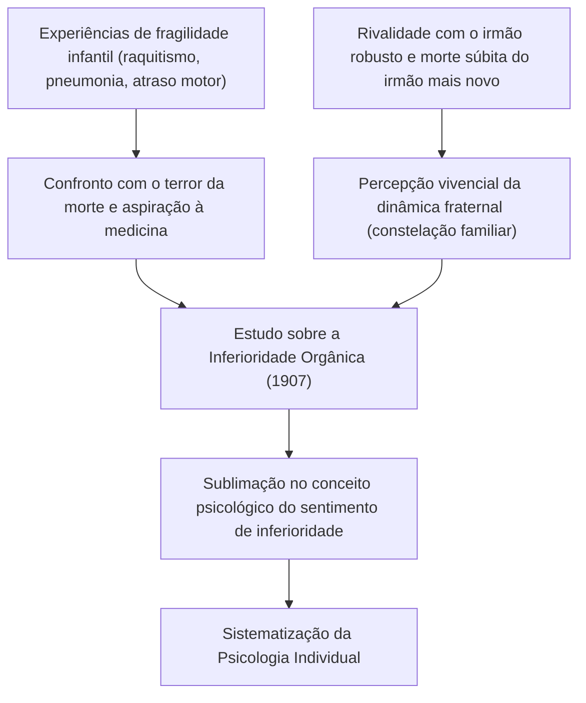
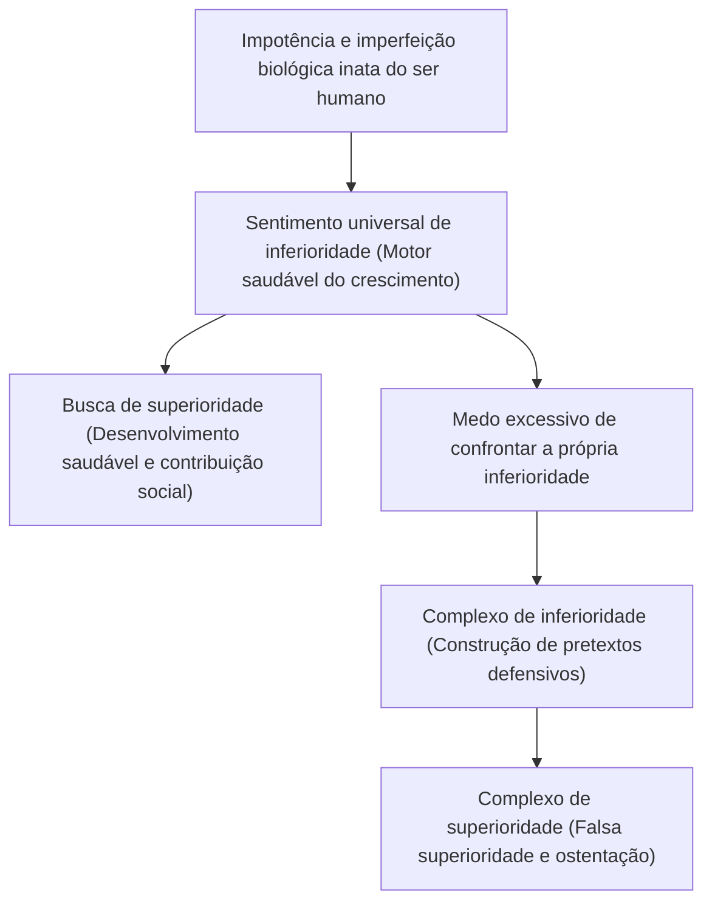
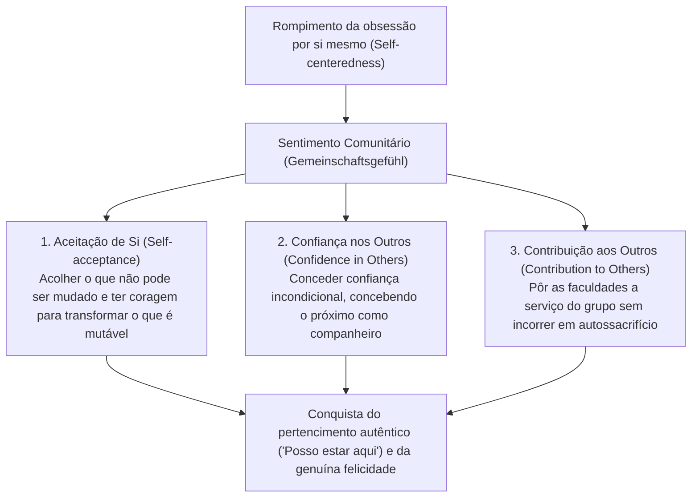
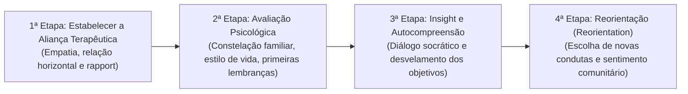

## Introdução: Por que Alfred Adler hoje?

Em meio à efervescência das correntes da psicologia profunda que emergiram em Viena no início do século XX, a "Psicologia Individual" (em alemão: *Individualpsychologie* / em inglês: *Individual Psychology*), fundada por Alfred Adler (1870–1937), continua a irradiar uma praticidade contundente e uma vanguarda sem precedentes na contemporaneidade.

Enquanto Sigmund Freud formulou o "determinismo psíquico" (*Psychic Determinism*) fundamentado nas pulsões instintivas inconscientes (libido) e nos traumas pretéritos, e Carl Gustav Jung mergulhou nos abismos míticos dos arquétipos e do inconsciente coletivo, os horizontes descortinados por Adler foram extraordinariamente lúcidos e voltados de maneira irredutível para "a sociedade real e o futuro nos quais os seres humanos vivem".

No cerne da concepção humana adleriana reside a convicção inabalável de que "o ser humano não é uma entidade passiva manipulada de forma mecanicista pelos acontecimentos do passado, mas sim um ser integrado que vive de maneira autônoma, proativa e criativa em direção a metas por ele próprio estabelecidas". O termo *Individual* que designa sua escola deriva do latim *individuus* (aquilo que não pode ser dividido, o indivisível). Em outros termos, Adler recusou frontalmente o reducionismo mecanicista que retalha a psique em instâncias antagônicas como "consciente e inconsciente", "razão e emoção" ou "id, ego e superego", concebendo o ser humano como um sistema vital único, unificado e total (holismo / totalidade organísmica).

```
[Comparação Paradigmática das Três Grandes Correntes da Psicologia Profunda]

┌───────────────────────┬───────────────────────────────┬───────────────────────────────┬───────────────────────────────┐
│ Escola / Fundador     │ Sigmund Freud                 │ Carl Gustav Jung              │ Alfred Adler                  │
├───────────────────────┼───────────────────────────────┼───────────────────────────────┼───────────────────────────────┤
│ Nome da Escola        │ Psicanálise (Psychoanalysis)  │ Psicologia Analítica          │ Psicologia Individual         │
│                       │                               │ (Analytical Psychology)       │ (Individual Psychology)       │
│ Concepção Humana      │ Mecanicista e determinista    │ Teleológica e arquetípica     │ Subjetivista e holística      │
│                       │ (Trauma)                      │ (Mito e transcendência)       │ (Teleologia)                  │
│ Estrutura da Mente    │ Consciente / Pré-consciente / │ Inconsciente Pessoal /        │ Totalidade indivisível        │
│                       │ Inconsciente (Cindida)        │ Inconsciente Coletivo         │ (Holismo)                     │
│ Motivação Primordial  │ Libido                        │ Totalidade da psique          │ Busca de superioridade /      │
│                       │ (Pulsões sexuais e de morte)  │ (Autorrealização / Arquétipo) │ Sentimento comunitário        │
│ Abordagem Terapêutica │ Recordação e ab-reação de     │ Análise de sonhos, integração │ Reorientação do estilo de     │
│                       │ repressões passadas           │ arquetípica e individuação    │ vida e encorajamento          │
└───────────────────────┴───────────────────────────────┴───────────────────────────────┴───────────────────────────────┘
```

A psicologia adleriana transcende em muito as fronteiras de uma mera escola de psicologia clínica. Ela constitui tanto uma filosofia existencial pragmática quanto uma pedagogia social democrática que responde à indagação primordial: "Como o ser humano pode superar o sentimento de inferioridade, cooperar com seus semelhantes, adquirir um genuíno sentimento de pertencimento e viver com plenitude e felicidade?". O presente ensaio investiga exaustivamente, com rigor conceitual e acadêmico, todo o edifício teórico adleriano: desde o embate com o pensamento freudiano, a teleologia em oposição ao causalismo, a dinâmica do sentimento de inferioridade e a busca de superioridade, a arquitetura do estilo de vida, as três grandes tarefas da vida, o sentimento comunitário e a separação de tarefas, até os desdobramentos na terapia cognitivo-comportamental (TCC) e na psicologia positiva moderna.

---

## 1. A Vida de Adler e a História da Formação da Psicologia Individual

### 1.1 As Experiências de Enfermidade na Infância e a Paisagem Original da "Inferioridade de Órgão"
Alfred Adler nasceu em 7 de fevereiro de 1870 em Penzing, um subúrbio de Viena, capital do Império Austro-Húngaro, sendo o segundo filho de uma família de comerciantes de cereais de origem judaica.

Para a compreensão acurada da psicologia adleriana, é imperativo revisitar as severas provações físicas vivenciadas por Adler em sua meninice. Ele padeceu na infância de um raquitismo grave que retardou seu desenvolvimento ósseo e o impediu de caminhar normalmente até os quatro anos de idade. Aos cinco anos, foi acometido por uma pneumonia aguda letal; reza a história que, do leito da enfermidade, ouviu o médico dizer ao seu pai que a criança não sobreviveria. Ao escapar milagrosamente das garras da morte, Adler gravou em seu âmago um objetivo resoluto (uma ficção orientadora): "Vou me curar, superar a doença e me tornar médico para lutar contra o terror da morte".

A essas agruras somaram-se uma intensa rivalidade e sentimento de inferioridade diante de seu irmão mais velho, Sigmund — saudável e fisicamente atlético —, bem como a traumática morte prematura de seu irmão mais novo, que faleceu subitamente ao seu lado na cama ainda bebê. A morte, a doença, a precariedade biológica e a constante comparação entre irmãos forjaram a experiência primordial incontestável que fundamentaria suas futuras teorias sobre a "Inferioridade de Órgão" (*Organ Inferiority* / *Organminderwertigkeit*), o "Sentimento de Inferioridade" (*Inferiority Feeling* / *Minderwertigkeitsgefühl*) e a "Constelação Familiar" (*Family Constellation*).



### 1.2 A Sociedade Psicológica das Quartas-Feiras e o Rompimento com Freud (1902–1911)
Após diplomar-se pela Faculdade de Medicina da Universidade de Viena, Adler iniciou sua carreira clínica como oftalmologista, migrando subsequentemente para a clínica médica geral e, mais tarde, para a neuropsiquiatria. Ao tratar pacientes de classes populares — como artistas circenses do parque Prater, artífices e operários —, Adler começou a observar com enorme fascínio como indivíduos portadores de debilidades inatas ou adquiridas em órgãos específicos (inferioridade orgânica) desenvolviam de forma prodigiosa outras faculdades orgânicas ou capacidades psíquicas como mecanismo de compensação (sobrecompensação / *Overcompensation*).

Em 1902, após publicar uma resenha em um periódico vienense defendendo a célebre obra de Freud, *A Interpretação dos Sonhos*, Adler foi pessoalmente convidado por Freud a ingressar no restrito grupo de estudos que se reunia às quartas-feiras à noite na residência deste (a "Sociedade Psicológica das Quartas-Feiras", precursora da Associação Psicanalítica de Viena), tornando-se um de seus membros fundadores. Em 1910, Adler assumiu a presidência da Associação Psicanalítica de Viena, sendo amplamente reconhecido como um dos sucessores intelectuais mais proeminentes de Freud.

Contudo, a harmonia entre ambos teve fôlego curto. Enquanto Freud insistia em reduzir a etiologia de todas as neuroses ao pansexualismo (*Pansexualism*) — fundamentado na repressão e fixação da libido na infância remota —, Adler sustentava com firmeza que o motor primordial do comportamento humano não residia nas pulsões sexuais, mas sim na "vontade de superar a fraqueza e o desamparo em direção à superioridade", na "agressividade" e na necessidade de autoafirmação.

Em 1911 deu-se a ruptura irremediável. Durante as assembleias da Associação Psicanalítica de Viena, Adler proferiu uma série de conferências contundentes, criticando a teoria sexual freudiana e delineando sua tese do "Protesto Masculino" (*Masculine Protest*). Freud condenou severamente as formulações de Adler, tachando-as de heresia inadmissível que negava o núcleo fundamental da psicanálise, e recusou qualquer conciliação. Adler renunciou à presidência da Associação e ao cargo de editor-chefe de seu periódico, retirando-se da sociedade acompanhado por nove partidários. No ano seguinte, em 1912, fundaram a "Sociedade para a Psicanálise Livre", rebatizada pouco depois como "Sociedade de Psicologia Individual" (*Society for Individual Psychology* / *Gesellschaft für Individualpsychologie*). Nascia ali, formal e definitivamente apartada da psicanálise freudiana, a "Psicologia Individual".

---

## 2. Teleologia vs. Causalidade: A Mudança de Paradigma na Psicologia

### 2.1 Os Limites da Causalidade Mecanicista e a Rejeição do Conceito de Trauma
A virada epistemológica mais radical que alicerça o arcabouço teórico da psicologia adleriana consiste na crítica implacável ao "causalismo" (*Causality* / determinismo causal) e na adoção irrestrita da "teleologia" (*Teleology* / ciência das finalidades).

A psiquiatria clássica e a ciência moderna, representadas com vigor por Freud, transpuseram o modelo da causalidade newtoniana diretamente para a dimensão anímica humana. Trata-se do esquema linear em que "o evento pretérito (A) é a causa motriz do estado presente (B)". Por exemplo, sustenta-se que: "Porque o indivíduo sofreu abusos e privação afetiva dos pais na infância (A), desenvolveu fobia social no presente e tornou-se incapaz de se adaptar à sociedade (B)".

Adler desconstruiu incisivamente esse causalismo mecanicista. Em sua ótica, os fatos pretéritos jamais determinam o ser humano de modo inexorável. Se os traumas do passado determinassem a vida de forma inescapável, todo indivíduo criado sob circunstâncias adversas desenvolveria forçosamente o mesmíssimo quadro neurótico, suprimindo qualquer margem para o livre-arbítrio, a agência e a reabilitação humana. Adler assevera com clareza lapidar:

> "Nenhuma experiência é por si mesma a causa de nosso sucesso ou fracasso. Nós não sofremos com o choque de nossas experiências — o chamado trauma —, mas extraímos delas exatamente aquilo que convém aos nossos propósitos presentes e lhes conferimos significado."
> (*What Life Could Mean to You*, 1931)

```
[Contraste Epistemológico entre Causalismo e Teleologia]

■ Causalismo (Causalidade e Determinismo Freudiano)
Fatos do Passado (Abuso parental, desilusões amorosas, fracassos)
  -- "Nexo causal inevitável (Determinação externa)" -->
Resultados no Presente (Fobia social, isolamento, apatia)
* O ser humano é tratado como mero fantoche do passado; como o passado é imutável, recai-se no fatalismo desesperador.

■ Teleologia (Teoria da Ação e Subjetividade Adleriana)
Objetivo Oculto no Presente (Desejo de evitar confrontos com os outros, medo de ser ferido)
  -- "Escolha de meios para atingir o objetivo (Criação interna)" -->
Geração de Sintomas e Emoções no Presente (Produção deliberada de ansiedade, raiva e medo)
* Os fatos do passado são meros materiais brutos. O ser humano utiliza as memórias passadas em prol de seus "objetivos atuais".
```

### 2.2 A Estrutura da Teleologia e o "Uso" Instrumental das Emoções
Sob a ótica teleológica de Adler, as condutas, as emoções e até os sintomas psiquiátricos mais angustiantes (ansiedade, depressão, pânico, rituais obsessivos) são decifrados como "meios" mobilizados pelo sujeito para alcançar um "objetivo oculto" (*Hidden Goal*) forjado em sua subjetividade.

Tome-se como ilustração um paciente com fobia social cujas mãos tremem, o rosto ruboriza e a voz desaparece diante de uma audiência:
- **Explicação Causalista**: "Um condicionamento aversivo inconsciente atua no presente em decorrência de um trauma pretérito no qual o sujeito passou vergonha ao falar em público".
- **Explicação Teleológica**: "O indivíduo nutre a meta oculta de 'não passar vergonha' e 'evitar a exposição insuportável de sua eventual incapacidade'. Para concretizar essa finalidade protetiva, ele próprio fabrica as respostas fisiológicas do rubor e do tremor, conquistando um salvo-conduto irrefutável (um álibi): 'Estou doente, logo não posso me expor em público'".

O postulado capital dessa abordagem é que as emoções (ira, angústia, tristeza) não "assaltam" passivamente o indivíduo a partir de forças externas incontroláveis, mas representam "instrumentos forjados e utilizados" ativamente pelo sujeito para fazer valer suas próprias finalidades.

Adler ilustra esse fenômeno com a célebre metáfora da mãe e da chamada telefônica: imagine uma mãe repreendendo o filho aos berros, dominada por uma fúria tempestuosa. Nesse instante, toca o telefone; é o professor da escola da criança. Ao atender ao fone, a mãe modula instantaneamente a voz para um tom aveludado, afável e calmo, conversando educadamente. Encerrada a chamada, ela retoma no mesmo segundo os gritos inflamados contra o filho. Se a raiva fosse uma erupção fisiológica incontrolável que sequestra a consciência, seria impossível efetuar uma transição tão fulminante para a serenidade racional. A mãe acionou intencionalmente a emoção da cólera como ferramenta para atingir um objetivo específico: subjugar a criança de imediato e impor sua autoridade.

Na psicologia adleriana, o ser humano não é escravo de suas emoções. Ele é o senhor soberano que seleciona e maneja seus afetos a serviço de suas metas.

---

## 3. Sentimento de Inferioridade, Complexo de Inferioridade e Busca de Superioridade

### 3.1 Da Inferioridade de Órgão ao Sentimento Universal de Inferioridade
Em seu tratado de juventude, *Estudo sobre a Inferioridade Orgânica* (*Studie über Minderwertigkeit von Organen*, 1907), Adler investigou as deficiências anatômicas funcionais e a consequente compensação biológica empreendida pelo organismo. Indivíduos com vulnerabilidades constitucionais em órgãos como coração, rins ou órgãos sensoriais realizam um esforço compensatório por meio do sistema nervoso central na tentativa de superar tais déficits.

Adler extrapolou com brilhantismo essas observações fisiológicas para o território da psique. O ser humano vem ao mundo em uma condição de desamparo e fragilidade incomparavelmente superior à de qualquer outro mamífero. Não dispõe de presas afiadas, garras vigorosas nem pelagem protetora; sem os cuidados prolongados dos adultos, pereceria inapelavelmente nos primeiros dias de vida. Assim, toda criança pequena se vê cercada por adultos que detêm força gigantesca e poder soberano, experimentando de forma aguda sua própria pequenez, incompetência e incompletude.

Adler denominou a tensão psicológica gerada por essa ânsia de superar a fragilidade de "Sentimento de Inferioridade" (*Minderwertigkeitsgefühl* / *Inferiority Feeling*). O aspecto revolucionário de sua tese é que, para Adler, **o sentimento de inferioridade não constitui uma patologia em si, mas o motor universal, saudável e indispensável da evolução e do crescimento humano** (*Engine of Growth*).



### 3.2 A Distinção Conceitual Rigorosa entre Sentimento e Complexo de Inferioridade
Embora a linguagem coloquial costume utilizar a palavra "complexo" como mero sinônimo de sentir-se inferior, na psicologia adleriana há uma fronteira conceitual intransponível entre "sentimento de inferioridade" e "complexo de inferioridade" (*Inferiority Complex*).

1. **Sentimento de Inferioridade (*Inferiority Feeling*)**:
   Trata-se da percepção subjetiva de incompletude decorrente da defasagem entre o estado atual e o estado ideal do indivíduo. Funciona como motivação sadia para o aprimoramento por meio do esforço e do estudo disciplinado: "Ainda não possuo conhecimento suficiente nesta área, portanto irei estudar mais" ou "Minha técnica é imperfeita, logo preciso treinar com dedicação".

2. **Complexo de Inferioridade (*Inferiority Complex*)**:
   Refere-se ao estado patológico no qual o indivíduo instrumentaliza o sentimento de inferioridade como uma desculpa (um pretexto salvaguarda) para fugir das tarefas reais da vida. Consiste em forjar uma aparente relação causal fictícia: "Porque tenho a condição A, não posso realizar B". Por exemplo: "Não tenho diploma universitário, por isso não posso vencer na vida", "Minha aparência física não é atraente, por isso não consigo me casar", "Fui mal educado por meus pais, logo não consigo me integrar à sociedade".
   A pessoa tragada pelo complexo de inferioridade renuncia ao esforço real de superação do problema e apega-se à sua própria inferioridade como um escudo impenetrável para resguardar sua frágil autoimagem das dores do confronto com a realidade.

### 3.3 O Complexo de Superioridade e as Patologias da Vontade de Poder
Quando um indivíduo atormentado pelo complexo de inferioridade não tolera a dor de admitir suas fraquezas, recorre frequentemente, como manobra de compensação inversa, ao "Complexo de Superioridade" (*Superiority Complex*).

O complexo de superioridade é um mecanismo de defesa no qual a pessoa, em vez de se dedicar a esforços tangíveis para sobrepujar as adversidades, refugia-se em uma "ilusão de superioridade fabricada", agindo como se fosse extraordinária. Manifesta-se empiricamente sob as seguintes formas:

- **Ostentação por Associação (Glória Emprestada)**: Vangloriar-se de intimidade com personalidades famosas ou influentes, ou blindar o ego com marcas de luxo caríssimas, títulos honoríficos e símbolos de status.
- **Narrativas Gloriosas do Passado**: Apegar-se obstinadamente a façanhas pretéritas para camuflar a passividade e a inércia presentes.
- **Vitimismo e Tirania pela Fragilidade**: Exibir e lamentar exaustivamente a dureza de seu destino, suas dores e suas feridas psíquicas, cooptando a comiseração alheia para manipular os outros por meio da culpa e exigir tratamento privilegiado. Adler classificou essa atitude como a "privilegiação da fraqueza", apontando-a como uma das modalidades de complexo de superioridade mais refratárias ao tratamento clínico.

### 3.4 O Vetor Saudável da Busca de Superioridade (*Striving for Superiority*)
A pulsão basilar com a qual o ser humano busca transcender a inferioridade foi denominada por Adler em suas primeiras obras de "impulso de agressão", "vontade de poder" e "protesto masculino"; contudo, em sua maturidade, ele a refinou no conceito abrangente de "Busca de Superioridade" (*Striving for Superiority* / empenho contínuo de superação).

A busca de superioridade saudável em hipótese alguma significa "vencer a competição com os semelhantes, derrotá-los e dominá-los". Ela se define como **"o ato de não se comparar com os outros, mas sim de confrontar o próprio ideal e ultrapassar os limites de si mesmo em um passo à frente"**, consubstanciando-se em um percurso de autoaperfeiçoamento em um plano horizontal de plena igualdade com o próximo. Quando a busca de superioridade é projetada em um "eixo vertical" (hierarquia, domínio, submissão), torna-se o terreno fértil para a neurose; quando canalizada no "eixo horizontal de cooperação" (contribuição para a comunidade), floresce como uma autorrealização saudável e criativa.

---

## 4. Holismo e Estilo de Vida: A Arquitetura Cognitiva do Indivíduo

### 4.1 Holismo (*Holism*): O Ser Humano como Totalidade Indivisível
O primeiro axioma incontornável da psicologia adleriana é o "Holismo" (*Holism*). Desde René Descartes, pai do racionalismo moderno ocidental, o pensamento filosófico e científico foi dominado pelo dualismo psicofísico (cisão radical entre mente e corpo). No campo da psiquiatria, Freud aprofundou essa fragmentação ao cindir o psiquismo em componentes antagônicos: "consciente / inconsciente" e "ego / id / superego", modelando a dinâmica da personalidade a partir de conflitos intrapsíquicos insolúveis.

Adler rejeitou taxativamente esse reducionismo elementar. Para ele, o ser humano é uma unidade indivisível (*Individual* = do latim *in* [não] + *dividuus* [divisível]).
- "Razão" e "emoção" não se encontram em guerra recíproca. As emoções são forjadas exatamente para viabilizar as metas almejadas pela razão prática do sujeito, atuando em perfeita sintonia e orquestração funcional.
- "Consciência" e "inconsciente" não são forças hostis que digladiam entre si. Representam as duas faces de uma mesma moeda que operam em harmonia cooperativa em direção a uma única finalidade. O inconsciente nada mais é do que "o território dos propósitos e convicções que o indivíduo ainda não verbalizou nem trouxe à plena lucidez consciente".
- "Mente" e "corpo" não são substâncias autônomas que interagem externamente. O aumento dos batimentos cardíacos e as dores epigástricas diante de um perigo angustiante constituem a resposta organísmica integrada do ser humano como um todo diante de uma crise.

A psicologia adleriana não tolera subterfúgios dualistas desculpabilizantes como "minha cabeça entendia, mas não consegui conter minhas emoções" ou "o impulso inconsciente me coagiu a agir contra a minha vontade". Toda a responsabilidade é atribuída à pessoa em sua totalidade (*Whole Person*) enquanto agente soberano de suas ações: "Fui eu mesmo que, para atingir o meu intento de controle, produzi a emoção da cólera e vociferei contra meu interlocutor".

```
[Diferença Estrutural entre Reducionismo Elementar (Freud) e Holismo (Adler)]

■ Reducionismo Elementar (Modelo de Fragmentação Psíquica)
┌───────────────────────────────────────────────┐
│ Superego (Moral, normas e mandamentos)        │
├───────────────────────────────────────────────┤  <-- Conflito interno e dissociação
│ Ego (Razão e adaptação pragmática à realidade)│
├───────────────────────────────────────────────┤  <-- Repressão e resistência
│ Id (Desejos instintivos e pulsões inconscientes)│
└───────────────────────────────────────────────┘
* Gera o autoengano crônico: "A carne é fraca e a razão foi derrotada pelo instinto" ou
  "Meu inconsciente me manipulou pelas costas".

■ Holismo (Modelo de Integração Indivisível)
┌─────────────────────────────────────────────────────────────────────────────┐
│                    Ser Humano Integral (O Eu Indivisível)                   │
│                                                                             │
│ Unidade Teleológica:                                                        │
│ Razão, afeto, consciência, inconsciente e corpo operam em perfeita         │
│ harmonia concertada para alcançar uma "meta oculta única (estilo de vida)".  │
└─────────────────────────────────────────────────────────────────────────────┘
* A responsabilidade última por cada ação, escolha e sentimento repousa no "Eu" unificado.
```

### 4.2 A Definição do Estilo de Vida (*Lifestyle*) e seus Três Componentes
Na psicologia adleriana, o conceito fulcral que abarca a totalidade do caráter, da personalidade, da visão de mundo e dos padrões cognitivos estruturados de um sujeito é o "Estilo de Vida" (*Lifestyle* / em alemão: *Lebensstil*). Trata-se do predecessor conceitual direto do constructo de "esquema" (*Schema*) e das estruturas cognitivas nucleares da psicoterapia contemporânea.

O estilo de vida consiste no "padrão estruturado de significação atribuído a si mesmo e ao mundo" que o indivíduo escolhe, elabora e consolida criativamente na primeira infância (por volta dos 4 aos 6 anos de idade), com o fito de sobreviver e encontrar seu lugar em meio às suas condições anatômicas, ao ambiente familiar e ao contexto sociocultural em que se insere. Uma vez consolidado, o estilo de vida passa a operar como uma bússola cognitiva pré-consciente que filtra e interpreta irrestritamente todas as percepções, raciocínios, sentimentos e condutas da vida adulta.

Na abordagem adleriana, o estilo de vida articula-se em três componentes essenciais:

1. **Autoconceito (*Self-concept*)**:
   As convicções basilares acerca de quem se é: "Eu sou...". Exemplos: "Eu sou frágil e incapaz", "Eu sou brilhante", "Eu sou alguém destinado a não ser amado".
2. **Autoideal (*Self-ideal*)**:
   Os critérios e exigências normativas subjetivas que balizam a conduta: "Eu devo ser...", "Eu preciso ser...". Exemplos: "Devo ser invariavelmente o primeiro em tudo", "Todos precisam me tratar com gentileza e deferência", "Jamais posso cometer o menor erro".
3. **Visão de Mundo (*Weltbild* / *Picture of the World*)**:
   As crenças acerca da natureza dos outros e da ordem social: "Os outros e o mundo são...". Exemplos: "O mundo é um ambiente hostil e perigoso", "As pessoas são adversárias prontas a me explorar", "A vida é caótica, imprevisível e absurda".

Se, por hipótese, o estilo de vida de um sujeito for configurado pelas premissas: autoconceito de "sou vulnerável e indefeso", autoideal de "jamais posso sofrer rejeição" e visão de mundo de "as pessoas são cruéis e agressivas", ele viverá em vigília neurótica em cada interação humana, decodificará qualquer comentário neutro como ataque pessoal e tenderá ao isolamento evitativo. Não se trata de uma disfunção mecânica ou aberração biológica, mas de uma resposta rigorosamente coerente e lógica à luz das premissas axiomáticas de seu estilo de vida particular.

### 4.3 A Relevância Diagnóstica das Primeiras Lembranças (*Early Recollections*)
Como poderosa ferramenta clínica para diagnosticar e trazer à luz o estilo de vida inconsciente do sujeito, Adler concebeu a técnica da análise das "Primeiras Lembranças" (*Early Recollections* / *Früherinnerungen*).

Essa técnica solicita ao cliente que rememore os episódios mais remotos de sua existência dos quais consiga se recordar (usualmente cenas específicas situadas entre os 6 e os 8 anos de vida), relatando minuciosamente o cenário, os personagens presentes, a conduta por ele adotada e, com ênfase especial, as emoções experimentadas naquele exato instante.

Para Freud, as memórias infantis eram encaradas como "vestígios empíricos do passado fático" ou "fósseis de traumas e desejos recalcados". Em radical contraposição, Adler, alicerçado na teleologia, sustentou que as lembranças constituem "criações narrativas (estórias) ativamente selecionadas e reconstruídas pelo sujeito dentre incontáveis acontecimentos pretéritos para legitimar, defender e respaldar seu estilo de vida atual". A mente humana não arquiva o passado com a neutralidade de uma câmera de vídeo; ela retém, edita e colore exclusivamente os eventos que servem aos seus propósitos presentes.

```
[Paradigma de Análise das Primeiras Lembranças]

* Conteúdo da Memória: "Aos 5 anos de idade, caí de uma árvore no jardim e machuquei a perna. Minha mãe veio correndo em minha direção e me abraçou com imenso carinho."
  ↓
* Perspectivas de Análise:
  1. Ação ativa ou passiva? (O sujeito agiu por iniciativa própria ou aguardou passivamente os fatos?)
  2. Qual o papel atribuído aos outros? (Inimigos indiferentes ao perigo ou protetores benevolentes que socorrem?)
  3. Qual a autopercepção predominante? (Um ser frágil, vulnerável e exposto a danos?)
  ↓
* Crença do Estilo de Vida Extraída:
  "O mundo é um terreno perigoso. Sou um ser desamparado que se machuca se agir com independência.
   Contudo, se eu manifestar minha vulnerabilidade e clamar por socorro, os outros se mobilizarão para me proteger e amparar com ternura."
  ↓
* Coerência com os Padrões Comportamentais Atuais:
  Ao deparar-se com impasses na maturidade, o indivíduo recusa-se a buscar soluções autônomas, apelando para a fragilidade física ou para a crise emocional a fim de cooptar a tutela de terceiros.
```

Adler foi enfático ao declarar que "a veracidade fática da primeira lembrança — isto é, se ela reflete a realidade objetiva ou se trata de uma fantasia deturpada — é completamente secundária". O cerne da questão diagnóstica reside em elucidar: **"Por que, dentre dezenas de milhares de experiências infantis, a pessoa resgatou e preserva intacta especificamente aquela cena até o dia de hoje?"**. As primeiras lembranças condensam em estado puro a "planta arquitetônica" segundo a qual a pessoa decodifica a realidade circundante e traça suas estratégias de autopreservação.

---

## 5. As Três Tarefas da Vida e o Sentimento Comunitário

### 5.1 As Três Tarefas da Vida (*Life Tasks*)
Adler formulou as exigências inevitáveis e inescapáveis da convivência humana em sociedade sob o conceito de "Tarefas da Vida" (*Life Tasks* / em alemão: *Lebensaufgaben*). Ele as categorizou estruturalmente em três domínios fundamentais: a "Tarefa do Trabalho", a "Tarefa da Amizade" e a "Tarefa do Amor".

```
[Hierarquia e Grau de Dificuldade das Três Tarefas da Vida]

[Tarefa do Amor (Love Task)]
- Alvo: Relacionamentos de profunda intimidade com parceiro amoroso, cônjuge e família nuclear.
- Nível de Exigência: Máxima proximidade psicológica, autoexposição desprovida de defesas, destino compartilhado e preservação absoluta da igualdade.
- Pretextos de Esquiva: Medo da perda de liberdade (sensação de aprisionamento), infidelidade sistemática, tirania psicológica e perfeccionismo punitivo.

[Tarefa da Amizade (Friendship Task)]
- Alvo: Amigos, vizinhos, colegas e a comunidade; redes de companheirismo desprovidas de interesses mercantis imediatos.
- Nível de Exigência: Vínculos horizontais de confiança recíproca imunes à rivalidade competitiva, empatia desinteressada e validação fraterna.
- Pretextos de Esquiva: "Tenho pavor de ser traído", "Ninguém nesta vida é capaz de me compreender de verdade".

[Tarefa do Trabalho (Work Task)]
- Alvo: Atuação profissional, produção econômica sustentável e participação na divisão social do trabalho.
- Nível de Exigência: Respeito a contratos e normas, cooperação básica com pares e compromisso com o cumprimento de funções.
- Pretextos de Esquiva: Pânico do fracasso, medo paralisante da avaliação pública, procrastinação crônica e retraimento social.
```

1. **A Tarefa do Trabalho (*Work Task*)**:
   Diz respeito à exigência biológica e social de inserção do indivíduo nas redes de cooperação da divisão social do trabalho, gerando utilidade real e bens necessários à subsistência coletiva. Trata-se da esfera cujos contratos, regras e expectativas são mais objetivos, possuindo o menor grau de complexidade emocional intrínseca entre as três; todavia, capitular diante dela acarreta o colapso econômico, a marginalização social e a degeneração do senso de valor próprio.

2. **A Tarefa da Amizade (*Friendship Task*)**:
   Consiste no estabelecimento de amizades autênticas e desinteressadas, inteiramente desvinculadas de ganhos financeiros ou dependências funcionais imediatas. Exige dos envolvidos a capacidade de se relacionarem em um patamar de horizontalidade absoluta, sem concorrência ou soberba, dividindo vulnerabilidades com serenidade e depositando confiança sólida no outro. É comum que indivíduos inseguros recuem diante dessa tarefa, aprisionando-se no cinismo e na suspeita de que "os outros são hipócritas que irão me desapontar".

3. **A Tarefa do Amor (*Love Task*)**:
   Abrange as relações amorosas, o matrimônio e os laços primordiais da paternidade/maternidade — isto é, o vínculo interpessoal continuado de maior intimidade na experiência humana. Como a distância psicológica é reduzida a zero, o sujeito se vê exposto sem disfarces em suas fragilidades mais recônditas. Exige-se aqui a recusa irrevogável de dominar o outro ou de subordinar-se a ele em busca desesperada de aprovação, compartilhando de maneira madura e igualitária o projeto da "felicidade comum a dois". É, por excelência, a mais desafiadora e complexa de todas as tarefas da existência.

De acordo com Adler, o espectro das manifestações psicopatológicas — desde a sintomatologia neurótica, as crises de ansiedade e os estados depressivos até as condutas delinquentes e o isolamento crônico — decorre da recusa em confrontar essas tarefas da vida. Ao antecipar o risco de insucesso e a humilhação de sua vaidade, o indivíduo forja uma fuga desesperada: a chamada "Mentira Vital" (*Life Lie* / em alemão: *Lebenslüge*).

### 5.2 O Sentimento Comunitário (*Gemeinschaftsgefühl* / *Social Interest*) em sua Plenitude
O vértice filosófico e a construção teórica mais transcendental da psicologia adleriana é o conceito de "Sentimento Comunitário" (*Gemeinschaftsgefühl* / em inglês frequentemente traduzido como *Social Interest* ou *Community Feeling*). Literalmente traduzível como "sentimento de comunidade", expressa a consciência viva de pertencimento cósmico e social.

O sentimento comunitário consiste no **"movimento virtuoso de desviar a fixação obsessiva em si mesmo (*Self-centeredness*) e direcionar uma genuína preocupação e interesse solidário para os outros (*Social Interest*)"**. É enxergar os semelhantes não como rivais perigosos ou ameaças latentes, mas como companheiros de jornada (*fellow human beings*), vivenciando a certeza apaziguadora de que "eu possuo um lugar legítimo no seio da comunidade humana".

Adler sentenciou sem hesitação que o nível de sentimento comunitário é o único barômetro fidedigno da higidez psíquica do indivíduo. Aquele que carece dessa dimensão encara a existência como um campo de batalha predatório dominado pela lei do mais forte, enxergando os semelhantes ou como algozes a serem temidos ou como instrumentos descartáveis para sua autopromoção. Esse indivíduo permanece acorrentado à solidão, à hostilidade persecutória e a intermináveis conflitos neuróticos em busca de uma superioridade espúria.



### 5.3 Os Três Pilares Constitutivos do Sentimento Comunitário
A fim de conferir operacionalidade clínica e aplicabilidade cotidiana ao conceito, a psicologia adleriana contemporânea estrutura o sentimento comunitário em três pilares interdependentes:

1. **Aceitação de Si (*Self-acceptance*)**:
   Distingue-se radicalmente da autoafirmação ingênua ou do mero pensamento positivo ilusório. Enquanto este último opera como um autoengano que repete "eu posso tudo" mesmo diante da inaptidão evidente, a aceitação de si consiste na serenidade de admitir a própria imperfeição e as limitações biológicas ou materiais inalteráveis, aliada à "coragem inabalável de empreender o máximo esforço naquilo que é passível de aperfeiçoamento e transformação". Comunga perfeitamente com o espírito da célebre Oração da Serenidade de Reinhold Niebuhr: *"Concedei-me, Senhor, a serenidade para aceitar as coisas que não posso modificar, a coragem para modificar aquelas que posso, e a sabedoria para distinguir umas das outras"*.

2. **Confiança nos Outros (*Confidence in Others*)**:
   Diferencia-se do crédito contratual (*Credit*). Conceder crédito implica estipular garantias, avais e condições prévias para confiar no outro (à semelhança de um mútuo bancário). Já a confiança genuína nos outros consiste na decisão deliberada de acreditar no próximo de forma desinteressada e incondicional, sem exigir penhores morais. É evidente que o risco de decepção ou traição é real; contudo, Adler elucida que "se o outro agirá com lealdade ou traição é a tarefa dele; se eu decido confiar ou suspeitar é a minha tarefa". Ao dissociar essas esferas, a pessoa desmantela as grades da paranoia e da suspeição corrosiva.

3. **Contribuição aos Outros (*Contribution to Others*)**:
   Não guarda qualquer semelhança com o autossacrifício (*Self-sacrifice*) destrutivo. Esgotar a própria saúde ou aniquilar as próprias aspirações para agradar terceiros configura apenas uma submissão patológica movida pelo desejo obsessivo de aceitação. A verdadeira contribuição aos outros traduz-se no "uso proativo e voluntário dos próprios dons e habilidades em proveito da comunidade, como forma de corporificar o próprio valor e a própria utilidade social". Adler resumiu esse axioma em uma fórmula lapidar: "A felicidade humana consiste no sentimento de ser útil e de contribuir". A consciência íntima de beneficiar a comunidade assegura ao homem a certeza de seu valor intrínseco, constituindo o manancial supremo da coragem para viver.

---

## 6. Separação de Tarefas e a Psicologia da Coragem

### 6.1 A Arquitetura Lógica da Separação de Tarefas (*Separation of Tasks*)
Para erradicar pela raiz as fricções, as angústias e os confrontos destrutivos nos relacionamentos humanos, a psicologia adleriana oferece um bisturi analítico de notável acuidade: a "Separação de Tarefas" (*Separation of Tasks* / em japonês: *kadai no bunri*).

A totalidade dos conflitos, mágoas e desgastes interpessoais tem sua origem em duas transgressões fundamentais: "invadir autoritariamente as tarefas alheias" ou "permitir comodamente que terceiros invadam e ditem as próprias tarefas".

Adler estipulou um critério de distinção de solar clareza para discernir a quem pertence determinada tarefa:
**"Quem arcará, em última instância, com as consequências e os desfechos gerados por essa escolha?"**

```
[Exemplo Concreto da Separação de Tarefas: O Dilema dos Estudos dos Filhos]

* Pensamento Habitual dos Pais (Confusão e Invasão de Tarefas):
  "Se meu filho não estudar agora, ele fracassará no futuro; portanto, preciso obrigá-lo a estudar por bem ou por mal."
  --> Intervenção autoritária e usurpação da autonomia do filho (afã de controle).
  --> A criança reage com ressentimento e rebeldia, convertendo a recusa aos estudos em instrumento de retaliação e sabotagem contra os pais.

* Resolução Baseada na Separação de Tarefas:
  1. "Quem colherá, ao final, o resultado prático de estudar ou não (como notas baixas e impossibilidade de ingressar na carreira almejada)?"
     --> O sujeito que vivenciará diretamente tais consequências é a [própria criança] (logo, trata-se de uma tarefa da criança).
  2. Qual é a tarefa autêntica dos pais?
     --> Não consiste em ordenar despoticamente "estude!", mas em estruturar o suporte doméstico para que o jovem possa buscar orientação sempre que desejar, assegurando-lhe afetuosamente: "Confiamos na sua capacidade e estamos de braços abertos para apoiá-lo quando você nos solicitar" (prontidão solidária e presença vigilante não invasiva).
```

A separação de tarefas não deve, sob pretexto algum, ser confundida com omissão, frieza ou negligência parental (*laissez-faire*). A negligência ignora o que a criança faz e revela total desinteresse por sua sorte. A abordagem adleriana é sintetizada com precisão pelo provérbio: *"É possível conduzir o cavalo até a beira do riacho, mas não se pode obrigá-lo a beber a água"*. Decidir matar a sede é atribuição exclusiva do animal; tentar abrir sua goela à força para despejar água goela abaixo constitui um ato intolerável de coerção e tirania.

### 6.2 A Recusa da Necessidade de Aprovação e a Definição Radical de "Liberdade"
Levada às suas consequências lógicas últimas, a separação de tarefas conduz à rejeição intransigente da "necessidade de aprovação" (*Desire for Approval*), patologia endêmica da modernidade.

Adler aponta que quem pauta sua existência pela ânsia de "ser validado, aplaudido e amado por todos" renuncia à sua dignidade subjetiva e passa a "viver a vida de outrem". Isso ocorre porque a opinião alheia sobre nós — o julgamento favorável ou desfavorável emitido por outrem — constitui indubitavelmente uma 【tarefa do outro】, a qual é categoricamente impossível de ser manipulada ou controlada por nós.

Na ótica adleriana, a "Liberdade" é conceituada de maneira cortante: **"Liberdade é não ter medo de ser desaprovado ou desgostado pelos outros"**.
Comportar-se como um bajulador que busca seduzir a simpatia de todas as pessoas é um exercício de falsidade e uma penitência insustentável que assassina o próprio estilo de vida autêntico. Ter a audácia de trilhar o caminho que a própria consciência dita como correto, deixando a cargo dos outros a tarefa de simpatizarem ou não com a nossa pessoa, é o requisito basilar e inegociável da verdadeira emancipação existencial.

---

## 7. Encorajamento (*Encouragement*) e Teoria Educacional Democrática

### 7.1 A Crítica Radical à Pedagogia de Prêmios e Punições: Os Perigos do Elogio
Uma das teses mais disruptivas e contundentes da psicologia adleriana aplicada à clínica e à educação consiste na "proibição categórica do modelo punitivo-recompensatório (proibição de elogiar e castigar)".

No senso comum que rege a criação de filhos e a gestão corporativa tradicional, costuma-se exaltar o método de "elogiar para desenvolver o potencial". Adler, contudo, desnudou a essência oculta por trás do ato de elogiar: o elogio carrega consigo, invariavelmente, **uma relação vertical (hierarquia de mando e assimetria de poder) na qual "o superior olha de cima para baixo o inferior a fim de avaliá-lo, moldá-lo e manipulá-lo"**. Se um adulto dirigisse a outro adulto em situação profissional paritária palavras como "Muito bem, você foi um bom menino!", a fala soaria imediatamente grotesca e insultuosa — e isso se dá precisamente porque o elogio explicita uma relação de condescendência e subordinação de poder.

```
[Contraste Paradigmático: Sistema de Recompensas e Punições vs. Encorajamento]

┌───────────────────────┬───────────────────────────────┬───────────────────────────────┐
│ Critério              │ Educação por Recompensa /     │ Encorajamento                 │
│                       │ Punição (Elogiar / Castigar)  │ (Encouragement)               │
├───────────────────────┼───────────────────────────────┼───────────────────────────────┤
│ Premissa da Relação   │ Relação vertical              │ Relação horizontal            │
│                       │ (Assimetria, controle, mando) │ (Igualdade, respeito mútuo)   │
│ Critério de Avaliação │ Resultados, habilidades,      │ Processo, intenção, esforço,  │
│                       │ comparação com os outros      │ superação em relação a si     │
│ Efeito Psicológico    │ Dependência de aprovação,     │ Autoconfiança, autonomia,     │
│ no Indivíduo          │ pavor de errar e submissão    │ senso de utilidade e valor    │
│ Natureza da Motivação │ Extrínseca (busca de prêmios, │ Intrínseca (desejo espontâneo │
│                       │ esquiva de retaliações)       │ de cooperar com o grupo)      │
│ Exemplos Práticos     │ "Muito bem! Você tirou 10,    │ "Muito obrigado pela ajuda;   │
│ de Linguagem          │ você é formidável!"           │ fiquei imensamente feliz!"    │
└───────────────────────┴───────────────────────────────┴───────────────────────────────┘
```

Adler apontou que o maior malefício de basear a educação no "elogio" é condicionar a criança ou o colaborador a uma dependência patológica da validação externa: "se ninguém me elogiar, não tenho por que me esforçar" ou "sem a aprovação do outro, não sinto que possuo valor algum". Pior ainda: a simples ausência do elogio passa a ser vivenciada como uma "punição velada", gerando indivíduos excessivamente vulneráveis que tremem diante do risco do fracasso e recusam desafios audaciosos para resguardar a própria vaidade.

A contrapartida do "repreender e castigar" é ainda mais nociva. O castigo e a repreensão furiosa constituem uma renúncia covarde ao diálogo racional e paciente, recorrendo à truculência de uma emoção intempestiva (a cólera) para dobrar e coagir a vontade do outro. Aquele que é reprimido dessa forma não elabora uma reflexão íntima sobre o erro cometido; em vez disso, aprende a cultivar estratégias dissimuladas para "não ser apanhado na próxima vez" e alimenta ressentimentos mudos que desembocam no desejo de retaliação e vingança.

### 7.2 As Técnicas de Encorajamento (*Encouragement*) e a Relação Horizontal
Como paradigma transformador em substituição ao binômio elogio-castigo, Adler formulou o conceito de "Encorajamento" (*Encouragement* / em japonês: *yūkidzuke*).
Encorajar significa **"a arte de despertar e alimentar a partir do íntimo do outro a vitalidade psíquica e a coragem necessárias para encarar as agruras da vida"**, sendo praticado estritamente a partir de uma "relação horizontal" fundada na igualdade.

Os métodos essenciais do encorajamento adleriano desdobram-se em três práticas cotidianas:

1. **A Expressão Genuína de Gratidão e Alegria ("Muito obrigado", "Fico imensamente feliz")**:
   Em lugar de julgar o outro a partir de uma cátedra superior ("Você agiu muito bem"), expressa-se a repercussão emocional subjetiva que aquela atitude gerou no convívio comunitário: "Sua ajuda foi inestimável para nós", "Fico radiante por poder contar com a sua presença". Com isso, a pessoa experimenta a confirmação cristalina de que "posso ser útil aos meus semelhantes e tenho valor genuíno" (fortalecimento da autoeficácia).
2. **O Foco no Processo e na Nobreza da Intenção**:
   Em vez de celebrar exclusivamente o "desfecho tangível" (como notas acadêmicas máximas ou recordes de vendas), valoriza-se o itinerário percorrido, o esforço resiliente e as tentativas empreendidas: "Percebi que você perseverou com tenacidade até o final", "Você foi extremamente criativo na elaboração deste método". As situações de fracasso representam as oportunidades de ouro para o encorajamento, ensejando um diálogo de igual para igual sobre "que lições preciosas podemos extrair desse tropeço para a próxima jornada".
3. **Foco nas Potencialidades e Ressignificação (*Reframing*)**:
   Em vez de focar nos defeitos, adota-se a ressignificação positiva de traços que o próprio indivíduo vivencia com sentimento de inferioridade: redefinir a "inquietação dispersa" como "curiosidade vívida e alta flexibilidade mental", ou a "teimosia intransigente" como "capacidade admirável de manter a fidelidade aos próprios princípios".

### 7.3 O Movimento das Clínicas de Orientação Infantil em Viena e a Reforma da Educação Pública
A psicologia individual de Adler jamais se restringiu aos salões acadêmicos herméticos; converteu-se em uma monumental empreitada de engajamento social. No período subsequente à Primeira Guerra Mundial, quando a Revolução Austríaca entregou a governança municipal ao Partido Social-Democrata na lendária "Viena Vermelha" (*Red Vienna*), Adler articulou-se com o Conselho de Educação de Viena e implantou mais de trinta "Clínicas de Orientação Infantil" (*Child Guidance Clinics* / *Erziehungsberatungsstellen*) integradas à rede pública de ensino.

Essas clínicas funcionavam segundo um formato absolutamente vanguardista: médicos, professores, pais e a própria criança formavam uma roda aberta, realizando consultas e orientações pedagógicas diante da comunidade escolar. Adler compartilhava a convicção convicta de que democratizar as relações humanas, erradicar o despotismo autoritário dentro dos lares e das escolas e forjar espaços comunitários colaborativos constituía a única vacina duradoura contra as neuroses, a criminalidade juvenil e a eclosão de futuras guerras imperialistas. Essas intervenções comunitárias vienenses lançaram os alicerces definitivos da moderna psicologia escolar e dos serviços de orientação psicopedagógica contemporâneos.

---

## 8. Técnicas e Processos do Aconselhamento Clínico Adleriano

### 8.1 O Estabelecimento do Vínculo Terapêutico: A Aliança Colaborativa (*Collaborative Alliance*)
A postura analítica clássica da psicanálise freudiana apoiava-se em uma assimetria autoritária: o paciente permanecia deitado passivamente no divã enquanto o analista, invisível às suas costas e sob um silêncio enigmático, emitia diagnósticos e interpretações unívocas.

O aconselhamento de orientação adleriana demoliu essa encenação assimétrica. O terapeuta e o cliente sentam-se frente a frente em cadeiras de mesma estatura física e simbólica. Ambos atuam como "co-investigadores em igualdade de condições", celebrando uma "Aliança Colaborativa" (*Collaborative Alliance*) com vistas a desvendar o enigma existencial trazido pelo cliente. O terapeuta despoja-se da aura de guru onisciente: assume o papel de um facilitador e companheiro de travessia que apoia o cliente para que este, munido de suas próprias forças, resolva as tarefas que a vida lhe impõe.



### 8.2 A Avaliação Psicológica: A Constelação Familiar (*Family Constellation*)
No diagnóstico clínico, o instrumental investigativo mais expressivo da escola adleriana repousa na decifração da "Constelação Familiar" (*Family Constellation* / estrutura relacional doméstica).

Adler identificou que o estilo de vida eleito pela criança sofre um impacto decisivo de sua Ordem de Nascimento (*Birth Order*) entre os irmãos e, fundamentalmente, da interpretação subjetiva que a criança constrói sobre o lugar que ocupa na dinâmica familiar:

- **O Filho Primogênito (Primeiro Filho)**: Experimentou a condição régia de deter o monopólio exclusivo do amor e da atenção materna/paterna, até ser subitamente destronado pelo nascimento do segundo filho. Guarda memórias tácitas do "paraíso perdido", desenvolvendo grande reverência pela ordem, pelo poder, pela autoridade e pelas normas formais. Apresenta forte pendor ao conservadorismo e a um senso de responsabilidade vigilante.
- **O Segundo Filho (Filho do Meio)**: Desde o nascimento defronta-se com um competidor mais adiantado (o primogênito), vivendo em "permanente corrida com o acelerador pisado até o fundo". Para afirmar seu espaço, empenha-se em triunfar em terrenos ignorados pelo irmão mais velho; tende a perfis rebeldes, inovadores, revolucionários ou a extraordinários mediadores colaborativos.
- **O Caçula (Filho Mais Novo)**: Jamais vive a dor do destronamento filial. Corre o risco de ser mimado por todos os membros da casa ou, em sentido inverso, pode desenvolver uma ambição febril para sobrepujar todos os seus irmãos mais velhos. Mostra propensão a cristalizar um estilo de vida dependente: "O mundo deve me suprir de comodidades sem que eu precise me desgastar".
- **O Filho Único**: Desenvolve-se desprovido de concorrentes fraternais, inserido inteiramente na órbita dos adultos. Pode inclinar-se ao egocentrismo infantil, embora frequentemente demonstre precocidade intelectual, polidez refinada e facilidade de interlocução madura.

O dogma cardeal da abordagem reside em enfatizar que a ordem cronológica de nascimento não determina nada de modo fatalista: o elemento fulcral é **"a estratégia de sobrevivência e busca de significância (o estilo de vida) que a criança concebeu ativamente para assegurar afeto e pertencimento dentro daquela constelação singular"**.

### 8.3 O Diálogo Socrático (*Socratic Dialogue*) e o Insight
A práxis terapêutica adleriana não recorre a sermões moralizantes, admoestações ou diretrizes arbitrárias. Ancora-se na maiêutica da filosofia grega clássica por meio do "Diálogo Socrático" (*Socratic Dialogue*).

O terapeuta adleriano recusa-se a proferir o inquisitório "Por que você procedeu assim?" — pergunta típica do causalismo que apenas incita justificativas defensivas e racionalizações vazias. Em contrapartida, formula interrogações estritamente teleológicas: "Ao adotar esse comportamento específico, que vantagem você busca resguardar?", "Se esse sintoma angustiante se dissipasse integralmente esta noite, o que mudaria em seus atos amanhã e que desafios você se veria obrigado a enfrentar?".

Graças a essas interpelações lúcidas, o próprio cliente reconhece as "mentiras vitais" e as metas ocultas que vinha encenando no palco da vida. Para Adler, o verdadeiro *insight* não é uma apreensão acadêmica e estéril da própria neurose, mas a solene tomada de consciência existencial de que **"o autor e dramaturgo exclusivo do roteiro da minha própria vida sou eu mesmo"** (*Author of One's Life*).

### 8.4 A Reorientação (*Reorientation*): A Experimentação de Novas Ações
Na etapa culminante da intervenção — a "Reorientação" (*Reorientation* / virada de rumo) —, o cliente emancipa-se dos padrões disfuncionais de seu velho estilo de vida para adotar, testar e consolidar uma nova postura existencial lastreada no sentimento comunitário.

A clínica adleriana recusa o confinamento da terapia à retórica abstrata do consultório e prescreve o engajamento imediato em "experimentos comportamentais tangíveis" na vida prática:
- Dirigir amanhã cedo uma saudação calorosa e desarmada àquele vizinho com quem não se conversava.
- Presentear o cônjuge com palavras francas de reconhecimento e afeto em substituição às habituais censuras amargas.
- Romper o perfeccionismo paralisante, submetendo o projeto profissional à apreciação da equipe logo ao atingir 80% de elaboração, acolhendo humildemente o retorno crítico dos colegas.

Adler asseverava com otimismo incorruptível: "Transformar o caráter — o estilo de vida — é uma prerrogativa acessível ao ser humano em qualquer momento de sua jornada". Não se trata de uma limitação genética ou de falta de talento intelectual; o que se exige é unicamente **"a Coragem para Mudar" (*Courage to Change*)**.

---

## 9. Influência no Pensamento Contemporâneo, na Terapia Cognitivo-Comportamental (TCC) e no Bem-Estar

### 9.1 Adler como o Pioneiro Oculto da Terapia Cognitivo-Comportamental
A partir da segunda metade do século XX, a Terapia Cognitivo-Comportamental (TCC) consolidou-se indiscutivelmente como o padrão-ouro da psicoterapia empírica internacional. Notavelmente, seus dois principais próceres fundadores — Albert Ellis (criador da Terapia Racional Emotiva Comportamental / TREC) e Aaron T. Beck (fundador da Terapia Cognitiva / TC) — manifestaram publicamente seu tributo indelével às formulações de Alfred Adler.

Albert Ellis declarou explicitamente que "Adler, muito provavelmente mais do que qualquer outro pensador, é o verdadeiro precursor da psicoterapia cognitiva moderna". O seminal "Modelo ABC" de Ellis (onde *A* representa o Evento Ativador / *Activating Event*, *B* denota o Sistema de Crenças e Interpretação Cognitiva / *Belief*, e *C* traduz as Consequências Emocionais e Comportamentais / *Consequence*) nada mais é do que uma transposição operacional direta da teoria adleriana do estilo de vida.

```
[Conexão Genealógica entre a Psicologia Adleriana e a Terapia Cognitiva]

[Epicteto (Filosofia Estoica)]
"Os homens não se perturbam pelas coisas em si, mas pelas opiniões e julgamentos que formam sobre elas."
  ↓
[Alfred Adler (Psicologia Individual, 1912 em diante)]
- Teleologia: Não são os acontecimentos, mas a "atribuição subjetiva de significado" que dita emoções e ações.
- Estilo de Vida: "Configuração cognitiva estruturada (esquema)" erigida na meninice.
- Responsabilidade subjetiva e reorientação existencial.
  ↓
[Albert Ellis (Terapia Racional Emotiva Comportamental - TREC, 1955 em diante)]
- Modelo ABC (Disputa e refutação analítica de crenças irracionais).
[Aaron T. Beck (Terapia Cognitiva - TC, década de 1960 em diante)]
- Reestruturação de pensamentos automáticos, crenças nucleares (Core Beliefs) e distorções cognitivas.
```

O rol clássico de "distorções cognitivas" cartografado por Beck — tais como o pensamento dicotômico (tudo ou nada), a catastrofização, a generalização excessiva e o filtro mental seletivo — corresponde nos mínimos detalhes às distorções estruturais da chamada "Lógica Privada" (*Private Logic*) descrita por Adler em suas obras entre 1910 e 1920. A Psicologia Individual ergueu-se, desse modo, como o elo histórico insubstituível que operou a transição dialética entre a psicologia profunda psicodinâmica e o paradigma cognitivo-comportamental contemporâneo.

### 9.2 Ressonâncias com o Existencialismo e o Pragmatismo Filosófico
A visão de homem sustentada por Adler dialoga em estreita afinidade ontológica com as duas maiores matrizes filosóficas da modernidade ocidental: o "Pragmatismo" (*Pragmatism*) norte-americano e o "Existencialismo" (*Existentialism*) europeu.

Adler colheu um influxo decisivo na monumental obra do filósofo neokantiano Hans Vaihinger, *A Filosofia do Como Se* (*Die Philosophie des Als Ob*, 1911). Conforme Vaihinger, o espírito humano não desfruta de acesso absoluto à verdade ontológica em si; guia-se na prática por "ficções pragmáticas" (*Fictions* / hipóteses concebidas como se fossem verdades reais) que servem de baliza operativa para o viver. Adler adaptou brilhantemente essa teoria à psicologia, demonstrando que as metas que polarizam a ação humana não são realidades objetivas, mas "metas finais fictícias" (*Fictional Final Goals*) tecidas pelo indivíduo para nortear seus passos.

Do mesmo modo, o postulado sartreano segundo o qual "a existência precede a essência" e o ser humano "está condenado a ser livre" encontra eco fidedigno na tese adleriana da desvinculação da causalidade e da assunção integral da autoescolha. Adler foi um psicólogo genuinamente existencialista que jamais tolerou que o indivíduo se acovardasse atrás de fatalismos deterministas, defendendo ardorosamente a prerrogativa inalienável do ser humano de eleger sua própria atitude mesmo sob as condições mais atrozes — concepção que converteu Viktor Frankl, pai da Logoterapia e grande herdeiro do humanismo vienense, em um interlocutor fraternal do pensamento adleriano.

### 9.3 A Antecipação da Psicologia Positiva e dos Estudos do Bem-Estar (*Well-Being*)
Quando Martin Seligman e seus colaboradores inauguraram formalmente o movimento da "Psicologia Positiva" no crepúsculo do século XX, propuseram o celebrado "Modelo PERMA" para mapear os alicerces do florescimento humano duradouro (*Positive Emotion*, *Engagement*, *Relationships*, *Meaning*, *Accomplishment*). Um olhar atento revela que o modelo PERMA consubstancia a validação empírica e psicométrica, sob roupagem contemporânea, do constructo adleriano de Sentimento Comunitário (pertencimento relacional, cooperação desinteressada e superação realizadora das tarefas da vida).

As mais recentes pesquisas nos domínios da neurociência social e da psicologia experimental — mormente os estudos sobre capital social, a conexão neuroendócrina entre altruísmo e secreção de ocitocina e as investigações longitudinais sobre longevidade saudável — atestam de maneira unânime: **o engajamento no bem-estar comunitário e a qualidade dos vínculos interpessoais horizontais são os preditores mais contundentes da felicidade e da longevidade humana**. O postulado do *Gemeinschaftsgefühl*, intuído e sistematizado por Adler com admirável coerência há mais de um século, recebe hoje a chancela definitiva da vanguarda científica global.

---

## 10. Conclusão: Uma Filosofia Prática de Autodeterminação e Coragem

A mensagem indelével e mais vigorosa que a Psicologia Individual de Alfred Adler sopra sobre as angústias do homem contemporâneo é um brado de esperança radical e de autorresponsabilidade madura: **"A vida pode recomeçar a qualquer instante, exatamente a partir daqui"**.

A sociedade atual encontra-se entorpecida por narrativas sedutoras de determinismo genético, reducionismo neurocientífico cego e fatalismo socioeconômico. Alegações como "nasci com esse cérebro", "minha família me arruinou na infância" ou "a estrutura social me condena ao fracasso" podem até servir de bálsamo provisório para estancar a dor de uma autoestima combalida. Todavia, cobram um tributo aterrador: encarceram o ser humano no papel degradante de "eterna vítima inerte do passado e das circunstâncias externas".

A psicologia adleriana confisca sem piedade esses entorpecentes psicológicos da autocomiseração.
O que se passou no passado não possui o poder de nos fixar. As falhas de nossos genitores não servem de álibi perpétuo. A única interrogação que importa doravante é: **"O que você fará com aquilo que lhe foi concedido?"**.

> "Não é aquilo com que fomos dotados pelo nascimento ou pelo ambiente que decide nosso destino. A questão basilar é como utilizamos os materiais brutos que recebemos para construir a nós mesmos."
> (*What Life Could Mean to You*)

Os ensinamentos de Adler soam, por vezes, como interpelações despidas de rodeios que desconcertam o comodismo de nossas almas. Contudo, sob essa nobre severidade repousa uma reverência infinita pela grandeza do ser humano e um olhar transbordante de afeto pela sua capacidade emancipatória. Todo homem abriga a centelha criativa indispensável para reescrever as páginas do próprio destino. Renunciar à corrida estéril da comparação competitiva; romper as correntes da avidez por aprovação; acolher os semelhantes como companheiros fraternos e ofertar com generosidade as próprias forças à construção comum. A musculatura espiritual requerida para ousar dar esse primeiro passo — eis aí a dádiva imorredoura que Adler legou à humanidade: o heroísmo silencioso da **"Coragem" (*Courage*)**.
