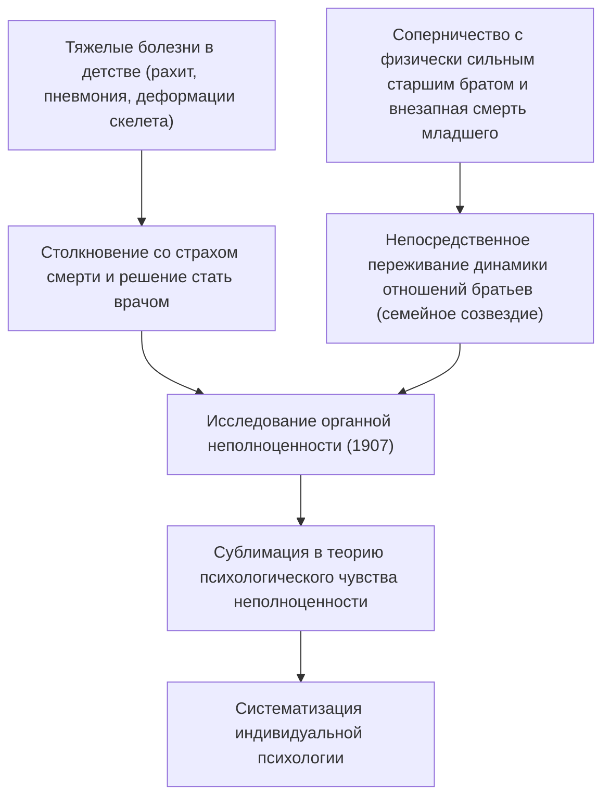
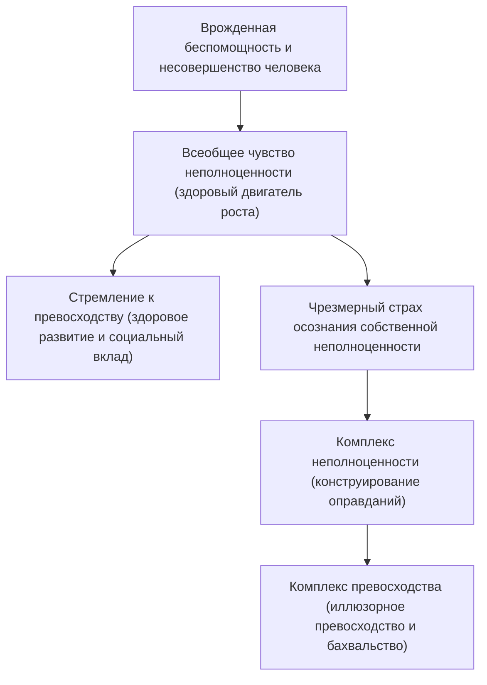
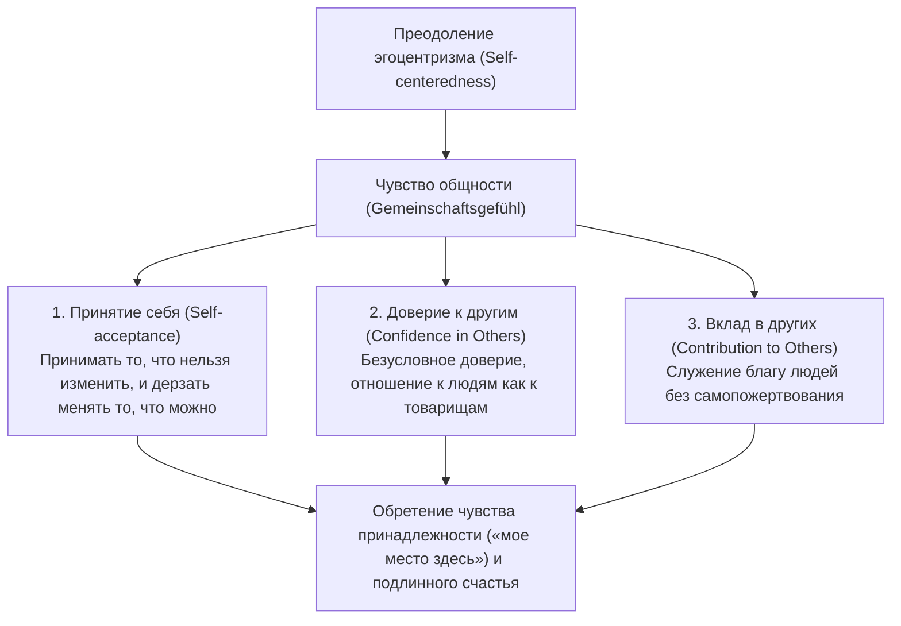
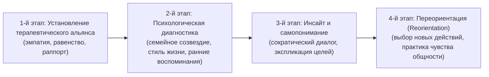

## Введение: почему Альфред Адлер актуален именно сейчас

Среди течений глубинной психологии, зародившихся в Вене в начале XX века, созданная Альфредом Адлером (Alfred Adler, 1870–1937) «индивидуальная психология» (Individual Psychology / нем. Individualpsychologie) по сей день сохраняет беспрецедентную практическую силу и передовую актуальность.

В то время как Зигмунд Фрейд (Sigmund Freud) сформулировал «психический детерминизм» (Psychic Determinism), основанный на бессознательных инстинктивных влечениях (либидо) и прошлых травмах, а Карл Густав Юнг (Carl Gustav Jung) погрузился в мифологические бездны архетипов и коллективного бессознательного, горизонт, открытый Адлером, был предельно ясен и целиком направлен на реальное общество и будущее, в котором живет человек.

В основе адлеровского взгляда на человека лежит убеждение: «Человек — это не пассивное существо, механистически управляемое событиями прошлого, а целостный субъект, живущий инициативно и творчески ради достижения поставленных им самим целей». Слово «Individual» в названии созданной им школы «Individual Psychology» происходит от латинского *individuus* («неделимый», «неделимое существо»). Иными словами, эта мысль решительно отвергает элементарный редукционизм, расчленяющий психику на противоборствующие элементы — такие как «сознание и бессознательное», «разум и чувства», «Ид, Эго и Суперэго», — и рассматривает человека как единую, целостную органическую систему (холизм).

```
【Сравнительный анализ парадигм трех великих течений глубинной психологии】

┌───────────────────┬─────────────────────────────────┬─────────────────────────────────┬─────────────────────────────────┐
│ Школа / Основатель│ Зигмунд Фрейд                   │ Карл Густав Юнг                 │ Альфред Адлер                   │
├───────────────────┼─────────────────────────────────┼─────────────────────────────────┼─────────────────────────────────┤
│ Название школы    │ Психоанализ (Psychoanalysis)    │ Аналитическая психология        │ Индивидуальная психология       │
│ Взгляд на человека│ Механистический, детерминистский│ Телеологический, архетипический │ Субъектный, холистический       │
│                   │ (обусловлен травмами прошлого)  │ (мифы, духовное начало)         │ (телеологический)               │
│ Структура психики │ Сознание / предсознание /       │ Индивидуальное бессознательное /│ Неделимое целостное единство    │
│                   │ бессознательное (расщепление)   │ коллективное бессознательное    │ (холизм)                        │
│ Базовая мотивация │ Либидо (сексуальные и           │ Психическая целостность         │ Стремление к превосходству,     │
│                   │ деструктивные влечения)         │ (самоактуализация, архетипы)    │ чувство общности                │
│ Терапевтический   │ Вспоминание вытесненного        │ Анализ сновидений, интеграция   │ Переориентация стиля жизни,     │
│ подход            │ в прошлом, отреагирование       │ архетипов, индивидуация         │ ободрение (поддержка)           │
└───────────────────┴─────────────────────────────────┴─────────────────────────────────┴─────────────────────────────────┘
```

Психология Адлера не сводится к отдельному направлению клинической психологии. Это прикладная экзистенциальная философия и демократическая социально-педагогическая мысль, отвечающая на фундаментальные вопросы: «Как человеку преодолеть чувство неполноценности, сотрудничать с другими людьми, обрести чувство принадлежности и счастье в жизни?» В данной статье, начиная с идейного противостояния с Фрейдом, с академической строгостью и исчерпывающей полнотой раскрывается вся теоретическая система индивидуальной психологии: телеология, чувство неполноценности и стремление к превосходству, стиль жизни, три жизненные задачи, чувство общности, разделение задач, а также преемственная связь с современной когнитивно-поведенческой терапией (CBT) и позитивной психологией.

---

## 1. Жизненный путь Адлера и история становления индивидуальной психологии

### 1.1 Детский опыт болезней и истоки концепции «органной неполноценности»
Альфред Адлер родился 7 февраля 1870 года в Пенцинге, пригороде столицы Австро-Венгерской империи Вены, вторым сыном в семье еврейского торговца зерном.

Для понимания психологии Адлера ключевое значение имеет тяжелый телесный опыт его собственного детства. В раннем возрасте Адлер страдал тяжелой формой рахита, его скелет развивался с задержкой, и он не мог полноценно ходить вплоть до четырех лет. Более того, в возрасте пяти лет он заболел смертельно опасной острой пневмонией и, лежа в постели, услышал, как лечащий врач сказал отцу: «Этого мальчика уже не спасти». В момент чудесного исцеления от этого критического состояния Адлер запечатлел в своей душе непоколебимую цель (жизненную фикцию): «Я преодолею болезнь и стану врачом, который бросает вызов страху смерти».

Кроме того, острейшее чувство соперничества и неполноценности по отношению к здоровому и физически развитому старшему брату Зигмунду, а также гибель младшего брата, внезапно скончавшегося в колыбели, — суровая реальность смерти, болезней, телесной уязвимости и сравнения между братьями — стали фундаментальным первоначальным опытом для концепций «органной неполноценности» (Organ Inferiority), «чувства неполноценности» (Inferiority Feeling) и теории «семейного созвездия» (Family Constellation), которые он выдвинул впоследствии.



### 1.2 Венское психологическое общество по средам и разрыв с Фрейдом (1902–1911)
Окончив медицинский факультет Венского университета, Адлер начал карьеру в качестве офтальмолога, позже стал врачом общей практики, а затем перешел в психиатрию. Принимая многочисленных пациентов из числа цирковых артистов парка Пратер, ремесленников и представителей рабочего класса, он проявил глубокий интерес к феномену гиперкомпенсации (Overcompensation), при котором человек, имеющий врожденную или приобретенную уязвимость определенного органа (органную неполноценность), чрезвычайно развивает другие органы или психические функции, стремясь восполнить этот недостаток.

В 1902 году, после того как Адлер опубликовал в газете положительную рецензию на книгу Фрейда «Толкование сновидений», Фрейд пригласил его стать участником небольшого исследовательского кружка, собиравшегося по средам в его доме («Психологическое общество по средам», ставшее позже Венским психоаналитическим обществом). В 1910 году Адлер занял пост председателя Венского психоаналитического общества и рассматривался как один из наиболее влиятельных преемников Фрейда.

Однако их идейный союз продлился недолго. В то время как Фрейд упорствовал в пансексуализме (Pansexualism), сводя этиологию всех неврозов к «детской сексуальности (вытеснению и фиксации либидо)», Адлер утверждал, что в основе человеческого поведения лежит вовсе не сексуальность, а «воля к превосходству, стремление преодолеть собственную слабость и беспомощность», «агрессивность» и «потребность в самоутверждении».

В 1911 году произошел окончательный разрыв. На заседаниях Венского психоаналитического общества Адлер прочитал цикл лекций, в которых подверг критике теорию сексуальности Фрейда и развернул собственную концепцию «мужского протеста» (Masculine Protest). Фрейд резко осудил учение Адлера как «ересь, отрицающую самую суть психоанализа», и отверг любые компромиссы. Адлер подал в отставку с постов председателя общества и главного редактора его журнала и вместе с девятью единомышленниками покинул психоаналитическое общество. В следующем, 1912 году Адлер и его сторонники назвали свою школу «Обществом свободного психоанализа», а вскоре переименовали его в «Общество индивидуальной психологии» (Society for Individual Psychology). Так официально родилась «индивидуальная психология», окончательно порвавшая с фрейдовским психоанализом.

---

## 2. Телеология против каузализма: смена парадигмы в психологии

### 2.1 Границы механистического каузализма (Causality) и отрицание психологической травмы
Наиболее радикальным переворотом, образующим теоретический каркас психологии Адлера, является беспощадная критика «причинности (каузализма / Causality)» и введение принципа «телеологии (Teleology)».

Классическая психиатрия, представителем которой был Фрейд, и новоевропейская наука перенесли ньютоновский закон причинно-следственной связи в сферу человеческой психики. Эта схема формулируется так: «событие прошлого (А) породило текущее состояние (В)». Например: «В детстве человек подвергался жестокому обращению со стороны родителей и вырос без любви (А), поэтому сейчас он страдает социофобией и не может адаптироваться в обществе (В)».

Адлер подверг столь механистический каузализм острейшей критике. По Адлеру, сами по себе события прошлого не определяют человека. Если бы прошлые травмы неизбежно предопределяли личность, то люди, выросшие в тяжелых условиях, без исключения заболевали бы одинаковыми неврозами, и тогда не оставалось бы никакого места для человеческой свободы воли и исцеления. Адлер безапелляционно утверждал:

> «Никакой опыт сам по себе не является причиной нашего успеха или неудачи. Мы страдаем не от шока, пережитого в результате нашего опыта — так называемой травмы, — а извлекаем из него то, что служит нашим целям, и наделяем его смыслом».
> (*What Life Could Mean to You*, 1931)

```
【Гносеологическое сопоставление каузализма и телеологии】

■ Каузализм (детерминизм и причинно-следственные связи Фрейда)
Факты прошлого (жестокое обращение родителей, несчастная любовь, неудачи)
  -- "Неизбежная причинно-следственная связь (внешняя детерминация)" -->
Текущие последствия (социофобия, затворничество, апатия)
※ Человек выступает марионеткой своего прошлого; поскольку изменить прошлое невозможно, неизбежен тупик фатализма.

■ Телеология (теория действия и субъектности Адлера)
Текущая скрытая цель (желание избежать конфликтов с другими, страх получить душевную травму)
  -- "Выбор средств для достижения цели (внутреннее творчество)" -->
Создание текущих симптомов и эмоций (самостоятельное порождение тревоги, гнева, страха)
※ Факты прошлого — лишь строительный материал. Человек использует воспоминания о прошлом ради «цели в настоящем».
```

### 2.2 Структура телеологии (Teleology) и «использование» эмоций
В рамках адлеровской телеологии человеческие поступки, эмоции и даже психические симптомы (тревога, депрессия, паника, навязчивые состояния) трактуются как «средства» для достижения «скрытой цели» (Hidden Goal), к которой человек неосознанно стремится.

Рассмотрим, например, пациента с социофобией, у которого «на людях начинают дрожать руки и ноги, лицо краснеет и он не может вымолвить ни слова».
- **Каузальное объяснение**: «Причиной является детская травма, когда человек испытал позор и стыд перед аудиторией, в результате чего выработался бессознательный условный рефлекс страха».
- **Телеологическое объяснение**: «Пациент преследует цель: „я не хочу позориться на людях“, „если я совершу оплошность и моя некомпетентность вскроется, я этого не переживу“. Чтобы достичь этой цели, он сам фабрикует телесные симптомы покраснения и дрожи, получая тем самым легитимное оправдание (алиби): „я болен, поэтому не могу выступать перед людьми“».

Здесь принципиально важна точка зрения, согласно которой эмоции (гнев, тревога, печаль) не «накатывают» на человека пассивно извне; человек сам «конструирует и использует их как инструменты» для достижения своих целей.

Адлер приводил знаменитую иллюстрацию — «теорию гнева как инструмента». Представим мать, которая в ярости кричит на ребенка. В этот самый момент раздается телефонный звонок от школьного учителя. Сняв трубку, мать мгновенно переходит на предельно вежливый, мягкий и любезный тон, спокойно беседует с учителем, а положив трубку, тут же вновь впадает в бешенство и продолжает отчитывать ребенка. Если бы гнев был непреодолимой физиологической реакцией, захватывающей человека целиком, мгновенный переход к спокойному диалогу был бы невозможен. Мать намеренно вызвала эмоцию гнева и воспользовалась ею ради достижения цели — немедленно подчинить ребенка своей воле и заставить его слушаться.

В индивидуальной психологии Адлера человек не является рабом эмоций. Он суверен, который выбирает эмоции и использует их для реализации собственных целей.

---

## 3. Чувство неполноценности, комплекс неполноценности и стремление к превосходству

### 3.1 От органной неполноценности к всеобщему чувству неполноценности
В ранней исследовательской работе «Исследование неполноценности органов» (*Studie über Minderwertigkeit von Organen*, 1907) Адлер проанализировал функциональное несовершенство соматических органов и компенсаторные механизмы живого организма. Организм, обладающий врожденной уязвимостью сердца, почек или органов чувств, стремится преодолеть данный дефект за счет компенсаторных усилий центральной нервной системы.

Адлер кардинально расширил эту физиологическую и патологическую интуицию, перенеся ее в область психики. Человек как биологический вид рождается на свет исключительно беспомощным и уязвимым по сравнению с другими животными. У него нет ни острых клыков, ни когтей, ни густой шерсти, и без родительской опеки младенец не способен прожить ни единого дня. Следовательно, каждый человек в детстве неизбежно окружен взрослыми, обладающими колоссальной силой, и остро осознает собственную беспомощность, малость и несовершенство.

Адлер назвал это психическое напряжение, направленное на преодоление чувства беспомощности, «чувством неполноценности» (Minderwertigkeitsgefühl / Inferiority Feeling). Чрезвычайно важно то, что для Адлера **само по себе чувство неполноценности не является патологией, а представляет собой абсолютно здоровый и универсальный двигатель развития и эволюции человека (Engine of Growth)**.



### 3.2 Строгое концептуальное разграничение чувства неполноценности и комплекса неполноценности
В обыденной речи слово «комплекс» часто употребляется как синоним простого чувства неполноценности, однако в психологии Адлера «чувство неполноценности» и «комплекс неполноценности» (Inferiority Complex) строго разграничены.

1. **Чувство неполноценности (Inferiority Feeling)**:
   Субъективное переживание собственного несовершенства, возникающее при осознании разрыва между текущим состоянием и идеалом. Это здоровая мотивация к преодолению трудностей через труд и упорство: «Мне пока не хватает знаний, поэтому я буду усерднее учиться», «Мое мастерство несовершенно, поэтому я буду тренироваться».

2. **Комплекс неполноценности (Inferiority Complex)**:
   Патологическое состояние, при котором человек использует чувство неполноценности как отговорку (предлог) для бегства от жизненных задач. Это конструирование мнимой причинно-следственной связи вида: «Поскольку имеет место А, я не могу сделать Б». «У меня нет престижного образования, поэтому я не могу добиться успеха», «У меня непривлекательная внешность, поэтому я не могу вступить в брак», «Родители воспитывали меня неправильно, поэтому я не могу адаптироваться в обществе».
   Человек, впавший в комплекс неполноценности, отказывается от решения жизненных задач собственными усилиями и замирает на месте, прикрываясь собственной мнимой ущербностью как щитом, чтобы защитить самолюбие от столкновения с неблагоприятной реальностью.

### 3.3 Комплекс превосходства и патология воли к власти
Когда человек, страдающий от комплекса неполноценности, не в силах вынести мучительную боль прямого столкновения со своей мнимой ущербностью, обратной стороной этой драмы нередко становится «комплекс превосходства» (Superiority Complex).

Комплекс превосходства — это защитный механизм бегства в «иллюзорное превосходство, создающее видимость исключительности», вместо того чтобы прилагать реальные усилия для преодоления трудностей. В частности, он принимает следующие формы:

- **Демонстрация авторитета («заемный блеск»)**: бахвальство личными связями со знаменитостями и власть имущими, вооружение себя люксовыми брендами, регалиями и титулами.
- **Хвастовство и фиксация на прошлых заслугах**: постоянные рассказы о былых подвигах, служащие прикрытием для сегодняшнего бездействия.
- **«Бахвальство несчастьем» и доминирование через слабость**: бесконечные жалобы на то, в каких тяжелых условиях находится человек, как он травмирован и страдает, с целью вызвать сочувствие окружающих, манипулировать другими через чувство вины и требовать к себе особого отношения. Адлер называл это «привилегией слабости» и считал одной из наиболее трудно поддающихся терапии форм комплекса превосходства.

### 3.4 Здоровый вектор стремления к превосходству (Striving for Superiority)
Фундаментальную мотивацию человека преодолевать чувство неполноценности Адлер на ранних этапах называл «импульсом агрессии», «волей к власти» и «мужским протестом», однако в поздний период сублимировал ее в более всеобъемлющую концепцию — «стремление к превосходству» (Striving for Superiority / стремление к совершенствованию).

Здоровое стремление к превосходству — это ни в коем случае не победа в конкурентной борьбе с другими и не подавление окружающих ради господства над ними. Это **«сравнение себя не с другими людьми, а со своим собственным идеальным образом и преодоление собственных границ на один шаг вперед»**. Это процесс постоянного самосовершенствования в горизонтальной плоскости, где все люди признаются равными. Когда стремление к превосходству направлено на «вертикальную иерархию» (отношения господства и подчинения), оно становится питательной средой для неврозов; когда же оно направлено на «горизонтальное сотрудничество» (вклад в сообщество), оно превращается в созидательную, здоровую самореализацию.

---

## 4. Холизм и стиль жизни: когнитивная архитектура личности

### 4.1 Холизм (Holism): человек как неделимая целостность
Первой фундаментальной аксиомой психологии Адлера является «холизм» (Holism / от греч. ὅλος — цельный). Со времен Рене Декарта, отца новоевропейского рационализма, западная мысль находилась под властью «психофизического дуализма», расщепляющего человека на тело и дух. В психиатрии Фрейд также разделил психику на противоборствующие компоненты — «сознание / бессознательное», «Эго / Ид / Суперэго», смоделировав внутриличностный конфликт.

Адлер решительно отверг этот редукционистский партикуляризм. Для Адлера человек — это неделимая целостность (Individual = in [не] + dividual [делимый]).
- «Разум» и «чувства» не находятся в состоянии непримиримой войны. Эмоции рождаются ради целей, к которым стремится разум, и действуют с ним в неразрывном согласии.
- «Сознание» и «бессознательное» не противостоят друг другу. Они — лишь две стороны одной монеты, слаженно работающие на достижение единой цели. Бессознательное означает лишь «область целей, которые человек пока не вербализовал и не осознал».
- «Психика» и «тело» не являются независимыми субстанциями. Учащенное сердцебиение и боли в желудке при сильной тревоге — это свидетельство того, что разум и тело реагируют на кризис как единое целое.

Индивидуальная психология не приемлет дуалистических отговорок вроде «головой я все понимаю, но не могу совладать с чувствами» или «бессознательные влечения толкнули меня на этот поступок вопреки разуму». Ответственность целиком возлагается на целостного субъекта действия (Whole Person): «Я воспользовался эмоцией гнева ради достижения определенной цели и поэтому накричал».

```
【Структурное различие между элементным редукционизмом (Фрейд) и холизмом (Адлер)】

■ Редукционизм (модель психического расщепления)
┌──────────────────────────────────────┐
│ Суперэго (мораль, нормы, совесть)    │
├──────────────────────────────────────┤  ← Внутренний конфликт и раскол
│ Эго (рассудок, адаптация к реальности│
├──────────────────────────────────────┤  ← Вытеснение и сопротивление
│ Ид (бессознательные влечения)        │
└──────────────────────────────────────┘
※ Порождает самообман: «инстинкты победили рассудок», «бессознательное управляет мной».

■ Холизм (модель неделимой интеграции)
┌────────────────────────────────────────────────────────────────────────┐
│                   Целостный человек (неделимое «Я»)                    │
│                                                                        │
│  Телеологическое единство:                                             │
│  Разум, эмоции, сознание, бессознательное и тело слаженно              │
│  действуют ради достижения «единой скрытой цели (стиля жизни)»         │
└────────────────────────────────────────────────────────────────────────┘
※ Вся полнота ответственности за любые действия и эмоции лежит на едином «Я».
```

### 4.2 Определение стиля жизни (Lifestyle) и три его элемента
Центральным понятием психологии Адлера, охватывающим характер, личность, мировоззрение и паттерны мышления, выступает «стиль жизни» (Lifestyle / нем. Lebensstil). Это исторический предтеча таких понятий современной когнитивной психотерапии, как «схема» (Schema) и «когнитивный профиль».

Стиль жизни — это устойчивый паттерн придания смысла себе и миру, который человек самостоятельно выбирает и формирует в раннем детстве (примерно до 4–6 лет) ради выживания в конкретных условиях своего тела, семейного окружения и культурной среды. Будучи однажды сформированным, стиль жизни функционирует как неосознаваемый компас, фильтрующий восприятие, мысли, эмоции и поведение взрослого человека на протяжении всей его последующей жизни.

В адлеровской психологии стиль жизни складывается из трех фундаментальных компонентов:

1. **Я-концепция (Self-concept)**:
   Глубинное убеждение человека относительно того, каков он: «Я есть...». Например: «Я слаб и беспомощен», «Я умен», «Я человек, которого никто не способен полюбить».
2. **Я-идеал (Self-ideal)**:
   Субъективный нормативный стандарт: «Каким я должен быть». Например: «Я всегда должен быть первым», «Ко мне все обязаны относиться с добротой», «Я ни при каких обстоятельствах не должен ошибаться».
3. **Картина мира (Weltbild / Picture of the World)**:
   Убежденность относительно социума и окружающих людей: «Мир и другие люди таковы...». Например: «Окружающий мир полон угроз», «Другие люди — враги, стремящиеся использовать меня», «Жизнь непредсказуема и абсурдна».

Если стиль жизни человека зиждется на Я-концепции «я беспомощен», Я-идеале «мне нельзя испытывать боль» и картине мира «окружающие агрессивны и жестоки», такой человек в любых межличностных отношениях будет занимать гипертрофированно оборонительную позицию, воспринимать малейшие реплики других как враждебность и предпочитать уход в затворничество или избегающее поведение. С точки зрения стороннего наблюдателя это может показаться патологией, однако в логике его стиля жизни это абсолютно последовательное и рациональное поведение.

### 4.3 Диагностическое значение ранних воспоминаний (Early Recollections)
В качестве мощнейшего клинического инструмента объективной реконструкции неосознаваемого стиля жизни Адлер разработал анализ «ранних воспоминаний» (Early Recollections).

Техника ранних воспоминаний заключается в том, что клиенту предлагают вспомнить самое раннее событие детства, какое он только способен удержать в памяти (как правило, конкретный эпизод в возрасте до 6–8 лет), и подробно описать мизансцену, действующих лиц, собственные действия и пережитые в тот миг чувства.

Фрейд относился к детским воспоминаниям как к «следам объективных фактов прошлого» или «окаменелостям вытесненных травм». Напротив, стоящий на позициях телеологии Адлер рассматривал воспоминания как «творческое повествование (нарратив), отобранное и реконструированное человеком из бесчисленного множества прошлых событий с единственной целью — оправдать и подкрепить свой текущий стиль жизни». Человек не фиксирует прошлое механически, как фотопленка. Он сохраняет и субъективно окрашивает лишь те воспоминания, которые служат его сегодняшним целям.

```
【Аналитическая парадигма ранних воспоминаний】

• Содержание воспоминания: «В возрасте пяти лет я упал с дерева в саду и ушиб ногу. Мама подбежала и крепко обняла меня».
  ↓
• Углы анализа:
  1. Активность или пассивность? (Действовал ли ребенок сам или пассивно ждал происходящего?)
  2. Какова роль других людей? (Враги, бросившие в опасности, или заботливые спасители?)
  3. Каково самовосприятие? (Хрупкое, уязвимое и беспомощное существо.)
  ↓
• Выделяемое базисное убеждение стиля жизни:
  «Мир полон опасностей. Стоит мне потерять бдительность, как я получу травму. Я беспомощен.
   Однако если я продемонстрирую свою слабость и попрошу о помощи, окружающие окружат меня заботой и защитят».
  ↓
• Согласованность с текущим паттерном поведения:
  Сталкиваясь с трудностями, человек не решает их самостоятельно, а демонстрирует болезнь или беспомощность, провоцируя других прийти ему на помощь.
```

Адлер подчеркивал: «Фактическая достоверность раннего воспоминания (было ли это объективным фактом или детской фантазией и искажением памяти) не имеет решительно никакого значения». Важно другое: **«Почему из тысяч детских впечатлений человек на протяжении всей жизни удерживает в памяти именно этот конкретный образ?»** В раннем воспоминании в предельно сконцентрированном виде зашифрован генеральный чертеж того, как человек смотрит на мир сегодня и какую стратегию выживания он реализует.

---

## 5. Три жизненные задачи и чувство общности

### 5.1 Три жизненные задачи (Life Tasks)
Адлер сформулировал фундаментальные проблемы межличностных отношений, с которыми неизбежно сталкивается каждый человек, живущий в обществе, как «жизненные задачи» (Life Tasks / нем. Lebensaufgaben). Он выделил три последовательных уровня: «задачу работы», «задачу дружбы» и «задачу любви».

```
【Иерархия и сложность трех жизненных задач】

［Задача любви (Love Task)］
• Объект: предельно интимные отношения с партнером, супругом, в семье
• Требования: минимальная психологическая дистанция, полная самоотдача, разделение общей судьбы, сохранение подлинного равенства
• Предлоги для бегства: страх связывания обязательствами, измены, эмоциональное насилие, перфекционизм

［Задача дружбы (Friendship Task)］
• Объект: друзья, соседи, сообщество, горизонтальные товарищеские связи вне прагматической выгоды
• Требования: бескорыстное доверие без конкуренции, альтруизм, взаимное принятие
• Предлоги для бегства: «боюсь предательства», «меня никто не понимает»

［Задача работы (Work Task)］
• Объект: профессиональная деятельность, экономическое производство, сеть общественного разделения труда
• Требования: соблюдение правил, базовая кооперация, нацеленность на результат
• Предлоги для бегства: страх неудач, ужас перед внешней оценкой, прокрастинация, социофобия
```

1. **Задача работы (Work Task)**:
   Задача, требующая от человека включения в систему общественного разделения труда ради биологического выживания и создания ценностей, полезных другим. В этой триаде она обладает наиболее четко очерченной прагматической структурой, а поведение регулируется контрактами и профессиональными нормами. Поэтому в психологическом плане она считается наименее сложной из трех, однако бегство от нее ведет к экономической несостоятельности и социальной дезадаптации.

2. **Задача дружбы (Friendship Task)**:
   Задача выстраивания товарищеских, дружеских связей, свободных от прямых экономических интересов работы. Она требует способности доверять другому как равному, не вступая в конкуренцию и не боясь открывать свои уязвимые стороны. Многие люди сужают круг общения из-за подозрительности: «А вдруг меня предадут?»

3. **Задача любви (Love Task)**:
   Задача построения самых глубоких и долговременных диадических отношений: любви, супружества, детско-родительских связей. Здесь межличностная дистанция сокращается до минимума, обнажая самые потаенные слабости и изъяны человека. Она требует отказа от любых попыток господствовать над партнером или требовать от него непрестанного одобрения; необходимо вместе стремиться к «счастью двоих» как абсолютно равных партнеров. Поэтому из всех трех задач задача любви является сложнейшей.

По убеждению Адлера, все психологические расстройства (неврозы, затворничество, девиантное поведение, депрессивные состояния) возникают тогда, когда человек, страшась потерпеть поражение при решении жизненных задач и уязвить свое самолюбие, совершает бегство от этих вызовов (так называемая «ложь жизни» / Life Lie).

### 5.2 Сущность чувства общности (Gemeinschaftsgefühl / Social Interest)
Вершиной философско-теоретической мысли Адлера и его наиболее глубоким понятием выступает «чувство общности» (Gemeinschaftsgefühl / Social Interest). Буквально с немецкого это переводится как «чувство общности» или «осознание себя частью сообщества»; в англоязычной традиции закрепился термин «Social Interest» (социальный интерес).

Чувство общности — это **«переключение внимания с фиксации на собственной персоне (Self-centeredness) на искренний интерес к другим людям (Social Interest)»**. Это состояние бытия, при котором человек видит в окружающих не «врагов», а «товарищей», и ощущает глубокое спокойствие и принадлежность: «у меня есть свое законное место в этом мире».

Адлер прямо заявлял, что единственным безошибочным мерилом психического здоровья личности является уровень развития чувства общности. Личность, лишенная чувства общности, воспринимает мир как арену беспощадной борьбы за выживание, а других людей — либо как угрожающих соперников, либо как расходный материал для достижения собственных целей. Такой человек обречен на непрекращающуюся тревогу, одиночество и невротические конфликты в бесплодной погоне за мнимым превосходством.



### 5.3 Три столпа чувства общности
Чтобы перевести категорию чувства общности в плоскость практической психотерапии и повседневной жизни, современная адлеровская школа формулирует ее через три взаимосвязанных элемента:

1. **Принятие себя (Self-acceptance)**:
   Принятие себя коренным образом отличается от «самоутверждения» (позитивного мышления). Если позитивное мышление — это самообман, когда не умеющий что-то делать человек твердит себе: «я все могу», то принятие себя — это смелость признать себя несовершенным и ограниченным («я таков, каков я есть»), направляя все свои силы на то, что действительно поддается изменению. Это состояние полностью созвучно знаменитой молитве о душевном покое: «Господи, дай мне спокойствие принять то, чего я не могу изменить, мужество изменить то, что могу, и мудрость отличить одно от другого».

2. **Доверие к другим (Confidence in Others)**:
   Отличается от поверхностной «кредитной надежности» (Credit). Кредит выдается под залог, на основе гарантий и условий (как банковская ссуда). Доверие же к другим по Адлеру означает доверие безусловное, безо всяких гарантий и залогов. Разумеется, всегда существует риск быть преданным или обманутым. Однако Адлер напоминает: то, как поступит другой человек, — это «задача другого человека», в то время как верить или не верить — «моя собственная задача». Такое четкое разделение освобождает человека из темницы вечной подозрительности.

3. **Вклад в других (Contribution to Others)**:
   Кардинально отличается от «самопожертвования» (Self-sacrifice). Жертвовать жизнью и здоровьем ради других — это зачастую лишь невротическая потребность заслужить одобрение и почувствовать свою незаменимость. Здоровый вклад в других означает радостное применение своих способностей на благо сообщества ради обретения чувства собственной ценности. Адлер лаконично подытожил: «Счастье — это ощущение своего вклада». Чувство того, что я полезен сообществу, дарует человеку несокрушимую уверенность в собственной ценности и становится чистым источником мужества жить.

---

## 6. Разделение задач и психология мужества

### 6.1 Логическая структура разделения задач (Separation of Tasks)
В качестве тончайшего скальпеля, способного в корне разрешить любые межличностные трения и конфликты, психология Адлера предлагает концепцию «разделения задач» (Separation of Tasks).

Практически любые противоречия, обиды и стрессы в общении между людьми коренятся либо в «бесцеремонном вторжении в чужие задачи», либо в том, что человек «позволяет другим вторгаться в свои собственные задачи».

Адлер сформулировал поразительно простой и ясный критерий для демаркации задач:
**«Кто в конечном счете будет пожинать плоды и нести последствия сделанного выбора?»**

```
【Пример разделения задач: проблема детской учебы】

• Мышление родителя (смешение задач):
  «Если ребенок не будет учиться, его ждет тяжелое будущее, поэтому я обязан заставить его зубрить во что бы то ни стало».
  → Авторитарное вмешательство родителя в задачу ребенка (доминирование и контроль).
  → Ребенок бунтует и начинает использовать отказ от учебы как «оружие возмездия родителю».

• Разграничение на основе разделения задач:
  1. «Кто в конечном счете понесет последствия: учиться или нет, получить плохие оценки и не поступить в выбранное заведение?»
     → Конечное бремя последствий несет сам 【ребенок】 (это задача ребенка).
  2. Что в этой ситуации может сделать родитель?
     → Не приказывать «учись!», а создать комфортную среду, быть готовым оказать поддержку в тот момент, когда ребенок сам захочет учиться,
        и транслировать спокойную позицию: «я верю в твои силы и всегда рядом» (готовность к содействию и безоценочная поддержка).
```

Разделение задач ни в коем случае не означает холодного безразличия, черствости или попустительства (неглекта). Попустительство — это когда родитель понятия не имеет, чем занят ребенок, и не проявляет к нему интереса. Адлеровский подход блестяще выражен в поговорке: «Можно привести лошадь к водопою, но нельзя заставить ее пить». Решение пить воду принадлежит самой лошади; попытка силой разжать ей челюсти и залить воду внутрь — это не помощь, а насилие и тирания.

### 6.2 Отрицание жажды одобрения и определение «свободы»
Бескомпромиссным следствием последовательного разделения задач становится решительное отрицание психологией Адлера «жажды одобрения» (Desire for Approval), терзающей современного человека.

По Адлеру, человек, живущий ради похвалы, признания и одобрения со стороны окружающих, в действительности проживает «чужую жизнь». Зависимость от чужого мнения — это тщетная попытка взять под контроль то, «как другой человек оценивает меня», то есть контролировать 【чужую задачу】, что в принципе невозможно.

В философии индивидуальной психологии «свобода» определяется как **«отсутствие страха быть отвергнутым или нелюбимым другими»**.
Стремление быть угодным каждому и нравиться абсолютно всем не только неискренне, но и представляет собой нескончаемую каторгу предательства собственного стиля жизни. Идти по пути, который ты искренне считаешь верным, и спокойно принимать то, что кто-то может относиться к тебе с неприязнью, — это понимание того, что чужие симпатии и антипатии лежат вне зоны твоей юрисдикции; это задача других людей. Действовать автономно, руководствуясь собственной совестью и чувством вклада в благо сообщества, не завися от оценок извне, — вот единственное и непреложное условие истинной духовной свободы.

---

## 7. Ободрение (Encouragement) и теория демократического воспитания

### 7.1 Тотальная критика педагогики кнута и пряника: скрытая опасность похвалы
Одним из наиболее радикальных и шокирующих тезисов индивидуальной психологии Адлера в педагогике и клинике является «полный запрет на воспитание через наказания и похвалу».

В общепринятом воспитании детей и корпоративном менеджменте подход «воспитывать похвалой» зачастую превозносится как идеал. Однако Адлер тонко вскрыл глубинную сущность похвалы. В акте похвалы всегда неявно заложены **вертикальные отношения (иерархия «сверху вниз»), при которых «человек, обладающий способностями или властью, оценивает сверху вниз менее способного и манипулирует им»**. Тот факт, что взрослому человеку в равных отношениях покажется в высшей степени неестественным и бестактным услышать от другого: «Молодец, ты хорошо справился!», наглядно обнажает присутствие в похвале властной асимметрии.

```
【Сравнение парадигм «похвалы и наказания» и «ободрения»】

┌───────────────────┬─────────────────────────────────┬─────────────────────────────────┐
│ Критерий          │ Педагогика наград и наказаний   │ Ободрение (Encouragement)       │
│                   │ (похвала / порицание)           │                                 │
├───────────────────┼─────────────────────────────────┼─────────────────────────────────┤
│ Базис отношений   │ Вертикальные отношения          │ Горизонтальные отношения        │
│                   │ (иерархия, контроль, манипуляция│ (равенство, уважение, доверие)  │
│ Критерий оценки   │ Результат, способности,         │ Процесс, намерение,             │
│                   │ сравнение с другими             │ сравнение с самим собой         │
│ Психологический   │ Жажда одобрения, страх неудач,  │ Уверенность, автономия,         │
│ эффект у субъекта │ зависимость от чужого мнения    │ чувство вклада, самоэффективност│
│ Характер          │ Внешняя (ради награды или       │ Внутренняя (спонтанный          │
│ мотивации         │ во избежание наказания)         │ бескорыстный вклад в сообщество)│
│ Типичные фразы    │ «Молодец!», «Как здорово,       │ «Спасибо за помощь»,            │
│                   │ ты получил высший балл!»        │ «Я искренне рад твоему участию» │
└───────────────────┴─────────────────────────────────┴─────────────────────────────────┘
```

По Адлеру, главный пагубный эффект похвалы состоит в том, что она прививает ребенку или подчиненному тяжелую зависимость от жажды одобрения: «я действую только тогда, когда меня хвалят», «без внешней оценки я не ощущаю своей ценности». Более того, отсутствие похвалы со временем начинает восприниматься субъектом как «наказание», порождая парализующий страх совершить ошибку и уклонение от любых новых начинаний.

С другой стороны, «порицание» (наказание, окрики) носит еще более деструктивный характер. Выговор и брань — это примитивная форма коммуникации, в которой человек отказывается от конструктивного диалога на равных и пытается сломить волю другого с помощью дешевой эмоциональной силы — гнева. Тот, кого отчитывают, вовсе не осознает свою ошибку искренне; вместо этого в нем разрастаются защитные психологические реакции и жажда мести: «как скрыть свой проступок, чтобы не попасться» и «как отомстить обидчику».

### 7.2 Техника ободрения (Encouragement) и горизонтальные отношения
В качестве подлинной альтернативы системе наград и наказаний Адлер предложил концепцию «ободрения / поддержки» (Encouragement).
Ободрение — это **«помощь, пробуждающая во внутреннем мире человека жизненную силу (мужество) для преодоления трудностей»**, осуществляемая исключительно в рамках равноправных «горизонтальных отношений».

Ключевые техники ободрения включают в себя:

1. **Выражение искренней благодарности и радости («Спасибо», «Я очень рад»)**:
   Вместо того чтобы оценивать другого сверху («Ты молодец»), субъект транслирует собственные искренние чувства, показывая, какую реальную пользу принес поступок другого: «Ты мне так помог, спасибо!», «Я искренне счастлив, что ты с нами». Благодаря этому у человека формируется твердая уверенность в собственной компетентности и ценности: «Я обладаю силой приносить пользу другим, я значим».
2. **Фокус на процессе и намерениях, а не на результате**:
   Внимание обращается не на «итог» (оценки за экзамен или объем продаж), а на «процесс усилий» и предпринятые попытки: «Ты боролся до конца и проявил упорство», «Ты подошел к этому очень творчески». Момент неудачи выступает наилучшей возможностью для ободрения, позволяя на равных обсудить: «Какой ценный опыт мы можем извлечь из этой ошибки?»
3. **Фокус на сильных сторонах вместо недостатков (рефрейминг)**:
   Переопределение черт, вызывающих у человека чувство неполноценности, в позитивном контексте: например, «непостоянный» переосмысливается как «любознательный и гибко переключающийся», а «упрямый» — как «обладающий несгибаемой волей и верностью своим принципам».

### 7.3 Движение детских консультаций в Вене и реформа школьного образования
Учение Адлера никогда не замыкалось в башне из слоновой кости абстрактных теорий; оно развернулось в грандиозную социальную практику. После Первой мировой войны, в период «Красной Вены» (Red Vienna), когда социал-демократы возглавили муниципалитет столицы, Адлер в сотрудничестве с городским школьным советом основал более тридцати «детских воспитательных консультаций» (Child Guidance Clinics) при государственных школах.

Венские детские консультации Адлера представляли собой революционную систему: врачи, учителя, родители и сами дети садились в общий круг на равных правах и открыто обсуждали вопросы воспитания. Адлер был убежден, что разрушение авторитарного господства в семье и школе и взращивание демократического, солидарного сообщества — это единственный реальный путь предотвращения неврозов, подростковой преступности и разрушительных войн будущего. Эта венская практика стала прямым историческим истоком современной школьной психологии и службы психологического консультирования в образовании.

---

## 8. Методы и процесс клинического консультирования по Адлеру

### 8.1 Установление терапевтических отношений: равноправный альянс (Collaborative Alliance)
В классическом психоанализе терапевтические отношения строились на асимметричной, авторитарной основе: пациент лежал на кушетке, а психоаналитик сидел вне поля его зрения в молчании, вынося авторитетные интерпретации.

Адлеровское консультирование в корне переломило эту схему. Консультант и клиент сидят друг напротив друга на стульях одинаковой высоты. Они выступают «равноправными исследователями-коллегами», заключающими партнерский альянс для решения жизненных уравнений клиента. Консультант — не всеведущий гуру, а фасилитатор, сопровождающий клиента на пути самостоятельного преодоления его жизненных задач.



### 8.2 Психологическая диагностика: семейное созвездие (Family Constellation)
На этапе психодиагностики особое внимание адлерианцы уделяют исследованию «семейного созвездия» (Family Constellation / структуры семьи).

Адлер открыл, что на формирование стиля жизни ребенка колоссальное влияние оказывает его порядок рождения (Birth Order) среди братьев и сестер, а также его субъективная интерпретация этой позиции:

- **Первенец (старший ребенок)**: в раннем детстве единолично наслаждался родительской любовью, но с появлением второго ребенка пережил опыт «свергнутого с трона монарха». Тоскует по былому величию, проявляет выраженную склонность к поддержанию порядка, почитанию власти и законов. Отличается высоким чувством долга, консервативен.
- **Второй (средний ребенок)**: с момента появления на свет имеет перед глазами задающего темп соперника (первенца), поэтому постоянно находится в состоянии «соревнования на пределе сил». Стремится утвердить свое превосходство на ином поприще, чем первенец; склонен к бунтарству, инновациям либо развитой кооперации.
- **Младший ребенок**: никогда не переживал свержения с трона. Склонен либо к крайнему избалованию всеми членами семьи, либо вырастает дерзким карьеристом, стремящимся превзойти всех старших. Часто вырабатывает зависимый стиль жизни: «меня обязаны любить просто так, без моих усилий».
- **Единственный ребенок**: растет без конкурентов среди сверстников дома, в окружении взрослых. Может проявлять черты эгоцентризма, но одновременно нередко демонстрирует не по годам развитый интеллект и высокие академические успехи.

Здесь важно подчеркнуть: сам по себе порядок рождения механически ничего не предопределяет. Решающее значение имеет то, **«какую жизненную стратегию (стиль жизни) ребенок выработал для завоевания любви, внимания и своей ниши в семье исходя из этой конфигурации»**.

### 8.3 Сократический диалог (Socratic Dialogue) и инсайт
В адлеровской терапии интервенции осуществляются не в форме нотаций или директивных указаний, а посредством «сократического диалога» (Socratic Dialogue), восходящего к искусству майевтики древнегреческого философа Сократа.

Терапевт никогда не задает вопросов в духе каузализма: «Почему вы так поступили?», выискивающих вину в прошлом. Вместо этого он ставит телеологические вопросы: «Чего вы стремитесь достичь подобным поведением?», «Если бы этот симптом исчез полностью прямо сегодня, как изменилась бы ваша жизнь?»

Благодаря таким вопросам клиент самостоятельно осознает скрытые ложные цели и «ложь жизни», за которые он неосознанно цеплялся. Адлеровский инсайт — это не холодное интеллектуальное знание, а обретение субъектного самосознания: «Я и только я являюсь подлинным автором сценария своей жизни» (Author of One's Life).

### 8.4 Переориентация (Reorientation): эксперименты с новым поведением
На завершающей стадии «переориентации» (Reorientation / смены жизненного вектора) клиент отказывается от деструктивных паттернов прежнего стиля жизни и выбирает новую модель бытия, основанную на чувстве общности.

Адлерианская терапия категорически не одобряет замыкание в стенах кабинета и побуждает к конкретным поведенческим экспериментам в реальной повседневной жизни:
- С завтрашнего дня искренне и с улыбкой здороваться с соседями, которых раньше избегали.
- Сказать партнеру слова признательности и благодарности вместо привычных претензий и критики.
- Отказаться от парализующего перфекционизма и показать коллегам работу, выполненную на 80%, запросив обратную связь.

Адлер неустанно повторял: «Изменить свой характер (стиль жизни) возможно в абсолютно любой момент». Человек волен заново выбрать свой стиль жизни. Для этого требуются не исключительные способности, а лишь одно — **«мужество измениться» (Courage to Change)**.

---

## 9. Влияние на современную мысль, когнитивно-поведенческую терапию (CBT) и концепцию благополучия (Well-being)

### 9.1 Адлер как негласный предтеча когнитивно-поведенческой терапии
В конце XX — начале XXI века золотым стандартом мировой психотерапии и психиатрии стала «когнитивно-поведенческая терапия» (CBT). Ее основатели — Альберт Эллис (Albert Ellis, рационально-эмотивно-поведенческая терапия / REBT) и Аарон Бек (Aaron T. Beck, когнитивная терапия / CT) — открыто признавали колоссальное прямое влияние идей Адлера.

Альберт Эллис недвусмысленно заявлял: «Адлер, вне всякого сомнения, является подлинным предтечей современной когнитивной терапии». Знаменитая формула Эллиса «модель ABC» (A = Activating Event / событие, B = Belief / убеждение и когниция, C = Consequence / эмоционально-поведенческое следствие) представляет собой современную транскрипцию адлеровской теории стиля жизни.

```
【Генеалогическая связь психологии Адлера и когнитивной терапии】

［Эпиктет (философия стоицизма)］
«Людей мучают не сами вещи, а суждения и представления о вещах»
  ↓
［Альфред Адлер (индивидуальная психология, 1912)］
• Телеология: эмоции и поведение определяются не событиями, а смыслом (суждением), который им придан.
• Стиль жизни: сформированная в детстве когнитивная сетка (схема).
• Личная субъектная ответственность и переориентация.
  ↓
［Альберт Эллис (рационально-эмотивно-поведенческая терапия, 1955)］
• Модель ABC (диспутирование и опровержение иррациональных верований)
［Аарон Бек (когнитивная терапия, 1960-е)］
• Автоматические мысли, глубинные убеждения (Core Beliefs), исправление когнитивных искажений (Cognitive Distortions)
```

Систематизированные Беком «когнитивные искажения» (черно-белое мышление, катастрофизация, сверхобобщение, избирательное абстрагирование) поразительно точно соответствуют структурным изъянам «частной логики» (Private Logic), подробно описанным Адлером еще в 1910–1920-х годах. Индивидуальная психология Адлера послужила истоком когнитивной терапии, перебросив прочный исторический мост между глубинной психодинамикой и современным когнитивно-поведенческим подходом.

### 9.2 Созвучие с философией экзистенциализма и прагматизма
Адлеровский взгляд на человека историко-философски глубоко резонирует с американским прагматизмом (Pragmatism) и европейским экзистенциализмом (Existentialism).

Ключевым источником теоретического вдохновения для Адлера послужил фундаментальный труд Ханса Вайхингера (Hans Vaihinger) «Философия „как если бы“» (*Die Philosophie des Als Ob*, 1911). Человек не имеет прямого доступа к объективной абсолютной истине; он действует исходя из созданных им самим фикций (Fiction / гипотез вида «как если бы это было так»). Применив эту концепцию к психологии, Адлер показал, что цели, направляющие человеческое поведение, являются не объективной данностью, а «субъективно сконструированными финальными идеалами (жизненными фикциями)».

Кроме того, знаменитые экзистенциальные формулы Жана-Поля Сартра (Jean-Paul Sartre) — «человек осужден быть свободным» и «существование предшествует сущности» — поразительно созвучны адлеровскому освобождению от оков прошлого детерминизма и утверждению полной ответственности за собственный выбор. Адлер был экзистенциальным мыслителем, категорически отвергавшим любые фаталистические оправдания и отстаивавшим фундаментальную свободу человека выбирать свое отношение к любым, даже самым суровым обстоятельствам судьбы (что впоследствии стало краеугольным камнем логотерапии Виктора Франкла).

### 9.3 Предвосхищение позитивной психологии и исследований благополучия (Well-being)
В разработанной в конце 1990-х годов Мартином Селигманом (Martin Seligman) «позитивной психологии» стержневая модель долгосрочного психологического благополучия (модель PERMA: Positive Emotion, Engagement, Relationships, Meaning, Accomplishment) представляет собой фактически эмпирическое подтверждение адлеровского чувства общности (чувства принадлежности, бескорыстного служения другим и преодоления жизненных задач).

Современные междисциплинарные эмпирические исследования в области нейронаук и социальной психологии (теории социального капитала, влияние альтруизма на выработку окситоцина, предикторы субъективного благополучия) неизменно приходят к единому выводу: альтруистический вклад в благополучие других и теплые межличностные отношения выступают мощнейшими факторами человеческого счастья и долголетия. Постулат о «чувстве общности», сформулированный Адлером век назад благодаря клинической интуиции и философской последовательности, сегодня получает блестящее подтверждение на переднем крае науки XXI века.

---

## 10. Заключение: практическая философия самоопределения и мужества

Главное послание, которое индивидуальная психология Альфреда Адлера несет современному человеку, — это бескомпромиссная философия надежды и решимости: **«Жизнь всегда можно начать заново прямо отсюда»**.

Современное общество перегружено дискурсами биологического генетического детерминизма, нейробиологического редукционизма и социального фатализма (концепции непреодолимого экономического неравенства или «родительской лотереи»). Нарративы каузализма — «я таков из-за дурной наследственности», «меня так воспитали родители», «во всем виновата несправедливая социальная система» — способны на короткое время убаюкать уязвленное самолюбие. Однако расплатой за это становится пожизненное заключение в ментальную темницу, где человек превращает себя в пассивный и беспомощный объект — «жалкую жертву прошлого и среды».

Психология Адлера безжалостно отбирает этот наркотик инфантильной позиции жертвы.
Не имеет значения, что произошло в прошлом. Не имеет значения, какими были родители. Важно лишь одно: «как ты распорядишься тем, что тебе дано».

> «Дело не в том, чем наделили человека наследственность и среда. Вопрос заключается в том, как человек использует предоставленный ему материал, чтобы созидать самого себя».
> (*What Life Could Mean to You*)

Учение Адлера строго и порой звучит как беспощадная правда, от которой хочется закрыть уши. Однако за этой требовательностью стоит бесконечное доверие к человеку и взгляд, преисполненный глубокого уважения. Каждый человек обладает творческой силой переписать сценарий собственной жизни собственными руками. Сойти с дистанции бесплодного соперничества с окружающими, сбросить с себя рабское ярмо жажды одобрения, поверить в ближнего как в товарища и направить свои силы на благо общего сообщества. Та внутренняя духовная сила, которая необходима для этого первого шага, и есть великое непреходящее наследие Адлера, имя которому — **Мужество (Courage)**.
