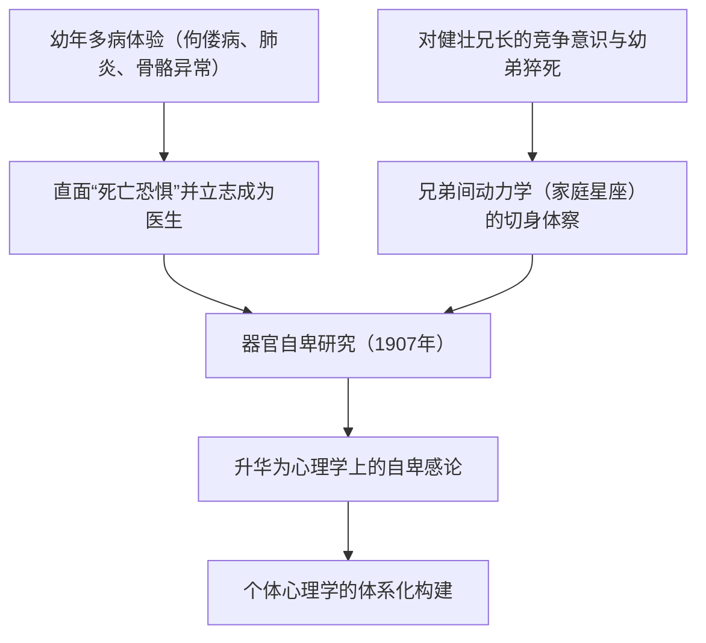
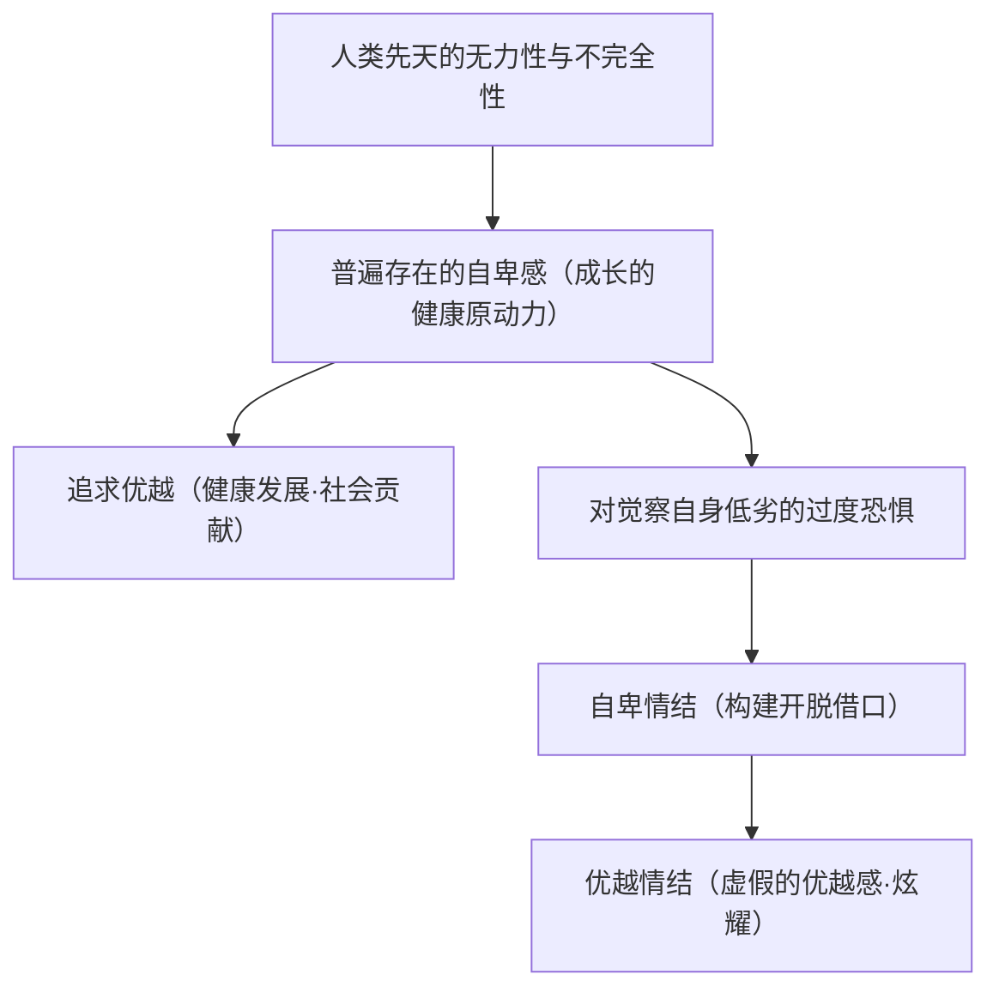
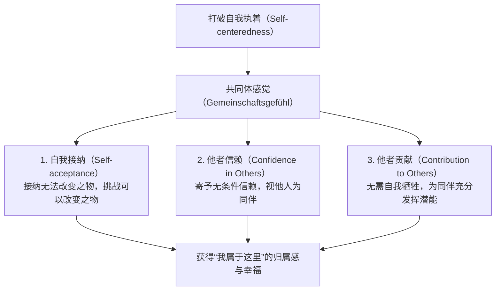
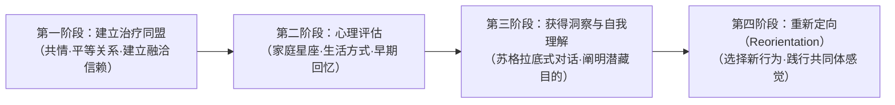

## 序论：为什么在今天依然需要阿尔弗雷德·阿德勒

在20世纪初维也纳兴起的深层心理学浪潮中，阿尔弗雷德·阿德勒（Alfred Adler, 1870–1937）所创立的“个体心理学（Individual Psychology / 德语：Individualpsychologie）”，在当今时代依然散发着无可比拟的实践品格与超前卓见。

西格蒙德·弗洛伊德（Sigmund Freud）奠定了基于潜意识本能冲动（力比多）与过去创伤的“心理决定论（Psychic Determinism）”，卡尔·古斯塔夫·荣格（Carl Gustav Jung）潜入了原型与集体潜意识的神话般深渊；与他们形成鲜明对照的是，阿德勒所开辟的思想地平线极其明澈，且始终彻底指向“人类所生活的现实社会与未来”。

阿德勒人性观的基石在于这样一种坚定信念：“人绝非被过去的事件机械操纵的被动存在，而是朝着自我设定的目标，主动且富于创造性地生存的统合体。”他为自己的学派冠以“Individual Psychology”之名，其中的“Individual”源自拉丁语 *individuus*（不可分割之物、不可分者）。换言之，这一思想断然拒绝将心灵切割为“意识与潜意识”、“理性与感性”、“本我·自我·超我”等互相对立的要素还原论，而是将人视为一个作为不可分割整体而统一运作的生命系统（全机性与整体论）。

```
【深层心理学三大流派的范式对比】

┌─────────────────┬───────────────────────────────┬───────────────────────────────┬───────────────────────────────┐
│ 学派 / 创立者   │ 西格蒙德·弗洛伊德             │ 卡尔·古斯塔夫·荣格           │ 阿尔弗雷德·阿德勒             │
├─────────────────┼───────────────────────────────┼───────────────────────────────┼───────────────────────────────┤
│ 学派名称        │ 精神分析（Psychoanalysis）    │ 分析心理学（Analytical Psych）│ 个体心理学（Individual Psych）│
│ 人性观          │ 机械论·决定论（创伤论）       │ 目的论·原型论（神话·心灵）    │ 主体论·整体论（目的论）       │
│ 心灵结构        │ 意识 / 前意识 / 潜意识（分立）│ 个人潜意识 / 集体潜意识       │ 不可分割的统合体（整体论）    │
│ 根本动力        │ 力比多（性与破坏本能冲动）    │ 心灵的完整性（自我实现·原型） │ 追求优越·共同体感觉           │
│ 治疗与进路      │ 唤回过去的压抑记忆·宣泄       │ 释梦·原型整合·自性化          │ 重新定向生活方式·鼓励赋能     │
└─────────────────┴───────────────────────────────┴───────────────────────────────┴───────────────────────────────┘
```

阿德勒心理学绝非仅仅是临床心理学的一个流派。它更是一种回答人类“如何克服自卑感、与他人协同合作、获得归属感与幸福而生活”这一根本追问的实践性存在哲学，同时也是一种民主主义的社会教育思想。本文将从他与弗洛伊德的思想论争出发，以学术严谨性彻底阐明目的论、自卑感与追求优越、生活方式、人生三大课题、共同体感觉、课题分离，乃至延展至现代认知行为疗法（CBT）与积极心理学的整个理论体系全貌。

---

## 1. 阿德勒的生平与个体心理学的形成史

### 1.1 童年患病体验与“器官自卑”的原风景
阿尔弗雷德·阿德勒于1870年2月7日出生在奥匈帝国首都维也纳近郊的彭青（Penzing），是一个犹太谷物商人家庭的次子。

要理解阿德勒的心理学，他在幼年时期经历的严酷躯体体验是不可或缺的基石。阿德勒在幼年时患有严重的佝偻病，骨骼发育迟缓，直到四岁才能勉强独立行走。在五岁时，他又罹患了致命的急性肺炎；在病榻上，他曾亲耳听见主治医生对父亲说：“这个孩子已经没救了。”在从这种极限状态中奇迹般康复的那一刻，阿德勒在心中铭刻下一个坚定的目标（虚构目标）：“我要战胜疾病，成为一名直面死亡恐惧的医生。”

此外，面对身体健康且极具运动天赋的哥哥西格蒙德，阿德勒心生强烈的竞争意识与自卑感；而在他年幼时，弟弟在睡梦中猝然离世的悲剧，更让他深切体会到了死亡、疾病、躯体脆弱性以及兄弟竞争的残酷现实。这些刻骨铭心的经历，后来成为他提出“器官自卑 / 器官劣等性（Organ Inferiority）”、“自卑感（Inferiority Feeling）”以及“家庭星座（Family Constellation）”理论的坚实原初经验。



### 1.2 维也纳星期三心理学会与同弗洛伊德的决裂（1902–1911）
从维也纳大学医学院毕业后，阿德勒最初以眼科医生的身份开启职业生涯，随后转向普通内科，最终成为一名精神科医生。在为普拉特游乐场（Prater）的马戏团杂技演员、手工业者和工人阶级患者问诊的过程中，他注意到一个深刻现象：那些在身体特定器官上存在先天或后天缺陷（器官自卑）的人，为了弥补这一短板，往往会促使其他器官或精神功能发生异乎寻常的发达（过度补偿 / Overcompensation），这引发了他极大的研究兴趣。

1902年，阿德勒在报纸上发表书评为弗洛伊德的著作《梦的解析》辩护。以此为契机，他受弗洛伊德之邀，成为每周三晚在弗洛伊德家中举行的小型研讨会（“星期三心理学会”，即后来的维也纳精神分析学会）的创始成员之一。到1910年，阿德勒甚至出任了维也纳精神分析学会的主席，被公认为弗洛伊德最有力的继承人之一。

然而，两人的蜜月期并未持续太久。弗洛伊德固执地坚持泛性论（Pansexualism），将所有神经症的病因统统归咎于“童年期性欲（力比多的压抑与固着）”；而阿德勒则主张，人类行为的根本驱动力并非性欲，而是“力图克服自身弱小与无力的优越意志”、“攻击性”以及“自我主张的欲求”。

1911年，双方爆发了决定性的裂痕。在维也纳精神分析学会的例会上，阿德勒发表了一系列连续演讲，系统批判了弗洛伊德的性欲说，并阐发了自己的“男性抗议（Masculine Protest）”理论。弗洛伊德将阿德勒的学说斥为“否定精神分析核心价值的异端”，断然拒绝任何妥协。阿德勒随即辞去了学会主席及学会刊物主编的职务，并与支持他的9名同仁一同退出了精神分析学会。翌年（1912年），阿德勒等人将自己的学派命名为“自由精神分析学会”，不久正式更名为“个体心理学会（Society for Individual Psychology）”。至此，与弗洛伊德精神分析彻底决裂的“个体心理学”正式宣告诞生。

---

## 2. 目的论 vs 原因论：心理学的范式转换

### 2.1 机械论原因论（Causality）的局限与对创伤论的否定
构成阿德勒心理学理论骨架的最彻底、最激进的转变，正是对“原因论（Causality）”的全面批判以及对“目的论（Teleology）”的奠基。

以弗洛伊德为代表的古典精神病学与近代科学，将牛顿式的“因果律”移植到了人类的精神世界。其基本公式即：“过去的事件（A）导致了现在的状态（B）”。例如，他们解释道：“某人童年遭受了父母的虐待，在缺乏关爱的环境中长大（A），因此现在患上了社交恐惧症，无法适应社会（B）。”

对此，阿德勒对这种机械论的原因论提出了尖锐的批判。在阿德勒看来，过去的事件本身并不能决定人。如果过去的创伤能够不可避免地注定一个人的一生，那么在严酷环境中长大的所有人理应无一例外地罹患相同的神经症，而在这种逻辑下，人类的自由意志与康复空间将荡然无存。阿德勒曾明确断言：

> “没有任何一种经历本身是成功或失败的原因。我们并不因所谓心理创伤的打击而受苦，而是从过往经历中寻找符合自身目的的因素，并赋予其特定的意义。”
> （*What Life Could Mean to You*, 1931 / 中译《自卑与超越》）

```
【原因论与目的论的认识论对比】

■ 原因论（弗洛伊德式因果律·决定论）
过去的客观事实（父母虐待、失恋、挫败）
  -- "不可避免的因果联结（外因决定论）" -->
现在的病态结果（社交恐惧、闭门不出、意志消沉）
※人沦为过去的提线木偶；既然过去无法改变，人便必然陷入绝望的宿命论。

■ 目的论（阿德勒式行为论·主体论）
当前潜藏的隐藏目的（渴望回避与他人冲突、害怕受到伤害）
  -- "为达成目的而对手段的自主选择（内因创造论）" -->
当前症状与情绪的创生（主动制造出焦虑、愤怒与恐惧）
※过去的事实仅仅是素材而已。人是为了实现“当下的目的”而利用过去的记忆。
```

### 2.2 目的论（Teleology）的结构与情绪的“使用”
在阿德勒的目的论视阈中，人类的行为、情绪，乃至诸如焦虑、抑郁、惊恐、强迫等精神症状本身，都被理解为当事人为了达成其无意识中抱持的“隐藏目的（Hidden Goal）”而采取的“手段”。

例如，我们来看一位患有社交焦虑障碍的患者，其症状表现为“一旦置身人前便四肢颤抖、面红耳赤、无法言语”：
- **原因论的解释**：“过去在众人面前遭遇过失败并出丑的创伤是其病因，导致潜意识中的恐惧条件反射被激活。”
- **目的论的解释**：“患者内心怀有‘不想在众人面前出丑’、‘一旦失败暴露自己的无能将无法承受’的目的。为了达成这一目的，他自己制造了‘脸红’和‘发抖’等躯体症状，从而获得了‘因为我有病，所以无法站到人前’的正当借口（不在场证明）。”

这里的关键洞见在于：情绪（愤怒、焦虑、悲伤）绝非从外部被动袭来的不可抗力，而是人为了达成自己的目的而“捏造并使用的工具”。

阿德勒曾提出著名的“愤怒工具说”：一位母亲正在怒容满面地对着孩子大声斥责，就在这时，孩子的班主任老师打来了电话。母亲拿起听筒的瞬间，声音立刻切换得极其温和有礼，与老师从容交谈；而挂断电话的下一秒，她又立刻勃然变色，继续对孩子厉声咆哮。如果愤怒真是一种彻底吞噬人理性的生理性冲动与不可抗力，那么在数秒之内完成这种平稳理性的对话是根本不可能的。母亲之所以表现出愤怒，正是为了达成“立即震慑孩子、让孩子服从自己”的目的，而有意调动并使用了愤怒这种情绪作为工具。

在阿德勒心理学中，人绝不是情绪的奴隶，而是为了实现自身目的而选择并运用情绪的主权者。

---

## 3. 自卑感·自卑情结·追求优越

### 3.1 从器官自卑到普遍自卑感
在阿德勒早期的研究著作《器官自卑及其物理与心理代偿研究》（*Studie über Minderwertigkeit von Organen*, 1907）中，他细致分析了人体器官的功能不全以及生物机体对此所产生的代偿机制。心脏、肾脏或感觉器官存在先天脆弱性的机体，会通过中枢神经系统的代偿性努力，试图克服这一生理缺陷。

阿德勒将这一生理学与病理学洞见，戏剧性地拓展到了人类的精神领域。人这种生物与其他动物相比，出生时处于极其脆弱无力的状态。人既没有锋利的獠牙和利爪，也没有抵御严寒的厚实皮毛，若没有父母的抚育和庇护，甚至连一天都无法存活。因此，所有人在童年时期，面对周围拥有绝对力量的成年人群体，都必然会强烈地意识到自身的弱小、无力与不完美。

阿德勒将这种试图从无力状态中摆脱出来的心理张力，命名为“自卑感（Minderwertigkeitsgefühl / Inferiority Feeling）”。极其关键的一点是，在阿德勒看来，**自卑感本身绝非病态，而是推动人类进化与成长的一种极为健康、普遍的内驱力（Engine of Growth）**。



### 3.2 自卑感 vs 自卑情结的严格概念界定
在日常语境中，“情结（Complex）”一词常被混同于单纯的自卑感，但在阿德勒心理学中，“自卑感”与“自卑情结（Inferiority Complex）”存在着严整的概念分界。

1. **自卑感（Inferiority Feeling）**：
   这是个体在认识到自身现状与理想状态之间的差距时，所产生的一种主观上的不完满体验。例如，“因为我知识尚浅，所以我要加倍研读”、“因为我技术生疏，所以我要勤加练习”——它作为一种健康的动机，激励着个体通过努力与钻研来克服现实课题。

2. **自卑情结（Inferiority Complex）**：
   指个体将自卑感作为开脱的借口（幌子），用以逃避人生现实课题的病理状态。其核心特征在于构建“因为存在A，所以做不到B”这种表象因果律（伪因果性）。例如：“因为我没有高学历，所以我无法成功”、“因为我容貌不出众，所以我结不了婚”、“因为父母当年教育不当，所以我无法融入社会”。
   陷入自卑情结的人，彻底放弃了通过自身努力去解决课题的尝试；为了保护自尊免受残酷现实的打击，他们将自身的劣势作为盾牌，选择驻足停滞。

### 3.3 优越情结与权力意志的病理
当深受自卑情结折磨的人无法承受直面自身平庸脆弱的痛苦时，往往会走向相反的极端，表现为“优越情结（Superiority Complex）”。

所谓优越情结，是指个体不去通过脚踏实地的努力克服困难，而是逃避到“表现得仿佛自己高人一等这一虚假的优越感”之中的心理防御机制。具体而言，常表现为以下几种形态：

- **夸耀权势与借光效应**：大肆吹嘘自己与某些名人或权贵有私人交情，借用奢侈品牌、头衔与虚名来武装自己。
- **自吹自擂与执着于昔日荣光**：滔滔不绝地讲述当年的辉煌战绩，以此掩盖当下的无所作为与逃避懈怠。
- **“不幸自夸”与以弱者姿态实施支配**：喋喋不休地向周围人诉说自己身处何等悲惨严苛的逆境、遭受了多么深重的创伤与痛苦，以此博取同情，利用内疚感操纵他人，并索求特殊优待。阿德勒将此称为“将弱小特权化”，并视其为优越情结中最难以疗愈的形态之一。

### 3.4 追求优越（Striving for Superiority）的健全方向
人类渴望克服自卑感的根本动机，阿德勒在早期曾称之为“攻击冲动”、“权力意志”或“男性抗议”，而在其晚年，这一概念被升华为更具包容性的“追求优越（Striving for Superiority / 向上努力）”。

健康的追求优越，绝不是“在与他人的竞争中胜出、击溃并支配他人”。它所指的乃是**“不与他人相比，而是与自身的理想状态相映照，不断超越自我的现有边界”**，是在平等的水平地平线上，作为与他人平等的存在而不断提升自我的过程。当追求优越走向“垂直的等级序列（上下高低·支配与被支配）”时，它便会成为神经症的温床；而当它朝向“平等的协同合作（对共同体的贡献）”时，才会化为富于创造性且健康的自我实现。


---

## 4. 整体论与生活方式：个体的认知架构

### 4.1 整体论（Holism）：作为不可分割整体的人
阿德勒心理学的第一公理是“整体论（Holism）”。自近代唯理主义之父勒内·笛卡尔以来，西方思想便长期笼罩在将心灵与肉体二分的“心身二元论”之中。在精神医学领域，弗洛伊德同样将心灵拆解为“意识 / 潜意识”、“自我 / 本我 / 超我”等相互对立的组成要素，并以此构建了人类内在冲突（内心冲突）的模型。

阿德勒彻底否定了这种要素还原论。在阿德勒看来，人是不可分割的统合体（Individual = in- [不可] + dividual [分者]）。
- “理性”与“感性”并非相互对立。情绪是为理性所追求的目的而生成的，并与理性协同发挥作用。
- “意识”与“潜意识”并非敌对关系。二者是为朝着同一个目标协同动作、同一枚硬币的正反两面。潜意识仅仅意味着“当事人尚未言语化、尚未明确意识到的目标领域”。
- “心灵”与“身体”不是各自独立的实体。当人感到强烈焦虑时心跳加速、胃部痉挛，正是身心作为一个整体共同应对危机的体现。

阿德勒心理学不承认“心里虽然明白，但情绪控制不住”、“潜意识的欲望违背了理性迫使我行动”这类二元论的开脱借口。如同“我为了达成那个目的，使用愤怒这一情绪大声咆哮”一样，个体心理学将全部责任归属于作为行为主体的完整的人（Whole Person）。

```
【要素还原论（弗洛伊德）与整体论（阿德勒）的结构差异】

■ 要素还原论（心灵割裂模型）
┌─────────────────────────┐
│ 超我（道德·规范）       │
├─────────────────────────┤  ← 内在冲突与分裂
│ 自我（适应现实的理性） │
├─────────────────────────┤  ← 压抑与阻抗
│ 本我（潜意识本能欲望） │
└─────────────────────────┘
※滋生“都是本能的错导致理性败北”、“是潜意识在操纵我”等自我欺骗。

■ 整体论（不可分割统合模型）
┌──────────────────────────────────────────────┐
│                  完整的人（不可分割的自我）                  │
│                                                              │
│  目的论统合体：                                              │
│  理性·感性·意识·潜意识·肉体全部协同运作，                    │
│  只为实现“单一的隐藏目标（生活方式）”                        │
└──────────────────────────────────────────────┘
※所有行动与情绪的最终责任，完全归属于统合的“我”。
```

### 4.2 生活方式（Lifestyle）的定义与三要素
在阿德勒心理学中，统摄性格、人格、世界观与认知模式总和的核心概念是“生活方式（Lifestyle / 德语：Lebensstil）”。这是现代认知疗法中“图式（Schema）”与“认知构式”的先驱性概念。

生活方式是指个体在幼年时期（大约4至6岁左右），为了在自身的身体条件、家庭环境以及文化脉络中生存下来，而自主选择并构建的一套“关于世界与自我的定型化意义赋予模式”。生活方式一旦成型，便会在无意识层面充当过滤器和罗盘，主导个体成年后的一切感知、思考、情绪与行动。

阿德勒学派心理学认为，生活方式由以下三个要素构成：

1. **自我概念（Self-concept）**：
   关于“我是怎样的人”的信念与笃信。例如：“我是无力的”、“我很聪明”、“我是不被爱的人”。
2. **自我理想（Self-ideal）**：
   关于“我必须怎样”、“我应当成为怎样的人”的主观标准。例如：“我必须始终保持第一”、“我必须被所有人善待”、“我绝不允许自己犯错”。
3. **世界观（Weltbild / Picture of the World）**：
   关于“他人与社会是怎样的”环境信念。例如：“世界充满了危险”、“他人都是企图利用我的敌人”、“人生充满不可预测与荒谬”。

如果某人的生活方式构建为：自我概念是“我很软弱”，自我理想是“我绝不能受到伤害”，世界观是“周围的人都极具攻击性且冷酷无情”，那么此人在一切人际关系中都会过度防卫，将他人微不足道的言行解读为敌意，并选择退缩孤立或回避行为。这绝非病理缺陷，从该个体的生活方式来看，这完全是合乎其内在逻辑且高度一致的行动。

### 4.3 早期回忆（Early Recollections）的诊断意义
为了客观显影个体无意识的生活方式，阿德勒创立了一项强有力的临床技术——“早期回忆（Early Recollections）”分析。

早期回忆是指让来访者回忆“所能记起的最早期的幼年记忆（通常为6至8岁之前的具体生活片段）”，并要求其详尽叙述当时的情景、登场人物、自己的行动，以及当时所体验到的情绪。

弗洛伊德将童年记忆视为“过去客观事实的痕迹”或“被压抑创伤的化石”。然而，立足于目的论的阿德勒则认为，记忆是“为了将现有的生活方式正当化并加以强化，而从无数过往事件中由当事人主动筛选、重构的创作品（故事叙事）”。人类并非如实铭记过去，而仅仅保留符合当下目的的记忆，并对其施加符合心意的涂抹修饰。

```
【早期回忆的分析范式】

· 记忆内容：“5岁时，我从院子里的树上摔下来弄伤了腿，母亲飞奔过来紧紧抱住了我。”
  ↓
· 分析视阈：
  1. 主动还是被动？（是自己主动探索，还是等待事情发生？）
  2. 他人的角色是什么？（是放任危险的敌人，还是赶来救援的保护者？）
  3. 对自我的认知是什么？（弱小而容易受伤的存在）
  ↓
· 提炼出的生活方式信念：
  “世界充满了危险。我是一个稍不留神就会受伤的软弱存在。
   然而，只要我展现脆弱寻求帮助，他人就会温柔地庇护我。”
  ↓
· 与当下行为模式的契合：
  每当面临困难时，从不尝试独立解决，而是通过示弱或诉苦来博取他人的支援。
```

阿德勒一语道破：“早期回忆的真伪（究竟是客观事实，还是当事人的幻想与错记）并不重要。”关键在于：**“为什么该个体在成千上万个童年记忆碎片中，唯独将这特定的场景历历在目地留存至今？”**早期回忆中所凝聚的，正是该个体当前审视世界、谋求生存的深层“行动蓝图”。

---

## 5. 人生的三大课题与共同体感觉

### 5.1 人生的三大课题（Life Tasks）
阿德勒将人在社会中生存无法规避的人际关系挑战，界定为“人生的课题（Life Tasks / 德语：Lebensaufgaben）”，并具体划分为“工作的课题”、“交友的课题”与“爱的课题”三个层级。

```
【人生三大课题的层级性与难度】

［爱的课题（Love Task）］
· 对象：伴侣、配偶、家庭成员之间极其紧密的关系
· 要求水准：极高的心理亲密距离与彻底的自我袒露、命运与共、保持平等
· 回避借口：对束缚的恐惧、出轨背叛、精神冷暴力、完美主义苛求

［交友的课题（Friendship Task）］
· 对象：朋友、邻里、社区，超越利益纠葛的平等伙伴关系
· 要求水准：摒弃竞争的水平信赖、利他精神、相互认可与接纳
· 回避借口：“害怕被背叛”、“根本没有人能真正理解我”

［工作的课题（Work Task）］
· 对象：职业活动、经济生产、社会分工协作网络
· 要求水准：遵守规则秩序、基本协作能力、对成果与职责的承诺
· 回避借口：对失败的恐惧、对他者评价的畏怯、拖延推诿、社交恐惧
```

1. **工作的课题（Work Task）**：
   人类作为生物为了生存，必须融入社会分工网络，生产服务于他人的价值。在三项课题中，这一课题的利益关系最为明确，行为受到契约与规则的规范，因而人际交往的心理难度相对最低；然而一旦逃避该课题，将直接导致经济困窘与社会失调。

2. **交友的课题（Friendship Task）**：
   脱离了如工作般的直接经济利益关联，建立纯粹的朋友与同伴关系的课题。这要求人与人之间摒弃竞争，作为平等的个体彼此信任，敢于袒露自身的脆弱。许多人由于抱持“别人会不会背叛我”的猜忌心理，从而在这一课题前裹足不前，严重缩窄了自身的人际空间。

3. **爱的课题（Love Task）**：
   恋爱关系、夫妻关系、亲子关系等，是人生中最亲密、最持久的一对一人际连结。随着心理距离无限趋近于零，个体最不愿示人的缺点与脆弱都会暴露无遗。这要求双方既不试图支配对方，也不过度索求对方的认可，而是作为完全平等的伙伴共同谋求“二人的幸福”，因而是三大课题中难度最高的一环。

阿德勒指出，一切心理障碍（神经症、闭门退缩、越轨行为、抑郁状态），归根结底都源于个体在面对这些人生课题时，因极度恐惧失败挫伤自尊，从而试图从课题中逃窜（即所谓的“人生的谎言 / Life Lie”）。

### 5.2 共同体感觉（Gemeinschaftsgefühl / Social Interest）的全貌
阿德勒心理学的思想巅峰与最深邃的概念，正是“共同体感觉（Gemeinschaftsgefühl / Social Interest）”。德语直译为“共同体情感”或“共同体意识”，英语界通常译为“Social Interest（社会兴趣）”。

所谓共同体感觉，即**“将对自我的执着（Self-centeredness）转变为对他人的关切（Social Interest）”**，将他人视为“伙伴”而非“敌人”，并在内心深处体会到“我在共同体中拥有自己的立足之地”的归属感与踏实安详的境界。

阿德勒断言，衡量心理健康程度的唯一绝对标尺就是共同体感觉的高低。缺乏共同体感觉的人，会将世界视为弱肉强食的角斗场，将他人视为威胁自身的劲敌或可供榨取的工具。因此，他们始终被孤独与焦虑所煎熬，为了追逐虚假的优越感而陷入神经症式的痛苦纠葛。



### 5.3 构成共同体感觉的三大支柱
为了将共同体感觉转化为具体可操作的临床与实践维度，现代阿德勒学派心理学将其提炼为以下三项相互支撑的支柱：

1. **自我接纳（Self-acceptance）**：
   不同于“自我肯定（积极思维）”。自我肯定是对做不到的自己自欺欺人地说“我能行”；而自我接纳则是“诚实接纳做不到、不完美的自我，并在此基础上，对能够改变的事物倾尽全力的勇气”。这与著名的尼布尔祈祷文（“上帝啊，请赐予我平静，去接纳我无法改变的事物；请赐予我勇气，去改变我能够改变的事物；并赐予我智慧，去分辨两者的区别”）完全息息相通。

2. **他者信赖（Confidence in Others）**：
   不同于“他者信用（Credit）”。信用是建立在抵押、担保、既往业绩等条件之上的借贷式信任（如同银行放贷）。而他者信赖，则是在毫无任何抵押和保证的情况下，给予他人完全无条件的信任。当然，背叛的风险始终存在。然而，阿德勒指出：即便遭受背叛，那是“对方的课题”；而自己是否选择信任，则是“我自己的课题”。通过确立这种边界意识，个体得以从疑神疑鬼的心灵囚笼中彻底解放。

3. **他者贡献（Contribution to Others）**：
   不同于“自我牺牲（Self-sacrifice）”。以耗损自身生命与生活为代价迎合他人，不过是受认可欲求驱使的神经症式献媚。健康的奉献，是“为了切身体会到自身存在的意义与价值，主动将自己的能力奉献给共同体中的伙伴”。阿德勒掷地有声地指出：“幸福，就是贡献感。”为他人带来价值的实感，让人确信“我是一个有用的人”，进而化作生命源源不断的勇气源泉。

---

## 6. 课题分离与勇气的心理学

### 6.1 课题分离（Separation of Tasks）的逻辑结构
阿德勒心理学为从根本上化解人际纷争所提供的极其锐利的解剖刀，就是“课题分离（Separation of Tasks）”。

人际关系中的一切龃龉、摩擦与内耗，无一例外都源自于“粗暴干涉他人的课题”，或是“任由他人肆意践踏自己的课题”。

阿德勒为判定课题的归属提供了一个极其简明清晰的法则：
**“这一选择所带来的最终后果，究竟由谁来承担？”**

```
【课题分离的具体范例：孩子的学习问题】

· 父母的思维倾向（课题混淆）：
  “如果孩子现在不努力学习，将来就会毁掉，所以哪怕逼迫也必须让他去学。”
  → 父母凭借权威强行介入孩子的课题（控制与支配）。
  → 孩子产生逆反心理，反将不学习作为“让父母难堪痛苦的报复武器”。

· 基于课题分离的厘清法则：
  1. “学或不学，以及由此导致成绩下滑、考不上理想学校的最终后果由谁承担？”
     → 最终承受这一后果的，只能是【孩子自己】（这是孩子的课题）。
  2. 父母能够做的是什么？
     → 绝非居高临下地发号施令，而是在孩子想要学习时提供随时可用的资源支持，
        并传递出“我相信你的潜能，并始终注视支持你”的坚定姿态（准备援助与守望）。
```

课题分离绝不意味着对他人冷漠无情或放任不管（放任疏离）。所谓放任，是指对孩子在做什么一无所知，也毫不关心。阿德勒的支持理念高度凝聚于那句古老的谚语：“你可以把马牵到水边，但你不能强迫马喝水。”喝不喝水是由马（当事人自身）决定的意志，旁人硬掰开马嘴往里灌水，不是关爱，而是纯粹的暴力与支配。

### 6.2 否定认可欲求与“自由”的定义
将课题分离推演至终极逻辑，阿德勒心理学断然否定了笼罩现代社会的“认可欲求（Desire for Approval / 讨好他人寻求认同的渴望）”。

在阿德勒看来，那些一心渴望“得到他人的认可”、“获得夸奖”、“赢取好评”而活着的人，实际上仅仅是在“过着他人的人生”。因为过度在意他人的评价，本质上是一种妄图掌控“别人如何看待我”这一【他人的课题】的荒谬企图。

在阿德勒心理学中，真正的“自由”被定义为：**“不怕被他人讨厌的勇气”**。
扮演八面玲珑的面面俱到者，试图讨好所有的人，不仅虚伪至极，更是持续背叛自我生活方式的无尽苦役。走自己深信为正确的道路，至于他人喜欢你还是厌恶你，是“他人的课题”，是任何人无法越俎代庖的领域。不依附于他人的毁誉褒贬，立足于自身良知并秉持对共同体的贡献感自律行动，这才是实现精神真正自由的唯一门径。

---

## 7. 鼓励（Encouragement）与民主教育论

### 7.1 赏罚教育的全面批判：表扬的危险性
在阿德勒心理学的临床与教育论中，最具颠覆性的主张之一就是“全面废除赏罚教育（既不表扬，也不斥责）”。

在传统的育儿观念与企业管理中，“多表扬才能促成长”的策略广受推崇。然而，阿德勒深刻洞察到了“表扬”这一行为的隐秘本质：“表扬”这一动作，必然内含着**“有能力者居高临下地俯视无能力者，并对其进行评价和操弄”的垂直关系（纵向等级关系）**。如果一个成年人对另一个平级成年人居高临下地说“你做得真棒”、“真是个好孩子”，会让人感到极其突兀与冒犯，正是因为这其中潜藏着不平等的权力支配意味。

```
【“表扬·斥责”与“鼓励赋能”的范式对照】

┌─────────────────┬───────────────────────────────┬───────────────────────────────┐
│ 比较维度        │ 赏罚教育（表扬 / 斥责）       │ 鼓励赋能（Encouragement）     │
├─────────────────┼───────────────────────────────┼───────────────────────────────┤
│ 人际关系前提    │ 垂直关系（上下·支配·操纵）    │ 水平关系（平等·尊重·信任）    │
│ 评价核心标准    │ 结果·能力·与他人横向对比      │ 过程·意图·与自我纵向对比      │
│ 对方产生的心理  │ 认可欲求·对失败的恐惧·依赖性  │ 自信·自律·贡献感·自我效能感   │
│ 动机激发性质    │ 外在动机（为得奖赏，为避惩罚）│ 内在动机（对共同体的自主贡献）│
│ 具体表达用语    │ “真了不起！”“考100分太棒了” │ “谢谢你的帮助”、“我感到很高兴” │
└─────────────────┴───────────────────────────────┴───────────────────────────────┘
```

阿德勒指出，“表扬”的最大恶果在于，会给孩子或下属植入严重的“认可欲求中毒症”——导致他们“得不到表扬便不行动”、“没有外界肯定便无法确认自身价值”。进而，他们会将“没有受到表扬”本身视作一种隐性惩罚，从而对失败产生极度恐慌，最终选择逃避一切未知的挑战。

与此同时，“斥责”则更为野蛮粗暴。责骂无非是一种放弃通过建设性语言进行沟通，转而企图借助情绪（愤怒）这一廉价强权迫使对方屈服的低级沟通手段。受到斥责的一方绝不会由衷反省自身过失，反而会滋生“下次别被抓到”、“如何暗中报复”的防御机制与报复心理。

### 7.2 鼓励（Encouragement）的技术与平等横向关系
作为取代赏罚的革命性方案，阿德勒提出了“鼓励（Encouragement / 赋能）”。
所谓鼓励，是指**“从对方内在唤醒其克服困难的生命活力（勇气）的支援过程”**，它完全奠基于平等的“水平关系”。

鼓励的核心操作技术如下：

1. **表达由衷的感谢与喜悦（“谢谢你”、“我很开心”）**：
   不去居高临下地对他人进行裁决与评判，而是真诚分享对方的行为为自己或集体带来了何种积极的主观情感。“你帮了大忙，谢谢你”、“有你在真好”。这能让对方确信“我拥有为他人做贡献的力量”、“我是有价值的存在”，从而建立坚实的原生自我效能感。
2. **聚焦于过程与良好意图**：
   不盯住考试分数或业绩数字等“结果”，而是关注其在整个过程中付出的“努力尝试”与“心路历程”。“你坚持到了最后，韧性十足”、“这个细节的处理很有创意”。即便面对失败，也是开展鼓励的绝佳契机，双方可以站在平等的立场共同探讨“从这次经历中我们能学到什么”。
3. **着眼于优势而非缺陷（重构认知 / Reframing）**：
   将“三分钟热度”重构为“好奇心旺盛且变通迅速”，将“固执己见”重构为“信念坚定具有贯彻力”——将当事人抱有自卑情绪的特质，置于全新的积极情境中重新定义。

### 7.3 维也纳儿童指导所运动与公共教育改革
阿德勒的理论绝非书斋里的玄想，而是付诸于波澜壮阔的社会行动之中。第一次世界大战后，奥地利革命使社会民主党接管了维也纳市政，在这段被称为“红色维也纳（Red Vienna）”的辉煌时期，阿德勒与维也纳市教育委员会紧密携手，在公立学校系统内设立了多达30余处“儿童指导所（Child Guidance Clinics）”。

阿德勒创设的儿童指导所采取了一种极具革命性的模式：医生、教师、家长以及孩子本人以完全平等的身份围坐成圈，在公开透明的环境下展开教育会诊。阿德勒深信，唯有瓦解家庭与学校内部专制、权威主义的支配结构，培育出民主、平等的合作型共同体，才是从源头上预防下一代罹患神经症、产生犯罪失足以及避免未来人类战争的唯一道路。阿德勒在维也纳的这一伟大社会实践，构成了现代学校心理学与校园心理咨询的直接发端。

---

## 8. 阿德勒学派临床咨询的技术与过程

### 8.1 建立治疗关系：平等的合作同盟（Collaborative Alliance）
传统精神分析的治疗关系具有典型的不对称与威权结构：患者仰卧在诊察长椅（Couch）上，分析师则坐在其身后隐蔽处保持沉默，适时抛出权威性的释义。

阿德勒学派咨询则彻底打破了这种格局。咨询师与来访者坐在同等高度的椅子上促膝相对。双方是“地位平等的共同探索者”，结成旨在破解来访者人生困局的“伙伴同盟（Collaborative Alliance）”。咨询师绝非全知全能的救世主，而是陪伴来访者依靠自身力量克服人生课题的赋能者与协作者。



### 8.2 心理评估：家庭星座（Family Constellation）
在评估阶段，阿德勒学派最为看重的是对“家庭星座（Family Constellation / 家族动力结构）”的透视。

阿德勒发现，一个孩子究竟习得何种生活方式，与其在兄弟姐妹中的出生顺序（Birth Order）以及对该顺位的深层主观诠释有着不可分割的联系：

- **长子 / 长女（第一胎）**：曾独享父母全部的温情，但随着二胎降生体验到了“被赶下王座的落魄君王”般的失落感。因而往往眷恋过去的特权荣光，高度尊崇秩序、权威与既定规则，责任感强烈但容易陷入保守死板。
- **次子 / 中间子**：自诞生之日起前方就奔跑着竞争对手（老大），因而常年处于“开足马力追赶的赛跑状态”。他们往往开辟与长子截然不同的赛道以求脱颖而出，性格常带有叛逆反叛、敢于求新或善于机变周旋的色彩。
- **幼子（老幺）**：永远不会面临王座被夺的危机，在全家人的溺爱呵护下长大，或反过来成为企图超越所有人的雄心野心家。极易形成“即便我坐享其成也理应获得全天下宠爱”的依附型生活方式。
- **独生子女**：没有同辈竞争对手，始终浸泡在成年人的世界中。一方面容易自我中心，另一方面又过早展现出超越同龄人的老成智识与卓越才能。

必须指出的是：出生顺序本身并不能决定一个人，**核心在于“身处这一相对位置的孩子，为了争取父母的关注并确立自己的容身之所，自主选择并演练出了怎样的生存策略（生活方式）”**。

### 8.3 苏格拉底式对话（Socratic Dialogue）与洞察
阿德勒学派的临床干预绝非居高临下的说教或生硬指示，而是效仿古希腊哲学家苏格拉底的思想接生术，展开深邃的“苏格拉底式对话（Socratic Dialogue）”。

咨询师绝不提出“你为什么会做出那种事？”这种追责式的溯因提问（原因论提问）。相反，他们会提出启发性的目的论追问：“做出这种行为，你试图达成什么目的？”、“如果这种症状明天奇迹般地彻底消失了，你的生活将会发生什么实质变化？”

借由这些触及灵魂的追问，来访者得以亲自看穿并正视自己无意识中长期构筑的“人生的谎言”与“虚假的目的”。阿德勒学派所强调的洞察，绝非空洞的知识性理解，而是真正觉醒并领悟到“自己才是自身人生剧本的唯一执笔者（Author of One's Life）”。

### 8.4 重新定向（Reorientation）：新行为的实验
在最终的“重新定向（Reorientation / 转化行动方向）”阶段，来访者开始挥别陈旧且缺乏建设性的生活方式，转而选择并在现实生活中践行以共同体感觉为旨归的崭新生存方式。

阿德勒学派摒弃脱离现实、画地为牢的纯诊室空谈，极力主张在日常生活场景中进行“具体的新行为实验”：
- 从明天清晨开始，主动对平日素无往来的邻居报以微笑并致以问候。
- 面对伴侣时，克制指责挑剔的冲动，尝试表达一句真诚的“感谢”。
- 放下完美主义的包袱，在工作完成度达到80%时便主动向同事展示并征询反馈。

阿德勒坚信：“改变性格（生活方式），无论何时都是可能的。”人可以随时重构自己的生活方式。我们所或缺的从来都不是能力，而仅仅是**“做出改变的勇气（Courage to Change）”**。

---

## 9. 对现代思想·认知行为疗法（CBT）·幸福感研究的影响

### 9.1 作为认知行为疗法隐秘先驱的阿德勒
20世纪下半叶至今，在世界精神医学与心理治疗领域占据黄金标准的“认知行为疗法（CBT）”，其两大奠基宗师——阿尔伯特·艾利斯（Albert Ellis，合理情绪行为疗法REBT创始人）与阿伦·贝克（Aaron T. Beck，认知疗法CT创始人），均曾多次公开宣称自己深受阿德勒思想的直接启迪。

阿尔伯特·艾利斯曾直言不讳地指出：“阿德勒或许才是现代认知疗法真正的鼻祖。”艾利斯闻名遐迩的“ABC理论”（Activating Event = 触发事件，Belief = 信念认知，Consequence = 情绪与行为后果），在本质上正是阿德勒生活方式理论在现代语境下的精炼转译。

```
【阿德勒心理学与认知疗法的谱系演进】

［爱比克泰德（斯多葛派哲学）］
“真正困扰折磨人类的并非事物本身，而是人们对事物所抱持的见解（判断）。”
  ↓
［阿尔弗雷德·阿德勒（个体心理学，1912～）］
· 目的论：决定情绪与行动的不是客观事件，而是主体所赋予的“意义（见解）”。
· 生活方式：童年成型的定式“认知构式（图式 Schema）”。
· 个体的主体责任与重新定向。
  ↓
［阿尔伯特·艾利斯（合理情绪行为疗法，1955～）］
· ABC理论（驳斥不合理信念 / 挑战非理性观念）
［阿伦·贝克（认知疗法，1960年代～）］
· 自动思维、核心信念（Core Beliefs）、矫正认知扭曲（Cognitive Distortions）
```

贝克所归纳的各类经典“认知扭曲”（如非黑即白思维、灾难化思维、过度概括化、心理过滤等），与阿德勒早在20世纪一二十年代就深入剖析过的“私人逻辑（Private Logic）”的结构性谬误惊人地一致。阿德勒心理学构成了现代认知疗法的思想母体，更是横跨在精神动力学深层心理学与认知行为流派之间至关重要的理论桥梁。

### 9.2 与存在主义、实用主义哲学的共鸣
阿德勒的人性哲学，在思想史脉络上与美国的“实用主义（Pragmatism）”以及欧洲的“存在主义（Existentialism）”保持着深切的精神共振。

阿德勒从汉斯·费欣格（Hans Vaihinger）的名著《“仿佛”哲学》（*Die Philosophie des Als Ob*, 1911）中汲取了决定性的理论滋养。人类根本无法直接触及所谓的客观绝对真理或终极实体，而是在遵循着自身所构想的“虚构（Fiction / 仿佛……那样的假定性前提）”而行动。阿德勒将这一哲学概念移入心理学，断言指引人类全部行动方向的目标并非客观实在，而是“主观虚构出的终极目标（虚构终极目的）”。

与此同时，让-保罗·萨特（Jean-Paul Sartre）所宣告的“人是被判为自由的”、“存在先于本质”等存在主义核心论断，与阿德勒倡导的“摆脱过去因果羁绊的自主选择与自我决断的责任”具有极高的一致性。阿德勒是一位严正的存在主义心理学家，他绝不允许个体拿命运与过往作为借口，坚信无论身处何等严苛的绝境，人永远保有选择自我态度的神圣自由（这一理念亦成为维克多·弗兰克尔意义治疗学的核心源头）。

### 9.3 对积极心理学与幸福感（Well-being）研究的先驱贡献
20世纪90年代末由马丁·塞利格曼（Martin Seligman）等人开创的“积极心理学”，其持续幸福模型（PERMA模型：积极情绪 Positive Emotion、投入 Engagement、人际关系 Relationships、意义 Meaning、成就 Accomplishment），堪称阿德勒关于共同体感觉（归属感、他者贡献、克服生活课题）的当代实证科学回响。

近年来在神经科学与社会心理学领域的诸多前沿实证研究（如社会资本理论、利他行为促发催产素分泌机制、主观幸福感的决定性变量研究等），得出了高度一致的科研结论：“利他贡献与融洽紧密的人际网络，是决定人类身心幸福感与寿命长短的最核心预测指标。”阿德勒在百年前凭借其敏锐临床直觉与严密哲学思辨所提出的“共同体感觉”公理，正在被21世纪最尖端的科学研究以无可辩驳的证据强力证实。

---

## 10. 结论：自我决定与勇气的实践哲学

阿尔弗雷德·阿德勒的个体心理学赠予当代人最强烈的警钟与慰藉，正是这样一种彻底充满希望与决绝担当的哲学：**“无论之前发生过什么，人生随时都可以从当下重新启程。”**

放眼当下的现代社会，充斥着基因决定论、神经科学还原论，以及将人生困境尽数推卸给经济阶层或原生家庭（所谓“家庭出身决定论 / 出生轮盘赌”）的环境决定论叙事。“因为我有这种基因”、“因为我摊上了这样的父母”、“因为这个社会体制太畸形”——这些因果论叙事或许能在短时间内麻醉我们受损的自尊心，然而代价是：它将我们永久封印在“过去与环境的无辜受害者”这一软弱被动的精神牢笼之中。

阿德勒心理学毫不留情地击碎了这种廉价的受害者狂想。
过去发生了什么，毫无意义。父母如何对待你，也无关紧要。唯一重要的是：“你打算如何使用手中被赋予的一切。”

> “重要的不是基因与环境赋予了人什么，而是人如何运用被赋予的素材，将自己雕琢塑造成怎样的存在。”
> （*What Life Could Mean to You* /《自卑与超越》）

阿德勒的教导，有时显得冷峻苛刻，充斥着令人恨不得捂起耳朵的刺耳直言。然而，在这份冷峻的锋芒背后，深藏着对人类无限潜能的深沉信赖与温存敬意。每一个人，都手握重新谱写人生长卷的“创造之笔”。跳下与他人无休止对比竞争的角斗场，斩断沦为他人评价奴隶的锁链，将周遭的生灵作为伙伴予以信赖，把自己的一腔心力倾注于对共同体的无私贡献之中。迈出这破局第一步所必需的心灵力量——那便是阿德勒留给全人类的永恒精神遗产，其名唯二字：

**“勇气（Courage）”**。
