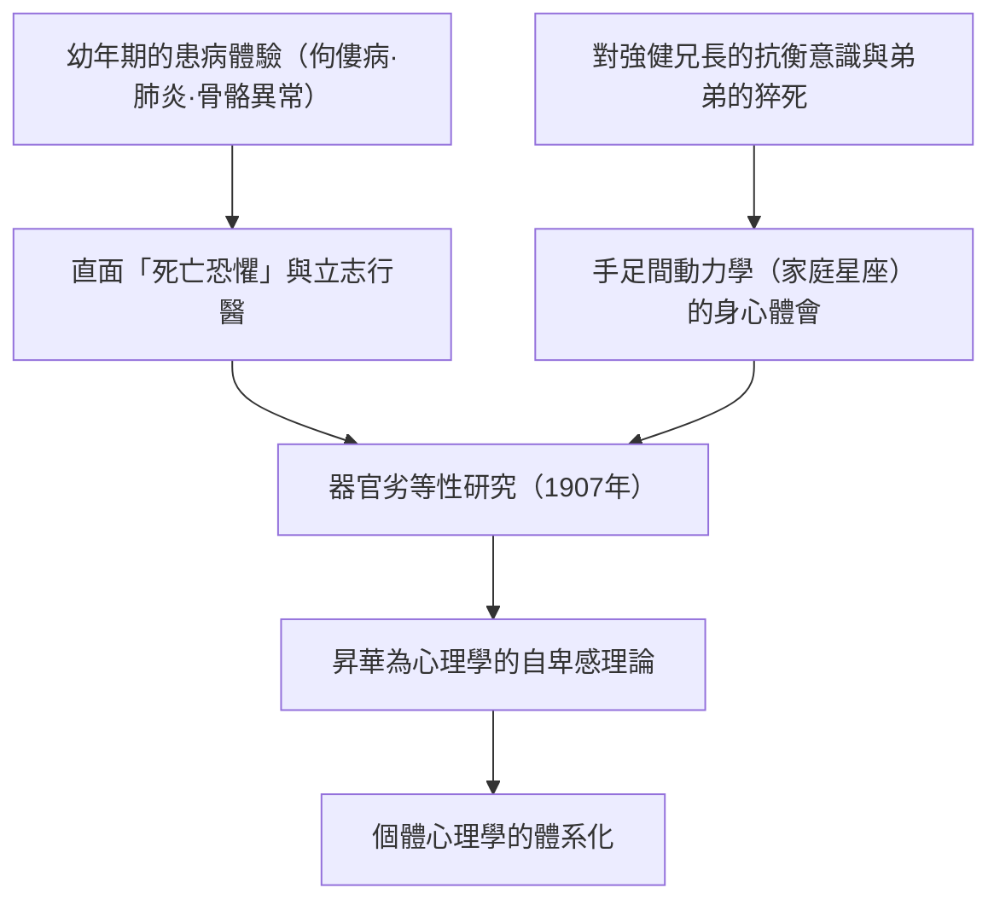
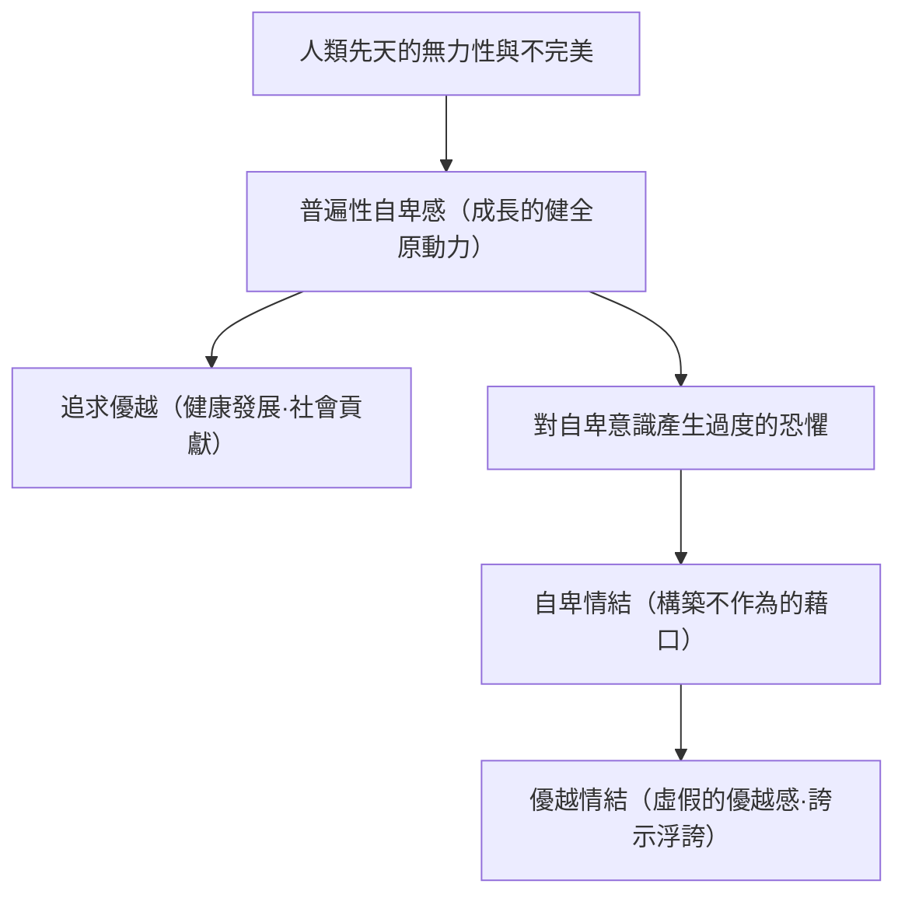
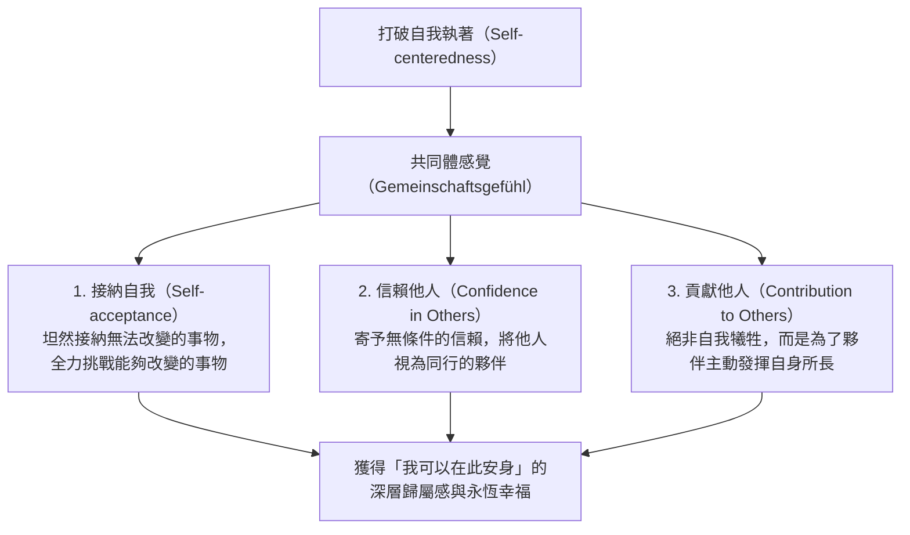
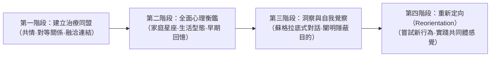

## 序論：為何在此時此刻，需要阿爾弗雷德·阿德勒？

在20世紀初葉維也納蓬勃興起的深層心理學思潮中，由阿爾弗雷德·阿德勒（Alfred Adler, 1870–1937）所奠定的「個體心理學（Individual Psychology / 德：Individualpsychologie）」，在當代依然散發著無與倫比的強韌實踐性與超前時代的敏銳洞察。

當西格蒙德·佛洛伊德（Sigmund Freud）將人類的心靈歸結於潛意識的本能衝動（原慾 / Libido）以及奠基於過去創傷的「心理決定論（Psychic Determinism）」，而卡爾·古斯塔夫·榮格（Carl Gustav Jung）則潛沉於原型與集體潛意識的神話深淵之際，阿德勒所開闢的視界卻無比澄澈明晰，始終堅定不移地朝向「人類所置身的現實社會與未來」。

阿德勒人性觀的基石在於一項深切的信念：「人絕非受過去事件機械論式操縱的被動存在，而是朝向自己所設定的目的，主體且具創造性地生存著的完整統媒體。」他為自己學派冠上的「個體心理學（Individual Psychology）」之名，其「Individual」源自拉丁語的 *individuus*（不可分割之物、不可分者）。換言之，他斷然拒絕將心靈切割為「意識與潛意識」、「理性與感性」、「本我、自我與超我」等對立要素的要素還原論，而是將人類視為一個不可分割、高度統一的生命系統（全機性、整體論）。

```
【深層心理學三大潮流的範式比較】

┌─────────────────┬───────────────────────────────┬───────────────────────────────┬───────────────────────────────┐
│ 學派 / 創始者   │ 西格蒙德·佛洛伊德             │ 卡爾·古斯塔夫·榮格            │ 阿爾弗雷德·阿德勒             │
├─────────────────┼───────────────────────────────┼───────────────────────────────┼───────────────────────────────┤
│ 學派名稱        │ 精神分析（Psychoanalysis）    │ 分析心理學（Analytical Psych）│ 個體心理學（Individual Psych）│
│ 人性觀          │ 機械論·決定論（創傷論）      │ 目的論·原型論（神話與心靈）  │ 主體論·整體論（目的論）      │
│ 心靈結構        │ 意識 / 前意識 / 潛意識（分割）│ 個人潛意識 / 集體潛意識       │ 不可分割的統媒體（整體論）    │
│ 根本動機        │ 原慾（性衝動·破壞衝動）      │ 心靈的整體性（自我實現·原型）│ 追求優越·共同體感覺          │
│ 治療與取向      │ 回溯壓抑記憶·宣洩（發洩）    │ 夢境分析·原型整合·個體化    │ 生活型態的重新定向·鼓勵賦能  │
└─────────────────┴───────────────────────────────┴───────────────────────────────┴───────────────────────────────┘
```

阿德勒心理學絕不僅僅是臨床心理學的一個流派。它更是一門回答人類「應如何克服自卑感、與他人合作協調、獲取歸屬感與幸福並生活下去」的實踐性存在哲學，亦是深具民主精神的社會教育思想。本文將從阿德勒與佛洛伊德的思想論爭出發，依序剖析目的論、自卑感與追求優越、生活型態、人生三大課題、共同體感覺、課題分離，直至與當代認知行為治療（CBT）及正向心理學一脈相承的理論體系全貌，以兼具學術嚴謹度與思想深度的視角進行徹底解明。

---

## 1. 阿德勒的生平與個體心理學的形成史

### 1.1 幼年時期的疾病體驗與「器官劣等性」的原風景
阿爾弗雷德·阿德勒於1870年2月7日出生於奧匈帝國首都維也納近郊的彭青（Penzing），在一個猶太裔穀物商人的家庭中排行次子。

要深刻理解阿德勒心理學，絕不可忽略他幼年時期自身刻骨銘心的身體磨難體驗。阿德勒幼年時期患有嚴重的「佝僂病」，骨骼發育遲緩，直到四歲時才能勉強行走。五歲時，他又不幸罹患致命的急性肺炎；在病榻邊，他親耳聽見主治醫師向父親沉痛宣告「這個孩子已經沒救了」。然而，當他奇蹟般地從瀕死邊緣康復的那一刻起，阿德勒心中便立下了一個堅定不移的目標（假想目的）：「我要成為一名戰勝疾病、直面死亡恐懼的醫生。」

此外，面對健康健美、運動天賦卓越的兄長西格蒙德，阿德勒心中激盪著強烈的競爭意識與自卑感；與此同時，他的弟弟在襁褓中於他身旁的嬰兒床上猝死。這些死亡、疾病、生理脆弱性，以及手足之間無可避免的比較與競爭，成為他日後提出「器官劣等性（Organ Inferiority）」、「自卑感（Inferiority Feeling）」以及「家庭星座（Family Constellation）」理論最為堅實的原初生命體驗。



### 1.2 維也納週三心理學會與佛洛伊德的決裂（1902–1911）
從維也納大學醫學院畢業後，阿德勒最初以眼科醫師開啟職業生涯，隨後轉為一般內科醫師，最終投身於精神醫學領域。在普拉特（Prater）遊樂園為眾多馬戲團藝人、工匠及勞工階級看診的過程中，阿德勒注意到一個耐人尋味的現象：當個體的特定器官存在先天或後天的缺陷（器官劣勢）時，人體往往會透過過度發展其他器官或精神機能來加以彌補，這便是「過度補償（Overcompensation）」。這項觀察促使他對身心補償機制產生了極大的研究興趣。

1902年，阿德勒在報紙書評中公開為佛洛伊德的劃時代巨著《夢的解析》辯護。佛洛伊德深受感動，隨即邀請阿德勒加入每週三晚間於佛洛伊德寓所舉辦的私人小型研討會（即「週三心理學會」，後發展為維也納精神分析學會），阿德勒成為該學會的核心創始成員之一。到了1910年，阿德勒更榮任維也納精神分析學會主席，被公認為佛洛伊德最傑出且有力的接班人之一。

然而，兩人間的思想蜜月期並未持久。佛洛伊德堅守「泛性論（Pansexualism）」，將所有神經症的病因皆歸咎於「童年早期的性衝動（原慾的壓抑與固著）」；與此相對，阿德勒則主張推動人類行為的根本動力並非性本能，而是「試圖克服自身弱小與無力感的優越意志」、「攻擊衝動（Aggression）」以及「自我主張的渴求」。

1911年，雙方爆發了無可彌合的決裂。在維也納精神分析學會的定期例會中，阿德勒發表了一系列專題演講，公開批判佛洛伊德的性本能學說，並系統性地闡述了他自己的「男性抗爭（Masculine Protest）」理論。佛洛伊德對此極度震怒，嚴厲斥責阿德勒的學說是「否定精神分析核心基石的異端邪說」，絕不妥協。阿德勒隨後辭去學會主席及機關刊物主編之職，並與支持他的9位同道一同退出了精神分析學會。翌年（1912年），阿德勒等人將其團體命名為「自由精神分析學會」，隨後正式改名為「個體心理學會（Society for Individual Psychology）」。至此，與佛洛伊德精神分析徹底分道揚鑣的「個體心理學」，正式宣告誕生。

---

## 2. 目的論 vs 原因論：心理學的範式轉移

### 2.1 機械論原因論（Causality）的極限與對創傷論的否定
構成阿德勒心理學核心骨架的最激進轉向，莫過於對傳統「原因論（Causality）」的徹底批判，以及「目的論（Teleology）」的全面確立。

以佛洛伊德為代表的古典精神醫學及近代科學，將艾薩克·牛頓式的「機械因果律」生搬硬套至人類的精神領域。換言之，即是「過去的事件（A）必然導致了現在的狀態（B）」的決定論圖式。例如，「因為童年時期遭受父母虐待、缺乏關愛（A），所以如今罹患社交恐懼症、無法融入社會（B）」。

對此，阿德勒予以深刻而犀利的批判。阿德勒指出，過去的客觀經歷本身並不能決定一個人。如果過去的心理創傷具有不可避免的宿命性決定力，那麼所有在嚴酷環境下成長的人，理應毫無例外地患上相同的神經症，人類的自由意志與康復的可能性便將蕩然無存。阿德勒在此做出了石破天驚的斷言：

> 「任何經驗本身都不是成功或失敗的原因。我們並非因自己經驗的衝擊——即所謂的創傷——而蒙受痛苦；相反地，我們是在自己的經驗中，主動尋找符合自身目的的素材，並賦予其獨特的意義。」
> （*What Life Could Mean to You*, 1931，《自卑與超越》）

```
【原因論與目的論的認識論對比】

■ 原因論（佛洛伊德式的因果律·決定論）
過去的事實（父母虐待、失戀、失敗挫折）
  -- "不可避免的因果結合（外因決定論）" -->
現在的結果（社交恐懼、足不出戶、消極厭世）
※人類淪為過去的提線木偶；在無法改變過去的前提下，必然陷入絕望的宿命論。

■ 目的論（阿德勒式的行動論·主體論）
當下隱蔽的目的（避免與他人發生衝突、逃避受傷的風險）
  -- "為達成目的而主動選擇手段（內因創造論）" -->
當下症狀與情緒的生成（自發製造焦慮、憤怒與恐懼）
※過去的事實僅是可供調用的素材。人類是為了「現在的目的」，而主動揀選並利用過去的記憶。
```

### 2.2 目的論（Teleology）的結構與情緒的「使用」
在阿德勒的目的論框架中，人類的行為、情緒，甚至各類精神症狀（如焦慮、抑鬱、恐慌、強迫症狀），都應被理解為當事人為了達成其無意識中所抱持的「隱蔽目的（Hidden Goal）」而採取的「手段」。

以一位患有社交恐懼症、「一旦站在眾人面前便會手腳顫抖、面紅耳赤、無法開口言語」的患者為例：
- **原因論的解釋**：「過去曾在眾人面前出醜並蒙受羞辱，這段創傷經歷啟動了潛意識中的恐懼條件反射。」
- **目的論的解釋**：「該患者內心深處抱持著『絕不想在人前丟臉』、『若失敗而暴露出自己的無能將令我無法承受』的目的。為了達成這個目的，他主動製造了『臉紅』與『顫抖』等身體症狀，從而獲得了『因為生病了，所以我才無法在眾人面前表現』的正當藉口（不在場證明）。」

此處極為關鍵的洞見在於：情緒（如憤怒、焦慮、悲傷）並非從外在被動襲來、令人身不由己的生理產物，而是個體為了達成自身目的而「捏造並加以使用的工具」。

阿德勒提出過一個著名的「憤怒工具說」：一位母親正在對孩子怒目圓睜、厲聲訓斥；此時，班導師打來的電話突然響起。母親在拿起話筒的瞬間，嗓音立刻奇蹟般地切換為極其客氣、溫和有禮的語調與老師交談；然而在掛斷電話的下一秒，她的面容再度轉為猙獰，繼續對著孩子咆哮。如果憤怒真的是一種生理衝動、完全不可抗力地吞噬了理性，那麼在數秒鐘之內切換為冷靜客氣的對話是絕不可能發生的。母親顯然是為了達成「迅速震懾孩子、迫使其順從」的目的，而有意識地動用、召喚了憤怒這項情緒工具。

在個體心理學中，人類絕非情緒的奴隸；相反地，人類是為了自身的目的，自主選擇並支配情緒的真正主權者。

---

## 3. 自卑感、自卑情結與追求優越

### 3.1 從器官劣等性走向普遍性自卑感
在阿德勒早期的研究《器官劣等性研究》（*Studie über Minderwertigkeit von Organen*, 1907）中，他深入剖析了身體器官的機能不全以及生物體針對這種缺陷所進行的補償作用。心臟、腎臟或感官存在先天脆弱性的個體，會透過中樞神經系統的補償性努力，竭力克服該缺陷。

阿德勒將這一生理學與病理學的敏銳洞見，極具開創性地推展至整個人類心靈的廣袤領域。與自然界其他生物相比，人類在出生時處於極端無助與脆弱的狀態。人類既沒有鋒利的獠牙與爪子，也沒有禦寒的厚實毛皮，若無父母撫育庇護，甚至無法獨自存活一天。因此，每一個人在童年時期，必然置身於力量強大的成人環繞之中，無可避免地深刻體認到自身的無力、渺小與不完滿。

阿德勒將這種意圖擺脫無力狀態的心靈張力，命名為「自卑感（Minderwertigkeitsgefühl / Inferiority Feeling）」。最為關鍵的是，在阿德勒眼中，**自卑感本身絕非病理，而是推動人類進化與個體自我成長極為健全且普遍的原動力（Engine of Growth）**。



### 3.2 自卑感 vs 自卑情結的嚴格概念區分
在日常語彙中，「情結」一詞常被通俗地等同於一般的自卑感；然而在阿德勒心理學中，「自卑感」與「自卑情結（Inferiority Complex）」有著涇渭分明的嚴格界定：

1. **自卑感（Inferiority Feeling）**：
   個體在意識到自身現狀與理想狀態之間存在差距時，所產生的主觀不完滿感。例如「我的知識儲備尚顯不足，因此我需要更加發憤研讀」、「我的技術還未精熟，因此我需要加緊磨練」。這種感覺乃是透過真實的努力與不懈的鑽研來克服課題、實現自我提升的健康動機。

2. **自卑情結（Inferiority Complex）**：
   將自卑感當作遁詞與藉口，用以逃避人生課題的病理狀態。其特徵是構築「因為存在A，所以我無法做到B」的虛假因果關係（虛妄的因果性）。例如：「因為我學歷不高，所以我無法成功」、「因為我相貌平平，所以我結不了婚」、「因為父母教養不當，所以我無法融入社會」。
   陷入自卑情結的人，主動放棄了透過自身努力去解決課題的責任，為了捍衛脆弱的自尊心免受現實挫敗的打擊，將自身的劣勢化為盾牌，裹足不前。

### 3.3 優越情結與權力意志的病理
當深陷自卑情結折磨的人，無法承受直面自身劣勢的劇烈痛苦時，往往會走向另一個極端，演變成「優越情結（Superiority Complex）」。

優越情結是一種防衛機制：個體並非透過現實中的切實努力去克服困難，而是逃避到「偽裝成自己似乎高人一等」的虛妄優越感之中。具體而言，主要表現為以下幾種形態：

- **誇耀權威（借光效應）**：到處宣揚自己與名人、權貴的私人交情，藉由奢侈名牌、頭銜或社會標籤來武裝自己。
- **沉溺自誇與昔日榮光**：滔滔不絕地吹噓當年的輝煌成就，試圖以此掩蓋當下的無所作為與平庸。
- **「誇耀不幸」與藉弱者姿態施行支配**：無休止地向身邊的人傾訴自己所遭遇的境遇是多麼坎坷、受盡多少委屈與痛苦，藉此博取同情，以道德與罪惡感操縱他人，並索求特權對待。阿德勒稱此為「將弱小特權化」，並將其視為最為棘手、最難以矯治的優越情結形態。

### 3.4 追求優越（Striving for Superiority）的健康導向
人類試圖克服自卑感的根源動機，在阿德勒早期曾被賦予「攻擊衝動」、「權力意志」乃至「男性抗爭」等概念；然而到了其晚年，阿德勒將這一概念全面昇華為更具包容性與建設性的「追求優越（Striving for Superiority / 向上奮鬥的努力）」。

健全的追求優越，**絕非「在人際競爭中勝過他人、打倒並支配他人」**。它的真諦在於：**「不與他人比較，而是與自己的理想自我比較，勇敢地朝向未知邁進、跨越當下的自我局限」**；是在水平的維度上，將他人視為平等的存在，並在此基礎上不斷提升自我。當追求優越導向「垂直的序列（上下階層·支配與被支配）」時，它便淪為神經症的溫床；而當追求優越導向「水平的協調（為共同體做出實質貢獻）」時，它便化為創造性且健康的自我實現歷程。


---

## 4. 整體論與生活型態：個人的認知架構

### 4.1 整體論（Holism）：作為不可分割之一體的人類
阿德勒心理學的第一公理乃是「整體論（Holism）」。自近代合理主義之父勒內·笛卡兒（René Descartes）以來，西方思想便長期為劃分心靈與身體的「心身二元論」所主導。在精神醫學領域，佛洛伊德同樣將心靈切割為「意識 / 潛意識」、「自我 / 本我 / 超我」等相互對立的構成要素，並以此建構出個體內在衝突（內在心理衝突）的理論模型。

阿德勒對這種要素還原論予以全盤否定。在阿德勒看來，人是一個不可分割的完整統媒體（Individual = in- [不可] + dividual [可分割]）。
- 「理性」與「感性（情緒）」絕非對立。情緒乃是為了實現理性所追求的目的而生，並與理性高度協同運作。
- 「意識」與「潛意識」絕非敵對。兩者是朝向同一目的協同運作的同一枚硬幣之兩面。所謂潛意識，不過是指「當事人尚未用語言明確表述、尚未自覺的目的之領域」而已。
- 「心靈」與「肉體」亦非彼此獨立的實體。當感受到強烈焦慮時心跳加速、胃部痙攣疼痛，正是心靈與肉體作為一個完整有機體共同應對危機的體現。

阿德勒心理學絕不接受「我理智上明白，但情緒控制不住」、「潛意識的慾望違背理智驅使了我」這類二元論式的託辭。它堅決主張將全部責任歸結於作為行為主體的整體人（Whole Person）——「正是我自己，為了達成那一目的，主動調用了憤怒的情緒來大聲咆哮」。

```
【要素還原論（佛洛伊德）與整體論（阿德勒）的結構差異】

■ 要素還原論（心理割裂模型）
┌─────────────────────────┐
│ 超我（道德·規範）       │
├─────────────────────────┤  ← 內在衝突·分裂
│ 自我（適應現實的理性）   │
├─────────────────────────┤  ← 壓抑與抗拒
│ 本我（潛意識的本能慾望） │
└─────────────────────────┘
※滋生「都是本能害得理智失控」、「潛意識在操控我」等自我欺瞞的藉口。

■ 整體論（不可分割整合模型）
┌──────────────────────────────────────────────┐
│                  整體人（不可分割的自我）                    │
│                                                              │
│  目的論統媒體：                                              │
│  理性·情緒·意識·潛意識·肉體皆為                          │
│  達成「單一的隱蔽目標（生活型態）」而全面協同運作            │
└──────────────────────────────────────────────┘
※一切行為與情緒的最終責任，皆歸屬於高度整合的「我」。
```

### 4.2 生活型態（Lifestyle）的定義與三大要素
在阿德勒心理學中，指涉性格、人格、世界觀以及認知模式總和的核心概念，正是「生活型態（Lifestyle / 德：Lebensstil，亦譯生活風格）」。此概念乃是現代認知療法中「基模（Schema）」與「認知架構」的先驅思想。

所謂生活型態，是個體在童年早期（約4至6歲前），為了在自身的生理條件、家庭環境及文化脈絡中求生存，而主動選擇與構築的「對世界與自我賦予意義的定型化模式」。生活型態一旦確立，便會在無自覺的狀態下，作為一套全自動的導航羅盤，過濾個體成年後的一切知覺、思考、情感與行為。

在阿德勒學派心理學中，生活型態主要由以下三大核心要素構成：

1. **自我概念（Self-concept）**：
   關於「我是……」的自我確信與信念。例如：「我是無力的」、「我是聰穎的」、「我是不被愛的人」。
2. **自我理想（Self-ideal）**：
   關於「我必須是……」、「我應該是……」的主觀標準。例如：「我必須永遠名列前茅」、「我必須受到所有人的溫柔對待」、「我絕對不能遭遇失敗」。
3. **世界觀（Weltbild / Picture of the World）**：
   關於「他人與社會是……」的環境確信。例如：「世界充滿了危險」、「他人都是企圖利用我的潛在敵人」、「人生是難以預測且荒謬的」。

倘若某人的自我概念是「我很無力」，自我理想是「我絕不能受傷」，而世界觀是「身邊的人皆充滿攻擊性與冷酷」，那麼在其生活型態的指引下，此人在一切人際互動中都將草木皆兵、過度防衛，將他人微小的舉動詮釋為惡意，進而採取退縮閉鎖或逃避行為。這並非不可理喻的病理缺陷，就該個體的生活型態邏輯而言，是完全合理且具內部一致性的自保策略。

### 4.3 早期回憶（Early Recollections）的診斷意義
為了客觀釐清個體未曾自覺的生活型態，阿德勒創制了一項極具威力的臨床評估技法——「早期回憶（Early Recollections）」分析。

早期回憶，是指引導當事人回溯「記憶所及最幼小時期的記憶（通常為6至8歲以前的具體生活片段）」，並令其詳盡陳述當時的場景細節、出現的人物、自身的行動以及當下感受到的情緒。

佛洛伊德將童年記憶視為「過去客觀事實的痕跡」或「被壓抑之創傷的化石」；然而，立足於目的論的阿德勒，卻將記憶視為「為了合理化並鞏固當前的生活型態，而從無數過去事件中主動揀選、重構出來的創作（內在敘事）」。人類從未如實拷貝過去；我們僅僅保留了符合當前目的的記憶，並為其塗抹上最合適的主觀色彩。

```
【早期回憶的分析範式】

- 回憶內容：「5歲時，我從院子裡的樹上摔了下來，擦傷了腿。母親急忙奔跑過來，將我緊緊抱在懷裡。」
  ↓
- 分析視角：
  1. 主動還是被動？（是自己主動行動，還是被動等待事情發生？）
  2. 他人的角色是什麼？（是漠視危險的敵對者，還是趕來施救的庇護者？）
  3. 對自我的認知是什麼？（渺小脆弱、容易受傷的存在）
  ↓
- 提取出的生活型態信念：
  「世界充滿危險。只要我稍有不慎就會受傷，我是個無助的存在。
   然而，只要我展現脆弱並尋求援助，他人就會溫柔地保護我。」
  ↓
- 與當前行為模式的連貫性：
  面臨挑戰與困境時，傾向於不靠自身力量解決，而是藉由表現疾病或無助，以博取他人的關照與支援。
```

阿德勒一針見血地指出：「早期回憶是否符合客觀史實（究竟是真確發生，抑或是當事人的幻想與錯記）根本無關緊要。」真正至關重要的關鍵在於：該個體**「為何在成千上萬的童年經歷中，偏偏至今仍牢牢銘記著那一個特定畫面？」**在早期回憶中，高度凝聚了一個人當下如何審視世界、以及打算憑藉何種生存策略度過餘生的「心靈藍圖」。

---

## 5. 人生三大課題與共同體感覺

### 5.1 人生三大課題（Life Tasks）
阿德勒將人類在社會中生存無可迴避的人際關係挑戰，正式定名為「人生課題（Life Tasks / 德：Lebensaufgaben）」。阿德勒將其劃分為三個由淺入深的層級：「工作的課題」、「交友的課題」與「愛的課題」。

```
【人生三大課題的階層與難度】

［愛的課題（Love Task）］
- 對象：伴侶、配偶、核心家庭等極其緊密的人際關係
- 要求水準：最高的心理親密度與自我暴露、命運共同體、徹底的平等維繫
- 逃避藉口：對束縛的恐懼、不忠背叛、精神冷暴力、嚴苛的完美主義

［交友的課題（Friendship Task）］
- 對象：友人、鄰里、地域社群、超越直接利害關係的對等夥伴
- 要求水準：拋棄競爭的水平信賴關係、利他性、彼此的深刻接納與認同
- 逃避藉口：「害怕遭到背叛」、「反正沒有人能真正理解我」

［工作的課題（Work Task）］
- 對象：職業活動、經濟生產、社會分工網絡
- 要求水準：遵守規範、基礎協調合作能力、對工作成果的承諾
- 逃避藉口：對失敗的恐懼、害怕被評價、拖延推諉、社交恐懼
```

1. **工作的課題（Work Task）**：
   人類作為生物族群得以延續，必須參與社會分工協作網絡，生產出對他人有益的價值。在這三大課題中，工作的利害關係最為清晰，且行為受到契約與社會規則的明確規範，因此就純粹人際心理距離而言難度最低；然而，一旦從中逃避，便會直接導致經濟崩潰與社會適應機能的喪失。

2. **交友的課題（Friendship Task）**：
   脫離工作那種直接的經濟利害關係，建立純粹的朋友與同儕情誼之課題。這要求雙方摒棄競爭與攀比，作為平等的獨立個體彼此真誠信賴，並敢於展現自身的脆弱。許多人在這一課題前止步，出於「害怕被背叛、被嫌棄」的猜忌防衛心態，將自己的人際圈嚴重封閉。

3. **愛的課題（Love Task）**：
   戀愛關係、婚姻關係、親子關係等人生中歷時最久、親密度最高的一對一人際連結。由於彼此心理距離被壓縮至零，個體最不願示人的缺陷、自私與脆弱都會暴露無遺。此課題要求雙方徹底摒棄支配與控制對方的企圖，亦不盲目追求對方的認可，而是作為全然平等的伴侶，共同經營「兩人的幸福」。因其要求極高的心靈成熟度，故被視為三大課題中難度最高者。

阿德勒指出，一切心理適應障礙（各類神經症、退縮繭居、非行行為、抑鬱傾向），其根源皆在於當事人面臨這些人生課題時，因過度懼怕失敗將摧毀其自尊心，從而企圖從這些考驗中落荒而逃——這便是阿德勒所稱的「人生謊言（Life Lie）」。

### 5.2 共同體感覺（Gemeinschaftsgefühl / Social Interest）的全貌
作為阿德勒心理學思想冠冕上的明珠，最為深邃悠遠的概念莫過於「共同體感覺（Gemeinschaftsgefühl / 德語原意為對共同體的歸屬與情感）」。在英語學界，該詞普遍被翻譯為「Social Interest（社會興趣 / 社會關懷）」。

所謂共同體感覺，即是**「將對自我的執著（Self-centeredness），轉化為對他人的關切（Social Interest）」**；是將他人不再視為潛在的「競爭對手或敵人」，而是視為風雨同舟的「夥伴」，並深深體會到「我在共同體中擁有屬於自己的容身之處」的安住與歸屬心境。

阿德勒斷言，衡量一個人心理健康程度的唯一終極指標，就是其共同體感覺的高低。缺乏共同體感覺的人，將世界視為弱肉強食的角鬥場，他人若非威脅自身的宿敵，便是可資利用的工具。這種人必然無時無刻不被孤獨與惶恐所噬，為了攫取虛幻的優越感而在神經症的泥淖中苦苦掙扎。



### 5.3 構成共同體感覺的三大支柱
為了將形而上的共同體感覺落實於臨床實踐與日常生活，當代阿德勒學派將其架構為相互鏈接、循序漸進的三大支柱：

1. **接納自我（Self-acceptance）**：
   嚴格區別於盲目的「自我肯定（正面思考）」。自我肯定往往是「明明做不到，卻硬對自己催眠說『我一定能做到』的自我欺騙」；而接納自我，則是「如實坦然接納那個不完美、有局限的自己，並在此客觀認知之上，鼓起勇氣全力以赴去改變那些能夠改變之物的篤定態度」。這與著名的尼布爾祈禱文（「主啊，求祢賜我平靜的心，去接納我無法改變的事；賜我勇氣，去改變我所能改變的事；並賜我智慧，去分辨兩者的差異」）完全相通。

2. **信賴他人（Confidence in Others）**：
   嚴格區別於「信用（Credit）」。信用是建立在擔保品、過往實績與特定條件之上的計算性信任（如同銀行的抵押貸款）。與之相對，信賴他人則是在毫無擔保、不設任何附加條件的前提下，深信對方的善意與人格。背叛的風險固然永遠存在；然而，阿德勒學派主張，對方是否背叛那是「對方的課題」，而自己選擇是否付出信賴則是「自己的課題」。唯有透過這種課題釐清，人才能徹底破除猜忌的牢籠，締結深厚的人際聯結。

3. **貢獻他人（Contribution to Others）**：
   嚴格區別於受虐式的「自我犧牲（Self-sacrifice）」。損害自身的生命與尊嚴去迎合他人，只是被認同需求驅使的病態奉獻。健全的貢獻他人，乃是「為了實踐自我存在的價值與意義，自發將自身擁有的智慧與力量奉獻給共同體中的夥伴」。阿德勒曾一語道破天機：「所謂的幸福，就是擁有貢獻感。」深刻體認到自己對他人有所助益，能讓個體確信「我是有價值的存在」，而這正是生而為人最強大的勇氣源泉。

---

## 6. 課題分離與勇氣心理學

### 6.1 課題分離（Separation of Tasks）的邏輯結構
在人際關係的盤根錯節中，阿德勒心理學開出了一劑斬斷糾葛、直擊病灶的俐落手術刀——「課題分離（Separation of Tasks）」。

人類社會中幾乎所有的人際衝突、摩擦、痛苦與窒息感，無一例外皆源自於**「妄圖橫加干涉他人的課題」**，或是**「任由他人恣意踐踏干涉自己的課題」**。

為了精準判別某一項課題究竟屬於何人，阿德勒提出了一項極致簡明且不容置疑的黃金準則：
**「因該項選擇所招致的一切後果與責任，最終由誰來承擔？」**

```
【課題分離的具體事例：孩子的學業問題】

- 父母的混淆認知（課題混淆）：
  「孩子如果不讀書，將來人生就毀了，所以我必須逼迫他好好念書。」
  → 父母強行越界介入孩子的課題（實施權力壓迫與控制）。
  → 孩子產生強烈叛逆，甚至將「拒絕讀書」反向利用為刺痛父母、報復父母的武器。

- 基於課題分離的理性釐清：
  1. 「念不念書？因成績滑落而考不上理想學校的終極後果，由誰承擔？」
     → 承擔最終人生苦果的，毫無疑問是【孩子本人】（這是孩子的課題）。
  2. 父母應當做些什麼？
     → 絕非厲聲命令「去讀書」，而是在孩子萌生求知慾時隨時提供協助資源，
        並持續傳達「我堅信你的能力，並隨時守護著你」的堅定姿態（提供支援的準備與守望）。
```

課題分離絕不等於冷血的漠不關心或放任棄養（疏忽忽視）。放任是指對孩子的所作所為毫不知情、漠不關心。阿德勒式的支援之道，正如那句著名的西方諺語所喻：「你可以把馬牽到水邊，但你絕不能強按馬頭喝水。」是否喝水是馬（當事人）的課題；強行扳開馬嘴灌水，則是不可饒恕的暴力與霸道行徑。

### 6.2 否定認同需求與「自由」的定義
將課題分離貫徹到底的必然邏輯終局，便是阿德勒心理學對瀰漫於現代社會的「認同需求（Desire for Approval / 尋求他人認可）」所作出的無情批判與徹底否定。

阿德勒深刻洞察到：終日汲汲營營於「想要獲得他人肯定」、「想要被誇獎」、「想要在他人眼中顯得優秀」的人，實質上只是在「過著他人期望的人生」。因為在乎他人的評價，本質上就是企圖越俎代庖去掌控「他人如何看待我」這一屬於【他人的課題】——這是一場注定徒勞無功、身心俱疲的妄想。

阿德勒心理學給予「自由」最石破天驚的定義莫過於：**「所謂的自由，就是不懼怕被他人討厭。」**
八面玲瓏、試圖討好所有人的人，既不真誠，更是對自己生活型態的漫長折磨。走自己深信為正義的道路，在此過程中他人是欣賞你抑或厭惡你，那純粹是「他人的課題」，屬於自己根本無法干涉、亦無須在意的領域。不依賴他人的讚許，唯獨仰賴自身的良知與對共同體的實質貢獻感昂首前行——唯有如此，方能抵達真正無羈無絆的精神自由。


---

## 7. 鼓勵（Encouragement）與民主教育論

### 7.1 賞罰教育的全面批判：讚美的危險性
在阿德勒心理學的臨床與教育論中，最具震撼力的核心主張之一，便是「徹底揚棄賞罰教育（兼斥讚美與斥責）」。

在日常育兒及企業管理中，「多讚美以激發潛能」的做法往往備受推崇。然而，阿德勒卻犀利地看穿了「讚美」這一行為的權力本質。阿德勒指出，讚美他人時，必然隱含著一種**「有能力者居高臨下俯視無能力者，並以此進行評價與操縱」的垂直關係（階層支配）**。倘若成年人以對等的姿態對另一位成年人說出「做得真好」、「你真了不起」，會顯得極其突兀且不敬，其根源正在於此種言語背後潛藏著不平等的權力位階。

```
【「讚美與斥責」與「鼓勵」的範式對比】

┌─────────────────┬───────────────────────────────┬───────────────────────────────┐
│ 比較項目        │ 賞罰教育（讚美 / 斥責）       │ 鼓勵（Encouragement / 賦能）  │
├─────────────────┼───────────────────────────────┼───────────────────────────────┤
│ 人際關係之前提  │ 垂直關係（上下階層·支配操縱）│ 水平關係（平等·尊敬·真誠信賴）│
│ 評價之基準      │ 最終結果·能力表現·與他人比較│ 努力歷程·動機意圖·與自我比較│
│ 對方產生的心理  │ 渴望認同·恐懼失敗·形成依賴  │ 建立自信·自主自律·貢獻感增強│
│ 動機引發之性質  │ 外在動機（為求獎賞、規避處罰）│ 內在動機（自發為共同體做出貢獻）│
│ 具體言語互動    │ 「好厲害！」、「考一百分真棒」│ 「謝謝你幫了大忙」、「感到很欣慰」│
└─────────────────┴───────────────────────────────┴───────────────────────────────┘
```

阿德勒認為，「讚美」的最大弊害，在於會在孩子或下屬心中根植深重的認同需求中毒症——使他們陷入「若得不到讚賞就不行動」、「若缺乏外在肯定便感受不到自我價值」的被動泥淖。長此以往，他們甚至會將「未獲讚賞」直接等同於「受到懲罰」，因而對失敗產生極端恐懼，退縮不敢挑戰任何未知。

與此相對，「斥責」則更加具備暴力性。斥責本質上是當事人放棄了透過建設性言語進行平等對話，企圖依恃情緒（憤怒）這項廉價的權力槓桿來強行使對方屈服的低劣溝通手段。遭受嚴厲斥責的一方，非但不會打從心底反省自身過失，反而會激化其「如何隱瞞不被發現」、「日後如何實施報復」的防衛與反彈心理。

### 7.2 鼓勵（Encouragement）的技法與水平關係
作為替代賞罰教育的正道，阿德勒提出了「鼓勵（Encouragement / 賦予勇氣）」的理論與實踐。
所謂鼓勵，是指**「從對方的內心深處，引導出克服困難所必需的活力（勇氣）之援助歷程」**，它必須奠基於全然平等的「水平關係」之上。

鼓勵的核心技術要點如下：

1. **表達感謝與喜悅（如「謝謝你」、「我感到很欣慰」）**：
   不對他人進行高高在上的裁決性評價，而是真誠傳達對方的行為為自己或共同體帶來了何等積極助益的主觀感受。「多虧有你幫忙，真的減輕了我很多負擔」、「看見你平安健康，我打從心底感到欣喜」。透過這種互動，對方能真切感受到「我擁有貢獻他人的力量」、「我是有價值的存在」，從而建立堅實的自我效能感。
2. **聚焦於努力歷程與動機意圖**：
   不將目光局限於考卷分數或業績指標等冰冷的「結果」，而是深入看見個體一路走來的「努力歷程」與「積極嘗試」。「你堅持到了最後一刻，展現了無比的毅力」、「你在這個環節動足了腦筋」。當遭遇失敗挫折時，更是施行鼓勵的最佳契機，雙方能以平等的夥伴姿態共同探討「能從這次經驗中汲取何種啟發」。
3. **聚焦於優勢而非執著於缺點（認知重塑 / Reframing）**：
   將「三分鐘熱度」重新詮釋為「好奇心旺盛且應變靈活」；將「冥頑不靈」重新詮釋為「具有貫徹個人意志的非凡韌性」。透過脈絡重構，協助當事人將原本抱持自卑感的特質轉化為前進的基石。

### 7.3 維也納的兒童諮商所運動與公立教育改革
阿德勒的理論從未自封於象牙塔內的抽象思辨，而是以波瀾壯闊的社會實踐蔚為奇觀。第一次世界大戰結束後，奧地利革命促使社會民主黨執掌市政，在被譽為「紅色維也納（Red Vienna）」的黃金年代中，阿德勒與維也納市教育委員會深度合作，在各公立學校內部先後創立了高達三十餘所的「兒童諮商所（Child Guidance Clinics）」。

阿德勒所創立的兒童諮商所採取了一種劃時代的開放運作機制：醫師、教師、家長以及學童本人以平等的座次圍坐一堂，在公開透明的氛圍中進行教育諮商與對話。阿德勒堅信，唯有徹底瓦解家庭與學校中專制且威權的壓迫結構，培育出民主且互助合作的社群精神，才是從根本上防範下一代萌生神經症、反社會行為乃至抵禦極端軍國主義戰爭的唯一途徑。這場在維也納大地上開展的壯舉，成為現代學校心理學（School Psychology）與駐校諮商制度最直接的思想發軔與實踐先驅。

---

## 8. 阿德勒學派臨床諮商的技法與歷程

### 8.1 治療關係的建立：對等的合作同盟（Collaborative Alliance）
在古典精神分析的場域中，醫病關係具有高度非對稱與權威色彩：受分析者仰臥於診療躺椅（Couch）之上，而精神分析師則隱身其後保持緘默，並不時給出權威性的精神詮釋。

阿德勒學派諮商則徹底顛覆了此種權力結構。諮商師與個案在高度完全相等的椅子上促膝相對。雙方乃是「平等的共同研究者」，彼此締結旨在共同解開個案人生謎題的「夥伴關係（合作同盟）」。在此架構下，諮商師絕非全知全能的導師，而是在個案憑藉自身力量克服人生課題的征途上，一路提燈引路的陪伴者與促進者（Facilitator）。



### 8.2 心理衡鑑：家庭星座（Family Constellation）
在心理衡鑑階段，阿德勒學派最為重視的評估核心，莫過於對「家庭星座（Family Constellation / 家族構造）」的深入解析。

阿德勒發現，一個人在童年時期究竟養成何種生活型態，深受其在兄弟姊妹中的出生順序（Birth Order）以及個人對該位置的主觀心理詮釋所深刻左右：

- **第一子（長子 / 長女）**：曾獨享父母無微不至的關愛，但在弟妹誕生後體會到了「自王座跌落的失勢君主」之衝擊。長子往往留戀昔日的特權地位，對既有秩序、威權與規章制度抱持高度認同，責任感極強，但亦容易流於保守與僵化。
- **第二子（中間子）**：從誕生起便目睹一位走在前方的領先者（長子），因而始終處於「油門全開的競速狀態」。為了確立自身的獨特性，往往刻意選擇與長子迥異的領域追求優勢，展現出叛逆、顛覆體制，抑或是極擅協調斡旋的鮮明性格。
- **么子（幼子）**：在家庭中永遠不必面對「失寵跌落王座」的威脅，常在所有家庭成員的呵護溺愛中長大，或者成為企圖超越家中所有人的雄心野心家。這類個體容易發展出「我無須付出任何代價也理應獲得全體寵愛」的依賴型生活型態。
- **獨生子（獨生女）**：身邊沒有手足競爭對手，自幼完全浸潤在成年人的生活世界中。一方面容易顯露自我中心的傾向，另一方面也往往表現出遠超同儕的早熟心智與優異才華。

此處不可撼動的關鍵原則在於：出生順序本身絕無生理宿命論式的決定力；真正核心的重點在於——**「置身於該特定家庭網絡中，孩子為了爭取父母的關懷與確證自身容身之處，主動採取了何種獨特的生存策略（生活型態）」。**

### 8.3 蘇格拉底式對話（Socratic Dialogue）與洞察
阿德勒學派的臨床介入，摒棄了說教式的灌輸或單向的指令下達，而是遵循古希臘哲學家蘇格拉底的產婆術精神，全面採用「蘇格拉底式對話（Socratic Dialogue）」。

在對話中，諮商師絕不會發出「你當初為何要那麼做？」這種逼問過去歷史的原因論質問；取而代之的，是拋出引導當事人審視當下的目的論探問：「採取這種行為，你實際上希望達成什麼結果？」、「假若這項困擾你的症狀在明天徹底煙消雲散，你的生活型態將會發生何種實質轉變？」

藉由這類抽絲剝繭的對話，個案得以在沒有被審判威脅的安全情境中，親自照見並直面自己長年隱匿維繫的「人生謊言」與「虛假目的」。在阿德勒的語境中，所謂的「洞察（Insight）」，絕非停留在純粹智力層面的概念理解，而是深刻體認到**「自己人生的劇本，自始至終正是由我自己一手執筆撰寫的」**這種強烈的主體性自覺（Author of One's Life）。

### 8.4 重新定向（Reorientation）：新行為的實驗
在諮商歷程的終極階段——「重新定向（Reorientation / 重新導向）」中，個案將徹底告別陳舊、自我挫敗的生活型態，轉而主動選擇並踐行立足於共同體感覺的嶄新存在方式。

阿德勒學派極度反對將諮商局限於診室內咬文嚼字的文字遊戲，而是要求個案在真實的日常生活中勇於執行「微小的具體行為實驗」：
- 明天出門時，主動向素未謀面或平日疏遠的鄰居展露微笑並致以問候。
- 面對伴侶時，以具體的「感謝之詞」取代慣性的指責與挑剔。
- 拋棄苛求完全的完美主義，嘗試在工作成果達到80%時便主動向同仁展示，以開放心態徵詢回饋。

阿德勒堅定地宣示：「無論何時，改變性格（生活型態）永遠是可能的。」人隨時都能對自己的生活風格做出重新抉擇。我們所欠缺的從來不是天賦或能力，我們唯一欠缺的，僅僅是**「勇敢改變的勇氣（Courage to Change）」**。

---

## 9. 對當代思想、認知行為治療（CBT）與幸福感的深遠影響

### 9.1 作為認知行為治療隱蔽先驅的阿德勒
自20世紀後半葉迄今，縱橫全球精神醫學與心理治療領域的黃金標準，當屬「認知行為治療（CBT）」。然而，無論是「理情行為治療（REBT）」的創始人阿爾伯特·艾里斯（Albert Ellis），還是「認知療法（CT）」的奠基者亞倫·貝克（Aaron T. Beck），皆公開承認其理論核心深受阿德勒思想的直接啟發。

阿爾伯特·艾里斯甚至直截了當地指出：「阿德勒恐怕才是現代認知療法的真正鼻祖。」艾里斯名震心理學界的「ABC理論」（Activating Event = 誘發事件，Belief = 信念認知，Consequence = 情緒與行為後果），其本質正是阿德勒生活型態與主觀意義賦予理論的現代化轉譯。

```
【阿德勒心理學與認知治療的譜系連繫】

［愛比克泰德（古希臘斯多葛學派哲學家）］
「困擾人類的並非事物本身，而是人類對事物的看法與判斷。」
  ↓
［阿爾弗雷德·阿德勒（個體心理學，1912年起）］
- 目的論：並非客觀事件本身，而是個體所賦予的「意義」決定了情感與行為。
- 生活型態：童年時期構築的「認知架構（基模）」。
- 個體的主體責任與重新定向。
  ↓
［阿爾伯特·艾里斯（理情行為治療 REBT，1955年起）］
- ABC理論（指認並反駁不合理信念 / Irrational Beliefs）
［亞倫·貝克（認知療法 CT，1960年代起）］
- 自動化思考、核心信念（Core Beliefs）與認知扭曲（Cognitive Distortions）之修正
```

亞倫·貝克所系統歸納的各類「認知扭曲」（如非黑即白思維、災難化思考、過度概括、心理過濾等），與阿德勒在1910至1920年代著作中所深刻解構的「個體邏輯（Private Logic / 私人邏輯）」之偏頗缺陷如出一轍。阿德勒個體心理學，無疑是現代認知科學精神治療的最早源頭，在精神動力學與當代實證心理治療之間搭建起了一座堅實的橋樑。

### 9.2 與存在主義、實用主義哲學的共鳴
在哲學思想史的宏大座標中，阿德勒的人性觀與美國本土發展出的「實用主義（Pragmatism）」以及歐洲大陸的「存在主義（Existentialism）」交相輝映。

阿德勒從德國哲學家漢斯·費賓格（Hans Vaihinger）的名著《「如同」哲學》（*Die Philosophie des Als Ob*, 1911）中汲取了至為關鍵的理論養分。費賓格指出，人類並無法直接觸及客觀的絕對真理，而是在自己構築的「假想（Fiction / 彷彿正是如此的假說）」引領下採取行動。阿德勒將這一哲學概念引入心理學，確立了指引人類行為的終極目標並非外在客觀實體，而是個體主觀捏造的「假想目標（Fictional Final Goal）」。

此外，讓-保羅·沙特（Jean-Paul Sartre）所宣告的「人被判定為自由」、「存在先於本質」等存在主義核心命題，與阿德勒對「超越過去因果決定論、自我承擔抉擇責任」的強調達成了驚人的一致。阿德勒絕不允許人類將命運的挫折諉過於任何外在藉口；他一生都在堅決捍衛人類在任何極端逆境下皆保有自主選擇內在態度的崇高自由（這亦是維克多·弗蘭克意義治療學的核心）。在此意義上，阿德勒是一位徹頭徹尾的實踐性存在主義心理學家。

### 9.3 走向正向心理學與福祉（Well-being）研究的先聲
當馬丁·塞利格曼（Martin Seligman）等人在1990年代末期發起「正向心理學（Positive Psychology）」運動時，其所確立的長效幸福理論模型（PERMA架構：正向情緒 Positive Emotion、全心投入 Engagement、人際關係 Relationships、生命意義 Meaning、成就 Accomplishment），在很大程度上正是阿德勒「共同體感覺」（歸屬感、利他貢獻與克服人生課題）的現代量化實證翻版。

近數十年來，神經科學與社會心理學的大量實證研究（例如社會資本理論、利他行為引發催產素分泌的神經機制、主觀幸福感的決定因素等），均得出了一致的結論：「無私奉獻他人與締結良好的人際連結，乃是決定人類幸福感與健康壽命的最關鍵指標。」阿德勒在百年前僅憑臨床直覺與哲學一致性推導出的「共同體感覺」這一深奧命題，正被21世紀最頂尖的實證科學不斷證實其深邃的真理力量。

---

## 10. 結論：自我決定與勇氣的實踐哲學

阿爾弗雷德·阿德勒的個體心理學向現代人傳遞的最為震聾發聵的福音，莫過於**「人生無論從何時開始，都可以從當下這一刻徹底重寫」**——這是一門充滿無盡希望與自覺擔當的實踐哲學。

環顧現代社會，從基因決定論、神經科學還原論，到經濟階層固化乃至「原生家庭宿命論」等各類環境宿命說辭甚囂塵上。「正因為我是這種基因」、「正因為我有這種父母」、「正因為社會結構如此不公」……此類原因論式的自憐敘事，固然能在短時間內撫慰我們受挫的自尊心，然而它在提供麻醉的同時，卻將我們永久囚禁在「身為過去與環境的悲慘犧牲品」這一無能為力的精神死牢之中。

阿德勒心理學以毫不妥協的剛毅，無情剝奪了我們沉溺於這種被害者意識的致幻劑。
過去發生了什麼，毫無關係；父母是怎樣的人，亦不足為道。真正重逾千斤的，是「你打算如何運用手中被賦予的這一切」。

> 「重要的並非遺傳或環境究竟賦予了人什麼，而是人如何運用被賦予的素材，去塑造出怎樣的自己。」
> （*What Life Could Mean to You*, 《自卑與超越》）

阿德勒的教誨，有時顯得極其嚴厲，甚至包含了令人想要掩耳迴避的刺耳直言。然而，在這種嚴格峻拔的背後，傾注的卻是對人類無限深沉的信任與溫暖敬意。生而為人，我們每一個人身上都蘊藏著親手重寫自我生命史詩的「創造性力量」。走下與他人較量高低的虛妄擂台，掙脫渴望他人讚許的枷鎖，將身邊的鄰人當作生死與共的夥伴，傾盡己力為共同體點亮微光。邁出這第一步所需的心靈肌肉——正是阿德勒留贈給全人類名為「勇氣（Courage）」的永恆精神遺產。
