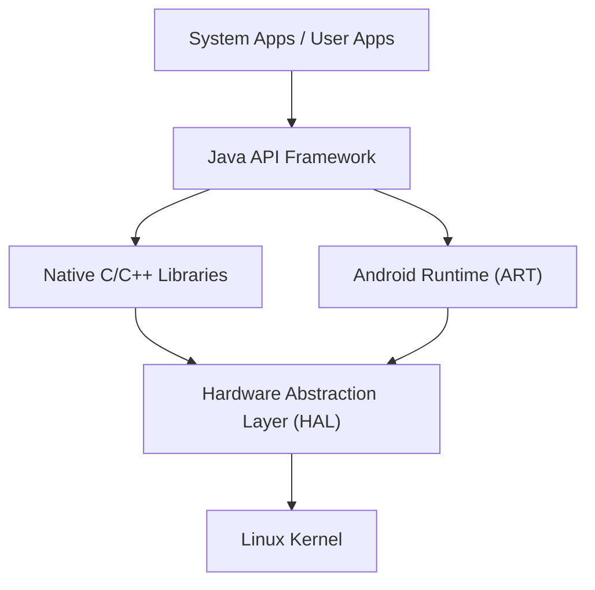

## مقدمة: الجوهر الحقيقي لنظام تشغيل الأجهزة المحمولة الذي غزا العالم

في مجتمعنا الرقمي الحديث، أصبحت الهواتف الذكية لا غنى عنها. ومن بينها، نظام التشغيل (OS) الذي يستحوذ على الغالبية العظمى من حصة السوق العالمية هو "أندرويد" (Android). لم يقتصر نظام أندرويد على كونه مجرد نظام تشغيل للهواتف الذكية، بل تطور ليصبح منصة ضخمة تعمل على مجموعة متنوعة من الأجهزة، بدءًا من الأجهزة اللوحية (Tablets) والساعات الذكية (Smartwatches) وأجهزة التلفاز، وصولاً إلى أنظمة السيارات.

في هذه المقالة، سنشرح بالتفصيل البنية المعمارية (الهيكل الهرمي) التي يقوم عليها نظام تشغيل أندرويد ذو الانتشار المذهل، وكيف تطورت تقنياته الأساسية عبر التاريخ. سنلقي نظرة من منظور تقني عميق على نواة لينكس (Linux Kernel)، وطبقة تجريد الأجهزة (HAL)، وتطور بيئة التشغيل من Dalvik إلى ART (Android Runtime).

## نظرة عامة على بنية أندرويد المعمارية

تم تصميم البنية المعمارية لنظام أندرويد مع التركيز على المرونة وقابلية التوسع، وتتكون بشكل أساسي من خمس طبقات رئيسية. تمتلك كل طبقة دورًا مستقلاً، لكنها تعمل بتعاون وثيق لضمان تشغيل مستقر على مختلف الأجهزة (Hardware).

ابتداءً من "Linux Kernel" في الطبقة السفلى، وصولاً إلى "System Apps" التي يتفاعل معها المستخدم مباشرة، تدعم هذه البنية الهرمية النظام البيئي المفتوح لأندرويد.

## نواة لينكس كأساس

في الأساس الأعمق لبنية أندرويد، تم اعتماد **نواة لينكس (Linux Kernel)**، وهي مستخدمة على نطاق واسع في عالم الحواسيب الشخصية والخوادم. ورغم أن أندرويد هو نظام تشغيل مبني على لينكس، إلا أنه يختلف عن أنظمة لينكس المكتبية التقليدية مثل GNU/Linux. فقد تم تخصيصه وتكييفه بشكل فريد ليتناسب مع القيود الصارمة للأجهزة المحمولة (البطارية المحدودة، والذاكرة، وموارد وحدة المعالجة المركزية).

### إدارة العمليات وإدارة الذاكرة

تدير نواة لينكس دورة حياة جميع العمليات (Processes) على أجهزة أندرويد. من الميزات البارزة لأندرويد هي فلسفة التصميم التي لا تفرض على المستخدم إنهاء التطبيقات بشكل صريح. فعندما تنخفض الذاكرة، تستخدم النواة آلية تُعرف باسم "Low Memory Killer (LMK)" لإنهاء العمليات الخلفية ذات الأهمية المنخفضة تلقائيًا، وتخصيص موارد الذاكرة للتطبيق الأمامي (Foreground App) الذي يستخدمه المستخدم حاليًا. بفضل هذه الإدارة المتقدمة للعمليات، يتم تحقيق تعدد مهام (Multitasking) سلس حتى مع موارد الأجهزة المحدودة.

### الأمان وصندوق حماية التطبيقات (Application Sandbox)

توفر نواة لينكس أيضًا أساس نموذج الأمان في أندرويد. في أندرويد، يتم تعيين معرّف مستخدم لينكس (UID) فريد لكل تطبيق يتم تثبيته. وبذلك، يحصل كل تطبيق على مساحة عمليات مستقلة خاصة به ودليل ملفات مخصص لا يمكن لأحد غيره الوصول إليه.

تُعرف هذه الآلية باسم "**صندوق حماية التطبيقات (Application Sandbox)**". يتم حظر أي وصول غير مصرح به من قِبل تطبيق ما إلى بيانات أو ذاكرة تطبيق آخر بقوة على مستوى النواة من خلال التحكم في الأذونات بنواة لينكس. وبالتالي، حتى لو تم تثبيت تطبيق ضار، يمكن تقليل الضرر الذي يلحق بالنظام بأكمله أو بالتطبيقات الأخرى إلى الحد الأدنى.

## دور طبقة تجريد الأجهزة (HAL)

فوق نواة لينكس، تقع **طبقة تجريد الأجهزة (Hardware Abstraction Layer : HAL)**. تُعد HAL مكونًا بالغ الأهمية يدعم تنوع نظام التشغيل أندرويد.

يعمل أندرويد على آلاف الأنواع المختلفة من الهواتف الذكية التي تصنعها شركات مختلفة. يحتوي كل جهاز على مستشعرات كاميرا، ورقائق بلوتوث، ووحدات صوت مختلفة. إذا كان على الكود الأساسي لنظام أندرويد استيعاب كل هذه الاختلافات في الأجهزة بشكل فردي، فإن تطوير النظام كان سينهار تمامًا.

هنا يبرز دور HAL. تقوم HAL بتعريف "واجهة قياسية (API)" لموردي الأجهزة (الشركات المصنعة). يقوم موردو الأجهزة بتطوير برامج تشغيل (Drivers) خاصة بهم للتحكم في أجهزتهم، ويقدمونها كوحدات HAL (HAL modules).

ما على إطار عمل تطبيقات أندرويد (Application Framework) سوى استدعاء هذه الواجهة القياسية لـ HAL. أي أنه بغض النظر عما إذا كان الجهاز السفلي من صنع Qualcomm أو MediaTek، يمكن للبرمجيات العليا التعامل معه بنفس الطريقة تمامًا. هذا "التجريد" هو السبب الأكبر الذي مكّن أندرويد من بناء هذا النظام البيئي الواسع للأجهزة.

## تطور بيئة تشغيل أندرويد: من Dalvik إلى ART

عند الحديث عن تاريخ أندرويد، لا يمكن إغفال التطور الذي طرأ على **بيئة التشغيل (Runtime)**، وهي البيئة المخصصة لتشغيل التطبيقات. تُكتب تطبيقات أندرويد بشكل أساسي بلغة Java أو Kotlin، ولكنها بشكلها الأصلي ليست لغة آلة تفهمها وحدة المعالجة المركزية. بيئة التشغيل هي المحرك الذي ينفذ هذه التعليمات البرمجية بكفاءة.

### آلة Dalvik الافتراضية ومترجم JIT (أندرويد 4.4 وما قبله)

في الإصدارات الأولى من أندرويد، تم استخدام آلة افتراضية تُعرف باسم "**Dalvik**". كانت Dalvik عبارة عن نظام ينفذ كود بايت مخصص (ملفات .dex) مُحسّن للذاكرة ووحدة المعالجة المركزية المحدودة للأجهزة المحمولة.

بدءًا من أندرويد 2.2 (Froyo)، تم تقديم **مترجم JIT (Just-In-Time)** إلى Dalvik. مترجم JIT هو تقنية تقوم باكتشاف "الأكواد المستخدمة بكثرة" ديناميكيًا أثناء تشغيل التطبيق، وتقوم بتجميعها (ترجمتها) إلى لغة الآلة في الوقت الفعلي لتسريع التنفيذ. ومع ذلك، وبسبب العبء الإضافي (Overhead) لعملية الترجمة أثناء التشغيل، كانت هناك تحديات مثل بطء بدء تشغيل التطبيقات، وحدوث تأخيرات (Lag) مؤقتة أثناء العمل، وزيادة استهلاك البطارية.

### إدخال ART (Android Runtime) ومترجم AOT (أندرويد 5.0 وما بعده)

لحل هذه المشكلات من جذورها، تم إدخال **ART (Android Runtime)** كمعيار قياسي في أندرويد 5.0 (Lollipop). الميزة الأكبر لـ ART هي تبنيها لنهج **الترجمة المسبقة (Ahead-Of-Time : AOT)**.

في ترجمة AOT، يتم تجميع كود التطبيق بالكامل مسبقًا إلى لغة آلة أصلية (Native) تتناسب مع بنية وحدة المعالجة المركزية للجهاز، وذلك أثناء مرحلة تثبيت التطبيق. وبما أن هذا يلغي الحاجة إلى "عملية الترجمة" عند تشغيل التطبيق، فقد أسفر عن التحسينات الجذرية التالية:

1. **تحسن هائل في الأداء**: زادت سرعة بدء تشغيل التطبيقات بشكل كبير، وأصبحت الحركات (Animations) والتمرير (Scrolling) في غاية السلاسة.
2. **إطالة عمر البطارية**: نظرًا لتقليل حمل وحدة المعالجة المركزية (عملية الترجمة) أثناء التشغيل، انخفض استهلاك الطاقة بشكل كبير.
3. **تحسين جمع القمامة (Garbage Collection)**: قامت ART بإعادة تصميم خوارزميات إدارة الذاكرة (عملية تحرير الذاكرة غير المستخدمة) من الصفر، مما قلل بشكل كبير من "التوقفات المؤقتة (Freezes)" التي كانت توقف عمل التطبيقات.

واصلت ART تطورها بعد ذلك، وبدءًا من أندرويد 7.0 (Nougat)، تم اعتماد نهج هجين يجمع بين ترجمة AOT وترجمة JIT، بالإضافة إلى الترجمة الموجهة بالملف الشخصي (PGO)، مما حقق توازنًا مثاليًا بين تقليل وقت التثبيت وتوفير مساحة التخزين وتحسين سرعة التنفيذ.

## AOSP (مشروع أندرويد مفتوح المصدر) كنظام مفتوح المصدر

تكمن القوة الحقيقية لبنية أندرويد المعمارية في أن شفرتها المصدرية (Codebase) متاحة للعالم أجمع باسم **AOSP (Android Open Source Project)**.

على الرغم من أن جوجل تقود عملية التطوير، إلا أن الشفرة المصدرية الأساسية لأندرويد تُنشر بموجب تراخيص مفتوحة المصدر (بشكل أساسي رخصة Apache 2.0 و GPL)، مما يسمح لأي شخص باستخدامها وتعديلها وإعادة توزيعها بحرية. بفضل هذا، يمكن لشركات تصنيع الهواتف الذكية مثل سامسونج وسوني استخدام AOSP كأساس لإضافة واجهات مستخدم (UI) وميزات خاصة بها، لإنشاء أجهزة جذابة تحمل علامتها التجارية.

علاوة على ذلك، أدى وجود AOSP إلى تعزيز مجتمعات الرومات المخصصة (Custom ROMs) (مثل LineageOS)، والتي توفر أحدث أنظمة التشغيل للأجهزة القديمة، كما أصبحت قوة دافعة لإنشاء أنظمة تشغيل مبنية على أندرويد تركز على الخصوصية. نظرًا لوجود هذا الأساس القوي مفتوح المصدر المتمثل في AOSP، تمكن أندرويد من حشد خبرات المطورين والشركات من جميع أنحاء العالم، ومواصلة الابتكار بسرعة لا يمكن لشركة واحدة تحقيقها بمفردها.

## الخاتمة

بناءً على الأساس المتين لنواة لينكس، يتم وضع طبقة HAL لاستيعاب الاختلافات في الأجهزة، وتوفر ART، التي تستمر في التطور، أفضل أداء للتطبيقات. يمكن القول إن البنية المعمارية لأندرويد هي تحفة من هندسة البرمجيات الحديثة، تم تحسينها لاستخراج أقصى درجات الكفاءة وسط القيود القاسية للأجهزة المحمولة.

من نواة لينكس التي تدير العمليات في أعماق نظام التشغيل، إلى واجهة المستخدم الخاصة بالتطبيقات التي تستجيب فورًا لنقرات أصابعنا، فإن فهم هذه البنية الهرمية (Stack) التقنية المتداخلة بجمال سيجعل تجربتنا اليومية مع الهواتف الذكية أكثر إثارة للاهتمام.
