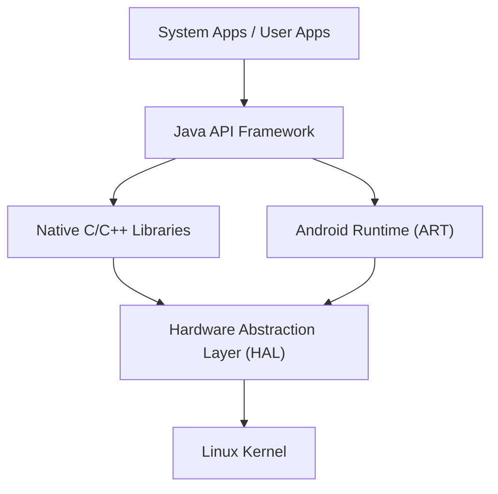

## Einführung: Die Essenz des mobilen Betriebssystems, das die Welt erobert hat

In der modernen digitalen Gesellschaft sind Smartphones zu einer unverzichtbaren Existenz geworden. Das Betriebssystem (OS), das den Großteil des weltweiten Marktanteils ausmacht, ist "Android". Android ist über ein reines Smartphone-Betriebssystem hinaus zu einer riesigen Plattform herangewachsen, die auf einer Vielzahl von Geräten wie Tablets, Smartwatches, Fernsehern und sogar In-Vehicle-Systemen für Autos läuft.

In diesem Artikel werden wir im Detail aus einer tiefgreifenden technischen Perspektive erläutern, aus welcher Architektur (hierarchischen Struktur) dieses erstaunlich weit verbreitete Android-Betriebssystem besteht und wie sich seine Kerntechnologien im Laufe der Geschichte entwickelt haben – vom Linux-Kernel über den Hardware Abstraction Layer (HAL) bis hin zum Übergang von Dalvik zur ART (Android Runtime).

## Gesamtbild der Android-Architektur

Die Systemarchitektur des Android-Betriebssystems ist mit Fokus auf Flexibilität und Erweiterbarkeit konzipiert und besteht grob aus fünf Hauptschichten (Layern). Jede Schicht hat eine unabhängige Rolle, aber durch ihre enge Zusammenarbeit wird ein stabiler Betrieb auf vielfältiger Hardware realisiert.

Von dem auf der untersten Ebene angesiedelten "Linux Kernel" bis hin zu den "System Apps", mit denen Benutzer direkt interagieren, unterstützt diese hierarchische Struktur das offene Ökosystem von Android.

## Der zugrundeliegende Linux-Kernel

Der grundlegendste Teil der Android-Architektur nutzt den **Linux-Kernel**, der auch in der PC- und Serverwelt weit verbreitet ist. Obwohl Android ein Linux-basiertes Betriebssystem ist, unterscheidet es sich von herkömmlichen Desktop-Linux-Distributionen wie GNU/Linux durch einzigartige Anpassungen, die für die strengen Einschränkungen mobiler Geräte (begrenzte Batterie-, Speicher- und CPU-Ressourcen) optimiert sind.

### Prozess- und Speichermanagement

Der Linux-Kernel verwaltet den Lebenszyklus aller Prozesse auf einem Android-Gerät. Ein charakteristisches Merkmal von Android ist seine Designphilosophie, die nicht erfordert, dass Benutzer Anwendungen explizit "beenden". Wenn der Speicher knapp wird, verwendet der Kernel einen Mechanismus namens "Low Memory Killer (LMK)", um automatisch Hintergrundprozesse von geringerer Wichtigkeit zu beenden und Speicherressourcen der Vordergrund-App zuzuweisen, die der Benutzer gerade verwendet. Durch dieses fortschrittliche Prozessmanagement wird selbst mit begrenzten Hardware-Ressourcen ein reibungsloses Multitasking erreicht.

### Sicherheit und Application Sandbox

Die Grundlage des Sicherheitsmodells von Android wird ebenfalls vom Linux-Kernel bereitgestellt. Unter Android erhält jede installierte Anwendung eine eindeutige Linux-Benutzer-ID (UID). Dadurch hat jede Anwendung ihren eigenen, unabhängigen Prozessraum und ein dediziertes Dateiverzeichnis, auf das nur sie zugreifen kann.

Dieser Mechanismus wird als "**Application Sandbox**" bezeichnet. Jeder unbefugte Zugriff einer App auf die Daten oder den Speicher einer anderen App wird durch die Berechtigungssteuerung des Linux-Kernels auf Kernelebene strikt blockiert. Selbst wenn also eine bösartige App installiert wird, kann auf diese Weise der Schaden für das gesamte System und andere Apps auf ein Minimum reduziert werden.

## Die Rolle des Hardware Abstraction Layer (HAL)

Oberhalb des Linux-Kernels befindet sich der **Hardware Abstraction Layer (HAL)**. Der HAL ist eine äußerst wichtige Komponente, die die Vielfalt des Android-Betriebssystems unterstützt.

Android läuft auf Tausenden verschiedenen Smartphones unterschiedlicher Hersteller. Jedes Gerät ist mit unterschiedlichen Kamerasensoren, Bluetooth-Chips und Audiomodulen ausgestattet. Wenn der Kerncode des Android-Betriebssystems all diese Hardware-Unterschiede individuell abfangen müsste, würde die Entwicklung des Betriebssystems völlig zusammenbrechen.

Hier kommt der HAL ins Spiel. Der HAL definiert eine "Standard-Schnittstelle (API)" für Hardware-Hersteller. Hardware-Hersteller entwickeln ihre eigenen Treiber zur Steuerung ihrer eigenen Hardware und stellen sie als HAL-Module zur Verfügung.

Das Anwendungs-Framework von Android muss nur diese Standard-Schnittstelle des HAL aufrufen. Mit anderen Worten: Ob die zugrundeliegende Hardware nun von Qualcomm oder MediaTek stammt, die übergeordnete Software kann sie auf genau die gleiche Weise behandeln. Diese "Abstraktion" ist der größte Grund, warum Android ein derart großes Hardware-Ökosystem aufbauen konnte.

## Die Evolution der Android Runtime: Von Dalvik zu ART

Wenn man über die Geschichte von Android spricht, ist die Evolution der **Runtime**, also der Umgebung zur Ausführung von Anwendungen, unverzichtbar. Android-Apps werden hauptsächlich in Java oder Kotlin geschrieben, die in dieser Form kein von der CPU verständlicher Maschinencode sind. Die Engine zur effizienten Ausführung dieser Sprachen ist die Runtime.

### Dalvik Virtual Machine und JIT-Compiler (Android 4.4 und früher)

In frühen Android-Versionen wurde eine virtuelle Maschine namens "**Dalvik**" eingesetzt. Dalvik war ein Mechanismus zur Ausführung von speziellem Bytecode (.dex-Dateien), der für den begrenzten Speicher und die CPU von mobilen Geräten optimiert war.

Ab Android 2.2 (Froyo) wurde in Dalvik ein **JIT (Just-In-Time) Compiler** eingeführt. Der JIT-Compiler ist eine Technologie, die während der Ausführung der App "häufig genutzten Code" dynamisch erkennt und nur diesen Teil in Echtzeit in Maschinencode kompiliert (übersetzt), um die Ausführung zu beschleunigen. Da die Kompilierung jedoch während der Ausführung einen gewissen Overhead verursachte, gab es Probleme wie längere App-Startzeiten, gelegentliche Ruckler während des Betriebs und einen erhöhten Batterieverbrauch.

### Einführung von ART (Android Runtime) und AOT-Compiler (Android 5.0 und später)

Um diese Probleme grundlegend zu lösen, wurde mit Android 5.0 (Lollipop) **ART (Android Runtime)** als Standard eingeführt. Das größte Merkmal von ART ist die Verwendung der **AOT (Ahead-Of-Time) Kompilierungs**-Methode.

Bei der AOT-Kompilierung wird der gesamte Code der App bereits während der Installation auf dem Gerät vollständig in nativen Maschinencode kompiliert, der auf die CPU-Architektur des Geräts zugeschnitten ist. Da bei der Ausführung der App keine "Übersetzungsarbeit" in Form von Kompilierung mehr erforderlich ist, führte dies zu den folgenden drastischen Verbesserungen:

1. **Überwältigende Leistungssteigerung**: Die Startgeschwindigkeit von Apps wurde erheblich verbessert, und Animationen sowie das Scrollen wurden extrem flüssig.
2. **Verlängerte Batterielebensdauer**: Da die CPU-Last (Kompilierungsprozess) während der Ausführung reduziert wird, sinkt der Stromverbrauch deutlich.
3. **Optimierung der Garbage Collection**: Der Algorithmus für das Speichermanagement (Freigabe nicht mehr benötigten Speichers) von ART wurde grundlegend überarbeitet, wodurch "Pausen" (Freezes), die den Betrieb einer App zum Stillstand brachten, auf das Äußerste reduziert wurden.

Auch danach entwickelte sich ART weiter. Ab Android 7.0 (Nougat) wurde eine hybride Methode eingeführt, die AOT-Kompilierung, JIT-Kompilierung und sogar Profile-Guided Optimization (PGO) kombiniert, um eine perfekte Balance zwischen kürzeren Installationszeiten, Einsparung von Speicherplatz und Optimierung der Ausführungsgeschwindigkeit zu erreichen.

## AOSP (Android Open Source Project) als Open Source

Die wahre Stärke der Android-Architektur liegt darin, dass ihre Codebasis als **AOSP (Android Open Source Project)** für die ganze Welt zugänglich ist.

Obwohl Google die Entwicklung anführt, kann der Quellcode, der den Kern von Android bildet, unter Open-Source-Lizenzen (hauptsächlich Apache License 2.0 und GPL) von jedermann frei genutzt, verändert und weitergegeben werden. Dies ermöglicht es Smartphone-Herstellern wie Samsung und Sony, auf Basis von AOSP eigene Benutzeroberflächen (UIs) und Funktionen hinzuzufügen und attraktive Geräte für ihre eigenen Marken zu erschaffen.

Darüber hinaus hat die Existenz von AOSP Communities für Custom ROMs (wie LineageOS) gefördert und ist die treibende Kraft für die Bereitstellung aktueller Betriebssysteme für ältere Geräte sowie die Entstehung von privatsphäre-orientierten Android-Derivaten. Gerade weil es dieses starke Open-Source-Fundament namens AOSP gibt, konnte Android das Wissen von Entwicklern und Unternehmen weltweit bündeln und Innovationen in einer Geschwindigkeit vorantreiben, die ein einzelnes Unternehmen allein nie erreicht hätte.

## Fazit

Auf dem soliden Fundament des Linux-Kernels ist der HAL platziert, um Hardware-Unterschiede auszugleichen, und die sich ständig weiterentwickelnde ART bietet Anwendungen die höchste Leistung. Die Android-Architektur kann als Meisterwerk der modernen Softwaretechnik bezeichnet werden, das verfeinert wurde, um unter den extremen Einschränkungen mobiler Geräte maximale Effizienz zu erzielen.

Vom Linux-Kernel, der Prozesse tief im Betriebssystem verwaltet, bis hin zur Benutzeroberfläche von Apps, die sofort auf das Tippen unserer Fingerspitzen reagieren – das Verständnis dieses wunderschön geschichteten Technologie-Stacks wird Ihr tägliches Smartphone-Erlebnis zweifellos noch interessanter machen.
