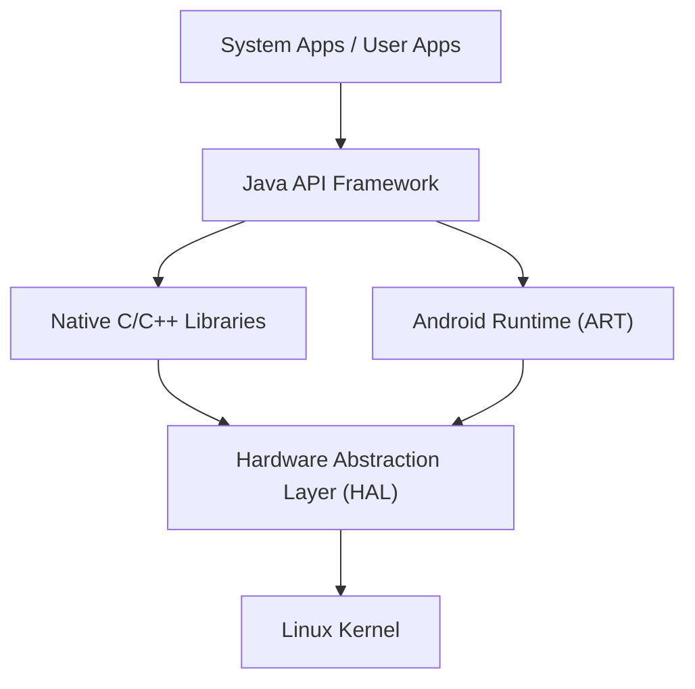

## Introduction: The Essence of the Mobile OS That Conquered the World

In modern digital society, smartphones have become indispensable. Among them, the operating system (OS) that holds the vast majority of the global market share is "Android". Android has grown into a massive platform that runs on a wide variety of devices, not just smartphone OSs, but also tablets, smartwatches, televisions, and even in-vehicle systems for cars.

In this article, we will explain in detail the architecture (layered structure) of the Android OS, which is experiencing this phenomenal spread, and how its core technologies have evolved alongside its history, from deep technical perspectives such as the Linux kernel, the Hardware Abstraction Layer (HAL), and the transition from Dalvik to ART (Android Runtime).

## Overview of the Android Architecture

The system architecture of the Android OS is designed with an emphasis on flexibility and scalability, and is broadly composed of five major layers. While each layer has its own independent role, they work closely together to ensure stable operation on a wide variety of hardware.

From the "Linux Kernel" located at the lowest layer, to the "System Apps" that users directly interact with, this hierarchical structure supports Android's open ecosystem.

## The Foundational Linux Kernel

At the most foundational part of the Android architecture is the **Linux kernel**, which is widely used in the world of PCs and servers. Android is a Linux-based OS, but unlike general desktop Linux such as GNU/Linux, it features unique customizations optimized for the severe constraints of mobile devices (limited battery, memory, and CPU resources).

### Process Management and Memory Management

The Linux kernel manages the lifecycle of all processes on an Android device. A distinctive feature of Android is its design philosophy that does not require users to explicitly "close applications." When memory becomes scarce, the kernel uses a mechanism called the "Low Memory Killer (LMK)" to automatically terminate less important background processes, allocating memory resources to the foreground apps currently in use by the user. This advanced process management enables smooth multitasking even with limited hardware resources.

### Security and Application Sandbox

The foundation of Android's security model is also provided by the Linux kernel. In Android, every installed application is assigned a unique Linux User ID (UID). This ensures that each application has its own independent process space and a dedicated file directory that only it can access.

This mechanism is known as the "**Application Sandbox**". If an app attempts to illegally access the data or memory of another app, it is strongly blocked at the kernel level by the Linux kernel's permission controls. As a result, even if a malicious app is installed, damage to the entire system or other apps can be minimized.

## The Role of the Hardware Abstraction Layer (HAL)

Positioned above the Linux kernel is the **Hardware Abstraction Layer (HAL)**. The HAL is an extremely crucial component that supports the diversity of the Android OS.

Android runs on thousands of different smartphones from various manufacturers. Each device is equipped with different camera sensors, Bluetooth chips, and audio modules. If the core code of the Android OS had to individually absorb all these hardware differences, OS development would completely collapse.

This is where the HAL comes into play. The HAL defines a "standard interface (API)" for hardware vendors (manufacturers). Hardware vendors develop their own drivers to control their hardware and provide them as HAL modules.

The Android application framework only needs to call this standard HAL interface. In other words, whether the underlying hardware is made by Qualcomm or MediaTek, it can be handled exactly the same way by the higher-level software. This "abstraction" is the biggest reason why Android has been able to build such a massive hardware ecosystem.

## Evolution of the Android Runtime: From Dalvik to ART

When discussing the history of Android, the evolution of the **runtime**, which is the environment for executing applications, is indispensable. Android apps are mainly written in Java or Kotlin, but these are not machine language that the CPU can understand directly. The runtime is the engine that executes this efficiently.

### Dalvik Virtual Machine and JIT Compiler (Android 4.4 and Earlier)

Early versions of Android utilized a virtual machine called "**Dalvik**". Dalvik was a mechanism for executing a proprietary bytecode (.dex file) optimized for the limited memory and CPU of mobile devices.

Starting with Android 2.2 (Froyo), a **JIT (Just-In-Time) compiler** was introduced to Dalvik. The JIT compiler is a technology that dynamically detects "frequently used code" during app execution and compiles (translates) only those parts into machine language in real-time to speed up execution. However, because compilation overhead occurred during execution, it faced challenges such as slow app launch times, temporary lag (stuttering) during operation, and high battery consumption.

### Introduction of ART (Android Runtime) and AOT Compiler (Android 5.0 and Later)

To fundamentally resolve these issues, **ART (Android Runtime)** was introduced as the standard in Android 5.0 (Lollipop). The most significant feature of ART is its adoption of the **AOT (Ahead-Of-Time) compilation** method.

In AOT compilation, the entire app code is fully compiled into native machine language tailored to the device's CPU architecture in advance during the app installation stage. As a result, the "translation work" of compilation is no longer required when the app is executed, bringing about the following dramatic improvements:

1. **Overwhelming Performance Improvement**: App startup speed has significantly increased, and animations and scrolling have become extremely smooth.
2. **Extended Battery Life**: Since the CPU load (compilation processing) at runtime is reduced, power consumption is greatly suppressed.
3. **Optimization of Garbage Collection**: ART fundamentally reviewed the memory management (releasing memory that is no longer needed) algorithm, minimizing "pauses (freezes)" that would stop the app's operation to the absolute limit.

ART continued to evolve thereafter. From Android 7.0 (Nougat) onwards, a hybrid approach combining AOT compilation, JIT compilation, and Profile-Guided Optimization (PGO) has been adopted, achieving a perfect balance of shortened installation times, storage space savings, and optimization of execution speed.

## AOSP (Android Open Source Project) as Open Source

The true power of the Android architecture lies in the fact that its codebase is published worldwide as the **AOSP (Android Open Source Project)**.

While Google leads the development, the core source code of Android can be freely used, modified, and redistributed by anyone under open-source licenses (primarily the Apache License 2.0 and GPL). This allows smartphone manufacturers like Samsung and Sony to build upon AOSP, adding their own UIs (user interfaces) and features to create compelling devices under their own brands.

Furthermore, the existence of AOSP nurtures the custom ROM community (such as LineageOS), serving as a driving force to provide the latest OS to older devices and create unique privacy-focused Android derivative OSs. It is because of the strong open-source foundation of AOSP that Android was able to pool the knowledge of developers and companies worldwide, continuing innovation at a speed that a single company could never achieve alone.

## Conclusion

Placing the HAL, which absorbs hardware differences, on top of the robust foundation of the Linux kernel, and further providing the best performance for applications through the ever-evolving ART. The Android architecture can be said to be a masterpiece of modern software engineering, refined to extract maximum efficiency within the harsh constraints of mobile devices.

By understanding this beautifully layered structure (stack) of technologies, from the Linux kernel managing processes deep within the OS, to the app UIs responding instantly to our fingertip taps, your daily smartphone experience should become even more fascinating.
