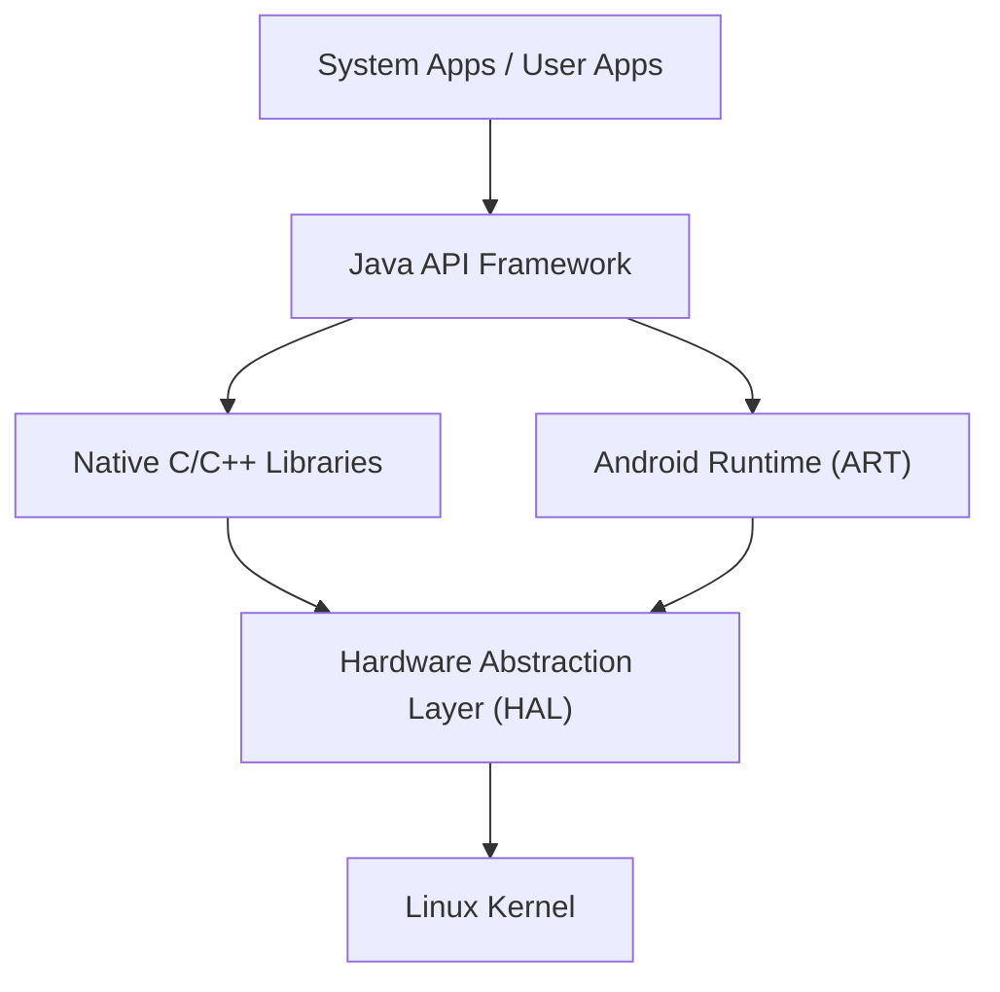

## Introducción: La esencia del sistema operativo móvil que conquistó el mundo

En la sociedad digital moderna, los teléfonos inteligentes se han vuelto indispensables. Entre ellos, el sistema operativo (SO) que abarca la mayor cuota de mercado mundial es "Android". Android ha dejado de ser un simple SO para teléfonos inteligentes, convirtiéndose en una enorme plataforma que funciona en una amplia variedad de dispositivos, como tabletas, relojes inteligentes, televisores e incluso sistemas integrados en automóviles.

En este artículo, explicaremos detalladamente la arquitectura (estructura jerárquica) en la que se basa este asombrosamente popular sistema operativo Android, y cómo sus tecnologías principales han evolucionado a lo largo de la historia, desde una profunda perspectiva técnica que incluye el kernel de Linux, la Capa de Abstracción de Hardware (HAL) y la transición de Dalvik a ART (Android Runtime).

## Visión general de la arquitectura de Android

La arquitectura del sistema del SO Android está diseñada con un enfoque en la flexibilidad y escalabilidad, y se compone principalmente de 5 capas (niveles) principales. Cada capa tiene un rol independiente, pero al trabajar en estrecha colaboración, logran un funcionamiento estable en una gran variedad de hardware.

Desde el "Linux Kernel", ubicado en la capa más baja, hasta las "System Apps", con las que los usuarios interactúan directamente, esta estructura jerárquica sustenta el ecosistema abierto de Android.

## El Kernel de Linux como base

En la parte más fundamental de la arquitectura de Android se encuentra el **kernel de Linux**, que también se utiliza ampliamente en el mundo de las computadoras personales y los servidores. Aunque Android es un SO basado en Linux, a diferencia de los Linux de escritorio convencionales como GNU/Linux, cuenta con personalizaciones únicas optimizadas para las severas limitaciones de los dispositivos móviles (batería limitada, memoria y recursos de CPU).

### Gestión de procesos y memoria

El kernel de Linux gestiona el ciclo de vida de todos los procesos en el dispositivo Android. Una característica distintiva de Android radica en su filosofía de diseño de no obligar a los usuarios a "cerrar aplicaciones" explícitamente. Cuando la memoria escasea, el kernel utiliza un mecanismo llamado "Low Memory Killer (LMK)" para finalizar automáticamente los procesos en segundo plano de menor importancia, asignando recursos de memoria a la aplicación en primer plano que el usuario está utilizando actualmente. Gracias a esta avanzada gestión de procesos, se logra una multitarea fluida incluso con recursos de hardware limitados.

### Seguridad y Application Sandbox (Caja de arena de aplicaciones)

La base del modelo de seguridad de Android también es proporcionada por el kernel de Linux. En Android, a cada aplicación instalada se le asigna un ID de usuario de Linux (UID) único. Como resultado, cada aplicación tiene su propio espacio de proceso independiente y un directorio de archivos dedicado al que solo ella puede acceder.

Este mecanismo se conoce como "**Application Sandbox**" (Caja de arena de la aplicación). Si una aplicación intenta acceder de forma no autorizada a los datos o la memoria de otra, es bloqueada enérgicamente a nivel de kernel mediante los controles de permisos del kernel de Linux. De este modo, incluso si se instala una aplicación maliciosa por error, el daño al sistema en general y a otras aplicaciones se reduce al mínimo.

## El rol de la Capa de Abstracción de Hardware (HAL)

Ubicada por encima del kernel de Linux se encuentra la **Capa de Abstracción de Hardware (Hardware Abstraction Layer: HAL)**. HAL es un componente extremadamente importante que respalda la diversidad del SO Android.

Android funciona en miles de teléfonos inteligentes diferentes fabricados por distintas empresas. Cada dispositivo cuenta con diferentes sensores de cámara, chips Bluetooth y módulos de audio. Si el código central del SO Android tuviera que absorber individualmente todas estas diferencias de hardware, el desarrollo del SO fracasaría por completo.

Aquí es donde entra en juego HAL. HAL define "interfaces estándar (API)" para los proveedores de hardware (fabricantes). Los proveedores de hardware desarrollan sus propios controladores para controlar su hardware y los proporcionan como módulos HAL.

El marco de aplicaciones (application framework) de Android solo necesita llamar a esta interfaz estándar de HAL. Es decir, independientemente de si el hardware subyacente es de Qualcomm o de MediaTek, el software de nivel superior puede tratarlo exactamente de la misma manera. Esta "abstracción" es la razón principal por la que Android ha podido construir un ecosistema de hardware tan amplio.

## La evolución de Android Runtime: De Dalvik a ART

Al hablar de la historia de Android, no se puede ignorar la evolución del **runtime** (entorno de ejecución) para ejecutar aplicaciones. Las aplicaciones de Android se escriben principalmente en Java o Kotlin, pero estos no son lenguaje de máquina que la CPU pueda entender directamente. El motor para ejecutar esto de manera eficiente es el runtime.

### Máquina virtual Dalvik y compilador JIT (Android 4.4 y anteriores)

En los primeros tiempos de Android, se utilizaba una máquina virtual llamada "**Dalvik**". Dalvik era un mecanismo que ejecutaba un código de bytes propietario (archivos .dex) optimizado para la memoria limitada y la CPU de los dispositivos móviles.

A partir de Android 2.2 (Froyo), se introdujo el **compilador JIT (Just-In-Time)** en Dalvik. El compilador JIT es una tecnología que detecta dinámicamente "el código más utilizado" mientras se ejecuta la aplicación, compilando (traduciendo) solo esa parte a lenguaje de máquina en tiempo real para acelerar la ejecución. Sin embargo, debido a la sobrecarga que implicaba compilar en tiempo de ejecución, surgían problemas como una lentitud en el inicio de la aplicación, retrasos temporales (lag) durante el funcionamiento y un consumo excesivo de batería.

### Introducción de ART (Android Runtime) y el compilador AOT (Android 5.0 y posteriores)

Para resolver estos problemas de raíz, **ART (Android Runtime)** se introdujo como estándar en Android 5.0 (Lollipop). La mayor característica de ART es la adopción del método de **compilación AOT (Ahead-Of-Time)**.

Con la compilación AOT, cuando la aplicación se instala en el dispositivo, todo el código de la aplicación se compila de antemano y por completo a lenguaje de máquina nativo adaptado a la arquitectura de la CPU del dispositivo. Como resultado, ya no es necesario el "trabajo de traducción" (compilación) al ejecutar la aplicación, lo que trajo consigo mejoras drásticas como las siguientes:

1. **Rendimiento abrumadoramente superior**: La velocidad de inicio de las aplicaciones mejoró considerablemente, y las animaciones y el desplazamiento se volvieron extremadamente fluidos.
2. **Mayor duración de la batería**: Al reducirse la carga de la CPU (procesamiento de compilación) en tiempo de ejecución, el consumo de energía disminuye significativamente.
3. **Optimización de la recolección de basura**: ART revisó radicalmente los algoritmos de gestión de memoria (liberación de la memoria que ya no se necesita), reduciendo al mínimo las "pausas (congelamientos)" que detenían el funcionamiento de la aplicación.

Posteriormente, ART continuó evolucionando. A partir de Android 7.0 (Nougat), se adoptó un enfoque híbrido que combina la compilación AOT, la compilación JIT y la compilación guiada por perfiles (PGO), logrando un equilibrio perfecto entre la reducción del tiempo de instalación, el ahorro de espacio de almacenamiento y la optimización de la velocidad de ejecución.

## AOSP (Android Open Source Project) como código abierto

El verdadero poder de la arquitectura de Android radica en que su base de código se publica mundialmente como **AOSP (Android Open Source Project)**.

Aunque Google lidera su desarrollo, el código fuente central de Android se puede usar, modificar y redistribuir libremente bajo licencias de código abierto (principalmente la Licencia Apache 2.0 y GPL). Gracias a esto, fabricantes de teléfonos inteligentes como Samsung y Sony pueden utilizar AOSP como base para agregar sus propias interfaces de usuario (UI) y funciones, creando dispositivos atractivos para sus propias marcas.

Además, la existencia de AOSP ha fomentado comunidades de ROM personalizadas (como LineageOS), convirtiéndose en la fuerza motriz para proporcionar los últimos sistemas operativos a dispositivos antiguos o crear sistemas operativos derivados de Android centrados en la privacidad. Precisamente por contar con una sólida base de código abierto como AOSP, Android ha podido reunir los conocimientos de desarrolladores y empresas de todo el mundo, manteniendo un ritmo de innovación que una sola empresa no habría podido lograr.

## Conclusión

Sobre la sólida base del kernel de Linux, se ubica HAL para absorber las diferencias de hardware, y ART en constante evolución para brindar el máximo rendimiento a las aplicaciones. La arquitectura de Android puede considerarse una obra maestra de la ingeniería de software moderna, refinada para extraer la máxima eficiencia dentro de las severas limitaciones de los dispositivos móviles.

Al comprender esta estructura jerárquica (stack) de tecnologías bellamente superpuestas, desde el kernel de Linux que gestiona los procesos en lo profundo del SO hasta la UI de las aplicaciones que responde instantáneamente al toque de nuestros dedos, la experiencia diaria con su teléfono inteligente seguramente se volverá aún más fascinante.
