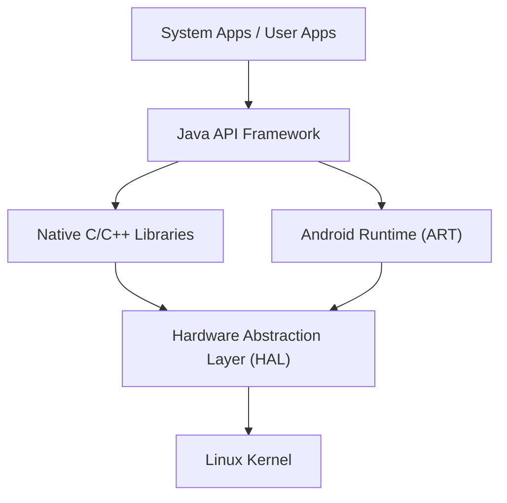

## Introduction : L'essence du système d'exploitation mobile qui a conquis le monde

Dans la société numérique moderne, les smartphones sont devenus indispensables. Parmi eux, le système d'exploitation (OS) qui détient la majorité de la part de marché mondiale est "Android". Android n'est pas seulement un système d'exploitation pour smartphones, mais est devenu une immense plateforme fonctionnant sur une grande variété d'appareils, allant des tablettes, montres intelligentes, téléviseurs, jusqu'aux systèmes embarqués des automobiles.

Cet article explique en détail l'architecture (structure hiérarchique) sur laquelle repose cet OS Android incroyablement populaire, ainsi que la manière dont ses technologies de base ont évolué au fil de l'histoire, d'un point de vue technique approfondi tel que le noyau Linux, la couche d'abstraction matérielle (HAL) et la transition de Dalvik à ART (Android Runtime).

## Vue d'ensemble de l'architecture Android

L'architecture du système Android est conçue en mettant l'accent sur la flexibilité et l'extensibilité, et se compose de cinq couches principales (niveaux). Bien que chaque couche ait un rôle indépendant, elles travaillent en étroite collaboration pour assurer un fonctionnement stable sur divers matériels.

Depuis le "Linux Kernel" (noyau Linux) situé tout en bas, jusqu'aux "System Apps" (applications système) avec lesquelles l'utilisateur interagit directement, cette structure hiérarchique soutient l'écosystème ouvert d'Android.

## Le noyau Linux comme fondation

La partie la plus fondamentale de l'architecture Android est le **noyau Linux**, qui est également largement utilisé dans le monde des PC et des serveurs. Bien qu'Android soit un système d'exploitation basé sur Linux, il diffère d'un Linux de bureau général comme GNU/Linux par ses personnalisations uniques optimisées pour les contraintes strictes des appareils mobiles (batterie, mémoire et ressources CPU limitées).

### Gestion des processus et gestion de la mémoire

Le noyau Linux gère le cycle de vie de tous les processus sur un appareil Android. La particularité d'Android réside dans sa philosophie de conception selon laquelle les utilisateurs ne sont pas obligés de "fermer les applications" explicitement. Lorsque la mémoire devient insuffisante, le noyau utilise un mécanisme appelé "Low Memory Killer (LMK)" pour terminer automatiquement les processus en arrière-plan de moindre importance et allouer les ressources mémoire aux applications de premier plan que l'utilisateur utilise actuellement. Cette gestion avancée des processus permet un multitâche fluide même avec des ressources matérielles limitées.

### Sécurité et bac à sable des applications (Application Sandbox)

Le cœur du modèle de sécurité d'Android est également fourni par le noyau Linux. Sous Android, un ID utilisateur Linux (UID) unique est attribué à chaque application installée. Ainsi, chaque application dispose de son propre espace de processus indépendant et d'un répertoire de fichiers dédié auquel elle seule peut accéder.

Ce mécanisme est appelé le "**bac à sable des applications (Application Sandbox)**". L'accès non autorisé d'une application aux données ou à la mémoire d'une autre application est fortement bloqué au niveau du noyau par le contrôle des permissions du noyau Linux. De cette façon, même si une application malveillante est installée, les dommages causés à l'ensemble du système et aux autres applications peuvent être minimisés.

## Le rôle de la couche d'abstraction matérielle (HAL)

Située au-dessus du noyau Linux se trouve la **couche d'abstraction matérielle (Hardware Abstraction Layer : HAL)**. Le HAL est un composant extrêmement important qui soutient la diversité du système d'exploitation Android.

Android fonctionne sur des milliers de smartphones de fabricants différents. Chaque appareil est équipé de différents capteurs de caméra, puces Bluetooth et modules audio. Si le code de base du système d'exploitation Android devait absorber toutes ces différences matérielles individuellement, le développement du système d'exploitation échouerait complètement.

C'est ici qu'intervient le HAL. Le HAL définit une "interface standard (API)" pour les fournisseurs de matériel (fabricants). Les fournisseurs de matériel développent leurs propres pilotes pour contrôler leur matériel et les fournissent sous forme de modules HAL.

Le framework d'application Android n'a besoin que d'appeler cette interface standard HAL. En d'autres termes, que le matériel sous-jacent soit fabriqué par Qualcomm ou MediaTek, le logiciel de niveau supérieur peut le traiter exactement de la même manière. Cette "abstraction" est la principale raison pour laquelle Android a pu construire un écosystème matériel aussi vaste.

## L'évolution de l'Android Runtime : de Dalvik à ART

Lorsque l'on parle de l'histoire d'Android, on ne peut ignorer l'évolution du **Runtime** (environnement d'exécution), qui est l'environnement d'exécution des applications. Les applications Android sont principalement écrites en Java ou Kotlin, mais ce n'est pas du code machine que le CPU peut comprendre tel quel. Le runtime est le moteur qui exécute cela efficacement.

### Machine virtuelle Dalvik et compilateur JIT (Android 4.4 et versions antérieures)

Dans les premières versions d'Android, une machine virtuelle appelée "**Dalvik**" a été adoptée. Dalvik était un mécanisme permettant d'exécuter un bytecode propriétaire (fichiers .dex) optimisé pour la mémoire et le CPU limités des appareils mobiles.

À partir d'Android 2.2 (Froyo), un **compilateur JIT (Just-In-Time)** a été introduit dans Dalvik. Le compilateur JIT est une technologie qui détecte dynamiquement le "code fréquemment utilisé" lors de l'exécution de l'application, et compile (traduit) uniquement cette partie en code machine en temps réel pour accélérer l'exécution. Cependant, comme une surcharge de compilation se produit pendant l'exécution, il y avait des problèmes tels qu'un lancement lent de l'application, des décalages (ralentissements) temporaires pendant le fonctionnement et une forte consommation de la batterie.

### Introduction de l'ART (Android Runtime) et du compilateur AOT (Android 5.0 et versions ultérieures)

Pour résoudre fondamentalement ces problèmes, **ART (Android Runtime)** a été introduit en standard dans Android 5.0 (Lollipop). La principale caractéristique de l'ART est l'adoption de la méthode de **compilation AOT (Ahead-Of-Time)**.

Avec la compilation AOT, l'ensemble du code de l'application est entièrement compilé au préalable en code machine natif adapté à l'architecture du CPU de l'appareil lors de la phase d'installation de l'application sur le terminal. Comme la "tâche de traduction" qu'est la compilation n'est plus nécessaire lors de l'exécution de l'application, cela a apporté des améliorations spectaculaires telles que :

1. **Amélioration impressionnante des performances** : La vitesse de lancement des applications a considérablement augmenté, et les animations ainsi que le défilement sont devenus extrêmement fluides.
2. **Prolongation de la durée de vie de la batterie** : Étant donné que la charge du CPU (processus de compilation) lors de l'exécution est réduite, la consommation d'énergie est considérablement diminuée.
3. **Optimisation du ramasse-miettes (Garbage Collection)** : Les algorithmes de gestion de la mémoire (processus de libération de la mémoire qui n'est plus nécessaire) d'ART ont été fondamentalement revus, et les "pauses (blocages)" qui arrêtaient le fonctionnement de l'application ont été réduites à l'extrême.

Depuis lors, ART a continué d'évoluer, et à partir d'Android 7.0 (Nougat), une approche hybride combinant la compilation AOT, la compilation JIT et la compilation guidée par le profil (PGO) a été adoptée, atteignant un équilibre parfait entre un temps d'installation plus court, une économie d'espace de stockage et une optimisation de la vitesse d'exécution.

## AOSP (Android Open Source Project) en tant que système open source

Le véritable pouvoir de l'architecture Android réside dans le fait que sa base de code est rendue publique dans le monde entier sous le nom d'**AOSP (Android Open Source Project)**.

Bien que Google dirige le développement, le code source principal d'Android est librement disponible pour quiconque souhaite l'utiliser, le modifier et le redistribuer sous des licences open source (principalement Apache License 2.0 et GPL). Cela permet aux fabricants de smartphones tels que Samsung et Sony d'ajouter leurs propres interfaces utilisateur (UI) et fonctionnalités basées sur l'AOSP pour créer des appareils attrayants sous leur propre marque.

De plus, l'existence de l'AOSP a nourri une communauté de ROM personnalisées (comme LineageOS), servant de force motrice pour fournir les derniers systèmes d'exploitation aux appareils plus anciens ou créer des systèmes d'exploitation dérivés d'Android axés sur la confidentialité. C'est grâce à cette solide fondation open source qu'est l'AOSP qu'Android a pu rassembler les connaissances des développeurs et des entreprises du monde entier pour poursuivre l'innovation à un rythme qu'une seule entreprise ne pourrait atteindre.

## Conclusion

Placer le HAL pour absorber les différences matérielles sur la fondation robuste du noyau Linux, et fournir les meilleures performances aux applications avec un ART en constante évolution. L'architecture Android peut être considérée comme un chef-d'œuvre de l'ingénierie logicielle moderne, affinée pour extraire une efficacité maximale dans les contraintes sévères des appareils mobiles.

Du noyau Linux qui gère les processus au plus profond du système d'exploitation, à l'interface utilisateur des applications qui répondent instantanément aux pressions de nos doigts, comprendre cette structure hiérarchique technologique magnifiquement superposée (stack) rendra sans aucun doute l'expérience quotidienne du smartphone encore plus fascinante.
