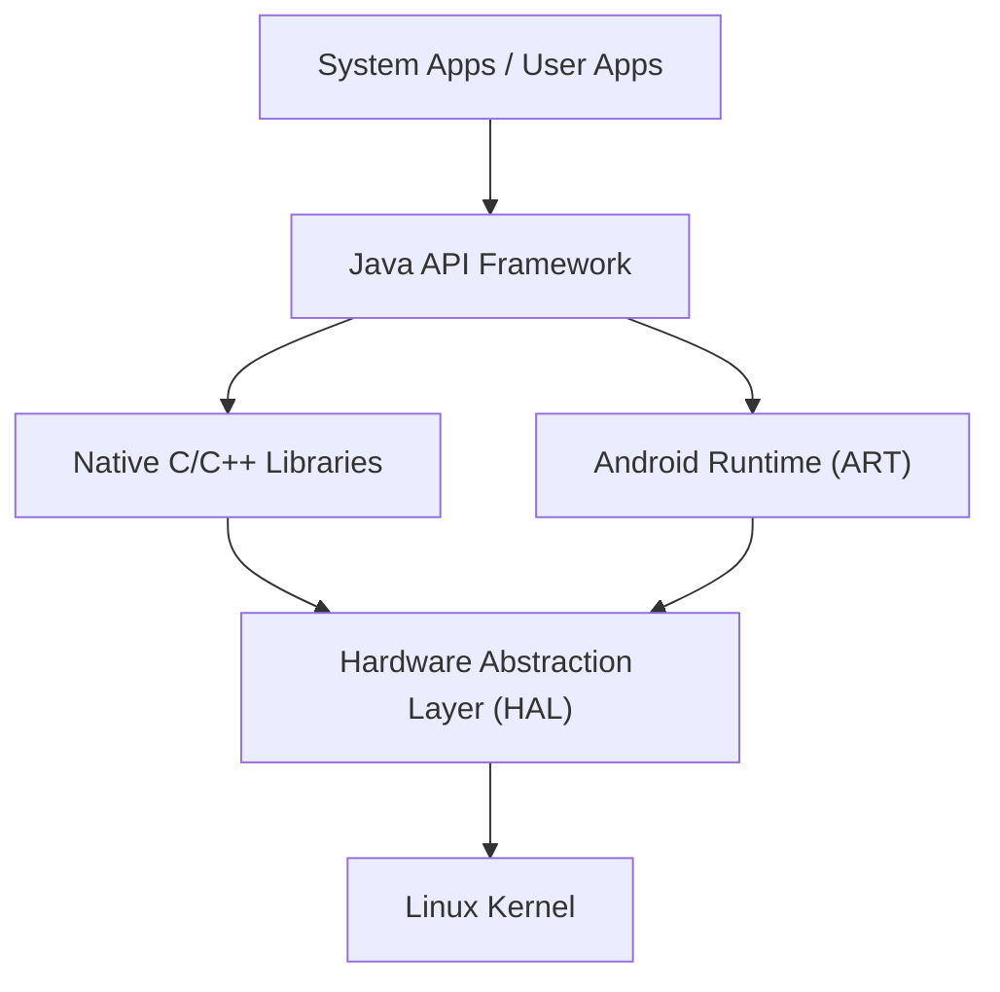

## परिचय: दुनिया पर राज करने वाले मोबाइल OS का सार

आधुनिक डिजिटल समाज में, स्मार्टफोन एक अनिवार्य आवश्यकता बन गए हैं। इनमें से, दुनिया के अधिकांश बाजार हिस्सेदारी पर कब्जा करने वाला ऑपरेटिंग सिस्टम (OS) "Android" है। Android केवल एक स्मार्टफोन OS तक सीमित नहीं है, बल्कि यह एक विशाल प्लेटफॉर्म बन गया है जो टैबलेट, स्मार्टवॉच, टीवी और यहां तक कि कारों के इन-व्हीकल सिस्टम जैसे उपकरणों की एक विस्तृत श्रृंखला पर काम करता है।

इस लेख में, हम विस्तार से बताएंगे कि यह अविश्वसनीय रूप से लोकप्रिय Android OS किस आर्किटेक्चर (पदानुक्रमित संरचना) से बना है, और इसकी मुख्य तकनीकें समय के साथ कैसे विकसित हुई हैं। हम इसे Linux कर्नेल, हार्डवेयर एब्स्ट्रैक्शन लेयर (HAL), और Dalvik से ART (Android Runtime) में संक्रमण जैसे गहरे तकनीकी दृष्टिकोणों से समझाएंगे।

## Android आर्किटेक्चर का समग्र दृश्य

Android OS का सिस्टम आर्किटेक्चर लचीलेपन (flexibility) और मापनीयता (scalability) पर जोर देने के साथ डिज़ाइन किया गया है, और मोटे तौर पर 5 मुख्य परतों (layers) से बना है। प्रत्येक परत की अपनी स्वतंत्र भूमिका होती है, और वे विभिन्न हार्डवेयर पर स्थिर संचालन प्राप्त करने के लिए एक साथ मिलकर काम करते हैं।

सबसे निचली परत "Linux Kernel" से लेकर उन "System Apps" तक, जिनके साथ उपयोगकर्ता सीधे बातचीत करते हैं, यह पदानुक्रमित संरचना (hierarchical structure) Android के ओपन इकोसिस्टम का समर्थन करती है।

## आधार के रूप में Linux कर्नेल

Android आर्किटेक्चर के सबसे बुनियादी हिस्से में **Linux कर्नेल** का उपयोग होता है, जो पीसी (PC) और सर्वर की दुनिया में भी व्यापक रूप से उपयोग किया जाता है। हालांकि Android एक Linux-आधारित OS है, लेकिन यह GNU/Linux जैसे सामान्य डेस्कटॉप Linux से अलग है, क्योंकि इसे मोबाइल उपकरणों की सख्त सीमाओं (सीमित बैटरी, मेमोरी, और CPU संसाधनों) के लिए अनुकूलित करने के लिए विशेष रूप से कस्टमाइज़ किया गया है।

### प्रोसेस मैनेजमेंट और मेमोरी मैनेजमेंट

Linux कर्नेल Android डिवाइस पर सभी प्रक्रियाओं (processes) के जीवनचक्र का प्रबंधन करता है। Android की एक विशिष्ट विशेषता इसका डिज़ाइन दर्शन है जहाँ उपयोगकर्ताओं को स्पष्ट रूप से "एप्लिकेशन बंद" नहीं करना पड़ता। जब मेमोरी कम होने लगती है, लाइनक्स कर्नेल एक मैकेनिज्म का उपयोग करता है जिसे "Low Memory Killer (LMK)" कहा जाता है। यह स्वचालित रूप से कम महत्व वाले बैकग्राउंड प्रोसेस को समाप्त कर देता है और उपयोगकर्ता द्वारा वर्तमान में उपयोग किए जा रहे फॉरग्राउंड ऐप को मेमोरी संसाधन आवंटित करता है। यह उन्नत प्रोसेस मैनेजमेंट सीमित हार्डवेयर संसाधनों के साथ भी सहज मल्टीटास्किंग सक्षम करता है।

### सुरक्षा और एप्लिकेशन सैंडबॉक्स

Android के सुरक्षा मॉडल की नींव भी Linux कर्नेल द्वारा प्रदान की जाती है। Android में, इंस्टॉल किए गए प्रत्येक एप्लिकेशन को एक विशिष्ट Linux उपयोगकर्ता ID (UID) आवंटित की जाती है। परिणामस्वरूप, प्रत्येक एप्लिकेशन का अपना स्वतंत्र प्रोसेस स्पेस और एक समर्पित फ़ाइल डायरेक्टरी होती है जिसे केवल वही एक्सेस कर सकता है।

इस तंत्र को "**एप्लिकेशन सैंडबॉक्स (Application Sandbox)**" कहा जाता है। एक ऐप द्वारा किसी अन्य ऐप के डेटा या मेमोरी तक अनधिकृत पहुंच को Linux कर्नेल के अनुमति नियंत्रण (permission control) द्वारा कर्नेल स्तर पर मजबूती से रोक दिया जाता है। इस वजह से, यदि कोई दुर्भावनापूर्ण (malicious) ऐप इंस्टॉल हो भी जाता है, तो पूरे सिस्टम या अन्य ऐप्स को होने वाले नुकसान को कम किया जा सकता है।

## हार्डवेयर एब्स्ट्रैक्शन लेयर (HAL) की भूमिका

Linux कर्नेल के ठीक ऊपर **हार्डवेयर एब्स्ट्रैक्शन लेयर (Hardware Abstraction Layer: HAL)** स्थित है। HAL एक अत्यंत महत्वपूर्ण घटक है जो Android OS की विविधता का समर्थन करता है।

Android हजारों अलग-अलग निर्माताओं के स्मार्टफ़ोन पर चलता है। प्रत्येक डिवाइस में अलग-अलग कैमरा सेंसर, ब्लूटूथ चिप्स और ऑडियो मॉड्यूल होते हैं। यदि Android OS के कोर कोड को इन सभी हार्डवेयर भिन्नताओं को व्यक्तिगत रूप से संभालना पड़ता, तो OS का विकास पूरी तरह से विफल हो जाता।

यहीं पर HAL चित्र में आता है। HAL हार्डवेयर वेंडर्स (निर्माताओं) के लिए एक "मानक इंटरफ़ेस (API)" को परिभाषित करता है। हार्डवेयर वेंडर अपने स्वयं के हार्डवेयर को नियंत्रित करने के लिए अपने स्वयं के ड्राइवर विकसित करते हैं और उन्हें HAL मॉड्यूल के रूप में प्रदान करते हैं।

Android एप्लिकेशन फ्रेमवर्क को केवल HAL के मानक इंटरफ़ेस को कॉल करने की आवश्यकता होती है। दूसरे शब्दों में, चाहे अंतर्निहित हार्डवेयर Qualcomm का हो या MediaTek का, उच्च-स्तरीय सॉफ़्टवेयर उसे बिल्कुल एक ही तरह से संभाल सकता है। यह "अमूर्तीकरण (abstraction)" ही सबसे बड़ा कारण है कि Android इतने विशाल हार्डवेयर इकोसिस्टम का निर्माण करने में सक्षम हुआ है।

## Android रनटाइम का विकास: Dalvik से ART तक

Android के इतिहास के बारे में बात करते समय, **रनटाइम** (एप्लिकेशन चलाने के लिए वातावरण) के विकास का उल्लेख करना आवश्यक है। Android ऐप्स मुख्य रूप से Java या Kotlin में लिखे जाते हैं, लेकिन ये सीधे मशीन लैंग्वेज (मशीनी भाषा) में नहीं होते हैं जिसे CPU समझ सके। इसे कुशलतापूर्वक निष्पादित (execute) करने वाला इंजन ही रनटाइम है।

### Dalvik वर्चुअल मशीन और JIT कंपाइलर (Android 4.4 और उससे पहले)

शुरुआती Android में, "**Dalvik**" नामक एक वर्चुअल मशीन का उपयोग किया गया था। Dalvik एक ऐसा तंत्र था जो मोबाइल उपकरणों की सीमित मेमोरी और CPU के लिए अनुकूलित अपने स्वयं के बाइटकोड (.dex फ़ाइल) को निष्पादित करता था।

Android 2.2 (Froyo) के साथ, Dalvik में **JIT (Just-In-Time) कंपाइलर** पेश किया गया। JIT कंपाइलर एक ऐसी तकनीक है जो ऐप के चलते समय गतिशील (dynamically) रूप से "बार-बार उपयोग किए जाने वाले कोड" का पता लगाती है, और निष्पादन को गति देने के लिए केवल उस हिस्से को वास्तविक समय में मशीन लैंग्वेज में संकलित (compile/अनुवादित) करती है। हालांकि, रनटाइम पर संकलन के ओवरहेड के कारण, ऐप के धीमे शुरू होने, संचालन के दौरान अस्थायी लैग (रुकावट) होने और उच्च बैटरी खपत जैसी समस्याएं थीं।

### ART (Android Runtime) और AOT कंपाइलर की शुरूआत (Android 5.0 और उसके बाद)

इन समस्याओं को मूल रूप से हल करने के लिए, Android 5.0 (Lollipop) में **ART (Android Runtime)** को एक मानक के रूप में पेश किया गया। ART की सबसे बड़ी विशेषता इसका **AOT (Ahead-Of-Time) कंपाइलेशन** विधि को अपनाना है।

AOT संकलन (कंपाइलेशन) के साथ, जब किसी ऐप को डिवाइस पर इंस्टॉल किया जाता है, तो पूरे ऐप कोड को पहले से ही डिवाइस के CPU आर्किटेक्चर के अनुरूप नेटिव मशीन लैंग्वेज में पूरी तरह से संकलित कर लिया जाता है। इसके परिणामस्वरूप, जब ऐप चलता है तो "अनुवाद" (कंपाइलेशन) की कोई आवश्यकता नहीं होती है, जिससे निम्नलिखित नाटकीय सुधार हुए:

1. **अभूतपूर्व प्रदर्शन सुधार**: ऐप के शुरू होने की गति (स्टार्टअप स्पीड) में काफी सुधार हुआ, और एनिमेशन व स्क्रॉलिंग अत्यंत सुचारू (smooth) हो गए।
2. **बैटरी जीवन में वृद्धि**: चूंकि रनटाइम के दौरान CPU लोड (संकलन प्रक्रिया) कम हो जाता है, इसलिए बिजली की खपत में काफी कमी आती है।
3. **गार्बेज कलेक्शन का अनुकूलन (Optimization)**: ART ने मेमोरी प्रबंधन एल्गोरिदम (अनावश्यक मेमोरी को खाली करने की प्रक्रिया) को मौलिक रूप से नया रूप दिया, जिससे ऐप के संचालन को रोकने वाले "विराम (freezes)" काफी हद तक कम हो गए।

उसके बाद भी ART का विकास जारी रहा, और Android 7.0 (Nougat) के बाद से, AOT कंपाइलेशन, JIT कंपाइलेशन, और प्रोफाइल-गाइडेड कंपाइलेशन (PGO) को मिलाने वाला एक हाइब्रिड दृष्टिकोण अपनाया गया है। यह स्थापना (install) समय को कम करने, स्टोरेज स्थान बचाने और निष्पादन (execution) गति को अनुकूलित करने के बीच एक पूर्ण संतुलन प्रदान करता है।

## एक ओपन सोर्स के रूप में AOSP (Android Open Source Project)

Android आर्किटेक्चर की असली ताकत इस तथ्य में निहित है कि इसका कोडबेस दुनिया भर में **AOSP (Android Open Source Project)** के रूप में उपलब्ध है।

हालांकि Google इसके विकास का नेतृत्व करता है, लेकिन Android के कोर सोर्स कोड को ओपन-सोर्स लाइसेंस (मुख्य रूप से Apache License 2.0 और GPL) के तहत कोई भी स्वतंत्र रूप से उपयोग, संशोधित और पुनर्वितरित कर सकता है। यह Samsung और Sony जैसे स्मार्टफोन निर्माताओं को AOSP का उपयोग करने, अपने स्वयं के UI (यूजर इंटरफेस) और सुविधाओं को जोड़ने, और अपने स्वयं के ब्रांडों के तहत आकर्षक उपकरण बनाने की अनुमति देता है।

इसके अलावा, AOSP का अस्तित्व कस्टम ROM (जैसे LineageOS) के समुदायों को बढ़ावा देता है, जो पुराने उपकरणों के लिए नवीनतम OS प्रदान करते हैं, और गोपनीयता-केंद्रित (privacy-focused) Android डेरिवेटिव OS के निर्माण के लिए एक प्रेरक शक्ति के रूप में कार्य करते हैं। AOSP के मजबूत ओपन-सोर्स आधार की वजह से ही Android दुनिया भर के डेवलपर्स और कंपनियों के ज्ञान को एक साथ ला सका, और एक ऐसी गति से नवाचार (innovation) जारी रख सका जो किसी एक कंपनी के लिए संभव नहीं होता।

## निष्कर्ष

Linux कर्नेल की मजबूत नींव पर, हार्डवेयर अंतर को अवशोषित करने के लिए HAL रखा गया है, और लगातार विकसित हो रहा ART एप्लिकेशनों को उच्चतम प्रदर्शन प्रदान करता है। Android का आर्किटेक्चर आधुनिक सॉफ्टवेयर इंजीनियरिंग की एक उत्कृष्ट कृति है जिसे मोबाइल उपकरणों की कठोर सीमाओं के भीतर अधिकतम दक्षता (efficiency) निकालने के लिए परिष्कृत किया गया है।

OS की गहराई में प्रक्रियाओं (processes) का प्रबंधन करने वाले Linux कर्नेल से लेकर हमारी उंगलियों के टैप पर तुरंत प्रतिक्रिया देने वाले ऐप UI तक, इस खूबसूरती से स्तरित प्रौद्योगिकी पदानुक्रम (तकनीक के स्टैक) को समझने से, आपके दैनिक स्मार्टफोन का अनुभव और भी अधिक दिलचस्प हो जाएगा।
