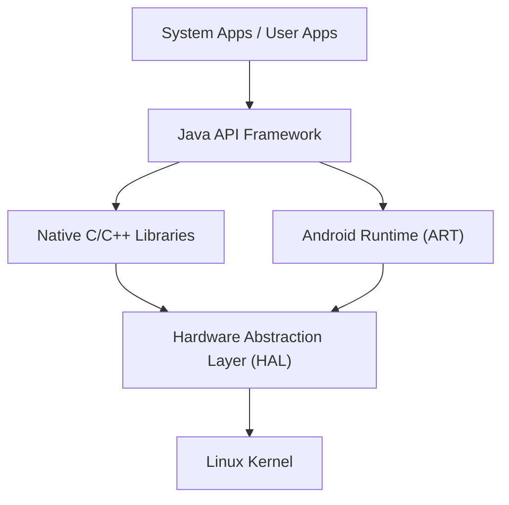

## Pengantar: Inti dari OS Seluler yang Menaklukkan Dunia

Dalam masyarakat digital modern, ponsel cerdas (smartphone) telah menjadi kebutuhan yang sangat penting. Di antaranya, sistem operasi (OS) yang mendominasi sebagian besar pangsa pasar dunia adalah "Android". Android telah berkembang dari sekadar OS ponsel cerdas menjadi platform raksasa yang berjalan pada berbagai perangkat, termasuk tablet, jam tangan pintar, televisi, dan bahkan sistem di dalam mobil.

Artikel ini akan menjelaskan secara rinci tentang arsitektur (struktur hierarki) yang membentuk OS Android yang penyebarannya luar biasa ini, dan bagaimana teknologi intinya telah berevolusi seiring berjalannya waktu, ditinjau dari perspektif teknis mendalam seperti kernel Linux, Hardware Abstraction Layer (HAL), serta transisi dari Dalvik ke ART (Android Runtime).

## Gambaran Umum Arsitektur Android

Arsitektur sistem OS Android dirancang dengan fokus pada fleksibilitas dan ekstensibilitas, serta terdiri dari 5 lapisan utama. Masing-masing lapisan memiliki peran independen namun bekerja sama secara erat untuk mewujudkan operasi yang stabil di berbagai perangkat keras.

Dari "Linux Kernel" yang terletak di lapisan paling bawah hingga "System Apps" yang berinteraksi langsung dengan pengguna, struktur hierarki ini mendukung ekosistem terbuka Android.

## Kernel Linux sebagai Fondasi

Di bagian paling dasar dari arsitektur Android, digunakan **kernel Linux** yang juga banyak digunakan dalam dunia PC dan server. Meskipun Android adalah OS berbasis Linux, tidak seperti Linux desktop umum seperti GNU/Linux, kernel ini telah dikustomisasi secara unik dan dioptimalkan untuk keterbatasan ketat pada perangkat seluler (baterai, memori, dan sumber daya CPU yang terbatas).

### Manajemen Proses dan Manajemen Memori

Kernel Linux mengelola siklus hidup semua proses di perangkat Android. Ciri khas Android terletak pada filosofi desain yang tidak mengharuskan pengguna secara eksplisit "menutup aplikasi". Saat memori menipis, kernel menggunakan mekanisme yang disebut "Low Memory Killer (LMK)" untuk secara otomatis menghentikan proses latar belakang yang kurang penting dan mengalokasikan sumber daya memori ke aplikasi latar depan yang sedang digunakan oleh pengguna. Dengan manajemen proses tingkat lanjut ini, multitasking yang lancar dapat terwujud meskipun dengan sumber daya perangkat keras yang terbatas.

### Keamanan dan Application Sandbox

Dasar dari model keamanan Android juga disediakan oleh kernel Linux. Di Android, setiap aplikasi yang diinstal diberikan ID Pengguna (UID) Linux yang unik. Akibatnya, setiap aplikasi memiliki ruang proses independennya sendiri dan direktori file khusus yang hanya dapat diakses olehnya sendiri.

Mekanisme ini disebut "**Application Sandbox**". Jika sebuah aplikasi mencoba mengakses data atau memori aplikasi lain secara tidak sah, hal tersebut akan diblokir dengan kuat di tingkat kernel oleh kontrol izin (permission) kernel Linux. Oleh karena itu, bahkan jika aplikasi berbahaya dipasang, kerusakan pada seluruh sistem dan aplikasi lain dapat diminimalkan.

## Peran Hardware Abstraction Layer (HAL)

Di atas kernel Linux terdapat **Hardware Abstraction Layer (HAL)**. HAL adalah komponen yang sangat penting yang mendukung keragaman OS Android.

Android berjalan di ribuan ponsel cerdas yang dibuat oleh berbagai produsen. Setiap perangkat dilengkapi dengan sensor kamera, chip Bluetooth, dan modul audio yang berbeda. Jika kode inti OS Android harus secara individual menyerap semua perbedaan perangkat keras ini, pengembangan OS akan hancur berantakan.

Di sinilah HAL berperan. HAL mendefinisikan "antarmuka standar (API)" untuk vendor (produsen) perangkat keras. Vendor perangkat keras mengembangkan driver mereka sendiri untuk mengontrol perangkat keras mereka dan menyediakannya sebagai modul HAL.

Kerangka kerja aplikasi (application framework) Android hanya perlu memanggil antarmuka standar HAL ini. Dengan kata lain, apakah perangkat keras di bawahnya buatan Qualcomm atau MediaTek, perangkat lunak di atasnya dapat memperlakukannya dengan cara yang persis sama. "Abstraksi" inilah yang menjadi alasan utama mengapa Android mampu membangun ekosistem perangkat keras dalam jumlah sebesar ini.

## Evolusi Android Runtime: Dari Dalvik ke ART

Saat membahas sejarah Android, hal yang tidak dapat diabaikan adalah evolusi **runtime**, yang merupakan lingkungan untuk menjalankan aplikasi. Aplikasi Android terutama ditulis dalam bahasa Java atau Kotlin, tetapi bahasa ini tidak berupa bahasa mesin yang dapat langsung dipahami oleh CPU. Mesin untuk menjalankannya secara efisien adalah runtime.

### Mesin Virtual Dalvik dan Kompilator JIT (Android 4.4 dan Sebelumnya)

Pada awal Android, mesin virtual yang disebut "**Dalvik**" digunakan. Dalvik adalah mekanisme untuk menjalankan bytecode unik (file .dex) yang dioptimalkan untuk memori dan CPU terbatas pada perangkat seluler.

Mulai dari Android 2.2 (Froyo), **kompilator JIT (Just-In-Time)** diperkenalkan pada Dalvik. Kompilator JIT adalah teknologi yang secara dinamis mendeteksi "kode yang sering digunakan" saat aplikasi berjalan dan mengompilasi (menerjemahkan) bagian itu ke dalam bahasa mesin secara waktu nyata untuk mempercepat eksekusi. Namun, karena beban kompilasi saat dijalankan (runtime overhead), ada masalah seperti peluncuran aplikasi menjadi lebih lambat, kelambatan (lag) sementara selama operasi, dan konsumsi baterai yang tinggi.

### Pengenalan ART (Android Runtime) dan Kompilator AOT (Android 5.0 dan Setelahnya)

Untuk mengatasi masalah ini secara mendasar, **ART (Android Runtime)** diperkenalkan sebagai standar di Android 5.0 (Lollipop). Fitur terbesar dari ART adalah adopsi metode **kompilasi AOT (Ahead-Of-Time)**.

Dalam kompilasi AOT, seluruh kode aplikasi sepenuhnya dikompilasi terlebih dahulu ke dalam bahasa mesin asli yang disesuaikan dengan arsitektur CPU perangkat pada tahap pemasangan (instalasi) aplikasi di perangkat. Oleh karena itu, "pekerjaan penerjemahan" kompilasi tidak lagi diperlukan saat aplikasi dijalankan, menghasilkan peningkatan drastis sebagai berikut:

1. **Peningkatan Kinerja yang Luar Biasa**: Kecepatan peluncuran aplikasi meningkat secara signifikan, dan animasi serta pengguliran (scrolling) menjadi sangat lancar.
2. **Masa Pakai Baterai Lebih Lama**: Konsumsi daya berkurang drastis karena beban CPU (pemrosesan kompilasi) selama eksekusi berkurang.
3. **Optimasi Pengumpulan Sampah (Garbage Collection)**: ART secara mendasar merombak algoritma manajemen memori (proses pembebasan memori yang tidak lagi diperlukan), dan "jeda (freeze)" yang dapat menghentikan pengoperasian aplikasi telah dikurangi hingga batas maksimum.

Sejak saat itu, ART terus berkembang, dan mulai dari Android 7.0 (Nougat), metode hybrid yang menggabungkan kompilasi AOT, kompilasi JIT, dan Profile-Guided Optimization (PGO) telah diadopsi, mewujudkan keseimbangan sempurna antara waktu instalasi yang lebih singkat, penghematan ruang penyimpanan, dan optimalisasi kecepatan eksekusi.

## AOSP (Android Open Source Project) sebagai Sumber Terbuka

Kekuatan sebenarnya dari arsitektur Android terletak pada kenyataan bahwa basis kodenya dipublikasikan ke seluruh dunia sebagai **AOSP (Android Open Source Project)**.

Meskipun pengembangannya dipimpin oleh Google, kode sumber yang menjadi inti dari Android dapat digunakan, dimodifikasi, dan didistribusikan ulang secara bebas oleh siapa saja di bawah lisensi sumber terbuka (terutama Apache License 2.0 dan GPL). Oleh karena itu, produsen ponsel cerdas seperti Samsung dan Sony dapat membuat perangkat menarik bermerek mereka sendiri dengan menambahkan antarmuka pengguna (UI) dan fitur unik mereka sendiri berdasarkan AOSP.

Selanjutnya, keberadaan AOSP telah memelihara komunitas ROM kustom (seperti LineageOS) dan menjadi pendorong untuk menyediakan OS terbaru ke perangkat lama serta menciptakan OS turunan Android unik yang berspesialisasi dalam privasi. Berkat fondasi sumber terbuka yang kuat dari AOSP, Android mampu mengumpulkan keahlian dari para pengembang dan perusahaan di seluruh dunia, serta terus berinovasi dengan kecepatan yang tidak dapat dicapai oleh satu perusahaan saja.

## Kesimpulan

Berdasarkan fondasi kernel Linux yang kuat, HAL ditempatkan untuk menyerap perbedaan perangkat keras, dan selanjutnya aplikasi diberikan kinerja terbaik oleh ART yang terus berkembang. Arsitektur Android dapat dikatakan sebagai mahakarya rekayasa perangkat lunak modern, yang disempurnakan untuk memaksimalkan efisiensi dalam kendala yang keras dari perangkat seluler.

Dari kernel Linux yang mengelola proses di kedalaman OS, hingga UI aplikasi yang merespons ketukan ujung jari kita dalam sekejap, dengan memahami struktur hierarki (stack) teknologi yang berlapis indah ini, pengalaman ponsel cerdas sehari-hari Anda pasti akan menjadi lebih menarik.
