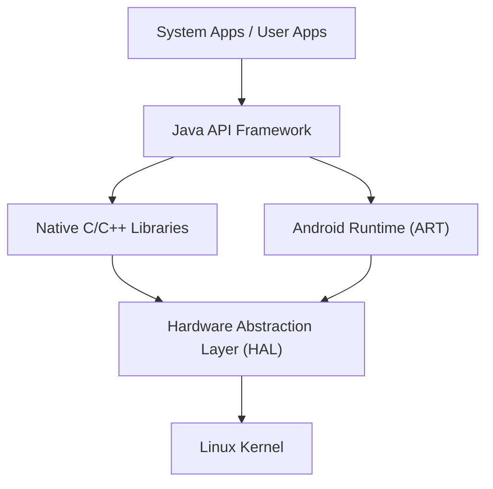

## 들어가며: 세계를 제패한 모바일 OS의 진수

현대 디지털 사회에서 스마트폰은 필수불가결한 존재가 되었습니다. 그 중에서도 전 세계 점유율의 대부분을 차지하고 있는 운영 체제(OS)가 바로 '안드로이드(Android)'입니다. 안드로이드는 단순한 스마트폰 OS에 머물지 않고 태블릿, 스마트워치, TV, 나아가 자동차의 차량용 시스템에 이르기까지 다방면의 기기에서 동작하는 거대한 플랫폼으로 성장했습니다.

본 기사에서는 이렇게 경이적인 보급률을 보이는 안드로이드 OS가 어떠한 아키텍처(계층 구조)로 이루어져 있는지, 그리고 그 핵심 기술이 역사와 함께 어떻게 진화해 왔는지를 리눅스 커널, 하드웨어 추상화 계층(HAL), 그리고 Dalvik에서 ART(Android Runtime)로의 변천이라는 깊이 있는 기술적 관점에서 상세히 해설합니다.

## 안드로이드 아키텍처의 전체 구조

안드로이드 OS의 시스템 아키텍처는 유연성과 확장성을 중시하여 설계되었으며, 크게 5개의 주요 레이어(계층)로 구성되어 있습니다. 각각의 레이어가 독립적인 역할을 가지면서도 긴밀하게 연계되어 다양한 하드웨어 상에서 안정적인 동작을 구현합니다.

최하층에 위치한 'Linux Kernel'부터 사용자가 직접 접하는 'System Apps'에 이르기까지, 이 계층 구조가 안드로이드의 오픈 에코시스템을 뒷받침하고 있습니다.

## 기반이 되는 리눅스 커널

안드로이드 아키텍처의 가장 기초가 되는 부분에는 PC나 서버 환경에서도 널리 사용되는 **리눅스 커널(Linux Kernel)**이 채택되어 있습니다. 안드로이드는 리눅스 기반 OS이지만, GNU/Linux와 같은 일반적인 데스크톱 리눅스와는 달리 모바일 기기의 엄격한 제약(제한된 배터리, 메모리, CPU 리소스)에 최적화된 독자적인 커스터마이징이 적용되어 있습니다.

### 프로세스 관리와 메모리 관리

리눅스 커널은 안드로이드 기기에서 실행되는 모든 프로세스의 수명 주기를 관리합니다. 안드로이드의 특징적인 점은 '애플리케이션을 종료한다'는 조작을 사용자에게 명시적으로 요구하지 않는 설계 사상에 있습니다. 메모리가 부족해지면 커널은 'Low Memory Killer (LMK)'라는 메커니즘을 사용하여 중요도가 낮은 백그라운드 프로세스를 자동으로 종료시키고, 현재 사용자가 사용 중인 포그라운드 앱에 메모리 리소스를 할당합니다. 이러한 고도의 프로세스 관리를 통해 제한된 하드웨어 리소스에서도 원활한 멀티태스킹을 실현합니다.

### 보안과 애플리케이션 샌드박스

안드로이드 보안 모델의 근간 또한 리눅스 커널이 제공합니다. 안드로이드에서는 설치된 모든 애플리케이션에 고유한 리눅스 사용자 ID(UID)가 할당됩니다. 이를 통해 각 애플리케이션은 자신만의 독립된 프로세스 공간과 자신만이 접근할 수 있는 전용 파일 디렉터리를 갖게 됩니다.

이러한 구조를 '**애플리케이션 샌드박스(Application Sandbox)**'라고 부릅니다. 특정 앱이 다른 앱의 데이터나 메모리에 무단으로 접근하는 것은 리눅스 커널의 권한 제어를 통해 커널 수준에서 강력하게 차단됩니다. 덕분에 만에 하나 악의적인 앱이 설치되더라도 시스템 전체나 다른 앱에 미치는 피해를 최소화할 수 있습니다.

## 하드웨어 추상화 계층(HAL)의 역할

리눅스 커널의 상위에 위치하는 것이 **하드웨어 추상화 계층(Hardware Abstraction Layer : HAL)**입니다. HAL은 안드로이드 OS의 다양성을 뒷받침하는 매우 중요한 구성 요소입니다.

안드로이드는 수천 종류의 다양한 제조사에서 만든 스마트폰에서 동작합니다. 각 기기에는 서로 다른 카메라 센서, 블루투스 칩, 오디오 모듈이 탑재되어 있습니다. 만약 안드로이드 OS의 코어 코드가 이 모든 하드웨어의 차이를 개별적으로 수용해야 한다면, OS 개발은 완전히 파탄 나고 말 것입니다.

여기서 HAL이 등장합니다. HAL은 하드웨어 공급업체(제조사)에게 '표준화된 인터페이스(API)'를 정의해 줍니다. 하드웨어 공급업체는 자사의 하드웨어를 제어하기 위한 독자적인 드라이버를 개발하고, 이를 HAL 모듈로서 제공합니다.

안드로이드의 애플리케이션 프레임워크는 이 HAL의 표준 인터페이스를 호출하기만 하면 됩니다. 즉, 하위 하드웨어가 퀄컴(Qualcomm) 제품이든 미디어텍(MediaTek) 제품이든, 상위 소프트웨어 입장에서는 완전히 동일하게 취급할 수 있는 것입니다. 이 '추상화'야말로 안드로이드가 이토록 방대한 하드웨어 생태계를 구축할 수 있었던 가장 큰 이유입니다.

## 안드로이드 런타임의 진화: Dalvik에서 ART로

안드로이드의 역사를 논할 때 빼놓을 수 없는 것이 애플리케이션을 실행하기 위한 환경인 **런타임**의 진화입니다. 안드로이드 앱은 주로 Java나 Kotlin으로 작성되지만, 이것들은 그대로는 CPU가 이해할 수 있는 기계어가 아닙니다. 이를 효율적으로 실행하기 위한 엔진이 바로 런타임입니다.

### Dalvik 가상 머신과 JIT 컴파일러 (Android 4.4 이전)

초기 안드로이드에서는 '**Dalvik(달빅)**'이라 불리는 가상 머신이 채택되었습니다. Dalvik은 모바일 기기의 제한된 메모리와 CPU에 최적화된 독자적인 바이트코드(.dex 파일)를 실행하는 구조였습니다.

Android 2.2(Froyo)부터는 Dalvik에 **JIT(Just-In-Time) 컴파일러**가 도입되었습니다. JIT 컴파일러는 앱 실행 중에 '자주 사용되는 코드'를 동적으로 감지하여 그 부분만 실시간으로 기계어로 컴파일(번역)해 실행 속도를 높이는 기술입니다. 하지만 실행 시 컴파일로 인한 오버헤드가 발생하여 앱 실행 속도가 느려지거나, 동작 중에 일시적인 지연(버벅거림)이 발생하거나, 배터리 소모가 심해진다는 과제가 있었습니다.

### ART(Android Runtime)와 AOT 컴파일러의 도입 (Android 5.0 이후)

이러한 문제들을 근본적으로 해결하기 위해 Android 5.0(Lollipop)에서 기본으로 도입된 것이 **ART(Android Runtime)**입니다. ART의 가장 큰 특징은 **AOT(Ahead-Of-Time) 컴파일** 방식을 채택했다는 점입니다.

AOT 컴파일에서는 앱을 기기에 설치하는 단계에서 앱 전체의 코드를 미리 기기의 CPU 아키텍처에 맞는 네이티브 기계어로 완전히 컴파일해 둡니다. 이로 인해 앱 실행 시에는 컴파일이라는 '번역 작업'이 불필요해지므로 다음과 같은 극적인 개선이 이루어졌습니다.

1. **압도적인 성능 향상**: 앱 실행 속도가 대폭 향상되었고, 애니메이션과 스크롤이 매우 부드러워졌습니다.
2. **배터리 수명 연장**: 실행 시 CPU 부하(컴파일 처리)가 줄어들기 때문에 전력 소모가 크게 억제됩니다.
3. **가비지 컬렉션 최적화**: ART는 메모리 관리(불필요해진 메모리를 해제하는 처리) 알고리즘을 근본적으로 재검토하여, 앱의 동작을 멈추게 하는 '일시 정지(프리즈)' 현상을 극한까지 줄였습니다.

이후에도 ART는 진화를 거듭하여, Android 7.0(Nougat)부터는 AOT 컴파일과 JIT 컴파일, 나아가 프로필 가이드 기반 컴파일(PGO)을 결합한 하이브리드 방식을 채택함으로써 설치 시간 단축과 저장 공간 절약, 그리고 실행 속도 최적화라는 완벽한 균형을 실현하고 있습니다.

## 오픈소스로서의 AOSP (Android Open Source Project)

안드로이드 아키텍처의 진정한 힘은 그 코드베이스가 **AOSP(Android Open Source Project)**로서 전 세계에 공개되어 있다는 데 있습니다.

Google이 주도하여 개발을 진행하면서도 안드로이드의 핵심이 되는 소스 코드는 오픈소스 라이선스(주로 Apache License 2.0 및 GPL) 하에 누구나 자유롭게 이용, 수정, 재배포할 수 있습니다. 이를 통해 삼성(Samsung)이나 소니(Sony) 같은 스마트폰 제조사는 AOSP를 기반으로 독자적인 UI(사용자 인터페이스)나 기능을 추가하여 자사 브랜드의 매력적인 기기를 만들어낼 수 있습니다.

또한, AOSP의 존재는 커스텀 ROM(LineageOS 등) 커뮤니티를 육성하고, 구형 기기에 최신 OS를 제공하거나 개인 정보 보호에 특화된 독자적인 안드로이드 파생 OS를 탄생시키는 원동력이 되기도 합니다. AOSP라는 강력한 오픈소스 기반이 있었기에 안드로이드는 전 세계 개발자와 기업의 지식을 집결시켜, 단일 기업만으로는 이룰 수 없는 속도로 혁신을 지속할 수 있었던 것입니다.

## 마무리

리눅스 커널의 견고한 기반 위에 하드웨어의 차이를 흡수하는 HAL을 배치하고, 끊임없이 진화하는 ART를 통해 애플리케이션에 최고의 성능을 제공합니다. 안드로이드의 아키텍처는 모바일 기기의 가혹한 제약 속에서 최대의 효율을 이끌어내기 위해 세련되게 다듬어진 현대 소프트웨어 공학의 걸작이라 할 수 있습니다.

OS의 깊은 곳에서 프로세스를 관리하는 리눅스 커널부터 우리의 손끝 터치에 즉각적으로 반응하는 앱 UI까지, 이 아름답게 겹겹이 쌓인 기술의 계층 구조(스택)를 이해함으로써 매일 경험하는 스마트폰의 세계가 한층 더 흥미로워질 것입니다.
