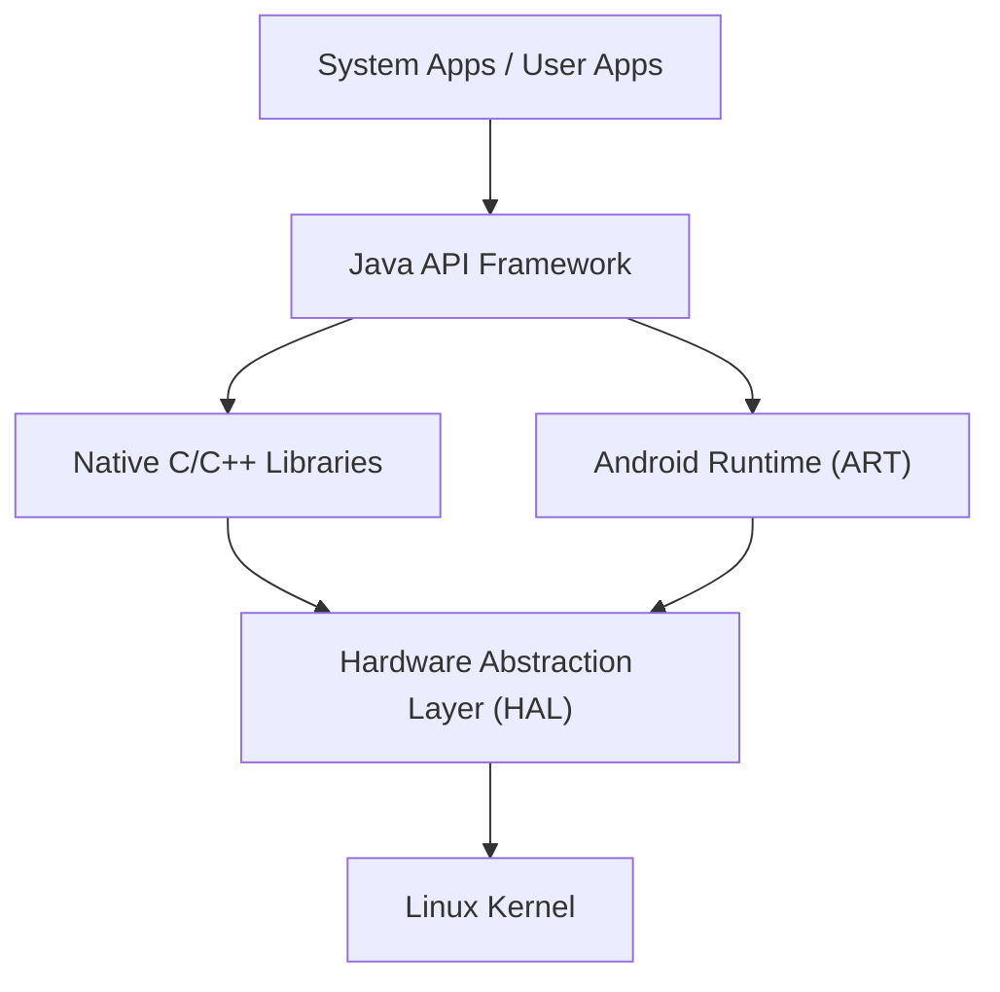

## はじめに：世界を制したモバイルOSの真髄

現代のデジタル社会において、スマートフォンは必要不可欠な存在となっています。その中で、世界シェアの大部分を占めているオペレーティングシステム（OS）が「Android（アンドロイド）」です。Androidは、単なるスマートフォンのOSにとどまらず、タブレット、スマートウォッチ、テレビ、さらには自動車の車載システムに至るまで、多岐にわたるデバイスで動作する巨大なプラットフォームへと成長を遂げました。

本記事では、この驚異的な普及を見せるAndroid OSが、どのようなアーキテクチャ（階層構造）で成り立っているのか、そしてその中核となる技術が歴史と共にどのように進化してきたのかを、Linuxカーネル、ハードウェアアブストラクションレイヤー（HAL）、そしてDalvikからART（Android Runtime）への変遷といった深い技術的視点から詳細に解説します。

## Androidアーキテクチャの全体像

Android OSのシステムアーキテクチャは、柔軟性と拡張性を重視して設計されており、大きく分けて5つの主要なレイヤー（階層）で構成されています。それぞれのレイヤーが独立した役割を持ちつつ、密接に連携することで、多様なハードウェア上での安定した動作を実現しています。

最下層に位置する「Linux Kernel」から、ユーザーが直接触れる「System Apps」に至るまで、この階層構造がAndroidのオープンエコシステムを支えています。

## 基盤となるLinuxカーネル

Androidアーキテクチャの最も基礎となる部分には、PCやサーバーの世界でも広く利用されている**Linuxカーネル**が採用されています。AndroidはLinuxベースのOSですが、GNU/Linuxのような一般的なデスクトップLinuxとは異なり、モバイルデバイスの厳しい制約（限られたバッテリー、メモリ、CPUリソース）に最適化された独自のカスタマイズが施されています。

### プロセス管理とメモリ管理

Linuxカーネルは、Androidデバイス上のすべてのプロセスのライフサイクルを管理します。Androidの特徴的な点は、「アプリケーションを終了する」という操作をユーザーに明示的に行わせない設計思想にあります。メモリが不足してきた場合、カーネルは「Low Memory Killer (LMK)」と呼ばれる仕組みを用いて、重要度の低いバックグラウンドプロセスを自動的に終了させ、現在ユーザーが使用しているフォアグラウンドアプリにメモリリソースを割り当てます。この高度なプロセス管理により、限られたハードウェアリソースでもスムーズなマルチタスクが実現されています。

### セキュリティとアプリケーションサンドボックス

Androidのセキュリティモデルの根幹も、Linuxカーネルによって提供されています。Androidでは、インストールされたすべてのアプリケーションに、一意のLinuxユーザーID（UID）が割り当てられます。これにより、各アプリケーションは自分自身の独立したプロセス空間と、自分のみがアクセスできる専用のファイルディレクトリを持つことになります。

この仕組みは「**アプリケーションサンドボックス（Application Sandbox）**」と呼ばれます。あるアプリが別のアプリのデータやメモリに不正にアクセスすることは、Linuxカーネルのパーミッション制御によってカーネルレベルで強力にブロックされます。これにより、万が一悪意のあるアプリがインストールされても、システム全体や他のアプリへの被害を最小限に抑えることができるのです。

## ハードウェアアブストラクションレイヤー（HAL）の役割

Linuxカーネルの上位に位置するのが、**ハードウェアアブストラクションレイヤー（Hardware Abstraction Layer : HAL）**です。HALは、Android OSの多様性を支える極めて重要なコンポーネントです。

Androidは、何千種類もの異なるメーカー製のスマートフォンで動作します。それぞれのデバイスは、異なるカメラセンサー、Bluetoothチップ、オーディオモジュールを搭載しています。もしAndroid OSのコアコードが、これらすべてのハードウェアの違いを個別に吸収しなければならないとしたら、OSの開発は完全に破綻してしまうでしょう。

ここでHALが登場します。HALは、ハードウェアベンダー（メーカー）に対して「標準的なインターフェース（API）」を定義します。ハードウェアベンダーは、自社のハードウェアを制御するための独自のドライバーを開発し、それをHALモジュールとして提供します。

Androidのアプリケーションフレームワークは、このHALの標準インターフェースを呼び出すだけでよくなります。つまり、下位のハードウェアがQualcomm製であろうとMediaTek製であろうと、上位のソフトウェアからは全く同じように扱うことができるのです。この「抽象化」こそが、Androidがこれほどまでに多くのハードウェアエコシステムを構築できた最大の理由です。

## Androidランタイムの進化：DalvikからARTへ

Androidの歴史を語る上で欠かせないのが、アプリケーションを実行するための環境である**ランタイム**の進化です。Androidアプリは主にJavaやKotlinで記述されますが、これらはそのままではCPUが理解できる機械語ではありません。これを効率的に実行するためのエンジンがランタイムです。

### Dalvik仮想マシンとJITコンパイラ（Android 4.4以前）

初期のAndroidでは、「**Dalvik（ダルビック）**」と呼ばれる仮想マシンが採用されていました。Dalvikは、モバイルデバイスの限られたメモリとCPUに最適化された独自のバイトコード（.dexファイル）を実行する仕組みでした。

Android 2.2（Froyo）からは、Dalvikに**JIT（Just-In-Time）コンパイラ**が導入されました。JITコンパイラは、アプリの実行中に「よく使われるコード」を動的に検出し、その部分だけをリアルタイムで機械語にコンパイル（翻訳）して実行を高速化する技術です。しかし、実行時にコンパイルのオーバーヘッドが発生するため、アプリの起動が遅くなったり、動作中に一時的なラグ（もたつき）が生じたり、バッテリー消費が激しくなったりするという課題がありました。

### ART（Android Runtime）とAOTコンパイラの導入（Android 5.0以降）

これらの課題を根本から解決するために、Android 5.0（Lollipop）で標準導入されたのが**ART（Android Runtime）**です。ARTの最大の特徴は、**AOT（Ahead-Of-Time）コンパイル**方式を採用したことです。

AOTコンパイルでは、アプリを端末にインストールする段階で、アプリ全体のコードをあらかじめデバイスのCPUアーキテクチャに合わせたネイティブな機械語に完全にコンパイルしてしまいます。これにより、アプリの実行時にはコンパイルという「翻訳作業」が不要になるため、以下のような劇的な改善がもたらされました。

1. **圧倒的なパフォーマンス向上**: アプリの起動速度が大幅に向上し、アニメーションやスクロールが極めて滑らかになりました。
2. **バッテリー寿命の延長**: 実行時のCPU負荷（コンパイル処理）が減るため、電力消費が大きく抑えられます。
3. **ガベージコレクションの最適化**: ARTはメモリ管理（不要になったメモリの解放処理）のアルゴリズムが根本的に見直され、アプリの動作を停止させてしまうような「一時停止（フリーズ）」が極限まで削減されました。

その後もARTは進化を続け、Android 7.0（Nougat）からは、AOTコンパイルとJITコンパイル、さらにはプロファイルガイド付きコンパイル（PGO）を組み合わせたハイブリッド方式が採用され、インストール時間の短縮とストレージ容量の節約、そして実行速度の最適化という完璧なバランスを実現しています。

## オープンソースとしてのAOSP（Android Open Source Project）

Androidアーキテクチャの真の力は、そのコードベースが**AOSP（Android Open Source Project）**として世界中に公開されていることにあります。

Googleが主導して開発を進めながらも、Androidのコアとなるソースコードはオープンソースライセンス（主にApache License 2.0やGPL）の下で誰でも自由に利用、改変、再配布することが可能です。これにより、SamsungやSonyなどのスマートフォンメーカーは、AOSPをベースにして独自のUI（ユーザーインターフェース）や機能を追加し、自社ブランドの魅力的なデバイスを作り上げることができます。

さらに、AOSPの存在は、カスタムROM（LineageOSなど）のコミュニティを育み、古いデバイスに最新のOSを提供したり、プライバシーに特化した独自のAndroid派生OSを生み出す原動力ともなっています。AOSPという強固なオープンソースの基盤があったからこそ、Androidは世界中の開発者や企業の知見を集結させ、単一の企業だけでは成し得ないスピードでイノベーションを継続することができたのです。

## おわりに

Linuxカーネルの堅牢な基盤の上に、ハードウェアの違いを吸収するHALを配置し、さらに進化を続けるARTによってアプリケーションに最高のパフォーマンスを提供する。Androidのアーキテクチャは、モバイルデバイスの過酷な制約の中で最大の効率を引き出すために洗練された、現代ソフトウェア工学の傑作と言えます。

OSの奥深くでプロセスを管理するLinuxカーネルから、私たちの指先のタップに瞬時に応答するアプリのUIまで、この美しく重なり合った技術の階層構造（スタック）を理解することで、日々のスマートフォンの体験がより一層興味深いものになるはずです。
