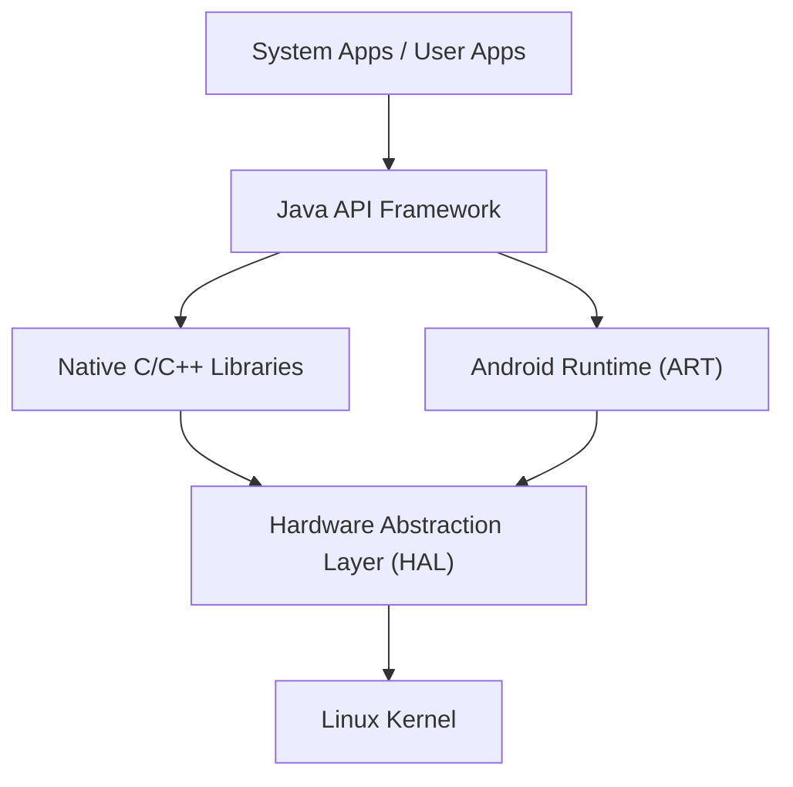

## Introdução: A Essência do Sistema Operacional Móvel que Conquistou o Mundo

Na sociedade digital moderna, os smartphones tornaram-se indispensáveis. Dentre eles, o sistema operacional (OS) que detém a maior parte da participação de mercado global é o "Android". O Android cresceu de ser apenas um sistema operacional para smartphones para uma enorme plataforma que roda em uma ampla variedade de dispositivos, incluindo tablets, smartwatches, TVs e até mesmo sistemas embarcados em automóveis.

Neste artigo, explicaremos detalhadamente a arquitetura (estrutura hierárquica) que compõe este incrivelmente popular Android OS, e como suas tecnologias centrais evoluíram ao longo da história, sob uma profunda perspectiva técnica que vai desde o kernel do Linux, a Hardware Abstraction Layer (HAL), até a transição do Dalvik para o ART (Android Runtime).

## Visão Geral da Arquitetura do Android

A arquitetura do sistema do Android OS é projetada com ênfase na flexibilidade e escalabilidade, e é amplamente dividida em 5 camadas principais. Embora cada camada tenha um papel independente, elas trabalham juntas em estreita colaboração para proporcionar uma operação estável em uma variedade de hardwares.

Desde o "Linux Kernel" localizado na camada inferior, até as "System Apps" que os usuários tocam diretamente, essa estrutura hierárquica sustenta o ecossistema aberto do Android.

## O Fundamento: Kernel do Linux

Na base da arquitetura do Android está o **Kernel do Linux**, que também é amplamente utilizado no mundo dos PCs e servidores. Embora o Android seja um sistema operacional baseado no Linux, ele difere dos sistemas de desktop Linux comuns, como o GNU/Linux, por possuir personalizações exclusivas otimizadas para as restrições severas dos dispositivos móveis (bateria limitada, memória e recursos de CPU).

### Gerenciamento de Processos e Memória

O kernel do Linux gerencia o ciclo de vida de todos os processos no dispositivo Android. Uma característica única do Android reside em sua filosofia de design de não obrigar o usuário a realizar explicitamente a ação de "fechar um aplicativo". Quando a memória fica escassa, o kernel utiliza um mecanismo chamado "Low Memory Killer (LMK)" para encerrar automaticamente processos em segundo plano de menor importância e alocar recursos de memória para o aplicativo em primeiro plano que o usuário está utilizando no momento. Esse gerenciamento avançado de processos permite uma multitarefa suave mesmo com recursos de hardware limitados.

### Segurança e Application Sandbox

A base do modelo de segurança do Android também é fornecida pelo kernel do Linux. No Android, um ID de usuário Linux (UID) exclusivo é atribuído a cada aplicativo instalado. Assim, cada aplicativo possui seu próprio espaço de processo independente e um diretório de arquivos dedicado, acessível apenas por ele mesmo.

Este mecanismo é chamado de "**Application Sandbox (Caixa de Areia de Aplicação)**". Se um aplicativo tentar acessar ilegalmente os dados ou a memória de outro, ele será fortemente bloqueado no nível do kernel através do controle de permissões do kernel do Linux. Graças a isso, mesmo que um aplicativo malicioso seja instalado, os danos a todo o sistema ou a outros aplicativos podem ser mantidos ao mínimo.

## O Papel da Hardware Abstraction Layer (HAL)

Posicionada acima do kernel do Linux está a **Hardware Abstraction Layer (HAL - Camada de Abstração de Hardware)**. A HAL é um componente crucial que suporta a diversidade do Android OS.

O Android funciona em milhares de smartphones de diferentes fabricantes. Cada dispositivo vem com sensores de câmera, chips Bluetooth e módulos de áudio distintos. Se o código central do Android OS tivesse que lidar individualmente com todas essas diferenças de hardware, o desenvolvimento do sistema operacional fracassaria completamente.

É aqui que a HAL entra em jogo. A HAL define uma "interface padrão (API)" para os fabricantes de hardware. Os fabricantes de hardware desenvolvem seus próprios drivers para controlar seu hardware e os fornecem como módulos HAL.

O framework de aplicativos do Android só precisa chamar as interfaces padrão dessa HAL. Em outras palavras, não importa se o hardware subjacente é feito pela Qualcomm ou MediaTek, o software da camada superior pode tratá-lo exatamente da mesma forma. Esta "abstração" é a maior razão pela qual o Android conseguiu construir um ecossistema de hardware tão vasto.

## A Evolução do Android Runtime: Do Dalvik ao ART

Indispensável ao falar sobre a história do Android é a evolução do seu **Runtime**, que é o ambiente para execução de aplicativos. Os aplicativos Android são escritos principalmente em Java ou Kotlin, mas eles não são código de máquina que a CPU possa entender diretamente. O mecanismo que os executa de forma eficiente é o Runtime.

### Máquina Virtual Dalvik e Compilador JIT (Antes do Android 4.4)

Nas primeiras versões do Android, foi adotada uma máquina virtual chamada "**Dalvik**". O Dalvik era um mecanismo que executava seu próprio bytecode (arquivos .dex) otimizado para a memória limitada e a CPU de dispositivos móveis.

A partir do Android 2.2 (Froyo), o **Compilador JIT (Just-In-Time)** foi introduzido no Dalvik. O compilador JIT é uma tecnologia que detecta dinamicamente "códigos frequentemente usados" enquanto o aplicativo está em execução, e compila (traduz) apenas essas partes para código de máquina em tempo real, acelerando a execução. No entanto, o overhead da compilação durante a execução criava problemas como tempo de inicialização de aplicativos mais lento, lag (atraso) temporário durante a operação e consumo excessivo de bateria.

### ART (Android Runtime) e a Introdução do Compilador AOT (A partir do Android 5.0)

Para resolver fundamentalmente esses problemas, o **ART (Android Runtime)** foi introduzido como padrão no Android 5.0 (Lollipop). A maior característica do ART é a adoção do método de **Compilação AOT (Ahead-Of-Time)**.

Na compilação AOT, no momento em que um aplicativo é instalado no dispositivo, todo o código do aplicativo é previamente compilado para código de máquina nativo, adaptado à arquitetura da CPU do dispositivo. Uma vez que o "trabalho de tradução" (compilação) não é mais necessário ao executar o aplicativo, ocorreram as seguintes melhorias drásticas:

1. **Aumento Esmagador de Desempenho**: A velocidade de inicialização dos aplicativos melhorou significativamente, e as animações e rolagens tornaram-se extremamente suaves.
2. **Prolongamento da Vida Útil da Bateria**: Como a carga na CPU durante a execução (processo de compilação) é reduzida, o consumo de energia é amplamente diminuído.
3. **Otimização do Garbage Collection**: Os algoritmos de gerenciamento de memória do ART (processo de liberação de memória não utilizada) foram fundamentalmente revisados, e as "pausas (congelamentos)" que paralisavam a operação do aplicativo foram reduzidas ao máximo.

Posteriormente, o ART continuou a evoluir. A partir do Android 7.0 (Nougat), um método híbrido foi adotado, combinando compilação AOT e JIT, bem como compilação guiada por perfil (PGO), alcançando um equilíbrio perfeito de menor tempo de instalação, economia de espaço de armazenamento e otimização da velocidade de execução.

## AOSP (Android Open Source Project) como Código Aberto

O verdadeiro poder da arquitetura do Android reside no fato de que sua base de código está publicamente disponível para o mundo como **AOSP (Android Open Source Project)**.

Embora o Google lidere o desenvolvimento, o código-fonte principal do Android está disponível sob licenças de código aberto (principalmente Apache License 2.0 e GPL), permitindo que qualquer pessoa o utilize livremente, modifique e redistribua. Isso permite que fabricantes de smartphones como Samsung e Sony criem dispositivos atraentes com suas próprias marcas adicionando sua interface de usuário (UI) e recursos exclusivos com base no AOSP.

Além disso, a existência do AOSP alimentou a comunidade de ROMs personalizadas (como o LineageOS) e se tornou a força motriz para fornecer as versões mais recentes do sistema operacional para dispositivos mais antigos e criar sistemas operacionais derivados do Android focados em privacidade. Foi graças a esta forte base de código aberto, o AOSP, que o Android conseguiu reunir o conhecimento de desenvolvedores e corporações de todo o mundo e continuar inovando em uma velocidade que uma única empresa jamais conseguiria alcançar sozinha.

## Conclusão

Acima da robusta base do kernel do Linux, repousa a HAL que abstrai as diferenças de hardware, e acima disso, o ART, que continua a evoluir para fornecer o melhor desempenho para os aplicativos. A arquitetura do Android pode ser considerada uma obra-prima da engenharia de software moderna, refinada para extrair o máximo de eficiência das duras restrições dos dispositivos móveis.

Ao entender essa bela pilha de tecnologia sobreposta — desde o kernel do Linux que gerencia processos nas profundezas do sistema operacional até a UI do aplicativo que responde instantaneamente ao toque de nossos dedos — a experiência diária no smartphone certamente se tornará ainda mais fascinante.
