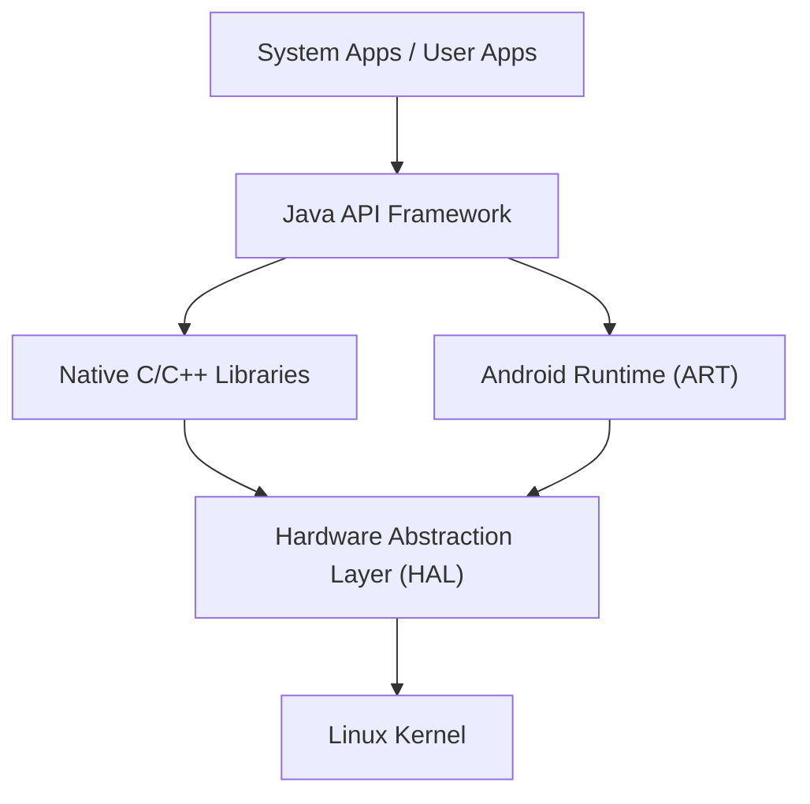

## Введение: Суть мобильной ОС, покорившей мир

В современном цифровом обществе смартфоны стали неотъемлемой частью жизни. Среди них операционная система (ОС), занимающая бóльшую часть мирового рынка, — это Android. Android выросла из простой ОС для смартфонов в гигантскую платформу, работающую на самых разнообразных устройствах: планшетах, умных часах, телевизорах и даже бортовых системах автомобилей.

В этой статье мы подробно рассмотрим, на какой архитектуре (иерархической структуре) построена получившая невероятное распространение ОС Android, и как со временем развивались ее ключевые технологии. Мы исследуем ядро Linux, уровень аппаратных абстракций (HAL) и эволюцию от Dalvik к ART (Android Runtime) с глубокой технической точки зрения.

## Общий обзор архитектуры Android

Системная архитектура ОС Android разработана с акцентом на гибкость и масштабируемость и в общих чертах состоит из 5 основных уровней (слоев). Каждый уровень выполняет свою независимую роль, при этом они тесно взаимодействуют друг с другом, обеспечивая стабильную работу на разнообразном оборудовании.

Эта иерархическая структура, от "Linux Kernel" на самом нижнем уровне до "System Apps", с которыми непосредственно взаимодействует пользователь, поддерживает открытую экосистему Android.

## Базовое ядро Linux

В основе архитектуры Android лежит **ядро Linux**, которое широко используется также в мире ПК и серверов. Хотя Android является ОС на базе Linux, в отличие от обычного настольного Linux, такого как GNU/Linux, оно содержит уникальные модификации, оптимизированные под строгие ограничения мобильных устройств (ограниченные ресурсы батареи, памяти и процессора).

### Управление процессами и памятью

Ядро Linux управляет жизненным циклом всех процессов на устройстве Android. Характерной чертой Android является философия дизайна, при которой от пользователя не требуется явно выполнять действие "закрыть приложение". Когда памяти становится недостаточно, ядро использует механизм, называемый "Low Memory Killer (LMK)", для автоматического завершения фоновых процессов с низким приоритетом и выделения ресурсов памяти приоритетным приложениям, которые в данный момент использует пользователь. Благодаря этому продвинутому управлению процессами обеспечивается плавная многозадачность даже при ограниченных аппаратных ресурсах.

### Безопасность и песочница приложений

Основа модели безопасности Android также обеспечивается ядром Linux. В Android каждому установленному приложению назначается уникальный идентификатор пользователя Linux (UID). Благодаря этому каждое приложение получает собственное независимое адресное пространство процесса и выделенный каталог файлов, доступный только ему.

Этот механизм называется "**песочница приложений (Application Sandbox)**". Попытка одного приложения несанкционированно получить доступ к данным или памяти другого приложения строго блокируется на уровне ядра с помощью контроля разрешений Linux. Таким образом, даже в случае установки вредоносного приложения, ущерб для всей системы и других приложений сводится к минимуму.

## Роль уровня аппаратных абстракций (HAL)

Над ядром Linux располагается **уровень аппаратных абстракций (Hardware Abstraction Layer: HAL)**. HAL — это чрезвычайно важный компонент, обеспечивающий многообразие устройств на ОС Android.

Android работает на тысячах различных смартфонов от множества производителей. Каждое устройство оснащено различными датчиками камер, чипами Bluetooth и аудиомодулями. Если бы базовому коду ОС Android приходилось индивидуально справляться со всеми этими аппаратными различиями, разработка ОС потерпела бы полный крах.

И здесь на сцену выходит HAL. HAL определяет "стандартный интерфейс (API)" для поставщиков оборудования (производителей). Поставщики оборудования разрабатывают собственные драйверы для управления своим оборудованием и предоставляют их в виде модулей HAL.

Фреймворк приложений Android просто вызывает этот стандартный интерфейс HAL. Иными словами, независимо от того, произведено ли оборудование нижнего уровня компанией Qualcomm или MediaTek, программное обеспечение верхнего уровня может работать с ним абсолютно одинаково. Эта "абстракция" является главной причиной того, почему Android смог создать столь масштабную аппаратную экосистему.

## Эволюция среды выполнения Android: от Dalvik к ART

Важной частью истории Android является эволюция **среды выполнения (Runtime)**, которая служит платформой для запуска приложений. Приложения для Android в основном пишутся на Java и Kotlin, но этот код сам по себе не является машинным языком, который может понять процессор. Среда выполнения — это движок для его эффективного выполнения.

### Виртуальная машина Dalvik и JIT-компилятор (Android 4.4 и более ранние версии)

В ранних версиях Android использовалась виртуальная машина, называемая "**Dalvik**". Dalvik была системой для выполнения собственного байт-кода (файлы .dex), оптимизированного для ограниченной памяти и процессоров мобильных устройств.

Начиная с Android 2.2 (Froyo), в Dalvik был внедрен **JIT-компилятор (Just-In-Time)**. JIT-компилятор — это технология, которая динамически обнаруживает "часто используемый код" во время работы приложения и в реальном времени компилирует (переводит) только эту часть в машинный язык для ускорения выполнения. Однако из-за накладных расходов на компиляцию во время выполнения возникали такие проблемы, как медленный запуск приложений, временные задержки (лаги) во время работы и повышенное энергопотребление.

### ART (Android Runtime) и внедрение AOT-компилятора (Android 5.0 и новее)

Для фундаментального решения этих проблем в Android 5.0 (Lollipop) по умолчанию была внедрена **ART (Android Runtime)**. Главной особенностью ART стало использование метода **AOT-компиляции (Ahead-Of-Time)**.

При AOT-компиляции на этапе установки приложения на устройство весь код приложения заранее полностью компилируется в нативный машинный язык, адаптированный под архитектуру процессора устройства. В результате, поскольку "перевод" (компиляция) во время выполнения приложения больше не требуется, были достигнуты следующие кардинальные улучшения:

1. **Потрясающее повышение производительности**: Скорость запуска приложений значительно возросла, а анимация и прокрутка стали невероятно плавными.
2. **Увеличение времени автономной работы**: Поскольку нагрузка на процессор (обработка компиляции) во время выполнения снижается, потребление энергии значительно уменьшается.
3. **Оптимизация сборки мусора**: Алгоритмы управления памятью (процесс освобождения неиспользуемой памяти) в ART были фундаментально переработаны, и "приостановки" (зависания), которые могли бы остановить работу приложения, были сведены к абсолютному минимуму.

После этого ART продолжил развиваться, и начиная с Android 7.0 (Nougat) был внедрен гибридный подход, сочетающий AOT-компиляцию, JIT-компиляцию, а также компиляцию на основе профилирования (PGO). Это обеспечило идеальный баланс между сокращением времени установки, экономией места на накопителе и оптимизацией скорости выполнения.

## AOSP (Android Open Source Project) как открытый исходный код

Истинная сила архитектуры Android заключается в том, что ее кодовая база доступна всему миру в виде **AOSP (Android Open Source Project)**.

Хотя разработку возглавляет Google, основной исходный код Android можно свободно использовать, изменять и распространять по лицензиям с открытым исходным кодом (преимущественно Apache License 2.0 и GPL). Благодаря этому производители смартфонов, такие как Samsung и Sony, могут использовать AOSP в качестве основы, добавлять собственный пользовательский интерфейс (UI) и функции, и создавать привлекательные устройства под собственными брендами.

Кроме того, существование AOSP способствует развитию сообществ кастомных прошивок (таких как LineageOS), предоставляя новейшие ОС для старых устройств и являясь движущей силой для создания производных от Android ОС, ориентированных на конфиденциальность. Именно благодаря надежному фундаменту с открытым исходным кодом в виде AOSP, Android смог объединить знания разработчиков и компаний со всего мира и продолжить инновации с такой скоростью, которой не могла бы достичь ни одна отдельная компания.

## Заключение

На прочном фундаменте ядра Linux располагается HAL, сглаживающий аппаратные различия, а постоянно развивающийся ART обеспечивает приложениям высочайшую производительность. Архитектуру Android можно назвать шедевром современной программной инженерии, усовершенствованным для достижения максимальной эффективности в суровых ограничениях мобильных устройств.

Понимание этой прекрасно сложенной иерархической структуры (стека) технологий, от ядра Linux, управляющего процессами в глубинах ОС, до пользовательского интерфейса приложений, мгновенно реагирующего на касания наших пальцев, должно сделать ежедневное использование смартфона еще более увлекательным.
