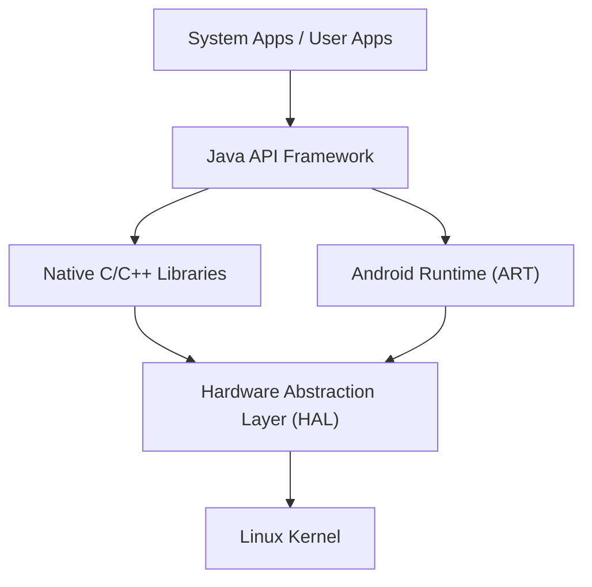

## 引言：征服世界的移动操作系统的精髓

在现代数字社会中，智能手机已经成为不可或缺的存在。其中，占据世界市场份额绝大部分的操作系统（OS）就是“Android（安卓）”。Android不再仅仅是智能手机的操作系统，它已经成长为一个在平板电脑、智能手表、电视，甚至是汽车车载系统等多种设备上运行的庞大平台。

本文将从深度技术视角详细解析这款普及惊人的Android OS是由怎样的架构（层次结构）构成的，以及其核心技术是如何随着历史演进的，包括Linux内核、硬件抽象层（HAL），以及从Dalvik到ART（Android Runtime）的演变。

## Android架构全貌

Android OS的系统架构注重灵活性和可扩展性，大致由5个主要层次构成。每个层次在保持独立作用的同时紧密协作，实现了在多种硬件上的稳定运行。

从位于最底层的“Linux Kernel”到用户直接接触的“System Apps”，这种层次结构支撑了Android的开放生态系统。

## 作为基础的Linux内核

在Android架构的最底层，采用了在PC和服务器领域也广泛使用的**Linux内核**。虽然Android是基于Linux的操作系统，但它与GNU/Linux等常见的桌面级Linux不同，针对移动设备严苛的限制（有限的电池、内存和CPU资源）进行了独有的优化。

### 进程管理与内存管理

Linux内核负责管理Android设备上所有进程的生命周期。Android的一大特点在于其设计理念：不要求用户显式执行“关闭应用程序”的操作。当内存不足时，内核会利用一种名为“Low Memory Killer (LMK)”的机制，自动终止重要性较低的后台进程，并将内存资源分配给用户当前正在使用的前台应用。得益于这种高级的进程管理，即使硬件资源有限，也能实现流畅的多任务处理。

### 安全性与应用沙盒

Android安全模型的基石也是由Linux内核提供的。在Android中，每个安装的应用程序都会被分配一个唯一的Linux用户ID（UID）。由此，每个应用程序都拥有自己独立的进程空间和只有自己能够访问的专属文件目录。

这种机制被称为“**应用沙盒（Application Sandbox）**”。当一个应用试图非法访问其他应用的数据或内存时，会被Linux内核的权限控制在内核级别强行拦截。这样一来，即使万一安装了恶意应用，也能将对整个系统和其他应用的损害降至最低。

## 硬件抽象层（HAL）的作用

位于Linux内核上方的是**硬件抽象层（Hardware Abstraction Layer : HAL）**。HAL是支撑Android OS多样性的极其重要的组件。

Android运行在成千上万种不同制造商生产的智能手机上。每台设备都搭载了不同的摄像头传感器、蓝牙芯片和音频模块。如果Android OS的核心代码必须去逐一适配这些所有硬件的差异，操作系统的开发将会彻底崩溃。

这就轮到HAL登场了。HAL为硬件供应商（制造商）定义了“标准接口（API）”。硬件供应商开发用于控制自家硬件的独有驱动程序，并将其作为HAL模块提供。

Android的应用程序框架只需要调用这个HAL的标准接口即可。也就是说，无论底层的硬件是高通还是联发科制造，在上层软件看来，处理方式完全相同。正是这种“抽象化”，成为了Android能够构建起如此庞大的硬件生态系统的最大原因。

## Android运行时的演进：从Dalvik到ART

在谈论Android的历史时，必不可少的是执行应用程序的环境——**运行时（Runtime）**的演进。Android应用主要使用Java或Kotlin编写，但它们本身并不能被CPU直接理解为机器语言。运行时就是为了高效执行这些代码的引擎。

### Dalvik虚拟机与JIT编译器（Android 4.4及以前）

在早期的Android中，采用了一种名为“**Dalvik**”的虚拟机。Dalvik是一种执行独有字节码（.dex文件）的机制，针对移动设备有限的内存和CPU进行了优化。

从Android 2.2（Froyo）开始，Dalvik引入了**JIT（Just-In-Time）编译器**。JIT编译器是一种在应用运行期间动态检测“频繁使用的代码”，并实时将那部分代码编译（翻译）成机器语言以加速执行的技术。然而，由于运行时会产生编译的开销，这导致了应用启动变慢、运行中出现暂时性卡顿以及电池消耗加剧等问题。

### 引入ART（Android Runtime）与AOT编译器（Android 5.0及以后）

为了从根本上解决这些问题，Android 5.0（Lollipop）标准引入了**ART（Android Runtime）**。ART的最大特点是采用了**AOT（Ahead-Of-Time）编译**方式。

在AOT编译中，在将应用安装到设备上的阶段，就提前将应用的整体代码完全编译成适应设备CPU架构的原生机器语言。因此，应用运行时不再需要编译这种“翻译工作”，从而带来了以下剧烈的改善：

1. **压倒性的性能提升**：应用的启动速度大幅提升，动画和滚动变得极其流畅。
2. **延长电池寿命**：由于减少了运行时的CPU负载（编译处理），极大地抑制了电力消耗。
3. **优化垃圾回收**：ART从根本上重新设计了内存管理（释放不再需要的内存的处理）算法，将导致应用停止响应的“暂时冻结”减少到了极限。

此后ART继续进化，从Android 7.0（Nougat）开始，采用结合了AOT编译、JIT编译以及配置导向编译（PGO）的混合方式，实现了缩短安装时间、节约存储空间和优化执行速度的完美平衡。

## 作为开源的AOSP（Android开源项目）

Android架构的真正力量在于其代码库作为**AOSP（Android Open Source Project）**向全世界公开。

尽管在Google的主导下推进开发，但Android的核心源代码是在开源许可证（主要是Apache License 2.0和GPL）下发布，任何人都可以自由使用、修改和重新分发。这使得三星、索尼等智能手机制造商能够以AOSP为基础，添加自己独有的UI（用户界面）和功能，打造出具有自家品牌魅力的设备。

此外，AOSP的存在孕育了定制ROM（如LineageOS）社区，为旧设备提供最新操作系统，也成为了诞生专注于隐私的独立Android派生OS的原动力。正是因为有了AOSP这样坚固的开源基础，Android才能够汇聚全世界开发者和企业的智慧，以单一企业无法企及的速度持续创新。

## 结语

在Linux内核坚固的基础之上，放置了吸收硬件差异的HAL，并由不断进化的ART为应用程序提供最佳性能。Android的架构可谓是现代软件工程的杰作，它为了在移动设备严苛的限制中榨取最大效率而被不断精炼。

从操作系统深处管理进程的Linux内核，到瞬间响应我们指尖点击的应用UI，理解这种优美重叠的技术层次结构（技术栈），一定会让日常的智能手机体验变得更加有趣。
