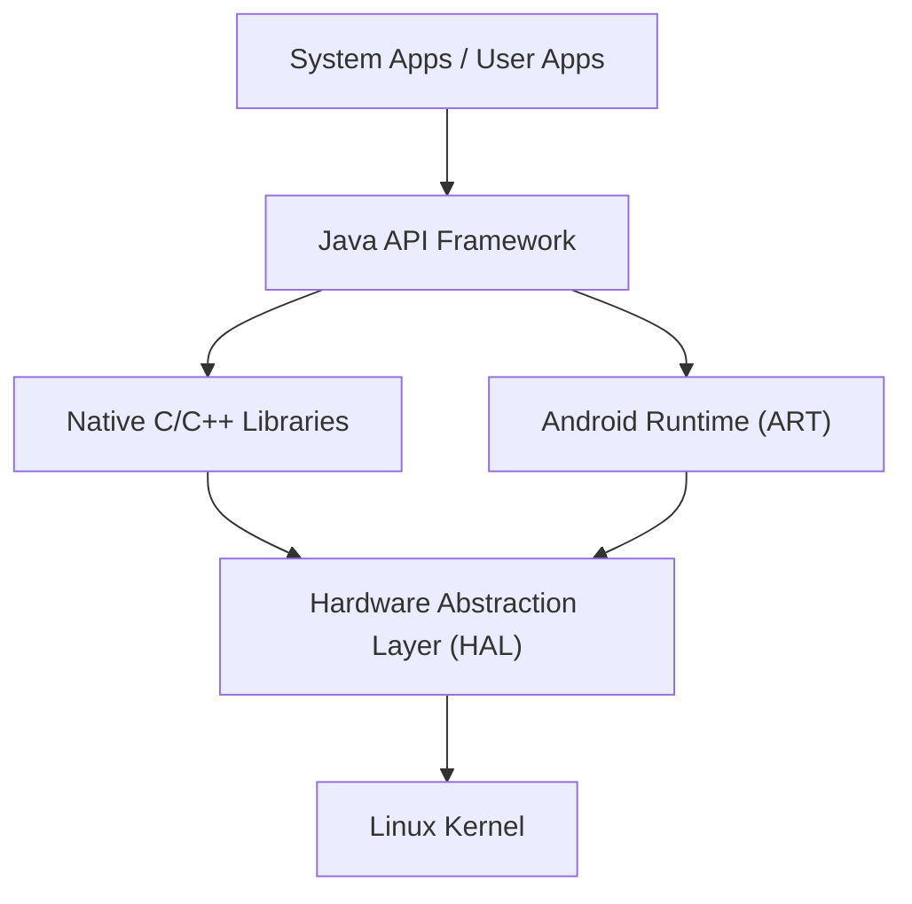

## 前言：稱霸世界的行動作業系統之精髓

在現代數位社會中，智慧型手機已成為不可或缺的存在。其中，佔據全球絕大部分市佔率的作業系統（OS）便是「Android」。Android 不僅僅是智慧型手機的作業系統，更成長為一個能在平板電腦、智慧手錶、電視，甚至汽車車載系統等多種裝置上運行的巨大平台。

本文將從深度的技術視角，詳細解說這款驚人普及的 Android 作業系統是由什麼樣的架構（階層結構）所構成，以及其核心技術在歷史中是如何演進的，涵蓋 Linux 核心、硬體抽象層（HAL），以及從 Dalvik 到 ART（Android Runtime）的變遷。

## Android 架構全貌

Android 作業系統的系統架構在設計上重視彈性與擴充性，大致可分為 5 個主要的層級（階層）。每個層級在擁有獨立角色的同時，也緊密地協同運作，以實現在多樣化硬體上的穩定運行。

從位於最底層的「Linux Kernel」到使用者直接接觸的「System Apps」，這個階層結構支撐了 Android 的開放生態系統。

## 作為基礎的 Linux 核心

在 Android 架構最基礎的部分，採用了在 PC 與伺服器世界中也廣泛使用的 **Linux 核心**。雖然 Android 是基於 Linux 的作業系統，但與 GNU/Linux 等一般的桌面版 Linux 不同，它針對行動裝置的嚴苛限制（有限的電池、記憶體與 CPU 資源）進行了獨特的最佳化客製。

### 行程管理與記憶體管理

Linux 核心管理著 Android 裝置上所有行程的生命週期。Android 的一大特色在於其設計理念：不讓使用者明確地執行「關閉應用程式」的操作。當記憶體不足時，核心會使用稱為「Low Memory Killer (LMK)」的機制，自動終止重要度較低的背景行程，並將記憶體資源分配給使用者當前正在使用的前景應用程式。透過這種高度的行程管理，即使硬體資源有限，也能實現流暢的多工處理。

### 安全性與應用程式沙盒

Android 安全性模型的根本也是由 Linux 核心所提供。在 Android 中，所有已安裝的應用程式都會被分配一個獨一無二的 Linux 使用者 ID（UID）。這樣一來，每個應用程式都會擁有自身獨立的行程空間，以及只有自己能夠存取的專屬檔案目錄。

這個機制被稱為「**應用程式沙盒（Application Sandbox）**」。某個應用程式若想不當存取其他應用程式的資料或記憶體，會被 Linux 核心的權限控制在核心層級強力阻擋。因此，即使萬一安裝了惡意應用程式，也能將對整個系統或其他應用程式的損害降到最低。

## 硬體抽象層（HAL）的角色

位於 Linux 核心上層的是**硬體抽象層（Hardware Abstraction Layer : HAL）**。HAL 是支撐 Android 作業系統多樣性極為重要的元件。

Android 能在數千種不同製造商生產的智慧型手機上運行。每種裝置都搭載了不同的相機感測器、藍牙晶片和音訊模組。如果 Android 作業系統的核心程式碼必須個別吸收所有這些硬體的差異，那麼作業系統的開發將徹底崩潰。

這時候 HAL 就登場了。HAL 對硬體供應商（製造商）定義了「標準介面（API）」。硬體供應商會開發專屬的驅動程式來控制自家的硬體，並將其作為 HAL 模組提供。

Android 的應用程式框架只需要呼叫這個 HAL 的標準介面即可。也就是說，不管底層硬體是高通（Qualcomm）還是聯發科（MediaTek）製造的，上層的軟體都能以完全相同的方式來處理。這種「抽象化」正是 Android 能夠建立起如此龐大硬體生態系統的最大原因。

## Android 執行環境的演進：從 Dalvik 到 ART

在談論 Android 的歷史時，不可或缺的是用於執行應用程式的環境——**執行環境（Runtime）**的演進。Android 應用程式主要以 Java 或 Kotlin 編寫，但這些語言原封不動的話並不是 CPU 能理解的機器碼。用來有效率地執行這些程式碼的引擎就是執行環境。

### Dalvik 虛擬機與 JIT 編譯器（Android 4.4 以前）

早期的 Android 採用了稱為「**Dalvik**」的虛擬機。Dalvik 是一種用來執行專為行動裝置有限記憶體與 CPU 最佳化過的獨特位元組碼（.dex 檔案）的機制。

從 Android 2.2（Froyo）開始，Dalvik 導入了 **JIT（Just-In-Time）編譯器**。JIT 編譯器是一項在應用程式執行中動態偵測「常用程式碼」，並即時將該部分編譯（翻譯）成機器碼來加速執行的技術。然而，由於在執行時會產生編譯的負載（Overhead），因此帶來了應用程式啟動變慢、運行中出現短暫延遲（卡頓），以及耗電量劇增等問題。

### 導入 ART（Android Runtime）與 AOT 編譯器（Android 5.0 以後）

為了解決這些根本性的問題，Android 5.0（Lollipop）標準導入了 **ART（Android Runtime）**。ART 最大的特色就是採用了 **AOT（Ahead-Of-Time）編譯**方式。

在 AOT 編譯中，於裝置上安裝應用程式的階段，就會預先將應用程式整體的程式碼完全編譯成符合該裝置 CPU 架構的原生機器碼。因此，在應用程式執行時就不再需要進行「翻譯作業」，這帶來了以下戲劇性的改善：

1. **壓倒性的效能提升**：應用程式的啟動速度大幅提升，動畫與滾動變得極為流暢。
2. **延長電池壽命**：由於執行時的 CPU 負載（編譯處理）減少，能大幅降低耗電量。
3. **垃圾回收（Garbage Collection）的最佳化**：ART 根本性地重新設計了記憶體管理（釋放不需要的記憶體）的演算法，將會導致應用程式停止運作的「短暫停頓（凍結）」減少到了極限。

在此之後 ART 也持續進化，從 Android 7.0（Nougat）開始，採用了結合 AOT 編譯、JIT 編譯以及設定檔引導編譯（PGO）的混合模式，實現了縮短安裝時間、節省儲存空間與最佳化執行速度之間的完美平衡。

## 作為開放原始碼的 AOSP（Android Open Source Project）

Android 架構真正的力量在於，其程式碼庫作為 **AOSP（Android Open Source Project）**向全世界公開。

雖然由 Google 主導開發，但 Android 核心的原始碼在開放原始碼授權（主要是 Apache License 2.0 與 GPL）下，任何人都可以自由地使用、修改與重新發佈。這使得三星（Samsung）與索尼（Sony）等智慧型手機製造商能夠以 AOSP 為基礎，加入自家的 UI（使用者介面）與功能，打造出具備自家品牌魅力的裝置。

此外，AOSP 的存在孕育了自訂 ROM（如 LineageOS 等）的社群，成為為舊款裝置提供最新作業系統，或是催生專注於隱私的獨特 Android 衍生系統的原動力。正因為有 AOSP 這個堅固的開源基礎，Android 才能集結全世界開發者與企業的智慧，以單一企業無法企及的速度持續創新。

## 結語

在 Linux 核心堅固的基礎上，配置了吸收硬體差異的 HAL，再透過持續進化的 ART 為應用程式提供最佳的效能。Android 的架構可說是為了在行動裝置嚴苛的限制中發揮最大效率而淬鍊出的現代軟體工程傑作。

從在作業系統深處管理行程的 Linux 核心，到能瞬間回應我們指尖點擊的應用程式 UI，透過理解這層層交疊、優美的技術階層結構（堆疊），想必能讓每天的智慧型手機體驗變得更加有趣。
