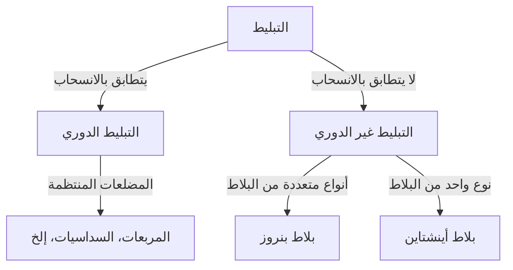

في عالم الرياضيات، هناك مشاكل غير محلولة تبدو بسيطة ولكنها حيرت علماء الرياضيات لقرون. مشكلة "التبليط" هي واحدة منها، ولها تأثير عميق يمتد إلى الفيزياء وعلم المواد.

## أساسيات التبليط

تغطية مستوى بأشكال هندسية دون فجوات أو تداخل يسمى "التبليط".

## التبليط غير الدوري وأشباه البلورات

اكتشف روجر بنروز التبليط غير الدوري في السبعينيات. وفي عام 1982، اكتشف دان شيختمان أشباه البلورات (جائزة نوبل 2011).

## مشكلة أينشتاين واكتشاف 2023

في عام 2023، تم حل مشكلة "أينشتاين" (بلاطة واحدة) باكتشاف "القبعة" من قبل ديفيد سميث وفريقه.
