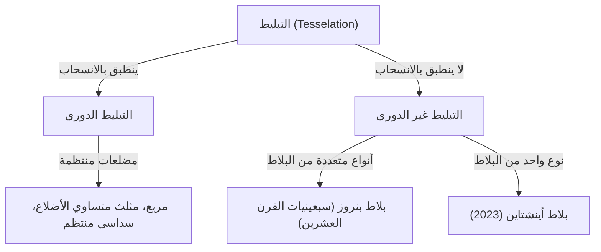
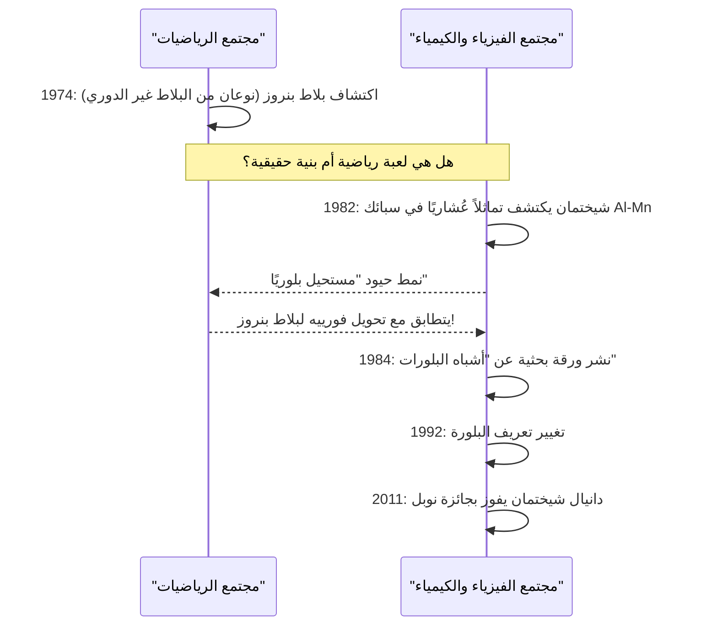

في عالم الرياضيات، توجد العديد من المشكلات غير المحلولة التي تبدو بسيطة للوهلة الأولى، لكنها حيرت عقول علماء الرياضيات لقرون. من بينها، مشكلة "التبليط" (Tesselation / Tiling) التي تجاوزت حدود الهندسة البحتة وأثرت بعمق في الفيزياء، وعلوم المواد، وحتى الفن.

في هذا المقال، سنغوص بعمق في القصة الملحمية التي تتقاطع فيها الرياضيات وعلم البلورات، بدءًا من أساسيات التبليط غير الدوري، مرورًا بـ "بلاط بنروز" الذي ابتكره روجر بنروز، واكتشاف "أشباه البلورات" الذي قاد دانيال شيختمان للفوز بجائزة نوبل، وصولًا إلى اكتشاف "بلاط أينشتاين" (أحادي البلاط غير الدوري) الذي أذهل العالم في عام 2023.

## 1. أساسيات مشكلة التبليط والدورية

تغطية مستوى بالكامل بأشكال هندسية دون أي فجوات أو تداخل يُسمى "التبليط". أبسط الأمثلة هي التبليط باستخدام المربعات، والمثلثات متساوية الأضلاع، والسداسيات المنتظمة. تُعرف هذه بالتبليطات "الدورية"، حيث يتكرر نمط معين إلى ما لا نهاية من خلال الانزلاق (الانسحاب) في اتجاه معين.

### الدورية والتماثل

في علم البلورات، كان يُعتقد لفترة طويلة أن ترتيب الذرات الذي يملأ الفضاء "دوري". يمكن للتركيبات الدورية أن تمتلك تماثلًا دورانيًا من الرتبة الثانية، أو الثالثة، أو الرابعة، أو السادسة، ولكن ثبت رياضيًا أنه من المستحيل أن يكون للتركيب الدوري **تماثل خماسي** أو **تماثل من الرتبة الثامنة فما فوق** (نظرية التقييد البلوري).



## 2. استكشاف التبليط غير الدوري: بلاط وانغ

في عام 1961، ابتكر عالم الرياضيات هاو وانغ مربعات ذات حواف ملونة عُرفت باسم "بلاط وانغ". وقد افترض أنه "إذا كان بإمكان أي مجموعة من البلاط تغطية المستوى بالكامل، فإن التبليط الدوري ممكن". ومع ذلك، دحض طالبه روبرت بيرغر هذه الفرضية في عام 1966، واكتشف مجموعة من البلاط (كانت في البداية 20,426 قطعة، ثم تم تقليصها لاحقًا إلى 104 قطعة) يمكنها تغطية المستوى **"بشكل غير دوري فقط"**.

## 3. صدمة بلاط بنروز

في سبعينيات القرن العشرين، نجح الفيزيائي وعالم الرياضيات البريطاني روجر بنروز (الحائز على جائزة نوبل في الفيزياء لعام 2020) في تقليل أنواع البلاط اللازمة للتبليط غير الدوري بشكل كبير. باستخدام **نوعين** فقط من البلاط ("الطائرة الورقية" (kite) و"السهم" (dart)، أو نوعين من المعينات)، اكتشف "بلاط بنروز" الذي يمكنه تغطية المستوى بشكل غير دوري فقط.

### الخصائص الرياضية

يتمتع بلاط بنروز بالخصائص المذهلة التالية:
1. **اللا دورية**: مهما كانت مساحة الجزء المقتطع والمنسحب كبيرة، فإنه لن يتطابق تمامًا مع النمط الأصلي أبدًا.
2. **التشابه المحلي**: أي نمط محدود الحجم يظهر مرات لا حصر لها في كل مكان داخل التبليط اللانهائي.
3. **النسبة الذهبية**: تظهر النسبة الذهبية $\phi = \frac{1 + \sqrt{5}}{2}$ في كل مكان، مثل نسبة نوعي البلاط أو نسبة مساحة الأنماط.

$$ \lim_{R \to \infty} \frac{N_{kite}(R)}{N_{dart}(R)} = \phi \approx 1.618 $$

### مفهوم التوليد الكسوري البسيط باستخدام بايثون

يمكن توليد بلاط بنروز بشكل متكرر باستخدام "قاعدة التضخم" (Inflation Rule). فيما يلي مثال مفاهيمي للتقسيم المتكرر باستخدام بايثون.

```python
import matplotlib.pyplot as plt
import numpy as np

# النسبة الذهبية
PHI = (1 + np.sqrt(5)) / 2

class Triangle:
    def __init__(self, color, p1, p2, p3):
        self.color = color
        self.p1 = p1
        self.p2 = p2
        self.p3 = p3

def inflate(triangles):
    new_triangles = []
    for t in triangles:
        if t.color == 0: # نصف طائرة ورقية
            # حساب التقسيم (مفاهيمي)
            p4 = t.p1 + (t.p2 - t.p1) / PHI
            new_triangles.append(Triangle(1, p4, t.p3, t.p1))
            new_triangles.append(Triangle(0, t.p2, t.p3, p4))
        else: # نصف سهم
            p4 = t.p1 + (t.p2 - t.p1) / PHI
            p5 = t.p3 + (t.p2 - t.p3) / PHI
            new_triangles.append(Triangle(1, p4, p5, t.p1))
            # تم حذف بعض الأجزاء للتبسيط
    return new_triangles

# تم حذف تفاصيل التنفيذ مثل عملية الرسم،
# ولكن بهذه الطريقة، يمكن توليد أنماط غير دورية لا حصر لها من خلال التقسيم المتكرر (التضخم).
```

## 4. التحول النموذجي في علم البلورات: اكتشاف أشباه البلورات

لفترة طويلة، كان يُعتبر بلاط بنروز "لعبة رياضية". ولكن في عام 1982، أثناء مراقبة نمط حيود الإلكترونات لسبائك الألومنيوم والمنغنيز، اكتشف عالم المواد الإسرائيلي دانيال شيختمان شيئًا لا يصدق.

كانت مادة تمتلك **"بقع حيود واضحة (تشير إلى درجة عالية من الترتيب)، بينما تُظهر تماثلاً عُشاريًا (تماثل مستحيل في التركيبات الدورية)"**.

### رد فعل المجتمع العلمي العنيف وجائزة نوبل

وفقًا للمنطق السائد في علم البلورات في ذلك الوقت، تم تعريف البلورات على أنها مواد ذات ترتيب ذري دوري. ولأن حالة كونها "غير دورية وتتمتع بدرجة عالية من الترتيب" كانت تُعتبر متناقضة، واجه اكتشاف شيختمان في البداية انتقادات شديدة باعتباره خطأً تجريبيًا مثل الحيود المزدوج. حتى أن كيميائيًا عظيمًا مثل لينوس باولينج سخر قائلاً: "لا توجد أشباه بلورات، يوجد فقط أشباه علماء".

ومع ذلك، أثبتت الأبحاث التفصيلية اللاحقة أن اكتشاف شيختمان كان حقيقيًا. فقد كان الترتيب الذري لهذه المادة يمتلك نفس البنية الرياضية لبلاط بنروز (التبليط غير الدوري) في الأبعاد الثلاثة. سُميت هذه المادة **"شبه البلورة" (Quasicrystal)**، وفي عام 1992 اضطر الاتحاد الدولي لعلم البلورات إلى تغيير تعريف البلورة من "الدورية" إلى "المواد التي تظهر نمط حيود منفصل". بفضل هذا الإنجاز، حصل شيختمان على جائزة نوبل في الكيمياء لعام 2011.



## 5. مشكلة أينشتاين: السعي وراء البلاط الأحادي غير الدوري

أظهر بلاط بنروز أن التبليط غير الدوري ممكن باستخدام "نوعين" من البلاط. وبناءً على ذلك، طرح علماء الرياضيات السؤال النهائي التالي:

**"هل من الممكن تغطية المستوى بشكل غير دوري فقط باستخدام نوع واحد فقط من البلاط؟"**

سُميت هذه المشكلة **"مشكلة أينشتاين"**، نسبة إلى الكلمة الألمانية "ein stein" التي تعني "حجر واحد"، وأصبح يُطلق على البلاط الافتراضي الذي يستوفي هذا الشرط اسم "بلاط أينشتاين".

على مدى عقود، حاول العديد من علماء الرياضيات حل هذه المشكلة، لكن دون جدوى. كانت هناك محاولات مثل سداسي تايلور-سوكولار (1999)، لكنها تطلبت قيودًا تتعلق بقواعد التجاور أو الأنماط. وظل المضلع الذي يمكن أن يكون "أينشتاين" من خلال شكله النقي فقط غير مكتشف لفترة طويلة.

## 6. اختراق عام 2023: "القبعة" و"الشبح"

وفي مارس 2023، اجتاحت العالم أخبار مذهلة. أثبت فريق بحثي يتكون من الهاوي في الرياضيات ديفيد سميث، وكريج كابلان، وجوزيف مايرز، وحاييم جودمان شتراوس، أن بلاطًا أحاديًا ذا 13 ضلعًا يُسمى **"القبعة" (The Hat)** هو بلاط أينشتاين.

### هندسة بلاط "القبعة"

يأخذ بلاط القبعة شكلًا يشبه الجمع بين 8 "طائرات ورقية" (polykite) مبنية على سداسي منتظم. يمكن لهذا البلاط تغطية المستوى بالكامل وبشكل غير دوري فقط، بشرط السماح باستخدام صورته المعكوسة (شكله المقلوب).

$$ \text{Hat Tile} = 8 \times \text{Kites from a Hexagon} $$

### البلاط الأحادي غير الدوري اللامركزي الصارم "الشبح"

كان اكتشاف "القبعة" في حد ذاته إنجازًا تاريخيًا، لكن بعض علماء الرياضيات أشاروا إلى أن "السماح بالصورة المعكوسة (القلب) هو في الأساس نفس استخدام نوعين من البلاط، أليس كذلك؟"

رداً على ذلك، أعلن نفس فريق البحث بعد بضعة أشهر فقط، في مايو 2023، عن بلاط جديد يُسمى **"الشبح" (The Spectre)**. "الشبح" هو "بلاط أحادي غير دوري صارم" يحقق تبليطًا غير دوري نقياً من خلال الانسحاب والدوران فقط، دون استخدام أي صور معكوسة (بدون قلب). وبهذا، تم حل "مشكلة أينشتاين" التي استمرت لعقود بشكل كامل.

## 7. الخلاصة: المستقبل الذي تفتحه الهندسة

بدءًا من فرضية هاو وانغ، ومرورًا بحدس بنروز، والروح التي لا تقهر لشيختمان، وصولًا إلى أحدث الاختراقات التي حققها سميث وزملاؤه، كان تاريخ التبليط غير الدوري سلسلة من قلب ما كان يُعتقد أنه "مستحيل".

هذه الاكتشافات الرياضية ليست مجرد ألغاز. تُستخدم أشباه البلورات بالفعل في طلاء المقالي، والمشارط الجراحية، وتحسين كفاءة مصابيح LED. كما يحمل اكتشاف "القبعة" و"الشبح" إمكانية لتصميم مواد خارقة (Metamaterials) جديدة في المستقبل، وتطوير مواد جديدة ذات خصائص فيزيائية غير معروفة.

كيف ترتبط الاستكشافات الرياضية المجردة ارتباطًا وثيقًا بالعالم المادي الواقعي، وتعيد كتابة فهمنا للكون؟ يمكن القول إن قصة التبليط غير الدوري هي واحدة من أجمل وأقوى الأدلة على ذلك.
