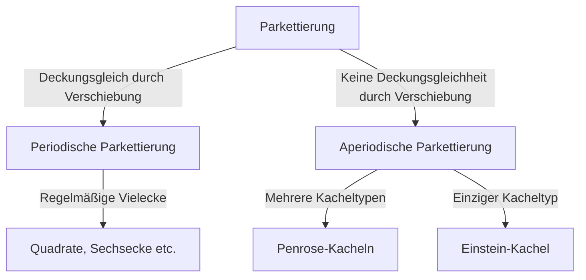

In der Welt der Mathematik gibt es ungelöste Probleme, die auf den ersten Blick einfach erscheinen, Mathematiker jedoch seit Jahrhunderten vor Rätsel stellen. Das Problem der "Parkettierung" (Tessellation) ist eines davon und hat tiefgreifende Auswirkungen, die über die reine Geometrie hinaus bis in die Physik und Materialwissenschaft reichen. In diesem Artikel tauchen wir in die Geschichte der aperiodischen Parkettierung und den Paradigmenwechsel in der Kristallographie ein.

## Grundlagen des Parkettierungsproblems

Die lückenlose und überlappungsfreie Bedeckung einer Ebene mit geometrischen Formen wird als "Parkettierung" bezeichnet. Die einfachsten Beispiele sind "periodische" Parkettierungen, bei denen sich ein Muster durch Verschiebung in bestimmten Richtungen unendlich wiederholt.

## Erforschung der aperiodischen Parkettierung

Im Jahr 1961 führte der Mathematiker Hao Wang die "Wang-Kacheln" ein. In den 1970er Jahren entdeckte Roger Penrose, dass nur zwei Formen (Drachen und Pfeil) ausreichen, um eine Ebene vollständig aperiodisch zu bedecken.

## Paradigmenwechsel in der Kristallographie

Lange galten Penrose-Kacheln als mathematische Kuriosität. 1982 entdeckte Dan Shechtman jedoch Quasikristalle in einer Aluminium-Mangan-Legierung, die eine "10-zählige Symmetrie" aufwiesen. Für diese Entdeckung erhielt er 2011 den Nobelpreis für Chemie.

## Das Einstein-Problem und der Durchbruch von 2023

Es stellte sich die Frage: "Kann eine einzige Kachelform die Ebene ausschließlich aperiodisch parkettieren?" Dieses "Einstein-Problem" wurde 2023 gelöst, als ein Team um David Smith die 13-seitige "Hut"-Kachel (The Hat) und später die "Spectre"-Kachel entdeckte.

Diese mathematischen Entdeckungen sind mehr als nur Rätsel; sie bergen das Potenzial für die Entwicklung neuer Metamaterialien.
