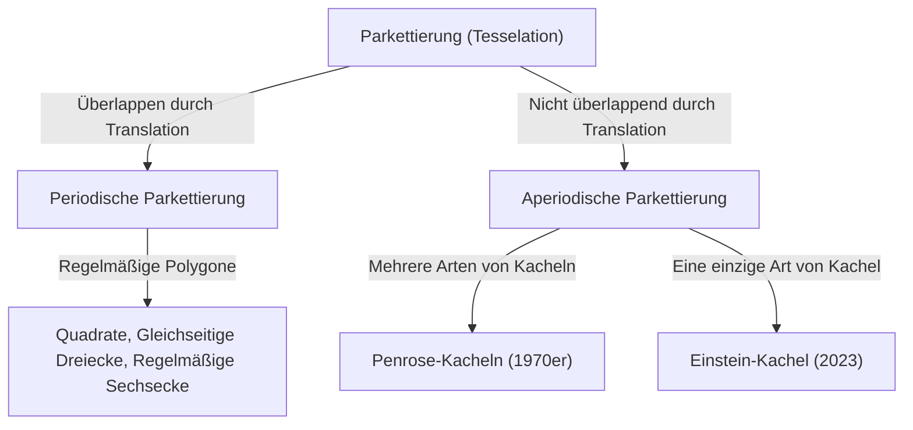
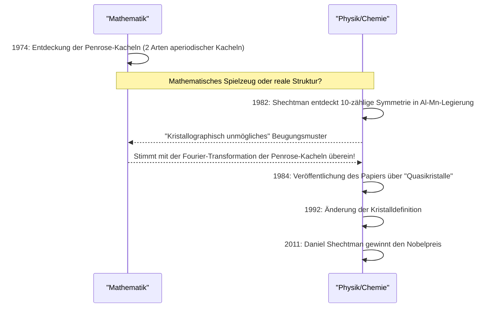

In der Welt der Mathematik gibt es viele ungelöste Probleme, die auf den ersten Blick einfach erscheinen, aber die Köpfe von Mathematikern über Jahrhunderte hinweg beschäftigt haben. Darunter haben Probleme im Zusammenhang mit "Parkettierung" (Tesselation / Tiling) die Grenzen der reinen Geometrie überschritten und Physik, Materialwissenschaft und sogar die Kunst tiefgreifend beeinflusst.

In diesem Artikel werden wir die epische Geschichte an der Schnittstelle von Mathematik und Kristallographie tiefgehend erforschen. Wir beginnen mit den Grundlagen der aperiodischen Parkettierung, gehen über zu den "Penrose-Kacheln" von Roger Penrose, der Entdeckung der "Quasikristalle", die zu Daniel Shechtmans Nobelpreis führte, und enden mit der Entdeckung der "Einstein-Kachel" (aperiodische Monokachel), die 2023 die Welt überraschte.

## 1. Grundlagen des Kachelproblems und Periodizität

Das lückenlose und überlappungsfreie Ausfüllen einer Ebene mit Formen wird "Parkettierung" oder "Kacheln" genannt. Die einfachsten Beispiele sind Kachelungen mit Quadraten, gleichseitigen Dreiecken und regelmäßigen Sechsecken. Diese werden "periodische" Parkettierungen genannt und wiederholen sich unendlich, wenn ein bestimmtes Muster in eine bestimmte Richtung verschoben wird.

### Periodizität und Symmetrie

In der Kristallographie glaubte man lange Zeit, dass die Anordnung der atome, die den Raum ausfüllt, "periodisch" sei. Periodische Strukturen können 2-zählige, 3-zählige, 4-zählige oder 6-zählige Rotationssymmetrien aufweisen, aber es ist mathematisch bewiesen, dass periodische Strukturen mit **5-zähliger Symmetrie** oder **Symmetrien von 8 und höher** unmöglich sind (kristallographisches Restriktionstheorem).



## 2. Die Erforschung aperiodischer Parkettierungen: Wang-Kacheln

1961 erfand der Mathematiker Hao Wang die sogenannten "Wang-Kacheln", quadratische Kacheln mit farbigen Kanten. Er stellte die Vermutung auf: "Wenn ein beliebiges Set von Kacheln die Ebene ausfüllen kann, dann ist eine periodische Parkettierung möglich." Sein Schüler Robert Berger widerlegte diese Vermutung jedoch 1966 und entdeckte ein Set von Kacheln (anfangs 20.426, später auf 104 reduziert), die die Ebene **"nur aperiodisch"** ausfüllen können.

## 3. Der Schock der Penrose-Kacheln

In den 1970er Jahren gelang es dem britischen Physiker und Mathematiker Roger Penrose (Nobelpreisträger für Physik 2020), die für eine aperiodische Parkettierung benötigte Anzahl von Kachelarten drastisch zu reduzieren. Er entdeckte die "Penrose-Kacheln", die die Ebene nur aperiodisch mit nur **zwei Arten** von Kacheln (einem "Drachen" (Kite) und einem "Pfeil" (Dart) oder zwei Arten von Rauten) ausfüllen können.

### Mathematische Eigenschaften

Penrose-Kacheln haben die folgenden erstaunlichen Eigenschaften:
1. **Aperiodizität**: Egal wie groß ein Bereich ist, den Sie ausschneiden und verschieben, er wird niemals perfekt mit dem ursprünglichen Muster übereinstimmen.
2. **Lokale Isomorphie**: Jedes Muster endlicher Größe erscheint unendlich oft überall in der unendlichen Kachelung.
3. **Goldener Schnitt**: Der Goldene Schnitt $\phi = \frac{1 + \sqrt{5}}{2}$ taucht überall auf, einschließlich des Verhältnisses der beiden Kachelarten und des Flächenverhältnisses der Muster.

$$ \lim_{R \to \infty} \frac{N_{kite}(R)}{N_{dart}(R)} = \phi \approx 1.618 $$

### Ein einfaches Konzept zur Fraktalgenerierung in Python

Penrose-Kacheln können rekursiv mithilfe von "Inflationsregeln" (Expansionsregeln) generiert werden. Das Folgende ist ein konzeptionelles Beispiel für rekursive Teilung mit Python.

```python
import matplotlib.pyplot as plt
import numpy as np

# Goldener Schnitt
PHI = (1 + np.sqrt(5)) / 2

class Triangle:
    def __init__(self, color, p1, p2, p3):
        self.color = color
        self.p1 = p1
        self.p2 = p2
        self.p3 = p3

def inflate(triangles):
    new_triangles = []
    for t in triangles:
        if t.color == 0: # Halber Drache
            # Teilungsberechnung (konzeptionell)
            p4 = t.p1 + (t.p2 - t.p1) / PHI
            new_triangles.append(Triangle(1, p4, t.p3, t.p1))
            new_triangles.append(Triangle(0, t.p2, t.p3, p4))
        else: # Halber Pfeil
            p4 = t.p1 + (t.p2 - t.p1) / PHI
            p5 = t.p3 + (t.p2 - t.p3) / PHI
            new_triangles.append(Triangle(1, p4, p5, t.p1))
            # Aus Gründen der Vereinfachung teilweise weggelassen
    return new_triangles

# Implementierungen wie Zeichnungsverarbeitung werden weggelassen,
# aber unendliche aperiodische Muster können durch diese rekursive Unterteilung (Inflation) generiert werden.
```

## 4. Paradigmenwechsel in der Kristallographie: Die Entdeckung von Quasikristallen

Penrose-Kacheln galten lange als "mathematisches Spielzeug". Doch 1982 entdeckte der israelische Materialwissenschaftler Daniel Shechtman etwas Unglaubliches, als er das Elektronenbeugungsmuster einer Aluminium-Mangan-Legierung beobachtete.

Es war ein Material, das **"klare Beugungspunkte (die auf eine hohe Ordnung hinweisen) aufwies, während es eine 10-zählige Symmetrie (eine Symmetrie, die in periodischen Strukturen unmöglich ist) zeigte."**

### Widerstand aus der wissenschaftlichen Gemeinschaft und der Nobelpreis

Nach dem gesunden Menschenverstand der damaligen Kristallographie wurden Kristalle so definiert, dass sie eine periodische Atomanordnung haben. Der Zustand, "aperiodisch zu sein und dennoch eine hohe Ordnung zu besitzen", galt als widersprüchlich, sodass Shechtmans Entdeckung zunächst heftig als experimenteller Fehler, wie etwa Doppelbeugung, kritisiert wurde. Sogar ein so großer Chemiker wie Linus Pauling spottete: "Es gibt keine Quasikristalle, nur Quasiwissenschaftler."

Spätere detaillierte Forschungen bewiesen jedoch, dass Shechtmans Entdeckung echt war. Die Atomanordnung dieses Materials hatte genau die gleiche mathematische Struktur wie die Penrose-Kacheln in drei Dimensionen (aperiodische Parkettierung). Dieses Material wurde als **"Quasikristall"** bezeichnet, und die Internationale Union für Kristallographie musste 1992 die Definition eines Kristalls von "Periodizität" zu "etwas, das ein diskretes Beugungsmuster erzeugt" ändern. Für diese Leistung wurde Shechtman 2011 mit dem Nobelpreis für Chemie ausgezeichnet.



## 5. Das Einstein-Problem: Die Suche nach der aperiodischen Monokachel

Die Penrose-Kacheln zeigten, dass eine aperiodische Parkettierung mit "zwei Arten" von Kacheln möglich ist. Daher stellten sich Mathematiker die nächste ultimative Frage:

**"Ist es möglich, die Ebene mit nur einer einzigen Art von Kachel ausschließlich aperiodisch auszufüllen?"**

Nach dem deutschen Wort für "ein Stein" benannt, wurde dieses Problem das **"Einstein-Problem"** genannt, und die hypothetische Kachel, die diese Bedingung erfüllt, wurde "Einstein-Kachel" genannt.

Viele Mathematiker versuchten jahrzehntelang, dieses Problem zu lösen, scheiterten jedoch. Es gab Formen wie das Socolar-Taylor-Sechseck (1999), aber diese erforderten Einschränkungen durch benachbarte Regeln oder Muster. Ein Polygon, das rein durch seine Form zu einem Einstein wird, blieb lange unentdeckt.

## 6. Der Durchbruch von 2023: "Hut" (The Hat) und "Spectre"

Im März 2023 gingen erstaunliche Nachrichten um die Welt. Ein Forschungsteam bestehend aus dem Mathematikliebhaber David Smith sowie Craig Kaplan, Joseph Myers und Chaim Goodman-Strauss bewies, dass eine einzelne 13-eckige Kachel, genannt **"Hut" (The Hat)**, ein Einstein ist.

### Geometrie der "Hut"-Kachel

Die Hut-Kachel hat eine Form (einen Polykite), die aussieht wie 8 kombinierte "Drachen", die auf einem regelmäßigen Sechseck basieren. Diese Kachel kann die Ebene vollständig und nur aperiodisch ausfüllen, wenn man ihr Spiegelbild (die umgedrehte Form) einbezieht.

$$ \text{Hat Tile} = 8 \times \text{Kites from a Hexagon} $$

### Die streng chirale aperiodische Monokachel "Spectre"

Die Entdeckung des "Hutes" war eine historische Leistung, aber einige Mathematiker wiesen darauf hin, dass "das Zulassen von Spiegelbildern (Umkehren) im Wesentlichen dasselbe ist wie die Verwendung von zwei Arten von Kacheln."

Als Reaktion darauf veröffentlichte dasselbe Forschungsteam nur wenige Monate später, im Mai 2023, eine neue Kachel namens **"Spectre" (Das Gespenst)**. Das Spectre ist eine "streng aperiodische Monokachel", die keine Spiegelbilder (kein Umdrehen) verwendet und aperiodische Parkettierungen rein durch Translation und Rotation realisiert. Dadurch wurde das jahrzehntealte "Einstein-Problem" vollständig gelöst.

## 7. Fazit: Die durch Geometrie erschlossene Zukunft

Ausgehend von Hao Wangs Vermutung, über Penroses Intuition, Shechtmans unbeugsamen Geist und dem neuesten Durchbruch von Smith und anderen, war die Geschichte des aperiodischen Parkettierens eine Abfolge von Dingen, die für "unmöglich" gehalten und nacheinander widerlegt wurden.

Diese mathematischen Entdeckungen sind mehr als nur Rätsel. Quasikristalle werden bereits in Beschichtungen von Bratpfannen, chirurgischen Skalpellen und zur Verbesserung der Effizienz von LEDs eingesetzt. Der neu entdeckte "Hut" und "Spectre" haben auch das Potenzial, in Zukunft zur Entwicklung neuer Metamaterialien und neuer Materialien mit unbekannten physikalischen Eigenschaften zu führen.

Wie abstrakte mathematische Forschung tief mit der physischen Realität verflochten wird und unser Verständnis des Universums umschreibt. Die Geschichte der aperiodischen Parkettierung ist wohl einer der schönsten und stärksten Beweise dafür.
