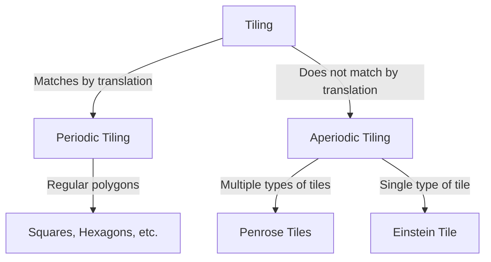

In the world of mathematics, there are unsolved problems that seem simple at first glance but have puzzled mathematicians for centuries. The problem of "tiling" (tessellation) is one of them, having a profound impact beyond pure geometry into physics and materials science. In this article, we delve into the history of aperiodic tiling and the paradigm shift it brought to crystallography.

## Basics of the Tiling Problem

Covering a plane with geometric shapes without gaps or overlaps is called "tiling." The simplest examples are "periodic" tilings using squares or equilateral triangles, where a pattern repeats infinitely by translating in specific directions.

## Exploring Aperiodic Tiling

In 1961, mathematician Hao Wang introduced "Wang tiles," sparking discussions about the possibility of aperiodic tiling. Later in the 1970s, Roger Penrose discovered "Penrose tiles," which use only two shapes (kite and dart) to cover a plane entirely aperiodically. This discovery possessed astonishing mathematical properties, such as local isomorphism and the ubiquitous presence of the golden ratio.

## A Paradigm Shift in Crystallography: Discovery of Quasicrystals

For a long time, Penrose tiles were considered a mathematical curiosity. However, in 1982, Dan Shechtman discovered a diffraction pattern exhibiting "10-fold symmetry" in an aluminum-manganese alloy. This symmetry, impossible in periodic structures, perfectly matched the structure of 3D aperiodic tiling. For his discovery of "quasicrystals," Shechtman was awarded the Nobel Prize in Chemistry in 2011.

## The Einstein Problem and the 2023 Breakthrough

Following Penrose's discovery, a new question arose: "Can a single shape tile the plane only aperiodically?" This became known as the "Einstein problem" (from the German "ein stein," meaning one stone). It remained unsolved for decades until 2023, when a team including David Smith discovered a 13-sided tile called "The Hat." A few months later, they also discovered "The Spectre," a tile that achieves this without requiring mirror reflections, making history in geometry.

These mathematical discoveries are more than just puzzles; they hold the potential for the development of new metamaterials and novel physical properties.
