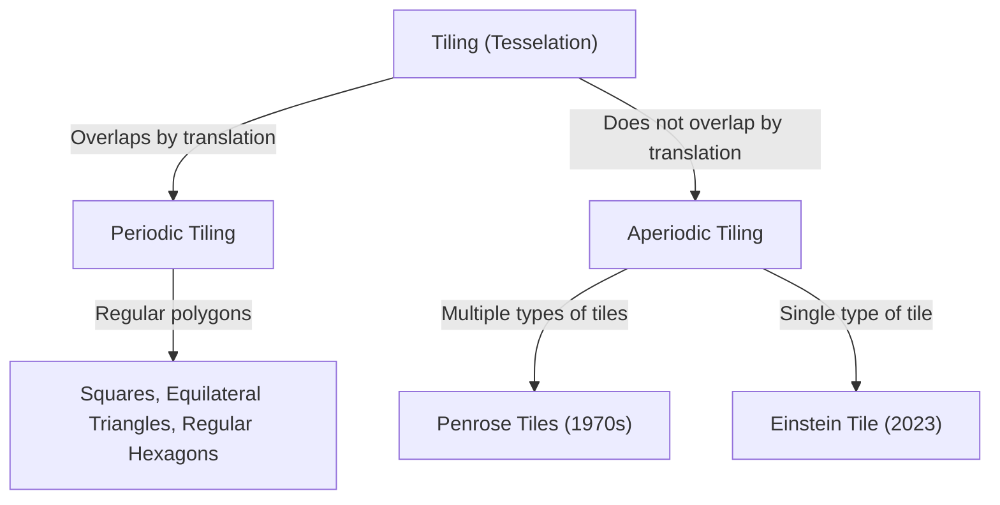
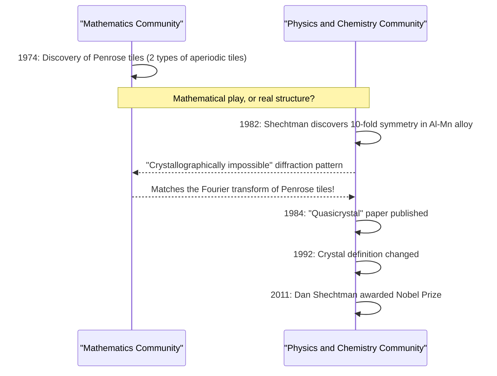

In the world of mathematics, there are many unsolved problems that, while seemingly simple at first glance, have continued to puzzle the minds of mathematicians for centuries. Among them, problems related to "Tesselation" or "Tiling" have transcended the boundaries of pure geometry and have had a profound impact on physics, materials science, and even art.

In this article, we will delve deeply into the grand narrative where mathematics and crystallography intersect, starting from the basics of aperiodic tiling, to the "Penrose tiles" by Roger Penrose, the discovery of "quasicrystals" that led to Dan Shechtman's Nobel Prize, and the discovery of the "Einstein tile" (aperiodic monotile) that surprised the world in 2023.

## 1. Basics of the Tiling Problem and Periodicity

Filling a plane with shapes without gaps and overlaps is called "tiling". The simplest examples are tilings with squares, equilateral triangles, and regular hexagons. These are called "periodic" tilings, where a certain pattern repeats infinitely by translating in a specific direction.

### Periodicity and Symmetry

In crystallography, it has long been believed that the arrangement of atoms filling space is "periodic". Periodic structures can have 2-fold, 3-fold, 4-fold, or 6-fold rotational symmetry, but it has been mathematically proven that periodic structures with **5-fold symmetry** or **8-fold or higher symmetry** are impossible (crystallographic restriction theorem).



## 2. Exploration of Aperiodic Tiling: Wang Tiles

In 1961, mathematician Hao Wang devised square tiles with colored edges, known as "Wang tiles". He conjectured that "if any set of tiles can tile the plane, it can tile the plane periodically." However, his student Robert Berger overturned this conjecture in 1966, discovering a set of tiles (initially 20,426, later reduced to 104) that can tile the plane **"only aperiodically"**.

## 3. The Impact of Penrose Tiles

In the 1970s, Roger Penrose, a British physicist and mathematician (and 2020 Nobel Prize laureate in Physics), successfully reduced the number of types of tiles required for aperiodic tiling dramatically. He discovered "Penrose tiles", which can tile the plane only aperiodically using just **two types** of tiles (a "kite" and a "dart", or two types of rhombuses).

### Mathematical Properties

Penrose tiles possess the following astonishing properties:
1. **Aperiodicity**: No matter how large an area you cut out and translate, it will never perfectly overlap with the original pattern.
2. **Local Isomorphism**: Any finite-sized pattern appears infinitely many times everywhere in the infinite tiling.
3. **Golden Ratio**: The golden ratio $\phi = \frac{1 + \sqrt{5}}{2}$ appears everywhere, such as in the ratio of the two types of tiles and the area ratio of the patterns.

$$ \lim_{R \to \infty} \frac{N_{kite}(R)}{N_{dart}(R)} = \phi \approx 1.618 $$

### A Simple Conceptual Fractal Generation in Python

Penrose tiles can be generated recursively using "inflation rules". Below is a conceptual example of recursive subdivision using Python.

```python
import matplotlib.pyplot as plt
import numpy as np

# Golden ratio
PHI = (1 + np.sqrt(5)) / 2

class Triangle:
    def __init__(self, color, p1, p2, p3):
        self.color = color
        self.p1 = p1
        self.p2 = p2
        self.p3 = p3

def inflate(triangles):
    new_triangles = []
    for t in triangles:
        if t.color == 0: # Half-kite
            # Subdivision calculation (conceptual)
            p4 = t.p1 + (t.p2 - t.p1) / PHI
            new_triangles.append(Triangle(1, p4, t.p3, t.p1))
            new_triangles.append(Triangle(0, t.p2, t.p3, p4))
        else: # Half-dart
            p4 = t.p1 + (t.p2 - t.p1) / PHI
            p5 = t.p3 + (t.p2 - t.p3) / PHI
            new_triangles.append(Triangle(1, p4, p5, t.p1))
            # Omitted for simplicity
    return new_triangles

# Implementation of drawing process is omitted, but
# an infinite aperiodic pattern can be generated by such recursive subdivision (inflation).
```

## 4. Paradigm Shift in Crystallography: The Discovery of Quasicrystals

Penrose tiles were long considered "mathematical toys". However, in 1982, Israeli materials scientist Dan Shechtman discovered something unbelievable while observing the electron diffraction pattern of an aluminum-manganese alloy.

It was a material that **"exhibited 10-fold symmetry (a symmetry impossible in periodic structures) while having clear diffraction spots (indicating high orderliness)"**.

### Backlash from the Scientific Community and the Nobel Prize

According to the common sense of crystallography at the time, crystals were defined as having a periodic atomic arrangement. The state of being "aperiodic yet highly ordered" was thought to be a contradiction, so Shechtman's discovery was initially fiercely criticized as an experimental error, such as double diffraction. Even great chemists like Linus Pauling ridiculed it, saying, "There is no such thing as quasicrystals, only quasi-scientists."

However, subsequent detailed research proved that Shechtman's discovery was genuine. The atomic arrangement of this material had exactly the same mathematical structure as 3D Penrose tiles (aperiodic tiling). This material was named **"Quasicrystal"**, and the International Union of Crystallography was forced to change the definition of a crystal from "periodicity" to "having a discrete diffraction pattern" in 1992. For this achievement, Shechtman was awarded the Nobel Prize in Chemistry in 2011.



## 5. The Einstein Problem: The Pursuit of the Aperiodic Monotile

Penrose tiles showed that aperiodic tiling is possible with "two types" of tiles. Mathematicians then harbored the next ultimate question.

**"Is it possible to tile the plane only aperiodically using just a single type of tile?"**

Named after "ein stein", meaning "one stone" in German, this problem came to be known as the **"Einstein problem"**, and the hypothetical tile that met its conditions was called the "Einstein tile".

Many mathematicians tackled this problem over several decades, but it remained unsolved. Although there were shapes like the Taylor-Socolar hexagonal tile (1999), they required adjacency rules or markings. A polygon that could act as an Einstein based purely on its shape remained undiscovered for a long time.

## 6. The 2023 Breakthrough: "The Hat" and "The Spectre"

Then, in March 2023, astonishing news traveled around the world. A research team consisting of amateur mathematics enthusiast David Smith, along with Craig Kaplan, Joseph Myers, and Chaim Goodman-Strauss, proved that a 13-sided single tile called **"The Hat"** was an Einstein.

### Geometry of "The Hat" Tile

The hat tile has a shape like an arrangement of eight "kites" based on a regular hexagon (a polykite). This tile can completely tile the plane only aperiodically, provided reflections (mirror images) are allowed.

$$ \text{Hat Tile} = 8 \times \text{Kites from a Hexagon} $$

### The Strict Chiral Aperiodic Monotile "The Spectre"

While the discovery of "The Hat" alone was a historical achievement, some mathematicians pointed out, "Isn't allowing mirror images (reflections) practically the same as using two types of tiles?"

In response, just a few months later in May 2023, the same research team announced a new tile called **"The Spectre"**. The Spectre is a "strict aperiodic monotile" that achieves aperiodic tiling purely through translations and rotations, without using any mirror images (no reflections). With this, the decades-old "Einstein problem" was completely resolved.

## 7. Conclusion: The Future Opened by Geometry

From Hao Wang's conjecture to Penrose's intuition, Shechtman's unyielding spirit, and the latest breakthrough by Smith and others, the history of aperiodic tiling has been a continuous series of overturning what was thought to be "impossible".

These mathematical discoveries are not just puzzles. Quasicrystals are already being applied in frying pan coatings, surgical scalpels, and improving LED efficiency. The newly discovered "Hat" and "Spectre" also hold the potential to lead to the design of new metamaterials and the development of new materials with unknown physical properties in the future.

How does the abstract pursuit of mathematics deeply connect with the physical real world and rewrite our understanding of the universe? The story of aperiodic tiling is perhaps one of its most beautiful and powerful proofs.
