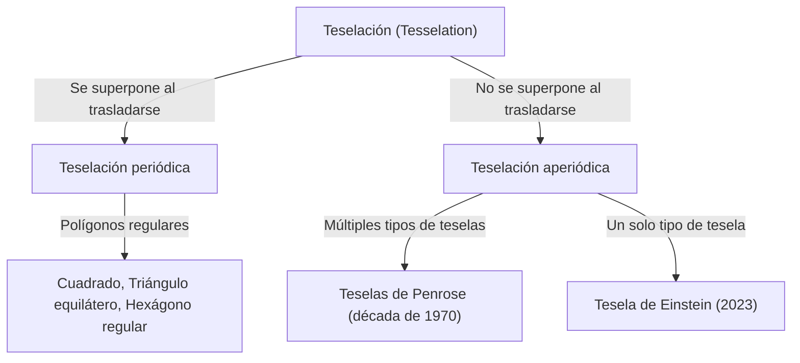
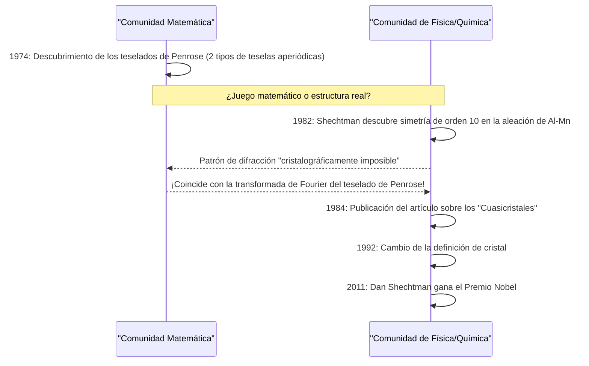

En el mundo de las matemáticas, existen muchos problemas no resueltos que, a primera vista, parecen simples pero han desconcertado a las mentes matemáticas durante siglos. Entre ellos, el problema de la "Teselación" (o Tesselation) ha trascendido los límites de la geometría pura y ha influido profundamente en la física, la ciencia de los materiales e incluso en el arte.

En este artículo, exploraremos la gran historia donde se cruzan las matemáticas y la cristalografía, comenzando con los fundamentos de las teselaciones aperiódicas, el "Teselado de Penrose" de Roger Penrose, el descubrimiento de los "cuasicristales" que llevó al Premio Nobel a Dan Shechtman, y el descubrimiento del "Teselado de Einstein" (monoteselado aperiódico) que sorprendió al mundo en 2023.

## 1. Fundamentos de los problemas de teselación y la periodicidad

El proceso de cubrir un plano completamente con formas geométricas, sin espacios ni superposiciones, se llama "teselación". Los ejemplos más simples son las teselaciones con cuadrados, triángulos equiláteros y hexágonos regulares. Estas se denominan teselaciones "periódicas", donde un patrón se repite infinitamente trasladándose en una dirección específica.

### Periodicidad y simetría

En cristalografía, se creyó durante mucho tiempo que la disposición de los átomos que llenan el espacio es "periódica". Las estructuras periódicas pueden tener simetría rotacional de orden 2, 3, 4 o 6, pero se ha demostrado matemáticamente que es imposible que las estructuras periódicas tengan **simetría de orden 5** o **simetría de orden 8 o superior** (teorema de restricción cristalográfica).



## 2. La exploración de las teselaciones aperiódicas: Teselas de Wang

En 1961, el matemático Hao Wang ideó cuadrados con bordes de colores llamados "teselas de Wang". Él predijo: "Si cualquier conjunto de teselas puede cubrir el plano, entonces es posible una teselación periódica". Sin embargo, su estudiante Robert Berger refutó esta conjetura en 1966 y descubrió un conjunto de teselas que solo podían cubrir el plano **"aperiódicamente"** (inicialmente 20.426, luego reducidas a 104).

## 3. El impacto del teselado de Penrose

En la década de 1970, el físico y matemático británico Roger Penrose (ganador del Premio Nobel de Física en 2020) redujo drásticamente los tipos de teselas necesarios para una teselación aperiódica. Descubrió el "Teselado de Penrose", que puede cubrir el plano solo de forma aperiódica utilizando solo **2 tipos** de teselas (el "cometa" y el "dardo", o dos tipos de rombos).

### Propiedades matemáticas

El Teselado de Penrose tiene las siguientes propiedades asombrosas:
1. **Aperiodicidad**: No importa qué tan grande sea un área que cortes y traslades, nunca se superpondrá perfectamente con el patrón original.
2. **Isomorfismo local**: Cualquier patrón de tamaño finito aparece un número infinito de veces en todo el teselado infinito.
3. **Proporción áurea**: La proporción áurea $\phi = \frac{1 + \sqrt{5}}{2}$ aparece en todas partes, como la proporción de los dos tipos de teselas o la proporción de área de los patrones.

$$ \lim_{R \to \infty} \frac{N_{kite}(R)}{N_{dart}(R)} = \phi \approx 1.618 $$

### Concepto de generación de fractales simples en Python

El Teselado de Penrose se puede generar de forma recursiva usando "reglas de inflación". A continuación, se muestra un ejemplo conceptual de partición recursiva usando Python.

```python
import matplotlib.pyplot as plt
import numpy as np

# Proporción áurea
PHI = (1 + np.sqrt(5)) / 2

class Triangle:
    def __init__(self, color, p1, p2, p3):
        self.color = color
        self.p1 = p1
        self.p2 = p2
        self.p3 = p3

def inflate(triangles):
    new_triangles = []
    for t in triangles:
        if t.color == 0: # Medio cometa
            # Cálculo de partición (conceptual)
            p4 = t.p1 + (t.p2 - t.p1) / PHI
            new_triangles.append(Triangle(1, p4, t.p3, t.p1))
            new_triangles.append(Triangle(0, t.p2, t.p3, p4))
        else: # Medio dardo
            p4 = t.p1 + (t.p2 - t.p1) / PHI
            p5 = t.p3 + (t.p2 - t.p3) / PHI
            new_triangles.append(Triangle(1, p4, p5, t.p1))
            # Omitido parcialmente para simplificar
    return new_triangles

# Se omite la implementación del dibujo, pero 
# mediante esta división recursiva (inflación), se puede generar un patrón aperiódico infinito.
```

## 4. Cambio de paradigma en cristalografía: el descubrimiento de los cuasicristales

El Teselado de Penrose fue considerado durante mucho tiempo un "juguete matemático". Sin embargo, en 1982, el científico de materiales israelí Dan Shechtman descubrió algo increíble mientras observaba los patrones de difracción de electrones de una aleación de aluminio y manganeso.

Era un material que **"tenía puntos de difracción claros (que indican un orden elevado) pero mostraba simetría de orden 10 (una simetría imposible en estructuras periódicas)"**.

### Reacción violenta de la comunidad científica y el Premio Nobel

En el sentido común de la cristalografía de la época, se definía que los cristales tenían disposiciones atómicas periódicas. Un estado que es "aperiódico pero altamente ordenado" se consideraba contradictorio, por lo que el descubrimiento de Shechtman fue inicialmente muy criticado como un error experimental, como la doble difracción. Incluso grandes químicos como Linus Pauling se burlaron: "No existen los cuasicristales, solo hay cuasicientíficos".

Sin embargo, estudios detallados posteriores demostraron que el descubrimiento de Shechtman era real. La disposición atómica de esta materia tenía exactamente la misma estructura matemática que el Teselado de Penrose 3D (teselación aperiódica). Este material fue nombrado **"Cuasicristal" (Quasicrystal)**, y en 1992 la Unión Internacional de Cristalografía se vio obligada a cambiar la definición de un cristal de "periodicidad" a "aquel que muestra un patrón de difracción discreto". Shechtman ganó el Premio Nobel de Química en 2011 por este logro.



## 5. El problema de Einstein: la búsqueda de monoteselados aperiódicos

El Teselado de Penrose demostró que una teselación aperiódica es posible con "dos tipos" de teselas. Por lo tanto, los matemáticos tenían la siguiente pregunta fundamental.

**"¿Es posible cubrir el plano solo aperiódicamente con solo un tipo de tesela?"**

Llamado el **"Problema de Einstein"** en honor a la palabra alemana para "una piedra" ("ein stein"), a la hipotética tesela que cumple esta condición se la llamó "Tesela de Einstein".

Durante décadas, muchos matemáticos abordaron este problema, pero no se alcanzó ninguna solución. Existía el hexágono de Taylor-Socolar (1999), pero requería restricciones debidas a reglas de adyacencia y patrones. Un polígono que por su pura forma es un Einstein permaneció sin descubrir durante mucho tiempo.

## 6. El avance de 2023: el "Sombrero" y el "Espectro"

En marzo de 2023, una noticia asombrosa dio la vuelta al mundo. Un equipo de investigadores formado por el aficionado a las matemáticas David Smith, y Craig Kaplan, Joseph Myers y Chaim Goodman-Strauss demostró que un único polígono de 13 lados llamado **"El Sombrero" (The Hat)** es un Einstein.

### La geometría de la tesela "El Sombrero" (The Hat)

La tesela sombrero tiene forma de "policometa", como una combinación de ocho "cometas" con un hexágono regular en la base. Esta tesela puede cubrir el plano por completo solo de forma aperiódica, permitiendo su imagen reflejada (la forma invertida).

$$ \text{Hat Tile} = 8 \times \text{Kites from a Hexagon} $$

### El monoteselado aperiódico quiral estricto "El Espectro"

El descubrimiento del "Sombrero" por sí solo fue un logro histórico, pero algunos matemáticos señalaron: "¿No es permitir imágenes reflejadas (inversiones) esencialmente lo mismo que usar dos tipos de teselas?".

En respuesta, el mismo equipo de investigación anunció una nueva tesela llamada **"El Espectro" (The Spectre)** unos meses después, en mayo de 2023. El Espectro es un "monoteselado aperiódico estricto" que logra una teselación aperiódica solo con traslación y rotación, sin usar ninguna imagen reflejada (sin inversiones). Así, el "Problema de Einstein" de décadas de antigüedad fue resuelto por completo.

## 7. Conclusión: El futuro abierto por la geometría

Comenzando con la conjetura de Hao Wang, la intuición de Penrose, el espíritu indomable de Shechtman y el último avance de Smith y otros, la historia de las teselaciones aperiódicas ha sido una serie de inversiones de lo que se pensaba "imposible".

Estos descubrimientos matemáticos no son solo rompecabezas. Los cuasicristales ya se aplican en recubrimientos de sartenes, bisturíes quirúrgicos y en la mejora de la eficiencia de los LED. El "Sombrero" y el "Espectro" recientemente descubiertos también tienen el potencial de conducir al diseño de nuevos metamateriales y al desarrollo de nuevos materiales con propiedades físicas desconocidas en el futuro.

Cómo las exploraciones matemáticas abstractas pueden estar profundamente conectadas con el mundo físico y reescribir nuestra comprensión del universo. La historia de las teselaciones aperiódicas es quizás una de las pruebas más bellas y poderosas de eso.
