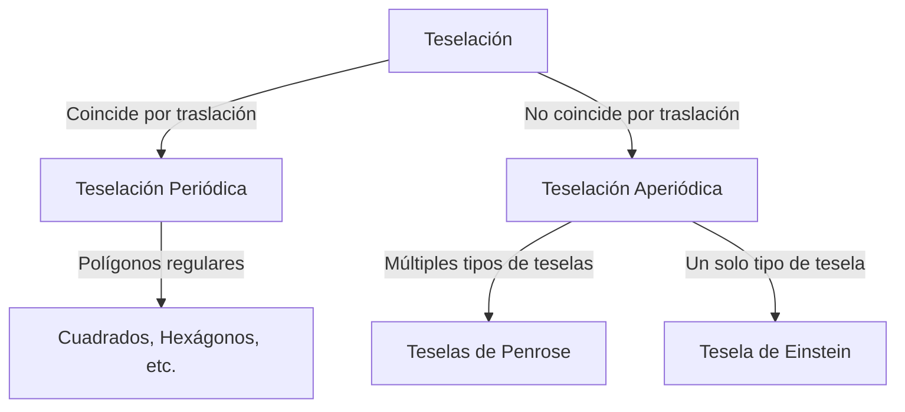

En el mundo de las matemáticas, existen problemas no resueltos que a primera vista parecen simples, pero que han desconcertado a los matemáticos durante siglos. El problema de la "teselación" (o recubrimiento) es uno de ellos, con un impacto profundo más allá de la geometría pura, llegando a la física y la ciencia de los materiales.

## Conceptos básicos del problema de teselación

Cubrir un plano con formas geométricas sin dejar huecos ni superposiciones se llama "teselación". Los ejemplos más simples son las teselaciones "periódicas", donde un patrón se repite infinitamente al trasladarse en direcciones específicas.

## Explorando la Teselación Aperiódica

En 1961, Hao Wang introdujo los "teselados de Wang". Más tarde, en los años 70, Roger Penrose descubrió que con solo dos formas se puede cubrir un plano de forma completamente aperiódica.

## Cambio de Paradigma en la Cristalografía

En 1982, Dan Shechtman descubrió los cuasicristales, ganando el Premio Nobel de Química en 2011, demostrando que estructuras ordenadas pero no periódicas existen en la naturaleza.

## El Problema de Einstein y el Avance de 2023

En 2023, David Smith y su equipo resolvieron el "problema de Einstein" al descubrir "El Sombrero" (The Hat), una sola tesela que cubre el plano aperiódicamente.

Estos descubrimientos abren la puerta a nuevos metamateriales y aplicaciones prácticas.
