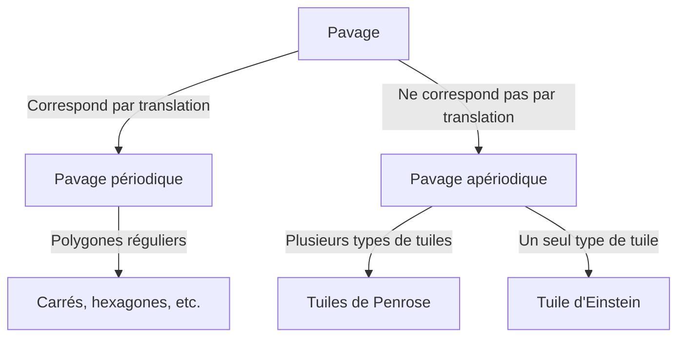

Dans le monde des mathématiques, il existe des problèmes non résolus qui semblent simples à première vue. Le problème du "pavage" (tessellation) en fait partie et a un impact profond bien au-delà de la géométrie pure, touchant la physique et la science des matériaux.

## Bases du pavage

Couvrir un plan avec des formes géométriques sans espaces ni chevauchements est appelé "pavage". Les exemples les plus simples sont les pavages "périodiques".

## Pavage Apériodique et Quasi-cristaux

Dans les années 1970, Roger Penrose a découvert les tuiles apériodiques. En 1982, Dan Shechtman a découvert les quasi-cristaux (Prix Nobel 2011).

## Le problème d'Einstein (2023)

En 2023, l'équipe de David Smith a découvert "The Hat" (Le Chapeau), résolvant le problème d'Einstein : une seule tuile pavant le plan de façon apériodique.
