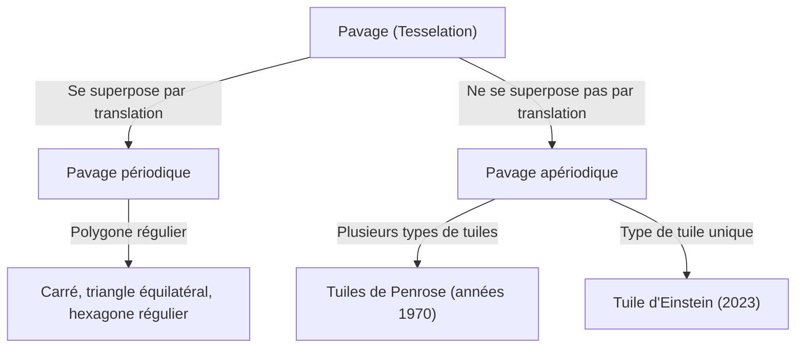
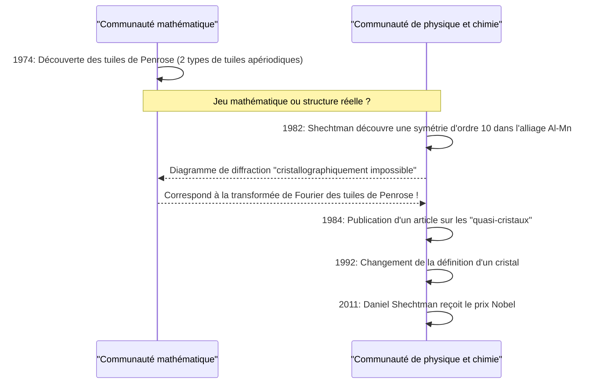

Dans le monde des mathématiques, il existe de nombreux problèmes non résolus, d'apparence simple, qui ont déconcerté l'esprit des mathématiciens pendant des siècles. Parmi eux, le problème du « pavage » (Tesselation / Tiling) a transcendé le cadre de la géométrie pure pour influencer profondément la physique, la science des matériaux et même l'art.

Dans cet article, nous explorerons en profondeur l'histoire épique à la croisée des mathématiques et de la cristallographie, en commençant par les bases du pavage apériodique, la découverte de la « tuile de Penrose » par Roger Penrose, la découverte des « quasi-cristaux » qui a valu le prix Nobel à Daniel Shechtman, et enfin la découverte en 2023 de la « tuile d'Einstein » (monotuile apériodique) qui a surpris le monde entier.

## 1. Les bases du problème de pavage et la périodicité

Remplir un plan avec des formes sans laisser d'espaces et sans chevauchement est appelé un « pavage ». Les exemples les plus simples sont les pavages avec des carrés, des triangles équilatéraux et des hexagones réguliers. Ceux-ci sont appelés pavages « périodiques », car un certain motif se répète à l'infini par translation dans des directions spécifiques.

### Périodicité et symétrie

En cristallographie, on a longtemps cru que la disposition des atomes remplissant l'espace était « périodique ». Bien qu'une structure périodique puisse avoir une symétrie de rotation d'ordre 2, 3, 4 ou 6, il a été prouvé mathématiquement qu'il est impossible qu'une structure périodique possède une **symétrie d'ordre 5** ou **d'ordre 8 ou plus** (théorème de restriction cristallographique).



## 2. L'exploration du pavage apériodique : les tuiles de Wang

En 1961, le mathématicien Hao Wang a inventé des tuiles carrées aux bords colorés, appelées « tuiles de Wang ». Il a conjecturé que « si un ensemble quelconque de tuiles peut paver le plan, alors un pavage périodique est possible ». Cependant, son étudiant Robert Berger a réfuté cette conjecture en 1966 en découvrant un ensemble de tuiles (initialement 20 426, réduit par la suite à 104) qui ne peuvent paver le plan que **« de manière apériodique »**.

## 3. L'impact des tuiles de Penrose

Dans les années 1970, le physicien et mathématicien britannique Roger Penrose (lauréat du prix Nobel de physique en 2020) a réussi à réduire considérablement le nombre de types de tuiles nécessaires pour un pavage apériodique. Il a découvert les « tuiles de Penrose », qui peuvent paver le plan uniquement de manière apériodique en utilisant seulement **deux types** de tuiles (le « cerf-volant » et la « fléchette », ou deux types de losanges).

### Propriétés mathématiques

Les tuiles de Penrose possèdent des propriétés étonnantes :
1. **Apériodicité** : Quelle que soit la taille de la zone découpée et translatée, elle ne se superposera jamais parfaitement avec le motif original.
2. **Isomorphisme local** : Tout motif de taille finie apparaît une infinité de fois partout dans le pavage infini.
3. **Nombre d'or** : Le nombre d'or $\phi = \frac{1 + \sqrt{5}}{2}$ apparaît partout, comme dans le rapport entre les deux types de tuiles ou le rapport de surface des motifs.

$$ \lim_{R \to \infty} \frac{N_{kite}(R)}{N_{dart}(R)} = \phi \approx 1.618 $$

### Concept simple de génération de fractales en Python

Les tuiles de Penrose peuvent être générées de manière récursive en utilisant des « règles d'inflation ». Voici un exemple conceptuel de subdivision récursive à l'aide de Python.

```python
import matplotlib.pyplot as plt
import numpy as np

# Nombre d'or
PHI = (1 + np.sqrt(5)) / 2

class Triangle:
    def __init__(self, color, p1, p2, p3):
        self.color = color
        self.p1 = p1
        self.p2 = p2
        self.p3 = p3

def inflate(triangles):
    new_triangles = []
    for t in triangles:
        if t.color == 0: # Demi-cerf-volant
            # Calcul de la division (concept)
            p4 = t.p1 + (t.p2 - t.p1) / PHI
            new_triangles.append(Triangle(1, p4, t.p3, t.p1))
            new_triangles.append(Triangle(0, t.p2, t.p3, p4))
        else: # Demi-fléchette
            p4 = t.p1 + (t.p2 - t.p1) / PHI
            p5 = t.p3 + (t.p2 - t.p3) / PHI
            new_triangles.append(Triangle(1, p4, p5, t.p1))
            # Omis en partie pour simplification
    return new_triangles

# L'implémentation du dessin est omise,
# mais un modèle apériodique infini peut être généré par cette division récursive (inflation).
```

## 4. Changement de paradigme en cristallographie : la découverte des quasi-cristaux

Les tuiles de Penrose ont longtemps été considérées comme des « jouets mathématiques ». Cependant, en 1982, le scientifique des matériaux israélien Daniel Shechtman a découvert quelque chose d'incroyable en observant le diagramme de diffraction des électrons d'un alliage d'aluminium et de manganèse.

Il s'agissait d'une matière **« présentant des taches de diffraction claires (indiquant un degré élevé d'ordre), tout en montrant une symétrie d'ordre 10 (une symétrie impossible pour une structure périodique) »**.

### Opposition de la communauté scientifique et prix Nobel

Selon le sens commun de la cristallographie de l'époque, un cristal était défini comme ayant une disposition périodique des atomes. Étant donné que l'état « d'être apériodique tout en ayant un ordre élevé » était considéré comme contradictoire, la découverte de Shechtman a d'abord été vivement critiquée comme étant une erreur expérimentale telle qu'une double diffraction. Même de grands chimistes comme Linus Pauling s'en sont moqués, déclarant : « Les quasi-cristaux n'existent pas, il n'y a que des quasi-scientifiques. »

Cependant, des études détaillées ultérieures ont prouvé que la découverte de Shechtman était authentique. La disposition atomique de ce matériau avait exactement la même structure mathématique que les tuiles de Penrose (pavage apériodique) en 3D. Ce matériau a été nommé **« quasi-cristal (Quasicrystal) »**, et l'Union internationale de cristallographie a été contrainte de modifier la définition d'un cristal en 1992, passant de la « périodicité » à « la capacité de produire un diagramme de diffraction discret ». Shechtman a reçu le prix Nobel de chimie en 2011 pour cette réalisation.



## 5. Le problème d'Einstein : la quête d'une monotuile apériodique

Avec les tuiles de Penrose, il a été démontré qu'un pavage apériodique était possible avec « deux types » de tuiles. Les mathématiciens se sont alors posé la question ultime suivante :

**« Est-il possible de paver le plan de manière apériodique avec un seul type de tuile ? »**

Surnommé d'après "ein stein", qui signifie "une pierre" en allemand, ce problème a été appelé le **« problème d'Einstein »**, et la tuile hypothétique qui satisferait à cette condition a été appelée la « tuile d'Einstein ».

Pendant des décennies, de nombreux mathématiciens se sont attaqués à ce problème, mais il est resté sans solution. Il y avait des formes comme l'hexagone de Taylor-Socolar (1999), mais elles nécessitaient des règles de contiguïté ou des contraintes de motif. Un polygone qui serait un Einstein uniquement par sa forme est resté longtemps introuvable.

## 6. La percée de 2023 : « Le chapeau » et « Le spectre »

Puis, en mars 2023, une nouvelle étonnante a fait le tour du monde. Une équipe de chercheurs composée du passionné de mathématiques amateur David Smith, de Craig Kaplan, Joseph Myers et Chaim Goodman-Strauss a prouvé qu'une seule tuile à 13 côtés appelée **« Le chapeau (The Hat) »** était un Einstein.

### La géométrie de la tuile « Le chapeau (The Hat) »

La tuile chapeau a une forme (polycerf-volant) qui ressemble à une combinaison de 8 « cerfs-volants » basés sur un hexagone régulier. Cette tuile peut paver complètement le plan uniquement de manière apériodique, à condition d'inclure son image miroir (forme retournée).

$$ \text{Hat Tile} = 8 \times \text{Kites from a Hexagon} $$

### La monotuile apériodique chirale stricte « Le spectre (The Spectre) »

La découverte du « chapeau » était déjà un exploit historique en soi, mais certains mathématiciens ont fait remarquer que « tolérer les images miroirs (retournements) revient essentiellement à utiliser deux types de tuiles, n'est-ce pas ? »

En réponse à cela, la même équipe de recherche a annoncé une nouvelle tuile appelée **« Le spectre (The Spectre) »** quelques mois plus tard, en mai 2023. Le spectre est une « monotuile apériodique stricte » qui réalise un pavage apériodique purement par des translations et des rotations, sans utiliser d'images miroirs (sans retournement). Avec cela, le « problème d'Einstein » vieux de plusieurs décennies a été complètement résolu.

## 7. Conclusion : l'avenir ouvert par la géométrie

De la conjecture de Hao Wang à l'intuition de Penrose, en passant par l'esprit indomptable de Shechtman et la récente percée de Smith et de ses collègues, l'histoire du pavage apériodique a été une série de remises en cause de ce qui était considéré comme « impossible ».

Ces découvertes mathématiques ne se limitent pas à de simples énigmes. Les quasi-cristaux sont déjà appliqués dans les revêtements de poêles à frire, les scalpels chirurgicaux et pour améliorer l'efficacité des LED. Les tuiles « chapeau » et « spectre » récemment découvertes ont également le potentiel de conduire à la conception de nouveaux métamatériaux ou au développement de nouveaux matériaux aux propriétés physiques inconnues à l'avenir.

Comment l'exploration abstraite des mathématiques est profondément liée au monde physique réel et réécrit notre compréhension de l'univers. L'histoire du pavage apériodique en est peut-être l'une des preuves les plus belles et les plus puissantes.
