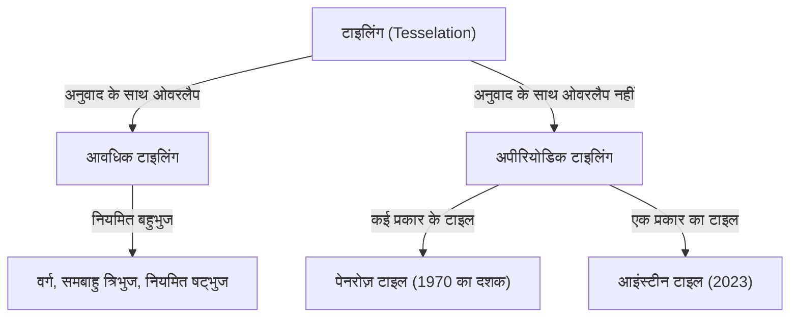
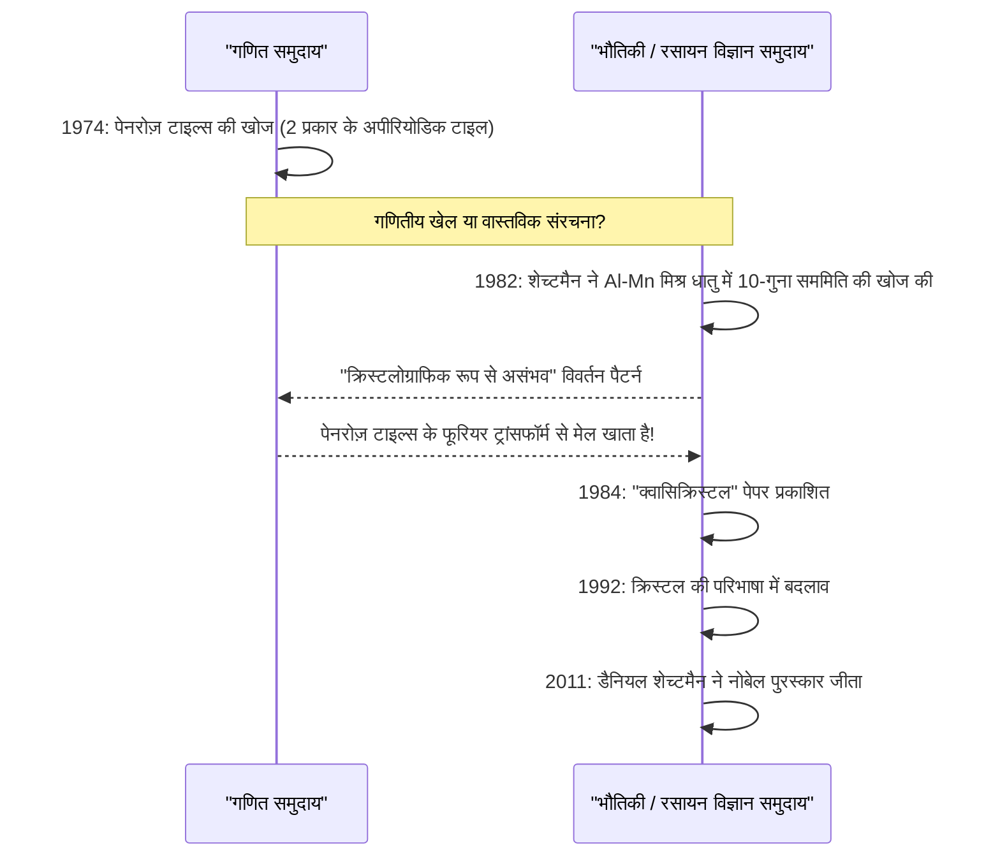

गणित की दुनिया में कई अनसुलझी समस्याएँ हैं जो पहली नज़र में सरल लगती हैं, लेकिन सदियों से गणितज्ञों के दिमाग को उलझाती रही हैं। उनमें से, "टाइलिंग (Tesselation / Tiling)" से संबंधित समस्याओं ने शुद्ध ज्यामिति की सीमाओं को पार कर लिया है और भौतिकी, सामग्री विज्ञान और यहां तक कि कला को भी गहराई से प्रभावित किया है।

इस लेख में, हम अपीरियोडिक टाइलिंग की मूल बातें से शुरू करेंगे, और रोजर पेनरोज़ के "पेनरोज़ टाइल्स", डैनियल शेच्टमैन की "क्वासिक्रिस्टल" की खोज जिसने उन्हें नोबेल पुरस्कार दिलाया, और 2023 में दुनिया को हैरान करने वाले "आइंस्टीन टाइल (अपीरियोडिक मोनोटाइल)" की खोज तक, गणित और क्रिस्टलोग्राफी के प्रतिच्छेदन की महाकाव्य कहानी में गहराई से उतरेंगे।

## 1. टाइलिंग समस्या के मूल सिद्धांत और आवधिकता (Periodicity)

एक समतल को बिना किसी अंतराल या ओवरलैप के आकृतियों से भरने को "टाइलिंग" कहा जाता है। सबसे सरल उदाहरण वर्ग, समबाहु त्रिभुज और नियमित षट्भुज के साथ टाइलिंग हैं। इन्हें "आवधिक (Periodic)" टाइलिंग कहा जाता है, जहां एक निश्चित पैटर्न एक विशिष्ट दिशा में अनुवाद (translation) करके असीम रूप से दोहराया जाता है।

### आवधिकता और सममिति (Symmetry)

क्रिस्टलोग्राफी में, अंतरिक्ष को भरने वाली परमाणुओं की व्यवस्था को लंबे समय तक "आवधिक" माना जाता रहा है। आवधिक संरचनाओं में 2-गुना, 3-गुना, 4-गुना, या 6-गुना घूर्णी सममिति हो सकती है, लेकिन यह गणितीय रूप से सिद्ध हो चुका है कि **5-गुना सममिति** या **8-गुना या उससे अधिक सममिति** वाली आवधिक संरचनाएं असंभव हैं (क्रिस्टलोग्राफिक प्रतिबंध प्रमेय)।



## 2. अपीरियोडिक टाइलिंग की खोज: वांग की टाइलें

1961 में, गणितज्ञ हाओ वांग ने रंगीन किनारों वाले वर्गाकार टाइल तैयार किए, जिन्हें "वांग टाइल्स" कहा जाता है। उन्होंने भविष्यवाणी की कि "यदि कोई भी टाइल सेट किसी समतल को भर सकता है, तो वह आवधिक टाइलिंग में सक्षम है।" हालाँकि, उनके छात्र रॉबर्ट बर्गर ने 1966 में इस धारणा को पलट दिया और टाइलों के एक सेट की खोज की (शुरुआत में 20,426, बाद में घटाकर 104 कर दिया गया) जो समतल को **"केवल अपीरियोडिक रूप से"** भर सकता है।

## 3. पेनरोज़ टाइल्स का प्रभाव

1970 के दशक में, ब्रिटिश भौतिक विज्ञानी और गणितज्ञ रोजर पेनरोज़ (2020 में भौतिकी के नोबेल पुरस्कार विजेता) अपीरियोडिक टाइलिंग के लिए आवश्यक टाइलों के प्रकारों को नाटकीय रूप से कम करने में सफल रहे। उन्होंने केवल **2 प्रकार** की टाइलों ("काइट (पतंग)" और "डार्ट (तीर)", या 2 प्रकार के समचतुर्भुज) का उपयोग करके "पेनरोज़ टाइल्स" की खोज की, जो समतल को केवल अपीरियोडिक रूप से भर सकते हैं।

### गणितीय गुण

पेनरोज़ टाइल्स में निम्नलिखित अद्भुत गुण हैं:
1. **अपीरियोडिसिटी (Aperiodicity)**: आप कितने भी बड़े क्षेत्र को काटें और उसका अनुवाद करें, यह मूल पैटर्न के साथ पूरी तरह से ओवरलैप नहीं होगा।
2. **स्थानीय समरूपता (Local Isomorphism)**: कोई भी परिमित आकार का पैटर्न असीम रूप से फैली हुई टाइलिंग के भीतर हर जगह असीम रूप से दिखाई देता है।
3. **स्वर्णिम अनुपात (Golden Ratio)**: स्वर्णिम अनुपात $\phi = \frac{1 + \sqrt{5}}{2}$ हर जगह दिखाई देता है, जैसे कि 2 प्रकार के टाइलों का अनुपात और पैटर्न का क्षेत्रफल अनुपात।

$$ \lim_{R \to \infty} \frac{N_{kite}(R)}{N_{dart}(R)} = \phi \approx 1.618 $$

### Python का उपयोग करके सरल फ्रैक्टल जनरेशन अवधारणा

पेनरोज़ टाइल्स को "मुद्रास्फीति नियम (Inflation Rule)" का उपयोग करके पुनरावर्ती रूप से उत्पन्न किया जा सकता है। नीचे Python का उपयोग करके वैचारिक पुनरावर्ती विभाजन का एक उदाहरण दिया गया है।

```python
import matplotlib.pyplot as plt
import numpy as np

# स्वर्णिम अनुपात
PHI = (1 + np.sqrt(5)) / 2

class Triangle:
    def __init__(self, color, p1, p2, p3):
        self.color = color
        self.p1 = p1
        self.p2 = p2
        self.p3 = p3

def inflate(triangles):
    new_triangles = []
    for t in triangles:
        if t.color == 0: # Half-kite
            # विभाजन गणना (अवधारणा)
            p4 = t.p1 + (t.p2 - t.p1) / PHI
            new_triangles.append(Triangle(1, p4, t.p3, t.p1))
            new_triangles.append(Triangle(0, t.p2, t.p3, p4))
        else: # Half-dart
            p4 = t.p1 + (t.p2 - t.p1) / PHI
            p5 = t.p3 + (t.p2 - t.p3) / PHI
            new_triangles.append(Triangle(1, p4, p5, t.p1))
            # सरलीकरण के लिए कुछ हिस्से छोड़े गए हैं
    return new_triangles

# चित्र बनाने आदि के कार्यान्वयन को छोड़ दिया गया है,
# लेकिन इस तरह के पुनरावर्ती विभाजन (मुद्रास्फीति) के माध्यम से अनंत अपीरियोडिक पैटर्न उत्पन्न किए जा सकते हैं।
```

## 4. क्रिस्टलोग्राफी का प्रतिमान बदलाव: क्वासिक्रिस्टल की खोज

पेनरोज़ टाइल्स को लंबे समय तक "गणितीय खिलौना" माना जाता था। लेकिन 1982 में, इज़राइली सामग्री वैज्ञानिक डैनियल शेच्टमैन ने एल्यूमीनियम और मैंगनीज मिश्र धातु के इलेक्ट्रॉन विवर्तन पैटर्न को देखते हुए कुछ अविश्वसनीय खोजा।

यह एक ऐसा पदार्थ था जिसमें **"स्पष्ट विवर्तन बिंदु (जो उच्च क्रमबद्धता दिखाते हैं) थे, फिर भी यह 10-गुना सममिति (एक सममिति जो आवधिक संरचनाओं में असंभव है) दिखा रहा था।"**

### वैज्ञानिक समुदाय से विरोध और नोबेल पुरस्कार

उस समय क्रिस्टलोग्राफी के सामान्य ज्ञान के अनुसार, क्रिस्टल को आवधिक परमाणु व्यवस्था वाले पदार्थ के रूप में परिभाषित किया गया था। "अपीरियोडिक होने के बावजूद उच्च क्रमबद्धता होना" विरोधाभासी माना जाता था, इसलिए शेच्टमैन की खोज की शुरुआत में दोहरे विवर्तन जैसी प्रायोगिक त्रुटियों के रूप में कड़ी आलोचना की गई थी। यहां तक कि लिनस पॉलिंग जैसे महान रसायनज्ञ ने भी यह कहकर उनका मज़ाक उड़ाया, "क्वासिक्रिस्टल जैसी कोई चीज़ नहीं होती, केवल क्वासी-वैज्ञानिक होते हैं।"

हालाँकि, बाद के विस्तृत शोध से साबित हुआ कि शेच्टमैन की खोज वास्तविक थी। इस पदार्थ की परमाणु व्यवस्था में 3D पेनरोज़ टाइल्स (अपीरियोडिक टाइलिंग) के समान ही गणितीय संरचना थी। इस पदार्थ को **"क्वासिक्रिस्टल (Quasicrystal)"** नाम दिया गया, और 1992 में अंतर्राष्ट्रीय क्रिस्टलोग्राफी संघ को क्रिस्टल की परिभाषा को "आवधिकता" से बदलकर "असतत विवर्तन आरेख दिखाने वाली चीज़" करने के लिए मजबूर होना पड़ा। इस उपलब्धि के लिए, शेच्टमैन को 2011 में रसायन विज्ञान में नोबेल पुरस्कार से सम्मानित किया गया।



## 5. आइंस्टीन समस्या: अपीरियोडिक मोनोटाइल की खोज

पेनरोज़ टाइल्स ने दिखाया कि "2 प्रकार" की टाइलों के साथ अपीरियोडिक टाइलिंग संभव है। इसने गणितज्ञों के मन में अगला अंतिम प्रश्न खड़ा कर दिया:

**"क्या केवल 1 प्रकार की टाइल के साथ समतल को केवल अपीरियोडिक रूप से भरना संभव है?"**

जर्मन में "ein stein" का अर्थ "एक पत्थर" होता है, इसी के नाम पर इस समस्या को **"आइंस्टीन समस्या"** कहा गया, और इस शर्त को पूरा करने वाले काल्पनिक टाइल को "आइंस्टीन टाइल" कहा जाने लगा।

दशकों तक, कई गणितज्ञों ने इस समस्या से निपटा, लेकिन कोई समाधान नहीं मिला। 1999 में टेलर-सोकोलार षट्भुज जैसी खोजें हुईं, लेकिन उनके लिए आसन्न नियमों या पैटर्न के माध्यम से प्रतिबंधों की आवश्यकता थी। एक बहुभुज जो अपने शुद्ध आकार के कारण आइंस्टीन टाइल बन सकता है, लंबे समय तक अज्ञात रहा।

## 6. 2023 की बड़ी सफलता: "हैट" और "स्पेक्टर"

और फिर मार्च 2023 में, एक चौंकाने वाली खबर दुनिया भर में फैल गई। शौकिया गणित प्रेमी डेविड स्मिथ और क्रेग कपलान, जोसेफ मायर्स और हैम गुडमैन-स्ट्रॉस की शोध टीम ने साबित कर दिया कि **"हैट (The Hat)"** नामक 13-तरफा एकल टाइल एक आइंस्टीन टाइल है।

### "हैट (The Hat)" टाइल की ज्यामिति

हैट टाइल का आकार एक "पॉलीकाइट" है, जो नियमित षट्भुज पर आधारित 8 "काइट (पतंग)" आकृतियों को जोड़कर बनाया गया है। यह टाइल, इसकी दर्पण छवि (उलटा रूप) सहित, समतल को केवल अपीरियोडिक रूप से पूरी तरह से भर सकती है।

$$ \text{Hat Tile} = 8 \times \text{Kites from a Hexagon} $$

### सख्त चिरल अपीरियोडिक मोनोटाइल "स्पेक्टर"

हालाँकि "हैट" की खोज ही एक ऐतिहासिक उपलब्धि थी, कुछ गणितज्ञों ने बताया कि, "क्या दर्पण छवि (परावर्तन) की अनुमति देना व्यावहारिक रूप से 2 प्रकार की टाइलों का उपयोग करने के समान नहीं है?"

इसके जवाब में, उसी शोध टीम ने कुछ ही महीनों बाद मई 2023 में एक नया टाइल पेश किया, जिसे **"स्पेक्टर (The Spectre)"** कहा गया। स्पेक्टर एक "सख्त अपीरियोडिक मोनोटाइल" है जो बिना किसी दर्पण छवि (बिना किसी परावर्तन) के, केवल अनुवाद और घूर्णन द्वारा अपीरियोडिक टाइलिंग प्राप्त करता है। इसके साथ, दशकों पुरानी "आइंस्टीन समस्या" पूरी तरह से हल हो गई थी।

## 7. निष्कर्ष: वह भविष्य जो ज्यामिति खोलती है

हाओ वांग की भविष्यवाणी से शुरू होकर, पेनरोज़ की अंतर्ज्ञान, शेच्टमैन की अदम्य भावना, और स्मिथ और अन्य लोगों द्वारा नवीनतम सफलताओं तक, अपीरियोडिक टाइलिंग का इतिहास उन चीजों की एक श्रृंखला रही है जिन्हें "असंभव" माना जाता था, लेकिन एक के बाद एक पलट दिया गया।

ये गणितीय खोजें सिर्फ पहेलियाँ नहीं हैं। क्वासिक्रिस्टल पहले से ही फ्राइंग पैन कोटिंग्स, सर्जिकल स्कैलपेल और एलईडी दक्षता में सुधार के लिए लागू किए गए हैं। नव खोजे गए "हैट" और "स्पेक्टर" में भी भविष्य में नए मेटामैटेरियल्स के डिजाइन और अज्ञात भौतिक गुणों वाले नए सामग्रियों के विकास की ओर ले जाने की क्षमता है।

गणित की अमूर्त खोज किस तरह भौतिक वास्तविक दुनिया से गहराई से जुड़ती है और ब्रह्मांड के बारे में हमारी समझ को फिर से लिखती है। अपीरियोडिक टाइलिंग की कहानी को इसका सबसे सुंदर और शक्तिशाली प्रमाण कहा जा सकता है。
