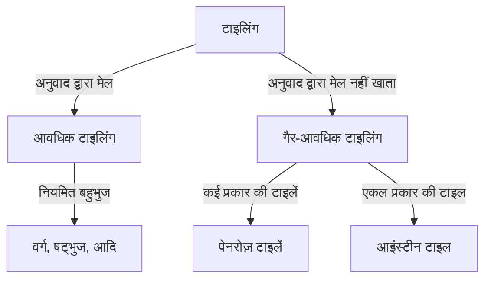

गणित की दुनिया में, कुछ अनसुलझी समस्याएं हैं जो पहली नज़र में सरल लगती हैं। "टाइलिंग" (Tessellation) की समस्या उनमें से एक है, जिसका शुद्ध ज्यामिति से परे भौतिकी और सामग्री विज्ञान पर गहरा प्रभाव है।

## टाइलिंग की मूल बातें

एक विमान को बिना गैप या ओवरलैप के ज्यामितीय आकृतियों के साथ कवर करना "टाइलिंग" कहलाता है।

## गैर-आवधिक टाइलिंग और क्वासिक्रिस्टल

रोजर पेनरोज़ ने 1970 के दशक में पेनरोज़ टाइल्स की खोज की। 1982 में, डैन शेचमैन ने क्वासिक्रिस्टल की खोज की (2011 का नोबेल पुरस्कार)।

## आइंस्टीन समस्या और 2023 की खोज

2023 में, डेविड स्मिथ और उनकी टीम द्वारा "द हैट" (एकल टाइल) की खोज के साथ "आइंस्टीन" समस्या का समाधान हो गया।
