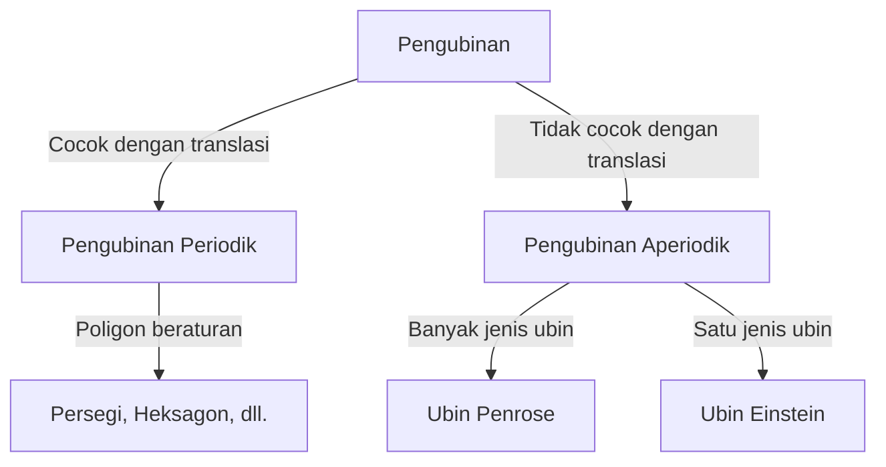

Di dunia matematika, ada masalah yang belum terpecahkan yang tampaknya sederhana pada pandangan pertama. Masalah "pengubinan" (tesselation) adalah salah satunya, memiliki dampak besar tidak hanya pada geometri tetapi juga pada fisika dan ilmu material.

## Dasar-dasar Pengubinan

Menutupi bidang dengan bentuk geometris tanpa celah atau tumpang tindih disebut "pengubinan". 

## Pengubinan Aperiodik dan Kuasikristal

Roger Penrose menemukan ubin Penrose pada 1970-an. Pada tahun 1982, Dan Shechtman menemukan kuasikristal, memenangkan Hadiah Nobel Kimia pada 2011.

## Masalah Einstein dan Terobosan 2023

Pada tahun 2023, masalah "Einstein" (satu ubin aperiodik) terpecahkan dengan penemuan ubin "Topi" (The Hat) oleh David Smith dan timnya.
