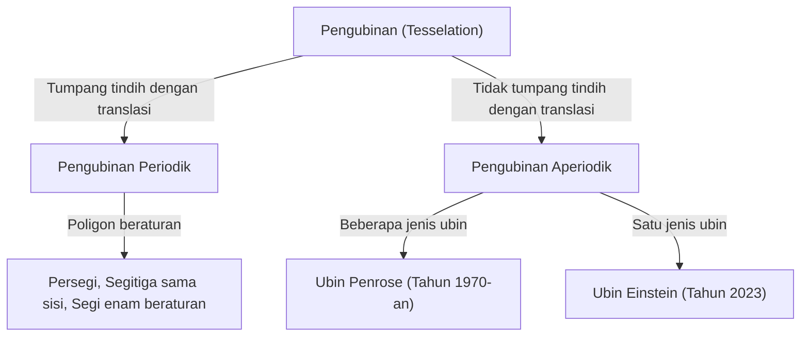
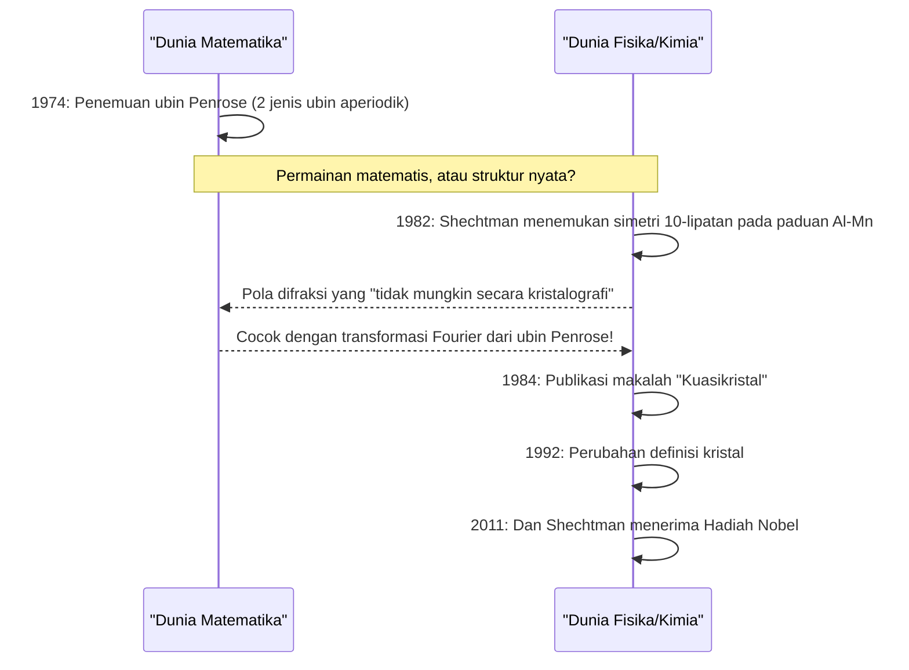

Di dunia matematika, terdapat banyak masalah tak terpecahkan yang sekilas tampak sederhana, namun telah membingungkan pemikir matematika selama berabad-abad. Di antaranya, masalah terkait "pengubinan (Tesselation / Tiling)" telah melampaui batas geometri murni dan memberikan dampak mendalam pada fisika, ilmu material, dan bahkan seni.

Pada artikel ini, kita akan menggali lebih dalam kisah epik di mana matematika dan kristalografi bersinggungan, dimulai dari dasar-dasar pengubinan aperiodik, "ubin Penrose" oleh Roger Penrose, penemuan "kuasikristal" yang berujung pada Hadiah Nobel bagi Dan Shechtman, hingga penemuan "ubin Einstein (monotile aperiodik)" yang mengejutkan dunia pada tahun 2023.

## 1. Dasar-dasar Masalah Pengubinan dan Periodisitas

Tindakan menutupi bidang datar dengan bangun datar tanpa celah atau tumpang tindih disebut "pengubinan". Contoh paling sederhana adalah pengubinan menggunakan persegi, segitiga sama sisi, dan segi enam beraturan. Ini disebut pengubinan "periodik", di mana suatu pola berulang tanpa batas dengan bergeser secara paralel ke arah tertentu.

### Periodisitas dan Simetri

Dalam kristalografi, susunan atom yang mengisi ruang telah lama diyakini bersifat "periodik". Struktur periodik dapat memiliki simetri rotasi 2, 3, 4, atau 6 lipatan, tetapi telah dibuktikan secara matematis bahwa struktur periodik dengan **simetri 5 lipatan** atau **simetri 8 lipatan atau lebih** adalah hal yang tidak mungkin (teorema pembatasan kristalografi).



## 2. Eksplorasi Pengubinan Aperiodik: Ubin Wang

Pada tahun 1961, matematikawan Hao Wang menemukan ubin persegi dengan tepi berwarna yang disebut "ubin Wang". Ia menduga, "Jika setiap kumpulan ubin dapat menutupi sebuah bidang, maka pengubinan periodik dapat dilakukan." Namun, muridnya Robert Berger membalikkan dugaan ini pada tahun 1966 dengan menemukan sekumpulan ubin (awalnya 20.426, kemudian dikurangi menjadi 104) yang dapat menutupi sebuah bidang **"hanya secara aperiodik"**.

## 3. Dampak Ubin Penrose

Pada tahun 1970-an, fisikawan dan matematikawan Inggris Roger Penrose (Pemenang Hadiah Nobel Fisika tahun 2020) berhasil secara dramatis mengurangi jumlah jenis ubin yang dibutuhkan untuk pengubinan aperiodik. Dengan hanya menggunakan **2 jenis** ubin ("Kite (Layang-layang)" dan "Dart (Panah)", atau 2 jenis belah ketupat), ia menemukan "ubin Penrose" yang dapat menutupi bidang hanya secara aperiodik.

### Sifat Matematis

Ubin Penrose memiliki sifat menakjubkan berikut:
1. **Aperiodisitas**: Seberapa besar area yang dipotong dan digeser, itu tidak akan pernah tumpang tindih secara sempurna dengan pola aslinya.
2. **Isomorfisme lokal**: Pola berukuran berhingga apa pun akan muncul tak terbatas di mana-mana dalam pengubinan tak berhingga.
3. **Rasio Emas**: Rasio emas $\phi = \frac{1 + \sqrt{5}}{2}$ muncul di mana-mana, termasuk dalam rasio 2 jenis ubin dan rasio area pola.

$$ \lim_{R \to \infty} \frac{N_{kite}(R)}{N_{dart}(R)} = \phi \approx 1.618 $$

### Konsep Pembuatan Fraktal Sederhana dengan Python

Ubin Penrose dapat dihasilkan secara rekursif menggunakan "aturan inflasi". Berikut adalah contoh pembagian rekursif konseptual menggunakan Python.

```python
import matplotlib.pyplot as plt
import numpy as np

# Rasio Emas
PHI = (1 + np.sqrt(5)) / 2

class Triangle:
    def __init__(self, color, p1, p2, p3):
        self.color = color
        self.p1 = p1
        self.p2 = p2
        self.p3 = p3

def inflate(triangles):
    new_triangles = []
    for t in triangles:
        if t.color == 0: # Half-kite
            # Perhitungan pembagian (konsep)
            p4 = t.p1 + (t.p2 - t.p1) / PHI
            new_triangles.append(Triangle(1, p4, t.p3, t.p1))
            new_triangles.append(Triangle(0, t.p2, t.p3, p4))
        else: # Half-dart
            p4 = t.p1 + (t.p2 - t.p1) / PHI
            p5 = t.p3 + (t.p2 - t.p3) / PHI
            new_triangles.append(Triangle(1, p4, p5, t.p1))
            # Dihilangkan sebagian untuk penyederhanaan
    return new_triangles
    
# Implementasi proses penggambaran dan lainnya dihilangkan,
# namun dengan pembagian rekursif ini (inflasi), pola aperiodik tak berhingga dapat dihasilkan.
```

## 4. Pergeseran Paradigma Kristalografi: Penemuan Kuasikristal

Ubin Penrose telah lama dianggap sebagai "mainan matematika". Namun, pada tahun 1982, ilmuwan material Israel Dan Shechtman menemukan sesuatu yang luar biasa saat mengamati pola difraksi elektron dari paduan aluminium dan mangan.

Itu adalah sebuah bahan yang **"memiliki titik difraksi yang jelas (menunjukkan keteraturan yang tinggi) sekaligus menunjukkan simetri 10 lipatan (simetri yang tidak mungkin ada dalam struktur periodik)"**.

### Penolakan dari Komunitas Sains dan Hadiah Nobel

Menurut pandangan umum kristalografi pada waktu itu, kristal didefinisikan memiliki susunan atom yang periodik. Keadaan "aperiodik namun memiliki keteraturan tinggi" dianggap saling bertentangan, sehingga penemuan Shechtman pada awalnya dikritik keras sebagai kesalahan eksperimen seperti difraksi ganda. Bahkan seorang ahli kimia hebat seperti Linus Pauling mencemooh, "Tidak ada kuasikristal, yang ada hanya ilmuwan kuasi."

Akan tetapi, penelitian terperinci selanjutnya membuktikan bahwa penemuan Shechtman adalah nyata. Susunan atom bahan ini memiliki struktur matematika yang persis sama dengan ubin Penrose 3 dimensi (pengubinan aperiodik). Bahan ini dinamakan **"Kuasikristal (Quasicrystal)"**, dan Serikat Kristalografi Internasional terpaksa mengubah definisi kristal dari "periodisitas" menjadi "hal yang menunjukkan pola difraksi diskrit" pada tahun 1992. Atas pencapaian ini, Shechtman menerima Hadiah Nobel Kimia pada tahun 2011.



## 5. Masalah Einstein: Pengejaran Monotile Aperiodik

Ubin Penrose menunjukkan bahwa pengubinan aperiodik mungkin dilakukan dengan "2 jenis" ubin. Oleh karena itu, para matematikawan memiliki pertanyaan pamungkas berikutnya.

**"Mungkinkah menutupi bidang datar hanya secara aperiodik dengan hanya 1 jenis ubin?"**

Dinamai dari "ein stein" yang berarti "satu batu" dalam bahasa Jerman, masalah ini dikenal sebagai **"Masalah Einstein"**, dan ubin fiktif yang memenuhi kondisi ini kemudian disebut "ubin Einstein".

Banyak matematikawan menantang masalah ini selama beberapa dekade, namun belum terpecahkan. Ada segi enam Taylor-Socolar (1999) dan lainnya, namun aturan atau pola yang berdekatan memerlukan batasan. Poligon yang menjadi Einstein berdasarkan bentuk murninya saja belum ditemukan untuk waktu yang lama.

## 6. Terobosan 2023: "Topi" dan "Spectre"

Lalu pada bulan Maret 2023, berita luar biasa menyebar ke seluruh dunia. Sebuah tim peneliti yang terdiri dari penggemar matematika amatir David Smith, Craig Kaplan, Joseph Myers, dan Chaim Goodman-Strauss membuktikan bahwa ubin tunggal berbentuk 13 sisi yang disebut **"Topi (The Hat)"** adalah Einstein.

### Geometri Ubin "Topi (The Hat)"

Ubin topi berbentuk seperti kombinasi dari 8 bangun "Kite (Layang-layang)" berbasis segi enam beraturan (polikite). Ubin ini dapat sepenuhnya menutupi bidang secara aperiodik saja, termasuk bayangan cerminnya (bentuk terbalik).

$$ \text{Hat Tile} = 8 \times \text{Kites from a Hexagon} $$

### Monotile Aperiodik Kiralitas Secara Ketat "Spectre"

Penemuan "Topi" saja sudah merupakan pencapaian bersejarah, tetapi beberapa matematikawan menunjuk, "Bukankah mengizinkan bayangan cermin (membalik) sama dengan menggunakan dua jenis ubin dalam praktiknya?"

Sebagai tanggapan atas hal ini, tim peneliti yang sama mengumumkan ubin baru yang disebut **"Spectre (The Spectre)"** hanya beberapa bulan kemudian pada bulan Mei 2023. Spectre adalah "monotile aperiodik yang ketat" yang mewujudkan pengubinan aperiodik murni dengan translasi dan rotasi saja, tanpa menggunakan bayangan cermin sama sekali (tanpa membalik). Dengan ini, "Masalah Einstein" yang bertahan selama beberapa dekade telah sepenuhnya terpecahkan.

## 7. Kesimpulan: Masa Depan yang Dibuka oleh Geometri

Berawal dari dugaan Hao Wang, kemudian intuisi Penrose, semangat pantang menyerah Shechtman, hingga terobosan terbaru oleh Smith dan rekan-rekannya, sejarah pengubinan aperiodik adalah serangkaian pembuktian berkelanjutan dari hal-hal yang dianggap "tidak mungkin" menjadi nyata.

Penemuan matematika ini tidak berhenti pada sekadar teka-teki. Kuasikristal telah diterapkan pada pelapis wajan, pisau bedah, dan peningkatkan efisiensi LED. "Topi" dan "Spectre" yang baru ditemukan juga menyimpan potensi untuk mengarah pada perancangan metamaterial baru dan pengembangan material baru dengan sifat fisik yang belum diketahui di masa depan.

Bagaimana eksplorasi abstrak matematika terhubung secara mendalam dengan dunia fisik dan dapat menulis ulang pemahaman kita tentang alam semesta ini? Kisah pengubinan aperiodik dapat dikatakan sebagai salah satu bukti yang paling indah dan kuat.
