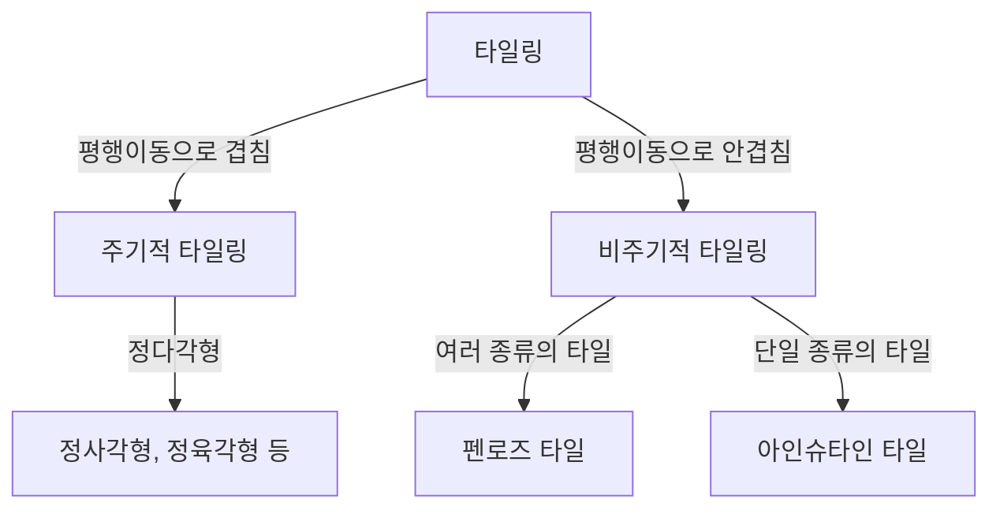

수학의 세계에는 언뜻 보기에 단순해 보이지만 수 세기 동안 수학자들을 괴롭혀 온 미해결 문제들이 존재합니다. '타일링(Tessellation)'에 관한 문제도 그중 하나로, 순수 기하학의 틀을 넘어 물리학과 재료 과학에까지 깊은 영향을 미쳤습니다. 이 글에서는 비주기적 타일링의 역사와 결정학에서의 패러다임 전환에 대해 자세히 알아봅니다.

## 타일링 문제의 기초

평면을 빈틈없이, 그리고 겹치지 않게 도형으로 채우는 것을 '타일링'이라고 합니다. 가장 단순한 예는 정사각형이나 정삼각형을 이용한 '주기적' 타일링으로, 특정 방향으로 평행 이동함으로써 패턴이 무한히 반복됩니다.

## 비주기적 타일링의 탐구

1961년 수학자 하오 왕(Hao Wang)은 '왕의 타일(Wang tiles)'을 고안하여 비주기적 타일링의 가능성에 대한 논의를 불러일으켰습니다. 이후 1970년대에 로저 펜로즈는 단 두 가지 형태(연과 다트)의 타일만을 사용하여 비주기적으로만 평면을 채울 수 있는 '펜로즈 타일'을 발견했습니다. 이 발견은 국소적 동형성과 황금비가 곳곳에 나타나는 놀라운 수학적 성질을 가지고 있었습니다.

## 결정학의 패러다임 전환: 준결정의 발견

오랫동안 펜로즈 타일은 수학적 유희로 여겨졌지만, 1982년 단 셰흐트만(Dan Shechtman)은 알루미늄-망간 합금에서 '10회 대칭성'을 나타내는 회절 패턴을 발견했습니다. 주기적 구조에서는 불가능한 이 대칭성은 정확히 3차원 비주기적 타일링과 같은 구조였습니다. 이 '준결정(Quasicrystal)'의 발견으로 셰흐트만은 2011년 노벨 화학상을 수상했습니다.

## 아인슈타인 문제와 2023년의 획기적 발견

펜로즈의 발견 이후, "단 한 종류의 타일만으로 비주기적으로 평면을 채울 수 있을까?"라는 '아인슈타인 문제(독일어 ein stein, 하나의 돌에서 유래)'가 제기되었습니다. 수십 년간 미해결 상태였으나, 2023년 데이비드 스미스(David Smith) 등의 팀이 '모자(The Hat)'라고 불리는 13각형 단일 타일을 발견하며 마침내 증명되었습니다. 몇 달 후에는 거울상이 필요 없는 '스펙터(Spectre)' 타일도 발견되어 기하학 역사에 새로운 페이지를 장식했습니다.

이러한 수학적 발견들은 단순한 퍼즐이 아니며, 새로운 메타물질 및 미지의 물리적 특성을 가진 신소재 개발로 이어질 잠재력을 가지고 있습니다.
