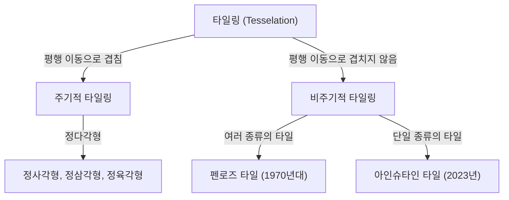
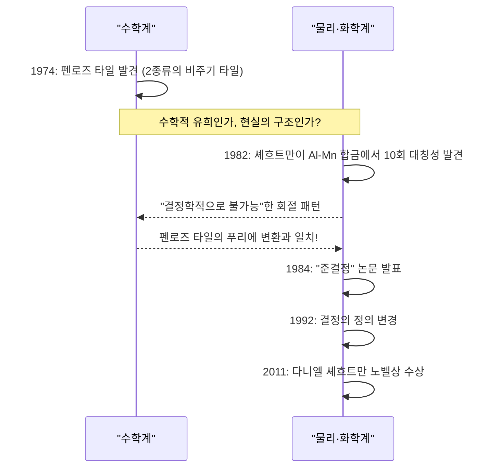

수학의 세계에는 언뜻 보기엔 단순하지만 수세기에 걸쳐 수학자들의 두뇌를 괴롭혀온 미해결 문제가 많이 존재합니다. 그 중에서도 '타일링(Tesselation / Tiling)'에 관한 문제는 순수 기하학의 틀을 넘어 물리학, 재료 과학, 그리고 예술에까지 깊은 영향을 미쳐왔습니다.

본 기사에서는 비주기적 타일링의 기초부터 시작하여, 로저 펜로즈의 '펜로즈 타일', 다니엘 셰흐트만의 노벨상 수상으로 이어진 '준결정'의 발견, 그리고 2023년 세계를 놀라게 한 '아인슈타인 타일(비주기적 모노타일)'의 발견까지, 수학과 결정학이 교차하는 장대한 이야기를 철저히 파헤쳐 봅니다.

## 1. 타일링 문제의 기초와 주기성

평면을 빈틈없이, 그리고 겹침 없이 도형으로 가득 채우는 것을 '타일링'이라고 부릅니다. 가장 단순한 예는 정사각형, 정삼각형, 정육각형에 의한 타일링입니다. 이들은 '주기적'인 타일링이라고 불리며, 어떤 패턴이 특정 방향으로 평행 이동함으로써 무한히 반복됩니다.

### 주기성과 대칭성

결정학에서 공간을 가득 채우는 원자의 배열은 오랫동안 '주기적'이라고 믿어져 왔습니다. 주기적인 구조는 2회, 3회, 4회 또는 6회의 회전 대칭성을 가질 수 있지만, **5회 대칭성**이나 **8회 이상의 대칭성**을 가지는 주기적인 구조는 수학적으로 불가능하다는 것이 증명되어 있습니다(결정학적 제한 정리).



## 2. 비주기적 타일링의 탐구: 왕의 타일

1961년, 수학자 하오 왕(Hao Wang)은 '왕의 타일'이라고 불리는, 변에 색이 칠해진 정사각형 타일을 고안했습니다. 그는 '임의의 타일 세트가 평면을 채울 수 있다면, 그것은 주기적인 타일링이 가능하다'고 예상했습니다. 하지만 그의 제자였던 로버트 버거는 1966년에 이 예상을 뒤집고, **'비주기적으로만'** 평면을 채울 수 있는 타일 세트(처음에는 20,426개, 나중에 104개로 축소)를 발견했습니다.

## 3. 펜로즈 타일의 충격

1970년대, 영국의 물리학자이자 수학자인 로저 펜로즈(2020년 노벨 물리학상 수상자)는 비주기적 타일링에 필요한 타일의 종류를 획기적으로 줄이는 데 성공했습니다. 그는 단 **2종류**의 타일('카이트(연)'와 '다트(화살)', 혹은 2종류의 마름모)을 사용하여 비주기적으로만 평면을 채울 수 있는 '펜로즈 타일'을 발견했습니다.

### 수학적 성질

펜로즈 타일에는 다음과 같은 놀라운 성질이 있습니다:
1. **비주기성**: 아무리 넓은 범위를 잘라내어 평행 이동시켜도 원래의 패턴과 완전히 겹치는 일은 없습니다.
2. **국소 동형성**: 임의의 유한한 크기의 패턴은 무한히 펼쳐지는 타일링 내의 곳곳에 무한 번 출현합니다.
3. **황금비**: 2종류 타일의 비율이나 패턴의 면적비 등, 곳곳에서 황금비 $\phi = \frac{1 + \sqrt{5}}{2}$ 가 나타납니다.

$$ \lim_{R \to \infty} \frac{N_{kite}(R)}{N_{dart}(R)} = \phi \approx 1.618 $$

### Python에 의한 간단한 프랙탈 생성 개념

펜로즈 타일은 '인플레이션 규칙(팽창 규칙)'을 사용하여 재귀적으로 생성할 수 있습니다. 다음은 Python을 사용한 개념적인 재귀 분할의 예입니다.

```python
import matplotlib.pyplot as plt
import numpy as np

# 황금비
PHI = (1 + np.sqrt(5)) / 2

class Triangle:
    def __init__(self, color, p1, p2, p3):
        self.color = color
        self.p1 = p1
        self.p2 = p2
        self.p3 = p3

def inflate(triangles):
    new_triangles = []
    for t in triangles:
        if t.color == 0: # Half-kite
            # 분할 계산 (개념)
            p4 = t.p1 + (t.p2 - t.p1) / PHI
            new_triangles.append(Triangle(1, p4, t.p3, t.p1))
            new_triangles.append(Triangle(0, t.p2, t.p3, p4))
        else: # Half-dart
            p4 = t.p1 + (t.p2 - t.p1) / PHI
            p5 = t.p3 + (t.p2 - t.p3) / PHI
            new_triangles.append(Triangle(1, p4, p5, t.p1))
            # 단순화를 위해 일부 생략
    return new_triangles

# 그리기 처리 등의 구현은 생략하지만,
# 이처럼 재귀적인 분할(인플레이션)에 의해 무한한 비주기 패턴을 생성할 수 있습니다.
```

## 4. 결정학의 패러다임 전환: 준결정의 발견

펜로즈 타일은 오랫동안 '수학 장난감'으로 여겨졌습니다. 하지만 1982년, 이스라엘의 재료 과학자 다니엘 셰흐트만이 알루미늄과 망간 합금의 전자선 회절 패턴을 관찰하던 중 믿을 수 없는 것을 발견했습니다.

그것은 **'명확한 회절 스폿(높은 질서를 나타냄)을 가지면서, 10회 대칭성(주기 구조에서는 불가능한 대칭성)을 나타내는'** 물질이었습니다.

### 과학계의 반발과 노벨상

당시 결정학의 상식으로는, 결정은 주기적인 원자 배열을 가지는 것으로 정의되어 있었습니다. '비주기적이면서 높은 질서를 가진다'는 상태는 모순된 것으로 여겨졌기 때문에, 셰흐트만의 발견은 초기에 이중 회절 등의 실험 오류라며 거세게 비판받았습니다. 라이너스 폴링과 같은 위대한 화학자조차 '준결정 같은 건 없다. 준과학자가 있을 뿐이다'라고 조롱했을 정도입니다.

하지만 그 후의 상세한 연구를 통해 셰흐트만의 발견이 진짜임이 증명되었습니다. 이 물질의 원자 배열은 바로 3차원에서의 펜로즈 타일(비주기적 타일링)과 동일한 수학적 구조를 가지고 있었던 것입니다. 이 물질은 **'준결정(Quasicrystal)'**이라고 명명되었고, 국제 결정학 연합은 1992년에 결정의 정의를 '주기성'에서 '이산적인 회절 도형을 나타내는 것'으로 변경할 수밖에 없었습니다. 셰흐트만은 이 공로로 2011년에 노벨 화학상을 수상했습니다.



## 5. 아인슈타인 문제: 비주기적 모노타일의 추구

펜로즈 타일에 의해 '2종류'의 타일로 비주기적 타일링이 가능하다는 것이 밝혀졌습니다. 그래서 수학자들은 다음의 궁극적인 의문을 품게 되었습니다.

**"단 1종류의 타일로, 비주기적으로만 평면을 가득 채우는 것이 가능한가?"**

독일어로 '하나의 돌'을 의미하는 "ein stein"에서 유래하여, 이 문제는 **'아인슈타인 문제'**라고 불리며, 그 조건을 만족하는 가상의 타일은 '아인슈타인 타일'이라고 불리게 되었습니다.

수십 년 동안 많은 수학자가 이 문제에 도전했지만, 해결에 이르지는 못했습니다. 테일러-소콜로의 육각형(1999년) 등이 있었지만, 인접 규칙이나 무늬에 의한 제약이 필요했습니다. 순수한 모양만으로 아인슈타인이 되는 다각형은 오랫동안 발견되지 않았습니다.

## 6. 2023년의 돌파구: '모자'와 '스펙터'

그리고 2023년 3월, 놀라운 뉴스가 전 세계를 강타했습니다. 아마추어 수학 애호가 데이비드 스미스와 크레이그 카플란, 조셉 마이어스, 차임 굿맨-스트라우스로 이루어진 연구팀이 **'모자(The Hat)'**라고 불리는 13각형의 단일 타일이 아인슈타인임을 증명한 것입니다.

### '모자(The Hat)' 타일의 기하학

모자 타일은 정육각형을 베이스로 한 '카이트(연 모양)'를 8개 조합한 듯한 형태(폴리카이트)를 띠고 있습니다. 이 타일은 거울상(뒤집힌 모양)을 포함함으로써, 평면을 비주기적으로만 완전히 채울 수 있습니다.

$$ \text{Hat Tile} = 8 \times \text{Kites from a Hexagon} $$

### 엄밀한 카이랄 비주기 모노타일 '스펙터'

'모자'의 발견만으로도 역사적인 위업이었지만, 일부 수학자들로부터 '거울상(뒤집기)을 허용하는 것은 실질적으로 2종류의 타일을 사용하는 것과 같지 않은가?'라는 지적도 있었습니다.

이에 대해 같은 연구팀은 불과 몇 달 후인 2023년 5월에 **'스펙터(The Spectre)'**라고 불리는 새로운 타일을 발표했습니다. 스펙터는 거울상을 일절 사용하지 않고(뒤집기 없이), 순수하게 평행 이동과 회전만으로 비주기 타일링을 실현하는 '엄밀한 비주기 모노타일'입니다. 이로써 수십 년에 걸친 '아인슈타인 문제'는 완벽한 형태로 해결되었습니다.

## 7. 결론: 기하학이 여는 미래

하오 왕의 예상에서 시작하여 펜로즈의 직관, 셰흐트만의 불굴의 정신, 그리고 스미스 등의 최신 돌파구에 이르기까지, 비주기적 타일링의 역사는 '불가능'이라고 여겨졌던 것들이 차례차례 뒤집히는 연속이었습니다.

이러한 수학적 발견은 단순한 퍼즐에 머물지 않습니다. 준결정은 이미 프라이팬 코팅이나 수술용 메스, LED의 효율 향상 등에 응용되고 있습니다. 이번에 발견된 '모자'나 '스펙터'도 장래에 새로운 메타 물질의 설계나 미지의 물리적 성질을 가지는 신소재의 개발로 이어질 가능성을 품고 있습니다.

수학의 추상적인 탐구가 어떻게 물리적인 현실 세계와 깊게 결부되어, 우리의 우주에 대한 이해를 다시 써 내려가는지. 비주기적 타일링의 이야기는 그 가장 아름답고, 가장 강력한 증명 중 하나라고 할 수 있을 것입니다.
