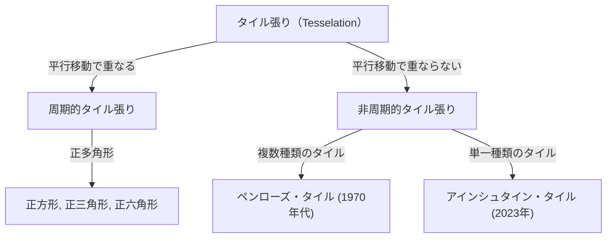
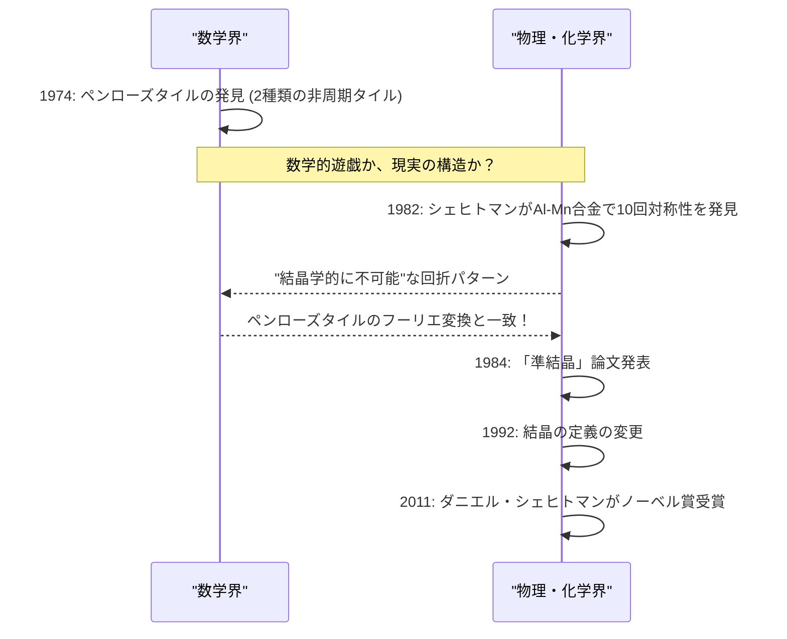

数学の世界には、一見するとシンプルでありながら、数世紀にわたって数学者たちの頭脳を悩ませ続けてきた未解決問題が数多く存在します。その中でも「タイル張り（Tesselation / Tiling）」に関する問題は、純粋な幾何学の枠を超え、物理学、材料科学、そして芸術にまで深い影響を与えてきました。

本記事では、非周期タイル張りの基礎から始まり、ロジャー・ペンローズによる「ペンローズ・タイル」、ダニエル・シェヒトマンのノーベル賞受賞につながった「準結晶」の発見、そして2023年に世界を驚かせた「アインシュタイン・タイル（非周期モノタイル）」の発見まで、数学と結晶学が交差する壮大な物語を徹底的に深掘りします。

## 1. タイル張り問題の基礎と周期性

平面を隙間なく、かつ重なりなく図形で埋め尽くすことを「タイル張り」と呼びます。最も単純な例は、正方形、正三角形、正六角形によるタイル張りです。これらは「周期的」なタイル張りと呼ばれ、あるパターンが特定の方向に平行移動することで無限に繰り返されます。

### 周期性と対称性

結晶学において、空間を埋め尽くす原子の配列は長らく「周期的」であると信じられてきました。周期的な構造は、2回、3回、4回、または6回の回転対称性を持つことができますが、**5回対称性**や**8回以上の対称性**を持つ周期的な構造は数学的に不可能であることが証明されています（結晶学的制限定理）。



## 2. 非周期タイル張りの探求：ワンのタイル

1961年、数学者ハオ・ワンは「ワンのタイル」と呼ばれる、辺に色が塗られた正方形のタイルを考案しました。彼は「任意のタイルセットが平面を埋め尽くすことができるなら、それは周期的なタイル張りが可能である」と予想しました。しかし、彼の教え子であったロバート・バーガーは1966年にこの予想を覆し、**「非周期的にのみ」**平面を埋め尽くすことができるタイルのセット（最初は20,426個、後に104個に削減）を発見しました。

## 3. ペンローズ・タイルの衝撃

1970年代、イギリスの物理学者であり数学者のロジャー・ペンローズ（2020年ノーベル物理学賞受賞者）は、非周期タイル張りに必要なタイルの種類を劇的に減らすことに成功しました。彼はわずか**2種類**のタイル（「カイト（凧）」と「ダート（矢）」、あるいは2種類の菱形）を使って、非周期的にのみ平面を埋め尽くすことができる「ペンローズ・タイル」を発見しました。

### 数学的性質

ペンローズ・タイルには以下のような驚くべき性質があります：
1. **非周期性**: どんなに広い範囲を切り取って平行移動させても、元のパターンと完全に重なることはありません。
2. **局所同型性**: 任意の有限サイズのパターンは、無限に広がるタイリング内の至る所に無限回出現します。
3. **黄金比**: 2種類のタイルの比率や、パターンの面積比など、至る所に黄金比 $\phi = \frac{1 + \sqrt{5}}{2}$ が現れます。

$$ \lim_{R \to \infty} \frac{N_{kite}(R)}{N_{dart}(R)} = \phi \approx 1.618 $$

### Pythonによる簡単なフラクタル生成概念

ペンローズ・タイルは「インフレーション・ルール（膨張規則）」を用いて再帰的に生成することができます。以下はPythonを用いた概念的な再帰分割の例です。

```python
import matplotlib.pyplot as plt
import numpy as np

# 黄金比
PHI = (1 + np.sqrt(5)) / 2

class Triangle:
    def __init__(self, color, p1, p2, p3):
        self.color = color
        self.p1 = p1
        self.p2 = p2
        self.p3 = p3

def inflate(triangles):
    new_triangles = []
    for t in triangles:
        if t.color == 0: # Half-kite
            # 分割計算 (概念)
            p4 = t.p1 + (t.p2 - t.p1) / PHI
            new_triangles.append(Triangle(1, p4, t.p3, t.p1))
            new_triangles.append(Triangle(0, t.p2, t.p3, p4))
        else: # Half-dart
            p4 = t.p1 + (t.p2 - t.p1) / PHI
            p5 = t.p3 + (t.p2 - t.p3) / PHI
            new_triangles.append(Triangle(1, p4, p5, t.p1))
            # 簡略化のため一部省略
    return new_triangles

# 描画処理などの実装は省略しますが、
# このように再帰的な分割（インフレーション）によって無限の非周期パターンを生成できます。
```

## 4. 結晶学のパラダイムシフト：準結晶の発見

ペンローズ・タイルは長らく「数学のおもちゃ」と考えられていました。しかし1982年、イスラエルの材料科学者ダニエル・シェヒトマンが、アルミニウムとマンガンの合金の電子線回折パターンを観察している際、信じられないものを発見しました。

それは**「明瞭な回折スポット（高い秩序性を示す）を持ちながら、10回対称性（周期構造では不可能な対称性）を示す」**物質でした。

### 科学界からの反発とノーベル賞

当時の結晶学の常識では、結晶は周期的な原子配列を持つものと定義されていました。「非周期でありながら高い秩序を持つ」という状態は矛盾していると考えられていたため、シェヒトマンの発見は当初、二重回折などの実験ミスだとして激しく批判されました。ライナス・ポーリングのような偉大な化学者でさえ「準結晶など存在しない。準科学者がいるだけだ」と嘲笑したほどです。

しかし、その後の詳細な研究により、シェヒトマンの発見が本物であることが証明されました。この物質の原子配列は、まさに3次元におけるペンローズ・タイル（非周期タイル張り）と同じ数学的構造を持っていたのです。この物質は**「準結晶（Quasicrystal）」**と名付けられ、国際結晶学連合は1992年に結晶の定義を「周期性」から「離散的な回折図形を示すもの」へと変更せざるを得なくなりました。シェヒトマンはこの功績により、2011年にノーベル化学賞を受賞しました。



## 5. アインシュタイン問題：非周期モノタイルの追求

ペンローズ・タイルによって「2種類」のタイルで非周期タイル張りが可能であることが示されました。そこで数学者たちは次なる究極の疑問を抱きました。

**「たった1種類のタイルで、非周期的にのみ平面を埋め尽くすことは可能か？」**

ドイツ語で「1つの石」を意味する "ein stein" にちなんで、この問題は**「アインシュタイン問題」**と呼ばれ、その条件を満たす架空のタイルは「アインシュタイン・タイル」と呼ばれるようになりました。

数十年間にわたり多くの数学者がこの問題に挑みましたが、解決には至りませんでした。テイラー・ソコロの六角形（1999年）などはありましたが、隣接ルールや模様による制約が必要でした。純粋な形状だけでアインシュタインとなる多角形は長らく未発見でした。

## 6. 2023年のブレイクスルー：「帽子」と「スペクター」

そして2023年3月、驚くべきニュースが世界を駆け巡りました。アマチュアの数学愛好家デビッド・スミスと、クレイグ・カプラン、ジョセフ・マイヤーズ、シャイム・グッドマン＝ストラウスからなる研究チームが、**「帽子（The Hat）」**と呼ばれる13角形の単一タイルがアインシュタインであることを証明したのです。

### 「帽子（The Hat）」タイルの幾何学

帽子タイルは、正六角形をベースにした「カイト（凧形）」を8つ組み合わせたような形状（ポリカイト）をしています。このタイルは、鏡像（裏返した形）を含めることで、平面を非周期的にのみ完全に埋め尽くすことができます。

$$ \text{Hat Tile} = 8 \times \text{Kites from a Hexagon} $$

### 厳密なカイラル非周期モノタイル「スペクター」

「帽子」の発見だけでも歴史的偉業でしたが、一部の数学者からは「鏡像（裏返し）を許容するのは、実質的に2種類のタイルを使っているのと同じではないか？」という指摘もありました。

これに対し、同じ研究チームはわずか数ヶ月後の2023年5月に、**「スペクター（The Spectre）」**と呼ばれる新たなタイルを発表しました。スペクターは、鏡像を一切使わず（裏返しなしで）、純粋に平行移動と回転だけで非周期タイル張りを実現する「厳密な非周期モノタイル」です。これにより、数十年越しの「アインシュタイン問題」は完全な形で解決されました。

## 7. 結論：幾何学が拓く未来

ハオ・ワンの予想から始まり、ペンローズの直感、シェヒトマンの不屈の精神、そしてスミスらによる最新のブレイクスルーに至るまで、非周期タイル張りの歴史は「不可能」と思われていたことが次々と覆されていく連続でした。

これらの数学的発見は、単なるパズルに留まりません。準結晶は既にフライパンのコーティングや手術用のメス、LEDの効率向上などに応用されています。今回発見された「帽子」や「スペクター」も、将来的に新しいメタマテリアルの設計や、未知の物理的性質を持つ新素材の開発につながる可能性を秘めています。

数学の抽象的な探求が、いかにして物理的な現実世界と深く結びつき、私たちの宇宙に対する理解を書き換えていくのか。非周期タイル張りの物語は、その最も美しく、最も力強い証明の一つと言えるでしょう。
