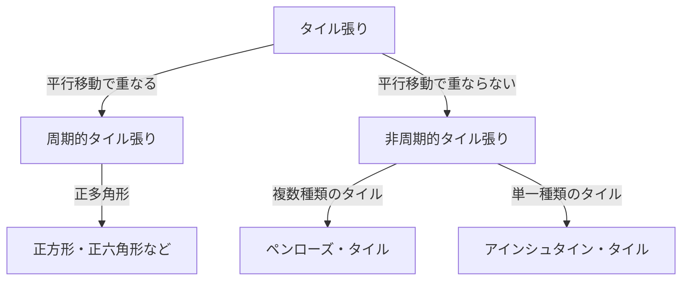

数学の世界には、一見シンプルでありながら数世紀にわたって数学者たちを悩ませてきた未解決問題が存在します。「タイル張り（Tesselation）」に関する問題もその一つであり、純粋な幾何学の枠を超えて物理学や材料科学にまで深い影響を与えています。本記事では、非周期タイル張りの歴史と、結晶学におけるパラダイムシフトについて詳しく解説します。

## タイル張り問題の基礎

平面を隙間なく、かつ重なりなく図形で埋め尽くすことを「タイル張り」と呼びます。最も単純な例は、正方形や正三角形による「周期的」なタイル張りです。これらはあるパターンが特定の方向に平行移動することで無限に繰り返されます。

## 非周期タイル張りの探求

1961年、数学者ハオ・ワンは「ワンのタイル」を考案し、非周期的なタイル張りの可能性について議論を呼び起こしました。その後1970年代に、ロジャー・ペンローズがわずか2種類のタイル（カイトとダート）を使って非周期的にのみ平面を埋め尽くす「ペンローズ・タイル」を発見しました。この発見は、局所的な同型性や黄金比が至る所に現れるという驚くべき数学的性質を持っていました。

## 結晶学のパラダイムシフト：準結晶の発見

長らくペンローズ・タイルは数学的な遊戯と考えられていましたが、1982年にダニエル・シェヒトマンがアルミニウムとマンガンの合金から「10回対称性」を示す回折パターンを発見しました。周期構造では不可能なこの対称性は、まさに3次元の非周期タイル張りと同じ構造でした。この「準結晶」の発見により、シェヒトマンは2011年にノーベル化学賞を受賞しました。

## アインシュタイン問題と2023年のブレイクスルー

ペンローズの発見後、「たった1種類のタイルで非周期的にのみ平面を埋め尽くせるか？」という「アインシュタイン問題」が提唱されました。数十年間未解決でしたが、2023年にデビッド・スミスらのチームが「帽子（The Hat）」と呼ばれる13角形の単一タイルを発見し、ついに証明されました。さらに数ヶ月後には鏡像を用いない「スペクター」も発見され、幾何学の歴史に新たな1ページが刻まれました。

これらの数学的発見は単なるパズルではなく、新しいメタマテリアルや新素材の開発につながる可能性を秘めています。
