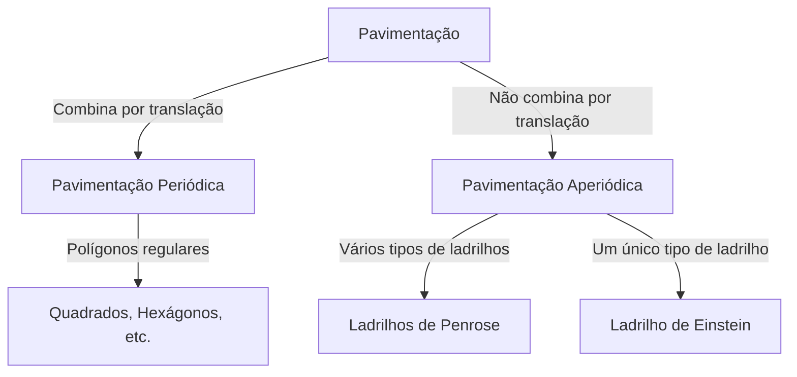

No mundo da matemática, existem problemas não resolvidos que parecem simples à primeira vista. O problema da "pavimentação" (tesselação) é um deles, com um impacto profundo além da geometria pura, abrangendo a física e a ciência dos materiais.

## Noções Básicas de Pavimentação

Cobrir um plano com formas geométricas sem lacunas ou sobreposições é chamado de "pavimentação".

## Pavimentação Aperiódica e Quase-cristais

Roger Penrose descobriu os ladrilhos de Penrose nos anos 1970. Em 1982, Dan Shechtman descobriu os quase-cristais (Prêmio Nobel de 2011).

## O Problema de Einstein (2023)

O problema "Einstein" (um único ladrilho) foi resolvido em 2023 pela descoberta de "O Chapéu" (The Hat) por David Smith e equipe.
