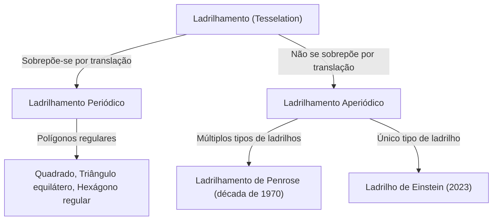
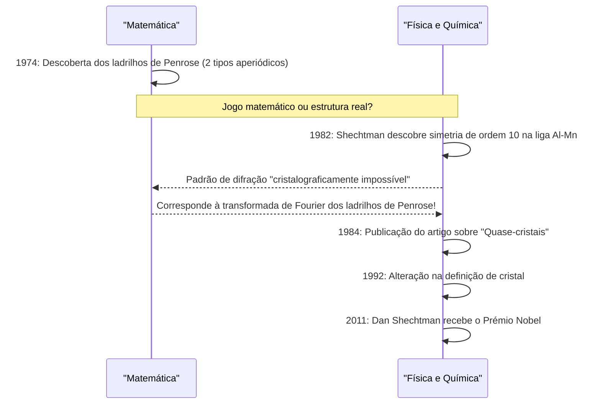

No mundo da matemática, existem muitos problemas não resolvidos que, embora pareçam simples à primeira vista, têm intrigado as mentes dos matemáticos durante séculos. Entre eles, os problemas relacionados com o "ladrilhamento" (Tesselation / Tiling) transcendem os limites da geometria pura e tiveram um impacto profundo na física, ciência dos materiais e até na arte.

Neste artigo, vamos explorar profundamente a épica intersecção da matemática e da cristalografia, começando pelos fundamentos dos ladrilhamentos aperiódicos, passando pelos "Ladrilhamentos de Penrose" de Roger Penrose, a descoberta dos "quase-cristais" que levou Dan Shechtman a ganhar o Prémio Nobel, até à descoberta dos "Ladrilhos de Einstein (monotilho aperiódico)" que surpreendeu o mundo em 2023.

## 1. Fundamentos do Problema de Ladrilhamento e Periodicidade

Preencher um plano com formas geométricas sem lacunas e sem sobreposições é chamado de "ladrilhamento". Os exemplos mais simples são os ladrilhamentos com quadrados, triângulos equiláteros e hexágonos regulares. Estes são chamados de ladrilhamentos "periódicos", onde um determinado padrão é repetido infinitamente por translação numa direção específica.

### Periodicidade e Simetria

Na cristalografia, durante muito tempo acreditou-se que o arranjo dos átomos que preenchem o espaço era "periódico". Estruturas periódicas podem ter simetria rotacional de ordem 2, 3, 4 ou 6, mas provou-se matematicamente ser impossível que uma estrutura periódica possua simetria de **ordem 5** ou **simetria de ordem 8 ou superior** (teorema da restrição cristalográfica).



## 2. A Exploração do Ladrilhamento Aperiódico: Ladrilhos de Wang

Em 1961, o matemático Hao Wang propôs quadrados com bordas coloridas, conhecidos como "Ladrilhos de Wang". Ele conjeturou que "se qualquer conjunto de ladrilhos pode preencher o plano, então é possível um ladrilhamento periódico". No entanto, o seu aluno Robert Berger refutou esta conjetura em 1966, descobrindo um conjunto de ladrilhos (inicialmente 20.426, depois reduzidos a 104) que pode preencher o plano **"apenas de forma aperiódica"**.

## 3. O Impacto dos Ladrilhamentos de Penrose

Na década de 1970, Roger Penrose, físico e matemático britânico (vencedor do Prémio Nobel da Física de 2020), conseguiu reduzir drasticamente o número de tipos de ladrilhos necessários para um ladrilhamento aperiódico. Ele descobriu os "Ladrilhamentos de Penrose", que podem preencher o plano apenas de forma aperiódica usando apenas **dois tipos** de ladrilhos ("pipa" (kite) e "dardo" (dart), ou dois tipos de losangos).

### Propriedades Matemáticas

Os Ladrilhamentos de Penrose têm propriedades notáveis:
1. **Aperiodicidade**: Não importa a área que você corte e translade, ela nunca irá sobrepor-se perfeitamente ao padrão original.
2. **Isomorfismo local**: Qualquer padrão de tamanho finito aparece um número infinito de vezes em todo o ladrilhamento infinito.
3. **Proporção áurea**: A proporção áurea $\phi = \frac{1 + \sqrt{5}}{2}$ aparece em todo o lado, como na proporção dos dois tipos de ladrilhos e na proporção das áreas dos padrões.

$$ \lim_{R \to \infty} \frac{N_{kite}(R)}{N_{dart}(R)} = \phi \approx 1.618 $$

### Conceito Simples de Geração de Fractais em Python

Os Ladrilhamentos de Penrose podem ser gerados recursivamente usando "regras de inflação". Abaixo está um exemplo conceitual de subdivisão recursiva usando Python.

```python
import matplotlib.pyplot as plt
import numpy as np

# Proporção Áurea
PHI = (1 + np.sqrt(5)) / 2

class Triangle:
    def __init__(self, color, p1, p2, p3):
        self.color = color
        self.p1 = p1
        self.p2 = p2
        self.p3 = p3

def inflate(triangles):
    new_triangles = []
    for t in triangles:
        if t.color == 0: # Meia-pipa (Half-kite)
            # Cálculo de divisão (conceitual)
            p4 = t.p1 + (t.p2 - t.p1) / PHI
            new_triangles.append(Triangle(1, p4, t.p3, t.p1))
            new_triangles.append(Triangle(0, t.p2, t.p3, p4))
        else: # Meio-dardo (Half-dart)
            p4 = t.p1 + (t.p2 - t.p1) / PHI
            p5 = t.p3 + (t.p2 - t.p3) / PHI
            new_triangles.append(Triangle(1, p4, p5, t.p1))
            # Parte omitida por simplicidade
    return new_triangles

# A implementação da renderização é omitida,
# mas padrões aperiódicos infinitos podem ser gerados por subdivisão recursiva (inflação) desta forma.
```

## 4. Mudança de Paradigma na Cristalografia: A Descoberta dos Quase-cristais

Os Ladrilhamentos de Penrose foram durante muito tempo considerados "brinquedos matemáticos". Mas em 1982, o cientista de materiais israelita Dan Shechtman descobriu algo incrível enquanto observava o padrão de difração de eletrões de uma liga de alumínio e manganês.

Era um material que **"possuía pontos de difração claros (indicando um alto grau de ordem) e, no entanto, exibia uma simetria de ordem 10 (uma simetria impossível numa estrutura periódica)"**.

### Rejeição da Comunidade Científica e o Prémio Nobel

De acordo com o senso comum cristalográfico da época, os cristais eram definidos como tendo um arranjo atómico periódico. Acreditava-se que o estado de ser "aperiódico e ainda possuir uma alta ordem" era uma contradição, de modo que a descoberta de Shechtman foi inicialmente duramente criticada como um erro experimental, como a dupla difração. Até mesmo grandes químicos como Linus Pauling o ridicularizaram, dizendo: "Não existem quase-cristais, apenas quase-cientistas."

No entanto, estudos detalhados subsequentes provaram que a descoberta de Shechtman era real. O arranjo atómico deste material possuía a mesma estrutura matemática que os Ladrilhamentos de Penrose tridimensionais (ladrilhamento aperiódico). Este material foi denominado **"Quase-cristal (Quasicrystal)"**, e a União Internacional de Cristalografia foi forçada a alterar a definição de cristal em 1992, de "periodicidade" para "qualquer sólido com um diagrama de difração essencialmente discreto". Graças a essa conquista, Shechtman recebeu o Prémio Nobel de Química em 2011.



## 5. O Problema de Einstein: A Busca pelo Monotilho Aperiódico

Os Ladrilhamentos de Penrose mostraram que o ladrilhamento aperiódico era possível com "dois tipos" de ladrilhos. Assim, os matemáticos colocaram a próxima questão fundamental.

**"É possível preencher o plano apenas de forma aperiódica com apenas 1 tipo de ladrilho?"**

Nomeado em homenagem ao alemão "ein stein", que significa "uma pedra", esse problema ficou conhecido como o **"Problema de Einstein"**, e o ladrilho hipotético que satisfaz essa condição ficou conhecido como o "Ladrilho de Einstein".

Muitos matemáticos tentaram resolver esse problema ao longo de décadas, mas ele permaneceu sem solução. Houve exemplos como o hexágono de Taylor-Socolar (1999), mas exigia regras de adjacência ou restrições baseadas em padrões. Um polígono que seria um Einstein baseado puramente na sua forma não foi descoberto durante muito tempo.

## 6. O Avanço de 2023: "O Chapéu" e "O Espectro"

Depois, em março de 2023, uma notícia incrível correu pelo mundo. Uma equipa de investigação composta pelo entusiasta matemático amador David Smith, juntamente com Craig Kaplan, Joseph Myers e Chaim Goodman-Strauss, provou que um único ladrilho de 13 lados chamado **"O Chapéu (The Hat)"** era um Einstein.

### A Geometria do Ladrilho "O Chapéu"

O ladrilho Chapéu tem uma forma semelhante à combinação de oito "pipas" baseadas em hexágonos regulares (uma polipipa). Este ladrilho pode preencher completamente o plano apenas de forma aperiódica, incluindo a sua imagem no espelho (a forma invertida).

$$ \text{Ladrilho Chapéu} = 8 \times \text{Pipas de um Hexágono} $$

### O Monotilho Aperiódico Quiral Estrito "O Espectro"

Embora a descoberta do "Chapéu" tenha sido por si só uma conquista histórica, alguns matemáticos apontaram que "permitir uma imagem no espelho (inversão) não é essencialmente o mesmo que usar dois tipos de ladrilhos?".

Em resposta a isso, a mesma equipa de investigação anunciou um novo ladrilho chamado **"O Espectro (The Spectre)"** poucos meses depois, em maio de 2023. O Espectro é um "monotilho aperiódico estrito" que atinge o ladrilhamento aperiódico puramente por translação e rotação, sem usar qualquer imagem no espelho (sem inversão). Com isto, o "Problema de Einstein" de décadas foi completamente resolvido.

## 7. Conclusão: O Futuro Aberto Pela Geometria

Desde a conjetura de Hao Wang até à intuição de Penrose, o espírito indomável de Shechtman e os avanços recentes de Smith e a sua equipa, a história dos ladrilhamentos aperiódicos tem sido uma série de reviravoltas sobre o que se pensava ser "impossível".

Essas descobertas matemáticas vão além de meros quebra-cabeças. Os quase-cristais já são aplicados em revestimentos de frigideiras, bisturis cirúrgicos, aumento da eficiência de LEDs, entre outros. O recém-descoberto "Chapéu" e o "Espectro" também têm o potencial de levar ao design de novos metamateriais e ao desenvolvimento de novos materiais com propriedades físicas desconhecidas no futuro.

Como a exploração abstrata da matemática se conecta profundamente com o mundo físico real e reescreve nossa compreensão do universo? A história dos ladrilhamentos aperiódicos é talvez uma das provas mais belas e poderosas disso.
