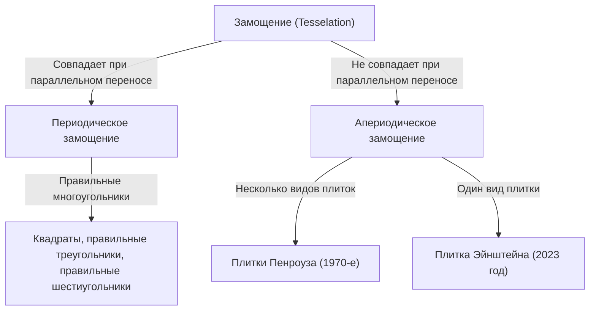
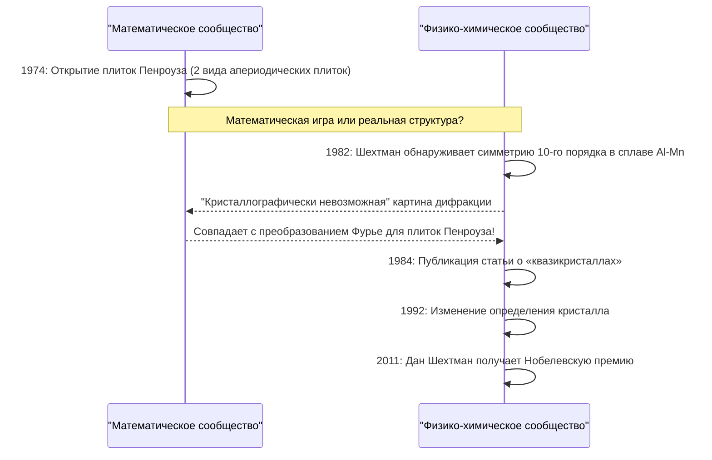

В мире математики существует множество нерешенных проблем, которые на первый взгляд кажутся простыми, но веками ставили в тупик умы математиков. Среди них проблема «замощения» (Tesselation / Tiling) вышла за рамки чистой геометрии и оказала глубокое влияние на физику, материаловедение и даже искусство.

В этой статье мы подробно рассмотрим эпическую историю пересечения математики и кристаллографии: начиная с основ апериодического замощения, через «плитки Пенроуза», придуманные Роджером Пенроузом, открытие «квазикристаллов», принесшее Нобелевскую премию Дану Шехтману, и заканчивая открытием в 2023 году «плитки Эйнштейна» (апериодической моноплитки), поразившим весь мир.

## 1. Основы проблемы замощения и периодичность

Заполнение плоскости фигурами без зазоров и перекрытий называется «замощением». Самые простые примеры — замощение квадратами, правильными треугольниками и правильными шестиугольниками. Они называются «периодическими» замощениями, в которых определенный паттерн бесконечно повторяется путем параллельного переноса в заданных направлениях.

### Периодичность и симметрия

В кристаллографии долгое время считалось, что расположение атомов, заполняющих пространство, является «периодическим». Периодические структуры могут иметь вращательную симметрию 2-го, 3-го, 4-го или 6-го порядка, но математически доказано, что периодические структуры с симметрией **5-го порядка** или **8-го и выше порядков** невозможны (кристаллографическое ограничение).



## 2. Поиск апериодического замощения: Плитки Вана

В 1961 году математик Хао Ван придумал квадратные плитки с раскрашенными краями, известные как «плитки Вана». Он предположил: «Если любой набор плиток может замостить плоскость, то возможно и периодическое замощение». Однако его ученик Роберт Бергер опроверг эту гипотезу в 1966 году, обнаружив набор плиток (сначала 20 426, затем сокращенный до 104), которые могут замостить плоскость **«только апериодически»**.

## 3. Влияние плиток Пенроуза

В 1970-х годах британский физик и математик Роджер Пенроуз (лауреат Нобелевской премии по физике 2020 года) смог кардинально сократить количество типов плиток, необходимых для апериодического замощения. Используя всего **два типа** плиток («воздушный змей» и «дротик», или два типа ромбов), он открыл «плитки Пенроуза», которые могут замостить плоскость только апериодически.

### Математические свойства

Плитки Пенроуза обладают следующими удивительными свойствами:
1. **Апериодичность**: Независимо от того, насколько большую область вы вырежете и сдвинете, она никогда полностью не совпадет с исходным узором.
2. **Локальный изоморфизм**: Любой узор конечного размера встречается бесконечное число раз повсюду в бесконечном замощении.
3. **Золотое сечение**: Золотое сечение $\phi = \frac{1 + \sqrt{5}}{2}$ проявляется везде, включая соотношение двух видов плиток и соотношение площадей узоров.

$$ \lim_{R \to \infty} \frac{N_{kite}(R)}{N_{dart}(R)} = \phi \approx 1.618 $$

### Простая концепция генерации фракталов на Python

Плитки Пенроуза можно генерировать рекурсивно, используя «правила инфляции» (расширения). Ниже приведен концептуальный пример рекурсивного разделения на Python.

```python
import matplotlib.pyplot as plt
import numpy as np

# Золотое сечение
PHI = (1 + np.sqrt(5)) / 2

class Triangle:
    def __init__(self, color, p1, p2, p3):
        self.color = color
        self.p1 = p1
        self.p2 = p2
        self.p3 = p3

def inflate(triangles):
    new_triangles = []
    for t in triangles:
        if t.color == 0: # Half-kite
            # Вычисление разделения (концептуально)
            p4 = t.p1 + (t.p2 - t.p1) / PHI
            new_triangles.append(Triangle(1, p4, t.p3, t.p1))
            new_triangles.append(Triangle(0, t.p2, t.p3, p4))
        else: # Half-dart
            p4 = t.p1 + (t.p2 - t.p1) / PHI
            p5 = t.p3 + (t.p2 - t.p3) / PHI
            new_triangles.append(Triangle(1, p4, p5, t.p1))
            # Часть опущена для упрощения
    return new_triangles
    
# Реализация отрисовки опущена, но
# таким образом рекурсивное разделение (инфляция) может генерировать бесконечные апериодические узоры.
```

## 4. Смена парадигмы в кристаллографии: Открытие квазикристаллов

Плитки Пенроуза долгое время считались «математической игрушкой». Но в 1982 году израильский материаловед Дан Шехтман, наблюдая дифракционную картину электронов в сплаве алюминия и марганца, обнаружил нечто невероятное.

Это был материал с **«четкими дифракционными пятнами (что указывает на высокую степень порядка) и симметрией 10-го порядка (что невозможно для периодической структуры)»**.

### Реакция научного сообщества и Нобелевская премия

Согласно принятым тогда представлениям кристаллографии, кристалл определялся как имеющий периодическое расположение атомов. Состояние, которое является «апериодическим, но обладает высоким порядком», считалось противоречивым, поэтому открытие Шехтмана изначально подверглось жесткой критике как экспериментальная ошибка, например, из-за двойной дифракции. Даже такой великий химик, как Лайнус Полинг, насмехался: «Квазикристаллов не существует. Есть только квазиученые».

Однако последующие детальные исследования доказали, что открытие Шехтмана реально. Атомное строение этого вещества имело ту же математическую структуру, что и плитки Пенроуза (апериодическое замощение) в трех измерениях. Это вещество назвали **«квазикристаллом»** (Quasicrystal), и в 1992 году Международный союз кристаллографов был вынужден изменить определение кристалла с «периодичности» на «объект, дающий дискретную дифракционную картину». За это достижение Шехтман получил Нобелевскую премию по химии в 2011 году.



## 5. Проблема Эйнштейна: В поисках апериодической моноплитки

Плитки Пенроуза показали, что апериодическое замощение возможно с использованием «двух типов» плиток. Тогда математики задались следующим главным вопросом:

**«Можно ли замостить плоскость только апериодически, используя всего один вид плитки?»**

В честь немецких слов «ein stein» (один камень), эта проблема стала известна как **«проблема Эйнштейна»**, а вымышленная плитка, удовлетворяющая этому условию, получила название «плитка Эйнштейна».

На протяжении десятилетий многие математики пытались решить эту задачу, но безуспешно. Существовал, например, шестиугольник Тейлора-Соколора (1999 г.), но для него требовались ограничения, основанные на правилах смежности или узорах. Многоугольник, который был бы Эйнштейном только благодаря своей чистой форме, долгое время оставался неоткрытым.

## 6. Прорыв 2023 года: «Шляпа» и «Призрак»

В марте 2023 года удивительная новость облетела весь мир. Команда исследователей, в которую вошли любитель математики Дэвид Смит, а также Крейг Каплан, Джозеф Майерс и Хаим Гудман-Штраусс, доказала, что 13-угольная единичная плитка, названная **«Шляпой» (The Hat)**, является Эйнштейном.

### Геометрия плитки «Шляпа» (The Hat)

Плитка в форме шляпы (поли-кайт) состоит из восьми соединенных «воздушных змеев», в основе которых лежит правильный шестиугольник. Эта плитка может полностью и только апериодически замостить плоскость, если включить ее зеркальные отражения (перевернутые формы).

$$ \text{Hat Tile} = 8 \times \text{Kites from a Hexagon} $$

### Строгая хиральная апериодическая моноплитка «Призрак» (The Spectre)

Открытие «Шляпы» само по себе было историческим достижением, но некоторые математики отметили: «Не является ли допущение зеркальных отражений по сути использованием двух разных плиток?».

В ответ на это та же команда всего несколько месяцев спустя, в мае 2023 года, представила новую плитку под названием **«Призрак» (The Spectre)**. «Призрак» — это «строгая апериодическая моноплитка», которая обеспечивает апериодическое замощение исключительно за счет параллельного переноса и вращения, без использования зеркальных отражений (без переворотов). Таким образом, длившаяся десятилетиями «проблема Эйнштейна» была полностью решена.

## 7. Заключение: Будущее, открываемое геометрией

От гипотезы Хао Вана до интуиции Пенроуза, неукротимого духа Шехтмана и новейшего прорыва Смита и его коллег — история апериодического замощения была чередой опровержений того, что считалось «невозможным».

Эти математические открытия не ограничиваются простыми головоломками. Квазикристаллы уже применяются в антипригарных покрытиях сковородок, хирургических скальпелях и для повышения эффективности светодиодов. Недавно открытые «Шляпа» и «Призрак» также обладают потенциалом для создания новых метаматериалов и разработки новых материалов с неизвестными физическими свойствами в будущем.

Как абстрактные математические поиски могут глубоко связываться с физическим реальным миром и переписывать наше понимание Вселенной? История апериодического замощения, вероятно, является одним из самых красивых и мощных доказательств этого.
