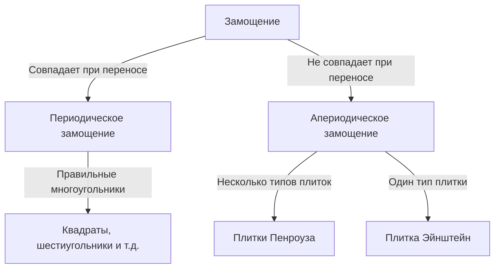

В мире математики есть нерешенные проблемы, которые на первый взгляд кажутся простыми. Проблема «замощения» (тесселяции) — одна из них, оказавшая глубокое влияние за пределами чистой геометрии на физику и материаловедение.

## Основы замощения

Покрытие плоскости геометрическими фигурами без зазоров и перекрытий называется «замощением».

## Апериодическое замощение и квазикристаллы

Роджер Пенроуз открыл плитки Пенроуза в 1970-х. В 1982 году Дан Шехтман открыл квазикристаллы (Нобелевская премия 2011).

## Проблема Эйнштейна и прорыв 2023 года

В 2023 году проблема «Эйнштейна» (одна плитка) была решена открытием «Шляпы» (The Hat) Дэвидом Смитом и его командой.
