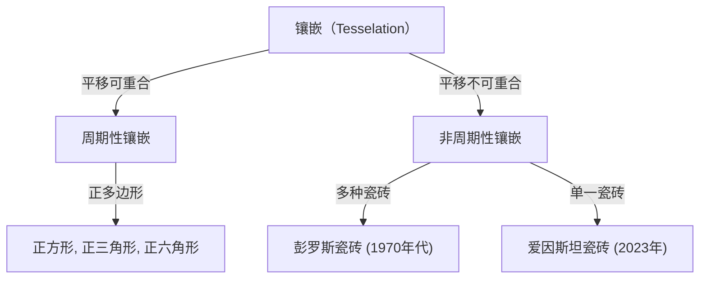
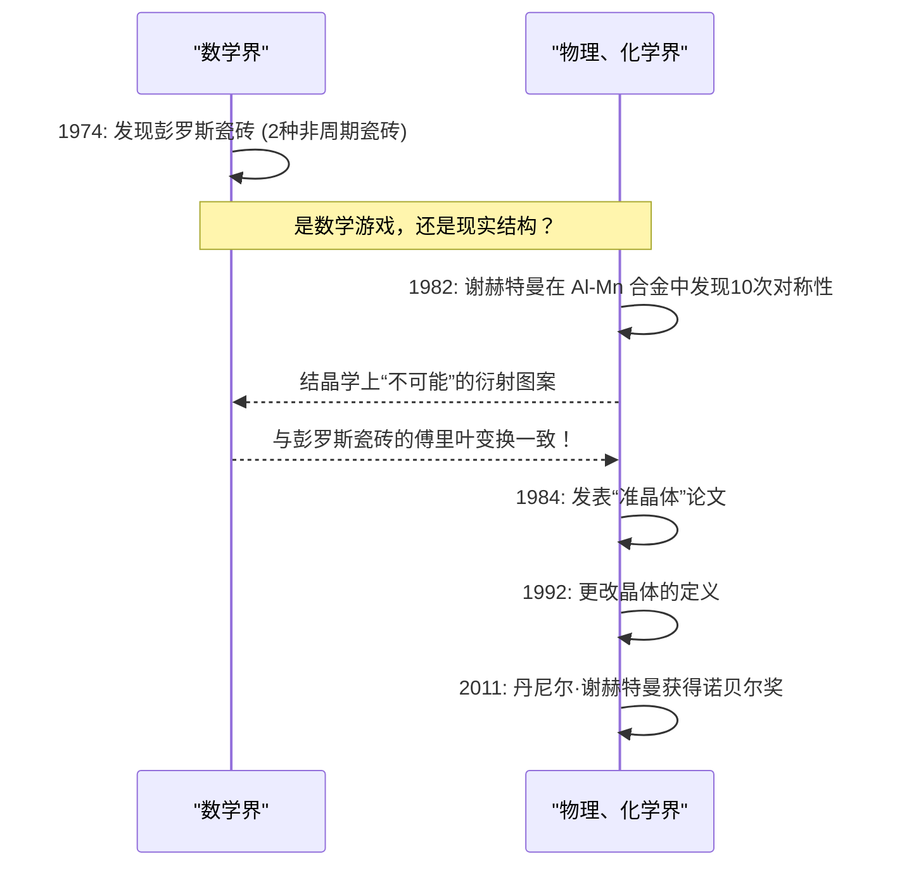

在数学世界中，有许多看似简单却让数学家们苦思冥想了几个世纪的未解之谜。其中关于“镶嵌（Tesselation / Tiling）”的问题，已经超越了纯粹几何学的范畴，对物理学、材料科学甚至艺术产生了深远的影响。

本文将从非周期镶嵌的基础开始，深入挖掘罗杰·彭罗斯的“彭罗斯瓷砖”、助力丹尼尔·谢赫特曼获得诺贝尔奖的“准晶体”的发现，以及2023年震惊世界的“爱因斯坦瓷砖（非周期单一瓷砖）”的发现，彻底探讨数学与结晶学交汇的宏大故事。

## 1. 镶嵌问题的基础与周期性

用图形无缝隙且无重叠地铺满平面被称为“镶嵌”。最简单的例子是使用正方形、正三角形或正六角形进行镶嵌。这些被称为“周期性”镶嵌，通过将某种图案在特定方向上平移，就可以无限重复。

### 周期性与对称性

在结晶学中，长期以来人们相信填满空间的原子排列是“周期性”的。周期性结构可以具有2次、3次、4次或6次旋转对称性，但数学上已经证明，具有**5次对称性**或**8次及以上对称性**的周期性结构是不可能存在的（晶体学限制定理）。



## 2. 非周期镶嵌的探索：王氏瓷砖

1961年，数学家王浩提出了一种边缘涂有颜色的正方形瓷砖，被称为“王氏瓷砖”。他曾猜想：“如果任意一组瓷砖能够铺满平面，那么它就能够实现周期性镶嵌。”然而，他的学生罗伯特·伯格在1966年推翻了这一猜想，发现了**“只能以非周期性”**铺满平面的瓷砖组（最初为20,426种，后来减少到104种）。

## 3. 彭罗斯瓷砖的冲击

1970年代，英国物理学家兼数学家罗杰·彭罗斯（2020年诺贝尔物理学奖得主）成功地大幅减少了非周期镶嵌所需的瓷砖种类。他仅用**2种**瓷砖（“风筝（Kite）”和“飞镖（Dart）”，或者是两种菱形），就发现了只能以非周期性铺满平面的“彭罗斯瓷砖”。

### 数学性质

彭罗斯瓷砖具有以下令人惊叹的性质：
1. **非周期性**: 无论截取多大的范围进行平移，都永远无法与原始图案完全重合。
2. **局部同构性**: 任意有限大小的图案，都会在无限延伸的镶嵌中到处无限次地出现。
3. **黄金分割率**: 在2种瓷砖的比例、图案的面积比等各个方面，处处都会出现黄金分割率 $\phi = \frac{1 + \sqrt{5}}{2}$。

$$ \lim_{R \to \infty} \frac{N_{kite}(R)}{N_{dart}(R)} = \phi \approx 1.618 $$

### 使用 Python 演示简单的分形生成概念

彭罗斯瓷砖可以使用“膨胀规则（Inflation rule）”递归地生成。以下是使用 Python 演示概念性递归分割的例子。

```python
import matplotlib.pyplot as plt
import numpy as np

# 黄金分割率
PHI = (1 + np.sqrt(5)) / 2

class Triangle:
    def __init__(self, color, p1, p2, p3):
        self.color = color
        self.p1 = p1
        self.p2 = p2
        self.p3 = p3

def inflate(triangles):
    new_triangles = []
    for t in triangles:
        if t.color == 0: # Half-kite
            # 分割计算 (概念)
            p4 = t.p1 + (t.p2 - t.p1) / PHI
            new_triangles.append(Triangle(1, p4, t.p3, t.p1))
            new_triangles.append(Triangle(0, t.p2, t.p3, p4))
        else: # Half-dart
            p4 = t.p1 + (t.p2 - t.p1) / PHI
            p5 = t.p3 + (t.p2 - t.p3) / PHI
            new_triangles.append(Triangle(1, p4, p5, t.p1))
            # 为简便起见省略部分代码
    return new_triangles

# 绘图处理等实现已省略，
# 但像这样通过递归分割（膨胀）可以生成无限的非周期图案。
```

## 4. 结晶学的范式转变：准晶体的发现

彭罗斯瓷砖在很长一段时间里被认为是“数学玩具”。然而在1982年，以色列材料科学家丹尼尔·谢赫特曼在观察铝锰合金的电子衍射图案时，发现了令人难以置信的现象。

那是一种**“具有清晰的衍射斑点（显示出高度有序性），同时却呈现出10次对称性（在周期性结构中不可能存在的对称性）”**的物质。

### 来自科学界的反对与诺贝尔奖

按照当时结晶学的常识，晶体被定义为具有周期性原子排列的物质。由于“非周期却具有高度有序性”的状态被认为是矛盾的，谢赫特曼的发现起初遭到了强烈的批评，被认为是二次衍射等实验错误。甚至连莱纳斯·鲍林这样伟大的化学家都曾嘲笑说：“不存在什么准晶体，只有准科学家。”

然而，随后的深入研究证明了谢赫特曼的发现是真实的。这种物质的原子排列，在数学结构上正好等同于三维空间中的彭罗斯瓷砖（非周期镶嵌）。这种物质被命名为**“准晶体（Quasicrystal）”**，迫使国际晶体学联合会在1992年将晶体的定义从“周期性”更改为“产生离散的衍射图谱的任何固体”。由于这一贡献，谢赫特曼于2011年荣获诺贝尔化学奖。



## 5. 爱因斯坦问题：追求非周期单一瓷砖

彭罗斯瓷砖证明了利用“2种”瓷砖可以实现非周期镶嵌。于是数学家们提出了下一个终极问题：

**“是否可能仅用1种瓷砖，就能以非周期性铺满平面？”**

借用德语中意为“一块石头”的“ein stein”，这个问题被称为**“爱因斯坦问题”**，而满足该条件的假想瓷砖则被称为“爱因斯坦瓷砖”。

数十年来，许多数学家挑战了这个问题，但都未能解决。虽然有泰勒-索科洛六边形（Taylor-Socolar hexagon，1999年）等发现，但它们需要相邻规则或图案限制。仅靠纯粹形状就能成为“爱因斯坦”的多边形长期以来一直未被发现。

## 6. 2023年的突破：“帽子”与“幽灵”

终于在2023年3月，一条惊人的消息传遍了世界。由业余数学爱好者大卫·史密斯，以及克雷格·卡普兰、约瑟夫·迈尔斯和哈伊姆·古德曼-斯特劳斯组成的研究团队，证明了一种被称为**“帽子（The Hat）”**的13边形单一瓷砖就是“爱因斯坦”。

### “帽子（The Hat）”瓷砖的几何学

帽子瓷砖的形状（多风筝形，Polykite）就像是由8个以正六角形为基础的“风筝（Kite）”组合而成。这种瓷砖通过包含其镜像（翻转后的形状），就能以非周期性完全铺满平面。

$$ \text{Hat Tile} = 8 \times \text{Kites from a Hexagon} $$

### 严格的手性非周期单一瓷砖“幽灵（The Spectre）”

仅仅是“帽子”的发现就已是一项历史性的伟业，但也有部分数学家指出：“允许使用镜像（翻转），实际上不就等于使用了2种瓷砖吗？”

对此，同一研究团队在短短几个月后的2023年5月，发表了一种被称为**“幽灵（The Spectre）”**的新瓷砖。幽灵瓷砖完全不使用镜像（无需翻转），纯粹仅通过平移和旋转就实现了非周期镶嵌，是“严格的非周期单一瓷砖”。至此，跨越数十年的“爱因斯坦问题”得到了完美的解决。

## 7. 结论：几何学开拓的未来

从王浩的猜想开始，经过彭罗斯的直觉、谢赫特曼不屈的精神，直到史密斯等人的最新突破，非周期镶嵌的历史就是一部曾经被认为“不可能”的事物被接连推翻的连续剧。

这些数学发现不仅仅局限于智力游戏。准晶体已经应用于不粘锅涂层、手术刀以及提高LED效率等方面。这次发现的“帽子”和“幽灵”，在未来也蕴含着被用于设计新型超材料、以及开发具有未知物理性质的新材料的可能。

数学抽象的探索，是如何与物理现实世界产生深刻联系，并不断改写我们对宇宙的理解的。非周期镶嵌的故事，可以说是对此最美丽、最强有力的证明之一。
